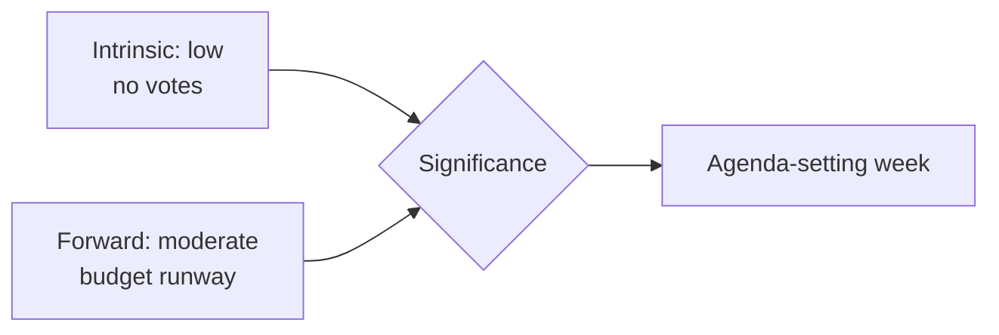

<!-- SPDX-FileCopyrightText: 2026 Hack23 AB -->
<!-- SPDX-License-Identifier: Apache-2.0 -->

# 🏷️ Significance Classification — Week Ahead
## Window: 1–5 June 2026 | Produced: 2026-05-29

**Classification:** UNCLASSIFIED // FOR PUBLIC RELEASE

## 🎯 Overall Significance Rating

- **Week-ahead significance:** 🟡 **MODERATE-LOW**
- **Rationale:** a non-plenary committee/group week with no scheduled floor votes; significance derives from *preparation* for the 15–18 June plenary and the upcoming draft 2027 budget, not from imminent decisions.
- **Time horizon:** 1–5 June 2026 (7-day forward window).
- **Confidence in classification:** 🟢 HIGH — anchored on the A2 plenary calendar.

## 📊 Significance Dimensions

| Dimension | Rating | Basis |
|---|---|---|
| Legislative impact (this week) | 🟢 LOW | No floor votes; committee-stage only |
| Agenda-setting impact | 🟡 MODERATE | Sets up June plenary + budget |
| Fiscal salience | 🟡 MODERATE-HIGH | 2027 budget pre-positioning amid widening deficits |
| Institutional drama | 🟢 LOW | No appointments/censure expected |
| External-action salience | 🟡 MODERATE | Treaty pipeline (Uzbekistan, Lebanon) advancing |

## 🧭 Why It Still Matters

- Committee weeks are where amendments and rapporteur lines are actually set — the floor merely ratifies them.
- The 2027 budget storyline crystallises this week even without a vote.
- The quiet window is itself newsworthy: it marks the hinge between the spring backlog clearance and the June legislative push.

## 🏷️ Classification Tags

- `committee-week` · `pre-plenary` · `budget-2027-prep` · `no-floor-votes` · `degraded-feeds`

**Bottom line:** Treat the week as **agenda-setting, not decision-making** — moderate-low intrinsic significance, moderate forward leverage.

