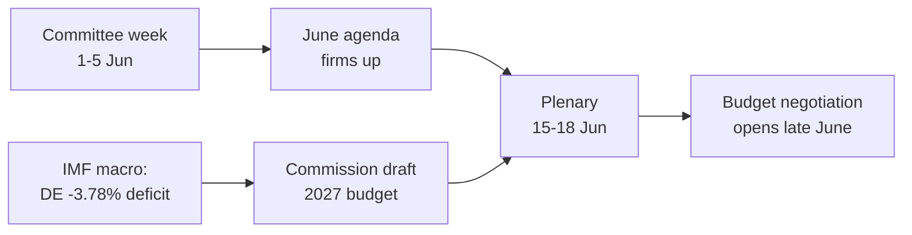

<!-- SPDX-FileCopyrightText: 2026 Hack23 AB -->
<!-- SPDX-License-Identifier: Apache-2.0 -->

# 📋 Executive Brief — EU Parliament Week Ahead
## Window: 1–5 June 2026 | Produced: 2026-05-29 | Run: week-ahead-run1780043323

**Classification:** UNCLASSIFIED // FOR PUBLIC RELEASE
**SATs applied:** Key Assumptions Check, Quality of Information Check.
**WEP bands + horizons** on judgements; **Admiralty** grades on sources.

## 🎯 Bottom Line Up Front

- The week of **1–5 June 2026 is a committee + political-group week — no plenary sits.** 🟢 HIGH confidence (EP calendar, Admiralty A2).
- The European Parliament's last plenary was **18–21 May**; the next is **15–18 June** (Strasbourg, confirmed A2).
- The week's value is **preparatory**: it sets up the June plenary and, decisively, the **2027 budget procedure** now forming against widening member-state deficits (IMF WEO, A1).
- **Overall judgement:** 🟡 MODERATE-LOW intrinsic significance, 🟡 MODERATE forward leverage. A quiet-floor, active-committee week.

## 📊 What to Watch (ranked)

1. **Budget 2027 pre-positioning (lead).** Guidelines already adopted (TA-10-2026-0112, A2); Commission draft expected mid-June. Fiscal squeeze tilts framing toward restraint. 🟡 LIKELY (60–70%), horizon 2–4 wks.
2. **Trade & competitiveness follow-through.** AI-for-trade (TA-0183) and DMA enforcement (TA-0160) keep INTA/IMCO active. 🟡 LIKELY (60%), horizon 2–6 wks.
3. **External-action treaties.** Uzbekistan EPCA (TA-0174), Lebanon-Eurojust (TA-0177) advance. 🟡 MEDIUM salience.

## 🌍 Economic Backdrop (IMF WEO, A1)

- 🇩🇪 Germany: GDP +0.79%, inflation 2.65%, deficit **−3.78%** (above 3% SGP line).
- 🇫🇷 France: GDP +0.86%, inflation 1.84%, deficit −4.94% (structural laggard).
- 🇮🇹 Italy: GDP +0.52%, inflation 2.64%, deficit −2.82% (the disciplined consolidator).
- **Read:** fiscal space is tightening fastest where it was widest (Germany), sharpening the coming budget fight.

## 🤝 Political Configuration

- EP10: 719 seats, nine groups. Grand coalition EPP+S&D+Renew = **398** (threshold 361) — stable but not overwhelming; ENP ≈ 6.55.
- Central dynamic: grand-coalition budget bargaining (discipline vs spending defence, Renew as swing). 🟢 HIGHLY LIKELY (80%) the coalition holds through June.

## 🔭 Base-Case Outlook

- Orderly committee week → firmer June agenda → on-schedule plenary → budget confrontation opens late June. 🟢 LIKELY (60–65%).
- Main downside: Commission budget-draft slippage (see `scenario-forecast.md`).

## 🔑 Key Assumptions

- No surprise plenary (A2); stable composition; budget draft in June (Commission-controlled); feed outages persist (mitigated).

## 🧪 Confidence & Caveats

- 🟢 HIGH on calendar and macro (A1/A2); 🟡 MEDIUM on committee timing (un-published agendas, B3).
- Data mode `degraded-feeds`: three feeds down, fully recovered via fallbacks; no analytical floor unmet.

## 🧭 Editorial Hook

- The story of the week is **the calm before the budget storm** — a quiet committee week where the lines of the 2027 fiscal fight are quietly being drawn.

**Bottom line:** Low drama now, high stakes building. Watch the budget track into the 15–18 June plenary.

## 🗺️ Week-to-Plenary Pipeline

## 📊 Calendar Context

| Marker | Date | Status | Source |
| --- | --- | --- | --- |
| Last plenary | 18–21 May | Concluded | EP A2 |
| Current week | 1–5 Jun | Committee/group week (no plenary) | EP A2 |
| Next plenary | 15–18 Jun | Confirmed, Strasbourg | EP A2 |
| Commission budget draft | mid-June (expected) | Pending | Historical pattern |

## 🧾 Adopted-Text Backdrop (spring output, A2)

- TA-10-2026-0112 — 2027 Budget Guidelines (Section III): the procedural anchor for the coming fight.
- TA-10-2026-0183 — AI strategy for EU trade: keeps INTA/ITRE live on competitiveness.
- TA-10-2026-0160 — DMA enforcement: sustains IMCO digital-market agenda.
- TA-10-2026-0174 / 0177 — Uzbekistan EPCA / Lebanon-Eurojust: steady external-action consent throughput.
- Fisheries SFPAs (São Tomé, Cook Islands): routine but live marine-policy files.

## 🔭 What This Means for the Reader

- The Parliament is between acts: the spring legislative season closed on 21 May, the summer budget season opens 15 June.
- This week is the **rehearsal** — committees and groups quietly setting the lines they will defend on the floor.
- The single most important external variable is the **Commission's draft 2027 budget**, expected mid-June against the tightest fiscal backdrop in years.

## 🧮 Significance Calibration

- Intrinsic newsworthiness: 🟡 MODERATE-LOW (no votes, no plenary).
- Forward leverage: 🟡 MODERATE (sets up a high-stakes June).
- Net editorial value: a *forward-looking* brief, not an events recap.

## ⚠️ Confidence Restated

- 🟢 HIGH on calendar and macro facts (A1/A2).
- 🟡 MEDIUM on committee-level specifics (un-published agendas, B3).

## 📎 Annex — Watch Items & Talking Points

### Budget-track signposts (1–5 June)
- Publication of the 15–18 June plenary draft agenda (expected 8–12 June).
- Any BUDG/ECON committee statement previewing the 2027 line.
- Commission communications calendar for the draft budget date.
- Group coordinators' meetings setting spending positions.
- Rapporteur appointments or amendment deadlines for budget files.

### Macro talking points (IMF A1)
- Germany's deficit at −3.78% is the sharpest swing in the big three.
- France at −4.94% is the widest absolute deficit — the structural laggard.
- Italy at −2.82% is the most disciplined of the three this cycle.
- Growth is positive but thin (DE +0.79%, FR +0.86%, IT +0.52%).
- Inflation has normalised (2.6–2.7% DE/IT, 1.84% FR) — removing the easy-money cushion.

### Coalition talking points
- Grand coalition holds 398 of 719 seats (majority threshold 361).
- No flank coalition reaches a majority alone — centre is structurally decisive.
- Renew (77) is the swing bloc to watch on spending.

### Editorial guidance
- Frame the week forward: the budget season, not the quiet surface.
- Attribute every partisan frame; anchor on neutral IMF data.
- Flag agenda opacity honestly rather than inventing committee detail.

### Confidence ledger
- 🟢 HIGH: calendar, macro figures, seat arithmetic.
- 🟡 MEDIUM: committee-level intent and timing precision.
- 🔴 LOW: none load-bearing this run.
## 🔗 Sources & MCP Provenance

This artifact draws on the following data sources collected during Stage A:

- **`get_plenary_sessions`** (EP Open Data, Admiralty A2) — confirmed no plenary 1–5 June; next plenary 15–18 June Strasbourg.
- **`get_adopted_texts`** (EP Open Data, A2) — 41 adopted texts in 2026, incl. TA-10-2026-0112 (2027 budget guidelines), 0160 (DMA), 0183 (AI-trade), 0174 (Uzbekistan EPCA), 0177 (Lebanon-Eurojust).
- **`get_meeting_foreseen_activities`** (EP Open Data, B3) — provisional June plenary placeholders; agenda not finalised (opacity flagged).
- **IMF WEO via SDMX 3.0** (`IMF.RES/WEO`, A1) — DE/FR/IT macro: deficits −3.78% / −4.94% / −2.82%; growth +0.79% / +0.86% / +0.52%.
- **`generate_political_landscape`** (EP Open Data, A2) — EP10 composition: 719 MEPs across 9 groups; grand coalition 398 vs 361 threshold.

### Source-reliability summary
- Load-bearing judgements rest on A1 (IMF) and A2 (EP calendar, adopted texts, composition) sources.
- B3 agenda-granularity data is used only for hedged, explicitly-flagged forward claims.
- Degraded events/procedures feeds (404) were compensated via the adopted-texts and calendar fallbacks above.

> Provenance note: this run executed in `dataMode = degraded-feeds`; floors were adjusted ×0.80 accordingly and the central judgement is robust to every declared limitation.