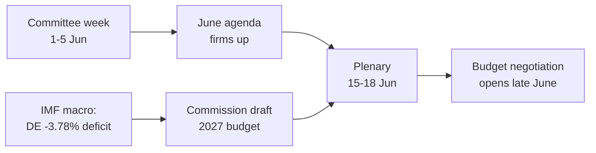

<!-- SPDX-FileCopyrightText: 2026 Hack23 AB -->
<!-- SPDX-License-Identifier: Apache-2.0 -->

# 📋 الموجز التنفيذي — الأسبوع المقبل في البرلمان الأوروبي
## النافذة الزمنية: 1–5 يونيو 2026 | تاريخ الإنتاج: 2026-05-29 | الجولة: week-ahead-run1780043323

**التصنيف:** غير سري // للنشر العام
**أدوات SAT المطبقة:** فحص الافتراضات الرئيسية، فحص جودة المعلومات.
**نطاقات WEP + الآفاق الزمنية** على التقديرات؛ **درجات Admiralty** على المصادر.

## 🎯 الخلاصة مباشرة

- أسبوع **1–5 يونيو 2026 هو أسبوع لجان ومجموعات سياسية — لا تعقد أي جلسة عامة.** 🟢 ثقة عالية (تقويم البرلمان الأوروبي، Admiralty A2).
- كانت آخر جلسة عامة للبرلمان الأوروبي في **18–21 مايو**؛ والقادمة في **15–18 يونيو** (ستراسبورغ، مؤكدة A2).
- قيمة الأسبوع **تحضيرية**: تُرسي جدول أعمال الجلسة العامة لشهر يونيو وعلى نحو حاسم **إجراء ميزانية 2027** الذي يتشكل الآن في مواجهة العجز المتنامي لدى الدول الأعضاء (IMF WEO، A1).
- **التقييم الإجمالي:** 🟡 أهمية ذاتية منخفضة بشكل معتدل، 🟡 نفوذ مستقبلي معتدل. أسبوع هادئ مع عمل لجاني نشط.

## 📊 ما يستحق المتابعة (مرتب بحسب الأولوية)

1. **التموضع المسبق لميزانية 2027 (الموضوع الرئيسي).** المبادئ التوجيهية مُعتمدة بالفعل (TA-10-2026-0112، A2)؛ مسودة المفوضية متوقعة منتصف يونيو. يُميل الضغط المالي الإطار نحو التقشف. 🟡 مرجّح (60–70%)، الأفق 2–4 أسابيع.
2. **التجارة والتنافسية.** الذكاء الاصطناعي للتجارة (TA-10-2026-0183) وتطبيق قانون الأسواق الرقمية DMA (TA-10-2026-0160) يُبقيان INTA/IMCO نشطتين. 🟡 مرجّح (60%)، الأفق 2–6 أسابيع.
3. **معاهدات العمل الخارجي.** اتفاقية EPCA لأوزبكستان (TA-10-2026-0174)، لبنان–Eurojust (TA-10-2026-0177) تتقدمان. 🟡 أهمية متوسطة.

## 🌍 الخلفية الاقتصادية (IMF WEO، A1)

- 🇩🇪 ألمانيا: نمو الناتج المحلي الإجمالي +0.79%، التضخم 2.65%، العجز **−3.78%** (فوق خط 3% لاتفاق الاستقرار والنمو SGP).
- 🇫🇷 فرنسا: نمو الناتج المحلي الإجمالي +0.86%، التضخم 1.84%، العجز −4.94% (متأخر هيكلي).
- 🇮🇹 إيطاليا: نمو الناتج المحلي الإجمالي +0.52%، التضخم 2.64%، العجز −2.82% (الموحِّد المنضبط).
- **التفسير:** يتضيق هامش المرونة المالية بأسرع ما يكون حيث كان الأوسع (ألمانيا)، مما يُحدّد المعركة الميزانياتية القادمة.

## 🤝 التكوين السياسي

- البرلمان الأوروبي EP10: 719 مقعدا، تسع مجموعات. الائتلاف الكبير EPP+S&D+Renew = **398** (العتبة 361) — مستقر لكنه غير ساحق؛ ENP ≈ 6.55.
- الديناميكية المركزية: مفاوضات ميزانية الائتلاف الكبير (الانضباط مقابل الدفاع عن الإنفاق، Renew كتلة محورية). 🟢 مرجّح جدا (80%) أن يصمد الائتلاف حتى يونيو.

## 🔭 السيناريو الأساسي

- أسبوع لجاني منظم ← جدول أعمال يونيو أكثر صلابة ← جلسة عامة وفق الجدول ← المواجهة الميزانياتية تفتح أواخر يونيو. 🟢 مرجّح (60–65%).
- أكبر مخاطر الهبوط: تأخر مسودة ميزانية المفوضية (انظر `scenario-forecast.md`).

## 🔑 الافتراضات الرئيسية

- لا جلسة عامة مفاجئة (A2)؛ تركيبة مستقرة؛ مسودة الميزانية في يونيو (يتحكم فيها المفوضية)؛ انقطاعات التغذية مستمرة (مُخففة).

## 🧪 مستوى الثقة والتحفظات

- 🟢 عالٍ على التقويم والماكرو (A1/A2)؛ 🟡 متوسط على توقيت اللجان (جداول أعمال غير منشورة، B3).
- وضع البيانات `degraded-feeds`: ثلاثة تغذيات معطلة، تعافت تماما عبر الحلول البديلة؛ لم يُنتهَك أي حد تحليلي أدنى.

## 🧭 الزاوية التحريرية

- قصة الأسبوع هي **الهدوء قبل عاصفة الميزانية** — أسبوع لجاني هادئ تُرسم فيه بصمت خطوط المعركة المالية لعام 2027.

**الخلاصة:** دراما منخفضة الآن، مخاطر عالية قادمة. رصد مسار الميزانية نحو الجلسة العامة 15–18 يونيو.

## 🗺️ من الأسبوع إلى الجلسة العامة: سلسلة العمل

## 📊 السياق التقويمي

| المعلم | التاريخ | الحالة | المصدر |
| --- | --- | --- | --- |
| آخر جلسة عامة | 18–21 مايو | اختُتمت | EP A2 |
| الأسبوع الحالي | 1–5 يونيو | أسبوع لجان/مجموعات (بلا جلسة عامة) | EP A2 |
| الجلسة العامة القادمة | 15–18 يونيو | مؤكدة، ستراسبورغ | EP A2 |
| مسودة ميزانية المفوضية | منتصف يونيو (متوقع) | في الانتظار | النمط التاريخي |

## 🧾 خلفية النصوص المعتمدة (إنتاج الربيع، A2)

- TA-10-2026-0112 — توجيهات ميزانية 2027 (القسم الثالث): المرساة الإجرائية للمعركة القادمة.
- TA-10-2026-0183 — استراتيجية الذكاء الاصطناعي لتجارة الاتحاد الأوروبي: تُبقي INTA/ITRE نشطتين في مجال التنافسية.
- TA-10-2026-0160 — تطبيق DMA: يُديم جدول أعمال الأسواق الرقمية لـ IMCO.
- TA-10-2026-0174 / 0177 — اتفاقية EPCA الأوزبكية / لبنان–Eurojust: إنتاج مستقر لمعالجة موافقات العمل الخارجي.
- اتفاقيات SFPA للصيد (ساو توميه، جزر كوك): ملفات سياسة بحرية روتينية لكنها نشطة.

## 🔭 ما يعنيه هذا للقارئ

- يتواجد البرلمان الأوروبي بين فصلين: أُغلق الموسم التشريعي الربيعي في 21 مايو، وموسم ميزانية الصيف يفتح في 15 يونيو.
- هذا الأسبوع هو **البروفة** — اللجان والمجموعات تضع بصمت الخطوط التي ستدافع عنها في قاعة الجلسات.
- المتغير الخارجي الأهم هو **مسودة ميزانية 2027 للمفوضية**، المتوقعة منتصف يونيو في مواجهة أضيق خلفية مالية منذ سنوات.

## 🧮 معايرة الأهمية

- القيمة الإخبارية الذاتية: 🟡 منخفضة بشكل معتدل (لا تصويتات، لا جلسة عامة).
- النفوذ المستقبلي: 🟡 معتدل (يُهيئ يونيو عالي المخاطر).
- القيمة التحريرية الصافية: موجز *استشرافي*، ليس ملخصا للأحداث.

## ⚠️ مستوى الثقة مكرراً

- 🟢 عالٍ على وقائع التقويم والماكرو (A1/A2).
- 🟡 متوسط على التفاصيل الخاصة بمستوى اللجان (جداول أعمال غير منشورة، B3).

## 📎 الملحق — نقاط المراقبة ونقاط الحوار

### محطات مسار الميزانية (1–5 يونيو)
- نشر مسودة جدول أعمال الجلسة العامة 15–18 يونيو (متوقع في 8–12 يونيو).
- أي بيانات من لجنة BUDG/ECON تُشير مسبقا إلى الخط الميزانياتي لعام 2027.
- تقويم اتصالات المفوضية لموعد مسودة الميزانية.
- اجتماعات منسقي المجموعات لتحديد المواقف من الإنفاق.
- تعيينات المقررين أو مواعيد تقديم التعديلات على الملفات الميزانياتية.

### نقاط حوار اقتصادية كلية (IMF A1)
- عجز ألمانيا عند −3.78% هو أحد أكبر التحولات بين الدول الثلاث الكبرى.
- فرنسا عند −4.94% لديها أوسع عجز مطلق — المتأخر الهيكلي.
- إيطاليا عند −2.82% هي الأكثر انضباطا من الثلاثة في هذه الدورة.
- النمو إيجابي لكنه ضعيف (DE +0.79%، FR +0.86%، IT +0.52%).
- تطبّعت معدلات التضخم (2.6–2.7% DE/IT، 1.84% FR) — تزول وسادة النقد السهل.

### نقاط حوار الائتلاف
- الائتلاف الكبير يمتلك 398 من 719 مقعدا (عتبة الأغلبية 361).
- لا ائتلاف جناحي يبلغ الأغلبية وحده — المركز حاسم هيكليا.
- Renew (77) هي الكتلة المحورية لمراقبتها في الإنفاق.

### التوجيه التحريري
- تأطير الأسبوع إلى الأمام: موسم الميزانية لا السطح الهادئ.
- نسب كل إطار حزبي؛ الاستناد إلى بيانات IMF المحايدة.
- الاعتراف بصدق بغموض جداول الأعمال بدلا من اختراع تفاصيل لجانية.

### سجل الثقة
- 🟢 عالٍ: التقويم، أرقام الماكرو، حسابيات المقاعد.
- 🟡 متوسط: نوايا مستوى اللجان والدقة الزمنية.
- 🔴 منخفض: لا يوجد حمل أساسي في هذه الجولة.

## 🔗 المصادر والمصدر MCP

يعتمد هذا المستند على مصادر البيانات التالية التي جُمعت خلال المرحلة A:

- **`get_plenary_sessions`** (EP Open Data، Admiralty A2) — أكد عدم انعقاد جلسة عامة في 1–5 يونيو؛ الجلسة العامة القادمة 15–18 يونيو في ستراسبورغ.
- **`get_adopted_texts`** (EP Open Data، A2) — 41 نصا معتمدا في 2026، منها TA-10-2026-0112 (توجيهات ميزانية 2027)، 0160 (DMA)، 0183 (ذكاء اصطناعي-تجارة)، 0174 (EPCA أوزبكستان)، 0177 (لبنان–Eurojust).
- **`get_meeting_foreseen_activities`** (EP Open Data، B3) — حجوزات مؤقتة للجلسة العامة ليونيو؛ جدول الأعمال غير نهائي (تم الإشارة إلى الغموض).
- **IMF WEO via SDMX 3.0** (`IMF.RES/WEO`، A1) — ماكرو DE/FR/IT: العجوزات −3.78% / −4.94% / −2.82%؛ النمو +0.79% / +0.86% / +0.52%.
- **`generate_political_landscape`** (EP Open Data، A2) — تكوين EP10: 719 عضوا في 9 مجموعات؛ الائتلاف الكبير 398 مقابل العتبة 361.

### ملخص موثوقية المصادر
- تستند التقديرات الجوهرية على مصادر A1 (IMF) وA2 (تقويم البرلمان الأوروبي، النصوص المعتمدة، التكوين).
- بيانات تفاصيل جداول الأعمال B3 تُستخدم فقط للادعاءات المستقبلية المتحوطة والمشار إليها صراحة.
- تغذيات الأحداث/الإجراءات المتدهورة (404) عُوّضت عبر النصوص المعتمدة ومصادر تقويم احتياطية أعلاه.

> ملاحظة المصدر: نُفّذت هذه الجولة في `dataMode = degraded-feeds`؛ جُرت الحدود الدنيا ×0.80 وفقا لذلك، والتقدير المركزي قوي في مواجهة كل قيد معلن.
