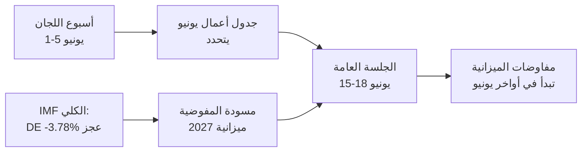

<!-- SPDX-FileCopyrightText: 2026 Hack23 AB -->
<!-- SPDX-License-Identifier: Apache-2.0 -->

# 📋 موجز تنفيذي — الأسبوع المقبل في البرلمان الأوروبي
## الفترة: 1–5 يونيو 2026 | تاريخ الإصدار: 2026-05-29 | التشغيل: week-ahead-run1780043323

**التصنيف:** غير سري // للنشر العام
**تقنيات التحليل المطبقة (SAT):** التحقق من الافتراضات الرئيسية، التحقق من جودة المعلومات.
**نطاقات WEP + الآفاق الزمنية** على الأحكام؛ درجات **Admiralty** على المصادر.

## 🎯 Bottom Line Up Front

- أسبوع **1–5 يونيو 2026 هو أسبوع لجان ومجموعات سياسية — لا تنعقد أي جلسة عامة.** 🟢 ثقة عالية (تقويم البرلمان الأوروبي، Admiralty A2).
- كانت آخر جلسة عامة للبرلمان الأوروبي في **18–21 مايو**؛ والجلسة التالية في **15–18 يونيو** (ستراسبورغ، مؤكدة A2).
- قيمة الأسبوع هي **تحضيرية**: فهي تمهّد لجلسة يونيو العامة، وبشكل حاسم، **لإجراء ميزانية 2027** الذي يتشكّل الآن في مواجهة عجوزات متوسعة في الدول الأعضاء (IMF WEO، A1).
- **الحكم العام:** 🟡 أهمية جوهرية معتدلة-منخفضة، 🟡 تأثير مستقبلي معتدل. أسبوع هادئ مع لجان نشطة.

## 📊 What to Watch (ranked)

1. **التموضع المسبق لميزانية 2027 (المسار الرئيسي).** المبادئ التوجيهية معتمدة بالفعل (TA-10-2026-0112، A2)؛ مسودة المفوضية متوقعة منتصف يونيو. يميل الضغط المالي نحو التحفظ. 🟡 محتمل (60–70%)، الأفق 2–4 أسابيع.
2. **التجارة والتنافسية: متابعة.** الذكاء الاصطناعي للتجارة (TA-0183) وتطبيق DMA (TA-0160) يُبقيان INTA/IMCO نشطتين. 🟡 محتمل (60%)، الأفق 2–6 أسابيع.
3. **معاهدات السياسة الخارجية.** اتفاقية الشراكة مع أوزبكستان (TA-0174)، لبنان-Eurojust (TA-0177) تتقدم. 🟡 أهمية متوسطة.

## 🌍 Economic Backdrop (IMF WEO, A1)

- 🇩🇪 ألمانيا: الناتج المحلي الإجمالي +0.79%، التضخم 2.65%، العجز **−3.78%** (فوق حد SGP البالغ 3%).
- 🇫🇷 فرنسا: الناتج المحلي الإجمالي +0.86%، التضخم 1.84%، العجز −4.94% (المتأخرة هيكليًا).
- 🇮🇹 إيطاليا: الناتج المحلي الإجمالي +0.52%، التضخم 2.64%، العجز −2.82% (المُوحِّد المنضبط).
- **القراءة:** الهامش المالي يضيق أسرع ما يكون حيث كان الأوسع (ألمانيا)، مما يحدّ المعركة الميزانياتية المقبلة.

## 🤝 Political Configuration

- EP10: 719 مقعدًا، تسع مجموعات. الائتلاف الكبير EPP+S&D+Renew = **398** (العتبة 361) — مستقر لكن ليس ساحقًا؛ ENP ≈ 6.55.
- الديناميكية المركزية: مفاوضات ميزانية الائتلاف الكبير (الانضباط مقابل الإنفاق الدفاعي، Renew كمُرجِّح). 🟢 محتمل جدًا (80%) أن يصمد الائتلاف خلال يونيو.

## 🔭 Base-Case Outlook

- أسبوع لجان منتظم → جدول أعمال يونيو أكثر صلابة → جلسة عامة وفق الجدول → مواجهة الميزانية تبدأ في أواخر يونيو. 🟢 محتمل (60–65%).
- المخاطر الرئيسية الهبوطية: تأخر مسودة ميزانية المفوضية (انظر `scenario-forecast.md`).

## 🔑 Key Assumptions

- لا جلسة عامة مفاجئة (A2)؛ تشكيل مستقر؛ مسودة الميزانية في يونيو (تحت سيطرة المفوضية)؛ انقطاعات البيانات مستمرة (مُخففة).

## 🧪 Confidence & Caveats

- 🟢 عالية على التقويم والبيانات الكلية (A1/A2)؛ 🟡 متوسطة على الجدول الزمني للجان (جداول أعمال غير منشورة، B3).
- وضع البيانات `تدفقات متدهورة`: ثلاثة تدفقات معطلة، استُعيد بالكامل عبر مصادر بديلة؛ لم يُترك أي حد أدنى تحليلي غير مستوفى.

## 🧭 Editorial Hook

- قصة الأسبوع هي **الهدوء قبل عاصفة الميزانية** — أسبوع لجان هادئ تُرسم فيه خطوط المعركة المالية لعام 2027 بصمت.

**الخلاصة:** دراما منخفضة الآن، ومخاطر عالية تتراكم. تابع مسار الميزانية نحو الجلسة العامة في 15–18 يونيو.

## 🗺️ Week-to-Plenary Pipeline

## 📊 Calendar Context

| المعلم | التاريخ | الحالة | المصدر |
| --- | --- | --- | --- |
| آخر جلسة عامة | 18–21 مايو | منتهية | EP A2 |
| الأسبوع الحالي | 1–5 يونيو | أسبوع لجان/مجموعات (بدون جلسة عامة) | EP A2 |
| الجلسة العامة التالية | 15–18 يونيو | مؤكدة، ستراسبورغ | EP A2 |
| مسودة ميزانية المفوضية | منتصف يونيو (متوقعة) | معلقة | النمط التاريخي |

## 🧾 Adopted-Text Backdrop (spring output, A2)

- TA-10-2026-0112 — مبادئ توجيهية لميزانية 2027 (القسم الثالث): المرساة الإجرائية للمعركة المقبلة.
- TA-10-2026-0183 — استراتيجية الذكاء الاصطناعي لتجارة الاتحاد الأوروبي: تُبقي INTA/ITRE نشطتين في مجال التنافسية.
- TA-10-2026-0160 — تطبيق DMA: يحافظ على أجندة IMCO للسوق الرقمية.
- TA-10-2026-0174 / 0177 — اتفاقية الشراكة مع أوزبكستان / لبنان-Eurojust: إنتاجية ثابتة لموافقات العمل الخارجي.
- اتفاقيات الصيد SFPA (ساو تومي، جزر كوك): ملفات السياسة البحرية الاعتيادية لكنها نشطة.

## 🔭 What This Means for the Reader

- البرلمان بين فصلين: موسم التشريع الربيعي أُغلق في 21 مايو، وموسم الميزانية الصيفي يفتح في 15 يونيو.
- هذا الأسبوع هو **البروفة العامة** — اللجان والمجموعات تضع بهدوء المواقف التي ستدافع عنها في الجلسة العامة.
- أهم متغير خارجي هو **مسودة المفوضية لميزانية 2027**، المتوقعة منتصف يونيو في أضيق خلفية مالية منذ سنوات.

## 🧮 Significance Calibration

- الأهمية الإخبارية الجوهرية: 🟡 معتدلة-منخفضة (لا تصويتات، لا جلسة عامة).
- التأثير المستقبلي: 🟡 معتدل (يمهّد ليونيو مرتفع المخاطر).
- القيمة التحريرية الصافية: موجز *استشرافي*، ليس تقرير أحداث.

## ⚠️ Confidence Restated

- 🟢 عالية على حقائق التقويم والاقتصاد الكلي (A1/A2).
- 🟡 متوسطة على التفاصيل على مستوى اللجان (جداول أعمال غير منشورة، B3).

## 📎 Annex — Watch Items & Talking Points

### نقاط إشارة مسار الميزانية (1–5 يونيو)
- نشر مسودة جدول الأعمال الأولي للجلسة العامة في 15–18 يونيو (متوقع 8–12 يونيو).
- أي تصريح من لجنة BUDG/ECON يستعرض خط ميزانية 2027.
- تقويم مواصلات المفوضية لموعد مسودة الميزانية.
- اجتماعات منسقي المجموعات لتحديد مواقف الإنفاق.
- تعيينات المقررين أو مواعيد التعديلات لملفات الميزانية.

### نقاط الحديث الاقتصاد الكلي (IMF A1)
- عجز ألمانيا عند −3.78% هو أحدّ تحوّل بين الدول الثلاث الكبرى.
- فرنسا عند −4.94% تمتلك أعرض عجز مطلق — المتأخرة هيكليًا.
- إيطاليا عند −2.82% هي الأكثر انضباطًا بين الثلاثة في هذه الدورة.
- النمو إيجابي لكن ضئيل (DE +0.79%، FR +0.86%، IT +0.52%).
- التضخم تطبّع (2.6–2.7% DE/IT، 1.84% FR) — وسادة السياسة النقدية السهلة اختفت.

### نقاط الحديث عن الائتلاف
- الائتلاف الكبير يمتلك 398 من 719 مقعدًا (عتبة الأغلبية 361).
- لا ائتلاف جناحي يحقق الأغلبية منفردًا — المركز هو الفاصل هيكليًا.
- Renew (77) هي المجموعة المرجِّحة التي يجب مراقبتها في مسائل الإنفاق.

### الإرشادات التحريرية
- إطار الأسبوع نحو المستقبل: موسم الميزانية، لا السطح الهادئ.
- إسناد كل إطار حزبي؛ التأسيس على بيانات IMF المحايدة.
- الإفصاح بصدق عن غموض جدول الأعمال بدلًا من اختلاق تفاصيل اللجان.

### سجل الثقة
- 🟢 عالية: التقويم، الأرقام الكلية، حساب المقاعد.
- 🟡 متوسطة: النوايا على مستوى اللجان ودقة التوقيت.
- 🔴 منخفضة: لا عناصر حاملة في هذه التشغيلة.

## 🔗 Sources & MCP Provenance

يستند هذا الأثر إلى مصادر البيانات التالية المُجمَّعة خلال المرحلة A:

- **`get_plenary_sessions`** (البيانات المفتوحة للبرلمان الأوروبي، Admiralty A2) — تأكيد عدم انعقاد جلسة عامة في 1–5 يونيو؛ الجلسة العامة التالية 15–18 يونيو ستراسبورغ.
- **`get_adopted_texts`** (البيانات المفتوحة للبرلمان الأوروبي، A2) — 41 نصًا معتمدًا في 2026، بما فيها TA-10-2026-0112 (مبادئ ميزانية 2027)، 0160 (DMA)، 0183 (الذكاء الاصطناعي-التجارة)، 0174 (أوزبكستان EPCA)، 0177 (لبنان-Eurojust).
- **`get_meeting_foreseen_activities`** (البيانات المفتوحة للبرلمان الأوروبي، B3) — عناصر نائبة مؤقتة للجلسة العامة ليونيو؛ جدول الأعمال لم يتحدد بعد (الغموض مُشار إليه).
- **IMF WEO via SDMX 3.0** (`IMF.RES/WEO`، A1) — الاقتصاد الكلي DE/FR/IT: العجوزات −3.78% / −4.94% / −2.82%؛ النمو +0.79% / +0.86% / +0.52%.
- **`generate_political_landscape`** (البيانات المفتوحة للبرلمان الأوروبي، A2) — تشكيلة EP10: 719 عضوًا في 9 مجموعات؛ الائتلاف الكبير 398 مقابل عتبة 361.

### ملخص موثوقية المصادر
- الأحكام الحاملة تستند إلى A1 (IMF) وA2 (تقويم البرلمان الأوروبي، النصوص المعتمدة، التشكيلة).
- بيانات B3 حول تفاصيل جدول الأعمال تُستخدم فقط لادعاءات مستقبلية دقيقة ومُشار إليها صراحةً.
- تدفقات الأحداث/الإجراءات المتدهورة (404) عُوِّضت عبر النصوص المعتمدة ومصادر التقويم البديلة أعلاه.

> ملاحظة الإسناد: نُفِّذت هذه التشغيلة في وضع `dataMode = degraded-feeds`؛ جُعلت الحدود الدنيا ×0.80 وفقًا لذلك، والحكم المركزي متين في مواجهة كل قيد مُعلَن.
