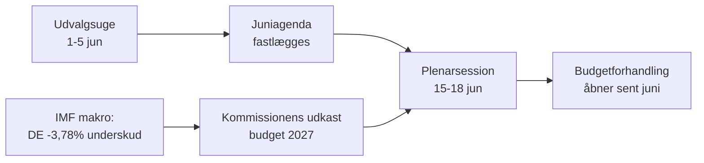

<!-- SPDX-FileCopyrightText: 2026 Hack23 AB -->
<!-- SPDX-License-Identifier: Apache-2.0 -->

# 📋 Ledelsesbriefing — Europa-Parlamentets kommende uge
## Vindue: 1.–5. juni 2026 | Udarbejdet: 2026-05-29 | Kørsel: week-ahead-run1780043323

**Klassifikation:** IKKE-KLASSIFICERET // TIL OFFENTLIG FRIGIVELSE
**Anvendte SAT:** Kontrol af nøgleforudsætninger, Kontrol af informationskvalitet.
**WEP-bånd + horisonter** på vurderinger; **Admiralty**-grader på kilder.

## 🎯 Bottom Line Up Front

- Ugen **1.–5. juni 2026 er en udvalgs- og politisk gruppes uge — ingen plenarsession afholdes.** 🟢 HØJ konfidens (EP-kalender, Admiralty A2).
- Europa-Parlamentets seneste plenarsession var **18.–21. maj**; den næste er **15.–18. juni** (Strasbourg, bekræftet A2).
- Ugens værdi er **forberedende**: den lægger grunden for juniplenumet og, afgørende, **budgetproceduren for 2027**, der nu tager form mod tiltagende underskud i medlemsstaterne (IMF WEO, A1).
- **Overordnet vurdering:** 🟡 MODERAT-LAV iboende relevans, 🟡 MODERAT fremadrettet gearing. En rolig gulvuge med aktive udvalg.

## 📊 What to Watch (ranked)

1. **Forpositionering til budget 2027 (primært spor).** Retningslinjer allerede vedtaget (TA-10-2026-0112, A2); Kommissionens udkast forventes medio juni. Finanspolitisk stramning præger mod tilbageholdenhed. 🟡 SANDSYNLIGT (60–70 %), horisont 2–4 uger.
2. **Opfølgning handel og konkurrenceevne.** AI til handel (TA-0183) og DMA-håndhævelse (TA-0160) holder INTA/IMCO aktive. 🟡 SANDSYNLIGT (60 %), horisont 2–6 uger.
3. **Udenrigspolitiske traktater.** Usbekistan EPCA (TA-0174), Libanon-Eurojust (TA-0177) skrider frem. 🟡 MIDDEL relevans.

## 🌍 Economic Backdrop (IMF WEO, A1)

- 🇩🇪 Tyskland: BNP +0,79 %, inflation 2,65 %, underskud **−3,78 %** (over SGP's 3 %-grænse).
- 🇫🇷 Frankrig: BNP +0,86 %, inflation 1,84 %, underskud −4,94 % (strukturelt bagud).
- 🇮🇹 Italien: BNP +0,52 %, inflation 2,64 %, underskud −2,82 % (den disciplinerede konsolidator).
- **Konklusion:** det finanspolitiske råderum indsnævres hurtigst, hvor det var størst (Tyskland), hvilket skærper den kommende budgetkamp.

## 🤝 Political Configuration

- EP10: 719 pladser, ni grupper. Storkoalition EPP+S&D+Renew = **398** (tærskel 361) — stabil men ikke overvældende; ENP ≈ 6,55.
- Central dynamik: storkoalitionens budgetforhandlinger (disciplin vs. forsvarsudgifter, Renew som vippegruppe). 🟢 MEGET SANDSYNLIGT (80 %) at koalitionen holder hele juni.

## 🔭 Base-Case Outlook

- Ordentlig udvalgsuge → fastere juniagenda → planlagt plenum → budgetkonfrontation åbner sent i juni. 🟢 SANDSYNLIGT (60–65 %).
- Primær nedadgående risiko: forsinkelse af Kommissionens budgetudkast (jf. `scenario-forecast.md`).

## 🔑 Key Assumptions

- Intet overraskende plenum (A2); stabil sammensætning; budgetudkast i juni (Kommissions-kontrolleret); feednedbrud vedvarer (afbødet).

## 🧪 Confidence & Caveats

- 🟢 HØJ for kalender og makro (A1/A2); 🟡 MIDDEL for udvalgets tidsmæssige præcision (uoffentliggjorte dagsordener, B3).
- Datatilstand `nedgraderede feeds`: tre feeds nede, fuldt genoprettet via reservekilder; intet analytisk gulv uopfyldt.

## 🧭 Editorial Hook

- Ugens fortælling er **stilheden før budgetstormen** — en stille udvalgsuge, hvor linjerne til den finanspolitiske kamp i 2027 stille trækkes op.

**Konklusion:** Lav dramatik nu, høje indsatser opbygges. Følg budgetsporet frem mod plenarsessionen 15.–18. juni.

## 🗺️ Week-to-Plenary Pipeline

## 📊 Calendar Context

| Markering | Dato | Status | Kilde |
| --- | --- | --- | --- |
| Seneste plenarsession | 18.–21. maj | Afsluttet | EP A2 |
| Indeværende uge | 1.–5. jun | Udvalgs-/gruppeuge (intet plenum) | EP A2 |
| Næste plenarsession | 15.–18. jun | Bekræftet, Strasbourg | EP A2 |
| Kommissionens budgetudkast | medio juni (forventet) | Afventer | Historisk mønster |

## 🧾 Adopted-Text Backdrop (spring output, A2)

- TA-10-2026-0112 — Retningslinjer for budget 2027 (afsnit III): det proceduremæssige ankerpunkt for den kommende kamp.
- TA-10-2026-0183 — AI-strategi for EU's handel: holder INTA/ITRE aktive på konkurrenceevne.
- TA-10-2026-0160 — DMA-håndhævelse: opretholder IMCO's digitale markedsdagsorden.
- TA-10-2026-0174 / 0177 — Usbekistan EPCA / Libanon-Eurojust: stabil ekstern aktionsgennemstrømning via samtykke.
- Fiskeri SFPA'er (São Tomé, Cookøerne): rutinepræget men aktive havpolitiske sager.

## 🔭 What This Means for the Reader

- Parlamentet befinder sig mellem to akter: forårssæsonens lovgivningsrunde afsluttedes den 21. maj; sommerens budgetsæson åbner den 15. juni.
- Denne uge er **generalprøven** — udvalg og grupper fastlægger i stilhed de positioner, de vil forsvare i plenarsalen.
- Den vigtigste eksterne variabel er **Kommissionens udkast til budget 2027**, som forventes medio juni mod den strammeste finanspolitiske baggrund i mange år.

## 🧮 Significance Calibration

- Iboende nyhedsværdi: 🟡 MODERAT-LAV (ingen afstemninger, intet plenum).
- Fremadrettet gearing: 🟡 MODERAT (lægger op til en begivenhedsrig juni).
- Nettoredigerede værdi: en *fremadrettet* briefing, ikke en begivenhedsrapport.

## ⚠️ Confidence Restated

- 🟢 HØJ for kalender og makrofakta (A1/A2).
- 🟡 MIDDEL for udvalgsspecifikke detaljer (uoffentliggjorte dagsordener, B3).

## 📎 Annex — Watch Items & Talking Points

### Budgetsporets signalpunkter (1.–5. juni)
- Offentliggørelse af det foreløbige dagsordensudkast for plenarsessionen 15.–18. juni (forventet 8.–12. juni).
- Eventuelle udtalelser fra BUDG/ECON-udvalget om 2027-budgetlinjen.
- Kommissionens kommunikationskalender for datoen for budgetudkastet.
- Gruppekoordinatormøder til fastlæggelse af udgiftspositioner.
- Udpegelse af ordførere eller fristdatoer for ændringsforslag til budgetfiler.

### Makroøkonomiske samtalepunkter (IMF A1)
- Tysklands underskud på −3,78 % er det skarpeste skifte blandt de tre store.
- Frankrig på −4,94 % har det bredeste absolutte underskud — det strukturelt bagude land.
- Italien på −2,82 % er det mest disciplinerede af de tre i denne cyklus.
- Væksten er positiv men svag (DE +0,79 %, FR +0,86 %, IT +0,52 %).
- Inflationen er normaliseret (2,6–2,7 % DE/IT, 1,84 % FR) — den lette pengepolitiske pude er væk.

### Koalitionens samtalepunkter
- Storkoalitionen har 398 af 719 pladser (majoritetstærskel 361).
- Ingen flankkoalition når alene et flertal — centrum er strukturelt afgørende.
- Renew (77) er den vippegruppe, der skal følges på udgifter.

### Redaktionel vejledning
- Indram ugen fremad: budgetsæsonen, ikke den rolige overflade.
- Tilskriv enhver partipolitisk ramme; forankr i neutral IMF-data.
- Flagger agendaopacitet ærligt frem for at opfinde udvalgsdetaljer.

### Konfidensoversigt
- 🟢 HØJ: kalender, makrotal, pladsregnskab.
- 🟡 MIDDEL: udvalgets hensigter og tidspræcision.
- 🔴 LAV: ingen bærende denne kørsel.

## 🔗 Sources & MCP Provenance

Dette artefakt bygger på følgende datakilder indsamlet i fase A:

- **`get_plenary_sessions`** (EP Åbne Data, Admiralty A2) — bekræftede intet plenum 1.–5. juni; næste plenarsession 15.–18. juni Strasbourg.
- **`get_adopted_texts`** (EP Åbne Data, A2) — 41 vedtagne tekster i 2026, inkl. TA-10-2026-0112 (budgetretningslinjer 2027), 0160 (DMA), 0183 (AI-handel), 0174 (Usbekistan EPCA), 0177 (Libanon-Eurojust).
- **`get_meeting_foreseen_activities`** (EP Åbne Data, B3) — foreløbige pladsholdere for juniplenarsessionen; dagsorden ikke færdiggjort (opacitet markeret).
- **IMF WEO via SDMX 3.0** (`IMF.RES/WEO`, A1) — DE/FR/IT makro: underskud −3,78 % / −4,94 % / −2,82 %; vækst +0,79 % / +0,86 % / +0,52 %.
- **`generate_political_landscape`** (EP Åbne Data, A2) — EP10-sammensætning: 719 MEP'er i 9 grupper; storkoalition 398 vs. 361 tærskel.

### Kildepålidelighedsoversigt
- Bærende vurderinger hviler på A1 (IMF) og A2 (EP-kalender, vedtagne tekster, sammensætning).
- B3-data om dagsordensdetaljer anvendes kun til nuancerede, udtrykkeligt markerede fremadrettede påstande.
- Nedgraderede begivenheds-/procedurefeed (404) kompenseret via vedtagne tekster og kalenderreserver ovenfor.

> Provenansnotering: denne kørsel kørtes i `dataMode = degraded-feeds`; gulve justeret ×0,80 i overensstemmelse hermed, og den centrale vurdering er robust over for hver erklæret begrænsning.
