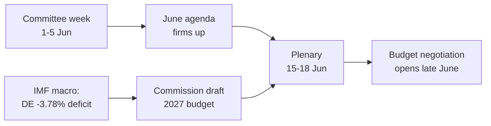

<!-- SPDX-FileCopyrightText: 2026 Hack23 AB -->
<!-- SPDX-License-Identifier: Apache-2.0 -->

# 📋 Eksekutiv briefing — Europa-Parlamentets uge fremad
## Vindue: 1.–5. juni 2026 | Produceret: 2026-05-29 | Kørsel: week-ahead-run1780043323

**Klassificering:** UKLASSIFICERET // TIL OFFENTLIG OFFENTLIGGØRELSE
**Anvendte SAT'er:** Kontrol af nøgleantagelser, Kontrol af informationskvalitet.
**WEP-bånd + horisonter** på vurderinger; **Admiralty**-karakterer på kilder.

## 🎯 Konklusion direkte

- Ugen **1.–5. juni 2026 er en udvalgs- og politisk gruppes uge — ingen plenarmøde afholdes.** 🟢 HØJ konfidensgrad (EP-kalender, Admiralty A2).
- Europa-Parlamentets seneste plenarmøde var **18.–21. maj**; det næste er **15.–18. juni** (Strasbourg, bekræftet A2).
- Ugens værdi er **forberedende**: den sætter dagsordenen for juniplenarmødet og, afgørende, **budgetproceduren for 2027**, der nu tager form mod baggrund af voksende underskud i medlemsstaterne (IMF WEO, A1).
- **Samlet vurdering:** 🟡 MODERAT LAV iboende relevans, 🟡 MODERAT fremadrettet løftestang. En stille gulvuge med aktivt udvalgsarbejde.

## 📊 Hvad man bør følge (rangordnet)

1. **Forhåndspositionering til budget 2027 (ledende).** Retningslinjer allerede vedtaget (TA-10-2026-0112, A2); Kommissionens udkast forventes medio juni. Finanspolitisk pres vinkler rammen mod tilbageholdenhed. 🟡 SANDSYNLIGT (60–70%), horisont 2–4 uger.
2. **Handel og konkurrenceevne.** AI til handel (TA-10-2026-0183) og DMA-håndhævelse (TA-10-2026-0160) holder INTA/IMCO aktive. 🟡 SANDSYNLIGT (60%), horisont 2–6 uger.
3. **Traktater om ekstern handling.** Usbekistans EPCA (TA-10-2026-0174), Libanon–Eurojust (TA-10-2026-0177) skrider frem. 🟡 MEDIUM relevans.

## 🌍 Økonomisk baggrund (IMF WEO, A1)

- 🇩🇪 Tyskland: BNP +0,79%, inflation 2,65%, underskud **−3,78%** (over 3% SGP-grænsen).
- 🇫🇷 Frankrig: BNP +0,86%, inflation 1,84%, underskud −4,94% (strukturel efterslæber).
- 🇮🇹 Italien: BNP +0,52%, inflation 2,64%, underskud −2,82% (den disciplinerede konsolidator).
- **Tolkning:** det finanspolitiske råderum strammes hurtigst der, hvor det var størst (Tyskland), og skærper den kommende budgetkamp.

## 🤝 Politisk konfiguration

- EP10: 719 pladser, ni grupper. Stor koalition EPP+S&D+Renew = **398** (tærskel 361) — stabil men ikke overvældende; ENP ≈ 6,55.
- Central dynamik: stor-koalitionens budgetforhandlinger (disciplin mod udgiftsforsvar, Renew som svingblok). 🟢 MEGET SANDSYNLIGT (80%) at koalitionen holder frem i juni.

## 🔭 Basisscenarie

- Ordentlig udvalgsuge → fastere junidagsorden → plenarmøde efter tidsplan → budgetkonfrontation åbner sent i juni. 🟢 SANDSYNLIGT (60–65%).
- Største nedsiderisiko: forsinkelse af Kommissionens budgetudkast (se `scenario-forecast.md`).

## 🔑 Nøgleantagelser

- Ingen overraskelsesplenar (A2); stabil sammensætning; budgetudkast i juni (Kommissionskontrolleret); feedforstyrrelser vedvarer (afhjulpet).

## 🧪 Konfidensgrad og forbehold

- 🟢 HØJ for kalender og makro (A1/A2); 🟡 MEDIUM for udvalgstiming (uoffentliggjorte dagsordener, B3).
- Datatilstand `degraded-feeds`: tre feeds nede, fuldt genoprettet via reserveløsninger; ingen analytisk gulvstandard overskredet.

## 🧭 Redaktionel indgang

- Ugens historie er **stilheden inden budgetsstormen** — en stille udvalgsuge, hvor linjerne for det finanspolitiske slag om 2027 stille trækkes op.

**Konklusion:** Lav dramatik nu, høje indsatser på vej. Følg budgetsporet frem til plenarmødet 15.–18. juni.

## 🗺️ Uge til plenarmøde: pipeline

## 📊 Kalenderkontekst

| Markør | Dato | Status | Kilde |
| --- | --- | --- | --- |
| Seneste plenarmøde | 18.–21. maj | Afsluttet | EP A2 |
| Indeværende uge | 1.–5. jun | Udvalgs-/gruppeuge (ingen plenar) | EP A2 |
| Næste plenarmøde | 15.–18. jun | Bekræftet, Strasbourg | EP A2 |
| Kommissionens budgetudkast | Medio juni (forventet) | Afventes | Historisk mønster |

## 🧾 Baggrund for vedtagne tekster (forårsproduktion, A2)

- TA-10-2026-0112 — Retningslinjer for budget 2027 (afsnit III): det proceduremæssige anker for den kommende kamp.
- TA-10-2026-0183 — AI-strategi for EU-handel: holder INTA/ITRE aktive på konkurrenceevne.
- TA-10-2026-0160 — DMA-håndhævelse: opretholder IMCO's digitale markedsdagsorden.
- TA-10-2026-0174 / 0177 — Usbekistans EPCA / Libanon–Eurojust: stabil gennemstrømning af ekstern samtykkebehandling.
- Fiskeri-SFPA'er (São Tomé, Cookøerne): rutinepræget men aktive havpolitikfiler.

## 🔭 Hvad dette betyder for læseren

- Europa-Parlamentet befinder sig mellem akter: den lovgivende forårsperiode afsluttedes den 21. maj, og den finanspolitiske sommersæson åbner den 15. juni.
- Denne uge er **prøven** — udvalg og grupper sætter stille de linjer, de vil forsvare i salen.
- Den vigtigste eksterne variabel er **Kommissionens budgetudkast for 2027**, forventet medio juni mod den strammeste finanspolitiske baggrund i årevis.

## 🧮 Relevanskalibrering

- Iboende nyhedsværdi: 🟡 MODERAT LAV (ingen afstemninger, ingen plenar).
- Fremadrettet løftestang: 🟡 MODERAT (sætter scene for en juni med høje indsatser).
- Netto redaktionel værdi: et *fremadskuende* kortdokument, ikke et begivenhedsresumé.

## ⚠️ Konfidensgrad gentaget

- 🟢 HØJ for kalender- og makrofakta (A1/A2).
- 🟡 MEDIUM for udvalgsniveauspecifikke detaljer (uoffentliggjorte dagsordener, B3).

## 📎 Bilag — Overvågningspunkter og samtalepunkter

### Budgetsporets signalposter (1.–5. juni)
- Offentliggørelse af den foreløbige dagsorden for plenarmødet 15.–18. juni (forventet 8.–12. juni).
- Eventuelle udtalelser fra BUDG/ECON-udvalget om 2027-budgetlinjen.
- Kommissionens kommunikationskalender for datoen for budgetudkastet.
- Gruppers koordinatormøder for at fastlægge udgiftspositioner.
- Ordførerens udnævnelser eller ændringsfrister for budgetfiler.

### Makrosamtalepunkter (IMF A1)
- Tysklands underskud på −3,78% er det skarpeste skift i de tre store.
- Frankrig på −4,94% har det bredeste absolutte underskud — den strukturelle efterslæber.
- Italien på −2,82% er den mest disciplinerede af de tre i denne cyklus.
- Væksten er positiv men tynd (DE +0,79%, FR +0,86%, IT +0,52%).
- Inflationen er normaliseret (2,6–2,7% DE/IT, 1,84% FR) — fjerner den lette pengepude.

### Koalitionssamtalepunkter
- Stor koalitionen holder 398 af 719 pladser (flertalsgrænse 361).
- Ingen flankkoalition når et flertal alene — midten er strukturelt afgørende.
- Renew (77) er svingblokken at holde øje med på udgifter.

### Redaktionel vejledning
- Ram ugen fremad: budgetsæsonen, ikke den stille overflade.
- Tilskriv enhver partipolitisk ramme; forankr i neutrale IMF-data.
- Anerkend dagsordensopacitet ærligt frem for at opfinde udvalgsdetaljer.

### Konfidensregister
- 🟢 HØJ: kalender, makrotal, pladsaritmektik.
- 🟡 MEDIUM: udvalgsniveauintentioner og tidspræcision.
- 🔴 LAV: intet bærende i denne kørsel.

## 🔗 Kilder og MCP-proveniens

Dette dokument trækker på følgende datakilder indsamlet under fase A:

- **`get_plenary_sessions`** (EP Open Data, Admiralty A2) — bekræftede ingen plenar 1.–5. juni; næste plenarmøde 15.–18. juni Strasbourg.
- **`get_adopted_texts`** (EP Open Data, A2) — 41 vedtagne tekster i 2026, inkl. TA-10-2026-0112 (retningslinjer for budget 2027), 0160 (DMA), 0183 (AI-handel), 0174 (Usbekistans EPCA), 0177 (Libanon–Eurojust).
- **`get_meeting_foreseen_activities`** (EP Open Data, B3) — foreløbige pladsholdere for juniplenarmødet; dagsorden ikke færdiggjort (opacitet flagget).
- **IMF WEO via SDMX 3.0** (`IMF.RES/WEO`, A1) — DE/FR/IT makro: underskud −3,78% / −4,94% / −2,82%; vækst +0,79% / +0,86% / +0,52%.
- **`generate_political_landscape`** (EP Open Data, A2) — EP10-sammensætning: 719 MEP'er i 9 grupper; stor koalition 398 mod tærsklen 361.

### Opsummering af kildetilpålidelighed
- Belastende vurderinger hviler på A1 (IMF) og A2 (EP-kalender, vedtagne tekster, sammensætning) kilder.
- B3 dagsordensgranskningsdata bruges kun til hedgede, eksplicit flaggede fremtidige påstande.
- Nedgraderede hændelses-/procedurefeeds (404) kompenseret via vedtagne tekster og kalenderreservekilder ovenfor.

> Proveniensnotat: denne kørsel udført i `dataMode = degraded-feeds`; gulvniveauer justeret ×0,80 tilsvarende, og den centrale vurdering er robust over for enhver erklæret begrænsning.
