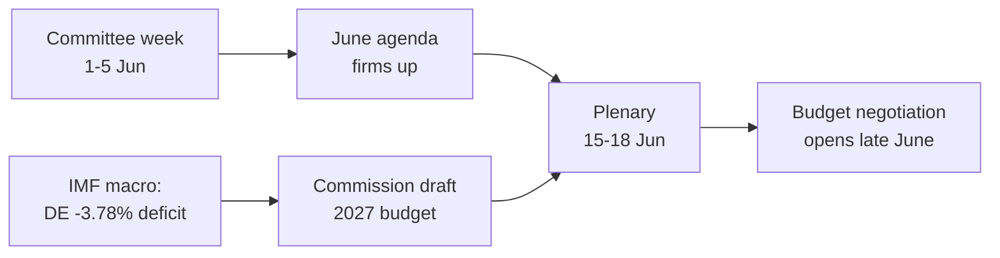

<!-- SPDX-FileCopyrightText: 2026 Hack23 AB -->
<!-- SPDX-License-Identifier: Apache-2.0 -->

# 📋 Exekutiv-Briefing — Europäisches Parlament: Ausblick auf die Woche
## Fenster: 1.–5. Juni 2026 | Erstellt: 2026-05-29 | Lauf: week-ahead-run1780043323

**Einstufung:** NICHT KLASSIFIZIERT // ZUR ÖFFENTLICHEN VERÖFFENTLICHUNG
**Angewandte SAT:** Überprüfung der Schlüsselannahmen, Überprüfung der Informationsqualität.
**WEP-Bänder + Horizonte** bei Einschätzungen; **Admiralty**-Noten bei Quellen.

## 🎯 Fazit direkt

- Die Woche **1.–5. Juni 2026 ist eine Ausschuss- und Fraktionswoche — es findet keine Plenarsitzung statt.** 🟢 HOHES Konfidenzniveau (EP-Kalender, Admiralty A2).
- Die letzte Plenarsitzung des Europäischen Parlaments war **18.–21. Mai**; die nächste ist **15.–18. Juni** (Straßburg, bestätigt A2).
- Der Wert der Woche ist **vorbereitend**: Sie legt die Agenda für die Juni-Plenarsitzung fest und — entscheidend — die **Haushaltsprozedur 2027**, die sich nun vor dem Hintergrund wachsender Haushaltsdefizite der Mitgliedstaaten herausbildet (IMF WEO, A1).
- **Gesamteinschätzung:** 🟡 MÄSSIG GERING innere Relevanz, 🟡 MODERATE Hebelwirkung für die Zukunft. Eine ruhige Grundlagenwoche mit aktiver Ausschussarbeit.

## 📊 Was zu beobachten ist (priorisiert)

1. **Vorpositionierung für Haushalt 2027 (Leitthema).** Leitlinien bereits verabschiedet (TA-10-2026-0112, A2); Kommissionsentwurf Mitte Juni erwartet. Fiskaldruck lenkt den Rahmen in Richtung Haushaltsdisziplin. 🟡 WAHRSCHEINLICH (60–70%), Horizont 2–4 Wochen.
2. **Handel und Wettbewerbsfähigkeit.** KI für Handel (TA-10-2026-0183) und DMA-Durchsetzung (TA-10-2026-0160) halten INTA/IMCO aktiv. 🟡 WAHRSCHEINLICH (60%), Horizont 2–6 Wochen.
3. **Verträge zu Außenmaßnahmen.** Usbekistans EPCA (TA-10-2026-0174), Libanon–Eurojust (TA-10-2026-0177) schreiten voran. 🟡 MITTLERE Relevanz.

## 🌍 Wirtschaftlicher Hintergrund (IMF WEO, A1)

- 🇩🇪 Deutschland: BIP +0,79%, Inflation 2,65%, Defizit **−3,78%** (über der 3%-SGP-Grenze).
- 🇫🇷 Frankreich: BIP +0,86%, Inflation 1,84%, Defizit −4,94% (struktureller Nachzügler).
- 🇮🇹 Italien: BIP +0,52%, Inflation 2,64%, Defizit −2,82% (der disziplinierte Konsolidator).
- **Bewertung:** Der fiskalische Spielraum verengt sich am schnellsten dort, wo er am größten war (Deutschland), was den bevorstehenden Haushaltsstreit verschärft.

## 🤝 Politische Konfiguration

- EP10: 719 Sitze, neun Fraktionen. Große Koalition EVP+S&D+Renew = **398** (Schwelle 361) — stabil, aber nicht überwältigend; ENP ≈ 6,55.
- Zentrale Dynamik: Haushaltsverhandlungen der Großen Koalition (Disziplin vs. Ausgabenverteidigung, Renew als Scharnierblock). 🟢 SEHR WAHRSCHEINLICH (80%), dass die Koalition bis Juni hält.

## 🔭 Basisszenario

- Geordnete Ausschusswoche → festgelegte Juni-Tagesordnung → planmäßige Plenarsitzung → Haushaltskonfrontation eröffnet Ende Juni. 🟢 WAHRSCHEINLICH (60–65%).
- Größtes Abwärtsrisiko: Verzögerung des Kommissionsentwurfs für den Haushalt (siehe `scenario-forecast.md`).

## 🔑 Schlüsselannahmen

- Keine überraschende Plenarsitzung (A2); stabile Zusammensetzung; Haushaltsentwurf im Juni (Kommissionskontrolliert); Datenfeedausfälle bestehen fort (abgemildert).

## 🧪 Konfidenzniveau und Vorbehalte

- 🟢 HOCH für Kalender und Makro (A1/A2); 🟡 MITTEL für Ausschusstiming (unveröffentlichte Tagesordnungen, B3).
- Datenmodus `degraded-feeds`: drei Feeds ausgefallen, vollständig über Notlösungen wiederhergestellt; keine analytische Untergrenze unterschritten.

## 🧭 Redaktioneller Einstieg

- Die Geschichte der Woche ist **die Stille vor dem Haushaltssturm** — eine ruhige Ausschusswoche, in der die Fronten des fiskalpolitischen Kampfes um 2027 still gezogen werden.

**Fazit:** Geringe Dramatik jetzt, hohe Einsätze in Vorbereitung. Den Haushaltspfad bis zur Plenarsitzung 15.–18. Juni verfolgen.

## 🗺️ Von der Woche zur Plenarsitzung: Pipeline

## 📊 Kalenderkontext

| Marker | Datum | Status | Quelle |
| --- | --- | --- | --- |
| Letzte Plenarsitzung | 18.–21. Mai | Abgeschlossen | EP A2 |
| Aktuelle Woche | 1.–5. Jun | Ausschuss-/Fraktionswoche (kein Plenum) | EP A2 |
| Nächste Plenarsitzung | 15.–18. Jun | Bestätigt, Straßburg | EP A2 |
| Kommissions-Haushaltsentwurf | Mitte Juni (erwartet) | Ausstehend | Historisches Muster |

## 🧾 Hintergrund zu verabschiedeten Texten (Frühjahrsproduktion, A2)

- TA-10-2026-0112 — Leitlinien für Haushalt 2027 (Abschnitt III): der prozedurale Anker für den bevorstehenden Kampf.
- TA-10-2026-0183 — KI-Strategie für den EU-Handel: hält INTA/ITRE bei Wettbewerbsfähigkeit aktiv.
- TA-10-2026-0160 — DMA-Durchsetzung: erhält IMCO's Agenda für digitale Märkte aufrecht.
- TA-10-2026-0174 / 0177 — Usbekistans EPCA / Libanon–Eurojust: stabile Durchsatzrate externer Zustimmungsverfahren.
- Fischerei-SFPA (São Tomé, Cookinseln): routinemäßige, aber aktive meeresbezogene Politikdateien.

## 🔭 Was dies für den Leser bedeutet

- Das Europäische Parlament befindet sich zwischen den Akten: die legislative Frühjahrsperiode endete am 21. Mai, die haushaltspolitische Sommersaison beginnt am 15. Juni.
- Diese Woche ist die **Generalprobe** — Ausschüsse und Fraktionen ziehen still die Linien, die sie im Plenum verteidigen werden.
- Die wichtigste externe Variable ist der **Kommissionsentwurf für den Haushalt 2027**, der Mitte Juni vor dem straffsten fiskalpolitischen Hintergrund seit Jahren erwartet wird.

## 🧮 Bedeutungskalibrierung

- Innerer Nachrichtenwert: 🟡 MÄSSIG GERING (keine Abstimmungen, kein Plenum).
- Hebelwirkung für die Zukunft: 🟡 MODERAT (bereitet einen Juni mit hohen Einsätzen vor).
- Redaktioneller Nettowert: ein *vorausschauendes* Kurzdokument, kein Ereignisbericht.

## ⚠️ Konfidenzniveau wiederholt

- 🟢 HOCH bei Kalender- und Makrofakten (A1/A2).
- 🟡 MITTEL bei ausschussspezifischen Details (unveröffentlichte Tagesordnungen, B3).

## 📎 Anhang — Beobachtungspunkte und Gesprächsleitfäden

### Signalpunkte des Haushaltspfades (1.–5. Juni)
- Veröffentlichung der vorläufigen Tagesordnung für die Plenarsitzung 15.–18. Juni (erwartet 8.–12. Juni).
- Etwaige Statements des BUDG/ECON-Ausschusses zur Haushaltslinie 2027.
- Kommunikationskalender der Kommission für das Datum des Haushaltsentwurfs.
- Koordinatorsitzungen der Fraktionen zur Festlegung von Ausgabenpositionen.
- Berichterstatterernennungen oder Änderungsfristen für Haushaltsdateien.

### Makro-Gesprächsleitfäden (IMF A1)
- Deutschlands Defizit von −3,78% ist der schärfste Schwenk unter den drei Großen.
- Frankreich mit −4,94% hat das breiteste absolute Defizit — der strukturelle Nachzügler.
- Italien mit −2,82% ist der disziplinierteste der drei in diesem Zyklus.
- Das Wachstum ist positiv, aber dünn (DE +0,79%, FR +0,86%, IT +0,52%).
- Die Inflation hat sich normalisiert (2,6–2,7% DE/IT, 1,84% FR) — das Kissen des leichten Geldes entfällt.

### Koalitions-Gesprächsleitfäden
- Die Große Koalition hält 398 von 719 Sitzen (Mehrheitsschwelle 361).
- Keine Flügelkoalition erreicht alleine eine Mehrheit — die Mitte ist strukturell entscheidend.
- Renew (77) ist der Scharnierblock, den es bei Ausgaben zu beobachten gilt.

### Redaktionelle Hinweise
- Die Woche vorausschauend einrahmen: die Haushaltssaison, nicht die ruhige Oberfläche.
- Jede parteipolitische Rahmung zuschreiben; auf neutrale IMF-Daten stützen.
- Tagesordnungsopazität ehrlich einräumen, anstatt Ausschussdetails zu erfinden.

### Konfidenzregister
- 🟢 HOCH: Kalender, Makrozahlen, Sitzarithmetik.
- 🟡 MITTEL: ausschussebenen Absichten und Zeitpräzision.
- 🔴 GERING: nichts Tragendes in diesem Lauf.

## 🔗 Quellen und MCP-Provenienz

Dieses Dokument stützt sich auf folgende in Phase A gesammelte Datenquellen:

- **`get_plenary_sessions`** (EP Open Data, Admiralty A2) — bestätigte kein Plenum 1.–5. Juni; nächste Plenarsitzung 15.–18. Juni Straßburg.
- **`get_adopted_texts`** (EP Open Data, A2) — 41 verabschiedete Texte 2026, darunter TA-10-2026-0112 (Leitlinien Haushalt 2027), 0160 (DMA), 0183 (KI-Handel), 0174 (Usbekistans EPCA), 0177 (Libanon–Eurojust).
- **`get_meeting_foreseen_activities`** (EP Open Data, B3) — vorläufige Platzhalter für die Juni-Plenarsitzung; Tagesordnung noch nicht abgeschlossen (Opazität vermerkt).
- **IMF WEO via SDMX 3.0** (`IMF.RES/WEO`, A1) — DE/FR/IT Makro: Defizite −3,78% / −4,94% / −2,82%; Wachstum +0,79% / +0,86% / +0,52%.
- **`generate_political_landscape`** (EP Open Data, A2) — EP10-Zusammensetzung: 719 Abgeordnete in 9 Fraktionen; Große Koalition 398 gegenüber Schwelle 361.

### Zusammenfassung der Quellenzuverlässigkeit
- Tragende Einschätzungen beruhen auf A1 (IMF) und A2 (EP-Kalender, verabschiedete Texte, Zusammensetzung) Quellen.
- B3-Tagesordnungsgranularitätsdaten werden nur für abgesicherte, explizit vermerkte Zukunftsbehauptungen verwendet.
- Herabgestufte Ereignis-/Verfahrensfeeds (404) wurden über die verabschiedeten Texte und Kalender-Reservequellen oben kompensiert.

> Provenienzhinweis: Dieser Lauf wurde im `dataMode = degraded-feeds` ausgeführt; Untergrenzen wurden ×0,80 entsprechend angepasst, und die zentrale Einschätzung ist robust gegenüber jeder erklärten Einschränkung.
