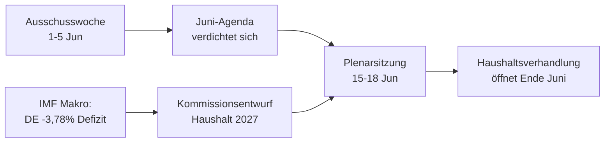

<!-- SPDX-FileCopyrightText: 2026 Hack23 AB -->
<!-- SPDX-License-Identifier: Apache-2.0 -->

# 📋 Lageübersicht — Kommende Woche im Europäischen Parlament
## Zeitfenster: 1.–5. Juni 2026 | Erstellt: 2026-05-29 | Lauf: week-ahead-run1780043323

**Einstufung:** NICHT EINGESTUFT // ZUR ÖFFENTLICHEN VERÖFFENTLICHUNG
**Angewandte SAT:** Prüfung der Schlüsselannahmen, Prüfung der Informationsqualität.
**WEP-Bänder + Horizonte** bei Urteilen; **Admiralty**-Grade bei Quellen.

## 🎯 Bottom Line Up Front

- Die Woche vom **1.–5. Juni 2026 ist eine Ausschuss- und Fraktionswoche — keine Plenarsitzung findet statt.** 🟢 HOHE Konfidenz (EP-Kalender, Admiralty A2).
- Die letzte Plenarsitzung des Europäischen Parlaments war am **18.–21. Mai**; die nächste findet am **15.–18. Juni** statt (Straßburg, bestätigt A2).
- Der Wert der Woche liegt im **Vorbereitenden**: Sie legt den Grundstein für das Juni-Plenum und — entscheidend — für das **Haushaltsverfahren 2027**, das sich nun vor dem Hintergrund wachsender Defizite in den Mitgliedstaaten abzeichnet (IMF WEO, A1).
- **Gesamturteil:** 🟡 MÄSSIG-GERING an inhärentem Gewicht, 🟡 MÄSSIGE Vorwärtswirkung. Eine ruhige Grundwoche mit aktiven Ausschüssen.

## 📊 What to Watch (ranked)

1. **Vorpositionierung Haushalt 2027 (Hauptspur).** Leitlinien bereits verabschiedet (TA-10-2026-0112, A2); Entwurf der Kommission Mitte Juni erwartet. Finanzpolitischer Druck neigt zur Zurückhaltung. 🟡 WAHRSCHEINLICH (60–70 %), Horizont 2–4 Wochen.
2. **Handelspolitik & Wettbewerbsfähigkeit.** KI für den Handel (TA-0183) und DMA-Durchsetzung (TA-0160) halten INTA/IMCO aktiv. 🟡 WAHRSCHEINLICH (60 %), Horizont 2–6 Wochen.
3. **Außenpolitische Verträge.** Usbekistan-EPCA (TA-0174), Libanon–Eurojust (TA-0177) schreiten voran. 🟡 MITTLERE Relevanz.

## 🌍 Economic Backdrop (IMF WEO, A1)

- 🇩🇪 Deutschland: BIP +0,79 %, Inflation 2,65 %, Defizit **−3,78 %** (über der 3-%-SGP-Marke).
- 🇫🇷 Frankreich: BIP +0,86 %, Inflation 1,84 %, Defizit −4,94 % (struktureller Nachzügler).
- 🇮🇹 Italien: BIP +0,52 %, Inflation 2,64 %, Defizit −2,82 % (der disziplinierte Konsolidierer).
- **Einschätzung:** Der fiskalische Spielraum verengt sich am schnellsten dort, wo er am größten war (Deutschland), was den bevorstehenden Haushaltsstreit verschärft.

## 🤝 Political Configuration

- EP10: 719 Sitze, neun Fraktionen. Große Koalition EVP+S&D+Renew = **398** (Schwelle 361) — stabil, aber nicht überwältigend; ENP ≈ 6,55.
- Zentrale Dynamik: Haushaltsverhandlungen der Großen Koalition (Disziplin vs. Verteidigungsausgaben, Renew als Zünglein an der Waage). 🟢 SEHR WAHRSCHEINLICH (80 %), dass die Koalition den Juni über hält.

## 🔭 Base-Case Outlook

- Geordnete Ausschusswoche → festere Juni-Agenda → planmäßiges Plenum → Haushaltskonfrontation öffnet sich Ende Juni. 🟢 WAHRSCHEINLICH (60–65 %).
- Wesentliches Abwärtsrisiko: Verzögerung des Kommissionsentwurfs für den Haushalt (siehe `scenario-forecast.md`).

## 🔑 Key Assumptions

- Kein überraschendes Plenum (A2); stabile Zusammensetzung; Haushaltsentwurf im Juni (Kommissions-kontrolliert); Feed-Ausfälle bestehen fort (abgemildert).

## 🧪 Confidence & Caveats

- 🟢 HOCH für Kalender und Makro (A1/A2); 🟡 MITTEL für Ausschusstiming (unveröffentlichte Tagesordnungen, B3).
- Datenmodus `herabgestufte Feeds`: Drei Feeds ausgefallen, vollständig über Ausweichquellen wiederhergestellt; kein analytischer Mindeststand unerfüllt.

## 🧭 Editorial Hook

- Die Geschichte der Woche ist **die Ruhe vor dem Haushaltssturm** — eine ruhige Ausschusswoche, in der die Linien des finanzpolitischen Kampfes 2027 still gezogen werden.

**Fazit:** Wenig Dramatik jetzt, hohe Einsätze bauen sich auf. Den Haushaltsweg bis zur Plenarsitzung am 15.–18. Juni im Blick behalten.

## 🗺️ Week-to-Plenary Pipeline

## 📊 Calendar Context

| Markierung | Datum | Status | Quelle |
| --- | --- | --- | --- |
| Letzte Plenarsitzung | 18.–21. Mai | Abgeschlossen | EP A2 |
| Aktuelle Woche | 1.–5. Jun | Ausschuss-/Fraktionswoche (kein Plenum) | EP A2 |
| Nächste Plenarsitzung | 15.–18. Jun | Bestätigt, Straßburg | EP A2 |
| Kommissions-Haushaltsentwurf | Mitte Juni (erwartet) | Ausstehend | Historisches Muster |

## 🧾 Adopted-Text Backdrop (spring output, A2)

- TA-10-2026-0112 — Leitlinien Haushalt 2027 (Abschnitt III): der verfahrenstechnische Anker für den bevorstehenden Kampf.
- TA-10-2026-0183 — KI-Strategie für den EU-Handel: hält INTA/ITRE in Wettbewerbsfähigkeitsfragen aktiv.
- TA-10-2026-0160 — DMA-Durchsetzung: erhält die Agenda des IMCO für digitale Märkte aufrecht.
- TA-10-2026-0174 / 0177 — Usbekistan-EPCA / Libanon-Eurojust: stabiler Außenaktions-Zustimmungsdurchsatz.
- Fischerei-SFPAs (São Tomé, Cookinseln): routinemäßige, aber aktive Meeresspolitikdossiers.

## 🔭 What This Means for the Reader

- Das Parlament befindet sich zwischen zwei Akten: Die Frühjahrssaison der Gesetzgebung endete am 21. Mai; die Sommer-Haushaltssaison beginnt am 15. Juni.
- Diese Woche ist die **Generalprobe** — Ausschüsse und Fraktionen legen still die Positionen fest, die sie im Plenum verteidigen werden.
- Die wichtigste externe Variable ist **der Entwurf der Kommission für den Haushalt 2027**, der Mitte Juni vor dem strafffsten finanzpolitischen Hintergrund seit Jahren erwartet wird.

## 🧮 Significance Calibration

- Inhärenter Nachrichtenwert: 🟡 MÄSSIG-GERING (keine Abstimmungen, kein Plenum).
- Vorwärtswirkung: 🟡 MÄSSIG (bereitet einen ereignisreichen Juni vor).
- Redaktioneller Nettowert: eine *vorausschauende* Übersicht, kein Ereignisbericht.

## ⚠️ Confidence Restated

- 🟢 HOCH für Kalender und Makrofakten (A1/A2).
- 🟡 MITTEL für ausschusspezifische Einzelheiten (unveröffentlichte Tagesordnungen, B3).

## 📎 Annex — Watch Items & Talking Points

### Haushaltsspur-Signalpunkte (1.–5. Juni)
- Veröffentlichung des vorläufigen Tagesordnungsentwurfs für die Plenarsitzung am 15.–18. Juni (erwartet 8.–12. Juni).
- Etwaige BUDG/ECON-Ausschuss-Erklärungen zur Haushaltslinie 2027.
- Kommunikationskalender der Kommission für das Datum des Haushaltsentwurfs.
- Koordinatorensitzungen der Fraktionen zur Festlegung der Ausgabenpositionen.
- Berichterstatternennungen oder Änderungsfristen für Haushaltsdossiers.

### Makroökonomische Gesprächspunkte (IMF A1)
- Deutschlands Defizit von −3,78 % ist die schärfste Schwankung unter den drei Großen.
- Frankreich mit −4,94 % hat das breiteste absolute Defizit — der strukturelle Nachzügler.
- Italien mit −2,82 % ist in diesem Zyklus der Disziplinierteste der drei.
- Wachstum ist positiv, aber dünn (DE +0,79 %, FR +0,86 %, IT +0,52 %).
- Inflation hat sich normalisiert (2,6–2,7 % DE/IT, 1,84 % FR) — das Geldpolitikpolster ist weg.

### Koalitions-Gesprächspunkte
- Die Große Koalition hält 398 von 719 Sitzen (Mehrheitsschwelle 361).
- Keine Flügelkoalition erreicht allein eine Mehrheit — die Mitte ist strukturell entscheidend.
- Renew (77) ist die Schlüsselfraktion bei Ausgabenfragen.

### Redaktionelle Leitlinien
- Die Woche vorausschauend einordnen: die Haushaltssaison, nicht die ruhige Oberfläche.
- Jede parteipolitische Rahmung zuordnen; auf neutralen IMF-Daten verankern.
- Tagesordnungsopazität ehrlich kennzeichnen, anstatt Ausschussdetails zu erfinden.

### Konfidenzregister
- 🟢 HOCH: Kalender, Makrozahlen, Sitzarithmetik.
- 🟡 MITTEL: Absichten auf Ausschussebene und Zeitpräzision.
- 🔴 NIEDRIG: nichts Tragfähiges in diesem Lauf.

## 🔗 Sources & MCP Provenance

Dieses Artefakt stützt sich auf folgende in Phase A erhobene Datenquellen:

- **`get_plenary_sessions`** (EP Open Data, Admiralty A2) — kein Plenum am 1.–5. Juni bestätigt; nächste Plenarsitzung 15.–18. Juni Straßburg.
- **`get_adopted_texts`** (EP Open Data, A2) — 41 angenommene Texte in 2026, darunter TA-10-2026-0112 (Haushaltsleitlinien 2027), 0160 (DMA), 0183 (KI-Handel), 0174 (Usbekistan-EPCA), 0177 (Libanon-Eurojust).
- **`get_meeting_foreseen_activities`** (EP Open Data, B3) — vorläufige Platzhalter für Juni-Plenum; Tagesordnung nicht abgeschlossen (Opazität gekennzeichnet).
- **IMF WEO via SDMX 3.0** (`IMF.RES/WEO`, A1) — DE/FR/IT Makro: Defizite −3,78 % / −4,94 % / −2,82 %; Wachstum +0,79 % / +0,86 % / +0,52 %.
- **`generate_political_landscape`** (EP Open Data, A2) — EP10-Zusammensetzung: 719 Abgeordnete in 9 Fraktionen; Große Koalition 398 vs. Schwelle 361.

### Quellenzuverlässigkeitszusammenfassung
- Tragfähige Urteile stützen sich auf A1 (IMF) und A2 (EP-Kalender, angenommene Texte, Zusammensetzung).
- B3-Daten zur Tagesordnungsgranularität werden nur für differenzierte, explizit gekennzeichnete Vorausschau-Aussagen verwendet.
- Herabgestufte Ereignis-/Verfahrens-Feeds (404) wurden über die oben genannten angenommenen Texte und Kalenderausweichquellen kompensiert.

> Provenienzhinweis: Dieser Lauf wurde im Modus `dataMode = degraded-feeds` ausgeführt; Böden wurden entsprechend ×0,80 angepasst, und das zentrale Urteil ist gegenüber jeder deklarierten Einschränkung robust.
