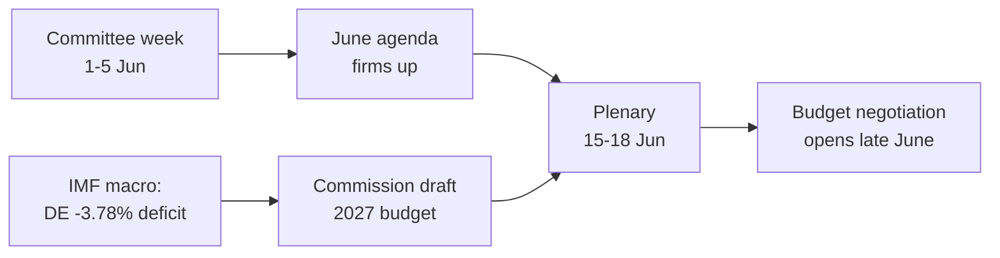

<!-- SPDX-FileCopyrightText: 2026 Hack23 AB -->
<!-- SPDX-License-Identifier: Apache-2.0 -->

# 📋 Resumen ejecutivo — Semana por delante en el Parlamento Europeo
## Ventana: 1–5 de junio de 2026 | Producido: 2026-05-29 | Ejecución: week-ahead-run1780043323

**Clasificación:** NO CLASIFICADO // PARA PUBLICACIÓN PÚBLICA
**SAT aplicadas:** Verificación de hipótesis clave, Control de calidad de la información.
**Bandas WEP + horizontes** en las valoraciones; **Admiralty** en las fuentes.

## 🎯 Conclusión directa

- La semana **del 1 al 5 de junio de 2026 es una semana de comisiones y grupos políticos — no hay pleno.** 🟢 ALTA confianza (calendario PE, Admiralty A2).
- El último pleno del Parlamento Europeo fue el **18–21 de mayo**; el próximo es el **15–18 de junio** (Estrasburgo, confirmado A2).
- El valor de la semana es **preparatorio**: establece la agenda de la sesión plenaria de junio y, de manera decisiva, el **procedimiento presupuestario de 2027**, que ahora se está formando ante el creciente déficit de los Estados miembros (IMF WEO, A1).
- **Valoración general:** 🟡 MODERADAMENTE BAJA relevancia intrínseca, 🟡 MODERADA influencia prospectiva. Una semana de tranquilidad de base con activo trabajo en comisiones.

## 📊 Qué observar (por orden de importancia)

1. **Posicionamiento previo para el presupuesto 2027 (tema principal).** Directrices ya adoptadas (TA-10-2026-0112, A2); borrador de la Comisión previsto para mediados de junio. La presión fiscal orienta el marco hacia la austeridad. 🟡 PROBABLE (60–70%), horizonte 2–4 semanas.
2. **Comercio y competitividad.** IA para el comercio (TA-10-2026-0183) y aplicación del DMA (TA-10-2026-0160) mantienen activas a INTA/IMCO. 🟡 PROBABLE (60%), horizonte 2–6 semanas.
3. **Tratados de acción exterior.** AMCO de Uzbekistán (TA-10-2026-0174), Líbano–Eurojust (TA-10-2026-0177) avanzan. 🟡 RELEVANCIA MEDIA.

## 🌍 Contexto económico (IMF WEO, A1)

- 🇩🇪 Alemania: PIB +0,79%, inflación 2,65%, déficit **−3,78%** (por encima de la línea del 3% del PEC).
- 🇫🇷 Francia: PIB +0,86%, inflación 1,84%, déficit −4,94% (rezagado estructural).
- 🇮🇹 Italia: PIB +0,52%, inflación 2,64%, déficit −2,82% (el consolidador disciplinado).
- **Lectura:** el margen fiscal se estrecha más rápido donde era más amplio (Alemania), agudizando la próxima batalla presupuestaria.

## 🤝 Configuración política

- PE10: 719 escaños, nueve grupos. Gran coalición PPE+S&D+Renew = **398** (umbral 361) — estable pero no abrumadora; ENP ≈ 6,55.
- Dinámica central: negociaciones presupuestarias de la gran coalición (disciplina frente a defensa del gasto, Renew como bloque bisagra). 🟢 MUY PROBABLE (80%) que la coalición aguante hasta junio.

## 🔭 Escenario base

- Semana de comisiones ordenada → agenda de junio más firme → pleno en plazo → confrontación presupuestaria se abre a finales de junio. 🟢 PROBABLE (60–65%).
- Principal riesgo a la baja: retraso en el borrador de presupuesto de la Comisión (véase `scenario-forecast.md`).

## 🔑 Hipótesis clave

- Sin pleno sorpresa (A2); composición estable; borrador de presupuesto en junio (bajo control de la Comisión); las interrupciones de flujo persisten (atenuadas).

## 🧪 Nivel de confianza y advertencias

- 🟢 ALTO en calendario y macro (A1/A2); 🟡 MEDIO en calendario de comisiones (agendas no publicadas, B3).
- Modo de datos `degraded-feeds`: tres flujos caídos, completamente recuperados mediante alternativas; ningún suelo analítico incumplido.

## 🧭 Enfoque editorial

- La historia de la semana es **la calma antes de la tormenta presupuestaria** — una tranquila semana de comisiones en la que se trazan silenciosamente las líneas del combate fiscal de 2027.

**Conclusión:** Poca dramaticidad ahora, altas apuestas en preparación. Seguir la pista presupuestaria hasta el pleno del 15–18 de junio.

## 🗺️ De la semana al pleno: flujo de trabajo

## 📊 Contexto del calendario

| Hito | Fecha | Estado | Fuente |
| --- | --- | --- | --- |
| Último pleno | 18–21 de mayo | Concluido | PE A2 |
| Semana actual | 1–5 de junio | Semana de comisiones/grupos (sin pleno) | PE A2 |
| Próximo pleno | 15–18 de junio | Confirmado, Estrasburgo | PE A2 |
| Borrador de presupuesto de la Comisión | Mediados de junio (previsto) | Pendiente | Pauta histórica |

## 🧾 Contexto de textos adoptados (producción primaveral, A2)

- TA-10-2026-0112 — Directrices presupuestarias 2027 (sección III): el ancla procedimental para la próxima batalla.
- TA-10-2026-0183 — Estrategia de IA para el comercio de la UE: mantiene activas a INTA/ITRE en competitividad.
- TA-10-2026-0160 — Aplicación del DMA: sostiene la agenda del mercado digital de IMCO.
- TA-10-2026-0174 / 0177 — AMCO de Uzbekistán / Líbano–Eurojust: flujo estable de procedimientos de consentimiento de acción exterior.
- APPCP de pesca (Santo Tomé, Islas Cook): archivos de política marina rutinarios pero activos.

## 🔭 Lo que esto significa para el lector

- El Parlamento Europeo se encuentra entre actos: la temporada legislativa de primavera cerró el 21 de mayo, y la temporada presupuestaria de verano abre el 15 de junio.
- Esta semana es el **ensayo** — las comisiones y los grupos trazan silenciosamente las líneas que defenderán en el hemiciclo.
- La variable externa más importante es el **borrador de presupuesto 2027 de la Comisión**, previsto para mediados de junio en el contexto fiscal más ajustado en años.

## 🧮 Calibración de la relevancia

- Valor periodístico intrínseco: 🟡 MODERADAMENTE BAJO (sin votaciones, sin pleno).
- Influencia prospectiva: 🟡 MODERADA (prepara un junio de altas apuestas).
- Valor editorial neto: un documento breve *prospectivo*, no un resumen de eventos.

## ⚠️ Nivel de confianza reiterado

- 🟢 ALTO en hechos de calendario y macro (A1/A2).
- 🟡 MEDIO en especificidades a nivel de comisiones (agendas no publicadas, B3).

## 📎 Anexo — Puntos de seguimiento y argumentarios

### Hitos de la pista presupuestaria (1–5 de junio)
- Publicación del borrador de agenda del pleno del 15–18 de junio (prevista para el 8–12 de junio).
- Eventuales declaraciones de la comisión BUDG/ECON anticipando la línea de 2027.
- Calendario de comunicaciones de la Comisión para la fecha del borrador de presupuesto.
- Reuniones de coordinadores de grupos para fijar posiciones de gasto.
- Nombramientos de ponentes o plazos de enmienda para los archivos presupuestarios.

### Argumentarios macroeconómicos (IMF A1)
- El déficit de Alemania en −3,78% es el giro más pronunciado entre los tres grandes.
- Francia con −4,94% registra el mayor déficit absoluto — el rezagado estructural.
- Italia con −2,82% es la más disciplinada de las tres en este ciclo.
- El crecimiento es positivo pero débil (DE +0,79%, FR +0,86%, IT +0,52%).
- La inflación se ha normalizado (2,6–2,7% DE/IT, 1,84% FR) — eliminando el colchón del dinero fácil.

### Argumentarios sobre la coalición
- La gran coalición controla 398 de 719 escaños (umbral de mayoría 361).
- Ninguna coalición de flanco alcanza la mayoría sola — el centro es estructuralmente decisivo.
- Renew (77) es el bloque bisagra a seguir en materia de gasto.

### Orientación editorial
- Enmarcar la semana hacia el futuro: la temporada presupuestaria, no la tranquila superficie.
- Atribuir cada encuadre partidista; anclar en los datos neutrales del IMF.
- Reconocer honestamente la opacidad de las agendas en lugar de inventar detalles de comisión.

### Registro de confianza
- 🟢 ALTO: calendario, cifras macro, aritmética de escaños.
- 🟡 MEDIO: intenciones a nivel de comisión y precisión temporal.
- 🔴 BAJO: nada relevante en esta ejecución.

## 🔗 Fuentes y procedencia MCP

Este documento se basa en las siguientes fuentes de datos recopiladas durante la fase A:

- **`get_plenary_sessions`** (PE Open Data, Admiralty A2) — confirmó la ausencia de pleno del 1 al 5 de junio; próximo pleno 15–18 de junio en Estrasburgo.
- **`get_adopted_texts`** (PE Open Data, A2) — 41 textos adoptados en 2026, incluidos TA-10-2026-0112 (directrices presupuesto 2027), 0160 (DMA), 0183 (IA-comercio), 0174 (AMCO Uzbekistán), 0177 (Líbano–Eurojust).
- **`get_meeting_foreseen_activities`** (PE Open Data, B3) — marcadores de posición provisionales para el pleno de junio; agenda aún no finalizada (opacidad señalada).
- **IMF WEO via SDMX 3.0** (`IMF.RES/WEO`, A1) — macro DE/FR/IT: déficits −3,78% / −4,94% / −2,82%; crecimiento +0,79% / +0,86% / +0,52%.
- **`generate_political_landscape`** (PE Open Data, A2) — composición PE10: 719 eurodiputados en 9 grupos; gran coalición 398 frente al umbral de 361.

### Resumen de fiabilidad de fuentes
- Las valoraciones decisivas se basan en fuentes A1 (IMF) y A2 (calendario PE, textos adoptados, composición).
- Los datos de granularidad B3 de agendas se usan solo para afirmaciones prospectivas cubiertas y explícitamente señaladas.
- Los flujos degradados de eventos/procedimientos (404) se compensaron mediante los textos adoptados y las fuentes alternativas del calendario indicadas arriba.

> Nota de procedencia: esta ejecución se realizó en `dataMode = degraded-feeds`; los suelos se ajustaron ×0,80 en consecuencia y la valoración central es robusta frente a cada limitación declarada.
