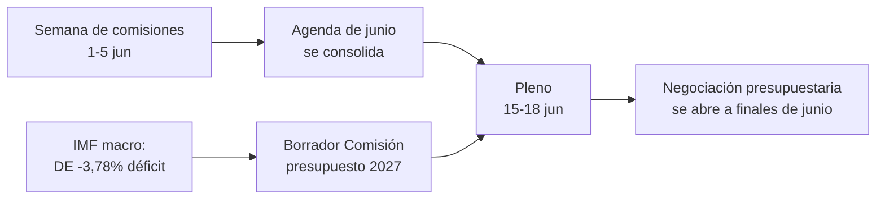

<!-- SPDX-FileCopyrightText: 2026 Hack23 AB -->
<!-- SPDX-License-Identifier: Apache-2.0 -->

# 📋 Resumen ejecutivo — Semana próxima en el Parlamento Europeo
## Período: 1–5 de junio de 2026 | Elaborado: 2026-05-29 | Ejecución: week-ahead-run1780043323

**Clasificación:** SIN CLASIFICAR // PARA DIFUSIÓN PÚBLICA
**SAT aplicados:** Verificación de supuestos clave, Verificación de la calidad de la información.
**Bandas WEP + horizontes** en los juicios; grados **Admiralty** en las fuentes.

## 🎯 Bottom Line Up Front

- La semana del **1 al 5 de junio de 2026 es una semana de comisiones y grupos políticos — no hay sesión plenaria.** 🟢 CONFIANZA ALTA (calendario PE, Admiralty A2).
- El último pleno del Parlamento Europeo fue del **18 al 21 de mayo**; el próximo es del **15 al 18 de junio** (Estrasburgo, confirmado A2).
- El valor de la semana es **preparatorio**: sienta las bases del pleno de junio y, de forma decisiva, del **procedimiento presupuestario 2027** que ahora se perfila frente a unos déficits de los Estados miembros en expansión (IMF WEO, A1).
- **Valoración global:** 🟡 RELEVANCIA INTRÍNSECA MODERADA-BAJA, 🟡 PALANCA PROSPECTIVA MODERADA. Una semana de base tranquila con comisiones activas.

## 📊 What to Watch (ranked)

1. **Preposicionamiento Presupuesto 2027 (hilo principal).** Orientaciones ya adoptadas (TA-10-2026-0112, A2); borrador de la Comisión esperado a mediados de junio. La presión fiscal inclina hacia la contención. 🟡 PROBABLE (60–70 %), horizonte 2–4 semanas.
2. **Comercio y competitividad: seguimiento.** IA para el comercio (TA-0183) y aplicación del DMA (TA-0160) mantienen INTA/IMCO activos. 🟡 PROBABLE (60 %), horizonte 2–6 semanas.
3. **Tratados de acción exterior.** APCA Uzbekistán (TA-0174), Líbano-Eurojust (TA-0177) avanzan. 🟡 RELEVANCIA MEDIA.

## 🌍 Economic Backdrop (IMF WEO, A1)

- 🇩🇪 Alemania: PIB +0,79 %, inflación 2,65 %, déficit **−3,78 %** (por encima del límite SGP del 3 %).
- 🇫🇷 Francia: PIB +0,86 %, inflación 1,84 %, déficit −4,94 % (rezagado estructural).
- 🇮🇹 Italia: PIB +0,52 %, inflación 2,64 %, déficit −2,82 % (el consolidador disciplinado).
- **Lectura:** el margen presupuestario se estrecha más rápidamente allí donde era más amplio (Alemania), lo que agudiza la batalla presupuestaria venidera.

## 🤝 Political Configuration

- PE10: 719 escaños, nueve grupos. Gran coalición PPE+S&D+Renew = **398** (umbral 361) — estable pero no abrumadora; ENP ≈ 6,55.
- Dinámica central: negociaciones presupuestarias de la gran coalición (disciplina vs. gasto en defensa, Renew como árbitro). 🟢 MUY PROBABLE (80 %) que la coalición se mantenga durante junio.

## 🔭 Base-Case Outlook

- Semana de comisiones ordenada → agenda de junio más firme → pleno según lo previsto → confrontación presupuestaria a finales de junio. 🟢 PROBABLE (60–65 %).
- Principal riesgo a la baja: retraso del borrador de presupuesto de la Comisión (véase `scenario-forecast.md`).

## 🔑 Key Assumptions

- Sin pleno sorpresa (A2); composición estable; borrador de presupuesto en junio (bajo control de la Comisión); las interrupciones de flujos persisten (mitigadas).

## 🧪 Confidence & Caveats

- 🟢 ALTA en calendario y datos macro (A1/A2); 🟡 MEDIA en el calendario de las comisiones (agendas sin publicar, B3).
- Modo de datos `flujos degradados`: tres flujos caídos, recuperados totalmente mediante fuentes alternativas; ningún mínimo analítico sin cubrir.

## 🧭 Editorial Hook

- La historia de la semana es **la calma antes de la tormenta presupuestaria** — una tranquila semana de comisiones en la que se trazan silenciosamente las líneas de la batalla fiscal de 2027.

**Conclusión:** Poca dramaticidad ahora, grandes apuestas que se acumulan. Vigilar el hilo presupuestario de cara al pleno del 15 al 18 de junio.

## 🗺️ Week-to-Plenary Pipeline

## 📊 Calendar Context

| Marcador | Fecha | Estado | Fuente |
| --- | --- | --- | --- |
| Último pleno | 18–21 de mayo | Concluido | PE A2 |
| Semana en curso | 1–5 jun | Semana de comisiones/grupos (sin pleno) | PE A2 |
| Próximo pleno | 15–18 jun | Confirmado, Estrasburgo | PE A2 |
| Borrador de presupuesto de la Comisión | mediados de junio (previsto) | Pendiente | Patrón histórico |

## 🧾 Adopted-Text Backdrop (spring output, A2)

- TA-10-2026-0112 — Orientaciones Presupuesto 2027 (Sección III): el ancla procedimental de la batalla venidera.
- TA-10-2026-0183 — Estrategia de IA para el comercio de la UE: mantiene INTA/ITRE activos en competitividad.
- TA-10-2026-0160 — Aplicación del DMA: sostiene la agenda de mercado digital de IMCO.
- TA-10-2026-0174 / 0177 — APCA Uzbekistán / Líbano-Eurojust: flujo constante de consentimientos de acción exterior.
- SFPAs de pesca (Santo Tomé, Islas Cook): expedientes de política marina rutinarios pero activos.

## 🔭 What This Means for the Reader

- El Parlamento se encuentra entre actos: la temporada legislativa de primavera cerró el 21 de mayo; la temporada presupuestaria de verano abre el 15 de junio.
- Esta semana es el **ensayo general** — las comisiones y los grupos fijan en silencio las posiciones que defenderán en el hemiciclo.
- La variable externa más importante es el **borrador de presupuesto 2027 de la Comisión**, esperado a mediados de junio en el entorno fiscal más restrictivo de los últimos años.

## 🧮 Significance Calibration

- Valor informativo intrínseco: 🟡 MODERADO-BAJO (sin votaciones, sin pleno).
- Palanca prospectiva: 🟡 MODERADA (prepara un junio de gran calado).
- Valor editorial neto: un resumen *prospectivo*, no un informe de eventos.

## ⚠️ Confidence Restated

- 🟢 ALTA en hechos de calendario y macro (A1/A2).
- 🟡 MEDIA en detalles específicos de comisión (agendas sin publicar, B3).

## 📎 Annex — Watch Items & Talking Points

### Indicadores del hilo presupuestario (1–5 de junio)
- Publicación del borrador de orden del día provisional del pleno del 15–18 de junio (previsto para el 8–12 de junio).
- Posibles declaraciones de la comisión BUDG/ECON sobre la línea del presupuesto 2027.
- Calendario de comunicaciones de la Comisión para la fecha del borrador de presupuesto.
- Reuniones de coordinadores de grupos para fijar posiciones en materia de gasto.
- Nombramientos de ponentes o plazos de enmienda para expedientes presupuestarios.

### Puntos de debate macro (IMF A1)
- El déficit de Alemania en −3,78 % es el giro más brusco entre los tres grandes.
- Francia en −4,94 % tiene el déficit absoluto más amplio — el rezagado estructural.
- Italia en −2,82 % es la más disciplinada de las tres en este ciclo.
- El crecimiento es positivo pero débil (DE +0,79 %, FR +0,86 %, IT +0,52 %).
- La inflación se ha normalizado (2,6–2,7 % DE/IT, 1,84 % FR) — el colchón de la política monetaria laxa ha desaparecido.

### Puntos de debate sobre la coalición
- La gran coalición tiene 398 de 719 escaños (umbral de mayoría 361).
- Ninguna coalición de flanco alcanza por sí sola una mayoría — el centro es estructuralmente decisivo.
- Renew (77) es el grupo bisagra a vigilar en materia de gasto.

### Orientación editorial
- Enmarcar la semana con perspectiva: la temporada presupuestaria, no la calma superficial.
- Atribuir cada encuadre partidista; anclar en datos neutrales del IMF.
- Señalar la opacidad de la agenda con honestidad en lugar de inventar detalles de comisión.

### Registro de confianza
- 🟢 ALTA: calendario, cifras macro, aritmética de escaños.
- 🟡 MEDIA: intenciones a nivel de comisión y precisión temporal.
- 🔴 BAJA: ningún elemento de carga en esta ejecución.

## 🔗 Sources & MCP Provenance

Este artefacto se basa en las siguientes fuentes de datos recopiladas durante la Etapa A:

- **`get_plenary_sessions`** (Datos abiertos PE, Admiralty A2) — confirmado sin pleno los días 1–5 de junio; próximo pleno 15–18 de junio Estrasburgo.
- **`get_adopted_texts`** (Datos abiertos PE, A2) — 41 textos adoptados en 2026, incluidos TA-10-2026-0112 (orientaciones presupuesto 2027), 0160 (DMA), 0183 (IA-comercio), 0174 (APCA Uzbekistán), 0177 (Líbano-Eurojust).
- **`get_meeting_foreseen_activities`** (Datos abiertos PE, B3) — marcadores provisionales para el pleno de junio; agenda no finalizada (opacidad señalada).
- **IMF WEO via SDMX 3.0** (`IMF.RES/WEO`, A1) — macro DE/FR/IT: déficits −3,78 % / −4,94 % / −2,82 %; crecimiento +0,79 % / +0,86 % / +0,52 %.
- **`generate_political_landscape`** (Datos abiertos PE, A2) — composición EP10: 719 eurodiputados en 9 grupos; gran coalición 398 frente al umbral de 361.

### Resumen de fiabilidad de fuentes
- Los juicios de carga se sustentan en A1 (IMF) y A2 (calendario PE, textos adoptados, composición).
- Los datos B3 sobre granularidad de agenda se usan solo para afirmaciones prospectivas matizadas y señaladas explícitamente.
- Los flujos de eventos/procedimientos degradados (404) se compensaron con los textos adoptados y las fuentes alternativas de calendario indicadas arriba.

> Nota de procedencia: esta ejecución se realizó en modo `dataMode = degraded-feeds`; los umbrales mínimos se ajustaron ×0,80 en consecuencia, y el juicio central es robusto frente a cada limitación declarada.
