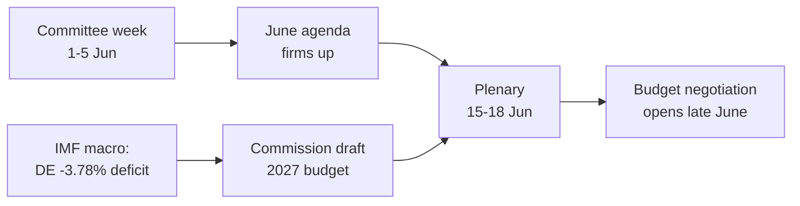

<!-- SPDX-FileCopyrightText: 2026 Hack23 AB -->
<!-- SPDX-License-Identifier: Apache-2.0 -->

# 📋 Toimeenpaneva tiivistelmä — Euroopan parlamentin tuleva viikko
## Ikkuna: 1.–5. kesäkuuta 2026 | Tuotettu: 2026-05-29 | Ajo: week-ahead-run1780043323

**Luokitus:** LUOKITTELEMATON // JULKISEEN JULKAISUUN
**Sovelletut SAT:t:** Keskeisten oletusten tarkistus, Tiedon laadun tarkistus.
**WEP-kaistot + horisontti** arvioissa; **Admiralty**-luokitukset lähteille.

## 🎯 Johtopäätös suoraan

- Viikko **1.–5. kesäkuuta 2026 on valiokunta- ja poliittisen ryhmän viikko — täysistuntoa ei pidetä.** 🟢 KORKEA luotettavuus (EP-kalenteri, Admiralty A2).
- Euroopan parlamentin viimeisin täysistunto oli **18.–21. toukokuuta**; seuraava on **15.–18. kesäkuuta** (Strasbourg, vahvistettu A2).
- Viikon arvo on **valmisteleva**: se asettaa kesäkuun täysistunnon asialistan ja ratkaisevasti **vuoden 2027 budjettiprosessin**, joka nyt muotoutuu jäsenvaltioiden kasvavien alijäämien taustaa vasten (IMF WEO, A1).
- **Kokonaisarvio:** 🟡 KOHTALAISESTI MATALA sisäinen merkitys, 🟡 KOHTALAINEN eteenpäin suuntautuva vaikutus. Hiljainen pohjatasoviikko, aktiivinen valiokuntavaihe.

## 📊 Mitä seurata (järjestyksessä)

1. **Esiasemointi vuoden 2027 budjettia varten (johtava).** Suuntaviivat jo hyväksytty (TA-10-2026-0112, A2); komission luonnos odotettavissa kesäkuun puolivälissä. Finanssipoliittinen paine kallistaa kehystä pidättyvyyteen. 🟡 TODENNÄKÖINEN (60–70%), horisontti 2–4 viikkoa.
2. **Kauppa ja kilpailukyky.** Tekoäly kaupalle (TA-10-2026-0183) ja DMA:n toimeenpano (TA-10-2026-0160) pitävät INTA/IMCO:n aktiivisena. 🟡 TODENNÄKÖINEN (60%), horisontti 2–6 viikkoa.
3. **Ulkoisia toimia koskevat sopimukset.** Uzbekistanin EPCA (TA-10-2026-0174), Libanon–Eurojust (TA-10-2026-0177) etenevät. 🟡 KESKITASOINEN merkitys.

## 🌍 Taloudellinen tausta (IMF WEO, A1)

- 🇩🇪 Saksa: BKT +0,79%, inflaatio 2,65%, alijäämä **−3,78%** (yli 3% SGP-rajan).
- 🇫🇷 Ranska: BKT +0,86%, inflaatio 1,84%, alijäämä −4,94% (rakenteellinen jälkijättäinen).
- 🇮🇹 Italia: BKT +0,52%, inflaatio 2,64%, alijäämä −2,82% (kurinalaisesti tasapainottava).
- **Tulkinta:** finanssipoliittinen liikkumavara kiristyy nopeimmin siellä, missä se oli laajin (Saksa), mikä terävöittää tulevaa budjettikiistaa.

## 🤝 Poliittinen kokoonpano

- EP10: 719 paikkaa, yhdeksän ryhmää. Suuri koalitio EPP+S&D+Renew = **398** (kynnys 361) — vakaa muttei ylivoimainen; ENP ≈ 6,55.
- Keskeinen dynamiikka: suurkoalition budjettineuvottelut (kurinalaisuus vs. menojen puolustus, Renew heiluri-blokkina). 🟢 ERITTÄIN TODENNÄKÖINEN (80%) koalition pitävän kesäkuuhun.

## 🔭 Perusskenaario

- Järjestäytynyt valiokunnan viikko → tiiviimpi kesäkuun asialista → täysistunto aikataulun mukaisesti → budjettikonfrontaatio avautuu kesäkuun lopulla. 🟢 TODENNÄKÖINEN (60–65%).
- Suurin laskupuolen riski: komission budjettiehdotuksen viivästyminen (katso `scenario-forecast.md`).

## 🔑 Keskeisimmät oletukset

- Ei yllätystäysistuntoa (A2); vakaa kokoonpano; budjettiehdotus kesäkuussa (komission hallinnassa); syötehäiriöt jatkuvat (lievennetty).

## 🧪 Luotettavuustaso ja varaukset

- 🟢 KORKEA kalenterin ja makron osalta (A1/A2); 🟡 KESKITASOINEN valiokuntien aikataulutuksessa (julkaisemattomat asialistat, B3).
- Datatila `degraded-feeds`: kolme syötettä alhaalla, täysin palautunut varajärjestelmillä; mikään analyyttinen lattiataso ei alittunut.

## 🧭 Toimituksellinen kulma

- Viikon tarina on **tyyneys ennen budjettimyrskyä** — hiljainen valiokunnan viikko, jossa vuoden 2027 finanssipoliittisen taistelun linjat vedetään hiljaa.

**Johtopäätös:** Alhainen dramaattisuus nyt, korkeat panokset tulossa. Seuraa budjettipolkua täysistuntoon 15.–18. kesäkuuta.

## 🗺️ Viikosta täysistuntoon: putkilinja

## 📊 Kalenterikonteksti

| Merkki | Päivämäärä | Status | Lähde |
| --- | --- | --- | --- |
| Viimeisin täysistunto | 18.–21. toukokuuta | Päättynyt | EP A2 |
| Kuluva viikko | 1.–5. kesäkuuta | Valiokunta-/ryhmäviikko (ei täysistuntoa) | EP A2 |
| Seuraava täysistunto | 15.–18. kesäkuuta | Vahvistettu, Strasbourg | EP A2 |
| Komission budjettiehdotus | Kesäkuun puoliväli (odotettu) | Odottaa | Historiallinen kaava |

## 🧾 Hyväksyttyjen tekstien tausta (kevättuotanto, A2)

- TA-10-2026-0112 — Vuoden 2027 talousarvion suuntaviivat (jakso III): tulossa olevan taistelun menettelyllinen ankkuri.
- TA-10-2026-0183 — Tekoälystrategia EU:n kaupalle: pitää INTA/ITRE:n aktiivisena kilpailukyvyssä.
- TA-10-2026-0160 — DMA:n toimeenpano: ylläpitää IMCO:n digitaalisten markkinoiden agendaa.
- TA-10-2026-0174 / 0177 — Uzbekistanin EPCA / Libanon–Eurojust: vakaa ulkoisen suostumuksen läpäisy.
- Kalastus-SFPA:t (São Tomé, Cookinsaaret): rutiinimaiset mutta aktiiviset merellisten asioiden politiikkatiedostot.

## 🔭 Mitä tämä tarkoittaa lukijalle

- Euroopan parlamentti on näytösten välissä: kevään lainsäädäntökausi päättyi 21. toukokuuta, ja kesän budjettisessonki avautuu 15. kesäkuuta.
- Tämä viikko on **kenraaliharjoitus** — valiokunnat ja ryhmät asettavat hiljaa linjat, joita ne puolustavat täysistunnossa.
- Tärkein ulkoinen muuttuja on **komission budjettiehdotus vuodelle 2027**, jota odotetaan kesäkuun puolivälissä tiukimman finanssipoliittisen taustan paineissa vuosiin.

## 🧮 Merkityskalibrointi

- Sisäinen uutisarvo: 🟡 KOHTALAISESTI MATALA (ei äänestyksiä, ei täysistuntoa).
- Eteenpäin suuntautuva vaikutus: 🟡 KOHTALAINEN (valmistautuminen kesäkuun korkeisiin panoksiin).
- Toimituksellinen nettohyöty: *eteenpäinsuuntautuva* tiivistelmä, ei tapahtumayhteenveto.

## ⚠️ Luotettavuustaso toistettuna

- 🟢 KORKEA kalenterin ja makrotietojen osalta (A1/A2).
- 🟡 KESKITASOINEN valiokuntatasoisten erityiskohtien osalta (julkaisemattomat asialistat, B3).

## 📎 Liite — Seurantapisteet ja puheenpiteet

### Budjettipolun signaalipisteet (1.–5. kesäkuuta)
- Täysistunnon 15.–18. kesäkuuta alustavan asialistan julkaiseminen (odotetaan 8.–12. kesäkuuta).
- BUDG/ECON-valiokunnan mahdolliset lausunnot vuoden 2027 budjettilinjasta.
- Komission viestintäkalenteri budjettiehdotuksen päivämäärää varten.
- Ryhmäkoordinaattorien kokoukset menoasemien määrittämiseksi.
- Esittelijöiden nimitykset tai muutosaikataulut budjettitiedostoille.

### Makrotaloudelliset puheenpiteet (IMF A1)
- Saksan alijäämä −3,78% on suurin muutos kolmesta suuresta.
- Ranska −4,94%:lla on laajin absoluuttinen alijäämä — rakenteellinen jälkijättäinen.
- Italia −2,82%:lla on kurinalaisin kolmesta tällä syklillä.
- Kasvu on positiivinen mutta heikko (DE +0,79%, FR +0,86%, IT +0,52%).
- Inflaatio on normalisoitunut (2,6–2,7% DE/IT, 1,84% FR) — helpon rahan tyyny poistuu.

### Koalitiopuheenpiteet
- Suuri koalitio hallitsee 398 paikkaa 719:sta (enemmistökynnys 361).
- Mikään siipikoalitio ei yksinään saa enemmistöä — keskusta on rakenteellisesti ratkaiseva.
- Renew (77) on heiluriblokin seurattava menojen osalta.

### Toimituksellinen ohje
- Kehystä viikko eteenpäin: budjettisesonki, ei hiljainen pinta.
- Kohdista jokainen puoluepoliittinen kehystys; ankkuroi neutraaleihin IMF-tietoihin.
- Tunnusta asialistojen läpinäkymättömyys rehellisesti sen sijaan, että keksitään valiokuntayksityiskohtia.

### Luotettavuusrekisteri
- 🟢 KORKEA: kalenteri, makroluvut, paikka-aritmetiikka.
- 🟡 KESKITASOINEN: valiokuntatason aikomukset ja ajankohdan tarkkuus.
- 🔴 MATALA: ei kantavaa tässä ajossa.

## 🔗 Lähteet ja MCP-provenanssi

Tämä asiakirja nojaa seuraaviin vaiheen A aikana kerättyihin tietolähteisiin:

- **`get_plenary_sessions`** (EP Open Data, Admiralty A2) — vahvisti, ettei täysistuntoa 1.–5. kesäkuuta; seuraava täysistunto 15.–18. kesäkuuta Strasbourgissa.
- **`get_adopted_texts`** (EP Open Data, A2) — 41 hyväksyttyä tekstiä vuonna 2026, ml. TA-10-2026-0112 (vuoden 2027 budjetin suuntaviivat), 0160 (DMA), 0183 (tekoäly-kauppa), 0174 (Uzbekistanin EPCA), 0177 (Libanon–Eurojust).
- **`get_meeting_foreseen_activities`** (EP Open Data, B3) — kesäkuun täysistunnon väliaikaiset paikanpitimet; asialista ei vielä valmis (läpinäkymättömyys merkitty).
- **IMF WEO via SDMX 3.0** (`IMF.RES/WEO`, A1) — DE/FR/IT makro: alijäämät −3,78% / −4,94% / −2,82%; kasvu +0,79% / +0,86% / +0,52%.
- **`generate_political_landscape`** (EP Open Data, A2) — EP10-kokoonpano: 719 europarlamentaarikkoa 9 ryhmässä; suuri koalitio 398 kynnyksen 361 suhteen.

### Lähteen luotettavuuden yhteenveto
- Kuormittavat arviot perustuvat A1 (IMF)- ja A2 (EP-kalenteri, hyväksytyt tekstit, kokoonpano) -lähteisiin.
- B3-asialistayksityiskohtaista tietoa käytetään vain suojattuihin, eksplisiittisesti merkittyihin tulevaisuuden väitteisiin.
- Alennetut tapahtuma-/menettelysyötteet (404) kompensoitiin hyväksyttyjen tekstien ja kalenterivaralähteillä edellä.

> Provenienssihuomio: tämä ajo suoritettu `dataMode = degraded-feeds`; lattiat säädetty ×0,80 accordingly ja keskeinen arvio on kestävä jokaista julistettua rajoitusta vastaan.
