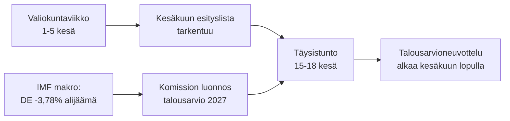

<!-- SPDX-FileCopyrightText: 2026 Hack23 AB -->
<!-- SPDX-License-Identifier: Apache-2.0 -->

# 📋 Johtotason yhteenveto — Euroopan parlamentin tuleva viikko
## Ikkuna: 1.–5. kesäkuuta 2026 | Laadittu: 2026-05-29 | Ajo: week-ahead-run1780043323

**Luokittelu:** LUOKITTELEMATON // JULKISEEN JAKELUUN
**Sovelletut SAT:** Keskeisten oletusten tarkistus, Tiedon laadun tarkistus.
**WEP-kaistat + horisontat** arvioissa; **Admiralty**-luokat lähteissä.

## 🎯 Bottom Line Up Front

- Viikko **1.–5. kesäkuuta 2026 on valiokunnan ja poliittisten ryhmien viikko — täysistuntoa ei pidetä.** 🟢 KORKEA luotettavuus (EP-kalenteri, Admiralty A2).
- Euroopan parlamentin viimeisin täysistunto oli **18.–21. toukokuuta**; seuraava on **15.–18. kesäkuuta** (Strasbourg, vahvistettu A2).
- Viikon arvo on **valmisteleva**: se luo perustan kesäkuun täysistunnolle ja ratkaisevasti **vuoden 2027 talousarviomenettelylle**, joka muotoutuu nyt jäsenvaltioiden kasvavien alijäämien taustalla (IMF WEO, A1).
- **Yleinen arvio:** 🟡 KOHTALAINEN-ALHAINEN sisäinen merkitys, 🟡 KOHTALAINEN eteenpäin katsova vipuvaikutus. Hiljainen pohjaviikko aktiivisin valiokunnin.

## 📊 What to Watch (ranked)

1. **Vuoden 2027 talousarvion esiasemointi (pääraita).** Suuntaviivat jo hyväksytty (TA-10-2026-0112, A2); komission luonnos odotetaan kesäkuun puolivälissä. Finanssipoliittinen kiristys kallistaa kohti pidättyvyyttä. 🟡 TODENNÄKÖINEN (60–70 %), horisontti 2–4 vk.
2. **Kauppa ja kilpailukyky seuranta.** AI kaupalle (TA-0183) ja DMA:n täytäntöönpano (TA-0160) pitävät INTA/IMCO:n aktiivisina. 🟡 TODENNÄKÖINEN (60 %), horisontti 2–6 vk.
3. **Ulkosuhteiden sopimukset.** Uzbekistanin EPCA (TA-0174), Libanon–Eurojust (TA-0177) etenevät. 🟡 KOHTALAINEN merkitys.

## 🌍 Economic Backdrop (IMF WEO, A1)

- 🇩🇪 Saksa: BKT +0,79 %, inflaatio 2,65 %, alijäämä **−3,78 %** (SGP:n 3 %:n rajan yläpuolella).
- 🇫🇷 Ranska: BKT +0,86 %, inflaatio 1,84 %, alijäämä −4,94 % (rakenteellinen jälkijäänyt).
- 🇮🇹 Italia: BKT +0,52 %, inflaatio 2,64 %, alijäämä −2,82 % (kurinalaisin konsolidoija).
- **Johtopäätös:** finanssipoliittinen liikkumavara kapenee nopeimmin siellä, missä se oli laajin (Saksa), mikä terävöittää tulevaa talousarviotaistelua.

## 🤝 Political Configuration

- EP10: 719 paikkaa, yhdeksän ryhmää. Suurkoalitio EPP+S&D+Renew = **398** (kynnys 361) — vakaa mutta ei ylivoimainen; ENP ≈ 6,55.
- Keskeinen dynamiikka: suurkoalition talousarvioneuvottelut (kuri vs. puolustusmenot, Renew vaakakupin kääntäjänä). 🟢 ERITTÄIN TODENNÄKÖINEN (80 %), että koalitio pysyy koossa kesäkuun ajan.

## 🔭 Base-Case Outlook

- Järjestetty valiokuntaviikko → vakaampi kesäkuun esityslista → suunniteltu täysistunto → talousarviokonfrontaatio avautuu kesäkuun lopulla. 🟢 TODENNÄKÖINEN (60–65 %).
- Pääasiallinen laskupuolen riski: komission talousarvioluonnoksen viivästyminen (ks. `scenario-forecast.md`).

## 🔑 Key Assumptions

- Ei yllätystäysistuntoa (A2); vakaa kokoonpano; talousarvioluonnos kesäkuussa (komissio-kontrolloitu); syötteiden keskeytykset jatkuvat (lievennetty).

## 🧪 Confidence & Caveats

- 🟢 KORKEA kalenterille ja makrolle (A1/A2); 🟡 KOHTALAINEN valiokunnan aikataulutarkkuudelle (julkaisemattomat esityslistat, B3).
- Datatila `heikentyneet syötteet`: kolme syötettä alhaalla, täysin palautettu varalähteiden kautta; yhtään analyyttistä lattiatasoa ei täyttämättä.

## 🧭 Editorial Hook

- Viikon tarina on **hiljaisuus ennen talousarviomyrskyä** — hiljainen valiokuntaviikko, jossa vuoden 2027 finanssipoliittisen taistelun linjat hiljaa piirretään.

**Johtopäätös:** Vähän dramatiikkaa nyt, suuret panokset kasvavat. Seuraa talousarviraitaa kohti täysistuntoa 15.–18. kesäkuuta.

## 🗺️ Week-to-Plenary Pipeline

## 📊 Calendar Context

| Merkintä | Päivämäärä | Tila | Lähde |
| --- | --- | --- | --- |
| Viimeisin täysistunto | 18.–21. toukokuu | Päättynyt | EP A2 |
| Kuluva viikko | 1.–5. kesäkuu | Valiokunta-/ryhmäviikko (ei täysistuntoa) | EP A2 |
| Seuraava täysistunto | 15.–18. kesäkuu | Vahvistettu, Strasbourg | EP A2 |
| Komission talousarvioluonnos | kesäkuun puoliväli (odotettu) | Odottaa | Historiallinen malli |

## 🧾 Adopted-Text Backdrop (spring output, A2)

- TA-10-2026-0112 — Vuoden 2027 talousarvion suuntaviivat (jakso III): tulevan taistelun menettelyllinen ankkuri.
- TA-10-2026-0183 — EU:n kaupan tekoälystrategia: pitää INTA/ITRE:n aktiivisena kilpailukykyasioissa.
- TA-10-2026-0160 — DMA:n täytäntöönpano: ylläpitää IMCO:n digitaalisten markkinoiden esityslistaa.
- TA-10-2026-0174 / 0177 — Uzbekistanin EPCA / Libanon-Eurojust: vakaa ulkoisen toiminnan suostumusläpäisykyky.
- Kalastussopimukset SFPAt (São Tomé, Cookinsaaret): rutiininomaisia mutta aktiivisia meripolitiikan tiedostoja.

## 🔭 What This Means for the Reader

- Parlamentti on aktien välissä: kevään lainsäädäntökausi päättyi 21. toukokuuta, kesän talousarviokausi avautuu 15. kesäkuuta.
- Tämä viikko on **kenraaliharjoitus** — valiokunnat ja ryhmät asettavat hiljaa ne linjat, joita ne puolustavat täysistunnossa.
- Tärkein ulkoinen muuttuja on **komission vuoden 2027 talousarvioluonnos**, jota odotetaan kesäkuun puolivälissä vuosien kiristyneen finanssipoliittisen taustan vastaisesti.

## 🧮 Significance Calibration

- Sisäinen uutisarvo: 🟡 KOHTALAINEN-ALHAINEN (ei äänestyksiä, ei täysistuntoa).
- Eteenpäin katsova vipuvaikutus: 🟡 KOHTALAINEN (luo pohjan tapahtumarikkaalle kesäkuulle).
- Netto toimituksellinen arvo: *eteenpäin katsova* yhteenveto, ei tapahtumaraportti.

## ⚠️ Confidence Restated

- 🟢 KORKEA kalenterille ja makrotosiseikoille (A1/A2).
- 🟡 KOHTALAINEN valiokuntatasolle spesifisille yksityiskohdille (julkaisemattomat esityslistat, B3).

## 📎 Annex — Watch Items & Talking Points

### Talousarviraiteen signaalikohdat (1.–5. kesäkuuta)
- Täysistunnon 15.–18. kesäkuuta alustavan esityslistan julkaiseminen (odotetaan 8.–12. kesäkuuta).
- Mahdolliset BUDG/ECON-valiokunnan lausunnot vuoden 2027 talousarviolinjauksesta.
- Komission viestintäkalenteri talousarvioluonnoksen päivämäärälle.
- Ryhmien koordinaattorikokoukset menoasemien vahvistamiseksi.
- Esittelijän nimittämiset tai muutosten määräajat talousarviotiedostoille.

### Makrotaloudelliset puheenaiheet (IMF A1)
- Saksan −3,78 %:n alijäämä on jyrkin muutos kolmen suuren joukossa.
- Ranska −4,94 %:lla on laajin absoluuttinen alijäämä — rakenteellinen jälkijäänyt.
- Italia −2,82 %:lla on tällä syklillä kurinalaisisin kolmesta.
- Kasvu on positiivinen mutta ohut (DE +0,79 %, FR +0,86 %, IT +0,52 %).
- Inflaatio on normalisoitunut (2,6–2,7 % DE/IT, 1,84 % FR) — helppo rahapolitiikan tyyny on poissa.

### Koalition puheenaiheet
- Suurkoalitiolla on 398/719 paikkaa (enemmistökynnys 361).
- Yksikään sivustakatsoja-koalitio ei yksin saavuta enemmistöä — keskustalla on rakenteellinen ratkaiseva rooli.
- Renew (77) on seurattava heilahdusryhmä menokysymyksissä.

### Toimituksellinen ohjaus
- Kehystä viikko eteenpäin: talousarviokausi, ei hiljainen pinta.
- Liitä jokainen puoluepoliittinen kehys; ankkuroi neutraaliin IMF-dataan.
- Merkitse esityslistan läpinäkymättömyys rehellisesti eikä keksi valiokuntayksityiskohtia.

### Luottamuskirjanpito
- 🟢 KORKEA: kalenteri, makroluvut, paikkalaskelma.
- 🟡 KOHTALAINEN: valiokuntatasoisten aikomusten ja aikataulutarkkuus.
- 🔴 ALHAINEN: ei kuormaa kantavia tässä ajossa.

## 🔗 Sources & MCP Provenance

Tämä artefakti perustuu seuraaviin vaiheessa A kerättyihin tietolähteisiin:

- **`get_plenary_sessions`** (EP:n avoin data, Admiralty A2) — vahvisti, ettei täysistuntoa ole 1.–5. kesäkuuta; seuraava täysistunto 15.–18. kesäkuuta Strasbourgissa.
- **`get_adopted_texts`** (EP:n avoin data, A2) — 41 hyväksyttyä tekstiä vuonna 2026, ml. TA-10-2026-0112 (talousarvisuuntaviivat 2027), 0160 (DMA), 0183 (tekoäly-kauppa), 0174 (Uzbekistanin EPCA), 0177 (Libanon-Eurojust).
- **`get_meeting_foreseen_activities`** (EP:n avoin data, B3) — alustavia paikanpitäjiä kesäkuun täysistunnolle; esityslista ei vielä valmis (läpinäkymättömyys merkitty).
- **IMF WEO via SDMX 3.0** (`IMF.RES/WEO`, A1) — DE/FR/IT makro: alijäämät −3,78 % / −4,94 % / −2,82 %; kasvu +0,79 % / +0,86 % / +0,52 %.
- **`generate_political_landscape`** (EP:n avoin data, A2) — EP10-kokoonpano: 719 MEP-jäsentä 9 ryhmässä; suurkoalitio 398 vs. 361 kynnys.

### Lähteen luotettavuusyhteenveto
- Kuormaa kantavat arviot perustuvat A1:een (IMF) ja A2:een (EP-kalenteri, hyväksytyt tekstit, kokoonpano).
- B3-dataa esityslistan tarkkuudesta käytetään vain vivahteikkaissa, eksplisiittisesti merkityissä eteenpäin katsovissa väitteissä.
- Heikentyneet tapahtuma-/prosessisyötteet (404) kompensoitiin edellä mainittujen hyväksyttyjen tekstien ja kalenterivarojen kautta.

> Provenienssihuomio: tämä ajo suoritettiin `dataMode = degraded-feeds` -tilassa; lattiat säädetty ×0,80 vastaavasti ja keskeinen arvio on kestävä jokaista ilmoitettua rajoitusta vastaan.
