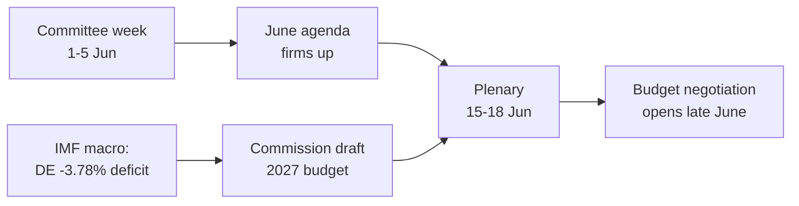

<!-- SPDX-FileCopyrightText: 2026 Hack23 AB -->
<!-- SPDX-License-Identifier: Apache-2.0 -->

# 📋 Note de synthèse exécutive — Semaine à venir au Parlement européen
## Fenêtre : 1er–5 juin 2026 | Produite : 2026-05-29 | Exécution : week-ahead-run1780043323

**Classification :** NON CLASSIFIÉ // POUR DIFFUSION PUBLIQUE
**SAT appliquées :** Vérification des hypothèses clés, Contrôle de la qualité de l'information.
**Bandes WEP + horizons** sur les appréciations ; **Admiralty** sur les sources.

## 🎯 Conclusion directe

- La semaine **du 1er au 5 juin 2026 est une semaine de commissions et de groupes politiques — aucune session plénière ne siège.** 🟢 HAUTE confiance (calendrier PE, Admiralty A2).
- La dernière séance plénière du Parlement européen était le **18–21 mai** ; la prochaine est le **15–18 juin** (Strasbourg, confirmé A2).
- La valeur de la semaine est **préparatoire** : elle établit l'ordre du jour de la plénière de juin et, de manière décisive, la **procédure budgétaire 2027** qui se forme désormais dans un contexte de déficits croissants des États membres (IMF WEO, A1).
- **Appréciation globale :** 🟡 MODÉRÉMENT FAIBLE pertinence intrinsèque, 🟡 MODÉRÉ effet de levier prospectif. Une semaine de plancher tranquille, de commissions actives.

## 📊 Points à surveiller (classés par ordre de priorité)

1. **Prépositionnement pour le budget 2027 (en tête de liste).** Lignes directrices déjà adoptées (TA-10-2026-0112, A2) ; projet de la Commission attendu mi-juin. La pression budgétaire oriente le cadre vers la rigueur. 🟡 PROBABLE (60–70%), horizon 2–4 semaines.
2. **Commerce et compétitivité.** L'IA pour le commerce (TA-10-2026-0183) et l'application du DMA (TA-10-2026-0160) maintiennent INTA/IMCO actives. 🟡 PROBABLE (60%), horizon 2–6 semaines.
3. **Traités d'action extérieure.** CPCA de l'Ouzbékistan (TA-10-2026-0174), Liban–Eurojust (TA-10-2026-0177) avancent. 🟡 IMPORTANCE MOYENNE.

## 🌍 Contexte économique (IMF WEO, A1)

- 🇩🇪 Allemagne : PIB +0,79 %, inflation 2,65 %, déficit **−3,78 %** (au-dessus de la ligne SGP des 3 %).
- 🇫🇷 France : PIB +0,86 %, inflation 1,84 %, déficit −4,94 % (retardataire structurel).
- 🇮🇹 Italie : PIB +0,52 %, inflation 2,64 %, déficit −2,82 % (le consolidateur discipliné).
- **Lecture :** la marge budgétaire se resserre le plus vite là où elle était la plus large (Allemagne), ce qui aiguise la bataille budgétaire à venir.

## 🤝 Configuration politique

- PE10 : 719 sièges, neuf groupes. Grande coalition PPE+S&D+Renew = **398** (seuil 361) — stable mais non écrasante ; ENP ≈ 6,55.
- Dynamique centrale : négociations budgétaires de la grande coalition (discipline vs défense des dépenses, Renew comme bloc pivot). 🟢 TRÈS PROBABLE (80%) que la coalition tienne jusqu'en juin.

## 🔭 Scénario de base

- Semaine de commissions ordonnée → ordre du jour de juin plus ferme → session plénière dans les délais → confrontation budgétaire s'ouvre fin juin. 🟢 PROBABLE (60–65 %).
- Principal risque baissier : glissement du projet de budget de la Commission (voir `scenario-forecast.md`).

## 🔑 Hypothèses clés

- Pas de session plénière surprise (A2) ; composition stable ; projet de budget en juin (sous contrôle de la Commission) ; pannes de flux persistent (atténuées).

## 🧪 Niveau de confiance et réserves

- 🟢 HAUT sur le calendrier et les données macroéconomiques (A1/A2) ; 🟡 MOYEN sur le calendrier des commissions (ordres du jour non publiés, B3).
- Mode de données `degraded-feeds` : trois flux hors service, entièrement récupérés via des solutions de substitution ; aucun plancher analytique non satisfait.

## 🧭 Angle éditorial

- L'histoire de la semaine est **le calme avant la tempête budgétaire** — une semaine de commissions discrète où les lignes de la bataille fiscale 2027 se tracent en silence.

**Conclusion :** Peu de dramatique maintenant, enjeux importants en préparation. Suivre la piste budgétaire jusqu'à la plénière des 15–18 juin.

## 🗺️ De la semaine à la plénière : pipeline

## 📊 Contexte calendaire

| Repère | Date | Statut | Source |
| --- | --- | --- | --- |
| Dernière plénière | 18–21 mai | Achevée | PE A2 |
| Semaine en cours | 1–5 juin | Semaine de commissions/groupes (pas de plénière) | PE A2 |
| Prochaine plénière | 15–18 juin | Confirmée, Strasbourg | PE A2 |
| Projet de budget de la Commission | Mi-juin (prévu) | En attente | Tendance historique |

## 🧾 Contexte des textes adoptés (production printanière, A2)

- TA-10-2026-0112 — Lignes directrices budgétaires 2027 (section III) : l'ancre procédurale pour la bataille à venir.
- TA-10-2026-0183 — Stratégie IA pour le commerce de l'UE : maintient INTA/ITRE actives sur la compétitivité.
- TA-10-2026-0160 — Application du DMA : soutient le programme des marchés numériques d'IMCO.
- TA-10-2026-0174 / 0177 — CPCA Ouzbékistan / Liban–Eurojust : débit stable de consentements d'action extérieure.
- APPCP pêche (São Tomé, îles Cook) : dossiers de politique maritime courants mais actifs.

## 🔭 Ce que cela signifie pour le lecteur

- Le Parlement européen est entre deux actes : la saison législative du printemps s'est clôturée le 21 mai, la saison budgétaire d'été ouvre le 15 juin.
- Cette semaine est la **répétition** — les commissions et les groupes tracent silencieusement les lignes qu'ils défendront en séance plénière.
- La variable externe la plus importante est le **projet de budget 2027 de la Commission**, attendu mi-juin dans le contexte budgétaire le plus tendu depuis des années.

## 🧮 Calibrage de l'importance

- Valeur journalistique intrinsèque : 🟡 MODÉRÉMENT FAIBLE (pas de votes, pas de plénière).
- Effet de levier prospectif : 🟡 MODÉRÉ (prépare un juin à forts enjeux).
- Valeur éditoriale nette : une note *prospective*, non un résumé d'événements.

## ⚠️ Niveau de confiance répété

- 🟢 HAUT sur les faits calendaires et macroéconomiques (A1/A2).
- 🟡 MOYEN sur les spécificités au niveau des commissions (ordres du jour non publiés, B3).

## 📎 Annexe — Points de surveillance et éléments de langage

### Jalons de la piste budgétaire (1–5 juin)
- Publication du projet d'ordre du jour de la plénière des 15–18 juin (attendue 8–12 juin).
- Éventuelles déclarations de la commission BUDG/ECON préfigurant la ligne 2027.
- Calendrier de communication de la Commission pour la date du projet de budget.
- Réunions des coordinateurs de groupes pour définir les positions de dépenses.
- Nominations de rapporteurs ou délais d'amendements pour les dossiers budgétaires.

### Éléments de langage macroéconomiques (IMF A1)
- Le déficit de l'Allemagne à −3,78 % est le retournement le plus marqué parmi les trois grands.
- La France à −4,94 % affiche le déficit absolu le plus large — le retardataire structurel.
- L'Italie à −2,82 % est la plus disciplinée des trois au cours de ce cycle.
- La croissance est positive mais mince (DE +0,79 %, FR +0,86 %, IT +0,52 %).
- L'inflation s'est normalisée (2,6–2,7 % DE/IT, 1,84 % FR) — retirant l'amortisseur de l'argent facile.

### Éléments de langage sur la coalition
- La grande coalition détient 398 des 719 sièges (seuil de majorité 361).
- Aucune coalition de flanc n'atteint seule une majorité — le centre est structurellement décisif.
- Renew (77) est le bloc pivot à surveiller sur les dépenses.

### Conseils éditoriaux
- Cadrer la semaine vers l'avant : la saison budgétaire, non la surface tranquille.
- Attribuer chaque cadrage partisan ; s'ancrer sur les données neutres de l'IMF.
- Reconnaître honnêtement l'opacité des ordres du jour plutôt que d'inventer des détails de commission.

### Registre de confiance
- 🟢 HAUT : calendrier, chiffres macroéconomiques, arithmétique des sièges.
- 🟡 MOYEN : intentions au niveau des commissions et précision temporelle.
- 🔴 BAS : rien de structurant lors de cette exécution.

## 🔗 Sources et provenance MCP

Ce document s'appuie sur les sources de données suivantes collectées durant la phase A :

- **`get_plenary_sessions`** (PE Open Data, Admiralty A2) — confirmé l'absence de plénière du 1er au 5 juin ; prochaine plénière 15–18 juin Strasbourg.
- **`get_adopted_texts`** (PE Open Data, A2) — 41 textes adoptés en 2026, dont TA-10-2026-0112 (lignes directrices budget 2027), 0160 (DMA), 0183 (IA-commerce), 0174 (CPCA Ouzbékistan), 0177 (Liban–Eurojust).
- **`get_meeting_foreseen_activities`** (PE Open Data, B3) — libellés provisoires pour la plénière de juin ; ordre du jour non finalisé (opacité signalée).
- **IMF WEO via SDMX 3.0** (`IMF.RES/WEO`, A1) — macroéconomie DE/FR/IT : déficits −3,78 % / −4,94 % / −2,82 % ; croissance +0,79 % / +0,86 % / +0,52 %.
- **`generate_political_landscape`** (PE Open Data, A2) — composition PE10 : 719 deputés répartis en 9 groupes ; grande coalition 398 face au seuil 361.

### Synthèse de la fiabilité des sources
- Les appréciations décisives reposent sur des sources A1 (IMF) et A2 (calendrier PE, textes adoptés, composition).
- Les données de granularité B3 des ordres du jour ne sont utilisées que pour des affirmations prospectives couvertes et explicitement signalées.
- Les flux événements/procédures dégradés (404) ont été compensés via les textes adoptés et les sources de substitution calendaires ci-dessus.

> Note de provenance : cette exécution s'est déroulée en `dataMode = degraded-feeds` ; les planchers ont été ajustés ×0,80 en conséquence et l'appréciation centrale est robuste face à chaque limitation déclarée.
