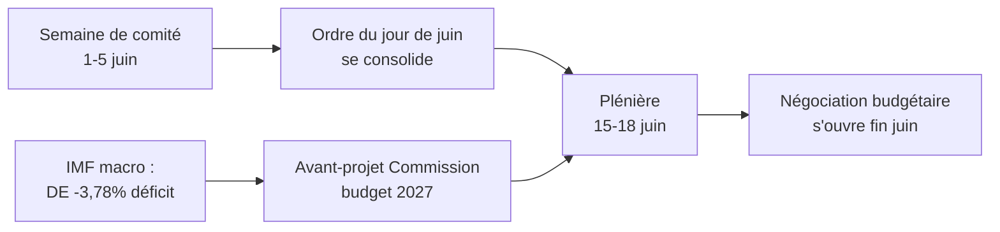

<!-- SPDX-FileCopyrightText: 2026 Hack23 AB -->
<!-- SPDX-License-Identifier: Apache-2.0 -->

# 📋 Note de synthèse — Semaine à venir au Parlement européen
## Période : 1er–5 juin 2026 | Produit le : 2026-05-29 | Exécution : week-ahead-run1780043323

**Classification :** NON CLASSIFIÉ // POUR DIFFUSION PUBLIQUE
**SAT appliqués :** Vérification des hypothèses clés, Vérification de la qualité de l'information.
**Bandes WEP + horizons** sur les appréciations ; grades **Admiralty** sur les sources.

## 🎯 Bottom Line Up Front

- La semaine du **1er–5 juin 2026 est une semaine de comité et de groupe politique — aucune session plénière ne siège.** 🟢 CONFIANCE ÉLEVÉE (calendrier PE, Admiralty A2).
- La dernière session plénière du Parlement européen s'est tenue les **18–21 mai** ; la prochaine aura lieu les **15–18 juin** (Strasbourg, confirmée A2).
- La valeur de cette semaine est **préparatoire** : elle prépare la plénière de juin et, de façon décisive, la **procédure budgétaire 2027** qui se dessine face à des déficits croissants dans les États membres (IMF WEO, A1).
- **Appréciation globale :** 🟡 SIGNIFICANCE MODÉRÉE-FAIBLE, 🟡 EFFET DE LEVIER PROSPECTIF MODÉRÉ. Une semaine de plancher calme, avec des commissions actives.

## 📊 What to Watch (ranked)

1. **Pré-positionnement Budget 2027 (fil conducteur).** Lignes directrices déjà adoptées (TA-10-2026-0112, A2) ; avant-projet de la Commission attendu mi-juin. La contrainte budgétaire incline vers la retenue. 🟡 PROBABLE (60–70 %), horizon 2–4 semaines.
2. **Commerce & compétitivité : suivi.** L'IA pour le commerce (TA-0183) et l'application du DMA (TA-0160) maintiennent INTA/IMCO actifs. 🟡 PROBABLE (60 %), horizon 2–6 semaines.
3. **Traités de politique extérieure.** Accord de partenariat et de coopération renforcé Ouzbékistan (TA-0174), Liban-Eurojust (TA-0177) progressent. 🟡 PERTINENCE MOYENNE.

## 🌍 Economic Backdrop (IMF WEO, A1)

- 🇩🇪 Allemagne : PIB +0,79 %, inflation 2,65 %, déficit **−3,78 %** (au-dessus du plafond SGP de 3 %).
- 🇫🇷 France : PIB +0,86 %, inflation 1,84 %, déficit −4,94 % (retardataire structurel).
- 🇮🇹 Italie : PIB +0,52 %, inflation 2,64 %, déficit −2,82 % (le consolidateur discipliné).
- **Lecture :** la marge de manœuvre budgétaire se réduit le plus vite là où elle était la plus large (Allemagne), ce qui aiguise le combat budgétaire à venir.

## 🤝 Political Configuration

- PE10 : 719 sièges, neuf groupes. Grande coalition PPE+S&D+Renew = **398** (seuil 361) — stable mais non écrasante ; ENP ≈ 6,55.
- Dynamique centrale : négociations budgétaires de la grande coalition (discipline contre dépenses de défense, Renew comme arbitre). 🟢 TRÈS PROBABLE (80 %) que la coalition tienne jusqu'en juin.

## 🔭 Base-Case Outlook

- Semaine de comité ordonnée → ordre du jour de juin plus ferme → plénière conforme au calendrier → confrontation budgétaire qui s'ouvre fin juin. 🟢 PROBABLE (60–65 %).
- Principal risque à la baisse : glissement de l'avant-projet de budget de la Commission (voir `scenario-forecast.md`).

## 🔑 Key Assumptions

- Pas de plénière surprise (A2) ; composition stable ; avant-projet de budget en juin (sous contrôle de la Commission) ; perturbations des flux de données persistent (atténuées).

## 🧪 Confidence & Caveats

- 🟢 ÉLEVÉE sur le calendrier et les données macro (A1/A2) ; 🟡 MOYENNE sur le calendrier des commissions (ordres du jour non publiés, B3).
- Mode données `flux dégradés` : trois flux défaillants, entièrement récupérés via des sources de substitution ; aucun plancher analytique non satisfait.

## 🧭 Editorial Hook

- Le fil conducteur de la semaine est **le calme avant la tempête budgétaire** — une semaine de comité tranquille où les lignes de la bataille fiscale 2027 se tracent discrètement.

**Conclusion :** Peu de drama maintenant, les enjeux montent. Surveiller le fil budgétaire jusqu'à la plénière des 15–18 juin.

## 🗺️ Week-to-Plenary Pipeline

## 📊 Calendar Context

| Repère | Date | Statut | Source |
| --- | --- | --- | --- |
| Dernière plénière | 18–21 mai | Conclue | PE A2 |
| Semaine courante | 1–5 juin | Semaine de comité/groupe (pas de plénière) | PE A2 |
| Prochaine plénière | 15–18 juin | Confirmée, Strasbourg | PE A2 |
| Avant-projet de budget de la Commission | mi-juin (attendu) | En attente | Schéma historique |

## 🧾 Adopted-Text Backdrop (spring output, A2)

- TA-10-2026-0112 — Lignes directrices du budget 2027 (section III) : l'ancre procédurale du combat à venir.
- TA-10-2026-0183 — Stratégie IA pour le commerce de l'UE : maintient INTA/ITRE actifs sur la compétitivité.
- TA-10-2026-0160 — Application du DMA : soutient l'agenda marché numérique de l'IMCO.
- TA-10-2026-0174 / 0177 — Accord de partenariat Ouzbékistan / Liban-Eurojust : flux régulier de consentements en matière d'action extérieure.
- SFPA pêche (São Tomé, Îles Cook) : dossiers de politique marine routiniers mais actifs.

## 🔭 What This Means for the Reader

- Le Parlement est entre deux actes : la saison législative de printemps s'est close le 21 mai, la saison budgétaire d'été s'ouvre le 15 juin.
- Cette semaine est la **répétition** — les commissions et les groupes fixent discrètement les positions qu'ils défendront dans l'hémicycle.
- La variable externe la plus importante est **l'avant-projet de budget 2027 de la Commission**, attendu mi-juin dans le contexte budgétaire le plus serré depuis des années.

## 🧮 Significance Calibration

- Valeur éditoriale intrinsèque : 🟡 MODÉRÉE-FAIBLE (pas de votes, pas de plénière).
- Effet de levier prospectif : 🟡 MODÉRÉ (prépare un juin à forts enjeux).
- Valeur éditoriale nette : une note de synthèse *prospective*, non un compte rendu d'événements.

## ⚠️ Confidence Restated

- 🟢 ÉLEVÉE sur le calendrier et les faits macro (A1/A2).
- 🟡 MOYENNE sur les détails au niveau des commissions (ordres du jour non publiés, B3).

## 📎 Annex — Watch Items & Talking Points

### Points de signal sur le fil budgétaire (1er–5 juin)
- Publication du projet d'ordre du jour préliminaire de la plénière des 15–18 juin (attendue les 8–12 juin).
- Éventuelle déclaration de la commission BUDG/ECON préfigurant la ligne du budget 2027.
- Calendrier des communications de la Commission pour la date de l'avant-projet de budget.
- Réunions des coordinateurs des groupes pour définir les positions en matière de dépenses.
- Nominations des rapporteurs ou délais d'amendement pour les dossiers budgétaires.

### Points de discussion macro (IMF A1)
- Le déficit de l'Allemagne à −3,78 % représente le basculement le plus marqué parmi les trois grands.
- La France à −4,94 % présente le déficit absolu le plus large — le retardataire structurel.
- L'Italie à −2,82 % est la plus disciplinée des trois dans ce cycle.
- La croissance est positive mais ténue (DE +0,79 %, FR +0,86 %, IT +0,52 %).
- L'inflation s'est normalisée (2,6–2,7 % DE/IT, 1,84 % FR) — le coussin de la politique monétaire facile a disparu.

### Points de discussion sur la coalition
- La grande coalition détient 398 des 719 sièges (seuil de majorité 361).
- Aucune coalition de flanc n'atteint seule une majorité — le centre est structurellement décisif.
- Renew (77) est le groupe pivot à surveiller sur les dépenses.

### Consignes éditoriales
- Encadrer la semaine en perspective : la saison budgétaire, non la surface tranquille.
- Attribuer tout cadrage partisan ; ancrer sur des données IMF neutres.
- Signaler honnêtement l'opacité de l'agenda plutôt que d'inventer des détails de commission.

### Registre de confiance
- 🟢 ÉLEVÉE : calendrier, chiffres macro, arithmétique des sièges.
- 🟡 MOYENNE : intentions au niveau des commissions et précision calendaire.
- 🔴 FAIBLE : aucun élément porteur dans cette exécution.

## 🔗 Sources & MCP Provenance

Cet artefact s'appuie sur les sources de données suivantes collectées au cours de l'étape A :

- **`get_plenary_sessions`** (données ouvertes PE, Admiralty A2) — aucune plénière confirmée les 1–5 juin ; prochaine plénière 15–18 juin Strasbourg.
- **`get_adopted_texts`** (données ouvertes PE, A2) — 41 textes adoptés en 2026, dont TA-10-2026-0112 (lignes directrices budget 2027), 0160 (DMA), 0183 (IA-commerce), 0174 (Ouzbékistan EPCA), 0177 (Liban-Eurojust).
- **`get_meeting_foreseen_activities`** (données ouvertes PE, B3) — espaces réservés provisoires pour la plénière de juin ; ordre du jour non finalisé (opacité signalée).
- **IMF WEO via SDMX 3.0** (`IMF.RES/WEO`, A1) — macro DE/FR/IT : déficits −3,78 % / −4,94 % / −2,82 % ; croissance +0,79 % / +0,86 % / +0,52 %.
- **`generate_political_landscape`** (données ouvertes PE, A2) — composition EP10 : 719 députés répartis en 9 groupes ; grande coalition 398 contre seuil 361.

### Résumé de fiabilité des sources
- Les appréciations porteuses s'appuient sur A1 (IMF) et A2 (calendrier PE, textes adoptés, composition).
- Les données B3 sur la granularité de l'agenda ne sont utilisées que pour des affirmations prospectives nuancées et explicitement signalées.
- Les flux d'événements/procédures dégradés (404) ont été compensés via les textes adoptés et les sources de calendrier de substitution ci-dessus.

> Note de provenance : cette exécution s'est déroulée en mode `dataMode = degraded-feeds` ; les planchers ont été ajustés ×0,80 en conséquence, et l'appréciation centrale est robuste par rapport à chaque limitation déclarée.
