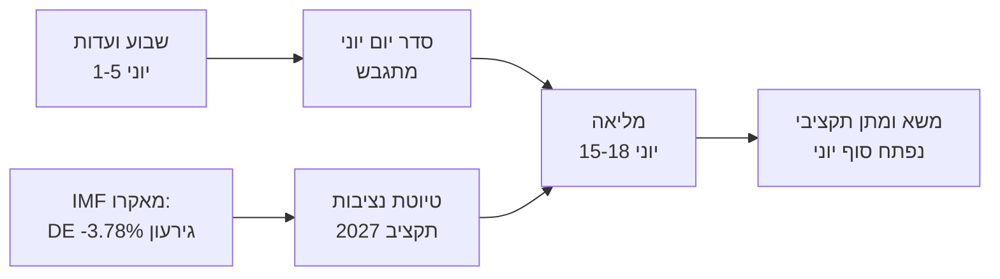

<!-- SPDX-FileCopyrightText: 2026 Hack23 AB -->
<!-- SPDX-License-Identifier: Apache-2.0 -->

# 📋 תקציר מנהלים — השבוע הקרוב בפרלמנט האירופי
## חלון: 1–5 ביוני 2026 | הופק: 2026-05-29 | ריצה: week-ahead-run1780043323

**סיווג:** לא מסווג // לפרסום פומבי
**SAT שהופעלו:** בדיקת הנחות מפתח, בדיקת איכות המידע.
**פסי WEP + אופקים** על שיפוטים; ציוני **Admiralty** על מקורות.

## 🎯 Bottom Line Up Front

- שבוע **1–5 ביוני 2026 הוא שבוע ועדות וקבוצות פוליטיות — לא מתקיימת מושב מליאה.** 🟢 אמינות גבוהה (לוח שנה של PE, Admiralty A2).
- המושב המליאה האחרון של הפרלמנט האירופי היה ב**18–21 במאי**; הבא ב**15–18 ביוני** (שטרסבורג, מאושר A2).
- ערך השבוע הוא **הכנה**: הוא מניח את היסוד למליאת יוני ו, באופן מכריע, ל**הליך תקציב 2027** המתגבש כעת מול גירעונות מתרחבים במדינות החברות (IMF WEO, A1).
- **שיפוט כולל:** 🟡 משמעות פנימית בינונית-נמוכה, 🟡 מינוף עתידי מתון. שבוע בסיס שקט עם ועדות פעילות.

## 📊 What to Watch (ranked)

1. **מיצוב מוקדם לתקציב 2027 (נתיב ראשי).** הנחיות כבר אומצו (TA-10-2026-0112, A2); טיוטת הנציבות צפויה באמצע יוני. לחץ פיסקלי נוטה לריסון. 🟡 סביר (60–70%), אופק 2–4 שבועות.
2. **סחר ותחרותיות: מעקב.** AI לסחר (TA-0183) ואכיפת DMA (TA-0160) שומרים על INTA/IMCO פעילות. 🟡 סביר (60%), אופק 2–6 שבועות.
3. **אמנות מדיניות חוץ.** EPCA אוזבקיסטן (TA-0174), לבנון-Eurojust (TA-0177) מתקדמות. 🟡 רלוונטיות בינונית.

## 🌍 Economic Backdrop (IMF WEO, A1)

- 🇩🇪 גרמניה: תמ"ג +0.79%, אינפלציה 2.65%, גירעון **−3.78%** (מעל קו ה-3% של SGP).
- 🇫🇷 צרפת: תמ"ג +0.86%, אינפלציה 1.84%, גירעון −4.94% (פיגור מבני).
- 🇮🇹 איטליה: תמ"ג +0.52%, אינפלציה 2.64%, גירעון −2.82% (המאחד המשמעתי).
- **קריאה:** מרחב הפעולה הפיסקלי מתכווץ מהר ביותר שם שהיה הרחב ביותר (גרמניה), מה שמחדד את קרב התקציב הקרוב.

## 🤝 Political Configuration

- EP10: 719 מושבים, תשע קבוצות. קואליציה גדולה EPP+S&D+Renew = **398** (סף 361) — יציבה אך לא מכריעה; ENP ≈ 6.55.
- דינמיקה מרכזית: משא ומתן תקציבי של הקואליציה הגדולה (משמעת מול הוצאות ביטחון, Renew כמאזן). 🟢 סביר מאוד (80%) שהקואליציה תחזיק דרך יוני.

## 🔭 Base-Case Outlook

- שבוע ועדות מסודר → סדר יום יוני מוצק יותר → מליאה לפי לוח זמנים → עימות תקציבי נפתח בסוף יוני. 🟢 סביר (60–65%).
- סיכון מרכזי לפוטנציאל ירידה: דחייה בטיוטת תקציב הנציבות (ראו `scenario-forecast.md`).

## 🔑 Key Assumptions

- ללא מליאה מפתיעה (A2); הרכב יציב; טיוטת תקציב ביוני (בשליטת הנציבות); הפרעות זרמי נתונים נמשכות (מוקלות).

## 🧪 Confidence & Caveats

- 🟢 גבוהה על לוח שנה ומאקרו (A1/A2); 🟡 בינונית על לוח זמנים של ועדות (סדרי יום שלא פורסמו, B3).
- מצב נתונים `זרמים פגומים`: שלושה זרמים מושבתים, שוחזרו במלואם דרך מקורות גיבוי; אף רצפת ניתוח לא נותרה בלתי מאוישת.

## 🧭 Editorial Hook

- סיפור השבוע הוא **השקט שלפני סערת התקציב** — שבוע ועדות שקט שבו נמתחות קווי הקרב הפיסקלי של 2027 בשקט.

**מסקנה:** מעט דרמה עכשיו, נאמרות גבוהות מצטברות. לעקוב אחר מסלול התקציב לקראת המליאה ב-15–18 ביוני.

## 🗺️ Week-to-Plenary Pipeline

## 📊 Calendar Context

| סימן דרך | תאריך | סטטוס | מקור |
| --- | --- | --- | --- |
| מליאה אחרונה | 18–21 במאי | הסתיימה | EP A2 |
| שבוע נוכחי | 1–5 ביוני | שבוע ועדות/קבוצות (ללא מליאה) | EP A2 |
| מליאה הבאה | 15–18 ביוני | מאושר, שטרסבורג | EP A2 |
| טיוטת תקציב הנציבות | אמצע יוני (צפוי) | ממתין | דפוס היסטורי |

## 🧾 Adopted-Text Backdrop (spring output, A2)

- TA-10-2026-0112 — הנחיות תקציב 2027 (סעיף III): עוגן הנהלי למלחמה הקרובה.
- TA-10-2026-0183 — אסטרטגיית AI לסחר האיחוד האירופי: שומר על INTA/ITRE פעילות בתחרותיות.
- TA-10-2026-0160 — אכיפת DMA: מקיים אג'נדה שוק דיגיטלי של IMCO.
- TA-10-2026-0174 / 0177 — EPCA אוזבקיסטן / לבנון-Eurojust: תפוקת הסכמה יציבה לפעולה חיצונית.
- SFPA דיג (סאו טומה, איי קוק): תיקי מדיניות ימית שגרתיים אך פעילים.

## 🔭 What This Means for the Reader

- הפרלמנט נמצא בין שתי מערכות: עונת החקיקה האביבית הסתיימה ב-21 במאי, עונת התקציב הקיצית נפתחת ב-15 ביוני.
- שבוע זה הוא **החזרה הכללית** — ועדות וקבוצות קובעות בשקט את העמדות שיגנו עליהן בפגישה מליאה.
- המשתנה החיצוני החשוב ביותר הוא **טיוטת הנציבות לתקציב 2027**, הצפויה באמצע יוני על רקע הפיסקלי המצומצם ביותר בשנים.

## 🧮 Significance Calibration

- ערך חדשותי פנימי: 🟡 בינוני-נמוך (אין הצבעות, אין מליאה).
- מינוף עתידי: 🟡 מתון (מכין יוני בעל סיכון גבוה).
- ערך עיתונאי נטו: תקציר *עתידני*, לא דוח אירועים.

## ⚠️ Confidence Restated

- 🟢 גבוהה על עובדות לוח שנה ומאקרו (A1/A2).
- 🟡 בינונית על פרטים ברמת ועדות (סדרי יום שלא פורסמו, B3).

## 📎 Annex — Watch Items & Talking Points

### נקודות אות מסלול תקציב (1–5 ביוני)
- פרסום טיוטת סדר יום ראשוני למליאה 15–18 ביוני (צפוי 8–12 ביוני).
- כל הצהרת BUDG/ECON המציגה מראש את קו תקציב 2027.
- לוח תקשורת הנציבות לתאריך טיוטת התקציב.
- ישיבות מתאמי קבוצות לקביעת עמדות הוצאה.
- מינויי מדווחים או תאריכי אחרון לתיקונים על קבצי תקציב.

### נקודות שיחה מאקרו-כלכליות (IMF A1)
- גירעון גרמניה על −3.78% הוא השינוי החד ביותר בין שלוש הגדולות.
- צרפת על −4.94% מחזיקה בגירעון המוחלט הרחב ביותר — הפיגור המבני.
- איטליה על −2.82% היא המשמעתית ביותר מבין השלוש במחזור זה.
- הצמיחה חיובית אך דלה (DE +0.79%, FR +0.86%, IT +0.52%).
- האינפלציה התנרמלה (2.6–2.7% DE/IT, 1.84% FR) — הכרית של המדיניות המוניטרית הקלה נעלמה.

### נקודות שיחה על קואליציה
- הקואליציה הגדולה מחזיקה 398 מתוך 719 מושבים (סף רוב 361).
- שום קואליציית אגף לא מגיעה לרוב לבדה — המרכז הוא מכריע מבנית.
- Renew (77) היא הקבוצה המאזנת לעקוב אחריה בענייני הוצאה.

### הנחיות עיתונאיות
- לפרט את השבוע קדימה: עונת התקציב, לא השטח השקט.
- לייחס כל מסגרת מפלגתית; לעגן בנתוני IMF ניטרליים.
- לדווח בכנות על אטימות סדר יום במקום להמציא פרטי ועדות.

### פנקס אמינות
- 🟢 גבוהה: לוח שנה, מספרים מאקרו, חשבון מושבים.
- 🟡 בינונית: כוונות ברמת ועדות ודיוק זמן.
- 🔴 נמוכה: אין נושאים נושאים בריצה זו.

## 🔗 Sources & MCP Provenance

ארטיפקט זה מבוסס על מקורות הנתונים הבאים שנאספו במהלך שלב A:

- **`get_plenary_sessions`** (נתוני PE פתוחים, Admiralty A2) — אושר שאין מליאה בין 1–5 ביוני; מליאה הבאה 15–18 ביוני שטרסבורג.
- **`get_adopted_texts`** (נתוני PE פתוחים, A2) — 41 טקסטים שאומצו ב-2026, כולל TA-10-2026-0112 (הנחיות תקציב 2027), 0160 (DMA), 0183 (AI-סחר), 0174 (EPCA אוזבקיסטן), 0177 (לבנון-Eurojust).
- **`get_meeting_foreseen_activities`** (נתוני PE פתוחים, B3) — שומרי מקום זמניים למליאת יוני; סדר יום לא הסתיים (אטימות מסומנת).
- **IMF WEO via SDMX 3.0** (`IMF.RES/WEO`, A1) — מאקרו DE/FR/IT: גירעונות −3.78% / −4.94% / −2.82%; צמיחה +0.79% / +0.86% / +0.52%.
- **`generate_political_landscape`** (נתוני PE פתוחים, A2) — הרכב EP10: 719 חברי פרלמנט ב-9 קבוצות; קואליציה גדולה 398 מול סף 361.

### סיכום אמינות מקורות
- שיפוטים נושאים נשענים על A1 (IMF) ו-A2 (לוח שנה PE, טקסטים שאומצו, הרכב).
- נתוני B3 על פרטיות סדר יום משמשים רק לטענות עתידניות מנוּאנסות ומסומנות מפורשות.
- זרמי אירועים/הליכים פגומים (404) פוצו דרך הטקסטים שאומצו ומקורות יתירות לוח שנה לעיל.

> הערת מקור: ריצה זו בוצעה ב-`dataMode = degraded-feeds`; רצפות הותאמו ×0.80 בהתאם, והשיפוט המרכזי איתן מול כל מגבלה שהוכרזה.
