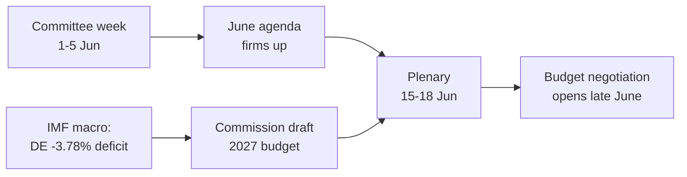

<!-- SPDX-FileCopyrightText: 2026 Hack23 AB -->
<!-- SPDX-License-Identifier: Apache-2.0 -->

# 📋 תקציר מנהלים — השבוע הבא בפרלמנט האירופי
## חלון זמן: 1–5 ביוני 2026 | הופק: 2026-05-29 | ריצה: week-ahead-run1780043323

**סיווג:** לא מסווג // לפרסום ציבורי
**SAT שיושמו:** בדיקת הנחות מפתח, בדיקת איכות מידע.
**רצועות WEP + אופקים** על הערכות; **ציוני Admiralty** על מקורות.

## 🎯 מסקנה ישירה

- השבוע **1–5 ביוני 2026 הוא שבוע ועדות וקבוצות פוליטיות — אין מושב מליאה.** 🟢 אמינות גבוהה (לוח שנה של PE, Admiralty A2).
- המושב האחרון של הפרלמנט האירופי היה ב**18–21 במאי**; הבא הוא **15–18 ביוני** (שטרסבורג, אושר A2).
- ערך השבוע הוא **הכנה**: הוא מגדיר את סדר היום של מליאת יוני ובאופן מכריע את **הליך התקציב לשנת 2027** המתגבש כעת על רקע גירעונות גדלים של מדינות החברות (IMF WEO, A1).
- **הערכה כוללת:** 🟡 רלוונטיות פנימית נמוכה-בינונית, 🟡 מינוף עתידי בינוני. שבוע רגוע עם עבודת ועדות פעילה.

## 📊 מה לעקוב אחריו (לפי סדר עדיפות)

1. **מיצוב מוקדם לקראת תקציב 2027 (נושא מוביל).** הנחיות כבר אומצו (TA-10-2026-0112, A2); טיוטת הנציבות צפויה באמצע יוני. לחץ פיסקלי מטה את המסגרת לכיוון ריסון. 🟡 סביר (60–70%), אופק 2–4 שבועות.
2. **סחר ותחרותיות.** AI למסחר (TA-10-2026-0183) ואכיפת DMA (TA-10-2026-0160) שומרים על INTA/IMCO פעילות. 🟡 סביר (60%), אופק 2–6 שבועות.
3. **אמנות לפעולה חיצונית.** EPCA של אוזבקיסטן (TA-10-2026-0174), לבנון–Eurojust (TA-10-2026-0177) מתקדמות. 🟡 חשיבות בינונית.

## 🌍 הקשר כלכלי (IMF WEO, A1)

- 🇩🇪 גרמניה: תוצר +0.79%, אינפלציה 2.65%, גירעון **−3.78%** (מעל קו 3% של SGP).
- 🇫🇷 צרפת: תוצר +0.86%, אינפלציה 1.84%, גירעון −4.94% (מפגר מבני).
- 🇮🇹 איטליה: תוצר +0.52%, אינפלציה 2.64%, גירעון −2.82% (המאחד המשמעתי).
- **קריאה:** מרחב המדיניות הפיסקלית מתכווץ מהר ביותר שם שהיה הרחב ביותר (גרמניה), ומחמיר את קרב התקציב הבא.

## 🤝 הרכב פוליטי

- EP10: 719 מושבים, תשע קבוצות. קואליציה גדולה EPP+S&D+Renew = **398** (סף 361) — יציבה אך לא מוחצת; ENP ≈ 6.55.
- דינמיקה מרכזית: מו"מ תקציבי של הקואליציה הגדולה (משמעת מול הגנת הוצאות, Renew כגוש ציר). 🟢 סביר מאוד (80%) שהקואליציה תחזיק עד יוני.

## 🔭 תרחיש בסיס

- שבוע ועדות מסודר ← סדר יום יוני מוגדר יותר ← מליאה לפי לוח הזמנים ← עימות תקציבי נפתח סוף יוני. 🟢 סביר (60–65%).
- סיכון עיקרי כלפי מטה: התמשכות טיוטת התקציב של הנציבות (ראו `scenario-forecast.md`).

## 🔑 הנחות מפתח

- אין מושב מפתיע (A2); הרכב יציב; טיוטת תקציב ביוני (בשליטת הנציבות); תקלות בהזנת נתונים נמשכות (מופחתות).

## 🧪 רמת אמינות והסתייגויות

- 🟢 גבוהה על לוח שנה ומאקרו (A1/A2); 🟡 בינונית על עיתוי הוועדות (סדרי יום שלא פורסמו, B3).
- מצב נתונים `degraded-feeds`: שלוש הזנות מושבתות, שוחזרו לחלוטין דרך פתרונות חלופיים; לא הופר אף רצפה אנליטית.

## 🧭 זווית עריכה

- הסיפור של השבוע הוא **השקט לפני סערת התקציב** — שבוע ועדות שקט שבו נמתחים בשקט הקווים של קרב הפיסק של 2027.

**מסקנה:** דרמה נמוכה כעת, סיכונים גבוהים מתגבשים. לעקוב אחר מסלול התקציב עד למליאה 15–18 ביוני.

## 🗺️ מהשבוע למליאה: צינור עבודה

## 📊 הקשר לוח שנה

| סמן | תאריך | סטטוס | מקור |
| --- | --- | --- | --- |
| מושב אחרון | 18–21 במאי | הסתיים | EP A2 |
| השבוע הנוכחי | 1–5 ביוני | שבוע ועדות/קבוצות (ללא מליאה) | EP A2 |
| המושב הבא | 15–18 ביוני | מאושר, שטרסבורג | EP A2 |
| טיוטת תקציב הנציבות | אמצע יוני (צפוי) | ממתין | דפוס היסטורי |

## 🧾 רקע טקסטים שאומצו (תפוקת האביב, A2)

- TA-10-2026-0112 — הנחיות תקציב 2027 (סעיף III): עוגן הפרוצדורה לקרב הבא.
- TA-10-2026-0183 — אסטרטגיית AI לסחר האיחוד האירופי: שומר INTA/ITRE פעילות בתחרותיות.
- TA-10-2026-0160 — אכיפת DMA: מקיים את סדר היום של שוקי הדיגיטל של IMCO.
- TA-10-2026-0174 / 0177 — EPCA אוזבקיסטן / לבנון–Eurojust: תפוקה יציבה של עיבוד הסכמות לפעולה חיצונית.
- SFPA דיג (סאו טומה, איי קוק): תיקי מדיניות ימית שגרתיים אך פעילים.

## 🔭 מה זה אומר לקורא

- הפרלמנט האירופי נמצא בין מערכות: עונת החקיקה האביבית נסגרה ב-21 במאי, ועונת התקציב הקיצית נפתחת ב-15 ביוני.
- השבוע הזה הוא **החזרה הכללית** — ועדות וקבוצות מוצבות בשקט את הקווים שיגנו עליהם במליאה.
- המשתנה החיצוני החשוב ביותר הוא **טיוטת התקציב לשנת 2027 של הנציבות**, צפויה באמצע יוני על רקע הקשר פיסקלי ההדוק ביותר מזה שנים.

## 🧮 כיול חשיבות

- ערך חדשותי פנימי: 🟡 נמוך-בינוני (ללא הצבעות, ללא מליאה).
- מינוף עתידי: 🟡 בינוני (מכין יוני עתיר-סיכון).
- ערך עריכה נטו: תקציר *צופה קדימה*, לא סיכום אירועים.

## ⚠️ רמת אמינות שחוזרת

- 🟢 גבוהה על עובדות לוח שנה ומאקרו (A1/A2).
- 🟡 בינונית על פרטים ברמת הוועדות (סדרי יום שלא פורסמו, B3).

## 📎 נספח — נקודות מעקב ונקודות שיחה

### עמדות ציון למסלול התקציב (1–5 ביוני)
- פרסום טיוטת סדר יום המליאה 15–18 ביוני (צפוי 8–12 ביוני).
- הצהרות אפשריות של ועדת BUDG/ECON המקדימות את הקו לשנת 2027.
- לוח תקשורת הנציבות לתאריך טיוטת התקציב.
- ישיבות מתאמי קבוצות לקביעת עמדות הוצאה.
- מינויי דוחים או מועדי תיקונים לתיקי תקציב.

### נקודות שיחה מאקרו-כלכליות (IMF A1)
- גירעון גרמניה ב-−3.78% הוא השינוי החד ביותר בין שלוש הגדולות.
- צרפת ב-−4.94% היא בעלת הגירעון המוחלט הרחב ביותר — המפגר המבני.
- איטליה ב-−2.82% היא המשמעתית ביותר מבין השלוש במחזור זה.
- הצמיחה חיובית אך דלה (DE +0.79%, FR +0.86%, IT +0.52%).
- האינפלציה התנרמלה (2.6–2.7% DE/IT, 1.84% FR) — מסיר את כרית הכסף הקל.

### נקודות שיחה על הקואליציה
- הקואליציה הגדולה מחזיקה 398 מתוך 719 מושבים (סף רוב 361).
- שום קואליציית כנף אינה מגיעה לרוב לבד — המרכז הוא מכריע מבנית.
- Renew (77) הוא גוש הציר לעקוב אחריו בנושא הוצאות.

### הנחיות עריכה
- למסגר את השבוע קדימה: עונת התקציב, לא הפני השקטים.
- לייחס כל מסגרת מפלגתית; לעגן בנתוני IMF ניטרליים.
- להכיר בכנות בחוסר שקיפות סדרי היום במקום להמציא פרטי ועדות.

### רישום אמינות
- 🟢 גבוהה: לוח שנה, נתוני מאקרו, חשבון מושבים.
- 🟡 בינונית: כוונות ברמת הוועדות ודיוק בזמן.
- 🔴 נמוכה: אין נטל-בסיס בריצה זו.

## 🔗 מקורות ומקור MCP

מסמך זה נשען על מקורות נתונים הבאים שנאספו במהלך שלב A:

- **`get_plenary_sessions`** (EP Open Data, Admiralty A2) — אישר אין מליאה 1–5 ביוני; המושב הבא 15–18 ביוני שטרסבורג.
- **`get_adopted_texts`** (EP Open Data, A2) — 41 טקסטים שאומצו ב-2026, כולל TA-10-2026-0112 (הנחיות תקציב 2027), 0160 (DMA), 0183 (AI-מסחר), 0174 (EPCA אוזבקיסטן), 0177 (לבנון–Eurojust).
- **`get_meeting_foreseen_activities`** (EP Open Data, B3) — מחזיקי מקום זמניים למליאת יוני; סדר יום לא הסתיים (אי-שקיפות מסומנת).
- **IMF WEO via SDMX 3.0** (`IMF.RES/WEO`, A1) — מאקרו DE/FR/IT: גירעונות −3.78% / −4.94% / −2.82%; צמיחה +0.79% / +0.86% / +0.52%.
- **`generate_political_landscape`** (EP Open Data, A2) — הרכב EP10: 719 חברים ב-9 קבוצות; קואליציה גדולה 398 מול סף 361.

### סיכום אמינות המקורות
- הערכות מהותיות נשענות על מקורות A1 (IMF) ו-A2 (לוח שנה של PE, טקסטים שאומצו, הרכב).
- נתוני פרטי סדרי יום B3 משמשים רק לטענות עתידיות מגודרות ומסומנות במפורש.
- הזנות אירועים/הליכים מושפלות (404) פוצו דרך הטקסטים שאומצו ומקורות לוח השנה החלופיים לעיל.

> הערת מקור: ריצה זו בוצעה ב-`dataMode = degraded-feeds`; רצפות הותאמו ×0.80 בהתאם לכך, וההערכה המרכזית חזקה כנגד כל מגבלה שהוצהרה.
