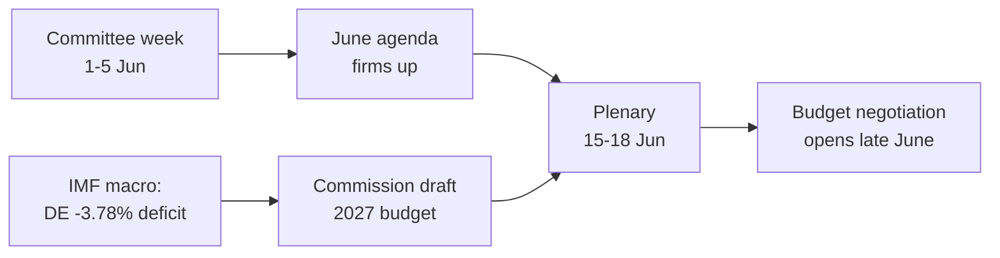

<!-- SPDX-FileCopyrightText: 2026 Hack23 AB -->
<!-- SPDX-License-Identifier: Apache-2.0 -->

# 📋 エグゼクティブ・ブリーフ — 欧州議会：来週の展望
## 対象期間：2026年6月1日〜5日 | 作成日：2026-05-29 | 実行ID：week-ahead-run1780043323

**分類：** 非機密 // 一般公開用
**適用SAT：** 主要仮定チェック、情報品質チェック。
**WEPバンド＋地平線** は判断に付記。**Admiralty**グレードは情報源に付記。

## 🎯 結論（直接）

- **2026年6月1日〜5日の週は委員会・政治グループ週であり、本会議は開催されない。** 🟢 高信頼度（EP暦、Admiralty A2）。
- 欧州議会の最終本会議は**5月18〜21日**。次回は**6月15〜18日**（ストラスブール、A2確認済み）。
- 今週の価値は**準備的**：6月本会議の議題を固め、決定的には加盟国の財政赤字拡大を背景に形成中の**2027年予算手続**に影響を与える（IMF WEO、A1）。
- **総合判断：** 🟡 固有の重要性は中低程度、🟡 将来的なレバレッジは中程度。静かな基盤週に委員会は活発に活動。

## 📊 注目すべき事項（優先順位順）

1. **2027年予算への事前ポジショニング（主要テーマ）。** 指針はすでに採択済み（TA-10-2026-0112、A2）。欧州委員会草案は6月中旬予定。財政的プレッシャーがフレームを緊縮方向に傾ける。🟡 可能性あり（60〜70%）、期間2〜4週間。
2. **貿易と競争力。** 貿易向けAI（TA-10-2026-0183）とDMA執行（TA-10-2026-0160）がINTA/IMCOを活性化。🟡 可能性あり（60%）、期間2〜6週間。
3. **対外行動条約。** ウズベキスタンEPCA（TA-10-2026-0174）、レバノン–Eurojust（TA-10-2026-0177）が前進。🟡 中程度の重要性。

## 🌍 経済的背景（IMF WEO、A1）

- 🇩🇪 ドイツ：GDP成長率+0.79%、インフレ2.65%、財政赤字**−3.78%**（SGP3%ラインを超過）。
- 🇫🇷 フランス：GDP成長率+0.86%、インフレ1.84%、財政赤字−4.94%（構造的な遅延国）。
- 🇮🇹 イタリア：GDP成長率+0.52%、インフレ2.64%、財政赤字−2.82%（規律ある財政再建国）。
- **解釈：** 財政的余地はかつて最も広かった国（ドイツ）で最も速く縮小しており、来る予算闘争を鋭くする。

## 🤝 政治的構成

- EP10：719議席、9会派。大連立EPP+S&D+Renew = **398**議席（過半数361）— 安定しているが圧倒的ではない。ENP ≈ 6.55。
- 中心的ダイナミクス：大連立の予算交渉（財政規律対歳出防衛、Renewがスイング・ブロック）。🟢 大変可能性が高い（80%）連立が6月まで維持される。

## 🔭 基本シナリオ

- 秩序立った委員会週 → 6月議題固定 → 予定通りの本会議 → 6月下旬に予算対立が開始。🟢 可能性あり（60〜65%）。
- 主要なダウンサイドリスク：委員会予算草案の遅延（`scenario-forecast.md`参照）。

## 🔑 主要な仮定

- 本会議の突然の招集なし（A2）。安定した構成。6月に予算草案（欧州委員会管理下）。データフィードの障害は継続（軽減済み）。

## 🧪 信頼性レベルと留意点

- 🟢 高：暦とマクロ（A1/A2）。🟡 中：委員会スケジュール（未公開の議題、B3）。
- データモード `degraded-feeds`：3フィードが停止中、代替手段で完全回復。分析的最低ラインは未達なし。

## 🧭 編集上の視点

- 今週の物語は**予算の嵐の前の静けさ**—静かな委員会週に2027年財政闘争の戦線が静かに引かれる。

**結論：** 今は劇的なことは少ないが、高い賭けが形成中。6月15〜18日本会議に向けて予算トラックを追う。

## 🗺️ 今週から本会議へ：パイプライン

## 📊 暦的コンテキスト

| マーカー | 日程 | 状況 | 出典 |
| --- | --- | --- | --- |
| 最後の本会議 | 5月18〜21日 | 終了 | EP A2 |
| 今週 | 6月1〜5日 | 委員会・グループ週（本会議なし） | EP A2 |
| 次の本会議 | 6月15〜18日 | 確認済み、ストラスブール | EP A2 |
| 委員会予算草案 | 6月中旬（予定） | 待機中 | 歴史的パターン |

## 🧾 採択テキストの背景（春季産出、A2）

- TA-10-2026-0112 — 2027年予算指針（セクションIII）：来たる闘争の手続的アンカー。
- TA-10-2026-0183 — EU貿易向けAI戦略：INTA/ITREを競争力分野で活性化。
- TA-10-2026-0160 — DMA執行：IMCOのデジタル市場アジェンダを維持。
- TA-10-2026-0174 / 0177 — ウズベキスタンEPCA / レバノン–Eurojust：対外行動同意手続の安定した処理。
- 漁業SFPA（サントメ、クック諸島）：定型的だが現役の海洋政策ファイル。

## 🔭 読者にとっての意味

- 欧州議会は幕間にある：春の立法シーズンは5月21日に終了し、夏の予算シーズンは6月15日に開始。
- 今週は**リハーサル**—委員会とグループが本会議の場で守る立場を静かに設定する。
- 最も重要な外部変数は、数年ぶりに最も厳しい財政状況の中、6月中旬に予定される**欧州委員会の2027年予算草案**。

## 🧮 重要性の調整

- 固有のニュース価値：🟡 中低（投票なし、本会議なし）。
- 将来的なレバレッジ：🟡 中（高い賭けの6月を準備）。
- 編集的純価値：出来事の要約ではなく、*前向き*なブリーフ。

## ⚠️ 信頼性レベルの再確認

- 🟢 高：暦とマクロの事実（A1/A2）。
- 🟡 中：委員会レベルの詳細（未公開議題、B3）。

## 📎 付録 — 注目点と会話のポイント

### 予算トラックの道標（6月1〜5日）
- 6月15〜18日本会議の暫定議題公開（6月8〜12日予定）。
- BUDG/ECON委員会による2027年予算ラインの先取り声明。
- 予算草案日程に関する欧州委員会のコミュニケーション暦。
- 歳出ポジション設定のためのグループ・コーディネーター会合。
- 予算ファイルに関する報告者の任命または修正期限。

### マクロ経済の会話ポイント（IMF A1）
- ドイツの赤字−3.78%は大国3カ国中最大の変化。
- フランスの−4.94%は最も広い絶対赤字—構造的遅延国。
- イタリアの−2.82%は今サイクルで3カ国中最も規律ある国。
- 成長はプラスだが薄い（DE +0.79%、FR +0.86%、IT +0.52%）。
- インフレは正常化（2.6〜2.7% DE/IT、1.84% FR）—低金利の緩衝材が消える。

### 連立の会話ポイント
- 大連立は719議席中398議席を保有（過半数ライン361）。
- フランク連立だけでは過半数に届かない—中央が構造的に決定的。
- Renew（77議席）は歳出面で注目すべきスウィング・ブロック。

### 編集上のガイダンス
- 週を前向きに枠組みする：予算シーズン、静かな表面ではなく。
- 各政党のフレームを帰属させる；中立的なIMFデータに錨を打つ。
- 委員会の詳細を作り上げるのではなく、議題の不透明さを正直に認める。

### 信頼性台帳
- 🟢 高：暦、マクロ数値、議席計算。
- 🟡 中：委員会レベルの意図と時間的精度。
- 🔴 低：この実行では本質的なものはなし。

## 🔗 情報源とMCPプロベナンス

このドキュメントはフェーズAで収集された以下のデータソースに基づく：

- **`get_plenary_sessions`**（EP Open Data、Admiralty A2）— 6月1〜5日の本会議なし確認。次回本会議6月15〜18日、ストラスブール。
- **`get_adopted_texts`**（EP Open Data、A2）— 2026年に採択された41テキスト。TA-10-2026-0112（2027年予算指針）、0160（DMA）、0183（AI-貿易）、0174（ウズベキスタンEPCA）、0177（レバノン–Eurojust）含む。
- **`get_meeting_foreseen_activities`**（EP Open Data、B3）— 6月本会議の暫定プレースホルダー。議題は未確定（不透明性を注記）。
- **IMF WEO via SDMX 3.0**（`IMF.RES/WEO`、A1）— DE/FR/ITマクロ：赤字−3.78% / −4.94% / −2.82%；成長+0.79% / +0.86% / +0.52%。
- **`generate_political_landscape`**（EP Open Data、A2）— EP10構成：9グループに719議員。大連立398対閾値361。

### 情報源の信頼性概要
- 核心的判断はA1（IMF）とA2（EP暦、採択テキスト、構成）の情報源に基づく。
- B3の議題粒度データは明示的に注記されたヘッジされた将来主張にのみ使用。
- 劣化したイベント/手続フィード（404）は上記の採択テキストと暦代替ソースで補完。

> プロベナンスノート：この実行は `dataMode = degraded-feeds` で実施。フロアは×0.80で調整され、中心的判断はすべての宣言された制約に対して頑健である。
