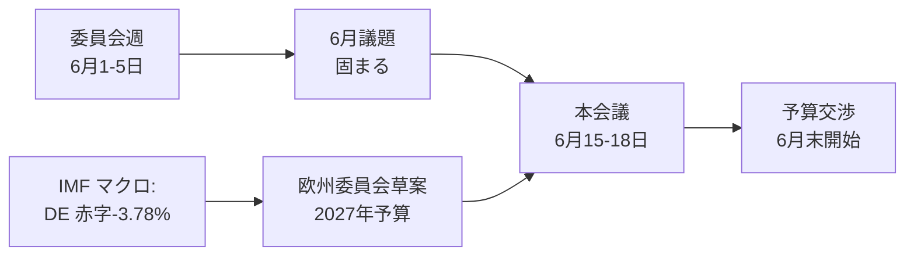

<!-- SPDX-FileCopyrightText: 2026 Hack23 AB -->
<!-- SPDX-License-Identifier: Apache-2.0 -->

# 📋 エグゼクティブ・ブリーフィング — 欧州議会の来週の動向
## 対象期間：2026年6月1日〜5日 | 作成日：2026-05-29 | 実行ID：week-ahead-run1780043323

**分類：** 非機密 // 公開資料
**適用SAT：** 主要仮定の確認、情報品質の確認。
**WEPバンド＋時間軸** は判断に適用；**Admiralty** グレードは情報源に適用。

## 🎯 Bottom Line Up Front

- **2026年6月1日〜5日の週は委員会・政治グループ週であり、本会議は開催されません。** 🟢 高信頼度（EP暦、Admiralty A2）。
- 欧州議会の直近の本会議は**5月18日〜21日**であり、次回は**6月15日〜18日**（ストラスブール、A2確認済み）。
- この週の意義は**準備的**なものです。6月本会議の土台を固めるとともに、加盟国の財政赤字拡大を背景に形成されつつある**2027年予算手続き**の方向性を決定づけます（IMF WEO、A1）。
- **総合評価：** 🟡 固有の重要性は中程度〜低い、🟡 先行き的なレバレッジは中程度。委員会が活発に動く静かな週。

## 📊 What to Watch (ranked)

1. **2027年予算の事前ポジショニング（主要トラック）。** 指針はすでに採択済み（TA-10-2026-0112、A2）；欧州委員会草案は6月中旬に予定。財政引き締め基調が抑制方向に傾いています。🟡 可能性高い（60〜70%）、期間2〜4週間。
2. **貿易・競争力のフォローアップ。** AI貿易戦略（TA-0183）とDMA執行（TA-0160）がINTA/IMCOを活発に維持。🟡 可能性高い（60%）、期間2〜6週間。
3. **対外関係条約。** ウズベキスタンEPCA（TA-0174）、レバノン・Eurojust（TA-0177）が進展。🟡 中程度の重要性。

## 🌍 Economic Backdrop (IMF WEO, A1)

- 🇩🇪 ドイツ：GDP +0.79%、インフレ率2.65%、財政赤字**−3.78%**（SGP上限3%を超過）。
- 🇫🇷 フランス：GDP +0.86%、インフレ率1.84%、財政赤字−4.94%（構造的な遅れ）。
- 🇮🇹 イタリア：GDP +0.52%、インフレ率2.64%、財政赤字−2.82%（規律ある財政統合の実践者）。
- **読み取り：** 財政余地は最も大きかったところ（ドイツ）で最も急速に縮小しており、来たる予算闘争を先鋭化させています。

## 🤝 Political Configuration

- EP10：719議席、9つのグループ。大連立EPP+S&D+Renew = **398**（過半数閾値361）—安定しているが圧倒的ではない；ENP ≈ 6.55。
- 中心的な力学：大連立の予算交渉（財政規律 vs 防衛支出、Renewが鍵を握るキャスティングボート）。🟢 非常に可能性が高い（80%）、連立は6月を通じて維持。

## 🔭 Base-Case Outlook

- 秩序ある委員会週 → 6月議題が固まる → 予定通りの本会議 → 6月末に予算対立が始まる。🟢 可能性高い（60〜65%）。
- 主要な下方リスク：欧州委員会の予算草案の遅延（`scenario-forecast.md` を参照）。

## 🔑 Key Assumptions

- 予期しない本会議なし（A2）；安定した議席構成；6月の予算草案（欧州委員会管理下）；データフィードの障害が継続（緩和済み）。

## 🧪 Confidence & Caveats

- 🟢 高い：暦とマクロ（A1/A2）；🟡 中程度：委員会スケジュール（未公開議題、B3）。
- データモード `劣化フィード`：3つのフィードが停止、代替手段で完全回復；分析上の最低基準はすべて満たされています。

## 🧭 Editorial Hook

- この週のテーマは**予算の嵐の前の静けさ**——2027年の財政闘争の輪郭が静かに描かれる、穏やかな委員会週。

**結論：** 今は劇的な展開は少ないが、高リスクが積み上がっています。6月15日〜18日の本会議に向けて予算トラックを注視してください。

## 🗺️ Week-to-Plenary Pipeline

## 📊 Calendar Context

| マーカー | 日付 | 状況 | 情報源 |
| --- | --- | --- | --- |
| 直近本会議 | 5月18〜21日 | 終了 | EP A2 |
| 今週 | 6月1〜5日 | 委員会・グループ週（本会議なし） | EP A2 |
| 次回本会議 | 6月15〜18日 | 確認済み、ストラスブール | EP A2 |
| 欧州委員会予算草案 | 6月中旬（予定） | 待機中 | 過去のパターン |

## 🧾 Adopted-Text Backdrop (spring output, A2)

- TA-10-2026-0112 — 2027年予算ガイドライン（セクションIII）：来たる闘争の手続き上の基点。
- TA-10-2026-0183 — EU貿易のためのAI戦略：競争力に関してINTA/ITREを活発に維持。
- TA-10-2026-0160 — DMA執行：IMCOのデジタル市場議題を支持。
- TA-10-2026-0174 / 0177 — ウズベキスタンEPCA / レバノン・Eurojust：安定した対外行動の同意達成。
- 漁業SFPA（サントメ、クック諸島）：定常的だが現役の海洋政策案件。

## 🔭 What This Means for the Reader

- 議会は二つの幕の間にあります。春の立法シーズンは5月21日に終了し、夏の予算シーズンは6月15日に始まります。
- この週は**リハーサル**——委員会とグループが本会議で守るべき立場を静かに設定しています。
- 最も重要な外部変数は**欧州委員会の2027年予算草案**であり、数年間で最も厳しい財政状況を背景に6月中旬に予定されています。

## 🧮 Significance Calibration

- 固有のニュース価値：🟡 中程度〜低い（投票なし、本会議なし）。
- 将来的なレバレッジ：🟡 中程度（重要な6月の準備）。
- 純編集的価値：*将来志向*のブリーフィング、過去のイベント報告ではない。

## ⚠️ Confidence Restated

- 🟢 高い：暦とマクロの事実（A1/A2）。
- 🟡 中程度：委員会レベルの詳細（未公開議題、B3）。

## 📎 Annex — Watch Items & Talking Points

### 予算トラックのシグナルポイント（6月1〜5日）
- 6月15〜18日本会議の暫定議題草案の公開（6月8〜12日予定）。
- BUDG/ECON委員会の2027年予算ライン先行発表の可能性。
- 予算草案日程に関する欧州委員会のコミュニケーション暦。
- 予算ポジションを設定するためのグループ調整会議。
- 予算案件の報告担当者の任命や修正期限。

### マクロ経済の議論ポイント（IMF A1）
- ドイツの−3.78%の赤字は3大国の中で最も急激な変化。
- フランスの−4.94%は最大の絶対赤字——構造的な遅れ。
- イタリアの−2.82%はこのサイクルで3カ国の中で最も規律正しい。
- 成長は正だが薄い（DE +0.79%、FR +0.86%、IT +0.52%）。
- インフレは正常化（2.6〜2.7% DE/IT、1.84% FR）——緩和的金融政策のクッションは消えた。

### 連立の議論ポイント
- 大連立は719議席中398議席を保有（過半数閾値361）。
- どの翼連立も単独では過半数に届かない——中道が構造的に決定的。
- Renew（77）は支出問題で注目すべきキャスティングボート。

### 編集ガイダンス
- この週を前向きにフレーミング：予算シーズン、表面上の静けさではなく。
- あらゆる党派的フレーミングに出典を示す；中立的なIMFデータに基づく。
- 委員会の詳細を作り上げるのではなく、議題の不透明性を正直に指摘する。

### 信頼性台帳
- 🟢 高い：暦、マクロ数値、議席数。
- 🟡 中程度：委員会レベルの意図と時間的精度。
- 🔴 低い：この実行では重要なものはなし。

## 🔗 Sources & MCP Provenance

このアーティファクトはステージAで収集された以下のデータソースに基づいています。

- **`get_plenary_sessions`**（EP公開データ、Admiralty A2）——6月1〜5日に本会議なしを確認；次回本会議6月15〜18日ストラスブール。
- **`get_adopted_texts`**（EP公開データ、A2）——2026年の41採択テキスト、TA-10-2026-0112（2027年予算ガイドライン）、0160（DMA）、0183（AI貿易）、0174（ウズベキスタンEPCA）、0177（レバノン・Eurojust）を含む。
- **`get_meeting_foreseen_activities`**（EP公開データ、B3）——6月本会議の暫定プレースホルダー；議題未確定（不透明性フラグ）。
- **IMF WEO via SDMX 3.0**（`IMF.RES/WEO`、A1）——DE/FR/ITマクロ：赤字 −3.78% / −4.94% / −2.82%；成長 +0.79% / +0.86% / +0.52%。
- **`generate_political_landscape`**（EP公開データ、A2）——EP10構成：9グループに719名；大連立398対閾値361。

### 情報源信頼性サマリー
- 重要判断はA1（IMF）とA2（EP暦、採択テキスト、構成）に基づいています。
- B3の議題詳細データは、明示的にフラグ付けされた将来予測の主張にのみ使用されます。
- 劣化したイベント/手続きフィード（404）は上記の採択テキストと暦の代替で補完されました。

> 出典注記：この実行は `dataMode = degraded-feeds` モードで行われました；フロアは×0.80で調整され、中心的な判断はすべての宣言済み制限に対して堅牢です。
