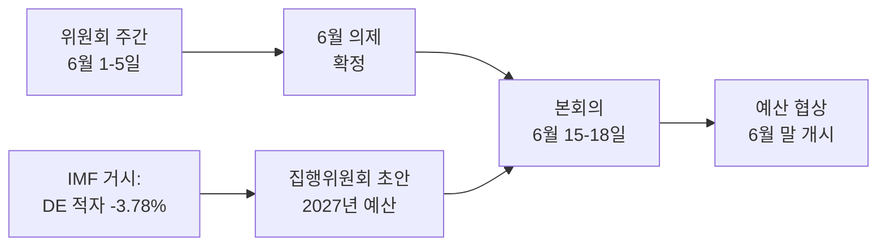

<!-- SPDX-FileCopyrightText: 2026 Hack23 AB -->
<!-- SPDX-License-Identifier: Apache-2.0 -->

# 📋 집행부 브리핑 — 유럽의회 다음 주 동향
## 기간: 2026년 6월 1일~5일 | 작성일: 2026-05-29 | 실행ID: week-ahead-run1780043323

**분류:** 비기밀 // 공개 배포
**적용 SAT:** 핵심 가정 검증, 정보 품질 검증.
**WEP 등급 + 시간적 범위** 판단 사항에 적용; **Admiralty** 등급 정보 출처에 적용.

## 🎯 Bottom Line Up Front

- **2026년 6월 1일~5일 주는 위원회 및 정치 그룹 주간으로, 본회의는 열리지 않습니다.** 🟢 높은 신뢰도 (EP 달력, Admiralty A2).
- 유럽의회 최근 본회의는 **5월 18~21일**이었으며, 다음 본회의는 **6월 15~18일** (스트라스부르, A2 확인)입니다.
- 이번 주의 가치는 **준비적**입니다: 6월 본회의 기반을 다지고, 결정적으로 회원국들의 확대되는 재정 적자를 배경으로 형성되고 있는 **2027년 예산 절차**의 방향을 설정합니다 (IMF WEO, A1).
- **전반적 평가:** 🟡 내재적 중요성 중간-낮음, 🟡 전망적 레버리지 중간. 위원회가 활발히 움직이는 조용한 기반 주간.

## 📊 What to Watch (ranked)

1. **2027년 예산 사전 포지셔닝 (주요 트랙).** 지침은 이미 채택됨 (TA-10-2026-0112, A2); 집행위원회 초안은 6월 중순 예정. 재정 압박이 긴축 방향으로 기울고 있습니다. 🟡 가능성 높음 (60~70%), 기간 2~4주.
2. **무역 및 경쟁력 후속 조치.** AI 무역 전략 (TA-0183)과 DMA 집행 (TA-0160)이 INTA/IMCO를 활발히 유지. 🟡 가능성 높음 (60%), 기간 2~6주.
3. **외교 조약.** 우즈베키스탄 EPCA (TA-0174), 레바논-Eurojust (TA-0177) 진전. 🟡 중간 중요성.

## 🌍 Economic Backdrop (IMF WEO, A1)

- 🇩🇪 독일: GDP +0.79%, 인플레이션 2.65%, 재정 적자 **−3.78%** (SGP 3% 상한 초과).
- 🇫🇷 프랑스: GDP +0.86%, 인플레이션 1.84%, 재정 적자 −4.94% (구조적 지체국).
- 🇮🇹 이탈리아: GDP +0.52%, 인플레이션 2.64%, 재정 적자 −2.82% (규율 있는 재정 통합국).
- **해석:** 재정 여력은 가장 컸던 곳(독일)에서 가장 빠르게 축소되고 있어, 다가오는 예산 다툼을 심화시킵니다.

## 🤝 Political Configuration

- EP10: 719석, 9개 그룹. 대연립 EPP+S&D+Renew = **398** (과반수 기준 361) — 안정적이나 압도적이지는 않음; ENP ≈ 6.55.
- 핵심 역학: 대연립의 예산 협상 (규율 vs 방위비 지출, Renew가 캐스팅보트). 🟢 매우 가능성 높음 (80%), 연립은 6월 내내 유지.

## 🔭 Base-Case Outlook

- 질서 있는 위원회 주 → 더 견고한 6월 의제 → 예정된 본회의 → 6월 말 예산 대결 개시. 🟢 가능성 높음 (60~65%).
- 주요 하방 리스크: 집행위원회 예산 초안 지연 (참조: `scenario-forecast.md`).

## 🔑 Key Assumptions

- 예상치 못한 본회의 없음 (A2); 안정적인 의석 구성; 6월 예산 초안 (집행위원회 통제); 데이터 피드 중단 지속 (완화됨).

## 🧪 Confidence & Caveats

- 🟢 높음: 달력 및 거시경제 (A1/A2); 🟡 중간: 위원회 일정 (미공개 의제, B3).
- 데이터 모드 `저하된 피드`: 피드 3개 다운, 대체 출처로 완전 복구; 분석적 최소 기준 미충족 없음.

## 🧭 Editorial Hook

- 이번 주의 핵심 이야기는 **예산 폭풍 전의 고요**—2027년 재정 다툼의 윤곽이 조용히 그려지는 평온한 위원회 주간입니다.

**결론:** 지금은 드라마 없음, 고위험이 쌓이고 있습니다. 6월 15~18일 본회의를 향한 예산 트랙을 주시하십시오.

## 🗺️ Week-to-Plenary Pipeline

## 📊 Calendar Context

| 표지 | 날짜 | 상태 | 출처 |
| --- | --- | --- | --- |
| 최근 본회의 | 5월 18~21일 | 종료 | EP A2 |
| 이번 주 | 6월 1~5일 | 위원회/그룹 주간 (본회의 없음) | EP A2 |
| 다음 본회의 | 6월 15~18일 | 확인, 스트라스부르 | EP A2 |
| 집행위원회 예산 초안 | 6월 중순 (예정) | 대기 중 | 역사적 패턴 |

## 🧾 Adopted-Text Backdrop (spring output, A2)

- TA-10-2026-0112 — 2027년 예산 지침 (섹션 III): 다가오는 다툼의 절차적 기반.
- TA-10-2026-0183 — EU 무역을 위한 AI 전략: 경쟁력 분야에서 INTA/ITRE를 활성 유지.
- TA-10-2026-0160 — DMA 집행: IMCO의 디지털 시장 의제 유지.
- TA-10-2026-0174 / 0177 — 우즈베키스탄 EPCA / 레바논-Eurojust: 외교 행동의 안정적 동의 처리량.
- 어업 SFPA (상투메, 쿡 제도): 정례적이지만 현역 해양정책 파일.

## 🔭 What This Means for the Reader

- 의회는 두 막 사이에 있습니다: 봄 입법 시즌은 5월 21일에 마감됐고, 여름 예산 시즌은 6월 15일에 열립니다.
- 이번 주는 **리허설**—위원회와 그룹이 조용히 본회의에서 방어할 입장을 설정합니다.
- 가장 중요한 외부 변수는 수년 중 가장 긴축된 재정 상황을 배경으로 6월 중순에 예상되는 **집행위원회의 2027년 예산 초안**입니다.

## 🧮 Significance Calibration

- 내재적 뉴스 가치: 🟡 중간-낮음 (투표 없음, 본회의 없음).
- 전망적 레버리지: 🟡 중간 (중요한 6월 준비).
- 순 편집 가치: 사건 보고서가 아닌 *전망적* 브리핑.

## ⚠️ Confidence Restated

- 🟢 높음: 달력 및 거시경제 사실 (A1/A2).
- 🟡 중간: 위원회 수준 세부사항 (미공개 의제, B3).

## 📎 Annex — Watch Items & Talking Points

### 예산 트랙 신호 포인트 (6월 1~5일)
- 6월 15~18일 본회의 잠정 의제 초안 공개 (6월 8~12일 예상).
- BUDG/ECON 위원회의 2027년 예산 라인 선행 발표 가능성.
- 예산 초안 날짜에 대한 집행위원회 통신 달력.
- 지출 입장 확정을 위한 그룹 조정관 회의.
- 예산 파일의 보고위원 임명 또는 수정안 마감일.

### 거시경제 토의 요점 (IMF A1)
- 독일의 −3.78% 적자는 3대국 중 가장 급격한 변화.
- 프랑스의 −4.94%는 절대 적자 기준 가장 넓은—구조적 지체.
- 이탈리아의 −2.82%는 이 사이클에서 세 나라 중 가장 규율 있음.
- 성장은 양수지만 미약 (DE +0.79%, FR +0.86%, IT +0.52%).
- 인플레이션은 정상화 (2.6~2.7% DE/IT, 1.84% FR)—완화적 통화 정책의 쿠션이 사라짐.

### 연립 토의 요점
- 대연립은 719석 중 398석 보유 (과반수 기준 361).
- 어떤 측면 연립도 단독으로 과반수에 미치지 못함—중도가 구조적으로 결정적.
- Renew (77)는 지출 문제에서 주목해야 할 캐스팅보트 그룹.

### 편집 지침
- 이번 주를 전망적으로 프레이밍: 예산 시즌, 조용한 표면이 아닌.
- 모든 당파적 프레이밍에 귀속을 명시; 중립적 IMF 데이터에 기반.
- 위원회 세부사항을 만들어내기보다 의제 불투명성을 솔직하게 표시.

### 신뢰도 원장
- 🟢 높음: 달력, 거시 수치, 의석 산술.
- 🟡 중간: 위원회 수준 의도 및 시간적 정확도.
- 🔴 낮음: 이번 실행에서 부담이 되는 항목 없음.

## 🔗 Sources & MCP Provenance

이 아티팩트는 A단계에서 수집된 다음 데이터 소스를 기반으로 합니다.

- **`get_plenary_sessions`** (EP 공개 데이터, Admiralty A2) — 6월 1~5일 본회의 없음 확인; 다음 본회의 6월 15~18일 스트라스부르.
- **`get_adopted_texts`** (EP 공개 데이터, A2) — 2026년 채택 텍스트 41건, TA-10-2026-0112 (2027년 예산 지침), 0160 (DMA), 0183 (AI 무역), 0174 (우즈베키스탄 EPCA), 0177 (레바논-Eurojust) 포함.
- **`get_meeting_foreseen_activities`** (EP 공개 데이터, B3) — 6월 본회의의 임시 플레이스홀더; 의제 미확정 (불투명성 표시).
- **IMF WEO via SDMX 3.0** (`IMF.RES/WEO`, A1) — DE/FR/IT 거시: 적자 −3.78% / −4.94% / −2.82%; 성장 +0.79% / +0.86% / +0.52%.
- **`generate_political_landscape`** (EP 공개 데이터, A2) — EP10 구성: 9개 그룹에 719명; 대연립 398 대 기준 361.

### 출처 신뢰성 요약
- 핵심 판단은 A1 (IMF) 및 A2 (EP 달력, 채택 텍스트, 구성)에 기반합니다.
- 의제 세부사항에 대한 B3 데이터는 명시적으로 표시된 전망적 주장에만 사용됩니다.
- 저하된 이벤트/절차 피드 (404)는 위의 채택 텍스트 및 달력 대체 출처를 통해 보완됐습니다.

> 출처 참고: 이 실행은 `dataMode = degraded-feeds` 모드에서 수행됐습니다; 최저 기준이 ×0.80으로 조정됐으며, 핵심 판단은 모든 선언된 제한 사항에 대해 견고합니다.
