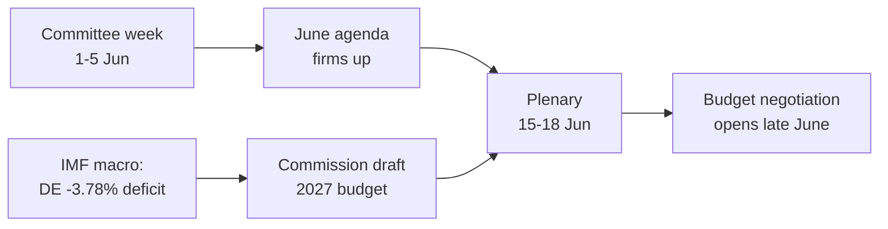

<!-- SPDX-FileCopyrightText: 2026 Hack23 AB -->
<!-- SPDX-License-Identifier: Apache-2.0 -->

# 📋 집행 브리핑 — 유럽의회 다음 주 전망
## 대상 기간: 2026년 6월 1일–5일 | 작성일: 2026-05-29 | 실행 ID: week-ahead-run1780043323

**분류:** 비기밀 // 공개 배포용
**적용된 SAT:** 핵심 가정 검토, 정보 품질 검토.
**WEP 밴드 + 지평선** 판단에 적용. **Admiralty** 등급은 출처에 적용.

## 🎯 핵심 결론

- **2026년 6월 1일–5일 주는 위원회 및 정치 그룹 주로, 본회의는 열리지 않습니다.** 🟢 높은 신뢰도 (EP 달력, Admiralty A2).
- 유럽의회의 마지막 본회의는 **5월 18–21일**이었으며, 다음 본회의는 **6월 15–18일** (스트라스부르, A2 확인).
- 이번 주의 가치는 **준비적**입니다. 6월 본회의 의제를 구체화하고, 결정적으로는 회원국들의 재정 적자 확대를 배경으로 형성 중인 **2027년 예산 절차**에 영향을 미칩니다 (IMF WEO, A1).
- **종합 평가:** 🟡 내재적 중요도 중간-낮음, 🟡 미래 레버리지 보통. 위원회가 활발히 활동하는 조용한 기반 주.

## 📊 주목해야 할 사항 (우선순위 순)

1. **2027년 예산 사전 포지셔닝 (주요 의제).** 지침은 이미 채택됨 (TA-10-2026-0112, A2). 유럽위원회 초안은 6월 중순 예정. 재정 압박이 프레임을 긴축 방향으로 유도. 🟡 가능성 있음 (60–70%), 기간 2–4주.
2. **무역 및 경쟁력.** 무역 AI (TA-10-2026-0183)와 DMA 집행 (TA-10-2026-0160)이 INTA/IMCO를 활성화. 🟡 가능성 있음 (60%), 기간 2–6주.
3. **대외 행동 조약.** 우즈베키스탄 EPCA (TA-10-2026-0174), 레바논–Eurojust (TA-10-2026-0177) 진전. 🟡 중간 중요도.

## 🌍 경제적 배경 (IMF WEO, A1)

- 🇩🇪 독일: GDP +0.79%, 인플레이션 2.65%, 재정 적자 **−3.78%** (안정성장협약 3% 기준선 초과).
- 🇫🇷 프랑스: GDP +0.86%, 인플레이션 1.84%, 재정 적자 −4.94% (구조적 후발국).
- 🇮🇹 이탈리아: GDP +0.52%, 인플레이션 2.64%, 재정 적자 −2.82% (규율 있는 재정 통합국).
- **해석:** 재정 여력이 가장 넓었던 곳(독일)에서 가장 빠르게 축소되고 있어 다가오는 예산 싸움을 날카롭게 만들고 있습니다.

## 🤝 정치적 구성

- EP10: 719석, 9개 원내 그룹. 대연정 EPP+S&D+Renew = **398**석 (과반 기준 361) — 안정적이지만 압도적이지는 않음. ENP ≈ 6.55.
- 핵심 역학: 대연정의 예산 협상 (재정 규율 대 지출 방어, Renew가 스윙 블록). 🟢 매우 가능성 높음 (80%) 연정이 6월까지 유지.

## 🔭 기본 시나리오

- 질서 있는 위원회 주 → 6월 의제 확정 → 예정된 본회의 → 6월 말 예산 대립 개시. 🟢 가능성 있음 (60–65%).
- 주요 하방 리스크: 유럽위원회 예산 초안 지연 (`scenario-forecast.md` 참조).

## 🔑 핵심 가정

- 예상치 못한 본회의 없음 (A2). 안정적 구성. 6월 예산 초안 (유럽위원회 통제). 데이터 피드 장애 지속 (완화됨).

## 🧪 신뢰도 수준 및 주의 사항

- 🟢 높음: 달력과 거시경제 (A1/A2). 🟡 중간: 위원회 일정 (미공개 의제, B3).
- 데이터 모드 `degraded-feeds`: 3개 피드 다운, 대체 수단으로 완전 복구. 분석적 최저선 미달 없음.

## 🧭 편집적 관점

- 이번 주의 이야기는 **예산 폭풍 전의 고요함**—조용한 위원회 주에 2027년 재정 전투의 선들이 조용히 그어지고 있습니다.

**결론:** 지금은 드라마가 적지만, 높은 위기가 형성 중. 6월 15–18일 본회의를 향해 예산 트랙을 추적하십시오.

## 🗺️ 이번 주에서 본회의까지: 파이프라인

## 📊 달력 맥락

| 마커 | 날짜 | 상태 | 출처 |
| --- | --- | --- | --- |
| 마지막 본회의 | 5월 18–21일 | 종료 | EP A2 |
| 이번 주 | 6월 1–5일 | 위원회/그룹 주 (본회의 없음) | EP A2 |
| 다음 본회의 | 6월 15–18일 | 확인됨, 스트라스부르 | EP A2 |
| 유럽위원회 예산 초안 | 6월 중순 (예정) | 대기 중 | 역사적 패턴 |

## 🧾 채택된 텍스트 배경 (봄 산출물, A2)

- TA-10-2026-0112 — 2027년 예산 지침 (섹션 III): 다가오는 싸움의 절차적 닻.
- TA-10-2026-0183 — EU 무역 AI 전략: INTA/ITRE를 경쟁력 분야에서 활성화.
- TA-10-2026-0160 — DMA 집행: IMCO의 디지털 시장 의제 유지.
- TA-10-2026-0174 / 0177 — 우즈베키스탄 EPCA / 레바논–Eurojust: 대외 행동 동의 절차의 안정적 처리.
- 어업 SFPA (상투메, 쿡 제도): 일상적이지만 현역 해양 정책 파일.

## 🔭 독자에게 의미하는 바

- 유럽의회는 막간에 있습니다. 봄 입법 시즌은 5월 21일 종료되었고, 여름 예산 시즌은 6월 15일 개막.
- 이번 주는 **리허설**—위원회와 그룹들이 본회의에서 지킬 노선을 조용히 설정.
- 가장 중요한 외부 변수는 수년만에 가장 타이트한 재정 상황 속에 6월 중순 예상되는 **유럽위원회의 2027년 예산 초안**.

## 🧮 중요도 교정

- 고유 뉴스 가치: 🟡 중간-낮음 (투표 없음, 본회의 없음).
- 미래 레버리지: 🟡 보통 (높은 위기의 6월 준비).
- 편집 순 가치: 사건 요약이 아닌 *전망적* 브리핑.

## ⚠️ 신뢰도 수준 재확인

- 🟢 높음: 달력 및 거시경제 사실 (A1/A2).
- 🟡 중간: 위원회 수준 세부 사항 (미공개 의제, B3).

## 📎 부록 — 모니터링 포인트 및 대화 포인트

### 예산 트랙 신호 (6월 1–5일)
- 6월 15–18일 본회의 임시 의제 공개 (6월 8–12일 예상).
- BUDG/ECON 위원회의 2027년 예산 라인 예고 발표.
- 예산 초안 날짜에 대한 유럽위원회 커뮤니케이션 일정.
- 지출 포지션 설정을 위한 그룹 코디네이터 회의.
- 예산 파일 보고관 임명 또는 수정안 마감.

### 거시경제 대화 포인트 (IMF A1)
- 독일의 적자 −3.78%는 3대 국가 중 가장 큰 변화.
- 프랑스 −4.94%는 가장 넓은 절대 적자 — 구조적 후발국.
- 이탈리아 −2.82%는 이번 사이클에서 3국 중 가장 규율 있음.
- 성장은 긍정적이지만 약함 (DE +0.79%, FR +0.86%, IT +0.52%).
- 인플레이션 정상화 (2.6–2.7% DE/IT, 1.84% FR) — 저금리 완충재 소멸.

### 연정 대화 포인트
- 대연정은 719석 중 398석 보유 (과반 기준 361).
- 어느 측면 연정도 단독으로 과반에 도달하지 못함 — 중도가 구조적으로 결정적.
- Renew (77석)는 지출 면에서 주시해야 할 스윙 블록.

### 편집 지침
- 주를 앞을 향해 프레임화: 예산 시즌, 조용한 표면이 아닌.
- 모든 당파적 프레임 귀속. 중립적 IMF 데이터에 고정.
- 위원회 세부 사항을 만들어내는 대신 의제 불투명성을 솔직하게 인정.

### 신뢰도 원장
- 🟢 높음: 달력, 거시경제 수치, 의석 계산.
- 🟡 중간: 위원회 수준 의도 및 시간 정확도.
- 🔴 낮음: 이번 실행에서 부하 없음.

## 🔗 출처 및 MCP 프로베넌스

이 문서는 A단계에서 수집된 다음 데이터 소스를 기반으로 합니다:

- **`get_plenary_sessions`** (EP Open Data, Admiralty A2) — 6월 1–5일 본회의 없음 확인. 다음 본회의 6월 15–18일 스트라스부르.
- **`get_adopted_texts`** (EP Open Data, A2) — 2026년 채택 텍스트 41건. TA-10-2026-0112 (2027년 예산 지침), 0160 (DMA), 0183 (AI-무역), 0174 (우즈베키스탄 EPCA), 0177 (레바논–Eurojust) 포함.
- **`get_meeting_foreseen_activities`** (EP Open Data, B3) — 6월 본회의 임시 플레이스홀더. 의제 미확정 (불투명성 표시).
- **IMF WEO via SDMX 3.0** (`IMF.RES/WEO`, A1) — DE/FR/IT 거시: 적자 −3.78% / −4.94% / −2.82%; 성장 +0.79% / +0.86% / +0.52%.
- **`generate_political_landscape`** (EP Open Data, A2) — EP10 구성: 9개 그룹에 719명. 대연정 398 대 기준선 361.

### 출처 신뢰성 요약
- 핵심 판단은 A1 (IMF)과 A2 (EP 달력, 채택 텍스트, 구성) 출처에 기반.
- B3 의제 세부 데이터는 명시적으로 표시된 헤지된 미래 주장에만 사용.
- 저하된 이벤트/절차 피드 (404)는 위의 채택 텍스트와 달력 대체 소스로 보완.

> 프로베넌스 노트: 이 실행은 `dataMode = degraded-feeds`에서 수행되었습니다. 최저선은 ×0.80 조정되었으며, 핵심 판단은 모든 선언된 제약에 대해 강건합니다.
