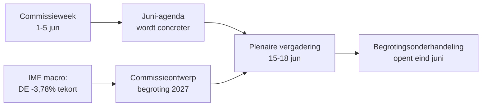

<!-- SPDX-FileCopyrightText: 2026 Hack23 AB -->
<!-- SPDX-License-Identifier: Apache-2.0 -->

# 📋 Bestuurssamenvatting — Komende week in het Europees Parlement
## Venster: 1–5 juni 2026 | Opgesteld: 2026-05-29 | Uitvoering: week-ahead-run1780043323

**Classificatie:** NIET-GERUBRICEERD // VOOR PUBLIEKE VERSPREIDING
**Toegepaste SAT:** Verificatie van sleutelveronderstellingen, Verificatie van informatieskwaliteit.
**WEP-banden + horizonten** op oordeelvorming; **Admiralty**-graden op bronnen.

## 🎯 Bottom Line Up Front

- De week van **1–5 juni 2026 is een commissie- en fractieweek — er wordt geen plenaire vergadering gehouden.** 🟢 HOOG vertrouwen (EP-kalender, Admiralty A2).
- De laatste plenaire vergadering van het Europees Parlement was van **18–21 mei**; de volgende is van **15–18 juni** (Straatsburg, bevestigd A2).
- De waarde van deze week is **voorbereidend**: zij legt de basis voor de plenaire vergadering in juni en, beslissend, voor de **begrotingsprocedure 2027** die nu vorm krijgt tegen een achtergrond van toenemende tekorten in de lidstaten (IMF WEO, A1).
- **Algeheel oordeel:** 🟡 MATIG-LAGE intrinsieke relevantie, 🟡 MATIGE vooruitblikkende hefboomwerking. Een rustige vloerweek met actieve commissies.

## 📊 What to Watch (ranked)

1. **Voorpositionering Begroting 2027 (hoofdspoor).** Richtsnoeren reeds aangenomen (TA-10-2026-0112, A2); ontwerp van de Commissie verwacht medio juni. Begrotingsdruk neigt naar terughoudendheid. 🟡 WAARSCHIJNLIJK (60–70 %), horizon 2–4 weken.
2. **Handel & concurrentievermogen: follow-up.** AI voor handel (TA-0183) en DMA-handhaving (TA-0160) houden INTA/IMCO actief. 🟡 WAARSCHIJNLIJK (60 %), horizon 2–6 weken.
3. **Buitenlands beleid – verdragen.** Oezbekistan EPCA (TA-0174), Libanon-Eurojust (TA-0177) vorderen. 🟡 GEMIDDELDE relevantie.

## 🌍 Economic Backdrop (IMF WEO, A1)

- 🇩🇪 Duitsland: bbp +0,79 %, inflatie 2,65 %, tekort **−3,78 %** (boven de SGP-grens van 3 %).
- 🇫🇷 Frankrijk: bbp +0,86 %, inflatie 1,84 %, tekort −4,94 % (structurele achterblijver).
- 🇮🇹 Italië: bbp +0,52 %, inflatie 2,64 %, tekort −2,82 % (de gedisciplineerde consolideerder).
- **Interpretatie:** de begrotingsruimte krimpt het snelst waar zij het grootst was (Duitsland), waardoor de komende begrotingsstrijd verscherpt.

## 🤝 Political Configuration

- EP10: 719 zetels, negen fracties. Grote coalitie EVP+S&D+Renew = **398** (drempel 361) — stabiel, maar niet overweldigend; ENP ≈ 6,55.
- Centrale dynamiek: begrotingsonderhandelingen van de grote coalitie (discipline vs. defensie-uitgaven, Renew als doorslaggevende factor). 🟢 ZEER WAARSCHIJNLIJK (80 %) dat de coalitie juni doorkomt.

## 🔭 Base-Case Outlook

- Ordentelijke commissieweek → vastere juniagendering → plenaire vergadering volgens schema → begrotingsconfrontatie opent eind juni. 🟢 WAARSCHIJNLIJK (60–65 %).
- Voornaamste neerwaarts risico: vertraging van het begrotingsontwerp van de Commissie (zie `scenario-forecast.md`).

## 🔑 Key Assumptions

- Geen verrassende plenaire vergadering (A2); stabiele samenstelling; begrotingsontwerp in juni (door Commissie gecontroleerd); verstoringen van gegevensfeeds duren aan (gemitigeerd).

## 🧪 Confidence & Caveats

- 🟢 HOOG voor kalender en macro (A1/A2); 🟡 GEMIDDELD voor commissie-tijdlijn (niet-gepubliceerde agenda's, B3).
- Datamodus `verslechterde feeds`: drie feeds neer, volledig hersteld via reservebronnen; geen analytisch minimum onbehaald.

## 🧭 Editorial Hook

- Het verhaal van de week is **de stilte voor de begrotingsstorm** — een rustige commissieweek waarin de lijnen van de fiscale strijd 2027 stil worden uitgetekend.

**Conclusie:** Weinig drama nu, hoge inzetten bouwen op. Het begrotingsspoor volgen richting de plenaire vergadering van 15–18 juni.

## 🗺️ Week-to-Plenary Pipeline

## 📊 Calendar Context

| Markering | Datum | Status | Bron |
| --- | --- | --- | --- |
| Laatste plenaire vergadering | 18–21 mei | Afgerond | EP A2 |
| Huidige week | 1–5 jun | Commissie-/fractieweek (geen plenaire vergadering) | EP A2 |
| Volgende plenaire vergadering | 15–18 jun | Bevestigd, Straatsburg | EP A2 |
| Begrotingsontwerp Commissie | medio juni (verwacht) | In afwachting | Historisch patroon |

## 🧾 Adopted-Text Backdrop (spring output, A2)

- TA-10-2026-0112 — Richtsnoeren Begroting 2027 (Sectie III): het procedurele ankerpunt voor de komende strijd.
- TA-10-2026-0183 — AI-strategie voor EU-handel: houdt INTA/ITRE actief op concurrentievermogen.
- TA-10-2026-0160 — DMA-handhaving: onderhoudt de digitale markt-agenda van IMCO.
- TA-10-2026-0174 / 0177 — Oezbekistan EPCA / Libanon-Eurojust: gestage doorvoer van externe actie via toestemming.
- Visserij SFPA's (São Tomé, Cookeilanden): routinematig maar actieve dossiers voor zeebeleid.

## 🔭 What This Means for the Reader

- Het Parlement bevindt zich tussen twee akten: het wetgevingsseizoen van het voorjaar sloot op 21 mei, het begrotingsseizoen van de zomer opent op 15 juni.
- Deze week is de **generale repetitie** — commissies en fracties leggen in stilte de posities vast die zij in de plenaire vergadering zullen verdedigen.
- De belangrijkste externe variabele is het **ontwerp-begroting 2027 van de Commissie**, verwacht medio juni tegen de strakste fiscale achtergrond in jaren.

## 🧮 Significance Calibration

- Intrinsieke nieuwswaarde: 🟡 MATIG-LAAG (geen stemmingen, geen plenaire vergadering).
- Vooruitblikkende hefboomwerking: 🟡 MATIG (bereidt een bewogen juni voor).
- Netto-redactionele waarde: een *vooruitblikkende* samenvatting, geen verslag van evenementen.

## ⚠️ Confidence Restated

- 🟢 HOOG voor kalender en macrofeiten (A1/A2).
- 🟡 GEMIDDELD voor commissiespecifieke details (niet-gepubliceerde agenda's, B3).

## 📎 Annex — Watch Items & Talking Points

### Signaalmarkering begrotingsspoor (1–5 juni)
- Publicatie van de voorlopige ontwerpagenda van de plenaire vergadering van 15–18 juni (verwacht 8–12 juni).
- Eventuele verklaring van BUDG/ECON-commissie over de begrotingslijn 2027.
- Communicatiekalender van de Commissie voor datum van het begrotingsontwerp.
- Coördinatorenvergaderingen van fracties voor vaststelling van uitvoeringsposities.
- Rapporteur-benoemingen of wijzigingstermijnen voor begrotingsdossiers.

### Macro-gespreksonderwerpen (IMF A1)
- Duitslands tekort van −3,78 % is de scherpste wending van de drie grote landen.
- Frankrijk met −4,94 % heeft het grootste absolute tekort — de structurele achterblijver.
- Italië met −2,82 % is het meest gedisciplineerd van de drie in deze cyclus.
- Groei is positief maar mager (DE +0,79 %, FR +0,86 %, IT +0,52 %).
- Inflatie is genormaliseerd (2,6–2,7 % DE/IT, 1,84 % FR) — het kussen van het gemakkelijke monetaire beleid is weg.

### Coalitie-gespreksonderwerpen
- De grote coalitie heeft 398 van 719 zetels (meerderheidsdrempel 361).
- Geen flankcoalitie bereikt alleen een meerderheid — het centrum is structureel beslissend.
- Renew (77) is de doorslaggevende fractie bij uitgavenkwesties.

### Redactionele richtlijnen
- De week vooruitblikkend inkaderen: het begrotingsseizoen, niet het rustige oppervlak.
- Elke partijpolitieke framing toeschrijven; verankeren in neutrale IMF-gegevens.
- Agendaondoorzichtigheid eerlijk benoemen in plaats van commissiedetails te verzinnen.

### Vertrouwensregister
- 🟢 HOOG: kalender, macrocijfers, zetelrekening.
- 🟡 GEMIDDELD: intenties op commissieniveau en tijdprecisie.
- 🔴 LAAG: niets lastdragende in deze uitvoering.

## 🔗 Sources & MCP Provenance

Dit artefact steunt op de volgende gegevensbronnen verzameld tijdens Fase A:

- **`get_plenary_sessions`** (EP Open Data, Admiralty A2) — bevestigd geen plenaire vergadering op 1–5 juni; volgende plenaire vergadering 15–18 juni Straatsburg.
- **`get_adopted_texts`** (EP Open Data, A2) — 41 aangenomen teksten in 2026, waaronder TA-10-2026-0112 (richtsnoeren begroting 2027), 0160 (DMA), 0183 (AI-handel), 0174 (Oezbekistan EPCA), 0177 (Libanon-Eurojust).
- **`get_meeting_foreseen_activities`** (EP Open Data, B3) — voorlopige tijdelijke aanduidingen voor de plenaire vergadering van juni; agenda niet afgerond (ondoorzichtigheid gemarkeerd).
- **IMF WEO via SDMX 3.0** (`IMF.RES/WEO`, A1) — DE/FR/IT macro: tekorten −3,78 % / −4,94 % / −2,82 %; groei +0,79 % / +0,86 % / +0,52 %.
- **`generate_political_landscape`** (EP Open Data, A2) — EP10-samenstelling: 719 EP-leden in 9 fracties; grote coalitie 398 vs. drempel 361.

### Samenvatting bronbetrouwbaarheid
- Lastdragende oordelen steunen op A1 (IMF) en A2 (EP-kalender, aangenomen teksten, samenstelling).
- B3-gegevens over agenda-granulariteit worden enkel gebruikt voor genuanceerde, expliciet gemarkeerde vooruitblikkende beweringen.
- Verslechterde evenementen-/procedurefeeds (404) werden gecompenseerd via de aangenomen teksten en kalenderreservebronnen hierboven.

> Provenantienota: deze uitvoering werd uitgevoerd in `dataMode = degraded-feeds`; vloeren zijn dienovereenkomstig aangepast ×0,80 en het centrale oordeel is robuust ten opzichte van elke gedeclareerde beperking.
