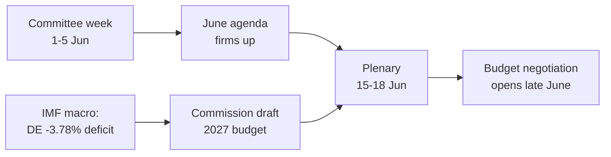

<!-- SPDX-FileCopyrightText: 2026 Hack23 AB -->
<!-- SPDX-License-Identifier: Apache-2.0 -->

# 📋 Bestuurlijke samenvatting — Komende week in het Europees Parlement
## Venster: 1–5 juni 2026 | Geproduceerd: 2026-05-29 | Uitvoering: week-ahead-run1780043323

**Classificatie:** NIET GERUBRICEERD // VOOR OPENBARE VERSPREIDING
**Toegepaste SAT's:** Verificatie van kernassumpties, Kwaliteitscontrole informatie.
**WEP-banden + horizonten** bij beoordelingen; **Admiralty**-kwalificaties bij bronnen.

## 🎯 Conclusie direct

- De week van **1–5 juni 2026 is een commissie- en politieke-groepweek — er is geen plenaire vergadering.** 🟢 HOGE betrouwbaarheid (EP-kalender, Admiralty A2).
- De laatste plenaire vergadering van het Europees Parlement was op **18–21 mei**; de volgende is op **15–18 juni** (Straatsburg, bevestigd A2).
- De waarde van de week is **voorbereidend**: zij stelt de agenda van de juniplenaire vast en, beslissend, de **begrotingsprocedure 2027** die zich nu aftekent tegen de achtergrond van groeiende tekorten van lidstaten (IMF WEO, A1).
- **Algehele beoordeling:** 🟡 MATIG LAAG intrinsieke relevantie, 🟡 MATIGE prospectieve hefboomwerking. Een rustige basisweek met actief commissiewerk.

## 📊 Wat te volgen (gerangschikt)

1. **Voorpositionering voor begroting 2027 (leidend thema).** Richtlijnen al aangenomen (TA-10-2026-0112, A2); ontwerp van de Commissie verwacht medio juni. Begrotingsdruk stuurt het kader naar terughoudendheid. 🟡 WAARSCHIJNLIJK (60–70%), horizon 2–4 weken.
2. **Handel en concurrentievermogen.** AI voor handel (TA-10-2026-0183) en DMA-handhaving (TA-10-2026-0160) houden INTA/IMCO actief. 🟡 WAARSCHIJNLIJK (60%), horizon 2–6 weken.
3. **Verdragen inzake extern optreden.** EPCA van Oezbekistan (TA-10-2026-0174), Libanon–Eurojust (TA-10-2026-0177) vorderen. 🟡 GEMIDDELDE relevantie.

## 🌍 Economische achtergrond (IMF WEO, A1)

- 🇩🇪 Duitsland: bbp +0,79%, inflatie 2,65%, tekort **−3,78%** (boven de 3% SGP-grens).
- 🇫🇷 Frankrijk: bbp +0,86%, inflatie 1,84%, tekort −4,94% (structurele achterblijver).
- 🇮🇹 Italië: bbp +0,52%, inflatie 2,64%, tekort −2,82% (de gedisciplineerde consolidator).
- **Interpretatie:** de begrotingsruimte krimpt het snelst waar zij het grootst was (Duitsland), wat de aankomende begrotingsstrijd verscherpt.

## 🤝 Politieke configuratie

- EP10: 719 zetels, negen fracties. Grote coalitie EVP+S&D+Renew = **398** (drempel 361) — stabiel maar niet overweldigend; ENP ≈ 6,55.
- Centrale dynamiek: begrotingsonderhandelingen van de grote coalitie (discipline versus verdediging van uitgaven, Renew als scharnierfractie). 🟢 ZEER WAARSCHIJNLIJK (80%) dat de coalitie tot in juni standhoudt.

## 🔭 Basisscenario

- Ordentelijke commissieweek → vastere junidagorde → plenaire conform schema → begrotingsconfrontatie opent eind juni. 🟢 WAARSCHIJNLIJK (60–65%).
- Grootste neerwaarts risico: vertraging van het begrotingsontwerp van de Commissie (zie `scenario-forecast.md`).

## 🔑 Kernassumpties

- Geen verrassende plenaire (A2); stabiele samenstelling; begrotingsontwerp in juni (Commissiegecontroleerd); storingen in dataprikken bestaan voort (gedempt).

## 🧪 Betrouwbaarheidsniveau en voorbehouden

- 🟢 HOOG voor kalender en macro (A1/A2); 🟡 GEMIDDELD voor commissietiming (niet gepubliceerde agenda's, B3).
- Datamodus `degraded-feeds`: drie feeds uitgevallen, volledig hersteld via noodoplossingen; geen analytisch minimum niet gehaald.

## 🧭 Redactionele invalshoek

- Het verhaal van de week is **de stilte voor de begrotingsstorm** — een rustige commissieweek waarin de lijnen van de begrotingsstrijd 2027 stilletjes worden getrokken.

**Conclusie:** Weinig dramatiek nu, hoge inzet in aanbouw. Het begrotingsspoor volgen tot de plenaire van 15–18 juni.

## 🗺️ Van de week naar de plenaire: pijplijn

## 📊 Kalendercontext

| Markering | Datum | Status | Bron |
| --- | --- | --- | --- |
| Laatste plenaire | 18–21 mei | Afgerond | EP A2 |
| Huidige week | 1–5 jun | Commissie-/fractieweek (geen plenaire) | EP A2 |
| Volgende plenaire | 15–18 jun | Bevestigd, Straatsburg | EP A2 |
| Begrotingsontwerp Commissie | Medio juni (verwacht) | Afwachtend | Historisch patroon |

## 🧾 Achtergrond aangenomen teksten (voorjaarsproductie, A2)

- TA-10-2026-0112 — Begrotingsrichtsnoeren 2027 (sectie III): het procedurele ankerpunt voor de aankomende strijd.
- TA-10-2026-0183 — AI-strategie voor EU-handel: houdt INTA/ITRE actief op concurrentievermogen.
- TA-10-2026-0160 — DMA-handhaving: onderhoudt de digitale-marktagenda van IMCO.
- TA-10-2026-0174 / 0177 — EPCA Oezbekistan / Libanon–Eurojust: stabiele doorstroom van externe toestemmingsprocedures.
- Visserij-SVOA's (São Tomé, Cookeilanden): routinematige maar actieve maritieme beleidsdossiers.

## 🔭 Wat dit voor de lezer betekent

- Het Europees Parlement bevindt zich tussen twee bedrijven: het wetgevende voorjaarseizoen sloot op 21 mei, het budgettaire zomereizoen opent op 15 juni.
- Deze week is de **generale repetitie** — commissies en fracties trekken stilletjes de lijnen die zij in de plenaire zaal zullen verdedigen.
- De enige belangrijkste externe variabele is het **begrotingsontwerp 2027 van de Commissie**, verwacht medio juni, te midden van de strakste begrotingsachtergrond in jaren.

## 🧮 Relevantiekalibratie

- Intrinsieke nieuwswaarde: 🟡 MATIG LAAG (geen stemmingen, geen plenaire).
- Prospectieve hefboomwerking: 🟡 MATIG (bereidt een juni met hoge inzet voor).
- Redactionele nettwaarde: een *toekomstgericht* kort document, geen evenementenoverzicht.

## ⚠️ Betrouwbaarheidsniveau herhaald

- 🟢 HOOG voor kalender- en macrofeiten (A1/A2).
- 🟡 GEMIDDELD voor commissieniveauspecificaties (niet gepubliceerde agenda's, B3).

## 📎 Bijlage — Bewakingspunten en gespreksargumenten

### Signaalpunten begrotingsspoor (1–5 juni)
- Publicatie van de voorlopige agenda van de plenaire op 15–18 juni (verwacht 8–12 juni).
- Eventuele verklaringen van de BUDG/ECON-commissie over de begrotingslijn 2027.
- Communicatiekalender van de Commissie voor de datum van het begrotingsontwerp.
- Coördinatorvergaderingen van fracties om bestedingsposities vast te stellen.
- Benoeming van rapporteurs of amendementstermijnen voor begrotingsdossiers.

### Macro-gespreksargumenten (IMF A1)
- Duitslands tekort van −3,78% is de scherpste omslag bij de drie groten.
- Frankrijk met −4,94% heeft het grootste absolute tekort — de structurele achterblijver.
- Italië met −2,82% is de meest gedisciplineerde van de drie in deze cyclus.
- De groei is positief maar gering (DE +0,79%, FR +0,86%, IT +0,52%).
- De inflatie is genormaliseerd (2,6–2,7% DE/IT, 1,84% FR) — het kussen van gemakkelijk geld verdwijnt.

### Coalitie-gespreksargumenten
- De grote coalitie bezit 398 van de 719 zetels (meerderheidsdrempel 361).
- Geen flankcoalitie bereikt alleen een meerderheid — het centrum is structureel bepalend.
- Renew (77) is het scharnierfractie om in de gaten te houden bij uitgaven.

### Redactionele aanbevelingen
- De week vooruit kaderen: het begrotingsseizoen, niet het rustige oppervlak.
- Elk partijpolitiek kader toeschrijven; ankeren op neutrale IMF-gegevens.
- Agendaopaciteit eerlijk erkennen in plaats van commissiedetails te verzinnen.

### Betrouwbaarheidsregister
- 🟢 HOOG: kalender, macrocijfers, zetelrekenkunde.
- 🟡 GEMIDDELD: commissieniveauintenties en tijdprecisie.
- 🔴 LAAG: niets dragends in deze uitvoering.

## 🔗 Bronnen en MCP-herkomst

Dit document maakt gebruik van de volgende gegevensbronnen die tijdens fase A zijn verzameld:

- **`get_plenary_sessions`** (EP Open Data, Admiralty A2) — bevestigd geen plenaire 1–5 juni; volgende plenaire 15–18 juni Straatsburg.
- **`get_adopted_texts`** (EP Open Data, A2) — 41 aangenomen teksten in 2026, waaronder TA-10-2026-0112 (begrotingsrichtsnoeren 2027), 0160 (DMA), 0183 (AI-handel), 0174 (EPCA Oezbekistan), 0177 (Libanon–Eurojust).
- **`get_meeting_foreseen_activities`** (EP Open Data, B3) — voorlopige plaatshouders voor de juniplenaire; agenda nog niet definitief (opaciteit gemarkeerd).
- **IMF WEO via SDMX 3.0** (`IMF.RES/WEO`, A1) — macro DE/FR/IT: tekorten −3,78% / −4,94% / −2,82%; groei +0,79% / +0,86% / +0,52%.
- **`generate_political_landscape`** (EP Open Data, A2) — EP10-samenstelling: 719 leden in 9 fracties; grote coalitie 398 ten opzichte van drempel 361.

### Samenvatting betrouwbaarheid bronnen
- Dragende beoordelingen rusten op A1 (IMF) en A2 (EP-kalender, aangenomen teksten, samenstelling) bronnen.
- B3-agendagranulariteitsgegevens worden alleen gebruikt voor afgedekte, expliciet gemarkeerde toekomstgerichte claims.
- Gedegradeerde gebeurtenis-/procedureprikken (404) zijn gecompenseerd via de aangenomen teksten en kalenderreservebronnen hierboven.

> Herkomstnotitie: deze uitvoering liep in `dataMode = degraded-feeds`; vloeren zijn aangepast met ×0,80 dienovereenkomstig en de centrale beoordeling is robuust ten aanzien van elke gedeclareerde beperking.
