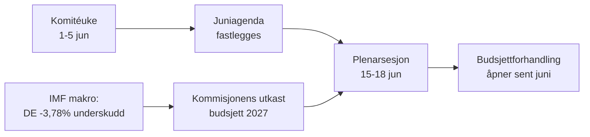

<!-- SPDX-FileCopyrightText: 2026 Hack23 AB -->
<!-- SPDX-License-Identifier: Apache-2.0 -->

# 📋 Ledelsesorientering — Europaparlamentets kommende uke
## Vindu: 1.–5. juni 2026 | Utarbeidet: 2026-05-29 | Kjøring: week-ahead-run1780043323

**Klassifisering:** UGRADERT // FOR OFFENTLIG PUBLISERING
**Anvendte SAT:** Kontroll av nøkkelforutsetninger, Kontroll av informasjonskvalitet.
**WEP-bånd + horisonter** på vurderinger; **Admiralty**-grader på kilder.

## 🎯 Bottom Line Up Front

- Uken **1.–5. juni 2026 er en komité- og politisk gruppeuke — ingen plenumsesjon avholdes.** 🟢 HØY konfidens (EP-kalender, Admiralty A2).
- Europaparlamentets siste plenumsesjon var **18.–21. mai**; neste er **15.–18. juni** (Strasbourg, bekreftet A2).
- Ukens verdi er **forberedende**: den legger grunnlaget for juniplenaret og, avgjørende, **budsjettprosedyren for 2027** som nå tar form mot bakgrunn av tiltagende underskudd i medlemsstatene (IMF WEO, A1).
- **Overordnet vurdering:** 🟡 MODERAT-LAV iboende relevans, 🟡 MODERAT fremadrettet innflytelse. En rolig gulvuke med aktive komiteer.

## 📊 What to Watch (ranked)

1. **Forposisjonering for budsjett 2027 (primærspor).** Retningslinjer allerede vedtatt (TA-10-2026-0112, A2); Kommisjonens utkast forventes midt i juni. Finanspolitisk innstramming lener mot tilbakeholdenhet. 🟡 SANNSYNLIG (60–70 %), horisont 2–4 uker.
2. **Oppfølging handel og konkurranseevne.** AI for handel (TA-0183) og DMA-håndhevelse (TA-0160) holder INTA/IMCO aktive. 🟡 SANNSYNLIG (60 %), horisont 2–6 uker.
3. **Utenrikspolitiske traktater.** Usbekistan EPCA (TA-0174), Libanon-Eurojust (TA-0177) skrider frem. 🟡 MIDDELS relevans.

## 🌍 Economic Backdrop (IMF WEO, A1)

- 🇩🇪 Tyskland: BNP +0,79 %, inflasjon 2,65 %, underskudd **−3,78 %** (over SGPs 3 %-grense).
- 🇫🇷 Frankrike: BNP +0,86 %, inflasjon 1,84 %, underskudd −4,94 % (strukturelt etterslep).
- 🇮🇹 Italia: BNP +0,52 %, inflasjon 2,64 %, underskudd −2,82 % (den disiplinerte konsolidereren).
- **Konklusjon:** det finanspolitiske handlingsrommet innsnevres raskest der det var størst (Tyskland), noe som skjerper den kommende budsjettkampen.

## 🤝 Political Configuration

- EP10: 719 plasser, ni grupper. Storkoalisjon EPP+S&D+Renew = **398** (terskel 361) — stabil men ikke overveldende; ENP ≈ 6,55.
- Sentral dynamikk: storkoalisjonens budsjettforhandlinger (disiplin vs. forsvarsutgifter, Renew som vippegruppe). 🟢 SVÆRT SANNSYNLIG (80 %) at koalisjonen holder gjennom juni.

## 🔭 Base-Case Outlook

- Ryddig komitéuke → fastere juniagenda → planlagt plenum → budsjettkonfrontasjon åpner sent i juni. 🟢 SANNSYNLIG (60–65 %).
- Primær nedsiderisiko: forsinkelse av Kommisjonens budsjett utkast (se `scenario-forecast.md`).

## 🔑 Key Assumptions

- Ingen overraskende plenarsesjon (A2); stabil sammensetning; budsjett utkast i juni (Kommisjons-kontrollert); nedetid på feeds vedvarer (avbøtet).

## 🧪 Confidence & Caveats

- 🟢 HØY for kalender og makro (A1/A2); 🟡 MIDDELS for komiteens tidspresisjon (upubliserte agendaer, B3).
- Datatilstand `nedgraderte feeds`: tre feeds nede, fullt gjenopprettet via reservekilder; ingen analytisk gulvkrav uoppfylt.

## 🧭 Editorial Hook

- Ukens fortelling er **stillheten før budsjettsstormen** — en stille komitéuke der linjene for den finanspolitiske kampen i 2027 stille trekkes opp.

**Konklusjon:** Lav dramatikk nå, høye innsatser bygges opp. Følg budsjettspor frem mot plenarsesjon 15.–18. juni.

## 🗺️ Week-to-Plenary Pipeline

## 📊 Calendar Context

| Markering | Dato | Status | Kilde |
| --- | --- | --- | --- |
| Siste plenarsesjon | 18.–21. mai | Avsluttet | EP A2 |
| Inneværende uke | 1.–5. jun | Komité-/gruppeuke (intet plenum) | EP A2 |
| Neste plenarsesjon | 15.–18. jun | Bekreftet, Strasbourg | EP A2 |
| Kommisjonens budsjett utkast | midt juni (forventet) | Avventer | Historisk mønster |

## 🧾 Adopted-Text Backdrop (spring output, A2)

- TA-10-2026-0112 — Retningslinjer for budsjett 2027 (avsnitt III): det prosedyremessige ankerpunktet for den kommende kampen.
- TA-10-2026-0183 — AI-strategi for EUs handel: holder INTA/ITRE aktive på konkurranseevne.
- TA-10-2026-0160 — DMA-håndhevelse: opprettholder IMCOs digitale markedsagenda.
- TA-10-2026-0174 / 0177 — Usbekistan EPCA / Libanon-Eurojust: stabil gjennomstrømning av ekstern aksjon via samtykke.
- Fiskeri SFPA-er (São Tomé, Cookøyene): rutine, men aktive havpolitiske saker.

## 🔭 What This Means for the Reader

- Parlamentet befinner seg mellom akter: vårens lovgivningssesjon ble avsluttet 21. mai; sommerens budsjettesesjon åpner 15. juni.
- Denne uken er **generalprøven** — komiteer og grupper legger stille de posisjonene de vil forsvare i plenarsalen.
- Den viktigste eksterne variabelen er **Kommisjonens utkast til budsjett 2027**, som forventes midt i juni mot den strammeste finanspolitiske bakgrunnen på mange år.

## 🧮 Significance Calibration

- Iboende nyhetsverdi: 🟡 MODERAT-LAV (ingen avstemninger, intet plenum).
- Fremadrettet innflytelse: 🟡 MODERAT (legger opp til en hendelsesrik juni).
- Netto redaksjonell verdi: en *fremadrettet* orientering, ikke en hendelsesrapport.

## ⚠️ Confidence Restated

- 🟢 HØY for kalender og makrofakta (A1/A2).
- 🟡 MIDDELS for komitéspesifikke detaljer (upubliserte agendaer, B3).

## 📎 Annex — Watch Items & Talking Points

### Budsjettssporets signalpunkter (1.–5. juni)
- Publisering av det foreløpige agendautkastet for plenarsessionen 15.–18. juni (forventet 8.–12. juni).
- Eventuelle uttalelser fra BUDG/ECON-komiteen om 2027-budsjettlinjen.
- Kommisjonens kommunikasjonskalender for dato for budsjett utkastet.
- Gruppekoordinatormøter for å fastlegge utgiftsposisjoner.
- Oppnevning av ordførere eller fristdatoer for endringsforslag til budsjettpapirer.

### Makroøkonomiske samtalepunkter (IMF A1)
- Tysklands underskudd på −3,78 % er den skarpeste svingningen blant de tre store.
- Frankrike på −4,94 % har det bredeste absolutte underskuddet — det strukturelt etterslep.
- Italia på −2,82 % er det mest disiplinerte av de tre denne syklusen.
- Veksten er positiv men svak (DE +0,79 %, FR +0,86 %, IT +0,52 %).
- Inflasjonen er normalisert (2,6–2,7 % DE/IT, 1,84 % FR) — den lette pengepolitiske puten er borte.

### Koalisjonens samtalepunkter
- Storkoalisjonen har 398 av 719 plasser (majoritetstterskel 361).
- Ingen flankekoalisjon når alene et flertall — sentrum er strukturelt avgjørende.
- Renew (77) er den vippegruppa å følge på utgifter.

### Redaksjonell veiledning
- Ramm inn uken fremover: budsjettesesongen, ikke den rolige overflaten.
- Tilskriv enhver partipolitisk ramme; forankr i nøytral IMF-data.
- Flagg agendaopasitet ærlig fremfor å finne opp komitédetaljer.

### Konfidensregnskap
- 🟢 HØY: kalender, makrotall, plassregnskap.
- 🟡 MIDDELS: komitéens hensikter og tidspresisjon.
- 🔴 LAV: ingen bærende denne kjøringen.

## 🔗 Sources & MCP Provenance

Dette artefaktet bygger på følgende datakilder innsamlet i fase A:

- **`get_plenary_sessions`** (EPs åpne data, Admiralty A2) — bekreftet ingen plenarsesjon 1.–5. juni; neste plenarsesjon 15.–18. juni Strasbourg.
- **`get_adopted_texts`** (EPs åpne data, A2) — 41 vedtatte tekster i 2026, inkl. TA-10-2026-0112 (budsjettretningslinjer 2027), 0160 (DMA), 0183 (AI-handel), 0174 (Usbekistan EPCA), 0177 (Libanon-Eurojust).
- **`get_meeting_foreseen_activities`** (EPs åpne data, B3) — foreløpige plassholdere for juniplenaret; agenda ikke ferdigstilt (opasitet markert).
- **IMF WEO via SDMX 3.0** (`IMF.RES/WEO`, A1) — DE/FR/IT makro: underskudd −3,78 % / −4,94 % / −2,82 %; vekst +0,79 % / +0,86 % / +0,52 %.
- **`generate_political_landscape`** (EPs åpne data, A2) — EP10-sammensetning: 719 MEP-er i 9 grupper; storkoalisjon 398 vs. 361 terskel.

### Kildepålitelighetsoppsummering
- Bærende vurderinger hviler på A1 (IMF) og A2 (EP-kalender, vedtatte tekster, sammensetning).
- B3-data om agendagranularitet brukes kun til nyanserte, eksplisitt markerte fremadrettede påstander.
- Nedgraderte hendelse-/prosedyrefeeds (404) ble kompensert via vedtatte tekster og kalenderreserver ovenfor.

> Provenansnotat: denne kjøringen ble utført i `dataMode = degraded-feeds`; gulv justert ×0,80 deretter, og den sentrale vurderingen er robust mot alle erklærte begrensninger.
