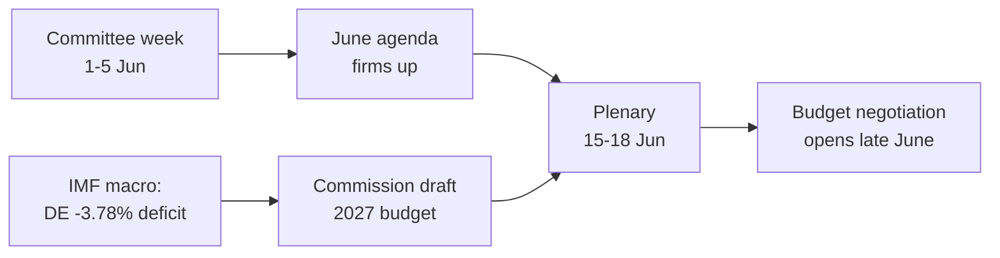

<!-- SPDX-FileCopyrightText: 2026 Hack23 AB -->
<!-- SPDX-License-Identifier: Apache-2.0 -->

# 📋 Eksekutivt sammendrag — Europaparlamentets uke fremover
## Vindu: 1.–5. juni 2026 | Produsert: 2026-05-29 | Kjøring: week-ahead-run1780043323

**Klassifisering:** UGRADERT // FOR OFFENTLIG PUBLISERING
**Anvendte SAT-er:** Kontroll av nøkkelantagelser, Kontroll av informasjonskvalitet.
**WEP-bånd + horisonter** på vurderinger; **Admiralty**-karakterer på kilder.

## 🎯 Konklusjon direkte

- Uken **1.–5. juni 2026 er en utvalgs- og politisk gruppes uke — ingen plenumsesjon avholdes.** 🟢 HØY konfidensnivå (EP-kalender, Admiralty A2).
- Europaparlamentets siste plenumssesjon var **18.–21. mai**; den neste er **15.–18. juni** (Strasbourg, bekreftet A2).
- Ukens verdi er **forberedende**: den setter dagsordenen for juniplenumssesjonen og, avgjørende, **budsjettprosedyren for 2027** som nå tar form mot bakgrunn av voksende underskudd i medlemsstatene (IMF WEO, A1).
- **Samlet vurdering:** 🟡 MODERAT LAV iboende relevans, 🟡 MODERAT fremtidsrettet innflytelse. En stille grunnuke med aktivt utvalgsarbeid.

## 📊 Hva man bør følge (rangert)

1. **Forhåndsposisjonering for budsjett 2027 (ledende).** Retningslinjer allerede vedtatt (TA-10-2026-0112, A2); Kommisjonens utkast forventes medio juni. Finanspolitisk press vinkler rammen mot tilbakeholdenhet. 🟡 SANNSYNLIG (60–70%), horisont 2–4 uker.
2. **Handel og konkurranseevne.** AI for handel (TA-10-2026-0183) og DMA-håndhevelse (TA-10-2026-0160) holder INTA/IMCO aktive. 🟡 SANNSYNLIG (60%), horisont 2–6 uker.
3. **Traktater om ekstern handling.** Usbekistans EPCA (TA-10-2026-0174), Libanon–Eurojust (TA-10-2026-0177) skrider frem. 🟡 MEDIUM relevans.

## 🌍 Økonomisk bakgrunn (IMF WEO, A1)

- 🇩🇪 Tyskland: BNP +0,79%, inflasjon 2,65%, underskudd **−3,78%** (over 3% SGP-grensen).
- 🇫🇷 Frankrike: BNP +0,86%, inflasjon 1,84%, underskudd −4,94% (strukturell sinker).
- 🇮🇹 Italia: BNP +0,52%, inflasjon 2,64%, underskudd −2,82% (den disiplinerte konsolideringen).
- **Tolkning:** det finanspolitiske rommet strammes raskest der det var størst (Tyskland), og skjerper den kommende budsjettkampen.

## 🤝 Politisk konfigurasjon

- EP10: 719 seter, ni grupper. Stor koalisjon EPP+S&D+Renew = **398** (terskel 361) — stabil men ikke overveldende; ENP ≈ 6,55.
- Sentral dynamikk: stor-koalisjonens budsjettforhandlinger (disiplin mot utgiftsforsvar, Renew som svingeblokk). 🟢 SVÆRT SANNSYNLIG (80%) at koalisjonen holder inn i juni.

## 🔭 Basisscenario

- Ordnet utvalgsuke → fastere junidagsorden → plenumssesjon etter plan → budsjettkonfrontasjon åpner sent i juni. 🟢 SANNSYNLIG (60–65%).
- Største nedsiderisiko: forsinkelse av Kommisjonens budsjettsutkast (se `scenario-forecast.md`).

## 🔑 Nøkkelantagelser

- Ingen overraskelseplenum (A2); stabil sammensetning; budsjettsutkast i juni (kommisjonskontrollert); strømmingsavbrudd vedvarer (avhjulpet).

## 🧪 Konfidensnivå og forbehold

- 🟢 HØY for kalender og makro (A1/A2); 🟡 MEDIUM for utvalgstiming (uoffentliggjorte dagsordener, B3).
- Datatilstand `degraded-feeds`: tre strømmer nede, fullt gjenopprettet via reserveløsninger; ingen analytisk gulvstandard overskredet.

## 🧭 Redaksjonell innfallsvinkel

- Ukens historie er **stillheten før budsjettsstormen** — en stille utvalgsuke der linjene for det finanspolitiske slaget om 2027 stille trekkes opp.

**Konklusjon:** Lav dramatikk nå, høye innsatser underveis. Følg budsjettsporet frem til plenumssesjonen 15.–18. juni.

## 🗺️ Uke til plenumsesjon: pipeline

## 📊 Kalenderkontekst

| Markør | Dato | Status | Kilde |
| --- | --- | --- | --- |
| Siste plenumsesjon | 18.–21. mai | Avsluttet | EP A2 |
| Inneværende uke | 1.–5. jun | Utvalgs-/gruppeuke (ingen plenum) | EP A2 |
| Neste plenumsesjon | 15.–18. jun | Bekreftet, Strasbourg | EP A2 |
| Kommisjonens budsjettsutkast | Medio juni (forventet) | Avventes | Historisk mønster |

## 🧾 Bakgrunn for vedtatte tekster (vårproduksjon, A2)

- TA-10-2026-0112 — Retningslinjer for budsjett 2027 (avsnitt III): det prosedyremessige ankeret for den kommende kampen.
- TA-10-2026-0183 — AI-strategi for EU-handel: holder INTA/ITRE aktive på konkurranseevne.
- TA-10-2026-0160 — DMA-håndhevelse: opprettholder IMCO's digitale markedsagenda.
- TA-10-2026-0174 / 0177 — Usbekistans EPCA / Libanon–Eurojust: stabil gjennomstrømning av ekstern samtykkebehandling.
- Fiskeri-SFPA-er (São Tomé, Cookøyene): rutinepregede men aktive havpolitikkfiler.

## 🔭 Hva dette betyr for leseren

- Europaparlamentet befinner seg mellom akter: den lovgivende vårperioden ble avsluttet 21. mai, og den finanspolitiske sommerssesongen åpner 15. juni.
- Denne uken er **prøven** — utvalg og grupper setter stille de linjene de vil forsvare i salen.
- Den viktigste eksterne variabelen er **Kommisjonens budsjettsutkast for 2027**, forventet medio juni mot den strammeste finanspolitiske bakgrunnen på år.

## 🧮 Relevanskalibrering

- Iboende nyhetsverdi: 🟡 MODERAT LAV (ingen avstemninger, ingen plenum).
- Fremtidsrettet innflytelse: 🟡 MODERAT (setter opp en juni med høye innsatser).
- Netto redaksjonell verdi: et *fremtidsrettet* kortdokument, ikke et hendelsesresumé.

## ⚠️ Konfidensnivå gjentatt

- 🟢 HØY for kalender- og makrofakta (A1/A2).
- 🟡 MEDIUM for utvalgs nivåspesifikke detaljer (uoffentliggjorte dagsordener, B3).

## 📎 Vedlegg — Overvåkningspunkter og samtalepunkter

### Budsjettsporets signalposter (1.–5. juni)
- Publisering av den foreløpige dagsordenen for plenumssesjonen 15.–18. juni (forventet 8.–12. juni).
- Eventuelle uttalelser fra BUDG/ECON-utvalget om 2027-budsjettlinjen.
- Kommisjonens kommunikasjonskalender for datoen for budsjettsutkastet.
- Gruppers koordinatormøter for å fastsette utgiftsposisjoner.
- Ordfører-utnevnelser eller endringsfrister for budsjettfiler.

### Makrosamtalepunkter (IMF A1)
- Tysklands underskudd på −3,78% er det skarpeste skiftet blant de tre store.
- Frankrike på −4,94% har det bredeste absolutte underskuddet — den strukturelle sinkeren.
- Italia på −2,82% er den mest disiplinerte av de tre i denne syklusen.
- Veksten er positiv men tynn (DE +0,79%, FR +0,86%, IT +0,52%).
- Inflasjonen har normalisert seg (2,6–2,7% DE/IT, 1,84% FR) — fjerner den lette pengeputen.

### Koalisjonssamtalepunkter
- Stor koalisjonen holder 398 av 719 seter (flertallsterskel 361).
- Ingen flankekoalisjon når flertall alene — midten er strukturelt avgjørende.
- Renew (77) er svingeblokken å holde øye med for utgifter.

### Redaksjonell veiledning
- Ram inn uken fremover: budsjettsesongen, ikke den stille overflaten.
- Tilskrive enhver partipolitisk ramme; forankre i nøytrale IMF-data.
- Erkjenn dagsordensopasitet ærlig fremfor å finne på utvalgsdetaljer.

### Konfidensregister
- 🟢 HØY: kalender, makrotall, setearitmetikk.
- 🟡 MEDIUM: utvalgsintensjonsnivå og tidspresisjon.
- 🔴 LAV: ingen bærende i denne kjøringen.

## 🔗 Kilder og MCP-proveniens

Dette dokumentet bygger på følgende datakilder samlet inn under fase A:

- **`get_plenary_sessions`** (EP Open Data, Admiralty A2) — bekreftet ingen plenum 1.–5. juni; neste plenumsesjon 15.–18. juni Strasbourg.
- **`get_adopted_texts`** (EP Open Data, A2) — 41 vedtatte tekster i 2026, inkl. TA-10-2026-0112 (retningslinjer for budsjett 2027), 0160 (DMA), 0183 (AI-handel), 0174 (Usbekistans EPCA), 0177 (Libanon–Eurojust).
- **`get_meeting_foreseen_activities`** (EP Open Data, B3) — foreløpige plassholdere for juniplenumssesjonen; dagsorden ikke ferdigstilt (opasitet flagget).
- **IMF WEO via SDMX 3.0** (`IMF.RES/WEO`, A1) — DE/FR/IT makro: underskudd −3,78% / −4,94% / −2,82%; vekst +0,79% / +0,86% / +0,52%.
- **`generate_political_landscape`** (EP Open Data, A2) — EP10-sammensetning: 719 MEP-er i 9 grupper; stor koalisjon 398 mot terskelen 361.

### Oppsummering av kildetilpålitelighet
- Belastende vurderinger hviler på A1 (IMF) og A2 (EP-kalender, vedtatte tekster, sammensetning) kilder.
- B3 dagsordengransksningsdata brukes bare for hedgede, eksplisitt flaggede fremtidsrettede påstander.
- Nedgraderte hendelses-/prosedyrestrømmer (404) kompensert via vedtatte tekster og kalenderreservekilder ovenfor.

> Proveniensnotat: denne kjøringen utført i `dataMode = degraded-feeds`; gulvnivåer justert ×0,80 accordingly, og den sentrale vurderingen er robust mot enhver erklært begrensning.
