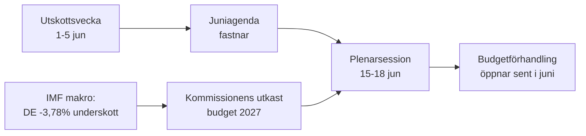

<!-- SPDX-FileCopyrightText: 2026 Hack23 AB -->
<!-- SPDX-License-Identifier: Apache-2.0 -->

# 📋 Verkställande sammanfattning — Europaparlamentets kommande vecka
## Fönster: 1–5 juni 2026 | Producerad: 2026-05-29 | Körning: week-ahead-run1780043323

**Klassificering:** OKLASSIFICERAD // FÖR OFFENTLIG PUBLICERING
**Tillämpade SAT:** Kontroll av nyckelförutsättningar, Kontroll av informationskvalitet.
**WEP-band + horisonter** på bedömningar; **Admiralty**-grader på källor.

## 🎯 Bottom Line Up Front

- Veckan **1–5 juni 2026 är en utskotts- och politisk grupps-vecka — ingen plenarsession hålls.** 🟢 HÖG konfidensgrad (EP-kalender, Admiralty A2).
- Europaparlamentets senaste plenarsession var **18–21 maj**; nästa är **15–18 juni** (Strasbourg, bekräftad A2).
- Veckans värde är **förberedande**: den lägger grunden för juniplenumet och, avgörande, **2027 års budgetprocedur** som nu formas mot bakgrund av alltmer bredande underskott i medlemsstaterna (IMF WEO, A1).
- **Övergripande bedömning:** 🟡 MÅTTLIG-LÅG inneboende relevans, 🟡 MÅTTLIG framåtsyftande hävstång. En lugn golvvecka med aktiva utskott.

## 📊 What to Watch (ranked)

1. **Förpositionering för budget 2027 (huvudspår).** Riktlinjer redan antagna (TA-10-2026-0112, A2); kommissionens utkast väntas i mitten av juni. Finansiellt åtstramningsläge tynger mot återhållsamhet. 🟡 TROLIGT (60–70%), horisont 2–4 v.
2. **Uppföljning handel & konkurrenskraft.** AI för handel (TA-0183) och DMA-efterlevnad (TA-0160) håller INTA/IMCO aktiva. 🟡 TROLIGT (60%), horisont 2–6 v.
3. **Utrikespolitiska fördrag.** Uzbekistan EPCA (TA-0174), Libanon–Eurojust (TA-0177) fortsätter framåt. 🟡 MEDELHÖG relevans.

## 🌍 Economic Backdrop (IMF WEO, A1)

- 🇩🇪 Tyskland: BNP +0,79 %, inflation 2,65 %, underskott **−3,78 %** (överstiger SGP:s 3 %-gräns).
- 🇫🇷 Frankrike: BNP +0,86 %, inflation 1,84 %, underskott −4,94 % (strukturellt eftersläpande).
- 🇮🇹 Italien: BNP +0,52 %, inflation 2,64 %, underskott −2,82 % (den disciplinerade konsolideringen).
- **Slutsats:** det finanspolitiska utrymmet krymper snabbast där det var störst (Tyskland), vilket skärper den kommande budgetkampen.

## 🤝 Political Configuration

- EP10: 719 platser, nio grupper. Storkoalition EPP+S&D+Renew = **398** (tröskelvärde 361) — stabil men inte överväldigande; ENP ≈ 6,55.
- Central dynamik: storkoalitionens budgetförhandlingar (åtstramningsdisciplin kontra försvarsutgifter, Renew som vågmästare). 🟢 MYCKET TROLIGT (80 %) att koalitionen håller genom juni.

## 🔭 Base-Case Outlook

- Ordnad utskottsvecka → fastare juniagenda → planerat plenum → budgetkonfrontation öppnas i slutet av juni. 🟢 TROLIGT (60–65 %).
- Huvudsaklig nersiderisk: försenat kommissionsutkast för budgeten (se `scenario-forecast.md`).

## 🔑 Key Assumptions

- Inget overraskande plenum (A2); stabil sammansättning; budgetutkast i juni (kommissionskontrollerat); feeddriftstörningar kvarstår (mitigerade).

## 🧪 Confidence & Caveats

- 🟢 HÖG för kalender och makro (A1/A2); 🟡 MEDEL för utskottets tidsram (opublicerade dagordningar, B3).
- Dataläge `nedgraderade flöden`: tre flöden nere, fullständigt återhämtade via reservlösningar; inget analytiskt golv otillfredsställt.

## 🧭 Editorial Hook

- Veckans historia är **stillheten inför budgetstormen** — en tyst utskottsvecka där linjerna för 2027 års finanspolitiska strid stillas dras upp.

**Slutsats:** Låg dramatik nu, hög insats byggs upp. Följ budgetspåret inför plenarsessionen 15–18 juni.

## 🗺️ Week-to-Plenary Pipeline

## 📊 Calendar Context

| Markering | Datum | Status | Källa |
| --- | --- | --- | --- |
| Senaste plenarsession | 18–21 maj | Avslutad | EP A2 |
| Innevarande vecka | 1–5 jun | Utskotts-/gruppvecka (inget plenum) | EP A2 |
| Nästa plenarsession | 15–18 jun | Bekräftad, Strasbourg | EP A2 |
| Kommissionens budgetutkast | mitten av juni (väntat) | Pågående | Historiskt mönster |

## 🧾 Adopted-Text Backdrop (spring output, A2)

- TA-10-2026-0112 — Riktlinjer för budget 2027 (avsnitt III): det procedurella ankaret för den kommande kampen.
- TA-10-2026-0183 — AI-strategi för EU:s handel: håller INTA/ITRE levande i konkurrenskraftsfrågor.
- TA-10-2026-0160 — DMA-efterlevnad: upprätthåller IMCO:s digitala marknadsagenda.
- TA-10-2026-0174 / 0177 — Uzbekistan EPCA / Libanon-Eurojust: stabil genomströmning av yttre åtgärder via samtycke.
- Fiskerifördrag SFPAs (São Tomé, Cooköarna): rutinmässiga men aktiva havspolitiska ärenden.

## 🔭 What This Means for the Reader

- Parlamentet befinner sig mellan akter: vårens lagstiftningssäsong avslutades den 21 maj, sommarens budgetsäsong öppnar den 15 juni.
- Denna vecka är **repetitionen** — utskott och grupper sätter i tysthet de linjer de kommer att försvara i plenarsalen.
- Den enskilt viktigaste externa variabeln är **kommissionens utkast till budget 2027**, som väntas i mitten av juni mot det strammaste finanspolitiska bakgrunden på år.

## 🧮 Significance Calibration

- Inneboende nyhetsvärde: 🟡 MÅTTLIG-LÅG (inga omröstningar, inget plenum).
- Framåtsyftande hävstång: 🟡 MÅTTLIG (sätter upp en händelserik juni).
- Netto redaktionellt värde: en *framåtblickande* sammanfattning, inte en händelserapport.

## ⚠️ Confidence Restated

- 🟢 HÖG för kalender och makrofakta (A1/A2).
- 🟡 MEDEL för utskottsnivåspecifika detaljer (opublicerade dagordningar, B3).

## 📎 Annex — Watch Items & Talking Points

### Budgetspårets signalpunkter (1–5 juni)
- Publicering av plenarsessionens preliminära dagordning för 15–18 juni (väntas 8–12 juni).
- Eventuellt uttalande från BUDG/ECON-utskottet om 2027 års budgetlinje.
- Kommissionens kommunikationskalender för datum för budgetutkastet.
- Gruppers samordnarmöten för att fastställa utgiftspositioner.
- Föredragandeuppgifter eller ändringsfristdatum för budgetärenden.

### Makroekonomiska samtalspunkter (IMF A1)
- Tysklands underskott på −3,78 % är den skarpaste svängningen bland de tre stora.
- Frankrike på −4,94 % har det bredaste absoluta underskottet — det strukturella eftersläpandet.
- Italien på −2,82 % är det mest disciplinerade av de tre denna cykel.
- Tillväxten är positiv men svag (DE +0,79 %, FR +0,86 %, IT +0,52 %).
- Inflationen har normaliserats (2,6–2,7 % DE/IT, 1,84 % FR) — den enkla penningpolitiska kudden är borta.

### Koalitionens samtalspunkter
- Storkoalitionen har 398 av 719 platser (majoritetsgräns 361).
- Ingen flankkoalition når ensam en majoritet — centrum är strukturellt avgörande.
- Renew (77) är den vågmästargrupp att bevaka i utgiftsfrågor.

### Redaktionell vägledning
- Rama in veckan framåt: budgetsäsongen, inte den lugna ytan.
- Tillskriva varje partipolitisk ram; förankra i neutral IMF-data.
- Flagga agendaopacitet ärligt snarare än att hitta på utskottsdetaljer.

### Konfidensledger
- 🟢 HÖG: kalender, makrosiffror, platsräkning.
- 🟡 MEDEL: utskottsnivåns avsikter och tidsprecision.
- 🔴 LÅG: inget bärande denna körning.

## 🔗 Sources & MCP Provenance

Denna artefakt bygger på följande datakällor insamlade under steg A:

- **`get_plenary_sessions`** (EP:s öppna data, Admiralty A2) — bekräftade inget plenum 1–5 juni; nästa plenarsession 15–18 juni Strasbourg.
- **`get_adopted_texts`** (EP:s öppna data, A2) — 41 antagna texter 2026, inkl. TA-10-2026-0112 (budgetriktlinjer 2027), 0160 (DMA), 0183 (AI-handel), 0174 (Uzbekistan EPCA), 0177 (Libanon-Eurojust).
- **`get_meeting_foreseen_activities`** (EP:s öppna data, B3) — provisoriska platshållare för juniplenum; dagordning ej slutgiltig (opacitet flaggad).
- **IMF WEO via SDMX 3.0** (`IMF.RES/WEO`, A1) — DE/FR/IT makro: underskott −3,78 % / −4,94 % / −2,82 %; tillväxt +0,79 % / +0,86 % / +0,52 %.
- **`generate_political_landscape`** (EP:s öppna data, A2) — EP10-sammansättning: 719 ledamöter i 9 grupper; storkoalition 398 vs. 361 tröskel.

### Källornas tillförlitlighetssammanfattning
- Bärande bedömningar baseras på A1 (IMF) och A2 (EP-kalender, antagna texter, sammansättning).
- B3-data om dagordningsgranularitet används endast för nyanserade, tydligt flaggade framåtsyftande påståenden.
- Nedgraderade händelse-/procedurassflöden (404) kompenserades via ovan nämnda antagna texter och kalenderreservlösningar.

> Provenansnotering: denna körning kördes i `dataMode = degraded-feeds`; golven justerades ×0,80 i enlighet med detta och den centrala bedömningen är robust mot varje deklarerad begränsning.
