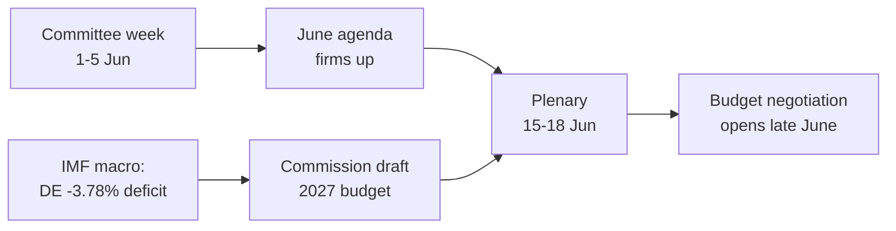

<!-- SPDX-FileCopyrightText: 2026 Hack23 AB -->
<!-- SPDX-License-Identifier: Apache-2.0 -->

# 📋 Exekutiv sammanfattning — EU-parlamentets vecka framåt
## Fönster: 1–5 juni 2026 | Producerad: 2026-05-29 | Körning: week-ahead-run1780043323

**Klassificering:** OKLASSIFICERAD // FÖR OFFENTLIG PUBLICERING
**Tillämpade SAT:** Granskning av nyckelantaganden, Granskning av informationskvalitet.
**WEP-band + horisonter** för bedömningar; **Admiralty**-betyg för källor.

## 🎯 Slutsats direkt

- Veckan **1–5 juni 2026 är en utskotts- och politisk grupps vecka — ingen plenarsession äger rum.** 🟢 HÖG konfidensgrad (EP-kalender, Admiralty A2).
- Europaparlamentets senaste plenarsession var **18–21 maj**; nästa är **15–18 juni** (Strasbourg, bekräftat A2).
- Veckans värde är **förberedande**: det sätter agendan för juniplenarsessionen och, avgörande, **budgetproceduren för 2027** som nu tar form mot bakgrund av växande underskott i medlemsstaterna (IMF WEO, A1).
- **Övergripande bedömning:** 🟡 MÅTTLIGT LÅG inneboende relevans, 🟡 MÅTTLIG framåtriktad hävstång. En lugn golvvecka med aktivt utskottsarbete.

## 📊 Vad man bör bevaka (rangordnat)

1. **Förpositionering inför budget 2027 (ledande).** Riktlinjerna redan antagna (TA-10-2026-0112, A2); kommissionens utkast förväntas i mitten av juni. Finanspolitiskt tryck lutar inramningen mot återhållsamhet. 🟡 TROLIGT (60–70%), horisont 2–4 veckor.
2. **Handel och konkurrenskraft.** AI för handel (TA-10-2026-0183) och DMA-genomförande (TA-10-2026-0160) håller INTA/IMCO aktiva. 🟡 TROLIGT (60%), horisont 2–6 veckor.
3. **Fördrag om externa åtgärder.** Uzbekistans EPCA (TA-10-2026-0174), Libanon–Eurojust (TA-10-2026-0177) fortskrider. 🟡 MEDIUM relevans.

## 🌍 Ekonomisk bakgrund (IMF WEO, A1)

- 🇩🇪 Tyskland: BNP +0,79%, inflation 2,65%, underskott **−3,78%** (över 3% SGP-gränsen).
- 🇫🇷 Frankrike: BNP +0,86%, inflation 1,84%, underskott −4,94% (strukturell eftersläpare).
- 🇮🇹 Italien: BNP +0,52%, inflation 2,64%, underskott −2,82% (den disciplinerade konsolidatorn).
- **Tolkning:** det finanspolitiska utrymmet minskar snabbast där det var störst (Tyskland), vilket skärper den kommande budgetstriden.

## 🤝 Politisk konfiguration

- EP10: 719 platser, nio grupper. Stor koalition EPP+S&D+Renew = **398** (tröskelvärde 361) — stabil men inte överväldigande; ENP ≈ 6,55.
- Central dynamik: stor-koalitionens budgetförhandlingar (disciplin kontra utgiftsförsvar, Renew som svängblock). 🟢 MYCKET TROLIGT (80%) att koalitionen håller in i juni.

## 🔭 Basscenario

- Ordnad utskottsvecka → fastare junidagordning → plenarsession enligt schema → budgetkonfrontation öppnar sent i juni. 🟢 TROLIGT (60–65%).
- Största risken: försenat budgetutkast från kommissionen (se `scenario-forecast.md`).

## 🔑 Nyckelantaganden

- Ingen överraskningsplenar (A2); stabil sammansättning; budgetutkast i juni (kommissionskontrollerat); flödesavbrott kvarstår (åtgärdade).

## 🧪 Konfidensgrad och förbehåll

- 🟢 HÖG för kalender och makro (A1/A2); 🟡 MEDIUM för utskottstiming (opublicerade dagordningar, B3).
- Dataläge `degraded-feeds`: tre flöden nere, fullt återhämtade via reservlösningar; inget analytiskt golv underskridet.

## 🧭 Redaktionell ingång

- Veckans historia är **stillheten inför budgetstormen** — en lugn utskottsvecka där linjerna för det finanspolitiska slag som väntar för 2027 tyst dras upp.

**Slutsats:** Låg dramatik nu, höga insatser på väg. Bevaka budgetspåret inför plenarsessionen 15–18 juni.

## 🗺️ Vecka till plenarsession: pipeline

## 📊 Kalenderkontext

| Markör | Datum | Status | Källa |
| --- | --- | --- | --- |
| Senaste plenarsession | 18–21 maj | Avslutad | EP A2 |
| Innevarande vecka | 1–5 jun | Utskotts-/gruppvecka (ingen plenar) | EP A2 |
| Nästa plenarsession | 15–18 jun | Bekräftad, Strasbourg | EP A2 |
| Kommissionens budgetutkast | Mitten av juni (förväntat) | Inväntas | Historiskt mönster |

## 🧾 Antagna-text-bakgrund (vårproduktion, A2)

- TA-10-2026-0112 — Riktlinjer för budget 2027 (avsnitt III): det processuella ankaret för den kommande striden.
- TA-10-2026-0183 — AI-strategi för EU-handel: håller INTA/ITRE aktiva på konkurrenskraft.
- TA-10-2026-0160 — DMA-genomförande: uppehåller IMCO:s digitala marknadsagenda.
- TA-10-2026-0174 / 0177 — Uzbekistans EPCA / Libanon–Eurojust: stabil genomströmning av externt samtyckesarbete.
- Fiskeri-SFPA:er (São Tomé, Cooköarna): rutinmässiga men aktiva marina politikfiler.

## 🔭 Vad detta innebär för läsaren

- Europaparlamentet befinner sig mellan akter: den lagstiftande vårperioden avslutades den 21 maj, och budgetsommarsäsongen öppnar den 15 juni.
- Denna vecka är **repetitionen** — utskott och grupper sätter tyst de linjer de kommer att försvara i kammaren.
- Den enskilt viktigaste externa variabeln är **kommissionens budgetutkast för 2027**, förväntat i mitten av juni mot den strammaste finanspolitiska bakgrunden på år.

## 🧮 Relevanskalibering

- Inneboende nyhetsvärde: 🟡 MÅTTLIGT LÅG (inga omröstningar, ingen plenar).
- Framåtriktad hävstång: 🟡 MÅTTLIG (sätter upp en juni med höga insatser).
- Nettovärde för redaktionen: ett *framåtblickande* kortdokument, inte en händelsesammanfattning.

## ⚠️ Konfidensgrad upprepas

- 🟢 HÖG för kalender- och makrofakta (A1/A2).
- 🟡 MEDIUM för utskottsnivåspecifika uppgifter (opublicerade dagordningar, B3).

## 📎 Bilaga — Bevakningspunkter och samtalsunderlag

### Budgetspårets signalposter (1–5 juni)
- Publicering av preliminär dagordning för plenarsessionen 15–18 juni (förväntat 8–12 juni).
- Eventuella uttalanden från BUDG/ECON-utskottet om budgetlinjen 2027.
- Kommissionens kommunikationskalender för tidpunkten för budgetutkastet.
- Gruppers koordinatormöten för att fastställa utgiftspositioner.
- Föredragandens utnämningar eller ändringsfrister för budgetfiler.

### Makrosamtalsunderlag (IMF A1)
- Tysklands underskott på −3,78% är den kraftigaste förändringen bland de tre stora.
- Frankrike på −4,94% har det bredaste absoluta underskottet — den strukturella eftersläparen.
- Italien på −2,82% är den mest disciplinerade av de tre under detta konjunkturcykeln.
- Tillväxten är positiv men tunn (DE +0,79%, FR +0,86%, IT +0,52%).
- Inflationen har normaliserats (2,6–2,7% DE/IT, 1,84% FR) — undanröjer den lätta pengakudden.

### Koalitionssamtalsunderlag
- Stor koalitionen håller 398 av 719 platser (majoritetssgräns 361).
- Ingen flankskoalition når en majoritet på egen hand — mitten är strukturellt avgörande.
- Renew (77) är det svängblock att bevaka för utgifter.

### Redaktionell vägledning
- Rama in veckan framåt: budgetsäsongen, inte den lugna ytan.
- Tillskriva varje partipolitisk inramning; förankra i neutrala IMF-data.
- Erkänn öppenhetsproblem kring dagordningen ärligt snarare än att hitta på utskottsdetaljer.

### Konfidensregister
- 🟢 HÖG: kalender, makrotal, platsaritmektik.
- 🟡 MEDIUM: utskottsnivåavsikter och tidsprecision.
- 🔴 LÅG: inget lastbärande under denna körning.

## 🔗 Källor och MCP-proveniens

Detta dokument bygger på följande datakällor insamlade under fas A:

- **`get_plenary_sessions`** (EP Open Data, Admiralty A2) — bekräftade att ingen plenar hålls 1–5 juni; nästa plenarsession 15–18 juni Strasbourg.
- **`get_adopted_texts`** (EP Open Data, A2) — 41 antagna texter 2026, inkl. TA-10-2026-0112 (budget 2027-riktlinjer), 0160 (DMA), 0183 (AI-handel), 0174 (Uzbekistans EPCA), 0177 (Libanon–Eurojust).
- **`get_meeting_foreseen_activities`** (EP Open Data, B3) — preliminära platshållare för juniplenarsessionen; dagordningen ej slutgiltig (opacitet flaggad).
- **IMF WEO via SDMX 3.0** (`IMF.RES/WEO`, A1) — DE/FR/IT makro: underskott −3,78% / −4,94% / −2,82%; tillväxt +0,79% / +0,86% / +0,52%.
- **`generate_political_landscape`** (EP Open Data, A2) — EP10-sammansättning: 719 ledamöter i 9 grupper; stor koalition 398 mot tröskelvärdet 361.

### Sammanfattning av källornas tillförlitlighet
- Belastande bedömningar vilar på A1 (IMF) och A2 (EP-kalender, antagna texter, sammansättning) källor.
- B3 dagordningsgranularitetsdata används endast för hedgade, explicit flaggade framtida påståenden.
- Nedgraderade händelse-/procedurflöden (404) kompenserades via de antagna texterna och kalenderreservalternativen ovan.

> Proveniensnot: denna körning genomfördes i `dataMode = degraded-feeds`; golvnivåer justerades ×0,80 accordingly och den centrala bedömningen är robust mot varje deklarerad begränsning.
