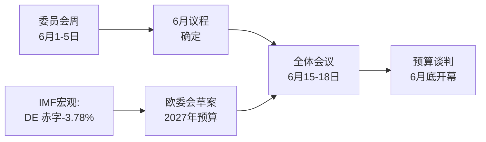

<!-- SPDX-FileCopyrightText: 2026 Hack23 AB -->
<!-- SPDX-License-Identifier: Apache-2.0 -->

# 📋 执行摘要 — 欧洲议会下周动态
## 时间窗口：2026年6月1日至5日 | 制作日期：2026-05-29 | 运行ID：week-ahead-run1780043323

**密级：** 非密 // 公开发布
**已采用SAT：** 关键假设核查、信息质量核查。
**WEP等级+时间维度** 用于判断；**Admiralty** 级别用于信息来源。

## 🎯 Bottom Line Up Front

- **2026年6月1日至5日为委员会与政治小组周——不举行全体会议。** 🟢 高置信度（EP日历，Admiralty A2）。
- 欧洲议会最近一次全体会议为**5月18日至21日**；下一次为**6月15日至18日**（斯特拉斯堡，A2已确认）。
- 本周的价值在于**准备性**：它为6月全体会议奠定基础，并决定性地影响在成员国赤字不断扩大背景下正在形成的**2027年预算程序**（IMF WEO，A1）。
- **总体判断：** 🟡 固有重要性中等偏低，🟡 前瞻性杠杆中等。委员会活跃的平静底盘周。

## 📊 What to Watch (ranked)

1. **2027年预算预先定位（主线）。** 指导方针已采纳（TA-10-2026-0112，A2）；欧委会草案预计6月中旬出炉。财政压力倾向于紧缩立场。🟡 很可能（60%至70%），时间范围2至4周。
2. **贸易与竞争力跟进。** AI贸易战略（TA-0183）和DMA执法（TA-0160）使INTA/IMCO保持活跃。🟡 很可能（60%），时间范围2至6周。
3. **对外政策条约。** 乌兹别克斯坦EPCA（TA-0174）、黎巴嫩-Eurojust（TA-0177）取得进展。🟡 中等重要性。

## 🌍 Economic Backdrop (IMF WEO, A1)

- 🇩🇪 德国：GDP +0.79%，通胀2.65%，财政赤字**−3.78%**（超过SGP 3%上限）。
- 🇫🇷 法国：GDP +0.86%，通胀1.84%，财政赤字−4.94%（结构性落后者）。
- 🇮🇹 意大利：GDP +0.52%，通胀2.64%，财政赤字−2.82%（财纪严明的整合者）。
- **解读：** 财政空间在最为宽裕的地方（德国）收窄最快，这使即将到来的预算博弈愈发尖锐。

## 🤝 Political Configuration

- EP10：719个席位，9个议会组。大联盟EPP+S&D+Renew = **398**（门槛361）——稳定但并不压倒性；ENP ≈ 6.55。
- 核心动态：大联盟预算谈判（财政纪律对阵防务支出，Renew担当关键砝码）。🟢 非常可能（80%），联盟整个六月保持稳定。

## 🔭 Base-Case Outlook

- 有序的委员会周 → 6月议程更趋确定 → 如期全体会议 → 6月底预算对决开幕。🟢 可能（60%至65%）。
- 主要下行风险：欧委会预算草案拖期（参见`scenario-forecast.md`）。

## 🔑 Key Assumptions

- 无突发全体会议（A2）；议席构成稳定；6月预算草案（由欧委会掌控）；数据流中断持续（已缓解）。

## 🧪 Confidence & Caveats

- 🟢 高：日历与宏观数据（A1/A2）；🟡 中：委员会时间安排（未公布议程，B3）。
- 数据模式`降级数据流`：3条数据流中断，通过备用来源完全恢复；所有分析底线均已满足。

## 🧭 Editorial Hook

- 本周的核心叙事是**预算风暴前的平静**——一个平静的委员会周，2027年财政博弈的轮廓正悄然勾勒。

**结论：** 当下戏剧性不足，高风险正在积聚。关注预算走向，直至6月15日至18日全体会议。

## 🗺️ Week-to-Plenary Pipeline

## 📊 Calendar Context

| 标记 | 日期 | 状态 | 来源 |
| --- | --- | --- | --- |
| 上次全体会议 | 5月18日至21日 | 已结束 | EP A2 |
| 本周 | 6月1日至5日 | 委员会/小组周（无全体会议） | EP A2 |
| 下次全体会议 | 6月15日至18日 | 已确认，斯特拉斯堡 | EP A2 |
| 欧委会预算草案 | 6月中旬（预期） | 待定 | 历史规律 |

## 🧾 Adopted-Text Backdrop (spring output, A2)

- TA-10-2026-0112 — 2027年预算指导方针（第三节）：即将到来的博弈的程序性锚点。
- TA-10-2026-0183 — 欧盟贸易AI战略：使INTA/ITRE在竞争力议题上保持活跃。
- TA-10-2026-0160 — DMA执法：维持IMCO的数字市场议程。
- TA-10-2026-0174 / 0177 — 乌兹别克斯坦EPCA / 黎巴嫩-Eurojust：对外行动同意程序稳定推进。
- 渔业SFPA（圣多美、库克群岛）：例行但活跃的海洋政策档案。

## 🔭 What This Means for the Reader

- 议会正处于两幕之间：春季立法季于5月21日结束，夏季预算季于6月15日开启。
- 本周是**彩排**——委员会和各议会组悄然设定将在全体会议上捍卫的立场。
- 最重要的外部变量是**欧委会2027年预算草案**，预计将在多年来最紧张的财政背景下于6月中旬出炉。

## 🧮 Significance Calibration

- 固有新闻价值：🟡 中等偏低（无投票，无全体会议）。
- 前瞻性杠杆：🟡 中等（为高风险六月奠定基础）。
- 净编辑价值：*前瞻性*简报，非事件回顾。

## ⚠️ Confidence Restated

- 🟢 高：日历与宏观事实（A1/A2）。
- 🟡 中：委员会层面的具体情况（未公布议程，B3）。

## 📎 Annex — Watch Items & Talking Points

### 预算走向信号点（6月1日至5日）
- 6月15至18日全体会议暂定议程草案发布（预计6月8至12日）。
- BUDG/ECON委员会就2027年预算线可能发表的声明。
- 欧委会预算草案日期的通信日历。
- 各议会组协调员会议确定支出立场。
- 预算档案的报告员任命或修正案截止日期。

### 宏观经济谈话要点（IMF A1）
- 德国−3.78%的赤字是三大国中波动最为剧烈的。
- 法国−4.94%是绝对赤字最大者——结构性落后国。
- 意大利−2.82%是本轮中三国中最为自律的。
- 增长为正但微弱（DE +0.79%，FR +0.86%，IT +0.52%）。
- 通胀已趋正常（2.6%至2.7% DE/IT，1.84% FR）——宽松货币政策的缓冲垫已消失。

### 联盟谈话要点
- 大联盟持有719席中的398席（过半数门槛361）。
- 没有任何侧翼联盟能单独获得多数——中间立场在结构上具有决定性。
- Renew（77席）是支出问题上需要关注的关键砝码。

### 编辑指引
- 以前瞻视角框定本周：预算季，而非平静表面。
- 为所有党派框架归因；以中立的IMF数据为锚。
- 诚实标注议程不透明性，而非捏造委员会细节。

### 置信度账册
- 🟢 高：日历、宏观数字、席位计算。
- 🟡 中：委员会层面意图与时间精度。
- 🔴 低：本次运行中无承重项目。

## 🔗 Sources & MCP Provenance

本制品基于A阶段收集的以下数据来源：

- **`get_plenary_sessions`**（EP公开数据，Admiralty A2）——确认6月1日至5日无全体会议；下次全体会议为6月15日至18日斯特拉斯堡。
- **`get_adopted_texts`**（EP公开数据，A2）——2026年共41项已采纳文本，包括TA-10-2026-0112（2027年预算指导方针）、0160（DMA）、0183（AI贸易）、0174（乌兹别克斯坦EPCA）、0177（黎巴嫩-Eurojust）。
- **`get_meeting_foreseen_activities`**（EP公开数据，B3）——6月全体会议临时占位符；议程尚未确定（不透明性已标注）。
- **IMF WEO via SDMX 3.0**（`IMF.RES/WEO`，A1）——DE/FR/IT宏观：赤字−3.78% / −4.94% / −2.82%；增长+0.79% / +0.86% / +0.52%。
- **`generate_political_landscape`**（EP公开数据，A2）——EP10构成：9个议会组共719名议员；大联盟398席对门槛361席。

### 来源可靠性摘要
- 承重判断依赖A1（IMF）和A2（EP日历、已采纳文本、议席构成）。
- B3议程粒度数据仅用于经明确标注的前瞻性声明中的细微表述。
- 降级的事件/程序数据流（404）已通过上述已采纳文本和日历备用来源予以补充。

> 来源说明：本次运行在`dataMode = degraded-feeds`模式下执行；底线已相应调整至×0.80，核心判断对所有已声明的局限性保持稳健。
