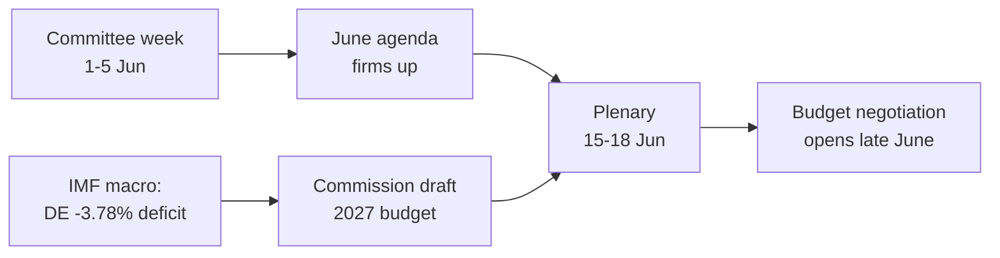

<!-- SPDX-FileCopyrightText: 2026 Hack23 AB -->
<!-- SPDX-License-Identifier: Apache-2.0 -->

# 📋 执行摘要 — 欧洲议会下周展望
## 时间窗口：2026年6月1日—5日 | 制作日期：2026-05-29 | 运行编号：week-ahead-run1780043323

**分类：** 非保密 // 公开发布
**应用SAT：** 关键假设核查、信息质量核查。
**WEP区间+时间跨度** 适用于判断；**Admiralty** 等级适用于来源。

## 🎯 直接结论

- **2026年6月1日—5日为委员会及政治小组工作周，不举行全体会议。** 🟢 高置信度（欧洲议会日历，Admiralty A2）。
- 欧洲议会上次全体会议为**5月18—21日**，下次为**6月15—18日**（斯特拉斯堡，A2确认）。
- 本周价值在于**准备性**：确立6月全体会议议程，并对当前在成员国赤字扩大背景下形成的**2027年预算程序**产生决定性影响（IMF WEO，A1）。
- **综合判断：** 🟡 固有重要性中低程度，🟡 前瞻性杠杆适中。平静的基础周，委员会工作活跃。

## 📊 值得关注的事项（按优先级排列）

1. **为2027年预算提前布局（主要议题）。** 指导方针已获通过（TA-10-2026-0112，A2）；欧洲委员会草案预计6月中旬发布。财政压力将框架向紧缩方向倾斜。🟡 可能（60—70%），时间跨度2—4周。
2. **贸易与竞争力。** 贸易AI（TA-10-2026-0183）和DMA执法（TA-10-2026-0160）使INTA/IMCO保持活跃。🟡 可能（60%），时间跨度2—6周。
3. **对外行动条约。** 乌兹别克斯坦EPCA（TA-10-2026-0174）、黎巴嫩—Eurojust（TA-10-2026-0177）推进。🟡 中等重要性。

## 🌍 经济背景（IMF WEO，A1）

- 🇩🇪 德国：GDP增长+0.79%，通胀2.65%，赤字**−3.78%**（超过稳定与增长公约3%红线）。
- 🇫🇷 法国：GDP增长+0.86%，通胀1.84%，赤字−4.94%（结构性落后国）。
- 🇮🇹 意大利：GDP增长+0.52%，通胀2.64%，赤字−2.82%（有纪律的整合国）。
- **解读：** 财政空间在原本最宽松的地方（德国）收紧最快，令即将到来的预算之争更为尖锐。

## 🤝 政治格局

- EP10：719席，九个议会党团。大联合欧洲人民党+社民党+复兴欧洲 = **398**席（门槛361）——稳定但非压倒性；ENP ≈ 6.55。
- 核心动态：大联合的预算谈判（财政纪律对阵支出捍卫，复兴欧洲作为关键摆动集团）。🟢 非常可能（80%）联合在6月前维持。

## 🔭 基准情景

- 有序的委员会周 → 6月议程趋于明确 → 本会议按期举行 → 预算摊牌于6月下旬开启。🟢 可能（60—65%）。
- 主要下行风险：欧洲委员会预算草案推迟（参见`scenario-forecast.md`）。

## 🔑 关键假设

- 无突发全体会议（A2）；构成稳定；6月发布预算草案（欧洲委员会管控）；数据馈送中断持续（已缓解）。

## 🧪 置信度与注意事项

- 🟢 高：日历与宏观经济（A1/A2）；🟡 中：委员会时间安排（未公布议程，B3）。
- 数据模式 `degraded-feeds`：三路馈送中断，通过备用方案完全恢复；无分析底线缺失。

## 🧭 编辑角度

- 本周故事是**预算风暴前的平静**——平静的委员会周，2027年财政争夺的战线正悄然划定。

**结论：** 当下戏剧性低，高风险正在积聚。追踪预算走向至6月15—18日全体会议。

## 🗺️ 从本周到全体会议：流程图

## 📊 日历背景

| 标志 | 日期 | 状态 | 来源 |
| --- | --- | --- | --- |
| 上次全体会议 | 5月18—21日 | 已结束 | EP A2 |
| 本周 | 6月1—5日 | 委员会/小组周（无全体会议） | EP A2 |
| 下次全体会议 | 6月15—18日 | 已确认，斯特拉斯堡 | EP A2 |
| 欧洲委员会预算草案 | 6月中旬（预期） | 待定 | 历史规律 |

## 🧾 已通过文本背景（春季产出，A2）

- TA-10-2026-0112 — 2027年预算指导方针（第三部分）：即将到来的斗争的程序锚。
- TA-10-2026-0183 — 欧盟贸易AI战略：使INTA/ITRE在竞争力领域保持活跃。
- TA-10-2026-0160 — DMA执法：维持IMCO的数字市场议程。
- TA-10-2026-0174 / 0177 — 乌兹别克斯坦EPCA / 黎巴嫩—Eurojust：对外行动同意程序稳定推进。
- 渔业可持续伙伴协议SFPA（圣多美、库克群岛）：常规但活跃的海洋政策文件。

## 🔭 对读者意味着什么

- 欧洲议会正处于两幕之间：立法春季于5月21日结束，预算夏季于6月15日开启。
- 本周是**彩排**——各委员会和党团悄然确立他们将在全体会议上捍卫的立场。
- 最重要的外部变量是预计6月中旬发布的**欧洲委员会2027年预算草案**，背景是多年来最紧张的财政状况。

## 🧮 重要性校准

- 固有新闻价值：🟡 中低（无投票，无全体会议）。
- 前瞻性杠杆：🟡 适中（为高风险的6月做准备）。
- 编辑净价值：*前瞻性*摘要，非事件回顾。

## ⚠️ 置信度重申

- 🟢 高：日历与宏观经济事实（A1/A2）。
- 🟡 中：委员会级别具体事项（未公布议程，B3）。

## 📎 附件 — 观察点与话语要点

### 预算走向信号点（6月1—5日）
- 发布6月15—18日全体会议暂定议程（预计6月8—12日）。
- BUDG/ECON委员会就2027年预算方向的任何声明。
- 欧洲委员会关于预算草案日期的沟通日历。
- 各党团协调员会议确定支出立场。
- 预算文件报告员任命或修正案截止日期。

### 宏观经济话语要点（IMF A1）
- 德国赤字−3.78%，是三大国中变化最大的。
- 法国−4.94%，绝对赤字最广——结构性落后国。
- 意大利−2.82%，本轮是三国中最有纪律的。
- 增长为正但薄弱（DE +0.79%，FR +0.86%，IT +0.52%）。
- 通胀已正常化（2.6—2.7% DE/IT，1.84% FR）——宽松货币的缓冲垫消失。

### 联合话语要点
- 大联合拥有719席中的398席（过半门槛361）。
- 没有任何侧翼联合能单独取得多数——中间力量在结构上具有决定性。
- 复兴欧洲（77席）是支出方面需密切观察的摆动集团。

### 编辑指引
- 向前框定本周：预算季，而非平静的表象。
- 归因每一个党派框架；以中立的IMF数据为锚。
- 诚实承认议程不透明，而非凭空捏造委员会细节。

### 置信度台账
- 🟢 高：日历，宏观数字，席位算术。
- 🟡 中：委员会级别意图和时间精确度。
- 🔴 低：本次运行中无关键性内容。

## 🔗 来源与MCP溯源

本文件基于A阶段收集的以下数据来源：

- **`get_plenary_sessions`**（EP Open Data，Admiralty A2）——确认6月1—5日无全体会议；下次全体会议6月15—18日，斯特拉斯堡。
- **`get_adopted_texts`**（EP Open Data，A2）——2026年41项已通过文本，包括TA-10-2026-0112（2027年预算指导方针）、0160（DMA）、0183（AI-贸易）、0174（乌兹别克斯坦EPCA）、0177（黎巴嫩—Eurojust）。
- **`get_meeting_foreseen_activities`**（EP Open Data，B3）——6月全体会议临时占位符；议程尚未确定（已标注不透明性）。
- **IMF WEO via SDMX 3.0**（`IMF.RES/WEO`，A1）——DE/FR/IT宏观：赤字−3.78% / −4.94% / −2.82%；增长+0.79% / +0.86% / +0.52%。
- **`generate_political_landscape`**（EP Open Data，A2）——EP10构成：9个党团共719名议员；大联合398席对应门槛361。

### 来源可靠性摘要
- 核心判断依托A1（IMF）和A2（欧洲议会日历、已通过文本、构成）来源。
- B3议程细节数据仅用于明确标注的、有对冲的前瞻性声明。
- 降级的事件/程序馈送（404）通过上述已通过文本和日历备用来源进行补偿。

> 溯源说明：本次运行在 `dataMode = degraded-feeds` 模式下执行；底线按×0.80调整，核心判断对每一项声明的限制均具有稳健性。
