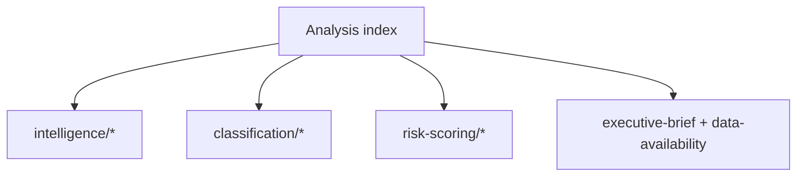

<!-- SPDX-FileCopyrightText: 2026 Hack23 AB -->
<!-- SPDX-License-Identifier: Apache-2.0 -->

# 🗂️ Analysis Index — EU Parliament Week Ahead
## Window: 1–5 June 2026 | Produced: 2026-05-29 | Run: week-ahead-run1780043323

**Classification:** UNCLASSIFIED // FOR PUBLIC RELEASE

## 📚 Artifact Directory

### Root
- `executive-brief.md` — top-line forward assessment (BLUF).
- `data-availability-assessment.md` — source coverage and collection grade.

### classification/
- `significance-classification.md` — significance rating + tags.
- `actor-mapping.md` — institutional and group actors.
- `forces-analysis.md` — driving/restraining force field.
- `impact-matrix.md` — impact × likelihood quadrants.

### risk-scoring/
- `risk-matrix.md` — WEP-graded risk register.
- `quantitative-swot.md` — scored SWOT.

### intelligence/
- `synthesis-summary.md` — integrated narrative.
- `coalition-dynamics.md` — EP10 geometry and cohesion.
- `scenario-forecast.md` — branching scenarios to the June plenary.
- `pestle-analysis.md` — PESTLE environmental scan.
- `stakeholder-map.md` — stakeholder positions and leverage.
- `wildcards-blackswans.md` — low-probability/high-impact contingencies.
- `historical-baseline.md` — comparison to prior committee weeks.
- `economic-context.md` — IMF WEO macro backdrop (A1).
- `threat-model.md` — political-threat assessment.
- `mcp-reliability-audit.md` — per-call evidence ledger.
- `procedures-proxy.md` — throughput proxy (pipeline fallback).
- `reference-analysis-quality.md` — self-assessment of analytic quality.
- `forward-projection.md` — sequenced forward outlook.
- `analysis-index.md` — this file.
- `methodology-reflection.md` — SAT attestation + lessons (Step 10.5).

### extended/
- `media-framing-analysis.md` — framing and narrative analysis.

### documents/
- `document-analysis-index.md` — EP documents consulted.

## 🧭 Reading Order

1. `executive-brief.md` → `synthesis-summary.md` → `scenario-forecast.md`.
2. Evidence base: `economic-context.md`, `mcp-reliability-audit.md`, `data-availability-assessment.md`.
3. Depth: classification/, risk-scoring/, remaining intelligence/.
4. Process: `methodology-reflection.md`.

## 📊 Run Metadata

- Article type: `week-ahead`
- Date: 2026-05-29 · Horizon: 1–5 June 2026
- Data mode: `degraded-feeds` (×0.80 floors)
- Next plenary: 15–18 June 2026 (Strasbourg)

**Bottom line:** This index is the navigation map for the run's full analytic set.

## 🗂️ Artifact Groups

- **intelligence/** — synthesis, coalition, scenario, threat, economic-context, stakeholder, wildcards, historical, forward-projection, methodology, reference-quality, mcp-audit, pestle, procedures-proxy, analysis-index.
- **classification/** — actor-mapping, forces-analysis, impact-matrix, significance-classification.
- **risk-scoring/** — risk-matrix, quantitative-swot.
- **root** — executive-brief, data-availability-assessment.
- **extended/** — media-framing-analysis. **documents/** — document-analysis-index.

Every artifact is cross-referenced from the manifest and consumed by the Stage D renderer.
