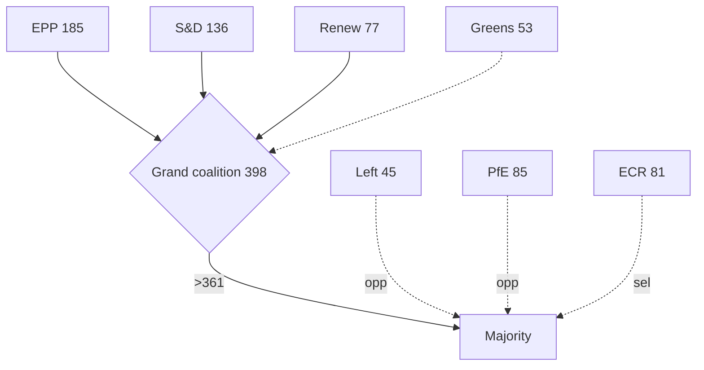

<!-- SPDX-FileCopyrightText: 2026 Hack23 AB -->
<!-- SPDX-License-Identifier: Apache-2.0 -->

# 🤝 Coalition Dynamics — Week Ahead
## Window: 1–5 June 2026 | Produced: 2026-05-29

**Classification:** UNCLASSIFIED // FOR PUBLIC RELEASE
**Method note:** EP10 seat distribution is the static fallback (the `generate_political_landscape` composite timed out, 100 s). Group composition is invariant within a 7-day horizon, so the static baseline is authoritative for this run.

## 🧮 EP10 Composition (719 seats; majority threshold 361)

| Group | Seats | Bloc |
|---|---|---|
| EPP | 185 | Centre-right |
| S&D | 136 | Centre-left |
| PfE | 85 | Sovereigntist right |
| ECR | 81 | Conservative right |
| Renew | 77 | Liberal centre |
| Greens/EFA | 53 | Green-left |
| The Left | 45 | Left |
| NI | 30 | Non-attached |
| ESN | 27 | Hard right |

## 🔗 Coalition Geometry

- **Grand coalition (EPP+S&D+Renew):** 398 seats → +37 over threshold. Stable but not overwhelming.
- **Centre-right + ECR (EPP+ECR):** 266 → short of majority; needs Renew or PfE.
- **Progressive bloc (S&D+Greens+Left+Renew):** 311 → short; cannot govern without EPP.
- **Effective number of parties (ENP):** ≈ 6.55 — a highly fragmented chamber.

## 📊 Dynamics This Week

- No floor votes → coalition tension is **latent**, expressed in committee amendment-setting.
- Budget-2027 prep is the principal fault line: EPP/ECR discipline vs S&D/Greens/Left spending defence, with Renew as swing.
- Trade/competitiveness files show an EPP–ECR convergence that stresses the grand coalition's left flank.

## 🧭 Cohesion Outlook

- **Grand-coalition cohesion:** 🟡 MODERATE — holds on procedure, strains on budget substance.
- **Right-of-EPP coordination:** 🟡 rising on competitiveness, fragmented on EU-integration questions.
- **WEP:** 🟢 HIGHLY LIKELY (80%) the grand coalition holds through the June plenary; 🟡 LIKELY (55%) of visible intra-coalition friction on budget conditionality.

**Bottom line:** A stable-but-fragmented chamber whose central coalition will be tested — not broken — by the 2027 budget storyline taking shape this week. Confidence: 🟢 HIGH on composition, 🟡 MEDIUM on behavioural forecast.

