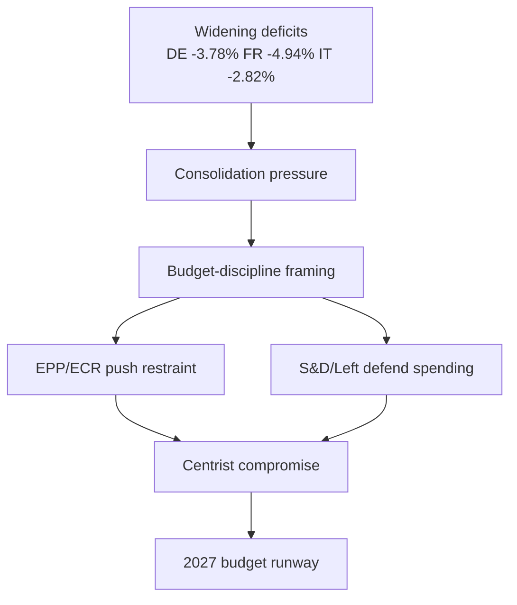

<!-- SPDX-FileCopyrightText: 2026 Hack23 AB -->
<!-- SPDX-License-Identifier: Apache-2.0 -->

# 🌍 Economic Context — EU Parliament Week Ahead
## Window: 1–5 June 2026 | Produced: 2026-05-29

**Classification:** UNCLASSIFIED // FOR PUBLIC RELEASE
**Authoritative economic source:** IMF World Economic Outlook database, retrieved live via `api.imf.org` SDMX 3.0 on 2026-05-29 (449 observations). **IMF is the sole authoritative source** for every macro figure in this analysis (Admiralty **A1**).
**WEP framing:** Economic conditions shape, but do not determine, the committee agenda of the week ahead.

---

## 📊 IMF WEO — Big-Three Euro-Area Economies (2024–2027)

Real GDP growth (`NGDP_RPCH`), average consumer-price inflation (`PCPIPCH`) and general-government net lending/borrowing as % of GDP (`GGXCNL_NGDP`). Source: IMF WEO via SDMX 3.0, `IMF.RES/WEO`.

| Economy | Metric | 2024 | 2025 | 2026 | 2027 |
|---|---|---|---|---|---|
| 🇩🇪 Germany | Real GDP growth % | −0.50 | +0.24 | **+0.79** | +1.18 |
| 🇩🇪 Germany | Inflation % | 2.48 | 2.30 | **2.65** | 2.30 |
| 🇩🇪 Germany | Fiscal balance % GDP | −2.66 | −2.67 | **−3.78** | −4.23 |
| 🇫🇷 France | Real GDP growth % | 1.11 | 0.93 | **+0.86** | 0.88 |
| 🇫🇷 France | Inflation % | 2.32 | 0.93 | **1.84** | 1.72 |
| 🇫🇷 France | Fiscal balance % GDP | −5.79 | −5.11 | **−4.94** | −4.79 |
| 🇮🇹 Italy | Real GDP growth % | 0.78 | 0.54 | **+0.52** | 0.50 |
| 🇮🇹 Italy | Inflation % | 1.08 | 1.63 | **2.64** | 2.36 |
| 🇮🇹 Italy | Fiscal balance % GDP | −3.35 | −3.11 | **−2.82** | −2.58 |

*Confidence in evidence: 🟢 HIGH — figures retrieved directly from the IMF SDMX endpoint this run, not interpolated. Euro-area aggregate was requested but not returned in the series payload; the three largest member economies (≈ two-thirds of euro-area GDP) are used as the authoritative proxy.*

---

## 🧭 Reading the Macro Picture for the Week Ahead

The euro area's three largest economies enter June 2026 in a posture of **shallow recovery against widening fiscal strain**. Germany, after two years at or below stagnation, is forecast to grow only 0.79% in 2026 while its deficit deteriorates sharply to −3.78% of GDP — back above the 3% Stability and Growth Pact reference value after two compliant years. France remains the fiscal outlier of the trio, with a 2026 deficit of −4.94% of GDP on growth of just 0.86%. Italy is the relative fiscal bright spot (−2.82%, inside the 3% line) but the slowest-growing of the three at 0.52%.

This configuration matters directly to the EP's week-ahead committee work for three reasons:

1. **The 2027 budget procedure is now the dominant fiscal storyline.** Parliament adopted its *Guidelines for the 2027 Budget — Section III* (TA-10-2026-0112, 28 April 2026) and its own *Estimates for FY2027* (TA-10-2026-04-30-ANN01) before the May recess. With member-state deficits widening (Germany) or sticky (France), the Commission's draft 2027 budget — expected in early-to-mid June — will land into a Council mood of fiscal conservatism. BUDG committee preparatory work this week is the EP's last quiet window before that confrontation.

2. **Inflation has re-accelerated modestly.** German (2.65%) and Italian (2.64%) 2026 inflation both sit above the ECB's 2% target, complicating any parliamentary push for new spending and reinforcing the ECON committee's scrutiny of the ECB (cf. the adopted *ECB Annual Report 2025*, TA-10-2026-0034, and the VP-ECB appointment, TA-10-2026-0060).

3. **Trade exposure compounds fiscal fragility.** Germany and Italy are the EU's most export-dependent large economies; the adopted *AI strategy for EU trade* (TA-10-2026-0183) and the earlier US-tariff customs-adjustment text (TA-10-2026-0096) show Parliament positioning on the trade-and-competitiveness axis. A negative trade shock would hit precisely the economies with the least fiscal headroom.

---

## 🔗 Linkage to the Week's Parliamentary Agenda

| Macro signal | EP committee touchpoint (week ahead) | Direction of pressure |
|---|---|---|
| German deficit → −3.78% (SGP breach) | BUDG draft-2027-budget prep | Tightens the envelope for new programmes |
| Sticky inflation 2.6%+ (DE/IT) | ECON ECB scrutiny follow-up | Reinforces monetary-orthodoxy framing |
| France −4.94% deficit | BUDG / ECON country-context | Sharpens net-contributor vs cohesion debate |
| Weak growth across trio | ITRE/INTA competitiveness files | Strengthens deregulation/Draghi-agenda momentum |

**Bottom line (WEP):** It is 🟢 **HIGHLY LIKELY (85–90%)** that fiscal-consolidation framing dominates any budget-adjacent committee discussion this week, and 🟡 **LIKELY (60–70%)** that the widening German deficit is cited explicitly in BUDG or ECON preparatory exchanges ahead of the Commission's June draft budget. All probability judgements rest on IMF A1 macro data plus B2/B3 EP procedural evidence.

---

## 📉 Fiscal-Space Ranking (week-ahead relevance)

Ordered from most to least fiscal headroom among the big three:

1. **Italy** — deficit −2.82% of GDP, inside the 3% SGP reference value; the surprise consolidator of the trio, though hampered by the weakest growth (0.52%) and a high legacy debt stock.
2. **Germany** — deficit −3.78%, now *above* the 3% line after two compliant years; the largest single deterioration and therefore the loudest fiscal storyline into the June budget.
3. **France** — deficit −4.94%, the structural laggard; persistent excessive-deficit exposure constrains its room to back new EU spending.

This ranking inverts the conventional "frugal north vs spending south" frame: in 2026 it is Italy that holds the line and Germany that slips, a reversal worth flagging in any budget-context reporting.

## 🧩 Transmission Channels to EP Committee Work

- **BUDG (Budgets):** the draft 2027 budget is the proximate trigger; tighter national balances harden Council's negotiating floor.
- **ECON (Economic & Monetary Affairs):** sticky 2.6%+ inflation in Germany and Italy keeps ECB scrutiny live and dampens appetite for fiscal expansion.
- **ITRE / INTA (Industry / Trade):** weak trend growth across the trio sustains the competitiveness-and-deregulation agenda and the trade-tech files (AI-for-trade TA-0183).
- **REGI / AGRI (Cohesion / Agriculture):** net-contributor fiscal stress sharpens the perennial cohesion-versus-rebate tension that surfaces in every MFF-adjacent debate.

## ⚠️ Confidence & Caveats

- **Data confidence:** 🟢 HIGH for the figures themselves (live IMF SDMX pull, A1).
- **Inference confidence:** 🟡 MEDIUM for the committee-linkage judgements — these connect authoritative macro data to an *un-published* committee agenda, so they describe structural pressure, not confirmed scheduling.
- **Known gap:** euro-area aggregate series not returned this run; the big-three proxy covers ≈ two-thirds of euro-area GDP and is directionally representative but not a substitute for the headline aggregate.
- **No non-IMF economic figures** appear anywhere in this brief, in compliance with the single-authoritative-source rule.

## 📊 Year-on-Year Deltas (2025 → 2026, IMF WEO)

- 🇩🇪 Germany GDP: +0.24% → +0.79% (accelerating, +0.55pp)
- 🇩🇪 Germany fiscal: −2.67% → −3.78% (deteriorating, −1.11pp) — crosses the 3% line
- 🇩🇪 Germany inflation: 2.30% → 2.65% (rising, +0.35pp)
- 🇫🇷 France GDP: +0.93% → +0.86% (flat-to-easing, −0.07pp)
- 🇫🇷 France fiscal: −5.11% → −4.94% (improving, +0.17pp) — still well outside 3%
- 🇫🇷 France inflation: 0.93% → 1.84% (rising, +0.91pp)
- 🇮🇹 Italy GDP: +0.54% → +0.52% (flat, −0.02pp)
- 🇮🇹 Italy fiscal: −3.11% → −2.82% (improving, +0.29pp) — moves inside 3%
- 🇮🇹 Italy inflation: 1.63% → 2.64% (rising, +1.01pp)

## 🧭 One-Line Read per Economy

- **Germany:** modest growth rebound bought with a sharply wider deficit.
- **France:** stuck on weak growth and the trio's largest deficit, improving only glacially.
- **Italy:** the disciplined consolidator, but with almost no growth to show for it.

These deltas reinforce the central economic storyline of the week: fiscal space is **tightening fastest where it was widest** (Germany), which is precisely why the upcoming 2027 budget negotiation will be more contentious than the headline growth numbers alone suggest.

## 🗂️ Provenance

| Field | Value |
| --- | --- |
| **IMF Source** | `live` |
| Endpoint | `api.imf.org` SDMX 3.0 (`IMF.RES/WEO`) |
| Retrieved | 2026-05-29 |
| Indicators | `NGDP_RPCH`, `PCPIPCH`, `GGXCNL_NGDP` |
| Admiralty grade | A1 |

## 🗺️ Fiscal-to-Politics Transmission

**Sources:** IMF WEO (Admiralty A1), EP budget guidelines TA-10-2026-0112 (A2).
