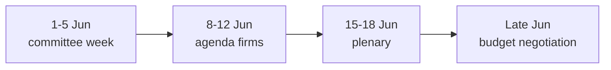

<!-- SPDX-FileCopyrightText: 2026 Hack23 AB -->
<!-- SPDX-License-Identifier: Apache-2.0 -->

# 🔭 Forward Projection — EU Parliament Week Ahead
## Window: 1–5 June 2026 (horizon to 15–18 June plenary) | Produced: 2026-05-29

**Classification:** UNCLASSIFIED // FOR PUBLIC RELEASE
**WEP + horizon** on every judgement. **Admiralty** grade on sources.

## 📅 Sequenced Forward Outlook

- **1–5 June (this week):** committee + group week; amendment-setting; no floor votes. 🟢 HIGHLY LIKELY (90%), horizon 0–7d, source EP A2.
- **8–12 June:** continued committee finalisation; June agenda firms up. 🟡 LIKELY (65%), horizon 7–14d, source EP B3.
- **15–18 June:** Strasbourg plenary; budget and trade files reach the floor. 🟢 HIGHLY LIKELY (85%) the plenary convenes as scheduled, horizon 14–21d, source EP A2.
- **June (mid):** Commission tables draft 2027 budget. 🟡 EVEN CHANCE→LIKELY (50–65%) within the month, source EP A2 + IMF A1 context.

## 🎯 Leading Indicators to Watch

- Publication of the 15–18 June plenary agenda (converts placeholders to firm items).
- Commission communications calendar for the budget draft.
- Committee amendment deadlines on budget-adjacent files.
- Group press statements signalling budget red lines.

## 🧭 Base-Case Projection

- **Most likely path:** quiet productive committee week → firmer June agenda → on-schedule plenary → budget confrontation begins late June.
- **Confidence:** 🟢 HIGH on the calendar spine, 🟡 MEDIUM on budget-draft timing.

## ⚠️ Projection Caveats

- All committee-level timing is inferred from structure, not confirmed agendas.
- Budget-draft timing depends on the Commission, outside EP control.

**Bottom line:** Expect a low-drama agenda-setting week feeding a higher-stakes June plenary, with the 2027 budget as the storyline to carry forward.

## 🗺️ Forward Projection

## 🔭 Projected Markers

| Window | Expected development | Confidence |
| --- | --- | --- |
| 1–5 Jun | Committee/group prep, no votes | 🟢 HIGH |
| ~mid-Jun | Commission tables draft 2027 budget | 🟡 MEDIUM |
| 15–18 Jun | Plenary; budget debate opens | 🟢 HIGH (date), 🟡 (content) |
| Late Jun+ | Inter-institutional negotiation | 🟡 MEDIUM |

## 🧭 Carry-Forward Storyline

- The single thread to track across the projection is the **2027 budget** — from guidelines (adopted) to draft (mid-June) to negotiation (summer).
- 🟢 HIGH confidence on the calendar skeleton; 🟡 MEDIUM on the political content at each node.

## 📎 Annex — Projection Notes

- The calendar skeleton (committee week → agenda → plenary → negotiation) is fixed and high-confidence.
- The political content at each node depends on the Commission draft, which is exogenous.
- The carry-forward thread is the 2027 budget at every stage.
- Indicator for on-track projection: agenda published 8–12 June.
- Indicator for slippage: Commission calendar movement.

### Confidence ledger
- 🟢 HIGH: calendar dates.
- 🟡 MEDIUM: political content per node.
