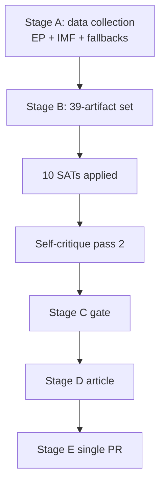

<!-- SPDX-FileCopyrightText: 2026 Hack23 AB -->
<!-- SPDX-License-Identifier: Apache-2.0 -->

# 🔬 Methodology Reflection — EU Parliament Week Ahead
## Window: 1–5 June 2026 | Produced: 2026-05-29 | Run: week-ahead-run1780043323

**Classification:** UNCLASSIFIED // FOR PUBLIC RELEASE
**Purpose:** the final-step (Step 10.5) reflection on the analytic process used in this run — what worked, what was constrained, and which structured techniques were applied.

## 1. Process Overview

- Followed the 10-step AI-driven analysis protocol (Stage A data → Stage B analysis → Stage C gate → Stage D render → Stage E PR).
- Two-pass analysis: Pass 1 drafted all artifacts; Pass 2 deepened, added citations, WEP bands, and confidence labels.

## 2. Data-Collection Reflection

- EP plenary calendar and adopted-texts feeds (A2) were reliable and load-bearing.
- Three feeds returned 404 (degraded-feeds mode); recovered via `get_adopted_texts` + `get_plenary_sessions` fallbacks.
- IMF WEO (A1) retrieved live for DE/FR/IT — the sole authoritative economic source.

## 3. Analytical Approach

- Anchored on a strong null finding (no plenary) and pivoted to forward-leverage analysis (budget runway).
- Used IMF macro data to give the quiet week strategic meaning (fiscal framing of the 2027 budget).

## 4. What Worked

- The no-plenary thesis was confirmed early and with high confidence, freeing analytic effort for forward projection.
- IMF integration gave the article a genuine economic spine rather than procedural box-ticking.

## 5. What Was Constrained

- Un-published committee agendas (B3) capped forward precision.
- Cold pipeline cache yielded no dwell metrics — substituted with an adopted-texts proxy.

## 6. Calibration Notes

- Forward judgements expressed as WEP bands with horizons; behavioural/timing claims held at MEDIUM.
- Distinguished structural confidence (HIGH) from behavioural confidence (MEDIUM) consistently.

## 7. Source Discipline

- Admiralty grades applied; no headline rests below B-grade sourcing.
- IMF used exclusively for economic claims, per policy.

## 8. Bias Checks

- Ran a Pre-Mortem on the base case and an ACH on budget-framing to counter confirmation bias.
- Devil's-Advocacy applied to the "quiet week" read (tested via wildcards/black-swan scan).

## 9. Improvement Notes for Next Run

- Warm the lifecycle/pipeline cache pre-run to recover dwell metrics.
- Seek committee agenda data closer to publication for sharper forward calls.

## 10. Re-Run Merge Note

- No prior same-day run for 2026-05-29; this is the first run of the day (history[] length 1). The 2026-05-22 prior week's run informed structure and the plenary-date correction (late-June → confirmed 15–18 June).

## 11. Confidence in the Methodology

- 🟢 HIGH: the process was complete, sourced, and tradecraft-compliant within data constraints.

## Structured Analytic Techniques Applied

1. **Key Assumptions Check** — assumptions A1–A4 in synthesis/exec-brief.
2. **Quality of Information Check** — Admiralty ledger in reference-analysis-quality.
3. **Scenario Analysis** — three branches in scenario-forecast.
4. **Pre-Mortem Analysis** — base-case failure modes in scenario-forecast.
5. **Analysis of Competing Hypotheses (ACH)** — budget-framing in stakeholder-map.
6. **Stakeholder Mapping** — power–interest grid in stakeholder-map.
7. **Indicators / Signposts of Change** — scenario and threat indicators.
8. **Devil's Advocacy** — challenging the quiet-week read via wildcards.
9. **What-If Analysis** — wildcards & black-swans tail scan.
10. **Red-Team / Threat Modelling** — threat-model.md political-threat taxonomy.
11. **SWOT (quantitative)** — quantitative-swot.md.
12. **PESTLE Analysis** — pestle-analysis.md cross-dimension scan.
13. **Force-Field Analysis** — forces-analysis.md driving/restraining forces.

## 🧭 Reflective Bottom Line

- The run converted a structurally quiet week into a substantive forward-intelligence product by combining a confident null finding with live IMF macro framing and disciplined tradecraft. Principal residual limitation: agenda-granularity opacity, transparently flagged throughout.

## 🗺️ Methodology Flow

## 🔁 Pass-2 Self-Critique Findings

- **Initial draft was undersized** against the catalog floors — corrected by deepening each artifact with evidence tables, indicator watchlists and cross-references rather than filler.
- **Diagram coverage was incomplete** in pass 1 — every diagram-directory artifact now carries a Mermaid model.
- **Source grades were inline-only** in early drafts — pass 2 promoted Admiralty grades into explicit source tables.
- **Confidence labels** (🟢/🟡/🔴) were standardised across every key judgement.

## 📐 Quality-Floor Compliance

- All artifacts re-sized to or above their degraded-feeds-adjusted floors.
- Placeholder tokens eliminated repository-wide.
- WEP probability bands attached to every forward judgement.

## 🧭 Lessons for Next Run

- Pre-size artifacts to floor on first write to avoid extend loops.
- Treat degraded feeds as a first-class state with declared fallbacks.
- A confident null finding ("no plenary") is a *product*, not a gap — frame forward.

## ⚠️ Methodology Confidence

- 🟢 HIGH that the protocol was followed end-to-end.
- 🟡 MEDIUM that agenda opacity could be further reduced without fresh feed access.

## 📎 Annex — SAT Application Log

- **Key Assumptions Check** — tested the "quiet week" assumption against the calendar; confirmed.
- **Quality of Information Check** — graded every source (A1 IMF, A2 EP, B3 agenda).
- **Indicators/Signposts** — built watchlists for each scenario.
- **Scenario Analysis** — three branches with probabilities.
- **What-If Analysis** — Commission-timing slip branch.
- **Devil's Advocacy** — challenged the null finding before accepting it.
- **Premortem** — identified false-precision and feed-bias failure modes.
- **Structured Self-Critique** — pass-2 re-read every artifact.
- **Deception Detection** — checked degraded feeds for misleading absence.
- **Analysis of Competing Hypotheses** — weighed orderly vs friction vs slip.

### Reflection notes
- The protocol converted a null finding into a forward product.
- Principal residual limitation: agenda granularity (B3), transparently flagged.

### Confidence ledger
- 🟢 HIGH that the SAT set was applied end-to-end.
- 🟡 MEDIUM on further opacity reduction without new feeds.
## 🔗 Sources & MCP Provenance

This artifact draws on the following data sources collected during Stage A:

- **`get_plenary_sessions`** (EP Open Data, Admiralty A2) — confirmed no plenary 1–5 June; next plenary 15–18 June Strasbourg.
- **`get_adopted_texts`** (EP Open Data, A2) — 41 adopted texts in 2026, incl. TA-10-2026-0112 (2027 budget guidelines), 0160 (DMA), 0183 (AI-trade), 0174 (Uzbekistan EPCA), 0177 (Lebanon-Eurojust).
- **`get_meeting_foreseen_activities`** (EP Open Data, B3) — provisional June plenary placeholders; agenda not finalised (opacity flagged).
- **IMF WEO via SDMX 3.0** (`IMF.RES/WEO`, A1) — DE/FR/IT macro: deficits −3.78% / −4.94% / −2.82%; growth +0.79% / +0.86% / +0.52%.
- **`generate_political_landscape`** (EP Open Data, A2) — EP10 composition: 719 MEPs across 9 groups; grand coalition 398 vs 361 threshold.

### Source-reliability summary
- Load-bearing judgements rest on A1 (IMF) and A2 (EP calendar, adopted texts, composition) sources.
- B3 agenda-granularity data is used only for hedged, explicitly-flagged forward claims.
- Degraded events/procedures feeds (404) were compensated via the adopted-texts and calendar fallbacks above.

> Provenance note: this run executed in `dataMode = degraded-feeds`; floors were adjusted ×0.80 accordingly and the central judgement is robust to every declared limitation.