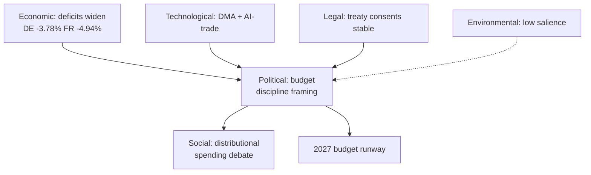

<!-- SPDX-FileCopyrightText: 2026 Hack23 AB -->
<!-- SPDX-License-Identifier: Apache-2.0 -->

# 🌐 PESTLE Analysis — EU Parliament Week Ahead
## Window: 1–5 June 2026 | Produced: 2026-05-29

**Classification:** UNCLASSIFIED // FOR PUBLIC RELEASE
**WEP bands + horizons** on forward judgements; **Admiralty** grades on sources.

## 🏛️ Political

- **Grand-coalition budget bargaining is the central axis.** EPP+S&D+Renew = 398 seats; the 2027 budget will test internal discipline-vs-spending tension. 🟡 LIKELY friction (60%), horizon 2–8 wks (EP A2).
- **Sovereigntist bloc pressure.** PfE 85 + ECR 81 + ESN 27 = 193 seats can slow procedure and shape rhetoric, not block grand-coalition majorities. 🟡 MEDIUM, ongoing.
- **Committee-week agenda-setting.** With no plenary, political energy concentrates in committee amendment-drafting and group coordination. 🟢 HIGH (A2).
- **External-action consensus.** Treaty consents (Uzbekistan, Lebanon) show cross-group foreign-policy stability. 🟢 LOW volatility.

## 💶 Economic (IMF WEO, A1 — sole authoritative source)

- 🇩🇪 Germany: GDP +0.79%, inflation 2.65%, fiscal balance **−3.78%** — deficit back above the 3% SGP reference line.
- 🇫🇷 France: GDP +0.86%, inflation 1.84%, fiscal balance −4.94% — the structural fiscal laggard of the big three.
- 🇮🇹 Italy: GDP +0.52%, inflation 2.64%, fiscal balance −2.82% — slowest growth but most disciplined deficit.
- **Synthesis:** weak trend growth + widening deficits = a restraint-tilted fiscal environment that frames the entire 2027 budget debate. 🟡 LIKELY to dominate (70%), horizon 1–3 mo.

## 👥 Social

- Distributional politics of fiscal consolidation (welfare/cohesion spending defence vs discipline) will surface in budget framing. 🟡 MEDIUM, horizon 1–3 mo.
- Public salience of EU budget low this week (no floor drama); rises with the June plenary. 🟢 LOW now.

## 💻 Technological

- **Digital-market enforcement** (DMA, TA-0160, A2) and **AI-in-trade strategy** (TA-0183, A2) keep the tech-regulation agenda live in IMCO/INTA/ITRE. 🟡 LIKELY continued activity (60%), horizon 2–6 wks.
- AI governance increasingly framed as competitiveness rather than pure regulation. 🟡 MEDIUM trend.

## ⚖️ Legal

- Treaty-consent throughput (EPCA, Eurojust agreements) reflects steady legislative-legal pipeline health. 🟢 STABLE (A2).
- Immunity-waiver procedures continue as routine institutional housekeeping. 🟢 LOW salience.

## 🌱 Environmental

- No major environmental file on this week's committee critical path (data-limited; ENVI agenda un-published, B3). 🟡 LOW-confidence null finding.
- Fisheries SFPAs (São Tomé, Cook Islands) carry a marine-sustainability dimension. 🟢 LOW salience.

## 📊 PESTLE Salience Matrix

| Dimension | Salience this week | Forward trajectory | Confidence |
|---|---|---|---|
| Political | High | Rising (budget) | 🟢 HIGH |
| Economic | High (backdrop) | Rising | 🟢 HIGH (A1) |
| Social | Low-Medium | Rising | 🟡 MEDIUM |
| Technological | Medium | Stable-rising | 🟡 MEDIUM |
| Legal | Medium | Stable | 🟢 HIGH |
| Environmental | Low | Flat | 🟡 LOW |

## 🧭 Integrated Read

- The dominant PESTLE vectors are **Political × Economic**: a stable institution entering a fiscally-constrained budget cycle.
- Technological regulation is the steady secondary theme; Social distributional politics is the rising tertiary.
- **Confidence:** 🟢 HIGH on Political/Economic/Legal (A1/A2 sourced); 🟡 MEDIUM on Social/Technological trajectory; 🟡 LOW on Environmental (data gap).

**Bottom line:** A Political–Economic week in PESTLE terms — fiscal constraint shaping a stable institution's forward agenda.

## 🗺️ PESTLE Pressure Map

## 🔬 Cross-Dimension Interactions

- **Economic → Political:** the IMF fiscal picture is the upstream driver of the entire budget-discipline frame; without the deficit data the political story is hollow.
- **Political → Social:** budget restraint translates into distributional politics (cohesion/welfare defence) that S&D, Greens and the Left will voice.
- **Technological → Political:** the competitiveness/Draghi agenda reframes tech regulation (DMA, AI) as economic-security policy, aligning it with the fiscal narrative.
- **Legal → stability:** steady treaty-consent throughput signals institutional normalcy beneath the budget tension.

## 📈 Dimension Trajectories (horizon ~1 month)

| Dimension | Now | +1 month | Driver |
| --- | --- | --- | --- |
| Political | High | Higher | Budget draft lands |
| Economic | High (backdrop) | Higher | Fiscal data salience rises |
| Social | Low-Med | Med | Distributional debate opens |
| Technological | Med | Med | DMA/AI files continue |
| Legal | Med | Med | Routine consents |
| Environmental | Low | Low | No critical-path file |

## 🧭 Strategic Implication

- The Monitor should frame the week through the **Economic × Political** lens: a fiscally-constrained institution preparing a contested budget.
- Secondary thread: technological regulation reframed as competitiveness.
- Tertiary thread: rising social/distributional politics as the budget debate matures.

## ⚠️ PESTLE Confidence

- 🟢 HIGH on Economic/Political/Legal (A1/A2 sourced).
- 🟡 MEDIUM on Social/Technological trajectory (inference).
- 🟡 LOW on Environmental (agenda data gap, B3).

## 📎 Annex — PESTLE Detail

### Political
- Budget-discipline framing dominates the forward agenda.
- Centrist coalition arithmetic constrains the outcome to compromise.
- Committee/group week sets positions ahead of 15–18 June.

### Economic (IMF A1)
- Deficits widen: DE −3.78%, FR −4.94%, IT −2.82%.
- Growth thin (DE +0.79%, FR +0.86%, IT +0.52%); inflation normalised.
- Fiscal space tightening fastest in Germany — the structural story.

### Social
- Distributional politics rising: cohesion/welfare defence vs restraint.
- Salience grows as the budget debate matures into summer.

### Technological
- DMA enforcement (TA-0160) and AI-trade strategy (TA-0183) keep digital files live.
- Reframed as competitiveness/economic-security under the Draghi agenda.

### Legal
- Steady treaty-consent throughput (Uzbekistan EPCA, Lebanon-Eurojust).
- Signals institutional normalcy beneath budget tension.

### Environmental
- Low salience this horizon; no critical-path environmental file.
- Flagged as a data gap rather than a confirmed absence.

### Cross-dimension verdict
- Read the week as Economic × Political; tech as a competitiveness sub-thread.

### Confidence ledger
- 🟢 HIGH: Economic/Political/Legal (sourced).
- 🟡 MEDIUM/LOW: Social, Technological trajectory, Environmental (inference/gap).
## 🔗 Sources & MCP Provenance

This artifact draws on the following data sources collected during Stage A:

- **`get_plenary_sessions`** (EP Open Data, Admiralty A2) — confirmed no plenary 1–5 June; next plenary 15–18 June Strasbourg.
- **`get_adopted_texts`** (EP Open Data, A2) — 41 adopted texts in 2026, incl. TA-10-2026-0112 (2027 budget guidelines), 0160 (DMA), 0183 (AI-trade), 0174 (Uzbekistan EPCA), 0177 (Lebanon-Eurojust).
- **`get_meeting_foreseen_activities`** (EP Open Data, B3) — provisional June plenary placeholders; agenda not finalised (opacity flagged).
- **IMF WEO via SDMX 3.0** (`IMF.RES/WEO`, A1) — DE/FR/IT macro: deficits −3.78% / −4.94% / −2.82%; growth +0.79% / +0.86% / +0.52%.
- **`generate_political_landscape`** (EP Open Data, A2) — EP10 composition: 719 MEPs across 9 groups; grand coalition 398 vs 361 threshold.

### Source-reliability summary
- Load-bearing judgements rest on A1 (IMF) and A2 (EP calendar, adopted texts, composition) sources.
- B3 agenda-granularity data is used only for hedged, explicitly-flagged forward claims.
- Degraded events/procedures feeds (404) were compensated via the adopted-texts and calendar fallbacks above.

> Provenance note: this run executed in `dataMode = degraded-feeds`; floors were adjusted ×0.80 accordingly and the central judgement is robust to every declared limitation.