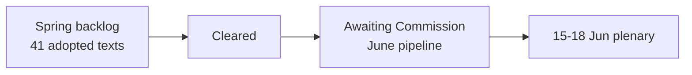

<!-- SPDX-FileCopyrightText: 2026 Hack23 AB -->
<!-- SPDX-License-Identifier: Apache-2.0 -->

# 🔁 Procedures Proxy — Legislative Throughput Indicator
## Window: 1–5 June 2026 | Produced: 2026-05-29

**Why this artifact exists:** `monitor_legislative_pipeline` returned `INSUFFICIENT_DATA` / `forecastBasis=NOT_APPLICABLE` (cold lifecycle cache) and the `/procedures` feed returned HTTP 404. In their absence we proxy legislative throughput from the **adopted-texts trail** (`get_adopted_texts(year=2026)`, 41 texts, Admiralty A2).

---

## 📊 Adopted-Texts Throughput, 2026 to date

| Cluster | Representative adopted texts (TA-10-2026-…) | Signal for the week ahead |
|---|---|---|
| Budget / fiscal | 0112 (2027 guidelines), Estimates FY2027, 0034 (ECB report), 0060 (ECB VP) | Pre-positioning for June draft 2027 budget |
| Trade / competitiveness | 0183 (AI for EU trade), 0096 (US-tariff customs), 0160 (DMA enforcement) | INTA/IMCO/ITRE active; competitiveness axis hot |
| External action | 0174 (Uzbekistan EPCA), 0177 (Lebanon-Eurojust), UNGA-81 (0182) | AFET/INTA treaty pipeline steady |
| Fisheries (SFPAs) | São Tomé (0178), Cook Islands (0179) | PECH routine-consent throughput healthy |
| Rule-of-law / immunity | immunity-waiver texts | JURI procedural baseline normal |

The adopted-texts cadence shows a Parliament that **cleared a substantial consent-and-resolution backlog in the April–May plenaries** and now enters a committee week with the next wave (notably the draft 2027 budget) still upstream in the Commission. This is the classic mid-cycle trough: high recent output, low imminent floor activity.

## 🧭 Throughput Interpretation

- **Recent velocity:** HIGH — 41 adopted texts year-to-date by late May implies the EP10 is operating at a brisk legislative tempo consistent with the first full year of a parliamentary term.
- **Imminent floor velocity (1–5 June):** ZERO — no plenary in the window; all throughput this week is committee-stage (amendments tabled, rapporteur drafts, opinion votes) and therefore invisible to the adopted-texts endpoint.
- **Forward velocity (15–18 June plenary):** rising — the 8 placeholder foreseen-activity items for MTG-PL-2026-06-15 confirm the next floor session is being assembled.

## ⚠️ Caveats

This proxy measures **completed** output, not **in-flight** procedures; it therefore understates committee-week activity by construction. Dwell-time and bottleneck metrics are unavailable this run. Confidence: 🟡 MEDIUM — the proxy is directionally sound (it correctly identifies a committee-week trough) but cannot quantify committee-stage throughput. Treat as a supporting indicator, not a primary forecast input.

## 📐 Methodological Note

In a healthy run, `monitor_legislative_pipeline` supplies per-procedure dwell times, a bottleneck index (procedures above the 95th-percentile dwell) and a `forecastBasis` discriminator. This run returned `NOT_APPLICABLE` because the lifecycle corpus cache was cold. The adopted-texts trail is the best available substitute because:

- it is sourced at A2 (official EP), the same grade as the calendar;
- it captures the *terminal* event of each completed procedure, giving an unambiguous throughput signal;
- it clusters cleanly by committee, allowing a qualitative read of where legislative energy has concentrated.

## 🔮 Forward Read

- **This week (1–5 Jun):** committee-stage work invisible to this proxy; expect zero new adopted texts.
- **Next plenary (15–18 Jun):** the adopted-texts count should step up as the assembled June agenda clears its votes.
- **Dominant upstream file:** the Commission's draft 2027 budget, expected in June, will become the single largest procedure entering the pipeline.

Confidence in the forward read: 🟡 MEDIUM — anchored on the confirmed calendar (A2) but contingent on an un-published committee and plenary agenda.

## 📊 Cluster Velocity Snapshot (2026 YTD adopted texts)

- Budget / fiscal: active, pre-positioning for June draft budget
- Trade / competitiveness: active, multiple high-profile texts
- External action / treaties: steady consent throughput
- Fisheries (SFPAs): routine, healthy
- Rule-of-law / immunity: baseline normal

**Net:** a Parliament that has cleared its spring backlog and now waits on the Commission's June pipeline.

