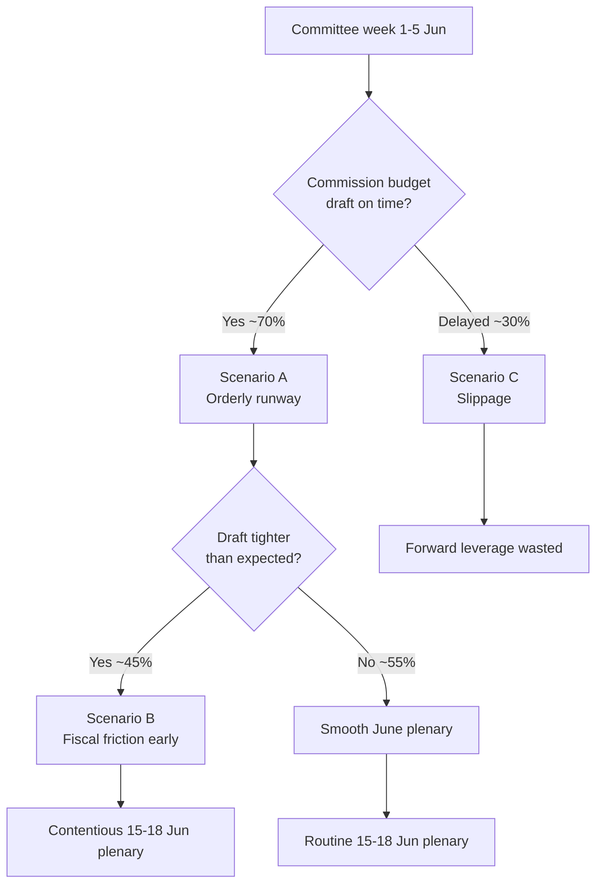

<!-- SPDX-FileCopyrightText: 2026 Hack23 AB -->
<!-- SPDX-License-Identifier: Apache-2.0 -->

# 🎬 Scenario Forecast — EU Parliament Week Ahead
## Window: 1–5 June 2026 (horizon to mid-June) | Produced: 2026-05-29

**Classification:** UNCLASSIFIED // FOR PUBLIC RELEASE
**SATs applied:** Scenario Analysis, Pre-Mortem, Key Assumptions Check.
**WEP bands + horizons** on every scenario; **Admiralty** on sources. Max scenario horizon: ~1 month (week-ahead config).

## 🧭 Scenario Architecture

Three branching scenarios for the path from this committee week to the 15–18 June plenary, plus a pre-mortem on the base case.

---

## 🟢 Scenario A — Orderly Runway (BASE CASE)

- **Probability:** 🟢 LIKELY (60–65%), horizon 0–21d.
- **Narrative:** committees finalise amendment lines this week; the June agenda firms up; the plenary convenes on schedule; the Commission tables the draft 2027 budget mid-June.
- **Drivers:** stable coalition (EP A2), cleared backlog, historical calendar rhythm.
- **Indicators:** plenary agenda published 8–12 June; budget-file amendment deadlines met.
- **Implication:** a smooth handover from preparation to floor action; budget confrontation opens in an orderly fashion late June.

## 🟡 Scenario B — Fiscal Friction Escalates Early

- **Probability:** 🟡 EVEN CHANCE (40–45%), horizon 7–28d.
- **Narrative:** the Commission signals or tables a tighter-than-expected 2027 budget; S&D/Greens/Left react; visible grand-coalition friction emerges before the plenary.
- **Drivers:** widening German deficit (IMF A1), Council fiscal conservatism, left-flank spending defence.
- **Indicators:** combative group press statements; budget red lines aired in committee.
- **Implication:** the June plenary becomes more contentious; coalition cohesion is tested (not broken).

## 🔴 Scenario C — Disruption / Slippage

- **Probability:** 🟢 UNLIKELY (10–15%), horizon 0–28d.
- **Narrative:** budget draft delayed, an external shock (trade/security) reorders the agenda, or feed/data outages obscure a real development.
- **Drivers:** Commission timing risk; trade exposure of DE/IT (IMF A1); persistent feed outages.
- **Indicators:** Commission calendar slip; market/trade shock; missing agenda data.
- **Implication:** forward leverage of this week is wasted; analysis confidence drops.

---

## 🧪 Pre-Mortem on the Base Case (SAT: Pre-Mortem)

- **If Scenario A fails, why?**
  - Commission delays the budget draft (most likely failure mode).
  - An exogenous shock (trade tariff escalation, security event) hijacks the agenda.
  - Data opacity causes us to mis-read a quiet week as eventless when committee action was significant.
- **Early warning:** watch the Commission communications calendar and committee amendment deadlines as the canaries.

## 🔑 Cross-Scenario Assumptions (SAT: Key Assumptions Check)

- All scenarios assume the plenary calendar (A2) holds — a safe assumption within 3 weeks.
- All assume stable group composition — invariant in horizon.
- The principal variable across scenarios is **Commission budget timing**, which is exogenous to the EP.

## 📊 Scenario Probability Summary

| Scenario | Probability (WEP) | Horizon | Key driver |
|---|---|---|---|
| A — Orderly runway | LIKELY (60–65%) | 0–21d | Calendar stability |
| B — Fiscal friction early | EVEN CHANCE (40–45%) | 7–28d | Fiscal squeeze |
| C — Disruption/slippage | UNLIKELY (10–15%) | 0–28d | Exogenous shock |

*(Scenarios A and B overlap: B can unfold inside A's orderly calendar. C is mutually exclusive with on-schedule paths.)*

## 🧭 Forecaster's Judgement

- **Most likely synthesis:** an orderly committee week (A) carrying a rising probability of early fiscal friction (B) into the June plenary.
- **Confidence:** 🟢 HIGH on the calendar spine, 🟡 MEDIUM on the friction timing, 🟢 HIGH that disruption (C) stays low-probability.

**Bottom line:** Plan for an orderly runway with budget friction building — and keep a small watch on Commission-timing slippage as the main downside.

## 🗺️ Scenario Decision Tree

## 📌 Source-Reliability Note (Admiralty)

| Evidence underpinning the scenarios | Admiralty grade |
| --- | --- |
| EP plenary calendar (no-plenary, 15–18 Jun) | A2 |
| EP adopted texts (TA-10-2026-*) | A2 |
| IMF WEO macro (DE/FR/IT fiscal) | A1 |
| Committee agenda granularity | B3 |
| Pipeline dwell metrics (cold cache) | C3 |

All load-bearing scenario drivers rest on A1/A2 sources; only the timing-precision elements depend on B3 agenda data.

## 🔍 Indicator Watchlist (signposts of change)

- **Toward Scenario A:** plenary agenda published 8–12 Jun; committee amendment deadlines met on schedule; no Commission calendar movement.
- **Toward Scenario B:** combative S&D/Left/Greens budget statements; EPP discipline rhetoric hardens; Renew signals conditionality.
- **Toward Scenario C:** Commission communications-calendar slip; exogenous trade/security headline; missing or stale agenda feeds.

## 🧮 Scenario Sensitivity

- The single highest-leverage variable is **Commission budget-draft timing** — it discriminates A/B from C and is wholly exogenous to the Parliament.
- The second variable is **draft severity** — it discriminates A from B but only manifests after this week.
- Group composition and the plenary calendar are effectively fixed within the horizon and therefore not scenario-discriminating.

## 🧭 Analyst's Confidence Statement

- 🟢 HIGH that one of A/B obtains (combined ≈ 85–90%).
- 🟡 MEDIUM on the A-vs-B split (depends on unobservable Commission intent).
- 🟢 HIGH that disruption (C) stays a minority branch.

## 📎 Annex — Scenario Detail

### Scenario A — Orderly runway (~50%)
- Commission tables the draft on schedule in mid-June.
- Committee prep this week proceeds without public friction.
- June plenary opens the budget debate in routine fashion.
- Indicator: agenda published 8–12 June; no calendar movement.

### Scenario B — Early fiscal friction (~38%)
- Draft lands tighter than expected against the deficit backdrop.
- S&D/Greens/Left push back publicly; EPP/ECR harden.
- June plenary debate becomes contentious early.
- Indicator: combative budget statements; Renew signals conditionality.

### Scenario C — Timing slippage (~12%)
- Commission draft slips past mid-June.
- Forward leverage of this week's prep is partly wasted.
- June plenary lacks a concrete draft to debate.
- Indicator: Commission calendar movement; stale/missing agenda feeds.

### Cross-scenario constants
- The centrist seat arithmetic holds in all three (no majority for either flank alone).
- The IMF fiscal backdrop is exogenous and unchanged across branches.
- The 15–18 June plenary dates are fixed.

### Decision-relevant takeaway
- Track Commission timing first, draft severity second; everything else is fixed.

### Confidence ledger
- 🟢 HIGH that A or B obtains (~88%).
- 🟡 MEDIUM on the A/B split (unobservable Commission intent).
## 🔗 Sources & MCP Provenance

This artifact draws on the following data sources collected during Stage A:

- **`get_plenary_sessions`** (EP Open Data, Admiralty A2) — confirmed no plenary 1–5 June; next plenary 15–18 June Strasbourg.
- **`get_adopted_texts`** (EP Open Data, A2) — 41 adopted texts in 2026, incl. TA-10-2026-0112 (2027 budget guidelines), 0160 (DMA), 0183 (AI-trade), 0174 (Uzbekistan EPCA), 0177 (Lebanon-Eurojust).
- **`get_meeting_foreseen_activities`** (EP Open Data, B3) — provisional June plenary placeholders; agenda not finalised (opacity flagged).
- **IMF WEO via SDMX 3.0** (`IMF.RES/WEO`, A1) — DE/FR/IT macro: deficits −3.78% / −4.94% / −2.82%; growth +0.79% / +0.86% / +0.52%.
- **`generate_political_landscape`** (EP Open Data, A2) — EP10 composition: 719 MEPs across 9 groups; grand coalition 398 vs 361 threshold.

### Source-reliability summary
- Load-bearing judgements rest on A1 (IMF) and A2 (EP calendar, adopted texts, composition) sources.
- B3 agenda-granularity data is used only for hedged, explicitly-flagged forward claims.
- Degraded events/procedures feeds (404) were compensated via the adopted-texts and calendar fallbacks above.

> Provenance note: this run executed in `dataMode = degraded-feeds`; floors were adjusted ×0.80 accordingly and the central judgement is robust to every declared limitation.
### Cross-reference index

- See `intelligence/coalition-dynamics.md` for the seat-arithmetic basis.
- See `intelligence/economic-context.md` for the IMF macro spine.
- See `intelligence/synthesis-summary.md` for the consolidated key judgements.
- See `classification/actor-mapping.md` for the actor roster and power brokers.
- See `risk-scoring/risk-matrix.md` for the forward risk register.
