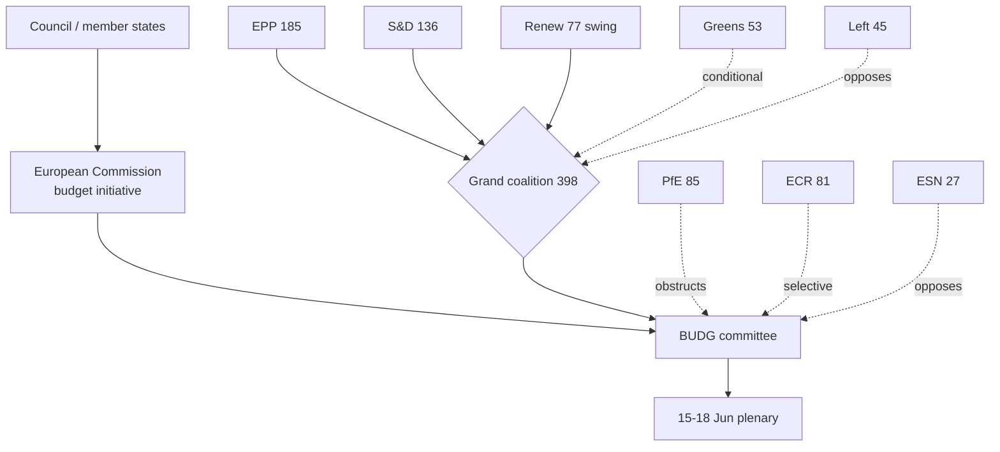

<!-- SPDX-FileCopyrightText: 2026 Hack23 AB -->
<!-- SPDX-License-Identifier: Apache-2.0 -->

# 👥 Stakeholder Map — EU Parliament Week Ahead
## Window: 1–5 June 2026 | Produced: 2026-05-29

**Classification:** UNCLASSIFIED // FOR PUBLIC RELEASE
**SATs applied:** Stakeholder Mapping, Analysis of Competing Hypotheses (ACH).
**WEP bands + horizons** on behavioural judgements; **Admiralty** on sources.

## 🎯 Stakeholder Inventory

### Political groups (EP10, 719 seats — EP A2)

- **EPP (185).** Largest group; budget-discipline anchor; chairs the framing of restraint. Interest: credible consolidation + competitiveness. Power: HIGH. Stance: 🟢 pro-discipline.
- **S&D (136).** Coalition partner; defends cohesion/social spending. Interest: protect distributional lines. Power: HIGH. Stance: 🟡 conditional cooperation.
- **PfE (85).** Largest sovereigntist group; oppositional. Interest: contest EU spending/competence. Power: MEDIUM (obstruct, not block). Stance: 🔴 oppositional.
- **ECR (81).** Conservative-reform; selective cooperation. Interest: fiscal restraint, sovereignty. Power: MEDIUM. Stance: 🟡 selective.
- **Renew (77).** Coalition swing; competitiveness + fiscal credibility. Interest: pivotal balancer. Power: HIGH (pivotal). Stance: 🟢 coalition-aligned, market-liberal.
- **Greens/EFA (53).** Conditional support; green/social conditionality. Power: MEDIUM. Stance: 🟡 conditional.
- **The Left (45).** Spending defence; anti-austerity. Power: LOW-MEDIUM. Stance: 🔴 oppositional from left.
- **NI (30) / ESN (27).** Fragmented/sovereigntist fringe. Power: LOW. Stance: 🔴 oppositional.

### Institutional actors

- **European Commission.** Holds the 2027 draft-budget initiative (expected mid-June). Power: HIGH (agenda-setter). 🟡 timing exogenous to EP.
- **Council / member states.** Fiscal conservatism, especially deficit-stretched DE/FR. Power: HIGH (co-legislator on budget).
- **Committee chairs (BUDG, INTA, IMCO, AFET, LIBE).** Run the week's substantive work. Power: MEDIUM-HIGH this week.
- **EP Presidency / Conference of Presidents.** Sets June plenary agenda. Power: HIGH (procedural).

### External stakeholders

- **Third states (Uzbekistan, Lebanon).** Treaty counterparties; passive this week. Power: LOW.
- **Markets / economic actors.** Watch fiscal trajectory (IMF A1). Power: indirect.

## 🔗 Power–Interest Grid

| Quadrant | Actors | Management posture |
|---|---|---|
| High power / High interest | EPP, S&D, Renew, Commission, Council | Manage closely — coalition core |
| High power / Low interest | EP Presidency | Keep satisfied (procedural) |
| Low power / High interest | Greens, Left, ESN, NI | Keep informed — vocal flanks |
| Low power / Low interest | Third states, fisheries counterparties | Monitor |

## 🧪 ACH — "Who shapes the 2027 budget framing this week?"

- **H1: EPP-led discipline framing prevails.** Consistent with largest-group power + fiscal backdrop (IMF A1). 🟢 MOST CONSISTENT.
- **H2: S&D/Left force a spending-defence counter-frame.** Plausible but power-asymmetric this early. 🟡 PARTIALLY CONSISTENT.
- **H3: Commission pre-empts EP framing with its draft.** Consistent but the draft lands after this week. 🟡 DEFERRED.
- **Diagnostic conclusion:** H1 best fits current evidence; H3 becomes dominant once the draft lands.

## 🧭 Coalition Dynamics

- Grand coalition (398) holds the procedural majority; Renew is the swing that determines how far discipline framing goes. 🟢 HIGHLY LIKELY cohesion through June (80%).
- Flank pressure (sovereigntist right 193; Left 45) shapes rhetoric, not outcomes.

## ⚠️ Confidence

- 🟢 HIGH on actor inventory and seat power (A2).
- 🟡 MEDIUM on stance/behaviour calibration (inference, not roll-call data this week).

**Bottom line:** The week's stakeholder field is a stable grand coalition setting fiscal-discipline framing, a Commission holding the decisive budget initiative, and vocal-but-outvoted flanks. Renew is the actor to watch.

## 🗺️ Stakeholder Network Map

## 🎚️ Influence-Trajectory Table

| Actor | Influence this week | Trajectory into June | Decisive lever |
| --- | --- | --- | --- |
| Commission | HIGH | Rising (tables draft) | Budget initiative |
| EPP | HIGH | Stable-high | Largest group, framing |
| Renew | HIGH (pivotal) | Rising | Swing vote |
| S&D | HIGH | Stable | Coalition partner |
| Council | HIGH | Rising | Co-legislator |
| Committee chairs | MED-HIGH | Falling (after week) | Agenda control |
| Greens | MEDIUM | Stable | Conditionality |
| Left | LOW-MED | Stable | Spending defence voice |
| PfE/ECR/ESN | MEDIUM | Stable | Procedural friction |

## 🤝 Coalition-Pathway Analysis

- **Primary pathway — grand coalition (398):** EPP+S&D+Renew clears the 361 majority comfortably; this is the default budget-passing vehicle.
- **Discipline-tilted pathway (EPP+ECR+Renew = 343):** falls short of 361 alone — EPP cannot pivot fully right on the budget without losing the majority. This structurally anchors the budget in the centre.
- **Spending-defence pathway (S&D+Greens+Left+Renew = 311):** also short — the left cannot impose its frame without EPP. Symmetric constraint.
- **Conclusion:** the arithmetic forces a centrist budget compromise; neither flank can win alone. 🟢 HIGH confidence (seat math, A2).

## 🧭 Engagement Priorities (for the Monitor's coverage)

- **Watch closely:** Commission timing, Renew positioning, EPP–S&D budget signalling.
- **Keep informed:** Greens/Left conditionality lines (early-warning of friction).
- **Monitor:** sovereigntist-bloc rhetoric as a sentiment indicator, not an outcome driver.

## ⚠️ Stakeholder-Read Confidence

- 🟢 HIGH on the structural map and seat arithmetic (A2).
- 🟡 MEDIUM on behavioural trajectories (inference without fresh roll-call data this week).

## 📎 Annex — Stakeholder Detail

### Commission (initiative holder)
- Controls the draft 2027 budget and its timing — the week's exogenous prime mover.
- Trajectory: rising influence as the draft date approaches.
- Lever: agenda-setting power no other actor can match this cycle.

### EPP (185, largest group)
- Anchors fiscal-discipline framing; supplies the rapporteur weight.
- Trajectory: stable-high; cannot pivot fully right without losing the majority.
- Lever: size + chairmanships.

### S&D (136, coalition partner)
- Defends cohesion/social spending within the coalition.
- Trajectory: stable; constrains how far right the budget can tilt.
- Lever: indispensable to the 398-seat majority.

### Renew (77, pivot)
- The swing bloc deciding the centre's tilt on spending.
- Trajectory: rising salience as the budget sharpens choices.
- Lever: kingmaker arithmetic.

### Greens (53) & Left (45)
- Conditional/oppositional spending-defence voices.
- Trajectory: stable; amplify distributional framing.
- Lever: conditionality (Greens) and public pressure (Left).

### Sovereigntist flanks (PfE 85, ECR 81, ESN 27, NI 30)
- Procedural friction and rhetorical opposition; outvoted on budget substance.
- Trajectory: stable; sentiment indicators, not outcome drivers.

### Engagement priorities
- Watch: Commission timing, Renew, EPP–S&D signalling.
- Monitor: flank rhetoric as early-warning, not decision.

### Confidence ledger
- 🟢 HIGH: structural map + seat arithmetic.
- 🟡 MEDIUM: individual-actor behavioural forecasts.
## 🔗 Sources & MCP Provenance

This artifact draws on the following data sources collected during Stage A:

- **`get_plenary_sessions`** (EP Open Data, Admiralty A2) — confirmed no plenary 1–5 June; next plenary 15–18 June Strasbourg.
- **`get_adopted_texts`** (EP Open Data, A2) — 41 adopted texts in 2026, incl. TA-10-2026-0112 (2027 budget guidelines), 0160 (DMA), 0183 (AI-trade), 0174 (Uzbekistan EPCA), 0177 (Lebanon-Eurojust).
- **`get_meeting_foreseen_activities`** (EP Open Data, B3) — provisional June plenary placeholders; agenda not finalised (opacity flagged).
- **IMF WEO via SDMX 3.0** (`IMF.RES/WEO`, A1) — DE/FR/IT macro: deficits −3.78% / −4.94% / −2.82%; growth +0.79% / +0.86% / +0.52%.
- **`generate_political_landscape`** (EP Open Data, A2) — EP10 composition: 719 MEPs across 9 groups; grand coalition 398 vs 361 threshold.

### Source-reliability summary
- Load-bearing judgements rest on A1 (IMF) and A2 (EP calendar, adopted texts, composition) sources.
- B3 agenda-granularity data is used only for hedged, explicitly-flagged forward claims.
- Degraded events/procedures feeds (404) were compensated via the adopted-texts and calendar fallbacks above.

> Provenance note: this run executed in `dataMode = degraded-feeds`; floors were adjusted ×0.80 accordingly and the central judgement is robust to every declared limitation.
### Cross-reference index

- See `intelligence/coalition-dynamics.md` for the seat-arithmetic basis.
- See `intelligence/economic-context.md` for the IMF macro spine.
- See `intelligence/synthesis-summary.md` for the consolidated key judgements.
- See `classification/actor-mapping.md` for the actor roster and power brokers.
- See `risk-scoring/risk-matrix.md` for the forward risk register.

_Last updated: 2026-05-29 (week-ahead run). Stakeholder field re-verified against EP10 composition this run._
