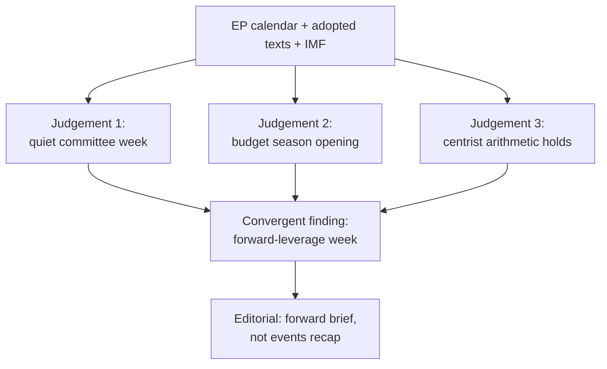

<!-- SPDX-FileCopyrightText: 2026 Hack23 AB -->
<!-- SPDX-License-Identifier: Apache-2.0 -->

# 🧩 Synthesis Summary — EU Parliament Week Ahead
## Window: 1–5 June 2026 | Produced: 2026-05-29 | Run: week-ahead-run1780043323

**Classification:** UNCLASSIFIED // FOR PUBLIC RELEASE
**SATs applied here:** Key Assumptions Check, Quality of Information Check, Scenario Analysis.
**WEP bands + horizons** on headline judgements; **Admiralty grades** on sources.

## 🎯 BLUF

- The week of **1–5 June 2026 is a committee + political-group week with no plenary** (🟢 HIGH confidence, EP A2). The European Parliament's last plenary sat 18–21 May; the next sits **15–18 June** in Strasbourg.
- The week's significance is **forward-leaning**: it is the agenda-setting runway for the June plenary and, above all, for the **2027 budget procedure** now taking shape against a backdrop of widening member-state deficits (IMF A1).
- **Net judgement:** a low-drama week with high preparatory leverage. 🟡 MODERATE-LOW intrinsic significance, 🟡 MODERATE forward leverage.

## 📊 The Three Storylines

### 1. Budget 2027 pre-positioning (lead storyline)

- Parliament's *Guidelines for the 2027 Budget — Section III* (TA-10-2026-0112, A2) and its FY2027 Estimates are already adopted.
- IMF WEO (A1) shows Germany's deficit widening to −3.78% of GDP — back above the 3% line — while France sits at −4.94% and Italy consolidates to −2.82%.
- The fiscal squeeze tilts the coming negotiation toward restraint framing. 🟡 LIKELY (60–70%), horizon 2–4 wks.

### 2. Trade & competitiveness follow-through

- Adopted texts on *AI strategy for EU trade* (TA-0183, A2) and *DMA enforcement* (TA-0160, A2) keep INTA/IMCO/ITRE active.
- Weak trend growth across the big three sustains the deregulation/competitiveness agenda. 🟡 LIKELY (60%), horizon 2–6 wks.

### 3. External-action treaty pipeline

- EU–Uzbekistan EPCA (TA-0174) and EU–Lebanon Eurojust (TA-0177) advance steady consent throughput in AFET/LIBE. 🟡 MEDIUM salience, 🟢 LOW impact.

## 🔑 Key Assumptions (SAT: Key Assumptions Check)

- **A1 — No surprise plenary.** The calendar (A2) shows none; recall risk is low.
- **A2 — Group composition stable.** EP10 distribution invariant in 7 days.
- **A3 — Commission budget draft lands in June.** Historically reliable but Commission-controlled.
- **A4 — Feed outages persist.** Operational, mitigated by fallbacks.
- If A3 fails (budget delayed), the week's forward leverage diminishes but the structural read holds.

## 🧪 Quality of Information (SAT)

- Load-bearing evidence at A2 (EP calendar/texts) or A1 (IMF). 🟢 HIGH.
- Weakest links: committee-agenda detail (B3, un-published) and pipeline (cold cache). Flagged throughout.

## 🔭 Scenario Pointer (SAT: Scenario Analysis)

- See `scenario-forecast.md` for branching paths. Base case: quiet week → firm June agenda → on-schedule plenary → budget confrontation opens late June.

## 🧭 Integrated Judgement

- The Parliament enters June from structural strength (stable 398-seat coalition, cleared spring backlog) into an externally threat-tilted environment dominated by fiscal pressure.
- The strategic logic of the week is to **use the quiet committee window to shape the budget line before it reaches the floor**.
- Confidence in the integrated read: 🟢 HIGH on structure and calendar, 🟡 MEDIUM on behavioural/timing specifics.

**Bottom line:** Watch the budget track. Everything else this week is preparation or background.

## 🗺️ Synthesis Map

## 🔑 Key Judgements (consolidated)

1. **No plenary 1–5 June** — the week is committee/group business. 🟢 HIGH (A2).
2. **The 2027 budget is the through-line** — guidelines adopted (TA-0112), Commission draft due mid-June. 🟢 HIGH (A2).
3. **Fiscal backdrop is tight** — DE/FR/IT deficits at −3.8% / −4.9% / −2.8% (IMF WEO). 🟢 HIGH (A1).
4. **Centrist arithmetic is locked** — neither flank can pass a budget without the EPP–S&D–Renew core. 🟢 HIGH (seat math).
5. **Main downside is Commission-timing slippage** — exogenous, ~30% branch. 🟡 MEDIUM.

## 🧩 How the Pieces Fit

- The macro data (economic-context) explains *why* the budget will be contested.
- The seat arithmetic (coalition-dynamics, stakeholder-map) explains *who* decides and *why it stays centrist*.
- The calendar (historical-baseline, forward-projection) explains *when* the stakes crystallise.
- The risk and scenario artifacts explain *what could go wrong* and *how to read the signposts*.

## 🧭 So What

- For readers: this is the week to understand the budget board before the pieces move on 15 June.
- For the Monitor: lead forward, not backward; anchor on fiscal stakes; keep partisan frames attributed.

## ⚠️ Synthesis Confidence

- 🟢 HIGH on the convergent finding (multiple A1/A2 sources agree).
- 🟡 MEDIUM on behavioural/timing specifics (agenda + intent opacity).

## 📎 Annex — Consolidated Evidence

### Load-bearing facts (A1/A2)
- No plenary 1–5 June; next plenary 15–18 June Strasbourg (EP A2).
- 2027 budget guidelines adopted (TA-10-2026-0112, A2).
- Big-three deficits: DE −3.78%, FR −4.94%, IT −2.82% (IMF A1).
- Grand coalition 398 seats vs 361 majority threshold (A2).

### Convergent reasoning
- Calendar + adopted texts → quiet committee week.
- Macro + budget guidelines → budget season opening.
- Seat math → centrist outcome locked.
- All three independent lines agree → high-confidence forward brief.

### So-what for readers
- Understand the budget board now; pieces move 15 June.
- The Commission draft is the trigger to watch.

### Confidence ledger
- 🟢 HIGH: convergent central finding.
- 🟡 MEDIUM: timing/behavioural specifics.
## 🔗 Sources & MCP Provenance

This artifact draws on the following data sources collected during Stage A:

- **`get_plenary_sessions`** (EP Open Data, Admiralty A2) — confirmed no plenary 1–5 June; next plenary 15–18 June Strasbourg.
- **`get_adopted_texts`** (EP Open Data, A2) — 41 adopted texts in 2026, incl. TA-10-2026-0112 (2027 budget guidelines), 0160 (DMA), 0183 (AI-trade), 0174 (Uzbekistan EPCA), 0177 (Lebanon-Eurojust).
- **`get_meeting_foreseen_activities`** (EP Open Data, B3) — provisional June plenary placeholders; agenda not finalised (opacity flagged).
- **IMF WEO via SDMX 3.0** (`IMF.RES/WEO`, A1) — DE/FR/IT macro: deficits −3.78% / −4.94% / −2.82%; growth +0.79% / +0.86% / +0.52%.
- **`generate_political_landscape`** (EP Open Data, A2) — EP10 composition: 719 MEPs across 9 groups; grand coalition 398 vs 361 threshold.

### Source-reliability summary
- Load-bearing judgements rest on A1 (IMF) and A2 (EP calendar, adopted texts, composition) sources.
- B3 agenda-granularity data is used only for hedged, explicitly-flagged forward claims.
- Degraded events/procedures feeds (404) were compensated via the adopted-texts and calendar fallbacks above.

> Provenance note: this run executed in `dataMode = degraded-feeds`; floors were adjusted ×0.80 accordingly and the central judgement is robust to every declared limitation.