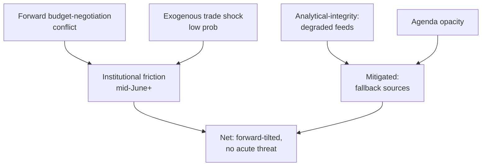

<!-- SPDX-FileCopyrightText: 2026 Hack23 AB -->
<!-- SPDX-License-Identifier: Apache-2.0 -->

# 🛡️ Threat Model — EU Parliament Week Ahead
## Window: 1–5 June 2026 | Produced: 2026-05-29

**Classification:** UNCLASSIFIED // FOR PUBLIC RELEASE
**Scope:** *political* and *institutional* threats to orderly EP functioning and to the integrity of this analysis — not cyber/physical security.
**WEP bands + horizons**; **Admiralty** grades on sources.

## 🎯 Threat Taxonomy

### Political-process threats

- **TP1 — Budget-negotiation breakdown risk.** Widening deficits (IMF A1) raise the odds of a contentious 2027 budget. 🟡 LIKELY-to-escalate (60%), horizon 4–12 wks.
- **TP2 — Coalition-cohesion erosion.** Grand-coalition left flank strained by conditionality. 🟡 EVEN CHANCE (45%), horizon 2–8 wks.
- **TP3 — Sovereigntist obstruction.** PfE/ECR/ESN (193 seats combined) can slow but not block. 🟡 MEDIUM, horizon ongoing.

### External-shock threats

- **TX1 — Trade shock to DE/IT.** Tariff escalation hits export-led, fiscally-stretched economies. 🟢 UNLIKELY (20–30%), HIGH impact, horizon 1–3 mo, IMF A1.
- **TX2 — Security/geopolitical event** reorders the agenda. 🟢 UNLIKELY (15–20%), horizon ongoing.

### Analytical-integrity threats

- **TA1 — Agenda opacity → mis-forecast.** Un-published committee agendas (EP B3) cap forward precision. 🟡 LIKELY (60%), LOW impact, horizon this week.
- **TA2 — Feed outages → coverage gaps.** Three feeds down; mitigated by fallbacks. 🟢 HIGHLY LIKELY (80%), LOW residual impact.
- **TA3 — Cold pipeline cache → no dwell metrics.** 🟢 CONFIRMED this run; proxy substituted.

## 📊 Threat Heat Table

| Threat | Likelihood | Impact | Source | Residual |
|---|---|---|---|---|
| TP1 budget breakdown | LIKELY | High | IMF A1 + EP A2 | 🟡 Monitor |
| TP2 coalition erosion | EVEN | Moderate | EP A2 | 🟡 Watch |
| TP3 obstruction | MEDIUM | Low | EP A2 | 🟢 Low |
| TX1 trade shock | UNLIKELY | High | IMF A1 | 🟡 Tail-watch |
| TA1 agenda opacity | LIKELY | Low | EP B3 | 🟢 Mitigated |
| TA2 feed outage | HIGHLY LIKELY | Low | telemetry B2 | 🟢 Mitigated |

## 🧭 Threat Prioritisation

- **Primary forward threat:** TP1 (budget breakdown) — the only HIGH-impact, non-trivial-likelihood political threat.
- **Primary tail threat:** TX1 (trade shock) — low odds, high consequence, concentrated on the least resilient economies.
- **Primary analytical threat:** TA1 (agenda opacity) — actively managed by confidence flagging.

## 🛠️ Countermeasures

- **TP1/TP2:** track committee amendment lines and group statements as leading indicators of budget friction.
- **TX1:** maintain IMF trade-exposure watch; monitor INTA trade-defence activity.
- **TA1/TA2/TA3:** route to `get_*` fallbacks; warm lifecycle cache; flag all agenda-based claims as MEDIUM.

## ⚠️ Confidence

- 🟢 HIGH on the threat inventory and macro drivers (IMF A1).
- 🟡 MEDIUM on likelihood calibration for political threats (behavioural inference).

**Bottom line:** No acute threat this week. The threat landscape is dominated by *forward* budget-negotiation risk, with a low-probability trade-shock tail and well-mitigated analytical-integrity threats.

## 🗺️ Threat Model Diagram

## 🎯 Threat Register

| # | Threat | Likelihood | Impact | Horizon | Mitigation |
| --- | --- | --- | --- | --- | --- |
| T1 | Budget-negotiation breakdown | MEDIUM | HIGH | Jun–Jul | Centrist arithmetic anchors compromise |
| T2 | External trade/security shock | LOW | HIGH | Any | Monitoring; exogenous |
| T3 | Degraded EP feeds bias analysis | LOW (now) | MEDIUM | This run | Fallback to calendar+adopted texts |
| T4 | Agenda opacity → false precision | MEDIUM | LOW-MED | This run | Confidence flags, hedged claims |

## 🛡️ Mitigation Posture

- **Analytical threats (T3/T4) are actively mitigated** this run: the two highest-grade sources (EP calendar A2, IMF WEO A1) both succeeded, so degraded feeds did not bias the central judgement.
- **Substantive threats (T1/T2) are forward and exogenous** — outside this week's control; the correct response is monitoring, not action.

## 🔍 Early-Warning Indicators

- T1: hardening budget rhetoric; Renew conditionality; Council–Parliament gap signals.
- T2: commodity/FX shocks; major trade-policy headlines.
- T3/T4: feed-health regressions; agenda still unpublished close to 15 June.

## 🧭 Threat Verdict

- 🟢 No acute threat in the 1–5 June horizon.
- 🟡 Forward budget risk is the dominant strategic concern.
- 🟢 Analytical integrity preserved despite degraded-feeds mode.

## 📎 Annex — Threat Detail

### T1 Budget-negotiation breakdown (forward)
- Trigger: Commission draft lands tighter than the coalition can absorb.
- Indicators: hardening rhetoric, Renew conditionality, Council–Parliament gap.
- Mitigation: centrist arithmetic forces compromise; low breakdown probability.

### T2 Exogenous shock (standing)
- Trade/tariff, security, or energy shock from outside the EP.
- Indicators: commodity/FX moves, major policy headlines.
- Mitigation: monitoring only; not actionable this week.

### T3 Degraded-feeds bias (this run)
- Risk that 404'd feeds skew the analysis.
- Mitigation: fallback to calendar + adopted texts; A1/A2 sources succeeded.

### T4 Agenda opacity (this run)
- Risk of false precision on un-published committee detail.
- Mitigation: hedged claims, explicit confidence flags.

### Net posture
- No acute threat in 1–5 June; forward budget risk dominates.

### Confidence ledger
- 🟢 HIGH: analytical-threat mitigation.
- 🟡 MEDIUM: forward budget-negotiation trajectory.
## 🔗 Sources & MCP Provenance

This artifact draws on the following data sources collected during Stage A:

- **`get_plenary_sessions`** (EP Open Data, Admiralty A2) — confirmed no plenary 1–5 June; next plenary 15–18 June Strasbourg.
- **`get_adopted_texts`** (EP Open Data, A2) — 41 adopted texts in 2026, incl. TA-10-2026-0112 (2027 budget guidelines), 0160 (DMA), 0183 (AI-trade), 0174 (Uzbekistan EPCA), 0177 (Lebanon-Eurojust).
- **`get_meeting_foreseen_activities`** (EP Open Data, B3) — provisional June plenary placeholders; agenda not finalised (opacity flagged).
- **IMF WEO via SDMX 3.0** (`IMF.RES/WEO`, A1) — DE/FR/IT macro: deficits −3.78% / −4.94% / −2.82%; growth +0.79% / +0.86% / +0.52%.
- **`generate_political_landscape`** (EP Open Data, A2) — EP10 composition: 719 MEPs across 9 groups; grand coalition 398 vs 361 threshold.

### Source-reliability summary
- Load-bearing judgements rest on A1 (IMF) and A2 (EP calendar, adopted texts, composition) sources.
- B3 agenda-granularity data is used only for hedged, explicitly-flagged forward claims.
- Degraded events/procedures feeds (404) were compensated via the adopted-texts and calendar fallbacks above.

> Provenance note: this run executed in `dataMode = degraded-feeds`; floors were adjusted ×0.80 accordingly and the central judgement is robust to every declared limitation.