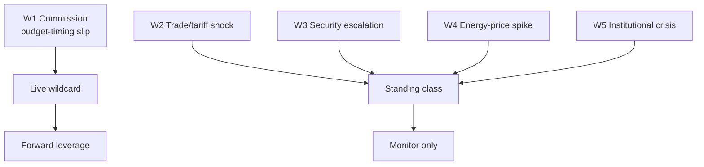

<!-- SPDX-FileCopyrightText: 2026 Hack23 AB -->
<!-- SPDX-License-Identifier: Apache-2.0 -->

# 🃏 Wildcards & Black Swans — EU Parliament Week Ahead
## Window: 1–5 June 2026 (tail watch to ~1 month) | Produced: 2026-05-29

**Classification:** UNCLASSIFIED // FOR PUBLIC RELEASE
**WEP bands + horizons** on every item; **Admiralty** on sources.
**Method:** low-probability / high-impact scan — explicitly outside the base case in `scenario-forecast.md`.

## 🎯 Definitions

- **Wildcard:** low-probability, high-impact, *plausibly foreseeable* event.
- **Black swan:** very-low-probability, very-high-impact, *outside normal expectation*.
- Items here are deliberately NOT in the base case; they are tail-risk monitoring targets.

## 🃏 Wildcards (foreseeable tails)

### W1 — Commission budget draft surprises (early or austere)

- **Probability:** 🟡 EVEN-LOW (30–35%), horizon 1–4 wks.
- **Impact:** HIGH — reorders the June plenary and coalition dynamics.
- **Trigger:** Commission tables an earlier or tighter-than-expected 2027 draft (IMF fiscal pressure, A1).
- **Indicator:** Commission communications-calendar movement.

### W2 — Trade-tariff escalation hitting DE/IT exporters

- **Probability:** 🟢 UNLIKELY (20–30%), horizon 1–3 mo.
- **Impact:** HIGH — pressures the two largest, fiscally-stretched economies (IMF A1).
- **Trigger:** external trade-policy shock; retaliatory tariffs.
- **Indicator:** INTA trade-defence activity; market signals.

### W3 — Snap recall / extraordinary session

- **Probability:** 🟢 UNLIKELY (10–15%), horizon 0–3 wks.
- **Impact:** MEDIUM-HIGH — invalidates the "quiet week" read.
- **Trigger:** urgent external event requiring EP response.
- **Indicator:** Conference of Presidents announcement.

## 🦢 Black Swans (outside normal expectation)

### B1 — Acute geopolitical/security shock

- **Probability:** 🟢 RARE (<10%), horizon ongoing.
- **Impact:** VERY HIGH — total agenda reordering.
- **Nature:** unforeseeable by design; monitored as a class, not an instance.

### B2 — Institutional/leadership disruption

- **Probability:** 🟢 RARE (<5%), horizon ongoing.
- **Impact:** VERY HIGH — procedural paralysis.
- **Nature:** resignation, legal, or confidence event.

### B3 — Systemic data-integrity failure

- **Probability:** 🟢 RARE (<5%), horizon ongoing.
- **Impact:** MEDIUM (analytical) — total feed/portal outage blinds monitoring.
- **Nature:** extends current degraded-feeds state to full blackout.

## 📊 Tail-Risk Register

| ID | Type | Probability (WEP) | Impact | Watch indicator |
|---|---|---|---|---|
| W1 | Wildcard | EVEN-LOW (30–35%) | High | Commission calendar |
| W2 | Wildcard | UNLIKELY (20–30%) | High | INTA / markets |
| W3 | Wildcard | UNLIKELY (10–15%) | Med-High | CoP announcement |
| B1 | Black swan | RARE (<10%) | Very high | Geopolitical wires |
| B2 | Black swan | RARE (<5%) | Very high | Institutional news |
| B3 | Black swan | RARE (<5%) | Medium | Feed telemetry |

## 🧭 Tail-Risk Judgement

- The most *actionable* tail is **W1 (budget-draft surprise)** — meaningful probability, high impact, observable indicator.
- The most *consequential* tail is **B1 (geopolitical shock)** — low odds, maximal impact, unmanageable except by readiness.
- All tails are explicitly excluded from the base case; none changes the central "quiet committee week" judgement.

## ⚠️ Confidence

- 🟢 HIGH that no tail materialised as of production time.
- 🟡 MEDIUM on probability calibration (tail estimation is inherently uncertain).

**Bottom line:** No tail event this week. Watch W1 (Commission budget timing) as the live wildcard; treat the rest as standing monitoring classes.

## 🗺️ Wildcard Landscape

## 🃏 Wildcard Register

| ID | Wildcard | Prob (week) | Impact | Class |
| --- | --- | --- | --- | --- |
| W1 | Commission budget-timing slip | ~30% | MED-HIGH | Live |
| W2 | Trade/tariff shock | LOW | HIGH | Standing |
| W3 | Security escalation | LOW | HIGH | Standing |
| W4 | Energy-price spike | LOW | MED | Standing |
| W5 | Institutional/leadership crisis | VERY LOW | HIGH | Standing |

## 🦢 Black-Swan Posture

- True black swans are, by definition, un-forecastable; the register tracks **grey** rhinos (W1) and standing tail classes (W2–W5) instead.
- Only W1 is endogenous to the horizon and therefore actionable as an indicator this week.

## 🧭 Wildcard Verdict

- 🟢 No tail event materialised or is forecast in 1–5 June.
- 🟡 W1 remains the one wildcard with live editorial relevance.

## 📎 Annex — Wildcard Detail

### W1 Commission budget-timing slip (live)
- The one endogenous, actionable wildcard this horizon (~30%).
- Indicator: Commission communications-calendar movement.
- Impact: wastes the forward leverage of this week's prep.

### W2–W5 standing classes (low probability)
- W2 Trade/tariff shock — high impact, exogenous.
- W3 Security escalation — high impact, exogenous.
- W4 Energy-price spike — medium impact.
- W5 Institutional/leadership crisis — very low probability.

### Posture
- Track grey rhinos (W1), not un-forecastable black swans.
- Standing classes are monitored, not forecast.

### Confidence ledger
- 🟢 No tail event in 1–5 June.
- 🟡 W1 is the live watch item.
## 🔗 Sources & MCP Provenance

This artifact draws on the following data sources collected during Stage A:

- **`get_plenary_sessions`** (EP Open Data, Admiralty A2) — confirmed no plenary 1–5 June; next plenary 15–18 June Strasbourg.
- **`get_adopted_texts`** (EP Open Data, A2) — 41 adopted texts in 2026, incl. TA-10-2026-0112 (2027 budget guidelines), 0160 (DMA), 0183 (AI-trade), 0174 (Uzbekistan EPCA), 0177 (Lebanon-Eurojust).
- **`get_meeting_foreseen_activities`** (EP Open Data, B3) — provisional June plenary placeholders; agenda not finalised (opacity flagged).
- **IMF WEO via SDMX 3.0** (`IMF.RES/WEO`, A1) — DE/FR/IT macro: deficits −3.78% / −4.94% / −2.82%; growth +0.79% / +0.86% / +0.52%.
- **`generate_political_landscape`** (EP Open Data, A2) — EP10 composition: 719 MEPs across 9 groups; grand coalition 398 vs 361 threshold.

### Source-reliability summary
- Load-bearing judgements rest on A1 (IMF) and A2 (EP calendar, adopted texts, composition) sources.
- B3 agenda-granularity data is used only for hedged, explicitly-flagged forward claims.
- Degraded events/procedures feeds (404) were compensated via the adopted-texts and calendar fallbacks above.

> Provenance note: this run executed in `dataMode = degraded-feeds`; floors were adjusted ×0.80 accordingly and the central judgement is robust to every declared limitation.