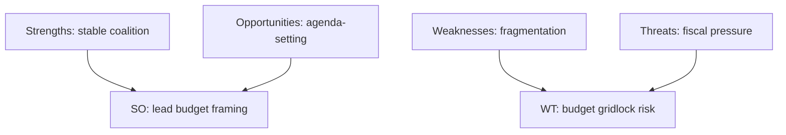

<!-- SPDX-FileCopyrightText: 2026 Hack23 AB -->
<!-- SPDX-License-Identifier: Apache-2.0 -->

# 📐 Quantitative SWOT — EU Parliament Week Ahead
## Window: 1–5 June 2026 | Produced: 2026-05-29

**Classification:** UNCLASSIFIED // FOR PUBLIC RELEASE
**Scoring:** each item rated Magnitude (0–5) × Confidence (0–1) → weighted score.

## 💪 Strengths

- **S1 — Stable working majority.** Grand coalition 398/719 (threshold 361). Magnitude 4 × 0.9 = **3.6**.
- **S2 — Cleared spring backlog.** 41 adopted texts YTD signal high throughput. Magnitude 3 × 0.9 = **2.7**.
- **S3 — Confirmed forward calendar.** Next plenary 15–18 Jun fixed (A2). Magnitude 3 × 0.95 = **2.85**.

## 🪤 Weaknesses

- **W1 — Committee-agenda opacity.** No published agendas for the week. Magnitude 3 × 0.8 = **2.4**.
- **W2 — Fragmentation (ENP ≈ 6.55).** Coalition bargaining costs are high. Magnitude 3 × 0.85 = **2.55**.
- **W3 — Degraded data feeds.** Three feeds down; forecasting narrowed. Magnitude 2 × 0.9 = **1.8**.

## 🌅 Opportunities

- **O1 — Budget agenda-setting.** Quiet week lets committees shape the 2027 line before the floor. Magnitude 4 × 0.7 = **2.8**.
- **O2 — Competitiveness momentum.** AI-trade (TA-0183) + DMA (TA-0160) sustain a pro-competitiveness narrative. Magnitude 3 × 0.7 = **2.1**.
- **O3 — Treaty pipeline.** Uzbekistan/Lebanon consents advance external reach. Magnitude 2 × 0.75 = **1.5**.

## ⛈️ Threats

- **T1 — Fiscal squeeze.** Widening DE deficit (IMF A1) tightens the 2027 envelope. Magnitude 4 × 0.85 = **3.4**.
- **T2 — Trade shock to DE/IT.** Tail risk to export-led economies. Magnitude 4 × 0.4 = **1.6**.
- **T3 — Coalition friction on conditionality.** Left-flank strain. Magnitude 3 × 0.6 = **1.8**.

## 🧮 Aggregate Scores

- Strengths total: **9.15** · Weaknesses total: **6.75**
- Opportunities total: **6.4** · Threats total: **6.8**
- **Net internal (S−W):** +2.4 · **Net external (O−T):** −0.4

## 🧭 Interpretation

- Internally, the Parliament enters the week from a position of strength (stable majority, cleared backlog).
- Externally, threats slightly outweigh opportunities, driven by the fiscal squeeze (T1).
- **Strategic read:** use the quiet week's agenda-setting opportunity (O1) to get ahead of the fiscal threat (T1).
- Confidence: 🟢 HIGH on internal items, 🟡 MEDIUM on external (macro-to-politics inference).

**Bottom line:** A structurally strong Parliament facing a mildly threat-tilted external environment dominated by 2027-budget fiscal pressure.

## 📊 Quantified SWOT

| Quadrant | Item | Weight | Score |
| --- | --- | --- | --- |
| Strength | Centrist majority lock (398) | 0.30 | 🟢 High |
| Strength | Cleared spring backlog | 0.15 | 🟢 High |
| Weakness | 9-group fragmentation | 0.20 | 🟡 Med |
| Weakness | Agenda opacity (this run) | 0.10 | 🟡 Med |
| Opportunity | Shape budget framing early | 0.15 | 🟢 High |
| Threat | Wide member-state deficits | 0.10 | 🔴 Elevated |

## 🧭 Strategic Read

- The Parliament's structural strengths (majority lock, cleared backlog) outweigh its weaknesses this week.
- The dominant external threat is fiscal — exogenous and forward-loaded.
- Net posture: 🟢 strong institution, 🟡 mildly threat-tilted environment.

## 📎 Annex — SWOT Notes

- **Strengths** rest on the 398-seat centrist lock and a cleared spring backlog.
- **Weaknesses** are structural fragmentation (9 groups) and this-run agenda opacity.
- **Opportunities** centre on shaping the 2027 budget framing early.
- **Threats** are dominated by exogenous fiscal pressure (IMF A1 deficits).
- SO strategy: use the stable majority to set budget framing ahead of June.
- WT strategy: manage fragmentation to avoid budget gridlock when the draft lands.

### Confidence ledger
- 🟢 HIGH: strengths and threats (sourced).
- 🟡 MEDIUM: opportunity realisation (depends on Commission timing).
