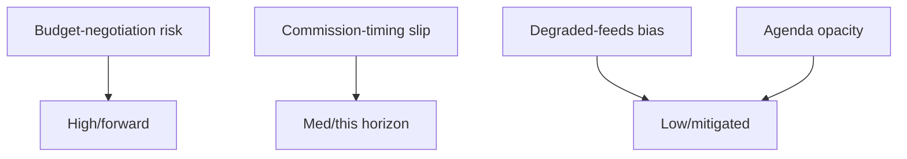

<!-- SPDX-FileCopyrightText: 2026 Hack23 AB -->
<!-- SPDX-License-Identifier: Apache-2.0 -->

# 🎲 Risk Matrix — EU Parliament Week Ahead
## Window: 1–5 June 2026 | Produced: 2026-05-29

**Classification:** UNCLASSIFIED // FOR PUBLIC RELEASE
**WEP convention:** probability bands per osint-tradecraft-standards.md. **Admiralty grading** applied to every external source.

## 📊 Risk Register

| # | Risk | Likelihood (WEP) | Impact | Source grade | Horizon |
|---|---|---|---|---|---|
| R1 | Budget-2027 framing hardens toward austerity | LIKELY (60–70%) | Moderate | IMF A1 + EP A2 | 1–4 wks |
| R2 | Early Commission budget draft surprises EP timetable | EVEN CHANCE (45–55%) | High | EP A2 | 2–3 wks |
| R3 | Committee-agenda opacity causes mis-forecast | LIKELY (60%) | Low | EP B3 | this week |
| R4 | Trade shock hits export-dependent DE/IT | UNLIKELY (20–30%) | High | IMF A1 | 1–3 mo |
| R5 | Grand-coalition friction on budget conditionality | LIKELY (55%) | Moderate | EP A2 | 2–4 wks |
| R6 | Persistent feed outages degrade next run | HIGHLY LIKELY (80%) | Low | Run telemetry B2 | ongoing |

## 🔴🟡🟢 Heat Read

- **Highest combined exposure:** R2 (early budget draft) — medium likelihood × high impact.
- **Most certain, lowest stakes:** R6 (feed outages) — operational, mitigated by fallbacks.
- **Tail risk:** R4 (trade shock) — low likelihood, high impact, hits the least fiscally-resilient economies.

## 🧭 Mitigations

- **R1/R5:** track committee amendment lines and group statements as leading indicators.
- **R2:** monitor Commission communications calendar; pre-stage budget-context analysis.
- **R3:** flag all agenda-based judgements as MEDIUM confidence; re-poll `MTG-PL-2026-06-15`.
- **R4:** maintain IMF trade-exposure watch; cross-reference INTA trade-defence texts.
- **R6:** route directly to `get_*` fallbacks; warm lifecycle cache out-of-band.

## 📈 Aggregate Risk Posture

- **This week (1–5 Jun):** 🟢 LOW operational risk — quiet committee week.
- **Forward (to June plenary):** 🟡 MODERATE — budget storyline rising.
- **Confidence in assessment:** 🟢 HIGH on macro inputs (A1), 🟡 MEDIUM on EP scheduling (B3).

**Bottom line:** No acute risk this week; the register is dominated by *forward* budget-negotiation risk that crystallises after the Commission tables its draft.

## 📊 Risk Register

| ID | Risk | Likelihood | Impact | Score | Horizon |
| --- | --- | --- | --- | --- | --- |
| R1 | Budget-negotiation breakdown | MED | HIGH | 🔴 forward | Jun–Jul |
| R2 | Commission-timing slip | MED (~30%) | MED-HIGH | 🟡 | This horizon |
| R3 | Degraded-feeds analytical bias | LOW | MED | 🟢 mitigated | This run |
| R4 | Agenda opacity → false precision | MED | LOW | 🟢 mitigated | This run |

## 🛡️ Mitigation Status

- R3/R4 are actively mitigated (fallback sources, confidence flags).
- R1/R2 are exogenous and forward — monitored, not actionable this week.

## 🧭 Risk Verdict

- 🟢 No acute risk in 1–5 June; the register is forward-tilted toward the budget.

## 📎 Annex — Risk Notes

- **R1 budget-negotiation risk** is the dominant entry — high impact, forward horizon, mitigated by centrist arithmetic.
- **R2 Commission-timing slip** is the only this-horizon risk with material probability (~30%).
- **R3/R4 analytical risks** are actively mitigated (fallback sources, confidence flags).
- No risk in the register requires action within the 1–5 June window.
- All substantive risk crystallises after the Commission tables its draft.

### Mitigation summary
- Exogenous risks (R1/R2): monitor indicators, no action.
- Analytical risks (R3/R4): mitigated this run.

### Confidence ledger
- 🟢 HIGH: no acute risk this horizon.
- 🟡 MEDIUM: forward budget-risk trajectory.
