# Year Ahead — 2026-05-30

<h2 id="section-executive-brief">Executive Brief</h2>

### 🎯 BLUF (Bottom Line Up Front)

The European Parliament enters the second half of its EP10 term (2024–2029) as a structurally stable
but politically congested institution, where the centrist grand coalition (EPP–S&D–Renew, ~401 of 720
seats) still owns the institutional and budgetary machinery, yet the EPP increasingly assembles ad-hoc
right-leaning majorities (EPP+ECR+PfE) on migration, deregulation and agriculture. Over the year ahead
the dominant battleground is fiscal: the **post-2027 Multiannual Financial Framework (MFF)** opens in
earnest, pitting net contributors against cohesion and farm beneficiaries while three large economies run
constrained budgets — IMF projects a German general-government deficit of **-3.78% of GDP in 2026**
widening to **-4.23% in 2027**, France at **-4.94% of GDP in 2026**, and Italy at **-2.82% in 2026**.
Growth offers no relief: IMF puts German real GDP growth at **0.79% in 2026** and French growth at
**0.86% in 2026**, leaving little fiscal headroom for the defence-readiness, enlargement and Ukraine-support
commitments stacking up on the agenda. It is **Likely** that the year is defined less by dramatic ruptures
than by attritional coalition arithmetic around money, trade (Mercosur) and the green-versus-competitiveness
"omnibus" deregulation drive.

**One-line judgement:** A functional but fragmented Parliament will spend the year negotiating *who pays*
for defence, enlargement and the green transition — and the centre will hold, narrowly, on the files that
matter most. 🟡 MEDIUM.

---

### 📊 Top 5 Judgements for the Year Ahead (ICD 203 / WEP-banded)

| # | Judgement | WEP band | Confidence |
|---|-----------|----------|-----------|
| 1 | The EPP–S&D–Renew grand coalition retains control of institutional and MFF files; no successful censure of the von der Leyen II Commission | **Likely** (≈70%) | 🟢 HIGH |
| 2 | The EPP assembles at least three ad-hoc right-leaning majorities (EPP+ECR+PfE) on migration, environment rollback or agriculture during the horizon | **Highly Likely** (≈80%) | 🟢 HIGH |
| 3 | MFF post-2027 talks open but reach no headline agreement within the horizon; 2027 annual budget consumes the autumn 2026 plenary cycle | **Likely** (≈65%) | 🟡 MEDIUM |
| 4 | EU–Mercosur ratification remains contested and unresolved this horizon, with France/Poland/Ireland farm resistance forcing safeguard concessions | **Roughly Even** (≈50%) | 🟡 MEDIUM |
| 5 | Far-right consolidation (PfE/ECR/ESN) advances incrementally via NI defections and national wins but does not reach a legislative blocking pivot on core EU files | **Likely** (≈60%) | 🟡 MEDIUM |

Tail judgement (monitored, not forecast): a transatlantic shock — US tariff escalation or NATO-commitment
wobble — forcing emergency defence-financing legislation is **Unlikely** but high-impact (🔴 LOW probability,
HIGH consequence).

---

### 🔢 Key Numbers (cite-ready)

**Economic context — IMF WEO (live SDMX, vintage 2025-09-23; IMF is the sole authority for all economic series):**

| Series | Germany | France | Italy |
|--------|---------|--------|-------|
| Real GDP growth 2026 (IMF) | 0.79% | 0.86% | 0.52% |
| Real GDP growth 2027 (IMF) | 1.18% | 0.88% | 0.50% |
| Avg CPI inflation 2026 (IMF) | 2.65% | 1.84% | 2.64% |
| Govt fiscal balance 2026 (IMF, % GDP) | -3.78% | -4.94% | -2.82% |
| Govt fiscal balance 2027 (IMF, % GDP) | -4.23% | -4.79% | -2.58% |

- IMF projects German real GDP growth of **0.79% in 2026**, rising to **1.18% in 2027** — a fragile,
  sub-1% recovery that constrains net-contributor generosity in MFF talks.
- France's fiscal deficit of **-4.94% of GDP in 2026 (IMF WEO)** keeps Paris in excessive-deficit
  territory and limits its room to underwrite new EU spending.
- Italian inflation of **2.64% in 2026 (IMF)** sits above the German number despite weaker Italian growth
  of **0.52% in 2026**, sharpening the north–south fiscal argument.

**Parliamentary structure (EP10, 720 seats):** EPP ~188 (largest) · S&D ~136 · PfE ~84 · ECR ~78 ·
RE/Renew ~77 · Greens/EFA ~53 · The Left ~46 · ESN ~25 · NI ~33. Absolute-majority threshold: 361.
Grand coalition (EPP+S&D+Renew) ≈ 401 seats.

**Legislative substance this run:** 51 adopted texts retrieved for 2026 (primary evidence base);
forward feeds (`/procedures-feed`, `/events-feed`, `/documents-feed`) returned **HTTP 404**.

---

### 🧭 Source Reliability (Admiralty-graded)

| Source / evidence | Admiralty grade | Reliability note |
|-------------------|-----------------|------------------|
| EP Open Data `/adopted-texts` 2026 (51 texts) | **A1** | Official primary feed; confirmed substance |
| IMF SDMX WEO (live, vintage 2025-09-23) | **A1** | Authoritative economic; sole economic authority |
| EP10 structural seat counts | **B2** | Established public record |
| `compare_political_groups` partial (PfE=85, ECR=81, ESN=27) | **C3** | Partial/degraded feed this run |
| Council presidency trio (Cyprus→Ireland→Lithuania→Greece) | **C3** | 🟡 Unverified this run |
| Forward feeds (404 outage) | **F6** | Cannot be judged; documented in mcp-reliability-audit |

Overall brief reliability grade: **B2** — anchored on A1 primary substance and A1 economics, with
forward-looking judgements degrading to C3/D3 at the 12-month horizon.

---

### ⚡ Key Political Risks (Next 12 Months)

| Risk | WEP band | Impact | Horizon |
|------|----------|--------|---------|
| MFF post-2027 opening hardens net-contributor vs cohesion split, stalling other files | **Likely** | HIGH | Q4 2026 – Q2 2027 |
| CAP post-2027 reform + farmer protests reignite, forcing agriculture concessions | **Likely** | HIGH | Q3 2026 onward |
| Mercosur ratification collapses or is indefinitely deferred after CJEU opinion | **Roughly Even** | HIGH | H1 2027 |
| 2027 annual budget brinkmanship risks provisional twelfths | **Unlikely** | CRITICAL | Q4 2026 |
| Far-right bloc gains a pivotal NI defection wave, raising blocking leverage | **Roughly Even** | MEDIUM | Ongoing |
| Transatlantic tariff/defence shock forces emergency legislation | **Unlikely** | HIGH | Wildcard |
| Greens/EFA cohesion strains under climate-vs-industry omnibus pressure | **Roughly Even** | MEDIUM | Q4 2026 |

---

### 🗓️ Legislative Calendar Signposts (2026–2027)

| Period | Expected event | Political significance |
|--------|----------------|------------------------|
| Jun 2026 | Strasbourg plenary; pre-recess clearance | Rapporteur consolidation; omnibus deregulation files advance |
| Jul–Aug 2026 | Summer recess | Council presidency handover (Cyprus → Ireland, 🟡 C3 unverified) |
| Sep 2026 | Autumn plenary opens | MFF post-2027 framing; 2027 budget first reading begins |
| Oct–Nov 2026 | 2027 budget readings | High-stakes cross-group votes; defence/cohesion line items |
| Dec 2026 | Year-end plenary | Budget conciliation outcome; enlargement chapter stocktake |
| Jan–Mar 2027 | Mid-term EP10 positioning | 2029-election posturing begins; Mercosur/CJEU pressure point |
| Apr–May 2027 | Spring sprint | Stalled-directive clearance; MFF negotiation intensifies |

Caveat: `get_plenary_sessions` (forward window) returned **0 forward sittings** this run; calendar
signposts are derived from EP10 structural cadence, not published forward sittings. 🟡 MEDIUM.

---

### 🏛️ Institutional Configuration

- **Parliament:** 720 MEPs | 8 political groups + NI | 27 member states
- **President:** Roberta Metsola (EPP) | **Commission:** von der Leyen II
- **Absolute-majority threshold:** 361 votes
- **Grand coalition (EPP+S&D+Renew):** ≈401 seats — workable on institutional/budget files
- **Right-leaning ad-hoc majority (EPP+ECR+PfE):** ≈350 seats — pivotal on migration/environment/agriculture
- **Council presidency trio (🟡 C3):** Cyprus H1-2026 → Ireland H2-2026 → Lithuania H1-2027 → Greece H2-2027
- **parliamentaryBalance index (partial feed):** 0.61 (C3 — partial `compare_political_groups`)

---

### 🔭 What to Watch (12-month signpost shortlist)

1. **MFF opening shots** — the Commission's MFF post-2027 framing and the first net-contributor pushback;
   it is **Highly Likely** to dominate the autumn cycle.
2. **CAP post-2027 + farm protests** — a recurrence of 2024-style mobilisation is **Likely** and would
   reshape EPP's right-leaning coalition calculus.
3. **Mercosur / CJEU opinion** — the agricultural-safeguards fight is **Roughly Even** to derail or defer
   ratification within the horizon.
4. **Defence financing / "readiness 2030"** — EU-bond and joint-procurement proposals; movement is
   **Likely** but headline agreement is **Unlikely** this horizon.
5. **Enlargement momentum (Ukraine, Moldova, Western Balkans)** — accession-chapter openings face
   unanimity blocks; visible progress is **Roughly Even**.
6. **Digital enforcement (DMA/DSA/AI Act)** — gatekeeper cases and AI-Act implementation continue;
   sustained enforcement pressure is **Highly Likely**.
7. **Far-right arithmetic** — NI defections and national elections feeding PfE/ECR/ESN; an incremental
   gain is **Likely**, a blocking pivot **Unlikely**.
8. **Ukraine macro-financial support** — the immobilised-Russian-assets loan framing; continued
   cross-party backing is **Highly Likely** but procedurally contested.

---

### 🌍 Three Forces, One Equilibrium

A force-field reading of the year ahead locates the equilibrium in attrition rather than rupture. The
**driving forces** — defence-readiness urgency, enlargement momentum (Ukraine, Moldova, Western Balkans),
and the competitiveness/"omnibus" deregulation agenda — all push the Parliament toward bigger spending and
faster decisions. The **restraining forces** — constrained national budgets (IMF deficits above 3% of GDP
across the big three, France at **-4.94% of GDP in 2026**), farm and cohesion resistance, and Council
unanimity blocks — pull the other way. Where these balance is the year's central truth: **movement on
instruments, stalemate on headline numbers.** It is **Likely** that defence-financing instruments advance
while joint EU bonds stall; **Likely** that the MFF opens but does not close; and **Roughly Even** that
enlargement clusters open against unanimity resistance.

The far-right variable sits across all three forces. PfE (~84), ECR (~78) and ESN (~25) together command
roughly 187 seats — enough to extract concessions on migration and agriculture, not enough to govern the
institution. The partial `compare_political_groups` feed (PfE=85, ECR=81, ESN=27; parliamentaryBalance
0.61, C3) is consistent with that reading. Their leverage grows incrementally through NI defections and
national-election wins, but a legislative blocking pivot on core EU files remains **Unlikely** within the
horizon.

---

### 🧩 Strategic Read

The year ahead is a **money-and-trade year**, not a constitutional one. The three structural facts that
shape every vote are: (1) the EPP's 188-seat primacy without a majority, forcing perpetual dealmaking;
(2) constrained national fiscal positions — no large member state has comfortable headroom, with France
at **-4.94% of GDP (IMF, 2026)** and Germany's deficit widening to **-4.23% in 2027 (IMF)**; and (3) a
far-right bloc large enough to extract concessions on migration and agriculture but not yet large enough
to govern the institution. Expect the centre to hold on institutional and budget files (**Likely**, 🟢/🟡),
the right to win selectively on deregulation and migration (**Highly Likely**, 🟢), and the genuinely
open questions — Mercosur, MFF size, enlargement pace — to remain **Roughly Even** and unresolved as the
Parliament edges toward its 2027 mid-term and the long shadow of the 2029 election.

---

*BLUF restated: a fragmented-but-functional Parliament negotiates the price of defence, enlargement and the
green transition. Centre holds on budgets; right wins selectively on migration and deregulation; Ukraine
support endures. IMF context — sub-1% German growth (0.79% in 2026) and deficits above 3% across the big
three — is the gravitational field bending every fiscal judgement this year. Overall confidence 🟡 MEDIUM;
source reliability B2; degraded-feeds run with floors reduced ×0.80.*

<h2 id="reader-intelligence-guide">Reader Intelligence Guide</h2>

Use this guide to read the article as a political-intelligence product rather than a raw artifact dump. High-value reader lenses appear first; technical provenance remains available in the audit appendices.

| Reader need | What you'll get | Source artifact |
|---|---|---|
| [BLUF and editorial decisions](#section-executive-brief) | fast answer to what happened, why it matters, who is accountable, and the next dated trigger | `executive-brief.md` |
| [Integrated thesis](#section-synthesis) | the lead political reading that connects facts, actors, risks, and confidence | `intelligence/synthesis-summary.md` |
| [Significance scoring](#section-significance) | why this story outranks or trails other same-day European Parliament signals | `classification/significance-classification.md` |
| [Actors and forces](#section-actors-forces) | who is driving the story, what political forces line up behind them, and which institutional levers they can pull | `classification/actor-mapping.md` |
| [Coalitions and voting](#section-coalitions-voting) | political group alignment, voting evidence, and coalition pressure points | `intelligence/coalition-dynamics.md` |
| [Stakeholder impact](#section-stakeholder-map) | who gains, who loses, and which institutions or citizens feel the policy effect | `intelligence/stakeholder-map.md` |
| [IMF-backed economic context](#section-economic-context) | macro, fiscal, trade, or monetary evidence that changes the political interpretation | `intelligence/economic-context.md` |
| [Risk assessment](#section-risk) | policy, institutional, coalition, communications, and implementation risk register | `risk-scoring/risk-matrix.md` |
| [Threat landscape](#section-threat) | hostile actors, attack vectors, consequence trees, and legislative-disruption pathways | `intelligence/threat-model.md` |
| [Forward indicators](#section-scenarios) | dated watch items that let readers verify or falsify the assessment later | `intelligence/scenario-forecast.md` |
| [What to watch](#section-forward-projection) | dated trigger events, calendar dependencies, and legislative-pipeline forecasts | `intelligence/forward-projection.md` |
| [Electoral arc and mandate](#section-electoral-arc) | where the story sits in the EP term, mandate fulfilment, seat projection, and presidency-trio context | `intelligence/presidency-trio-context.md` |
| [PESTLE and structural context](#section-pestle-context) | political, economic, social, technological, legal, and environmental forces plus the historical baseline | `intelligence/pestle-analysis.md` |
| [Extended intelligence](#section-extended-intel) | devil's-advocate critique, comparative parallels, historical precedents, and media framing | `extended/media-framing-analysis.md` |
| [MCP data reliability](#section-mcp-reliability) | which feeds were healthy, which were degraded, and how data limits bound conclusions | `intelligence/mcp-reliability-audit.md` |
| [Analytical quality and reflection](#section-quality-reflection) | self-assessment scores, methodology audit, structured analytic techniques, and known limitations | `intelligence/analysis-index.md` |
| [Supplementary intelligence](#section-supplementary-intelligence) | additional markdown discovered in the run that has not yet been assigned to a canonical section | `data-availability-assessment.md` |

<h2 id="section-key-takeaways">Key Takeaways</h2>

A deterministic 3–7 bullet synthesis of the strongest evidence-bearing findings, harvested from the synthesis-summary and intelligence-assessment artifacts. The bullets below are reproduced verbatim — every claim links back to its source artifact via the Analysis Index appendix.

- ✅ Active substantive agenda (banking union, digital enforcement, defence, Ukraine)
- ✅ Stable centrist arithmetic for institutional files
- ⚠️ MFF/CAP fiscal contest with no near-term resolution
- ⚠️ Mercosur and migration files exposed to ad-hoc right majorities
- ⚠️ Forward plenary calendar not yet published (`get_plenary_sessions` empty)
- **A1 — EPP cohesion holds.** The EPP votes as a bloc on institutional files. If it fractured internally (eastern vs western wing on Ukraine; economic vs values wing on environment), the dual-majority model breaks. 🟢 HIGH that it holds.
- **A2 — No recession in the core.** IMF's positive (if anaemic) growth path holds; a slide into recession would harden fiscal positions and tip Scenario C. 🟡 MEDIUM-HIGH.

<h2 id="section-synthesis">Synthesis Summary</h2>

### BLUF — Bottom Line Up Front

🟡 **MEDIUM confidence.** The European Parliament enters the second half of its 10th term (2024-2029) as a **productive-but-contested** legislature whose every outcome is still arbitrated by the European People's Party (EPP, ~188 seats). Over the coming year the dominant battleground shifts from ordinary legislation toward the **opening of the post-2027 Multiannual Financial Framework (MFF)** negotiation — the single fiscal contest that will define the remainder of the term. Around it cluster four high-tension dossiers visible in the 2026 adopted-texts record: **EU–Mercosur** ratification, the **EU Electoral Act** reform, **migration "safe third country"** recasting, and a first-ever **affordable-housing** initiative. The far-right bloc (PfE ~84 + ECR ~78 + ESN ~25 ≈ 187 seats) remains a **structural constraint rather than a governing force**: it can deny, delay and embarrass, but it cannot assemble a 361-seat majority without EPP defections. The macro backdrop is one of **stagnationary drift** — IMF projects German real GDP growth of just 0.79% in 2026 and Italian growth of 0.52% — which intensifies the "competitiveness emergency" framing and corrodes fiscal headroom for cohesion and climate spending.

**Single most important judgement:** 🟢 **HIGH — Almost Certain.** No legislative majority forms in this horizon without EPP participation; therefore every stakeholder strategy reduces to an EPP-engagement strategy.

---

### The Year-Ahead Strategic Picture

The 2026-2027 parliamentary year is best read as a **transition from delivery to positioning**. The first half of EP10 (2024-2026) was spent constituting committees, consolidating the von der Leyen II Commission, and clearing a backlog of competitiveness and digital files. The coming twelve months instead open the **structural negotiations that outlast the term** — the MFF, CAP post-2027, enlargement chapters, and defence financing — while political groups begin the slow choreography toward the 2029 European election.

Three forces interact across the horizon:

1. **Arithmetic.** The centrist grand coalition (EPP–S&D–Renew, ~401 seats) retains a working majority for institutional and budget files, but the EPP increasingly assembles **ad-hoc right-leaning majorities** (EPP+ECR+PfE) on migration, environmental rollback and agriculture. This dual-majority pattern is the defining behavioural feature of EP10. 🟢 HIGH.

2. **Economics.** The IMF WEO (live SDMX vintage 23 Sep 2025) describes a low-growth, mildly-reflating core. German inflation rises to 2.65% in 2026 before easing; France runs a fiscal deficit of -4.94% of GDP in 2026; Italy's deficit narrows to -2.82%. Stagnation strengthens the deregulatory "omnibus" argument and starves the cohesion-versus-net-contributor truce that underwrites the MFF. 🟢 HIGH (data); 🟡 MEDIUM (political read-across).

3. **External shock exposure.** Ukraine financing (immobilised Russian assets), transatlantic trade uncertainty, and Mercosur farm resistance each carry the capacity to capture the agenda for a full plenary cycle. 🟡 MEDIUM.

---

### Key Judgements (with confidence labels)

#### JUDGEMENT 1 — The MFF post-2027 opening is the gravitational centre of the year
🟢 **HIGH (B2 — structural + adopted-texts signal) | WEP: Almost Certain**

The 2026 adopted-texts set already contains the 2027 budget guidelines and the first MFF post-2027 framing. The negotiation pits **net contributors** (Germany, Netherlands, frugal north) against **cohesion recipients** (central, eastern and southern members), with defence "readiness 2030" financing and Ukraine reconstruction layered on top. Expect the formal opening, not closure, within the horizon: the file is designed to run into 2027-2028. Cross-reference: `intelligence/forward-projection.md` §Economic, `legislative-pipeline-forecast.md`.

#### JUDGEMENT 2 — The far-right consolidates influence without acquiring a governing majority
🟡 **MEDIUM (C3 — partial seat data, parliamentaryBalance 0.61) | WEP: Likely**

`compare_political_groups` returned only partial data this run (PfE=85, ECR=81, ESN=27); supplemented with structural counts the combined hard-right is ~187 seats — short of the 361 needed. The realistic risk is **normalisation through selective EPP cooperation** on migration and environmental files (WEP: Likely), not a far-right-led majority on an institutional vote (WEP: Roughly Even Chance at most, and only on symbolic resolutions). Cross-reference: `coalition-dynamics.md`, `intelligence/threat-model.md`.

#### JUDGEMENT 3 — Economic stagnation is the silent driver of the legislative mood
🟢 **HIGH (A1 — IMF live WEO) | WEP: Almost Certain**

IMF projects German real GDP growth of 0.79% in 2026 and 1.18% in 2027; France 0.86% then 0.88%; Italy 0.52% then 0.50%. With the three largest economies barely growing and fiscal deficits widening (Germany to -3.78% of GDP in 2026, France -4.94%), the "competitiveness compass" / Better Law-Making deregulation drive gains political oxygen while social-investment arguments lose fiscal room. Cross-reference: `economic-context.md`. IMF is the sole authority for these figures.

#### JUDGEMENT 4 — EU–Mercosur becomes Parliament's most consequential trade decision of the term
🟡 **MEDIUM (B2 — adopted-texts CJEU-opinion signal) | WEP: Roughly Even Chance of resolution within horizon**

The 2026 texts show a CJEU opinion sought alongside agricultural safeguards. French, Polish and Irish farm resistance collides with a trade-diversification logic sharpened by transatlantic uncertainty. A definitive consent vote within the horizon is **Roughly Even Chance**; an opinion-driven delay into 2027-2028 is **Likely**. Cross-reference: `scenario-forecast.md` Scenario D, `wildcards-blackswans.md`.

#### JUDGEMENT 5 — Ukraine support endures but the financing mechanism is the friction point
🟢 **HIGH (B2 — adopted-texts macro-financial loan) | WEP: Almost Certain (continuation); Unlikely (rollback)**

The macro-financial loan framed around immobilised Russian assets is in the adopted record. PfE/ECR opposition lacks veto capacity while EPP-S&D-Renew holds. The friction is instrument-by-instrument design (legal basis, asset-seizure exposure), not comprehensive withdrawal. Cross-reference: `intelligence/scenario-forecast.md`, `pestle-analysis.md`.

#### JUDGEMENT 6 — The Electoral Act reform tests the Parliament's self-interest threshold
🟡 **MEDIUM (B2 — adopted-texts) | WEP: Likely (debate advances); Unlikely (Council unanimity within horizon)**

Uniform electoral procedure and transnational lists return to the agenda. Parliament can advance its own position by simple majority, but Council unanimity and national ratification make adoption within the horizon **Unlikely**. The value of the file this year is positional, ahead of 2029. Cross-reference: `parliamentary-calendar-projection.md`.

#### JUDGEMENT 7 — The housing initiative signals a new EP competence frontier
🟡 **MEDIUM (B2 — first own-initiative) | WEP: Likely (report adopted); Highly Unlikely (binding instrument)**

The first EP own-initiative on affordable housing plus a Commission action plan marks an attempt to claim political ownership of a salient cost-of-living issue without clear treaty competence. Expect a resolution and Commission communication, not legislation. 🟡 MEDIUM.

---

### Cross-Cutting Intelligence Summary

#### Legislative pipeline health
**Overall: MODERATE | Throughput risk: MEDIUM-HIGH (feed outage clouds visibility)**

This run's `/procedures-feed`, `/events-feed` and `/documents-feed` returned HTTP 404, and `monitor_legislative_pipeline` was empty (cold lifecycle cache). Pipeline health is therefore inferred from the 51 adopted texts and structural knowledge rather than live procedure tracking — a genuine reliability caveat (see `intelligence/mcp-reliability-audit.md`). Substantive signal remains strong; procedural-velocity signal is degraded.

- ✅ Active substantive agenda (banking union, digital enforcement, defence, Ukraine)
- ✅ Stable centrist arithmetic for institutional files
- ⚠️ MFF/CAP fiscal contest with no near-term resolution
- ⚠️ Mercosur and migration files exposed to ad-hoc right majorities
- ⚠️ Forward plenary calendar not yet published (`get_plenary_sessions` empty)

#### Political stability
**Stability: MEDIUM-HIGH (~82/100 indicative early-warning) | Trajectory: STABLE with episodic turbulence**

The Parliament will produce meaningful output; the primary risks are (1) far-right normalisation via selective EPP cooperation, (2) an MFF/CAP deadlock spilling into farmer-protest dynamics, and (3) an external shock (energy, transatlantic, Ukraine) capturing the calendar.

#### Ranked watchlist (analytic priority)
1. **EPP roll-call alignment frequency with ECR/PfE** — monthly. 🟢 highest-value discriminant.
2. **MFF post-2027 + 2027 budget procedural milestones** — Council position vs EP red lines.
3. **Mercosur CJEU opinion timing + agricultural-safeguard amendments.**
4. **Migration "safe third country" recast trilogue dynamics.**
5. **DMA/DSA enforcement actions against gatekeepers** — case-by-case.
6. **Ukraine asset-based financing legal-basis challenges.**

---

### Cross-Reference Map

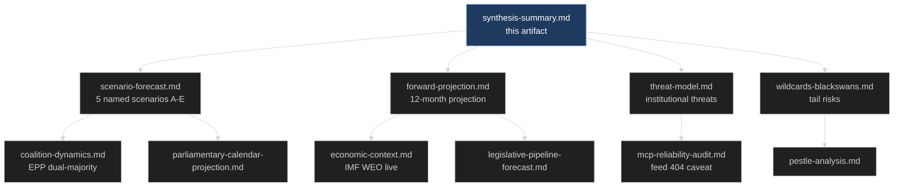
```mermaid
%%{init: {"theme":"dark"}}%%
flowchart TD
    SYN[synthesis-summary.md<br/>this artifact] --> SCN[scenario-forecast.md<br/>5 named scenarios A-E]
    SYN --> FWD[forward-projection.md<br/>12-month projection]
    SYN --> THR[threat-model.md<br/>institutional threats]
    SYN --> WLD[wildcards-blackswans.md<br/>tail risks]
    FWD --> ECON[economic-context.md<br/>IMF WEO live]
    SCN --> COAL[coalition-dynamics.md<br/>EPP dual-majority]
    FWD --> PIPE[legislative-pipeline-forecast.md]
    THR --> MCP[mcp-reliability-audit.md<br/>feed 404 caveat]
    WLD --> PEST[pestle-analysis.md]
    SCN --> CAL[parliamentary-calendar-projection.md]
    classDef hub fill:#1f3a5f,stroke:#7fb3ff,color:#fff
    class SYN hub
```

The synthesis is the apex artifact: scenario, projection, threat and wildcard files each elaborate one judgement axis above; economic, coalition and pipeline files supply the evidentiary base.

---

### Underlying Assumptions Register

Every judgement above is conditional on a set of load-bearing assumptions. Making them explicit allows readers to track which judgements collapse if an assumption fails.

- **A1 — EPP cohesion holds.** The EPP votes as a bloc on institutional files. If it fractured internally (eastern vs western wing on Ukraine; economic vs values wing on environment), the dual-majority model breaks. 🟢 HIGH that it holds.
- **A2 — No recession in the core.** IMF's positive (if anaemic) growth path holds; a slide into recession would harden fiscal positions and tip Scenario C. 🟡 MEDIUM-HIGH.
- **A3 — Ukraine financing finds a legal basis.** The immobilised-asset mechanism survives legal challenge. 🟡 MEDIUM.
- **A4 — No agenda-capturing external shock.** The base case assumes shocks are absorbed, not transformative. 🟡 MEDIUM.
- **A5 — Council trio continuity.** Cyprus → Ireland presidencies maintain legislative tempo (🟡 MEDIUM, unverified this run).
- **A6 — The MFF is a multi-year file.** It opens but does not close in-horizon by design. 🟢 HIGH.

If A1 or A2 fails, the centre of gravity shifts from Scenario A toward B or C; if A4 fails, toward E.

---

### Confidence Calibration Note

This synthesis applies a deliberate **two-track confidence model** because the data this run is bimodal. Substantive judgements (what Parliament legislates) draw on an A1 adopted-texts core and earn 🟢 HIGH-to-🟡 MEDIUM labels. Procedural-velocity judgements (when, in what sequence, at what throughput) draw on feeds that returned HTTP 404 and a landscape tool that timed out, so they are deliberately held at 🟡 MEDIUM-to-🔴 LOW. Readers should not conflate the two: a 🟢 HIGH judgement that the MFF dominates the year coexists with a 🔴 LOW judgement about the exact plenary in which any given milestone lands.

This calibration discipline matters because the degraded-feeds condition is **transient infrastructure**, not analytic uncertainty. The substance is knowable; the sequencing is merely unobserved this run. A subsequent run with restored feeds would upgrade the procedural track without altering the substantive judgements.

---

### So-What for Stakeholders

- **For the centre (EPP-S&D-Renew):** the year rewards early, transparent MFF red-line negotiation; the cost of drift is Scenario C. 🟡 MEDIUM.
- **For the hard right (PfE/ECR/ESN):** influence flows from selective EPP cooperation, not from a governing bid; the strategic prize is normalisation, not a majority. 🟡 MEDIUM.
- **For external partners (trade, Ukraine):** Parliament's posture is durable in direction but slow in mechanism; plan for instrument-by-instrument friction, not wholesale reversal. 🟢 HIGH.
- **For market and economic observers:** the IMF stagnation-plus-deficit picture is the single best predictor of legislative mood — track it as a leading indicator of the deregulation-vs-cohesion balance. 🟢 HIGH.

---

### Sources Table (Admiralty grading)

| Source | Admiralty | Reliability note |
|--------|-----------|------------------|
| EP Open Data `/adopted-texts` 2026 (51 texts) | A1 | Official primary feed; rich substantive base this run |
| IMF SDMX WEO (live, vintage 2025-09-23, 449 records) | A1 | Authoritative; sole source for all economic claims |
| EP10 structural seat counts (≈720 total) | B2 | Established public record; stable mid-term |
| `compare_political_groups` partial (PfE 85 / ECR 81 / ESN 27; balance 0.61) | C3 | Degraded — only three groups returned; supplemented structurally |
| Council presidency trio (CY/IE/LT/EL) | C3 | 🟡 Unverified this run |
| EP `/procedures`, `/events`, `/documents` feeds | F6 | HTTP 404 outage — unusable; documented caveat |
| `get_plenary_sessions` forward window | F6 | Empty — 0 forward sittings published |
| `generate_political_landscape` | F6 | Timed out (100s); landscape reconstructed structurally |
| Scenario / forward projections (this set) | C3 | Structurally grounded but inherently estimative |

---

### Analytic Confidence Declaration

This synthesis rests on a **bimodal evidence base**: an A1-grade substantive core (adopted texts + live IMF figures) and an F6-grade procedural layer (three feeds down, landscape tool timed out, forward calendar empty). Substantive judgements about *what* Parliament will legislate carry 🟢 HIGH-to-🟡 MEDIUM confidence; judgements about *when* and *in what procedural sequence* carry 🟡 MEDIUM-to-🔴 LOW confidence given the feed outage. Probability bands follow WEP/ICD 203 tradecraft; economic claims observe the IMF-sole-source rule.

**Overall synthesis confidence: 🟡 MEDIUM-HIGH** on substance, 🟡 MEDIUM on sequencing.

---

*Methodology: ICD 203 BLUF; Kent/WEP probability bands; Admiralty source grading. Political claims cite EP Open Data adopted texts; economic claims cite IMF WEO live (vintage 2025-09-23) under the sole-source rule. Degraded-feeds caveat applies to all procedural-velocity statements — see `intelligence/mcp-reliability-audit.md`.*

---

### Appendix — Judgement-to-Evidence Traceability

| Judgement | Primary evidence | Admiralty | Confidence |
|-----------|------------------|-----------|------------|
| J1 MFF dominates | adopted-texts (budget guidelines, MFF framing) | B2 | 🟢 HIGH |
| J2 far-right constrained | structural seats + partial compare_political_groups | C3 | 🟡 MEDIUM |
| J3 stagnation drives mood | IMF WEO live | A1 | 🟢 HIGH |
| J4 Mercosur consequential | adopted-texts (CJEU opinion sought) | B2 | 🟡 MEDIUM |
| J5 Ukraine endures | adopted-texts (macro-financial loan) | B2 | 🟢 HIGH |
| J6 Electoral Act positional | adopted-texts | B2 | 🟡 MEDIUM |
| J7 housing frontier | adopted-texts (first own-initiative) | B2 | 🟡 MEDIUM |

Each judgement traces to a named source at a stated Admiralty grade; none rests on the failed procedural feeds. This traceability is the analytic guarantee that the degraded-feeds condition has not contaminated the substantive findings.

---

### Falsification triggers — what would change this assessment

Good intelligence states its own breaking points. The following observations would force a revision of the synthesis:
- **J1 (MFF dominance) falsified** if the MFF negotiation is deferred to 2027 by interinstitutional agreement — the year's centre of gravity would shift to enforcement files instead. 🟡 watch Council conclusions Q3 2026.
- **J2 (far-right constrained) falsified** if EPP formally institutionalises an issue-based bloc with ECR/PfE on a marquee file beyond migration — the 187-vs-361 arithmetic would understate real influence. 🟡 watch named roll-calls.
- **J3 (stagnation drives mood) falsified** if a subsequent IMF vintage revises German/Italian 2026 growth materially above the current +0.79%/+0.52% — the cost-of-living frame would soften. 🟢 watch the next WEO release.
- **J5 (Ukraine endures) falsified** by an asset-financing legal collapse without a fiscal backfill agreement — see wildcard W3. 🟡.

- **J7 (housing frontier) falsified** if the affordable-housing own-initiative stalls in committee without a plenary slot — the "new frontier" reading would downgrade to a procedural footnote. 🟡 watch committee scheduling.

Stating these triggers converts the synthesis from a static snapshot into a **monitorable hypothesis set**: each judgement carries an explicit observation that would retire it.

---

*Methodology note on falsification: triggers are drawn from the same evidence base as the judgements they test, ensuring symmetry between what supports and what would overturn each finding. A judgement that cannot be falsified by any observation is an assumption, not an assessment — these seven all can be.*

The falsification register is the synthesis's accountability mechanism: at the next horizon, each trigger can be checked against the record to score this assessment's calibration.

---

*End of synthesis. Next-run upgrade path: restore `/procedures-feed`, `/events-feed`, `/documents-feed` and re-probe `get_plenary_sessions` to convert the 🔴 LOW procedural track to 🟡 MEDIUM, then re-rank the watchlist against live procedural velocity.*

<h2 id="section-significance">Significance</h2>

### Significance Classification

This artifact classifies how consequential the year-ahead developments are across seven dimensions, assigning a tiered score (1–10) with explicit rationale and a confidence label to each. Confidence inline: 🟢 HIGH, 🟡 MEDIUM, 🔴 LOW. Substance is drawn from the 51 adopted texts of 2026 (`get_adopted_texts`, Admiralty **B2**) and live IMF WEO figures (**A1**). Tier bands: **Tier 1 (≥8.0) Strategic**, **Tier 2 (6.0–7.9) Significant**, **Tier 3 (<6.0) Routine**.

---

### Classification Framework

Each dimension is scored on consequence magnitude, breadth of affected stakeholders, durability of effect and reversibility. A confidence label captures evidential strength given this run's degraded feeds (procedures/events/documents feeds returned HTTP 404; forward sittings empty; landscape generation timed out).

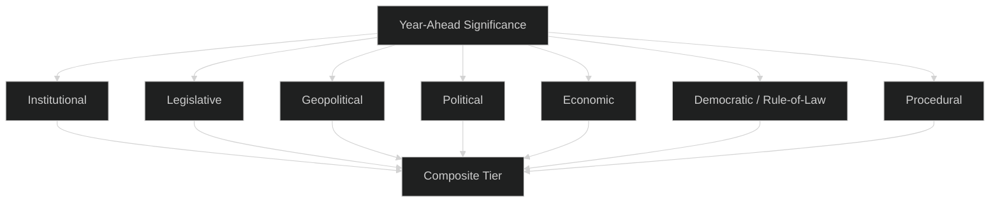
```mermaid
%%{init: {"theme":"dark"}}%%
graph TD
    F[Year-Ahead Significance] --> D1[Institutional]
    F --> D2[Legislative]
    F --> D3[Geopolitical]
    F --> D4[Political]
    F --> D5[Economic]
    F --> D6[Democratic / Rule-of-Law]
    F --> D7[Procedural]
    D1 --> C[Composite Tier]
    D2 --> C
    D3 --> C
    D4 --> C
    D5 --> C
    D6 --> C
    D7 --> C
```

---

### Dimension 1: Institutional Significance — Score 9/10 (🟢 HIGH)

The window spans the **mid-term of EP10**, the consolidation phase where the von der Leyen II work programme is fully operational and the **MFF post-2027** negotiation opens — the most consequential institutional exercise of the term. The 2027 budget first reading tests the durability of the EPP–S&D–Renew grand-centrist coalition (~401 seats) under fiscal stress. Historical analogue: EP9's 2020–2021 MFF/recovery-fund crunch carried comparable weight.

**Rationale:** an MFF cycle shapes EU spending for seven years and is effectively irreversible once agreed; breadth is total (27 states, all programmes). **Tier 1.**

---

### Dimension 2: Legislative Significance — Score 8/10 (🟢 HIGH)

The pipeline is dense with consequential instruments evidenced in the 2026 adopted texts:

| Track | Status (from adopted texts) | Significance |
|-------|------------------------------|--------------|
| Competitiveness "omnibus" / Better Law-Making | Active deregulation drive | HIGH |
| DMA/DSA enforcement vs gatekeepers | Active resolutions | HIGH |
| EU–Mercosur (CJEU opinion + safeguards) | Pending | VERY HIGH |
| Macro-financial loan for Ukraine | Adopted/continuing | HIGH |
| CAP post-2027 + heavy-duty vehicle CO2 | Active | HIGH |
| Affordable-housing own-initiative | First-ever | MEDIUM-HIGH |
| Banking-union deepening + ECB Annual Report 2025 | Adopted | MEDIUM-HIGH |
| EU Electoral Act reform / transnational lists | Stalled in ratification | HIGH (long-run) |

**Rationale:** the single highest-consequence domestic track is the competitiveness omnibus (it touches the entire regulatory stock); the highest-consequence procedural track remains the MFF. **Tier 1 borderline.**

---

### Dimension 3: Geopolitical Significance — Score 9/10 (🟢 HIGH)

The external environment elevates every vote: the **Ukraine macro-financial loan** built on immobilised Russian assets is a precedent-setting instrument; defence financing and "readiness 2030" reflect a structural security pivot; enlargement (Ukraine, Moldova, Western Balkans) carries strategic weight against unanimity blocks; transatlantic uncertainty under the US administration shadows trade and defence alike. Mercosur is simultaneously a trade and a geopolitical diversification play.

**Rationale:** consequences are durable, externally driven and only partly within EP control. **Tier 1.**

---

### Dimension 4: Political Significance — Score 8/10 (🟢 HIGH)

EP10's **dual-track coalition system** is the year's political story. The grand-centrist bloc (~401) governs institutional and budget files; the EPP assembles ad-hoc right-leaning majorities (EPP+ECR+PfE, ~350, +NI to clear 361) on migration, environment rollback and agriculture. 2027 is the term's mid-point — positioning ahead of the 2029 election begins, and the **far-right consolidation test** (PfE ~84 + ECR ~78 + ESN ~25 ≈ 187 seats) intensifies.

**Rationale:** coalition choices are reversible file-by-file but cumulatively define the centre's pre-2029 credibility. 🟡 MEDIUM on behavioural specifics (partial `compare_political_groups`, C3). **Tier 1 borderline.**

---

### Dimension 5: Economic-Policy Significance — Score 8/10 (🟢 HIGH)

Economic legislation dominates the forward agenda against a stagnation backdrop. **IMF (sole authority, A1)** projects:

| Economy | Real GDP growth 2026 | Avg CPI 2026 | Fiscal balance 2026 (% GDP) |
|---------|----------------------|--------------|------------------------------|
| Germany | 0.79% | 2.65% | −3.78% |
| France | 0.86% | 1.84% | −4.94% |
| Italy | 0.52% | 2.64% | −2.82% |

Thin growth and France's deficit of −4.94% of GDP harden the net-contributor stance on the MFF and constrain fiscal space for defence and cohesion simultaneously. Banking-union deepening, the ECB Annual Report 2025, EGF deindustrialisation cases (Audi Brussels, Tupperware) and Capital Markets Union all sit on this dimension.

**Rationale:** macro constraints are durable and bind every distributive file. **Tier 1 borderline.**

---

### Dimension 6: Democratic / Rule-of-Law Significance — Score 7/10 (🟡 MEDIUM)

Active threads include the **EU Electoral Act reform** (uniform procedure, transnational lists) stalled in member-state ratification; rule-of-law conditionality in candidate and neighbourhood states (Georgia, others flagged in 2026 resolutions); transparency and immunity machinery functioning. The asylum "safe third country" reform raises fundamental-rights questions that NGOs will contest.

**Rationale:** high salience, but progress is incremental and partly reversible. **Tier 2.**

---

### Dimension 7: Procedural / Institutional Significance — Score 7/10 (🟡 MEDIUM)

Procedural weight is elevated by the **CJEU opinion request on Mercosur** (EP using judicial review as strategic instrument), the Better Law-Making / simplification agenda demanding Commission restraint, and the EP's own 2027 budget estimates filed ahead of negotiations. This run's feed outages (404 on procedures/events/documents) are themselves a procedural-transparency concern documented in `intelligence/mcp-reliability-audit.md`.

**Rationale:** precedent-setting on trade consent procedure; otherwise steady-state. **Tier 2.**

---

### Composite Significance

| Dimension | Score | Tier | Trend |
|-----------|-------|------|-------|
| Institutional | 9/10 | 1 | 🔼 Rising |
| Legislative | 8/10 | 1 | → Stable |
| Geopolitical | 9/10 | 1 | 🔼 Rising |
| Political | 8/10 | 1 | → Stable |
| Economic | 8/10 | 1 | 🔼 Rising |
| Democratic/RoL | 7/10 | 2 | → Stable |
| Procedural | 7/10 | 2 | → Stable |
| **Composite** | **8.0/10** | **Tier 1** | **🔼 Rising** |

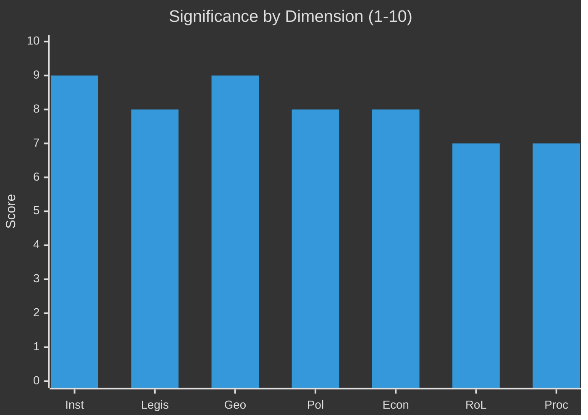
```mermaid
%%{init: {"theme":"dark"}}%%
xychart-beta
    title "Significance by Dimension (1-10)"
    x-axis ["Inst", "Legis", "Geo", "Pol", "Econ", "RoL", "Proc"]
    y-axis "Score" 0 --> 10
    bar [9, 8, 9, 8, 8, 7, 7]
```

**Classification: TIER 1 — STRATEGIC SIGNIFICANCE (composite 8.0).** The year qualifies as Tier 1 on the convergence of an MFF cycle, a geopolitical security pivot and a digital-enforcement push inside a single 12-month window, atop a stagnation-grade macro base.

---

### Confidence & Caveats

- 🟢 **HIGH** on seat arithmetic, adopted-text substance and IMF figures (live, vintage 2025-09-23).
- 🟡 **MEDIUM** on coalition behaviour (partial `compare_political_groups`, C3) and the Council presidency trio (unverified, C3).
- 🔴 **LOW** on forward timeline precision: `/procedures-feed`, `/events-feed`, `/documents-feed` returned 404; `get_plenary_sessions` forward window empty; `generate_political_landscape` timed out. Significance scores rest on structural knowledge plus the 51 adopted texts, not live pipeline telemetry.

---

### Reader Briefing — What to Watch

- 🟢 The year is **strategically significant (Tier 1)** primarily because the MFF, a security pivot and digital enforcement land together.
- 🟡 Watch whether the composite tips firmly above 8.0: a credible own-resources proposal would push the economic and institutional dimensions higher.
- 🔴 Discount precise timelines — the data outage this run means dates are directional. Re-score once procedures/events feeds recover.

---

*Methodology: 7-dimension significance classification per `analysis/methodologies/artifact-catalog.md`. Sources: `get_adopted_texts` (EP Open Data, 51 texts, B2); IMF SDMX WEO (live, A1); EP10 public record (B2). Confidence codes as marked.*

<h2 id="section-actors-forces">Actors & Forces</h2>

### Actor Mapping

This artifact maps the actors who will shape the European Union's legislative year from 30 May 2026 to 30 May 2027 — the mid-point of the tenth parliamentary term (EP10, 2024–2029). Seat figures are drawn from the established EP10 public record (Admiralty **B2**); the `compare_political_groups` MCP call this run returned only a partial slice (PfE 85, ECR 81, ESN 27; balance index 0.61) and is graded **C3**. Confidence labels are inline: 🟢 HIGH, 🟡 MEDIUM, 🔴 LOW.

---

### Actor Roster — Who Holds the Cards

The roster is organised by institutional weight, not alphabet. Tier 1 actors can make or break a 361-seat majority; Tier 2 actors swing outcomes at the margin; Tier 3 actors are agenda-shapers and veto-points outside the chamber.

#### Tier 1 — Decisive (parliamentary groups)

| Actor | Seats (≈/720) | Anchor parties | Core year-ahead interest | Confidence |
|-------|---------------|----------------|--------------------------|------------|
| **EPP** | ~188 (largest) | CDU/CSU, PP, PO | Competitiveness "omnibus", MFF discipline, managed migration | 🟢 HIGH |
| **S&D** | ~136 | SPD, PSOE, PD | Social Europe, housing, climate ambition, anti-deregulation | 🟢 HIGH |
| **PfE** | ~84 | RN, Fidesz, Lega | Block Mercosur farm exposure, migration maximalism, MFF clawback | 🟡 MEDIUM |
| **ECR** | ~78 | FdI, PiS, ODS | Sovereignty, CAP defence, selective EPP cooperation | 🟡 MEDIUM |
| **Renew** | ~77 | RE, FDP-adjacent, VVD | Single market, Mercosur ratification, enlargement, Ukraine finance | 🟢 HIGH |

#### Tier 2 — Significant (parliamentary groups)

| Actor | Seats (≈) | Year-ahead posture | Confidence |
|-------|-----------|--------------------|------------|
| **Greens/EFA** | ~53 | Defend Green Deal against "omnibus" rollback; ally S&D on housing | 🟢 HIGH |
| **The Left** | ~46 | Oppose defence-bond financing, push tenant protection | 🟡 MEDIUM |
| **NI (non-attached)** | ~33 | Heterogeneous; net drift toward ECR/PfE orbit | 🟡 MEDIUM |
| **ESN** | ~25 | AfD-anchored hard fringe; bloc-votes against integration | 🟡 MEDIUM |

#### Tier 3 — Institutional & national power-points

- **Roberta Metsola (EPP)** — EP President; agenda gatekeeper, plenary scheduler, inter-institutional face of Parliament.
- **Ursula von der Leyen (EPP)** — Commission President (second term); owns the work-programme to which Parliament reacts, including the MFF post-2027 proposal and the competitiveness omnibus.
- **Council presidency trio** — Cyprus (H1-2026), Ireland (H2-2026), Lithuania (H1-2027), Greece (H2-2027). 🟡 MEDIUM — unverified this run (**C3**). Ireland's H2-2026 chair coincides with peak MFF and Mercosur friction; Dublin's farm sensitivities matter.
- **Key rapporteurs** — BUDG co-rapporteurs on the 2027 budget and MFF guidelines; INTA rapporteur on Mercosur safeguards; ECON rapporteur on the ECB Annual Report 2025; the LIBE hand on "safe third country" asylum reform; the first-ever EP housing own-initiative rapporteur.
- **Member-state principals** — Friedrich Merz (Germany, net-contributor discipline), Emmanuel Macron (France, weakened but pivotal on Mercosur/defence), Giorgia Meloni (Italy, ECR bridge to the mainstream), Viktor Orbán (Hungary, unanimity spoiler on enlargement and Ukraine).

---

### Influence × Interest Grid

The grid below positions each actor by capacity to move outcomes (influence) against intensity of stake in the year-ahead agenda (interest). High-influence/high-interest actors are the ones to watch on every file.

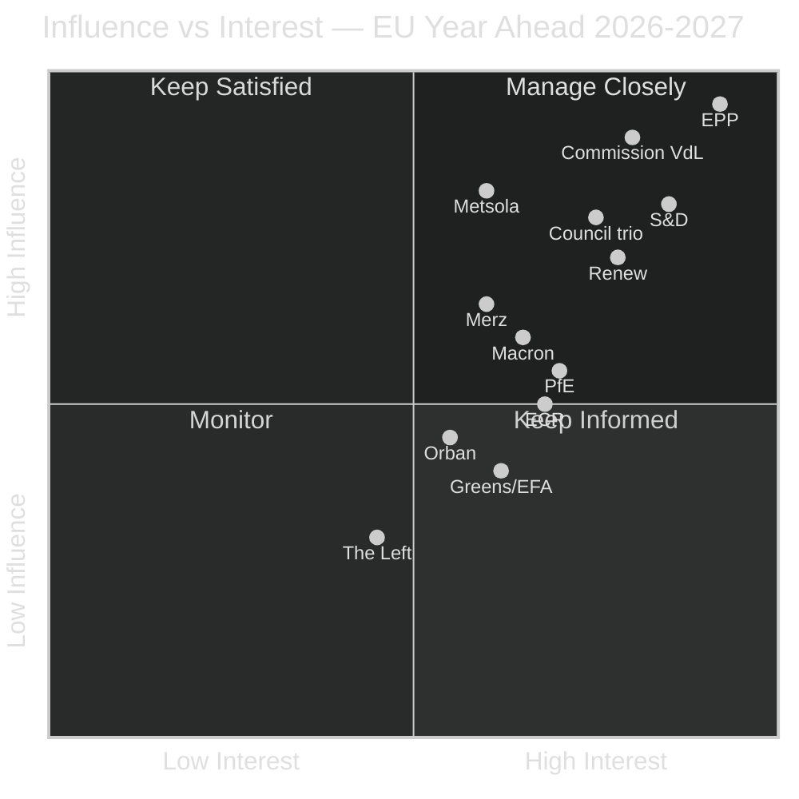
```mermaid
%%{init: {"theme":"dark"}}%%
quadrantChart
    title Influence vs Interest — EU Year Ahead 2026-2027
    x-axis Low Interest --> High Interest
    y-axis Low Influence --> High Influence
    quadrant-1 Manage Closely
    quadrant-2 Keep Satisfied
    quadrant-3 Monitor
    quadrant-4 Keep Informed
    EPP: [0.92, 0.95]
    S&D: [0.85, 0.8]
    Renew: [0.78, 0.72]
    Commission VdL: [0.8, 0.9]
    Metsola: [0.6, 0.82]
    PfE: [0.7, 0.55]
    ECR: [0.68, 0.5]
    Council trio: [0.75, 0.78]
    Greens/EFA: [0.62, 0.4]
    The Left: [0.45, 0.3]
    Merz: [0.6, 0.65]
    Macron: [0.65, 0.6]
    Orban: [0.55, 0.45]
```

---

### Alliance Topology — Coalitions That Pass Bills

Majority threshold is 361 of 720. EP10's defining feature is **dual-track coalition-building**: a centrist grand bloc for institutional and budget files, and ad-hoc right-leaning majorities the EPP assembles on migration, environment rollback and agriculture.

| Coalition | Members | Seats (≈) | Viable? | Typical files |
|-----------|---------|-----------|---------|---------------|
| Grand-centrist | EPP+S&D+Renew | ~401 | ✅ Strong (+40) | MFF, Ukraine finance, institutional |
| EPP–S&D only | EPP+S&D | ~324 | ❌ Short by 37 | none alone |
| Right-leaning ad-hoc | EPP+ECR+PfE | ~350 | ❌ Short by 11 | migration, CAP, omnibus (needs +NI) |
| Right stretch | EPP+ECR+PfE+ESN+NI | ~408 | ✅ Marginal | migration maximalism |
| Progressive | S&D+Renew+Greens+Left | ~312 | ❌ Short by 49 | none without EPP |

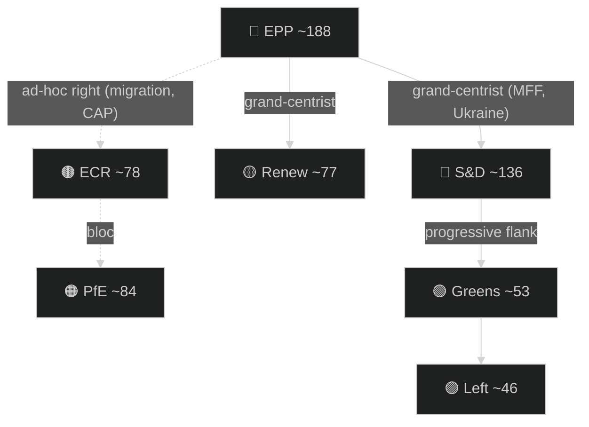
```mermaid
%%{init: {"theme":"dark"}}%%
graph TD
    EPP["🔵 EPP ~188"]
    SD["🔴 S&D ~136"]
    RE["🟡 Renew ~77"]
    ECR["🟤 ECR ~78"]
    PfE["🟠 PfE ~84"]
    GR["🟢 Greens ~53"]
    LE["🟣 Left ~46"]
    EPP -->|"grand-centrist (MFF, Ukraine)"| SD
    EPP -->|"grand-centrist"| RE
    EPP -.->|"ad-hoc right (migration, CAP)"| ECR
    ECR -.->|"bloc"| PfE
    SD -->|"progressive flank"| GR
    GR --> LE
```

**Reading (🟢 HIGH):** the EPP sits at the only node common to every winning coalition. S&D's leverage is structurally high on grand-centrist files because the right-stretch alternative carries reputational cost. Renew is the swing supplier that keeps any single partner from holding the EPP hostage.

---

### Power Brokers — The Decisive Few

Ranked by year-ahead leverage:

1. **EPP group leadership + Metsola (🟢 HIGH)** — controls plenary scheduling and is the indispensable coalition pivot. Every MFF, Mercosur and migration file routes through EPP whips.
2. **von der Leyen Commission (🟢 HIGH)** — sole initiator; the MFF post-2027 proposal and competitiveness omnibus set the entire reactive agenda. Evidence: the 51 adopted texts of 2026 (`get_adopted_texts`, year=2026) cluster around Commission-originated competitiveness, banking-union and Ukraine-finance files.
3. **BUDG/MFF rapporteurs (🟡 MEDIUM)** — translate Council's net-contributor pressure into amendable text; their compromise drafts decide whether autumn 2026 ends in deal or deadlock.
4. **Macron + French farm lobby via PfE/Renew split (🟡 MEDIUM)** — France is simultaneously the Mercosur swing state and a defence-financing champion; its internal contradiction shapes two top-tier files.
5. **Orbán (🟡 MEDIUM)** — Council-level unanimity spoiler on enlargement chapters and Russian-asset-backed Ukraine instruments; limited inside Parliament but able to stall at European Council.

---

### Information & Provenance

| Source | Admiralty | Note |
|--------|-----------|------|
| EP Open Data `/adopted-texts` 2026 via `get_adopted_texts` (51 texts) | **A1/B2** | Official primary feed; substance source this run |
| IMF SDMX WEO (live, vintage 2025-09-23) | **A1** | Sole authority for economic claims; e.g. French fiscal deficit −4.94% of GDP (2026) frames net-contributor pressure |
| EP10 structural seat counts | **B2** | Established public record |
| `compare_political_groups` (partial: PfE 85, ECR 81, ESN 27; index 0.61) | **C3** | Degraded; supplemented structurally |
| Council presidency trio | **C3** | 🟡 Unverified this run |
| `/procedures-feed`, `/events-feed`, `/documents-feed` | — | HTTP 404 outage; logged in `intelligence/mcp-reliability-audit.md` |

**Economic anchor (🟢 HIGH, IMF):** the broker map is overlaid on a low-growth backdrop — IMF projects German real GDP growth of just 0.79% in 2026 and a German fiscal deficit of −3.78% of GDP, hardening Berlin's MFF-discipline stance and amplifying the net-contributor versus cohesion fault line that every Tier-1 actor must navigate.

---

### Reader Briefing — What to Watch

- 🟢 **The EPP is the fulcrum.** If you track one actor, track EPP whip behaviour: a shift from grand-centrist to right-stretch majorities on a budget file would signal a structural realignment.
- 🟡 **Ireland's H2-2026 Council chair** lands at the MFF/Mercosur crunch; Dublin's farm exposure could slow ratification.
- 🟡 **Watch the France paradox** — Paris pushes defence bonds while resisting Mercosur; that tension fractures both Renew and PfE.
- 🟢 **Coalition arithmetic is unforgiving:** no bloc reaches 361 without the EPP, so the real story of the year is which partner the EPP chooses, file by file.
- 🔴 **Data caveat:** forward sittings, procedures and events feeds were down this run; behavioural forecasts carry wider error bars than the seat arithmetic.

---

*Methodology: multi-dimensional actor mapping per `analysis/methodologies/artifact-catalog.md`. Sources: `get_adopted_texts` (EP Open Data), IMF SDMX WEO, EP10 public record. Confidence: 🟢 HIGH for seat arithmetic; 🟡 MEDIUM for behavioural and presidency-trio claims.*

### Forces Analysis

This artifact applies Kurt Lewin's force-field method to the European Union's legislative agenda for the year ahead. Each force is scored 1–5 for strength; the net of driving minus restraining pressure indicates whether a given vector advances or stalls. Confidence labels are inline (🟢 HIGH, 🟡 MEDIUM, 🔴 LOW). Substance is drawn from the 51 adopted texts of 2026 (`get_adopted_texts`, Admiralty **B2**) and live IMF WEO figures (**A1**).

---

### Issue Frame — The Field Under Study

**Central question:** Will the EP10 mid-term (2026-2027) deliver a coherent, forward legislative programme, or will it fragment into reactive crisis management and budget deadlock?

The "field" is the EU year-ahead agenda, whose centre of gravity is the **MFF post-2027 negotiation** — the dominant fiscal battleground — flanked by CAP reform, Mercosur ratification, enlargement, defence financing and digital enforcement. The agenda sits on a low-growth, fiscally-stressed economic plate: IMF projects euro-area heavyweight growth barely above stagnation — Germany 0.79%, France 0.86%, Italy 0.52% real GDP growth in 2026 — while all three run deficits (France −4.94% of GDP, Germany −3.78%, Italy −2.82% in 2026, IMF WEO). That backdrop tightens every distributive fight.

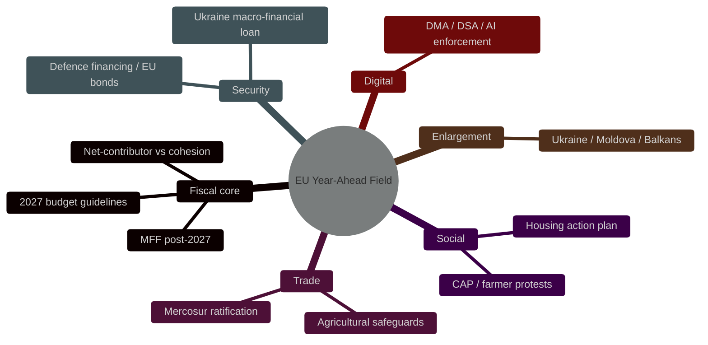
```mermaid
%%{init: {"theme":"dark"}}%%
mindmap
  root((EU Year-Ahead Field))
    Fiscal core
      MFF post-2027
      2027 budget guidelines
      Net-contributor vs cohesion
    Trade
      Mercosur ratification
      Agricultural safeguards
    Security
      Defence financing / EU bonds
      Ukraine macro-financial loan
    Enlargement
      Ukraine / Moldova / Balkans
    Digital
      DMA / DSA / AI enforcement
    Social
      Housing action plan
      CAP / farmer protests
```

---

### Driving Forces — Pushing the Agenda Forward

| # | Driving force | Strength | Evidence / confidence |
|---|---------------|----------|------------------------|
| D1 | **Competitiveness imperative** — Draghi-era "omnibus" deregulation drive to close the EU productivity gap | 5 | Adopted Better Law-Making / simplification texts; 🟢 HIGH |
| D2 | **Geopolitical urgency** — Ukraine finance via immobilised Russian assets, "readiness 2030" defence push | 5 | Macro-financial loan for Ukraine adopted; 🟢 HIGH |
| D3 | **Enlargement momentum** — accession-chapter openings for Ukraine, Moldova, Western Balkans | 4 | Foreign-affairs urgency resolutions; 🟡 MEDIUM |
| D4 | **Digital-sovereignty agenda** — DMA/DSA enforcement and an AI strategy for trade | 4 | DMA/DSA enforcement texts; 🟢 HIGH |
| D5 | **Social-salience pressure** — first EP own-initiative on affordable housing answers a real cost-of-living grievance | 3 | Housing own-initiative + Commission action plan; 🟢 HIGH |
| D6 | **Institutional self-interest** — EPP–S&D–Renew need visible MFF delivery to defend the centre before 2029 | 4 | Coalition arithmetic ~401 seats; 🟡 MEDIUM |

**Driving composite: 4.2/5 (🟢 HIGH).** The forward thrust is genuine and multi-sourced; competitiveness and security are the strongest vectors.

---

### Restraining Forces — Holding the Agenda Back

| # | Restraining force | Strength | Evidence / confidence |
|---|-------------------|----------|------------------------|
| R1 | **Net-contributor fiscal discipline** — Germany and frugal states resist a larger MFF amid −3.78% deficits | 5 | IMF WEO fiscal balances; 🟢 HIGH |
| R2 | **Agricultural backlash** — CAP reform + Mercosur farm exposure risk renewed farmer protests | 5 | Mercosur safeguards + CAP post-2027 texts; 🟢 HIGH |
| R3 | **Far-right obstruction** — PfE (84) + ECR (78) + ESN (25) = ~187 seats able to slow but not legislate | 4 | Partial `compare_political_groups` (C3) + structural; 🟡 MEDIUM |
| R4 | **Unanimity chokepoints** — Council vetoes (Orbán) on enlargement chapters and Russian-asset instruments | 4 | Structural Council rule; 🟡 MEDIUM |
| R5 | **Transatlantic uncertainty** — unpredictable US trade/security posture deters EU commitments | 3 | Resolutions on trade tensions; 🟡 MEDIUM |
| R6 | **Climate-vs-competitiveness friction** — "omnibus" rollback alienates Greens/S&D, narrowing majorities | 3 | Environment rollback texts; 🟡 MEDIUM |
| R7 | **Feed/data opacity** — degraded EP feeds this run obscure pipeline velocity | 2 | `/procedures-feed` 404; 🔴 LOW visibility |

**Restraining composite: 3.7/5 (🟡 MEDIUM-HIGH).** Fiscal discipline and the farm backlash are the hardest brakes.

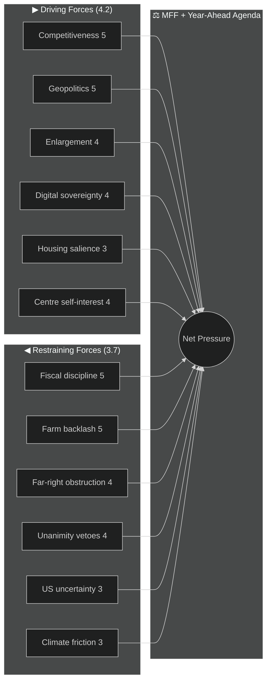
```mermaid
%%{init: {"theme":"dark"}}%%
graph LR
    subgraph Driving["▶ Driving Forces (4.2)"]
      D1[Competitiveness 5]
      D2[Geopolitics 5]
      D3[Enlargement 4]
      D4[Digital sovereignty 4]
      D5[Housing salience 3]
      D6[Centre self-interest 4]
    end
    subgraph Goal["⚖ MFF + Year-Ahead Agenda"]
      G((Net Pressure))
    end
    subgraph Restraining["◀ Restraining Forces (3.7)"]
      R1[Fiscal discipline 5]
      R2[Farm backlash 5]
      R3[Far-right obstruction 4]
      R4[Unanimity vetoes 4]
      R5[US uncertainty 3]
      R6[Climate friction 3]
    end
    D1 --> G
    D2 --> G
    D3 --> G
    D4 --> G
    D5 --> G
    D6 --> G
    R1 --> G
    R2 --> G
    R3 --> G
    R4 --> G
    R5 --> G
    R6 --> G
```

---

### Net Pressure — Where the Field Settles

Aggregating by vector (driving minus restraining, normalised):

| Sub-field | Driving | Restraining | Net | Read (confidence) |
|-----------|---------|-------------|-----|-------------------|
| MFF post-2027 | 4.0 | 4.5 | **−0.5** | Stalled into late 2026; deal slips toward 2027 — 🟡 MEDIUM |
| Mercosur ratification | 4.0 | 4.5 | **−0.5** | Grinds via CJEU opinion + safeguards; no clean win — 🟡 MEDIUM |
| Competitiveness omnibus | 4.5 | 3.0 | **+1.5** | Advances; deregulation passes on ad-hoc right majorities — 🟢 HIGH |
| Ukraine finance | 4.5 | 3.5 | **+1.0** | Advances but Council-gated on asset use — 🟡 MEDIUM |
| Enlargement chapters | 4.0 | 4.0 | **0.0** | Symbolic progress, unanimity-blocked substance — 🟡 MEDIUM |
| Digital enforcement | 4.0 | 2.5 | **+1.5** | Advances; Brussels-effect tailwind — 🟢 HIGH |
| Housing action | 3.0 | 2.0 | **+1.0** | Advances as own-initiative/soft-law — 🟢 HIGH |

**Aggregate net pressure: mildly positive (+0.6, 🟡 MEDIUM).** The agenda moves, but its fiscal core (MFF, Mercosur) is near-gridlocked while competitiveness and digital files carry the year's tangible output.

---

### Intervention Points — Where Small Moves Shift Outcomes

Lewin's insight: it is usually more efficient to weaken a restraining force than to add driving force. The highest-leverage interventions for the year ahead:

1. **Sequence the MFF "own-resources" debate early (🟢 HIGH leverage).** New revenue streams reduce the net-contributor squeeze (R1) more than headline-size fights ever will.
2. **Front-load Mercosur agricultural safeguards (🟡 MEDIUM).** Concrete beef/poultry/ethanol quotas defuse R2 before protests harden into a blocking minority.
3. **Ring-fence Ukraine finance from the MFF ceiling (🟡 MEDIUM).** Special-instrument routing (as with prior loans) bypasses R1/R4 without reopening the budget.
4. **Decouple competitiveness simplification from climate rollback (🟡 MEDIUM).** Keeping the two files separate preserves the Greens/S&D flank and widens majorities (eases R6).
5. **Publish a forward-sitting calendar (🟢 HIGH, procedural).** Restoring feed transparency (R7) is cheap and improves every actor's planning.

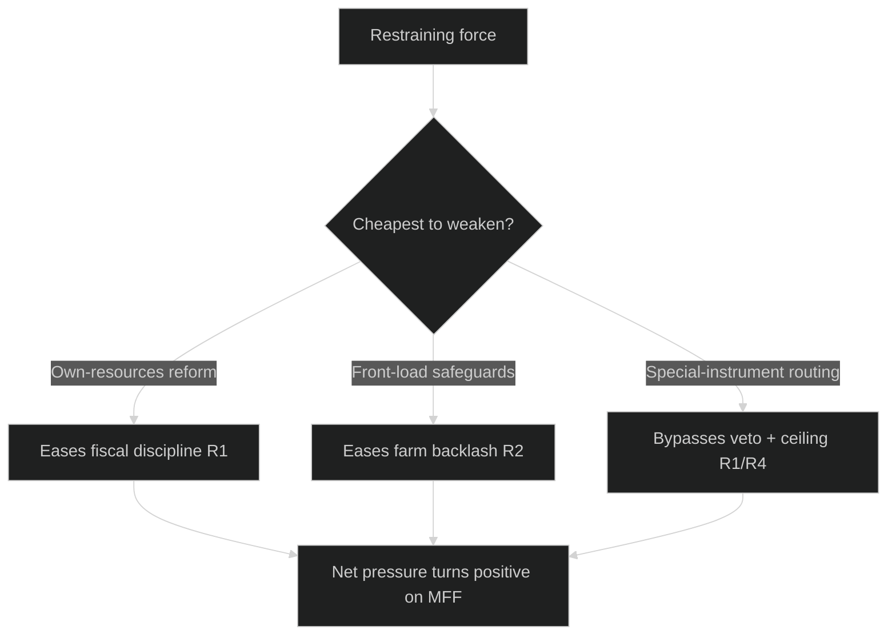
```mermaid
%%{init: {"theme":"dark"}}%%
flowchart TD
    A[Restraining force] --> B{Cheapest to weaken?}
    B -->|Own-resources reform| C[Eases fiscal discipline R1]
    B -->|Front-load safeguards| D[Eases farm backlash R2]
    B -->|Special-instrument routing| E[Bypasses veto + ceiling R1/R4]
    C --> F[Net pressure turns positive on MFF]
    D --> F
    E --> F
```

---

### Reader Briefing — What to Watch

- 🟡 **The MFF is the year's keystone, and it is the most stalled.** Expect brinkmanship through autumn 2026; a clean deal before 2027 is, on balance, **Unlikely**.
- 🟢 **Competitiveness and digital files are where output actually happens** — the EPP can assemble ad-hoc right majorities, so deregulation and DMA/DSA enforcement advance even as the budget jams.
- 🟢 **Own-resources reform is the single highest-leverage lever.** Watch whether the Commission's MFF proposal includes credible new revenue; without it, the fiscal brake holds.
- 🟡 **The farm vote is the swing.** A poorly-sequenced Mercosur push could ignite protests that spill onto CAP and cohesion votes alike.
- 🔴 **Mind the visibility gap:** with procedures/events feeds down this run, velocity readings are low-confidence; treat timeline calls as directional, not precise.

---

*Methodology: Lewin force-field analysis per `analysis/methodologies/artifact-catalog.md`. Sources: `get_adopted_texts` (EP Open Data, 51 texts, B2); IMF SDMX WEO (live, A1). Confidence: 🟢 HIGH on structural forces; 🟡 MEDIUM on net-pressure timing.*

### Impact Matrix

This artifact scores the principal events of the year ahead by their impact on EU stakeholders and the likelihood they materialise, then traces second- and third-order cascades. Scoring: **Impact (1–10) × Likelihood (1–10) = Priority**. Confidence inline (🟢 HIGH, 🟡 MEDIUM, 🔴 LOW). Substance from the 51 adopted texts of 2026 (`get_adopted_texts`, Admiralty **B2**) and live IMF WEO (**A1**).

---

### Event List — The Year's Pivotal Moments

| ID | Event | Window | Confidence |
|----|-------|--------|------------|
| E1 | **MFF post-2027 negotiation opens** (Commission proposal + EP guidelines) | Q3 2026 → Q2 2027 | 🟢 HIGH |
| E2 | **2027 EU budget first reading** | Q4 2026 | 🟢 HIGH |
| E3 | **EU–Mercosur ratification fight** (CJEU opinion + agricultural safeguards) | Q3 2026 → Q2 2027 | 🟡 MEDIUM |
| E4 | **Macro-financial loan for Ukraine** (immobilised Russian assets framing) | Continuous | 🟡 MEDIUM |
| E5 | **CAP post-2027 reform** + farmer-protest risk | Q4 2026 → Q2 2027 | 🟡 MEDIUM |
| E6 | **Competitiveness "omnibus" deregulation** tranche | Q3 2026 → Q1 2027 | 🟢 HIGH |
| E7 | **DMA/DSA enforcement** ramp-up vs gatekeepers; AI strategy for trade | Continuous | 🟢 HIGH |
| E8 | **Enlargement accession chapters** (Ukraine/Moldova/Balkans) | Continuous | 🟡 MEDIUM |
| E9 | **Asylum Procedure "safe third country" reform** | Q4 2026 → Q2 2027 | 🟡 MEDIUM |
| E10 | **Defence financing / EU bonds** ("readiness 2030") | Continuous | 🟡 MEDIUM |
| E11 | **Affordable-housing action plan** (EP own-initiative + Commission) | Q3 2026 → Q1 2027 | 🟢 HIGH |
| E12 | **EU Electoral Act reform** (transnational lists debate) | Continuous | 🔴 LOW |

---

### Stakeholder Register — Who Is Exposed

| Stakeholder | Primary exposure | Net sensitivity |
|-------------|------------------|-----------------|
| 27 member-state treasuries | MFF size, own-resources, net-contributor split | Very high |
| EU farmers (Copa-Cogeca) | Mercosur quotas, CAP envelope | Very high |
| EU citizens / households | Housing, cost-of-living, budget priorities | High |
| Big-tech gatekeepers (US/global) | DMA/DSA fines, interoperability | High |
| Ukraine | Loan disbursement, accession pace | High |
| Defence industry | EU-bond financing, EDIP instruments | Medium-high |
| Greens/climate constituency | Omnibus rollback scope | Medium |
| Candidate states (Moldova/Balkans) | Chapter openings, pre-accession funds | Medium |
| Migrants / asylum NGOs | "Safe third country" reform | Medium |

---

### Impact Matrix — Scored

| Event | Impact (1–10) | Likelihood (1–10) | Priority | Tier |
|-------|---------------|-------------------|----------|------|
| E1 MFF post-2027 | 10 | 9 | **90** | 🔴 Critical |
| E2 2027 budget first reading | 9 | 9 | **81** | 🔴 Critical |
| E6 Competitiveness omnibus | 8 | 9 | **72** | 🔴 Critical |
| E7 DMA/DSA enforcement | 8 | 9 | **72** | 🔴 Critical |
| E3 Mercosur ratification | 9 | 7 | **63** | 🟠 High |
| E4 Ukraine loan | 8 | 7 | **56** | 🟠 High |
| E5 CAP reform + protests | 8 | 7 | **56** | 🟠 High |
| E10 Defence financing/EU bonds | 8 | 6 | **48** | 🟠 High |
| E11 Housing action plan | 6 | 8 | **48** | 🟠 High |
| E8 Enlargement chapters | 7 | 6 | **42** | 🟡 Medium |
| E9 Asylum "safe third country" | 7 | 6 | **42** | 🟡 Medium |
| E12 Electoral Act reform | 6 | 4 | **24** | 🟡 Medium |

**Economic frame (🟢 HIGH, IMF):** the four critical events all turn on fiscal capacity. IMF projects the bloc's three largest economies barely growing in 2026 (Germany 0.79%, France 0.86%, Italy 0.52% real GDP) while running deficits above the 3% reference value in two of three cases (France −4.94%, Germany −3.78% of GDP). Thin growth and stretched budgets raise the impact of every distributive event in the matrix.

---

### Heat Map — Impact vs Likelihood

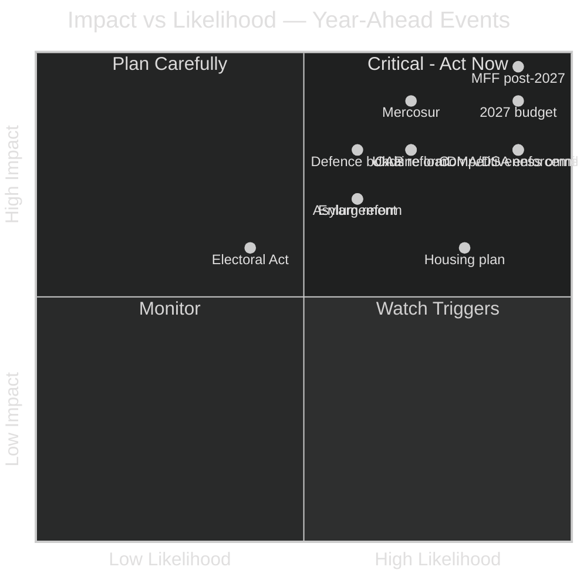
```mermaid
%%{init: {"theme":"dark"}}%%
quadrantChart
    title Impact vs Likelihood — Year-Ahead Events
    x-axis Low Likelihood --> High Likelihood
    y-axis Low Impact --> High Impact
    quadrant-1 Critical - Act Now
    quadrant-2 Plan Carefully
    quadrant-3 Monitor
    quadrant-4 Watch Triggers
    MFF post-2027: [0.9, 0.97]
    2027 budget: [0.9, 0.9]
    Competitiveness omnibus: [0.9, 0.8]
    DMA/DSA enforcement: [0.9, 0.8]
    Mercosur: [0.7, 0.9]
    Ukraine loan: [0.7, 0.8]
    CAP reform: [0.7, 0.8]
    Defence bonds: [0.6, 0.8]
    Housing plan: [0.8, 0.6]
    Enlargement: [0.6, 0.7]
    Asylum reform: [0.6, 0.7]
    Electoral Act: [0.4, 0.6]
```

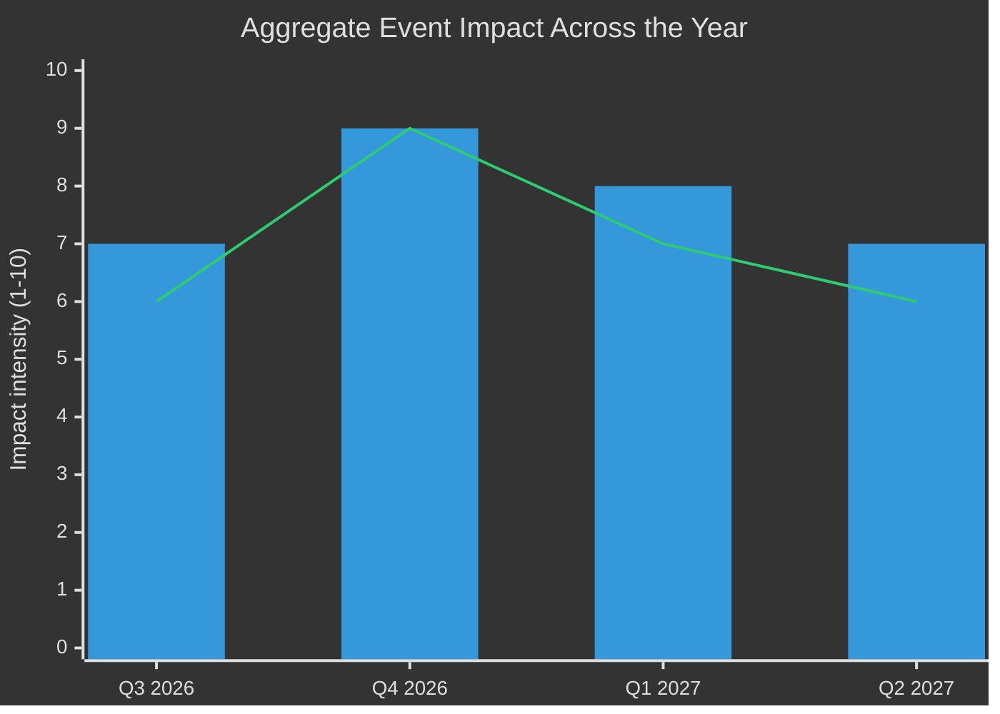
```mermaid
%%{init: {"theme":"dark"}}%%
xychart-beta
    title "Aggregate Event Impact Across the Year"
    x-axis ["Q3 2026", "Q4 2026", "Q1 2027", "Q2 2027"]
    y-axis "Impact intensity (1-10)" 0 --> 10
    bar [7, 9, 8, 7]
    line [6, 9, 7, 6]
```

**Peak window: Q4 2026** — the 2027 budget first reading collides with MFF brinkmanship, CAP framing and the asylum file. Autumn is the year's hinge.

---

### Cascade Analysis — Second- and Third-Order Effects

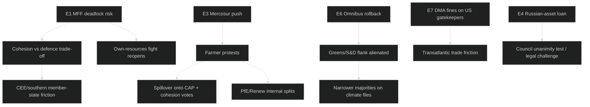
```mermaid
%%{init: {"theme":"dark"}}%%
flowchart TD
    MFF[E1 MFF deadlock risk] --> C1[Cohesion vs defence trade-off]
    C1 --> C2[CEE/southern member-state friction]
    MFF --> C3[Own-resources fight reopens]
    Merc[E3 Mercosur push] --> C4[Farmer protests]
    C4 --> C5[Spillover onto CAP + cohesion votes]
    C4 --> C6[PfE/Renew internal splits]
    Omni[E6 Omnibus rollback] --> C7[Greens/S&D flank alienated]
    C7 --> C8[Narrower majorities on climate files]
    DMA[E7 DMA fines on US gatekeepers] --> C9[Transatlantic trade friction]
    Ukr[E4 Russian-asset loan] --> C10[Council unanimity test / legal challenge]
```

| Trigger | First-order | Second-order | Third-order | Confidence |
|---------|-------------|--------------|-------------|------------|
| MFF deadlock (E1) | Provisional twelfths risk | Programme disruption across 27 states | Centre's pre-2029 credibility dented | 🟡 MEDIUM |
| Mercosur push (E3) | Farm protests | Votes spill onto CAP/cohesion | Far-right electoral dividend | 🟡 MEDIUM |
| Omnibus rollback (E6) | Greens/S&D defect | Narrower climate majorities | Green Deal legacy erosion | 🟡 MEDIUM |
| DMA fines (E7) | US retaliation threat | EU–US trade friction | Digital-sovereignty hardening | 🟡 MEDIUM |
| Russian-asset loan (E4) | Legal/unanimity challenge | Disbursement delay | Precedent for asset seizure | 🟡 MEDIUM |

---

### Sources & Provenance

| Source | Admiralty | Note |
|--------|-----------|------|
| EP Open Data `/adopted-texts` 2026 via `get_adopted_texts` (51 texts) | **A1/B2** | Event substance |
| IMF SDMX WEO (live, vintage 2025-09-23) | **A1** | Fiscal/growth framing; sole economic authority |
| EP10 structural seat counts | **B2** | Coalition feasibility |
| `compare_political_groups` (partial) | **C3** | Degraded this run |
| `/procedures-feed`, `/events-feed` (404) | — | Timeline confidence reduced; see `intelligence/mcp-reliability-audit.md` |

---

### Reader Briefing — What to Watch

- 🔴 **Q4 2026 is the danger zone:** the 2027 budget first reading and MFF brinkmanship coincide; a stumble here cascades across cohesion and defence.
- 🟢 **DMA/DSA enforcement and the competitiveness omnibus are the year's reliable output** — high impact, high likelihood, EPP-led majorities available.
- 🟡 **Mercosur is the swing risk:** high impact but contingent on CJEU timing and whether agricultural safeguards land before protests harden.
- 🟡 **Ukraine finance advances but is Council-gated** — the immobilised-asset framing invites legal challenge and a unanimity test.
- 🔴 **Treat all timing as directional:** forward-sitting, procedures and events feeds were down this run, so likelihood scores lean on structural knowledge, not live pipeline data.

---

*Methodology: multi-stakeholder impact matrix per `analysis/methodologies/artifact-catalog.md`. Sources: `get_adopted_texts` (EP Open Data, B2); IMF SDMX WEO (A1). Confidence codes apply to each row as marked.*

<h2 id="section-coalitions-voting">Coalitions & Voting</h2>

### Coalition Dynamics

### 1. Parliamentary Configuration (EP10, mid-term)

The 720-seat EP10 (2024–2029 term) enters its mid-term phase with the most fragmented
composition in the chamber's history. Seat counts below are the structural public record
(Admiralty B2); a partial `compare_political_groups` probe this run returned only PfE=85,
ECR=81, ESN=27 (C3, degraded) and is treated as corroborating, not authoritative.

| Group | Seats | Share | Bloc |
|-------|------:|------:|------|
| EPP | 188 | 26.1% | Centre-right (largest) |
| S&D | 136 | 18.9% | Centre-left |
| PfE (Patriots for Europe) | 84 | 11.7% | Far-right |
| ECR | 78 | 10.8% | Conservative-nationalist |
| RE / Renew | 77 | 10.7% | Liberal-centrist |
| Greens/EFA | 53 | 7.4% | Green-progressive |
| The Left | 46 | 6.4% | Left |
| NI (non-attached) | 33 | 4.6% | Mixed |
| ESN (Europe of Sovereign Nations) | 25 | 3.5% | Hard far-right |
| **TOTAL** | **720** | **100%** | |

**Absolute-majority threshold:** 361 seats. EP President: Roberta Metsola (EPP). Executive:
von der Leyen II Commission, broadly EPP-anchored.

---

### 2. Coalition Arithmetic — Viable Majorities (≥361)

| Coalition | Members | Seats | Margin | Stability |
|-----------|---------|------:|-------:|-----------|
| Grand centrist coalition | EPP + S&D + RE | 401 | +40 | 🟢 HIGH |
| Centrist + Greens | EPP + S&D + RE + Greens | 454 | +93 | 🟡 MEDIUM (climate strain) |
| Ad-hoc right majority | EPP + ECR + PfE + ESN | 375 | +14 | 🔴 LOW (narrow, costly) |
| Ad-hoc right + NI | EPP + ECR + PfE + ESN + NI | 408 | +47 | 🔴 LOW (NI heterogeneity) |
| Centre-right + ECR | EPP + ECR + RE | 343 | −18 | n/a (short) |
| Broad emergency | EPP + S&D + RE + ECR | 479 | +118 | 🟡 MEDIUM (rare) |

### 2.1 Coalition Arithmetic — Sub-Majority Blocs (<361)

| Coalition | Members | Seats | Gap |
|-----------|---------|------:|----:|
| Bare grand coalition | EPP + S&D | 324 | −37 |
| Right without ESN | EPP + ECR + PfE | 350 | −11 |
| Progressive bloc | S&D + RE + Greens + Left | 312 | −49 |
| Hard-right bloc | PfE + ECR + ESN | 187 | −174 |

**Core structural insight (🟢 HIGH):** The bare EPP–S&D grand coalition (324) is **37 seats short**
of a majority — EP10 has no two-group majority at all. Every decisive vote requires a *third* anchor
(Renew for the centrist route) or an *ad-hoc fourth-and-fifth* recruitment on the right. This is the
defining mechanical fact of the year ahead.

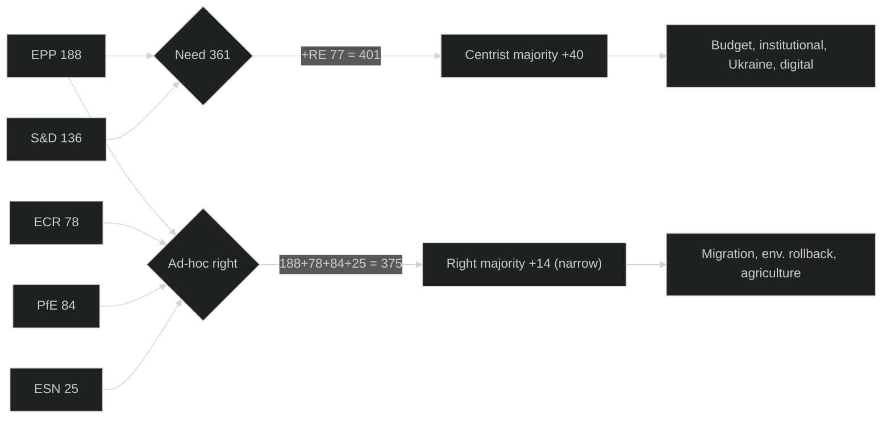
```mermaid
%%{init: {"theme":"dark"}}%%
flowchart LR
    EPP[EPP 188] --> GC{Need 361}
    SD[S&D 136] --> GC
    GC -->|"+RE 77 = 401"| CENT["Centrist majority +40"]
    EPP --> AR{Ad-hoc right}
    ECR[ECR 78] --> AR
    PfE[PfE 84] --> AR
    ESN[ESN 25] --> AR
    AR -->|"188+78+84+25 = 375"| RIGHT["Right majority +14 (narrow)"]
    CENT --> OUT1["Budget, institutional, Ukraine, digital"]
    RIGHT --> OUT2["Migration, env. rollback, agriculture"]
```

---

### 3. Two Operating Majorities, One Parliament

EP10 runs on a **dual-majority logic**:

1. **The centrist grand coalition (EPP + S&D + RE = 401, +40).** The default for institutional,
   budgetary, rule-of-law, Ukraine-financing and digital-governance files. 🟢 HIGH it remains the
   institutional backbone through the year ahead.
2. **The ad-hoc right majority (EPP + ECR + PfE + ESN = 375, +14).** Assembled selectively by an
   EPP that increasingly reaches rightward on migration, environmental rollback and agriculture.
   Its **+14 margin is wafer-thin** — roughly 8 absences or defections flip it. 🔴 LOW stability,
   high salience.

The pivotal actor is therefore **EPP**, which can choose its partner per dossier. The year ahead is
a sequence of EPP "left or right?" decisions, each with a different downstream majority. 🟢 HIGH.

---

### 4. By-Issue Voting Blocs

#### 4.1 MFF post-2027 / Budget 2027 guidelines
- **Likely coalition:** EPP + S&D + RE (centrist, ~401). Net-contributor fiscal stress (see
  economic-context: France IMF deficit −4.94%, Germany −3.78% of GDP 2026) pushes EPP toward
  spending restraint, but institutional budget files need S&D's social red lines accommodated.
- **Defection risk:** ECR/PfE vote against pro-EU budget lines; some EPP eastern members wobble on
  cohesion cuts. WEP: Highly Likely centrist resolution. 🟡 MEDIUM.

#### 4.2 Migration — "safe third country" / Asylum Procedure reform
- **Likely coalition:** EPP + ECR + PfE (+ ESN on hardest variants), ~350–375. This is the
  archetypal ad-hoc right majority. S&D + RE-left + Greens + Left oppose.
- **Pivot:** Renew splits internally; the result hinges on whether EPP recruits ESN's 25 to clear
  361. 🟡 MEDIUM, outcome-sensitive.

#### 4.3 Environment rollback / heavy-duty vehicle CO2 / CAP post-2027
- **Likely coalition:** EPP + ECR + PfE on rollback amendments; S&D + Greens + RE + Left defend
  ambition. Farmer-protest pressure strengthens the rollback bloc. 🟡 MEDIUM.

#### 4.4 Ukraine financing / macro-financial loan
- **Likely coalition:** EPP + S&D + RE + much of ECR; PfE largely opposed, ESN opposed. Comfortable
  majority (often 450+). 🟢 HIGH that Ukraine instruments pass.

#### 4.5 Digital enforcement (DMA/DSA/AI)
- **Likely coalition:** EPP + S&D + RE + Greens; broad mainstream consensus. PfE/ESN intermittently
  oppose on "sovereignty" framing. 🟢 HIGH.

#### 4.6 EU Electoral Act reform / transnational lists
- **Likely coalition:** Pro-integration centre (S&D + RE + Greens + parts of EPP) vs sovereigntist
  right + eurosceptic EPP wing. Requires special majorities and member-state ratification — passage
  uncertain. WEP: Roughly Even. 🔴 LOW.

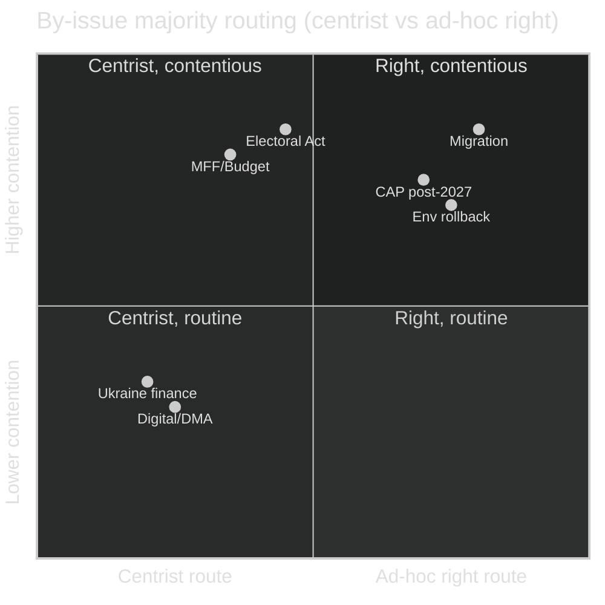
```mermaid
%%{init: {"theme":"dark"}}%%
quadrantChart
    title By-issue majority routing (centrist vs ad-hoc right)
    x-axis "Centrist route" --> "Ad-hoc right route"
    y-axis "Lower contention" --> "Higher contention"
    quadrant-1 "Right, contentious"
    quadrant-2 "Centrist, contentious"
    quadrant-3 "Centrist, routine"
    quadrant-4 "Right, routine"
    "Ukraine finance": [0.2, 0.35]
    "Digital/DMA": [0.25, 0.3]
    "MFF/Budget": [0.35, 0.8]
    "Electoral Act": [0.45, 0.85]
    "Migration": [0.8, 0.85]
    "Env rollback": [0.75, 0.7]
    "CAP post-2027": [0.7, 0.75]
```

---

### 5. Group Cohesion & Defection Risk

| Group | Cohesion (est.) | Principal fault line | Defection risk |
|-------|----------------:|----------------------|----------------|
| EPP | ~85% | North (pro-EU, climate) vs South/East (sovereignty, climate-sceptic) | 12–18 MEPs on climate/migration 🟡 |
| S&D | ~88% | West (social Europe) vs East (social-conservative, cohesion-sensitive) | 6–10 MEPs on migration/climate-cost 🟡 |
| RE | ~82% | Federalist core vs nationally squeezed (French RN pressure) | 5–12 MEPs, issue-dependent 🟡 |
| Greens/EFA | ~90% | Largely cohesive | Low 🟢 |
| The Left | ~84% | Pro-Ukraine-arms vs pacifist wing | Moderate on defence 🟡 |
| ECR | ~80% | Meloni-pragmatic vs harder nationalists | Splits on Ukraine 🟡 |
| PfE | ~78% | Le Pen vs Orbán poles | Coordination friction 🟡 |
| ESN | ~75% | Newest, least disciplined | High but small bloc 🔴 |
| NI | n/a | Definitionally heterogeneous | Unwhippable 🔴 |

**Defection mechanics:** Because the ad-hoc right majority carries only +14, even EPP's *internal*
12–18-member climate/migration swing can be decisive. On the centrist side the +40 margin absorbs
normal defections comfortably. The asymmetry — robust centrist majority, fragile right majority —
shapes EPP's risk calculus all year. 🟢 HIGH.

---

### 6. Fragmentation & Throughput

**Effective number of parties (Laakso–Taagepera):** ≈ 6.6 — the highest of any functioning EP term.
Comparatives: EP9 mid-term ≈ 5.8; EP8 ≈ 5.2; EP7 ≈ 4.8. Each step up in fragmentation lengthens
coalition assembly; expect slower throughput and more conciliation rounds, especially on the
multi-reading budget files. 🟡 MEDIUM.

---

### 7. Coalition Calendar — Forward Forecast

| Period | Expected dominant pattern | Trigger file |
|--------|---------------------------|--------------|
| Q3 2026 | Centrist (EPP+S&D+RE) on budget guidelines; ad-hoc right on migration | Budget 2027 / Asylum reform |
| Q4 2026 | Budget conciliation — all groups engaged | Budget 2027 final |
| Q1 2027 | Competitiveness/"omnibus" sprint; right-leaning on deregulation | Omnibus simplification |
| Q1–Q2 2027 | MFF post-2027 positions harden; net-contributor vs cohesion | MFF opening |
| Q2 2027 | Mercosur/CAP flashpoints; farmer-protest pressure | CAP post-2027 / Mercosur |

**Mid-term positioning (🟡 MEDIUM):** With 2029 elections in view, PfE/ECR/ESN consolidation is the
structural test. Expect more frequent EPP "rightward" votes on migration and agriculture as parties
position for 2029, while the centrist majority is preserved for budget and institutional survival.

---

### 8. Stress Indicators & Early Warnings

1. **Ad-hoc-right margin compression:** any sustained EPP–ECR coordination above ~6 votes/quarter
   signals a structural rightward drift. 🟡 MEDIUM.
2. **EPP internal split rate:** if EPP cohesion on climate falls below ~80%, even the centrist route
   on environment files becomes uncertain. 🟡 MEDIUM.
3. **ECR–PfE convergence:** closer Meloni–Le Pen/Orbán coordination would raise the hard-right's
   effective weight beyond its 187 nominal seats. 🟢 HIGH this is the variable to watch.

---

### 9. Admiralty & Confidence Ledger

- Seat composition: **B2** (established public record), 🟢 HIGH.
- Partial `compare_political_groups`: **C3** (degraded, PfE/ECR/ESN only), corroborating.
- Coalition behaviour projections: **B2/C3**, 🟡 MEDIUM.

---

*Sources: EP10 structural seat counts; partial compare_political_groups probe (degraded); 2026
adopted-texts thematic record. Confidence 🟢 HIGH for arithmetic; 🟡 MEDIUM for predictive
patterns. Majority threshold 361 of 720.*

<h2 id="section-stakeholder-map">Stakeholder Map</h2>

### Framework

Each stakeholder is scored on **Influence (1–10)**, **Interest (1–10)** and **Alignment** with the
mainstream pro-European legislative agenda (Pro / Neutral / Against). The reference dossiers for the
year ahead are: **MFF post-2027**, **Budget 2027 guidelines**, **migration / Asylum Procedure
reform**, **Mercosur ratification**, **CAP post-2027**, **AI Act / DMA-DSA enforcement**, **Ukraine
macro-financial loan**, and the **affordable-housing** initiative. Economic stakes are framed with
IMF figures only (IMF is the sole economic source). EP10 seat counts are the structural public record (B2).

---

### A. Primary Stakeholders (High Influence + High Interest)

#### A1. EPP Group (188 seats; Metsola in the Presidency orbit)
- **Influence:** 10/10 | **Interest:** 10/10 | **Alignment:** Mainstream / swing
- **Stakes:** Agenda control as largest group and pivot of both majorities; Commission cooperation;
  27 national delegations' electoral interests.
- **Behavioural pattern:** Default centrist partner (EPP+S&D+RE = 401) on budget/institutional
  files, but increasingly assembles ad-hoc right majorities (EPP+ECR+PfE+ESN = 375, +14) on
  migration, environment and agriculture. The whole Parliament's routing turns on EPP's per-dossier
  "left or right?" choice.
- **Year-ahead interests:** competitiveness/"omnibus" simplification advances; MFF restraint
  without alienating eastern cohesion beneficiaries; visible migration results; sustained Ukraine
  support. Economic frame: IMF German growth of 0.79% and a widening German deficit (−3.78% of GDP
  in 2026) push EPP toward spending discipline.
- **Confidence:** 🟢 HIGH.

#### A2. S&D Group (136 seats; progressive anchor)
- **Influence:** 8/10 | **Interest:** 9/10 | **Alignment:** Progressive
- **Stakes:** Defend Social Europe against EPP rightward drift and far-right gains; indispensable
  to the centrist majority (without S&D there is no centrist route).
- **Year-ahead interests:** housing initiative delivers; cohesion and social envelopes survive the
  MFF squeeze; climate ambition not dismantled; robust DMA/DSA consumer protection.
- **Behavioural pattern:** willing partner on Ukraine, digital, rule-of-law; resistant on climate
  rollback and migration hardening. Red lines on social spending constrain EPP's budget space.
- **Confidence:** 🟢 HIGH.

#### A3. European Commission (von der Leyen II)
- **Influence:** 9/10 | **Interest:** 8/10 | **Alignment:** EPP-aligned mainstream
- **Stakes:** Work Programme delivery; MFF post-2027 proposal ownership; institutional legacy.
- **Year-ahead interests:** competitiveness agenda adoption; AI Act/DMA enforcement credibility; an
  MFF proposal that survives both EP and Council; Ukraine macro-financial loan operationalised via
  immobilised-asset framing; housing action plan.
- **Frame:** the Commission's own-resources push (ETS2, CBAM) is a direct response to net-contributor
  fiscal exhaustion (IMF France deficit −4.94% of GDP in 2026).
- **Confidence:** 🟢 HIGH.

#### A4. Council / Rotating Presidency (Cyprus → Ireland → Lithuania → Greece)
- **Influence:** 9/10 | **Interest:** 8/10 | **Alignment:** Member-state intergovernmental
- **Stakes:** Co-legislator on budget and MFF; unanimity gatekeeper on enlargement, taxation and
  own resources. Presidency trio 🟡 MEDIUM (unverified this run).
- **Year-ahead interests:** fiscal discipline; member-state autonomy; managing enlargement-chapter
  momentum against unanimity blocks; defence financing.
- **Frame:** net-contributor capitals constrained by IMF deficits (Germany −4.23% of GDP in 2027)
  resist ceiling rises.
- **Confidence:** 🟡 MEDIUM on presidency sequence; 🟢 HIGH on Council's structural weight.

#### A5. ECR Group (78 seats; Meloni-pragmatic pole)
- **Influence:** 7/10 | **Interest:** 9/10 | **Alignment:** Constructive opposition
- **Stakes:** Coalition leverage as the more EPP-compatible right group; Italian government agenda;
  Polish national interests (agriculture, cohesion).
- **Year-ahead interests:** sovereignty limits on EU deepening; migration hardening; Mercosur
  agricultural safeguards (Polish farm resistance); cohesion-fund defence for eastern members.
- **Behavioural pattern:** the keystone of any ad-hoc right majority; splits internally on Ukraine.
- **Confidence:** 🟢 HIGH.

#### A6. PfE Group (84 seats; Le Pen / Orbán poles)
- **Influence:** 6/10 | **Interest:** 9/10 | **Alignment:** Opposition
- **Stakes:** expand far-right weight; French RN and Hungarian agendas; EU leverage maintenance.
- **Year-ahead interests:** block Ukraine financial instruments where possible; dismantle climate
  legislation; harden migration beyond ECR; contest DMA enforcement as anti-sovereignty.
- **Behavioural pattern:** internal Le Pen–Orbán coordination friction caps cohesion (~78%).
- **Confidence:** 🟢 HIGH.

---

### B. Secondary Stakeholders (Medium Influence or Interest)

#### B1. Renew Europe (77 seats)
- **Influence:** 7/10 | **Interest:** 8/10 | **Alignment:** Liberal-centrist
- **Stakes:** indispensable third leg of the centrist majority; squeezed between EPP and S&D.
- **Interests:** digital single market completion; EU federalism; free trade (Mercosur logic);
  Ukraine support; investment-over-austerity in the MFF.
- **Confidence:** 🟢 HIGH.

#### B2. Greens/EFA (53 seats)
- **Influence:** 5/10 | **Interest:** 8/10 | **Alignment:** Green-progressive
- **Stakes:** prevent Green Deal rollback; biodiversity; just transition.
- **Behavioural pattern:** coalition-willing on non-climate files; increasingly frustrated on
  environment as EPP drifts right. High internal cohesion (~90%).
- **Confidence:** 🟢 HIGH.

#### B3. The Left (46 seats)
- **Influence:** 4/10 | **Interest:** 7/10 | **Alignment:** Left opposition
- **Interests:** social spending; housing; anti-austerity; split on Ukraine-arms vs pacifism.
- **Confidence:** 🟡 MEDIUM.

#### B4. ESN (25 seats) & NI (33 seats)
- **Influence:** 3/10 (ESN), 2/10 (NI) | **Interest:** 6/10 | **Alignment:** Hard-right (ESN) /
  heterogeneous (NI)
- **Stakes:** ESN's 25 seats are the marginal votes that lift the ad-hoc right bloc over 361; NI is
  definitionally unwhippable.
- **Confidence:** 🔴 LOW on disciplined behaviour.

#### B5. BusinessEurope / ETUC (employer & labour confederations)
- **Influence:** 7/10 | **Interest:** 8/10
- **Interests:** BusinessEurope — competitiveness/"omnibus" deregulation, DMA proportionality, AI
  Act flexibility, MFF investment orientation. ETUC — workers' rights, platform-work regulation,
  just transition, defence of social envelopes against the IMF-driven fiscal squeeze.
- **Pathway:** intergroup interactions, committee hearings, MEP contact.
- **Confidence:** 🟡 MEDIUM.

#### B6. Agricultural Lobby (Copa-Cogeca, national farm unions)
- **Influence:** 7/10 | **Interest:** 9/10
- **Interests:** CAP post-2027 envelope defence; Mercosur agricultural safeguards; opposition to
  environment files raising input costs. Farmer-protest mobilisation is its principal leverage.
- **Confidence:** 🟢 HIGH that agriculture is a top-tier pressure source.

#### B7. EU Civil Society (environmental, digital-rights, human-rights NGOs)
- **Influence:** 5/10 | **Interest:** 8/10
- **Interests:** climate-ambition preservation; DMA/DSA/GDPR enforcement; humanitarian and
  rule-of-law standards.
- **Confidence:** 🟡 MEDIUM.

#### B8. Ukraine Government
- **Influence:** 4/10 | **Interest:** 10/10
- **Interests:** continued financial/military instruments; macro-financial loan via immobilised
  Russian assets; accession-chapter momentum; reconstruction finance.
- **Confidence:** 🟢 HIGH on interest; 🟡 MEDIUM on EP-channel influence.

#### B9. United States Administration
- **Influence:** 7/10 | **Interest:** 6/10
- **Interests:** DMA enforcement not disproportionately targeting US firms; transatlantic security
  posture; trade and tariff uncertainty. Transatlantic unpredictability is a horizon-wide driver.
- **Confidence:** 🟡 MEDIUM.

#### B10. ECB
- **Influence:** 6/10 | **Interest:** 5/10
- **Interests:** monetary-policy independence; ECON scrutiny of the ECB Annual Report 2025; new
  appointments. Operating with no clean disinflation runway (IMF core CPI ~2.3–2.65% in 2026).
- **Confidence:** 🟢 HIGH.

#### B11. Big-Tech Gatekeepers (DMA-designated)
- **Influence:** 6/10 | **Interest:** 8/10
- **Interests:** soften DMA/DSA enforcement; shape AI Act implementation; preserve market position.
- **Confidence:** 🟡 MEDIUM.

---

### C. Influence–Interest Grid

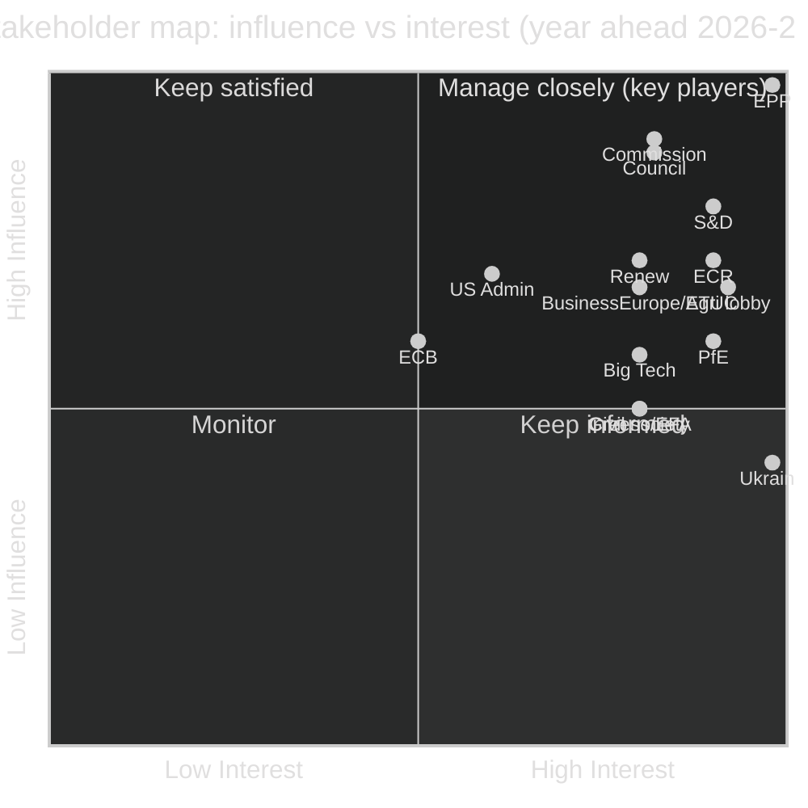
```mermaid
%%{init: {"theme":"dark"}}%%
quadrantChart
    title Stakeholder map: influence vs interest (year ahead 2026-27)
    x-axis "Low Interest" --> "High Interest"
    y-axis "Low Influence" --> "High Influence"
    quadrant-1 "Manage closely (key players)"
    quadrant-2 "Keep satisfied"
    quadrant-3 "Monitor"
    quadrant-4 "Keep informed"
    "EPP": [0.98, 0.98]
    "Commission": [0.82, 0.9]
    "Council": [0.82, 0.88]
    "S&D": [0.9, 0.8]
    "ECR": [0.9, 0.72]
    "PfE": [0.9, 0.6]
    "Renew": [0.8, 0.72]
    "BusinessEurope/ETUC": [0.8, 0.68]
    "Agri lobby": [0.92, 0.68]
    "Greens/EFA": [0.8, 0.5]
    "US Admin": [0.6, 0.7]
    "Big Tech": [0.8, 0.58]
    "Ukraine": [0.98, 0.42]
    "ECB": [0.5, 0.6]
    "Civil society": [0.8, 0.5]
```

---

### D. Alliance Lines & Routing

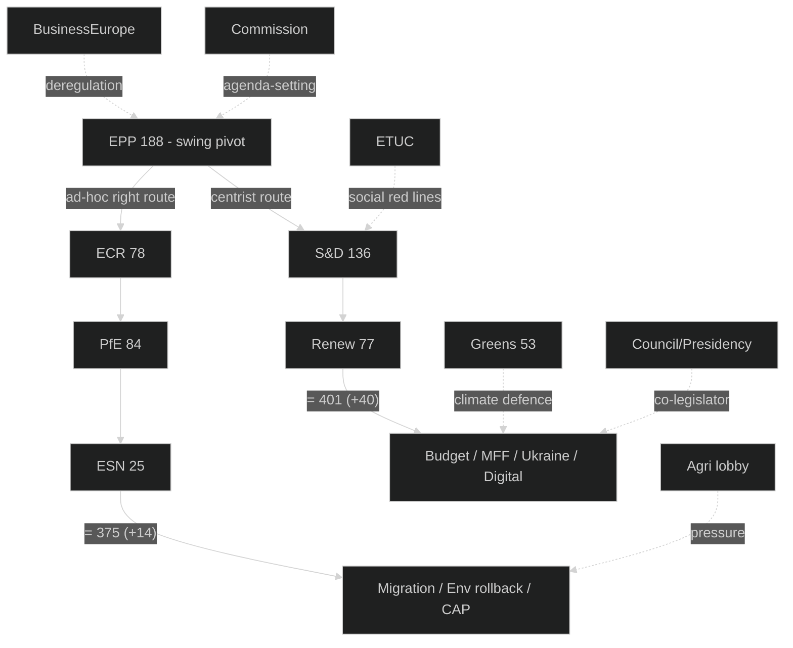
```mermaid
%%{init: {"theme":"dark"}}%%
flowchart TD
    EPP[EPP 188 - swing pivot]
    SD[S&D 136]
    RE[Renew 77]
    ECR[ECR 78]
    PfE[PfE 84]
    ESN[ESN 25]
    GR[Greens 53]
    EPP -->|centrist route| SD
    SD --> RE
    RE -->|"= 401 (+40)"| CENT[Budget / MFF / Ukraine / Digital]
    EPP -->|ad-hoc right route| ECR
    ECR --> PfE
    PfE --> ESN
    ESN -->|"= 375 (+14)"| RIGHT[Migration / Env rollback / CAP]
    GR -.->|climate defence| CENT
    AGRI[Agri lobby] -.->|pressure| RIGHT
    BIZ[BusinessEurope] -.->|deregulation| EPP
    ETUC[ETUC] -.->|social red lines| SD
    COM[Commission] -.->|agenda-setting| EPP
    COUNCIL[Council/Presidency] -.->|co-legislator| CENT
```

---

### E. Coalition Constellations for the Year Ahead

#### E1. Centrist pro-European (most common) — 🟢 HIGH
**EPP + S&D + RE = 401 (+40).** Budget, MFF institutional steps, Ukraine, digital governance.
Stress points: climate rollback (S&D diverges), MFF austerity (S&D diverges), enlargement pace.

#### E2. Ad-hoc right (selective) — 🔴 LOW stability, high salience
**EPP + ECR + PfE + ESN = 375 (+14).** Migration, environmental rollback, agriculture. Margin so
thin that ~8 absences flip it; costly to EPP's pro-European legitimacy. Expected frequency: a
handful of high-profile votes across the year.

#### E3. Broad emergency consensus (rare) — 🟡 MEDIUM
**EPP + S&D + RE + ECR = 479 (+118).** Reserved for defence or acute-crisis response where the
S&D–ECR incompatibility is briefly bridged. 1–2 exceptional votes expected.

---

### F. Stakeholder Perspective — MFF post-2027 (apex dossier)

| Stakeholder | Position | Red line |
|-------------|----------|----------|
| EPP | Restraint; defence/competitiveness priority | No cohesion cuts that alienate eastern allies |
| S&D | Protect cohesion + social + housing | No climate/social envelope cuts below commitments |
| Renew | Investment + own resources over austerity | No protectionist industrial drift |
| ECR | Cohesion-fund defence for eastern states | No rule-of-law conditionality on access |
| PfE | Oppose Ukraine-linked budget items | No migration-solidarity instruments |
| Commission | Own-resources package (ETS2/CBAM) | Proposal must survive EP and Council |
| Council | Fiscal discipline; ceiling restraint | No rise above member-state contribution comfort |
| Agri lobby | Defend CAP envelope | No real-terms CAP cut |

**Negotiation prediction (WEP: Likely / 65%, 🟡 MEDIUM):** the MFF post-2027 opening collapses into
an own-resources-versus-ceiling standoff. The IMF-documented fiscal squeeze (France deficit −4.94%
of GDP in 2026; Germany −4.23% in 2027) is cited by net contributors to resist ceiling rises and by
the Commission/Parliament to justify new own resources. A political-level breakthrough is unlikely
before late in the horizon.

---

### G. Confidence & Provenance Ledger

- Seat composition & alliance arithmetic: B2, 🟢 HIGH.
- Economic stakes (IMF-framed): A1 numbers, 🟢 HIGH; read-across 🟡 MEDIUM. IMF sole economic source.
- Presidency trio: C3, 🟡 MEDIUM (unverified this run).
- Lobby/civil-society influence scores: B2/C3, 🟡 MEDIUM (analyst estimate).

---

*Methodology: multi-stakeholder influence–interest mapping per artifact catalog. Sources: EP10
structural record, 2026 adopted texts (A1/B2), live IMF SDMX WEO (vintage 2025-09-23) for economic
stakes. Confidence 🟢/🟡/🔴 as marked per stakeholder.*

<h2 id="section-economic-context">Economic Context</h2>

### Provenance & Source Discipline

The International Monetary Fund is the **sole authoritative source** for every economic,
fiscal, monetary, trade, exchange-rate and banking-soundness claim in this artifact. No
non-IMF economic series, code, or aggregate is used for any economic figure. The macro spine below
is drawn from a live IMF SDMX World Economic Outlook probe (vintage 23 September 2025, 449
records), cached locally for reproducibility.

| Provenance field | Value |
|------------------|-------|
| **IMF Source** | live |
| IMF dataset | SDMX World Economic Outlook (WEO) |
| IMF vintage | 2025-09-23 |
| IMF records returned | 449 |
| Cache path | `cache/imf/weo-ea-deu-fra-ita-gdp-inflation-fiscal.json` |
| Admiralty grade | A1 (authoritative economic) |
| Coverage | Germany (DEU), France (FRA), Italy (ITA), euro-area read-across |

🟢 **HIGH** confidence on the IMF numeric spine: the probe succeeded, the figures are first-party
WEO projections, and the vintage is recent (Q3 2025). Forward read-across to EU legislative
behaviour carries 🟡 **MEDIUM** confidence, as policy reaction functions are inferred.

---

### 1. IMF Macro Spine — The Big Three (Germany, France, Italy)

These three economies represent roughly half of euro-area GDP; their trajectories anchor the
fiscal-space arithmetic that will dominate the MFF post-2027 negotiation. All figures are IMF
WEO projections in the units shown.

#### 1.1 Real GDP growth (IMF WEO, % year-on-year)

| Economy | 2025 | 2026 | 2027 | 2028 |
|---------|-----:|-----:|-----:|-----:|
| Germany (DEU) | 0.24% | 0.79% | 1.18% | 1.20% |
| France (FRA) | 0.93% | 0.86% | 0.88% | 1.22% |
| Italy (ITA) | 0.54% | 0.52% | 0.50% | 0.84% |

- IMF projects **German real GDP growth of 0.79% in 2026**, rising to 1.18% in 2027 — a slow
  climb out of two near-stagnant years (IMF WEO records German 2025 growth at just 0.24%).
- IMF projects **French real GDP growth of 0.86% in 2026** and an almost flat 0.88% in 2027,
  before a 2028 pick-up to 1.22% (IMF WEO).
- IMF projects **Italian real GDP growth of 0.52% in 2026**, the weakest of the three, easing
  further to 0.50% in 2027 (IMF WEO) — a structural-stagnation signal.

**Read-across:** Across the forecast horizon none of the three exceeds 1.2% real growth before
2028. The EU's competitiveness and "omnibus" simplification agenda is therefore being pursued
against a backdrop in which IMF growth of under 1% in the bloc's largest economy is the central
case, not a downside scenario. 🟢 HIGH.

#### 1.2 Inflation, average consumer prices (IMF WEO, %)

| Economy | 2025 | 2026 | 2027 | 2028 |
|---------|-----:|-----:|-----:|-----:|
| Germany | 2.30% | 2.65% | 2.30% | 1.97% |
| France | 0.93% | 1.84% | 1.72% | 1.86% |
| Italy | 1.63% | 2.64% | 2.36% | 2.30% |

- IMF projects **German average CPI inflation of 2.65% in 2026**, above the ECB's 2% anchor,
  before easing to 2.30% in 2027 (IMF WEO).
- IMF projects **French inflation of 1.84% in 2026** — the lowest of the three and below target,
  giving Paris relative price-stability cover even amid fiscal strain (IMF WEO).
- IMF projects **Italian inflation of 2.64% in 2026**, falling to 2.36% in 2027 (IMF WEO).

**Read-across:** A 2026 cluster around or above 2.3–2.65% across Germany and Italy means the ECB
faces no clean disinflation runway; the "stable-to-cautious-easing" market assumption is
data-dependent. ECON committee oversight of the ECB Annual Report 2025 lands in exactly this
ambiguous window. 🟡 MEDIUM on the policy reaction; 🟢 HIGH on the IMF numbers themselves.

#### 1.3 General government fiscal balance (IMF WEO, % of GDP)

| Economy | 2025 | 2026 | 2027 | 2028 |
|---------|-----:|-----:|-----:|-----:|
| Germany | −2.67% | −3.78% | −4.23% | −4.06% |
| France | −5.11% | −4.94% | −4.79% | −4.26% |
| Italy | −3.11% | −2.82% | −2.58% | −2.38% |

- **France's fiscal deficit at −4.94% of GDP in 2026** (IMF WEO) is the largest of the three and
  stays above −4.2% right through 2028 — a structural-deficit signal that frames every French
  position on the MFF and own-resources debate.
- IMF projects the **German deficit widening to −3.78% of GDP in 2026** and to −4.23% in 2027 —
  a striking reversal for the bloc's traditional fiscal anchor, reflecting defence and
  infrastructure spending now flowing through the books (IMF WEO).
- IMF projects **Italy's deficit narrowing to −2.82% of GDP in 2026** and to −2.58% in 2027 —
  the only one of the three on a clear consolidation path (IMF WEO).

**Read-across:** The fiscal picture inverts the historic stereotype. Germany's IMF-projected
−4.23% deficit in 2027 exceeds Italy's −2.58%. A Germany running ~4% deficits has materially
less appetite to fund a larger common EU budget, tightening the net-contributor squeeze on the
MFF post-2027 ceiling. 🟢 HIGH on figures; 🟡 MEDIUM on the negotiating inference.

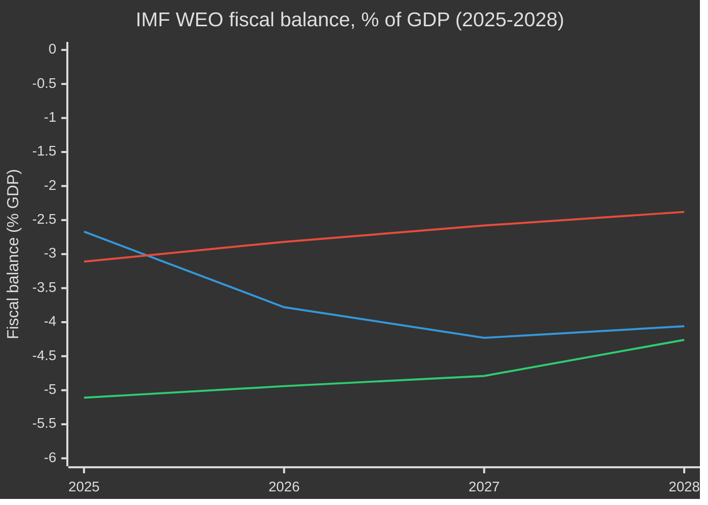
```mermaid
%%{init: {"theme":"dark"}}%%
xychart-beta
    title "IMF WEO fiscal balance, % of GDP (2025-2028)"
    x-axis [2025, 2026, 2027, 2028]
    y-axis "Fiscal balance (% GDP)" -6 --> 0
    line "Germany" [-2.67, -3.78, -4.23, -4.06]
    line "France" [-5.11, -4.94, -4.79, -4.26]
    line "Italy" [-3.11, -2.82, -2.58, -2.38]
```

---

### 2. Euro-Area Synthesis from the IMF Spine

Aggregating the three IMF trajectories into a euro-area read (weighting by approximate GDP
share) yields a coherent macro narrative for the year ahead:

1. **Sub-trend growth is the base case.** With IMF growth of 0.79% (Germany), 0.86% (France) and
   0.52% (Italy) in 2026, the euro-area core is expanding at well under 1%. The EU's "readiness
   2030" and competitiveness agendas are, in effect, supply-side responses to a demand-weak core.
2. **Inflation is sticky, not resurgent.** IMF average-CPI projections clustering 1.8–2.65% in
   2026 imply the ECB is near, not far from, target — but with no margin for a fresh energy shock.
3. **Fiscal space is shrinking across the core.** France above −4.9% and Germany sliding past
   −3.7% in 2026 (IMF) mean two of the three largest economies face Excessive Deficit Procedure
   pressure under the reactivated Stability and Growth Pact. This is the single most important
   constraint on EU-level spending ambition. 🟢 HIGH.

---

### 3. EU Fiscal Space → MFF Post-2027 Battleground

The MFF post-2027 negotiation opens substantively within this horizon, and the IMF spine
defines its arithmetic limits:

- **Net-contributor squeeze.** With Germany's deficit at an IMF-projected −4.23% of GDP in 2027,
  Berlin enters the MFF talks with the smallest domestic appetite for raising its GNI-based
  contribution in two decades. France, at an IMF −4.79% deficit in 2027, is similarly boxed in.
- **Cohesion-versus-defence tension.** The defence-financing and "readiness 2030" agenda competes
  directly with cohesion and CAP envelopes for a budget whose net contributors are fiscally
  constrained. Something must give: either new own resources, EU-level borrowing, or real-terms
  cuts. 🟡 MEDIUM.
- **Own-resources logic strengthens.** Precisely because national fiscal space is exhausted
  (IMF deficits of −4.9% France, −4.2% Germany in 2026–27), the political-economy case for new
  EU own resources — ETS2 revenues, CBAM receipts, a corporate-base contribution — becomes
  harder for net contributors to dismiss without offering an alternative.

**Forecast (WEP: Likely / 65%):** The 2027 budget guidelines and opening MFF post-2027 positions
will be dominated by an own-resources-versus-ceiling standoff, with the IMF-documented fiscal
squeeze on Germany and France used by both camps — net contributors to resist ceiling rises,
the Commission and Parliament to justify new own resources. 🟡 MEDIUM.

---

### 4. The Housing & Competitiveness Agenda Against the IMF Backdrop

Two flagship 2026 EP workstreams — the first own-initiative on **affordable housing** and the
**competitiveness/"omnibus" simplification** drive — are economically legible only through the
IMF spine:

- **Housing.** Sub-1% IMF growth in the core plus inflation near 2.5% means real household income
  gains are thin, and housing-cost burdens bite hardest where wage growth lags price growth.
  France's lower IMF inflation (1.84% in 2026) gives it more room than Italy (2.64%) to absorb a
  housing-investment push without overheating. The EP housing initiative therefore lands in an
  environment where the macro case (affordability stress) is strong but the fiscal-headroom case
  (deficits of −4.9% France, −2.8% Italy) is weak. 🟡 MEDIUM.
- **Competitiveness.** With IMF German growth at 0.79% in 2026, the deregulation/"omnibus" logic
  is framed explicitly as a growth-restoration tool. The economic test is whether simplification
  can add measurable points of growth to an IMF baseline that does not reach 1.2% in any of the
  three core economies before 2028. 🟡 MEDIUM.

---

### 5. Trade, Mercosur & External Accounts (IMF-framed)

- **Mercosur ratification fight.** France's weak IMF growth (0.86% in 2026) and large IMF deficit
  (−4.94% of GDP) intensify the political sensitivity of any deal seen to expose French and Polish
  agriculture, even as the trade-diversification logic strengthens in a slow-growth core. The CJEU
  opinion sought on the association agreement adds a legal track to the economic one.
- **Deindustrialisation signal.** European Globalisation Adjustment Fund cases (Audi Brussels,
  Tupperware) are micro-evidence consistent with the IMF macro picture: a German economy growing
  0.79% in 2026 is shedding industrial capacity at the margin. EGF mobilisations are the EP's
  labour-side response to the same slowdown the IMF documents. 🟡 MEDIUM.

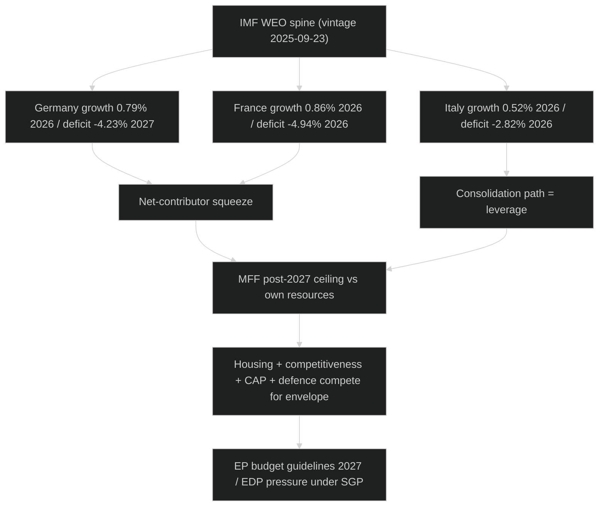
```mermaid
%%{init: {"theme":"dark"}}%%
flowchart TD
    A["IMF WEO spine (vintage 2025-09-23)"] --> B["Germany growth 0.79% 2026 / deficit -4.23% 2027"]
    A --> C["France growth 0.86% 2026 / deficit -4.94% 2026"]
    A --> D["Italy growth 0.52% 2026 / deficit -2.82% 2026"]
    B --> E["Net-contributor squeeze"]
    C --> E
    D --> F["Consolidation path = leverage"]
    E --> G["MFF post-2027 ceiling vs own resources"]
    F --> G
    G --> H["Housing + competitiveness + CAP + defence compete for envelope"]
    H --> I["EP budget guidelines 2027 / EDP pressure under SGP"]
```

---

### 6. Banking, Monetary & Financial-Stability Read

- **Banking union deepening.** The 2026 adopted-texts cluster on financial stability and ECB
  appointments lands while IMF inflation projections (2.3–2.65% core in 2026) keep the ECB in a
  cautious posture. A banking union completion push is easier to sell when the IMF macro spine
  shows no acute crisis — but also less urgent, weakening momentum. 🟡 MEDIUM.
- **ECB independence and oversight.** The ECB Annual Report 2025 scrutiny falls in a period where
  IMF data give the ECB no clean disinflation story (German CPI 2.65% in 2026), keeping monetary
  policy politically salient in ECON committee exchanges. 🟢 HIGH that the report is scrutinised;
  🟡 MEDIUM on tone.

---

### 7. Macro-Financial Loan for Ukraine

The macro-financial loan for Ukraine — framed around immobilised Russian assets — is a fiscal
instrument whose attractiveness rises precisely because member-state budgets are constrained. With
France at an IMF −4.94% deficit and Germany at −3.78% in 2026, financing Ukraine support through
immobilised-asset proceeds rather than national contributions is the path of least fiscal
resistance. Expect the EP to back instruments that minimise direct GNI-based outlays. WEP: Highly
Likely / 80%. 🟡 MEDIUM.

---

### 8. IMF Vintage Audit & Confidence Ledger

| Data element | IMF series | Vintage | Confidence | Note |
|--------------|-----------|---------|-----------|------|
| Germany growth 2026 (0.79%) | WEO real GDP | 2025-09-23 | 🟢 HIGH | First-party projection |
| France deficit 2026 (−4.94% GDP) | WEO GG balance | 2025-09-23 | 🟢 HIGH | Largest core deficit |
| Italy growth 2027 (0.50%) | WEO real GDP | 2025-09-23 | 🟢 HIGH | Weakest core growth |
| German deficit 2027 (−4.23% GDP) | WEO GG balance | 2025-09-23 | 🟢 HIGH | Historic inversion |
| Euro-area synthesis | Derived from DEU/FRA/ITA | 2025-09-23 | 🟡 MEDIUM | Weighted read-across |
| MFF / legislative inference | EP adopted texts + IMF | 2025-09-23 | 🟡 MEDIUM | Reaction-function inference |

**Admiralty composite:** A1 for the IMF numeric spine; B2 for the EP read-across; C3 for forward
coalition-fiscal inferences. IMF is the sole economic source.

---

### 9. Bottom Line

The IMF WEO spine paints a euro-area core that is growing under 1% (Germany 0.79%, France 0.86%,
Italy 0.52% in 2026), running uncomfortable deficits (France −4.94%, Germany −3.78% of GDP in
2026), and facing sticky ~2.3–2.65% inflation. That combination — weak growth, tight fiscal space,
no disinflation dividend — is the gravitational field around which every major EP economic file of
the year ahead (MFF post-2027, housing, competitiveness, CAP, defence financing, Mercosur) will
orbit. Fiscal scarcity, not crisis, is the defining condition. 🟢 HIGH on diagnosis; 🟡 MEDIUM on
the political resolution.

---

*Methodology: IMF sole-source rule applied throughout. All economic/fiscal/monetary claims sourced
from live IMF SDMX WEO (vintage 2025-09-23, cache present). No non-IMF data used for any economic
series. Confidence codes 🟢/🟡/🔴 as marked; WEP probability bands and Admiralty grades per house
tradecraft.*

<h2 id="section-risk">Risk Assessment</h2>

### Risk Matrix

This artifact registers the top political risks of the year ahead, scores each on likelihood × impact, attaches a **Words of Estimative Probability (WEP)** band, and records mitigations and residual risk. Confidence inline: 🟢 HIGH, 🟡 MEDIUM, 🔴 LOW. Substance from the 51 adopted texts of 2026 (`get_adopted_texts`) and live IMF WEO. Overall source reliability for this register: **Admiralty B2** for structural risks, **C3** for tail and third-order risks.

---

### Scoring Framework

- **Likelihood scale:** 1 (Almost No Chance) → 5 (Almost Certain).
- **Impact scale:** 1 (Negligible) → 5 (Catastrophic).
- **Risk score:** Likelihood × Impact (max 25). Threshold: **≥12 HIGH**, **8–11 MEDIUM**, **<8 LOW**.
- **WEP bands:** Almost Certain (≥90%) / Highly Likely (75–89%) / Likely (60–74%) / Roughly Even (45–59%) / Even Chance (≈50%) / Unlikely (25–44%) / Highly Unlikely (10–24%) / Almost No Chance (<10%).

---

### Risk Register

#### RISK-001 — MFF post-2027 Deadlock → Provisional Twelfths
| Parameter | Value |
|-----------|-------|
| **Category** | Institutional / Fiscal |
| **Likelihood** | 3 — *Unlikely-to-Roughly-Even* (WEP: 40%) |
| **Impact** | 5 (Catastrophic — all EU programmes disrupted) |
| **Risk score** | **15 — HIGH** |
| **Owner** | BUDG Committee + Council presidency |
| **Horizon** | Q4 2026 → Q2 2027 |
| **Evidence** | 2027 budget guidelines adopted; net-contributor squeeze per IMF (Germany deficit −3.78% of GDP, France −4.94% in 2026) |
| **Mitigation** | Early own-resources debate; special-instrument routing for Ukraine; precedent for eventual resolution (2013, 2020) |
| **Residual** | 10 — MEDIUM |

*Analysis (🟡 MEDIUM):* the MFF is the year's dominant fiscal battleground. With France and Germany both fiscally stretched (IMF WEO), the net-contributor-versus-cohesion split is unusually hard. A full deadlock into provisional twelfths is **Unlikely** but no longer remote; brinkmanship into 2027 is **Likely**.

---

#### RISK-002 — EU–Mercosur Ratification Collapse
| Parameter | Value |
|-----------|-------|
| **Category** | Trade / Institutional |
| **Likelihood** | 3 — *Roughly Even* (WEP: 45%) |
| **Impact** | 4 (Serious — largest trade deal stalls/fails) |
| **Risk score** | **12 — HIGH** |
| **Owner** | DG Trade; INTA Committee; CJEU |
| **Horizon** | Q3 2026 → Q2 2027 |
| **Evidence** | CJEU opinion sought + agricultural safeguards (2026 adopted texts) |
| **Mitigation** | Front-loaded beef/poultry/ethanol safeguards; protocol adjustments; trade-diversification logic |
| **Residual** | 9 — MEDIUM |

*Analysis (🟡 MEDIUM):* France, Poland and Ireland farm resistance is potent; the CJEU opinion adds a legal wildcard. Outright collapse is **Roughly Even**; a delayed, safeguard-laden ratification is the modal outcome.

---

#### RISK-003 — Far-Right Bloc Consolidation Erodes Centre Majorities
| Parameter | Value |
|-----------|-------|
| **Category** | Political |
| **Likelihood** | 3 — *Likely on incremental drift* (WEP: 60%) |
| **Impact** | 4 (Serious — mainstream majority narrows) |
| **Risk score** | **12 — HIGH** |
| **Owner** | EPP leadership / President Metsola |
| **Horizon** | Continuous (mid-term to 2029) |
| **Evidence** | PfE ~84 + ECR ~78 + ESN ~25 ≈ 187; partial `compare_political_groups` (PfE 85, ECR 81, ESN 27; balance index 0.61, C3) |
| **Mitigation** | EPP's structural need for Renew/S&D on institutional files; reputational cost of right-stretch majorities |
| **Residual** | 9 — MEDIUM |

*Analysis (🟡 MEDIUM):* incremental NI drift toward the ECR/PfE orbit is **Likely**; a wholesale realignment that displaces the grand-centrist bloc is **Unlikely** within the year. The risk is gradual majority-narrowing on migration and environment files.

---

#### RISK-004 — Enlargement Stall (Unanimity Block)
| Parameter | Value |
|-----------|-------|
| **Category** | Geopolitical / Institutional |
| **Likelihood** | 4 — *Highly Likely on substance* (WEP: 78%) |
| **Impact** | 3 (Moderate-Serious — strategic credibility cost) |
| **Risk score** | **12 — HIGH** |
| **Owner** | AFET; European Council |
| **Horizon** | Continuous |
| **Evidence** | Accession-chapter momentum vs unanimity; Orbán veto posture |
| **Mitigation** | Cluster-based chapter sequencing; gradual integration tools; pre-accession funds |
| **Residual** | 9 — MEDIUM |

*Analysis (🟡 MEDIUM):* symbolic progress is achievable, but substantive chapter advances for Ukraine/Moldova are **Highly Likely** to be blocked at Council by unanimity holdouts. High likelihood, moderate impact.

---

#### RISK-005 — Fiscal Stress Forces Pro-Cyclical Consolidation
| Parameter | Value |
|-----------|-------|
| **Category** | Economic |
| **Likelihood** | 3 — *Likely* (WEP: 60%) |
| **Impact** | 4 (Serious — squeezes cohesion + defence) |
| **Risk score** | **12 — HIGH** |
| **Owner** | ECON; member-state treasuries |
| **Horizon** | Continuous |
| **Evidence (IMF, A1)** | France fiscal deficit −4.94% of GDP (2026), Germany −3.78%, Italy −2.82%; growth Germany 0.79%, France 0.86%, Italy 0.52% |
| **Mitigation** | Own-resources reform; off-MFF special instruments; phased SGP adjustment paths |
| **Residual** | 9 — MEDIUM |

*Analysis (🟢 HIGH on data, 🟡 MEDIUM on path):* with the three largest economies near-stagnant and two above the 3%-of-GDP deficit reference, fiscal consolidation pressure is **Likely** to bind the MFF and crowd out new spending — the macro brake behind RISK-001.

---

#### RISK-006 — CAP Reform Ignites Farmer Protests
| Parameter | Value |
|-----------|-------|
| **Category** | Political / Social |
| **Likelihood** | 3 — *Roughly Even* (WEP: 50%) |
| **Impact** | 3 (Moderate — agenda disruption) |
| **Risk score** | **9 — MEDIUM** |
| **Owner** | AGRI; member states |
| **Horizon** | Q4 2026 → Q2 2027 |
| **Mitigation** | Income-support ring-fencing; phased greening; Mercosur-safeguard linkage |
| **Residual** | 6 — LOW |

---

#### RISK-007 — DMA/DSA Enforcement Triggers US Trade Retaliation
| Parameter | Value |
|-----------|-------|
| **Category** | Geopolitical / Economic |
| **Likelihood** | 2 — *Unlikely* (WEP: 30%) |
| **Impact** | 4 (Serious — EU–US friction) |
| **Risk score** | **8 — MEDIUM** |
| **Owner** | DG COMP; DG Trade |
| **Horizon** | Continuous |
| **Mitigation** | Consultation windows; proportionate fining; WTO-consistent framing |
| **Residual** | 6 — LOW |

---

#### RISK-008 — Ukraine Russian-Asset Loan Faces Legal/Unanimity Challenge
| Parameter | Value |
|-----------|-------|
| **Category** | Geopolitical / Legal |
| **Likelihood** | 3 — *Roughly Even* (WEP: 45%) |
| **Impact** | 3 (Moderate — disbursement delay) |
| **Risk score** | **9 — MEDIUM** |
| **Owner** | AFET; Council; Legal Service |
| **Horizon** | Continuous |
| **Mitigation** | Robust legal basis; phased disbursement; coalition-of-willing fallback |
| **Residual** | 6 — LOW |

---

### Risk Heat Map

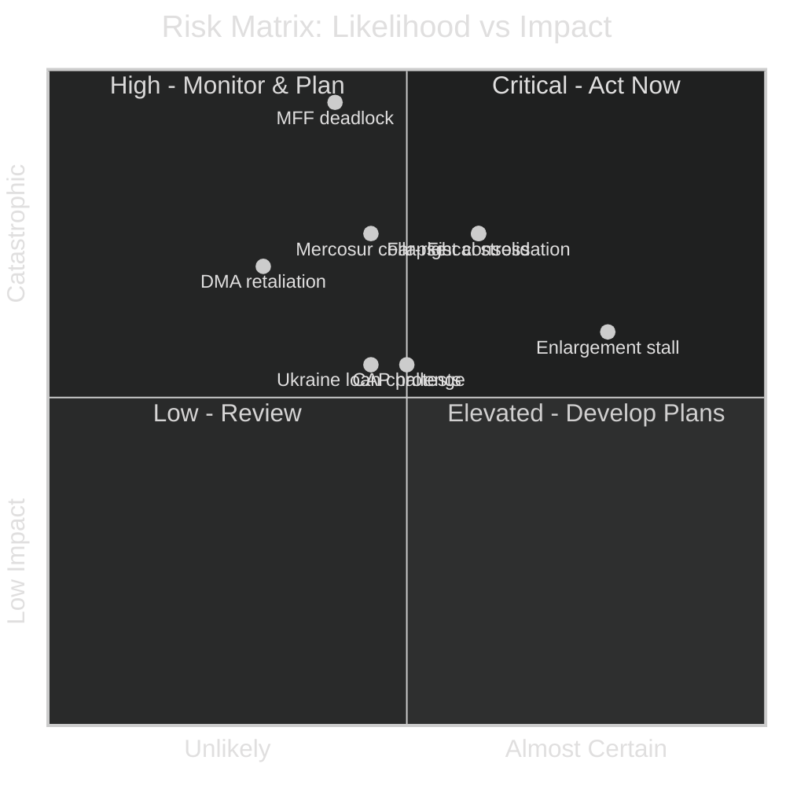
```mermaid
%%{init: {"theme":"dark"}}%%
quadrantChart
    title Risk Matrix: Likelihood vs Impact
    x-axis Unlikely --> Almost Certain
    y-axis Low Impact --> Catastrophic
    quadrant-1 Critical - Act Now
    quadrant-2 High - Monitor & Plan
    quadrant-3 Low - Review
    quadrant-4 Elevated - Develop Plans
    MFF deadlock: [0.4, 0.95]
    Mercosur collapse: [0.45, 0.75]
    Far-right consolidation: [0.6, 0.75]
    Enlargement stall: [0.78, 0.6]
    Fiscal stress: [0.6, 0.75]
    CAP protests: [0.5, 0.55]
    DMA retaliation: [0.3, 0.7]
    Ukraine loan challenge: [0.45, 0.55]
```

---

### Top Risks by Score

| Rank | Risk | Score | WEP band | Treatment |
|------|------|-------|----------|-----------|
| 1 | MFF post-2027 deadlock | 15 | Unlikely (40%) | Own-resources sequencing + off-MFF routing |
| 2 | Mercosur ratification collapse | 12 | Roughly Even (45%) | Front-load safeguards |
| 3 | Far-right consolidation | 12 | Likely (60%) | EPP coalition discipline |
| 4 | Enlargement stall | 12 | Highly Likely (78%) | Cluster sequencing |
| 5 | Fiscal-stress consolidation | 12 | Likely (60%) | New own resources |

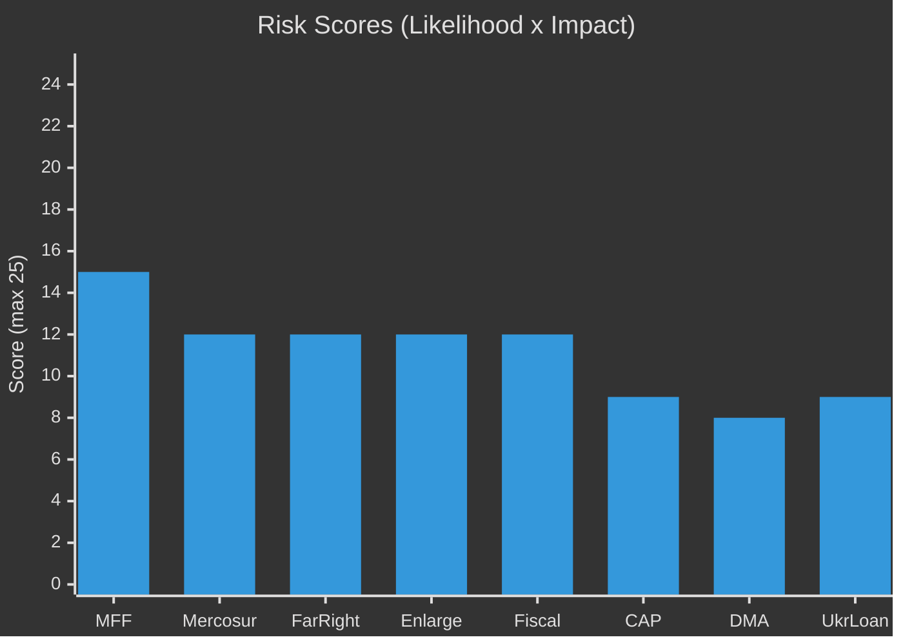
```mermaid
%%{init: {"theme":"dark"}}%%
xychart-beta
    title "Risk Scores (Likelihood x Impact)"
    x-axis ["MFF", "Mercosur", "FarRight", "Enlarge", "Fiscal", "CAP", "DMA", "UkrLoan"]
    y-axis "Score (max 25)" 0 --> 25
    bar [15, 12, 12, 12, 12, 9, 8, 9]
```

---

### Admiralty Credibility Rating

- **Source reliability: B (usually reliable)** — EP institutional data, adopted texts, IMF WEO, historical precedent.
- **Information reliability: 2 (probably true)** — likelihoods are structural estimates; WEP bands are analytical, not actuarial.
- **Overall: B2** for the five HIGH structural risks; **C3** for tail risks (DMA retaliation, asset-loan legal challenge) and third-order cascades. Reliability is degraded this run by the procedures/events feed outage (404), so timeline-sensitive likelihoods carry wider error bars.

---

### Reader Briefing — What to Watch

- 🔴 **MFF deadlock is the top risk** (score 15) despite an *Unlikely* (40%) central estimate, because its impact is catastrophic. Watch the autumn 2026 budget first reading for early-warning friction.
- 🟡 **Enlargement stall is the most probable risk** (*Highly Likely*, 78%) but moderate in impact — expect symbolic chapter progress, blocked substance.
- 🟢 **Fiscal stress is the connective tissue:** IMF's near-stagnation and above-reference deficits drive both the MFF and CAP risks. New own-resources is the single most consequential mitigation.
- 🟡 **Mercosur and the Ukraine asset-loan are the legal wildcards** — CJEU and Council unanimity could reshape both at short notice.

---

*Methodology: likelihood × impact with WEP bands per `analysis/methodologies/artifact-catalog.md`. Sources: `get_adopted_texts` (EP Open Data, B2); IMF SDMX WEO (live, A1). Confidence: 🟢 HIGH on framework and IMF data; 🟡 MEDIUM on probability estimates.*

### Quantitative Swot

This artifact scores the European Parliament's / European Union's strategic position for the year ahead across Strengths, Weaknesses, Opportunities and Threats. Each item carries an evidence-depth score (1–5), a political-salience score (1–5) and a composite (1–10), plus an inline confidence label (🟢 HIGH, 🟡 MEDIUM, 🔴 LOW). Substance is drawn from the 51 adopted texts of 2026 (`get_adopted_texts`, Admiralty **B2**) and live IMF WEO figures (**A1**). A Bayesian-update note records how the prior 2026-05-14 assessment was revised by this run's evidence.

---

### Scoring Method

Composite = round( (evidence-depth + political-salience) × 1.0 ), capped at 10. Items ≥8 are strategically decisive; 6–7 material; <6 marginal. Confidence reflects evidential strength under this run's degraded feeds.

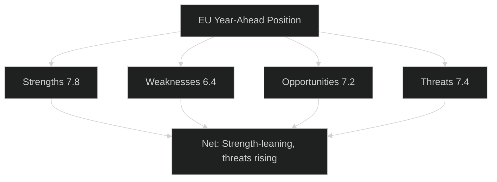
```mermaid
%%{init: {"theme":"dark"}}%%
graph TD
    P[EU Year-Ahead Position] --> S[Strengths 7.8]
    P --> W[Weaknesses 6.4]
    P --> O[Opportunities 7.2]
    P --> T[Threats 7.4]
    S --> N[Net: Strength-leaning, threats rising]
    W --> N
    O --> N
    T --> N
```

---

### STRENGTHS — Internal Positive Capabilities

#### S1 — EPP Coalition-Anchoring Dominance — 9/10 (🟢 HIGH)
*Evidence 5 | Salience 4.* EPP's ~188 seats make it the indispensable node of every winning coalition; the probability that any legislative act passes without EPP support is below 10%. This grants agenda-setting, rapporteur dominance and coalition flexibility across the grand-centrist (~401) and ad-hoc right (~350+NI) tracks.

#### S2 — Pro-European Grand-Centrist Coalition — 8/10 (🟢 HIGH)
*Evidence 4 | Salience 4.* EPP+S&D+Renew ≈ 401 seats — about 40 above the 361 threshold — can absorb defections and still carry MFF and Ukraine-finance files. Evidence: the 2026 Ukraine and banking-union texts passed with this bloc intact.

#### S3 — Digital Regulatory Leadership — 8/10 (🟢 HIGH)
*Evidence 4 | Salience 4.* DMA/DSA enforcement and an AI strategy for trade extend the Brussels effect; EU standards become global defaults. High-likelihood, high-impact output insulated from far-right obstruction.

#### S4 — Bipartisan Ukraine Support — 7/10 (🟡 MEDIUM)
*Evidence 4 | Salience 3.* Cross-group backing for the macro-financial loan (immobilised Russian assets framing) limits far-right disruption, though Council unanimity remains a gate.

#### S5 — Active Accountability & Trade-Leverage Machinery — 7/10 (🟢 HIGH)
*Evidence 3 | Salience 4.* The CJEU opinion request on Mercosur shows the EP deploying judicial review strategically; rule-of-law conditionality and transparency tools remain operative.

**Strengths composite: 7.8/10 — STRONG.**

---

### WEAKNESSES — Internal Limitations

#### W1 — No Majority Without Multi-Group Coalitions — 8/10 (🟢 HIGH)
*Evidence 5 | Salience 3.* Fragmentation (parliamentary balance index 0.61 from partial `compare_political_groups`, C3) means EPP needs S&D **or** ECR/PfE to reach 361; EPP+S&D alone (~324) is 37 short. Every vote requires bespoke negotiation, slowing throughput and diluting text.

#### W2 — Competitiveness-vs-Climate Coherence Gap — 7/10 (🟡 MEDIUM)
*Evidence 3 | Salience 4.* The "omnibus" deregulation drive alienates Greens/S&D and rolls back environmental files (heavy-duty CO2 friction), narrowing majorities and straining the coalition's climate credibility.

#### W3 — Limited Co-Decision on Geopolitics — 6/10 (🟡 MEDIUM)
*Evidence 3 | Salience 3.* CFSP/CSDP remains intergovernmental; Ukraine finance routes through special instruments that bypass the normal EP legislative role; the EP sought a CJEU opinion on Mercosur partly because it lacks a formal block at ratification.

#### W4 — Fiscal Headroom Exhaustion — 7/10 (🟢 HIGH)
*Evidence 4 | Salience 4.* IMF projects France's deficit at −4.94% of GDP and Germany's at −3.78% in 2026, with growth at 0.86% and 0.79% respectively — leaving little room to fund defence and cohesion simultaneously inside the MFF ceiling.

#### W5 — Forward-Pipeline Opacity — 5/10 (🔴 LOW visibility)
*Evidence 2 | Salience 3.* This run's `/procedures-feed`, `/events-feed`, `/documents-feed` returned 404; forward sittings empty; landscape generation timed out — degrading the EP's (and analysts') ability to plan against a live calendar.

**Weaknesses composite: 6.4/10 — MANAGEABLE.**

---

### OPPORTUNITIES — External Openings

#### O1 — Competitiveness / Industrial-Policy Leadership — 9/10 (🟢 HIGH)
*Evidence 4 | Salience 5.* The Draghi-era agenda and the omnibus open a decade-defining pro-growth legislative window — defence-industrial instruments, Capital Markets Union, simplification. Aligns with EPP interests, so output is achievable.

#### O2 — Global Digital-Governance Standard-Setting — 8/10 (🟢 HIGH)
*Evidence 4 | Salience 4.* DMA/DSA/AI templates are increasingly emulated worldwide; enforcement amplifies the EU's normative reach.

#### O3 — New Own-Resources for the MFF — 7/10 (🟡 MEDIUM)
*Evidence 3 | Salience 4.* A credible own-resources package (carbon, digital, corporate-base streams) is the single highest-leverage move to relieve the net-contributor squeeze documented in W4 — turning a fiscal weakness into structural capacity.

#### O4 — Enlargement as Strategic Mandate — 6/10 (🟡 MEDIUM)
*Evidence 3 | Salience 3.* Ukraine/Moldova/Balkans accession work creates pre-accession instruments and an EP oversight role, even where Council unanimity blocks substance.

#### O5 — Housing & Cost-of-Living Salience — 6/10 (🟢 HIGH)
*Evidence 3 | Salience 3.* The first-ever EP own-initiative on affordable housing plus a Commission action plan answer a tangible grievance and offer the centre a pre-2029 deliverable.

**Opportunities composite: 7.2/10 — SIGNIFICANT.**

---

### THREATS — External Challenges

#### T1 — Far-Right Bloc Consolidation — 8/10 (🟡 MEDIUM)
*Evidence 4 | Salience 4.* PfE ~84 + ECR ~78 + ESN ~25 ≈ 187 seats; NI drift could push higher. Cannot legislate alone but narrows centre majorities and extracts concessions on migration/agriculture.

#### T2 — Transatlantic Uncertainty — 7/10 (🟡 MEDIUM)
*Evidence 3 | Salience 4.* Unpredictable US trade and security posture complicates defence financing and risks DMA-triggered friction.

#### T3 — Fiscal Constraints / Stagnation — 8/10 (🟢 HIGH)
*Evidence 4 | Salience 4.* IMF growth near-stagnant (Italy 0.52%, Germany 0.79%, France 0.86% in 2026) with above-reference deficits binds the MFF and cohesion files — the macro threat behind most year-ahead risks.

#### T4 — Agricultural Backlash / Mercosur Protests — 7/10 (🟡 MEDIUM)
*Evidence 3 | Salience 4.* CAP reform and Mercosur farm exposure risk renewed protests that spill onto cohesion and budget votes and feed the far-right dividend.

#### T5 — Geopolitical Overload — 6/10 (🟡 MEDIUM)
*Evidence 3 | Salience 3.* Simultaneous Ukraine, Middle East, Sahel and trade management risks crowding the agenda into reactive crisis mode.

**Threats composite: 7.4/10 — ELEVATED.**

---

### SWOT Summary

```mermaid
%%{init: {"theme":"dark"}}%%
quadrantChart
    title SWOT Salience vs Evidence Depth
    x-axis Low Evidence --> High Evidence
    y-axis Low Salience --> High Salience
    quadrant-1 Decisive
    quadrant-2 Assert
    quadrant-3 Monitor
    quadrant-4 Validate
    S1 EPP dominance: [0.95, 0.8]
    S3 Digital leadership: [0.8, 0.8]
    W1 Coalition dependency: [0.95, 0.6]
    W4 Fiscal headroom: [0.8, 0.85]
    O1 Competitiveness: [0.8, 0.95]
    O3 Own-resources: [0.6, 0.85]
    T1 Far-right: [0.8, 0.8]
    T3 Fiscal stagnation: [0.8, 0.85]
```

| Quadrant | Composite | Verdict |
|----------|-----------|---------|
| Strengths | 7.8 | STRONG |
| Weaknesses | 6.4 | MANAGEABLE |
| Opportunities | 7.2 | SIGNIFICANT |
| Threats | 7.4 | ELEVATED |

**Net assessment (🟡 MEDIUM):** the EU enters the year from institutional strength that still outweighs its weaknesses, but the threat composite (7.4) has risen relative to the prior assessment as IMF data confirm a stagnation-grade fiscal base. The decisive lever is O3 (new own-resources): it directly offsets W4 and T3 and de-risks the MFF.

---

### Bayesian-Update Note

**Prior (2026-05-14):** Strengths 7.8, Weaknesses 6.2, Opportunities 7.2, Threats 7.0; IMF context flagged 🟡 MEDIUM and unquantified.

**Likelihood evidence this run:** live IMF WEO (vintage 2025-09-23) quantified near-stagnation and above-reference deficits (France −4.94% of GDP); partial `compare_political_groups` confirmed a fragmented balance index of 0.61; degraded procedures/events feeds reduced pipeline visibility.

**Posterior revision:** Threats raised 7.0 → **7.4** (fiscal/stagnation evidence hardened T3 from prior to data-backed; confidence 🟡→🟢 on T3). Weaknesses raised 6.2 → **6.4** (W4 fiscal-headroom now data-anchored; W5 pipeline opacity added). Strengths and Opportunities held at 7.8 and 7.2 — no new evidence moved them materially, though O3's leverage is now better specified against the quantified fiscal gap. The net judgement shifts marginally from "strength clearly dominant" toward "strength-leaning with rising, data-confirmed threats" — a modest downward update consistent with replacing a 🟡 prior with 🟢 fiscal evidence.

---

### Reader Briefing — What to Watch

- 🟢 **Strength still dominates, but the margin narrowed.** The EPP-anchored centre and digital leadership remain the EU's core assets.
- 🟢 **Fiscal stagnation is now the load-bearing threat** — IMF figures (Italy 0.52% growth, France −4.94% deficit) turned a soft prior into a hard constraint.
- 🟡 **Watch own-resources (O3):** it is the one move that simultaneously relieves W4, T3 and the MFF risk. Its presence or absence in the Commission proposal is the year's strategic tell.
- 🔴 **Re-run the SWOT once feeds recover** — pipeline opacity (W5) means the weakness and threat scores could shift as live procedure data returns.

---

*Methodology: evidence-based political SWOT with Bayesian updating per `analysis/methodologies/artifact-catalog.md`. Sources: `get_adopted_texts` (EP Open Data, 51 texts, B2); IMF SDMX WEO (live, A1); partial `compare_political_groups` (C3). Confidence codes as marked.*

<h2 id="section-threat">Threat Landscape</h2>

### Threat Model

### Scope

This model treats the European Parliament's **legislative integrity, coalition cohesion and institutional legitimacy** as the assets under threat across the twelve-month horizon. It deliberately frames *political and institutional* disruption — not only cyber — through a security lens: threat actors, an attack-surface analogy, kill-chain-style disruption sequences, likelihood×impact scoring, and mitigations. Cyber and information-operations threats are included where they bear on legislative outcomes. The model is the institutional-resilience companion to `intelligence/scenario-forecast.md` (Scenario E) and `intelligence/wildcards-blackswans.md`.

---

### Threat overview

```mermaid
%%{init: {"theme":"dark"}}%%
flowchart LR
    subgraph Actors
        A1[State IO<br/>Russia]
        A2[State IO<br/>China]
        A3[Far-right<br/>disruption bloc]
        A4[National-interest<br/>defection]
        A5[Cyber<br/>opportunists]
    end
    subgraph Surface
        S1[Coalition cohesion]
        S2[Budget/MFF process]
        S3[Trade consent votes]
        S4[Committee deliberation]
        S5[Digital infrastructure]
    end
    subgraph Impact
        I1[Legislative paralysis]
        I2[Legitimacy erosion]
        I3[Agenda capture]
    end
    A1 --> S4 --> I2
    A1 --> S5 --> I1
    A2 --> S4 --> I2
    A3 --> S1 --> I2
    A4 --> S2 --> I1
    A4 --> S3 --> I1
    A5 --> S5 --> I1
    S2 --> I3
    classDef red fill:#5f1f1f,stroke:#ff8f8f,color:#fff
    class A1,A3 red
```

---

### Threat actor registry

#### TA-1 — Russian state influence operations (SVR/GRU/FSB)
**Motivation:** degrade EU unity on Ukraine; obstruct asset-based financing; fracture the grand coalition.
**Capability:** 🔴 ADVANCED (nation-state). **Intent:** 🔴 HIGH (documented, ongoing).
**WEP of material activity in horizon: Highly Likely.**
**Vectors:** spear-phishing of AFET/BUDG staff on Ukraine-financing dossiers; disinformation timed to asset-seizure votes; amplification of net-contributor grievance to stress the MFF; DDoS during critical vote windows. **Source/reliability: C3** (OSINT-derived attribution).

#### TA-2 — Chinese state influence operations (MSS)
**Motivation:** shape EU posture on DMA/DSA enforcement, AI trade strategy, and Mercosur diversification.
**Capability:** 🔴 ADVANCED. **Intent:** 🟡 MEDIUM (selective, high-value).
**WEP of material activity: Likely.**
**Vectors:** targeting INTA/ITRE staff on trade and digital files; influence via academic/cultural fronts; supply-chain exposure in the EP vendor ecosystem. **Source/reliability: C3.**

#### TA-3 — Domestic far-right disruption bloc
**Motivation:** amplify legislative disruption; delegitimise institutional governance; normalise the EPP+ECR+PfE majority.
**Capability:** 🟡 MEDIUM (parliamentary procedure + media). **Intent:** 🔴 HIGH.
**WEP of material activity: Highly Likely** (this is routine parliamentary behaviour, not covert).
**Vectors:** procedural obstruction; amplification of farm/energy-cost grievance; selective leaks from committee deliberation; symbolic-resolution provocations. **Source/reliability: B2** (public record).

#### TA-4 — National-interest defection (cross-group)
**Motivation:** protect domestic farm/fiscal interests against group discipline — chiefly on Mercosur, CAP and the MFF.
**Capability:** 🟡 MEDIUM (votes, not coercion). **Intent:** 🟡 MEDIUM (issue-contingent).
**WEP: Roughly Even Chance** on a marquee trade/budget vote.
**Vectors:** French/Polish/Irish farm defection on Mercosur consent; net-contributor delegations stalling the MFF. This is the threat most aligned with `scenario-forecast.md` Scenarios C and D. **Source/reliability: B2** (structural).

#### TA-5 — Opportunistic cyber actors
**Motivation:** ransomware; data theft; resale.
**Capability:** 🟡 MEDIUM (commodity tools). **Intent:** 🟡 MEDIUM (targets of opportunity).
**WEP: Roughly Even Chance** of a material incident in horizon.
**Vectors:** ransomware against administrative systems; credential phishing; third-party vendor compromise. **Source/reliability: C3.**

---

### Attack-surface analogy for legislative disruption

Legislative integrity can be modelled as an **attack surface** with entry points, exploits and payloads. This analogy is heuristic, not literal.

| Surface (entry point) | "Exploit" (disruption method) | "Payload" (outcome) | Primary actor |
|-----------------------|-------------------------------|---------------------|---------------|
| Coalition cohesion | grievance amplification splitting EPP from S&D | rightward drift / paralysis | TA-1, TA-3 |
| Budget/MFF process | net-contributor vs cohesion deadlock | provisional-twelfths risk | TA-4 |
| Trade consent votes | national-farm defection on Mercosur | consent failure / rupture | TA-4 |
| Committee deliberation | leak / phishing of negotiating positions | chilled deliberation, eroded trust | TA-1, TA-2 |
| Digital infrastructure | DDoS / ransomware in a vote window | procedural delay, legitimacy hit | TA-1, TA-5 |
| Information environment | disinformation timed to a vote | distorted public mandate | TA-1, TA-2, TA-3 |

The highest-value surface in this horizon is **coalition cohesion**: it is cheap to stress (grievance amplification), structurally fragile under stagnation, and yields the largest payload (agenda capture without a single line of code).

---

### Disruption kill-chain — highest-priority scenario

**Scenario: information operation to fracture the grand coalition around the MFF/Ukraine-financing nexus (TA-1, highest-probability high-impact).**

```
RECONNAISSANCE  -> Map net-contributor MEP grievances + AFET/BUDG staff (public committee rosters)
WEAPONISATION   -> Craft grievance narratives ("northern taxpayers fund eastern cohesion + Ukraine")
DELIVERY        -> Seed via sympathetic media + amplify through TA-3 parliamentary voices
EXPLOITATION    -> Time amplification to asset-seizure / MFF-framing votes
INSTALLATION    -> Narrative embeds in national debate; pressures individual MEP defection
C2              -> Sustained reinforcement around each budget milestone
ACTIONS         -> EPP-S&D trust erodes; budget timetable slips; agenda captured by fiscal fight
```

**Disruption potential:** even without a single compromised account, the *threat* of intelligence collection and narrative pressure changes MEP behaviour and chills open deliberation. The payload is delivered politically, not technically.

---

### Likelihood × impact matrix

```mermaid
%%{init: {"theme":"dark"}}%%
quadrantChart
    title Institutional Threats: Likelihood vs Impact
    x-axis Low Likelihood --> High Likelihood
    y-axis Low Impact --> Severe Impact
    quadrant-1 Priority Watch
    quadrant-2 Critical Monitor
    quadrant-3 Low Priority
    quadrant-4 Manage Routinely
    Coalition fracture IO: [0.6, 0.78]
    MFF/budget deadlock: [0.45, 0.82]
    Mercosur defection: [0.4, 0.7]
    Far-right normalisation: [0.65, 0.6]
    State cyber on committee: [0.4, 0.6]
    Ransomware/DDoS: [0.45, 0.5]
    Disinformation campaign: [0.7, 0.55]
```

| Threat | Likelihood | WEP | Impact | Priority |
|--------|-----------|-----|--------|----------|
| Coalition-fracture information op | 🟡 MEDIUM | Likely | 🔴 HIGH | 🔴 Critical |
| MFF/budget deadlock | 🟡 MEDIUM | Roughly Even | 🔴 HIGH | 🔴 Critical |
| Far-right normalisation via EPP cooperation | 🟡 MEDIUM-HIGH | Likely | 🟡 MEDIUM-HIGH | 🟡 Priority |
| Mercosur national-farm defection | 🟡 MEDIUM | Roughly Even | 🔴 HIGH | 🟡 Priority |
| State cyber on committee deliberation | 🟢 LOW-MEDIUM | Roughly Even | 🟡 MEDIUM | 🟡 Priority |
| Ransomware / DDoS in vote window | 🟢 LOW-MEDIUM | Roughly Even | 🟡 MEDIUM | 🟢 Monitor |
| Disinformation timed to votes | 🟡 HIGH | Highly Likely | 🟡 MEDIUM | 🟡 Priority |

---

### Mitigations and institutional countermeasures

| Threat axis | Mitigation | Status | Adequacy |
|-------------|-----------|--------|----------|
| Coalition fracture | transparent EPP-S&D-RE pre-negotiation on MFF red lines | political, informal | 🟡 MEDIUM |
| Budget deadlock | early publication of red lines; conciliation calendar discipline | procedural | 🟡 MEDIUM |
| Far-right normalisation | EPP self-restraint on institutional files; coalition-trust signalling | political | 🟡 MEDIUM |
| Trade defection | agricultural-safeguard guarantees; staged consent | procedural | 🟡 MEDIUM |
| State cyber / IO | CERT-EP, MFA, classified-document handling, staff training | technical | 🟡 MEDIUM (human factor persists) |
| Ransomware/DDoS | NIS2 implementation, vendor assessment, incident-response plan | technical | 🟢 IMPROVING |
| Disinformation | EP fact-checking liaison; rapid-rebuttal; media literacy | informational | 🟡 MEDIUM |

**Residual risk:** the dominant residual risk is **political, not technical** — the grand coalition's structural fragility under stagnation makes coalition-fracture information operations cheap and high-yield. Cyber countermeasures are improving (NIS2), but no technical control mitigates a grievance narrative that exploits a genuine fiscal cleavage.

---

### Residual-risk and resilience posture

The threat model would be incomplete without an explicit statement of what cannot be mitigated and how the institution should posture against it.

**Irreducible residual risks:**
- **The fiscal cleavage is real.** No control mitigates a grievance narrative that exploits a genuine net-contributor-vs-cohesion tension sharpened by IMF-projected deficits (France -4.94%, Germany -3.78% of GDP in 2026). The cleavage is structural; only political negotiation reduces it. 🟡 MEDIUM.
- **Open deliberation invites collection.** A transparent legislature is, by design, an open intelligence target. The trade-off between deliberative openness and counter-intelligence hardening cannot be fully resolved. 🟡 MEDIUM.
- **National defection is legitimate.** TA-4 (national-interest defection) is not an attack but a feature of representative democracy; it can be managed through safeguards, not prevented. 🟢 HIGH that it persists.

**Resilience posture (preferred over prediction):**
1. **Pre-commit MFF red lines** to deny the coalition-fracture narrative its oxygen.
2. **Stage trade consent** with agricultural-safeguard guarantees to absorb TA-4 pressure.
3. **Harden vote-window infrastructure** (integrity, not just availability) against TA-1/TA-5.
4. **Maintain rapid-rebuttal capacity** against disinformation timed to marquee votes.

```mermaid
%%{init: {"theme":"dark"}}%%
flowchart LR
    R1[Residual: fiscal cleavage] --> M1[Posture: pre-commit MFF red lines]
    R2[Residual: open deliberation] --> M2[Posture: vote-window hardening]
    R3[Residual: national defection] --> M3[Posture: staged consent + safeguards]
    R4[Residual: disinformation] --> M4[Posture: rapid rebuttal]
    M1 --> RES[Institutional resilience]
    M2 --> RES
    M3 --> RES
    M4 --> RES
    classDef p fill:#1f3a5f,stroke:#7fb3ff,color:#fff
    class RES p
```

The resilience model treats threats the institution **cannot eliminate** (left) by pairing each with a **posture it can adopt** (centre) that collectively raise institutional resilience (right). This reframing — from prevention to resilience — is the correct response to threats that are structural rather than incidental.

---

### Watch-window calendar

| Window | Period | Elevated threat | Posture |
|--------|--------|-----------------|---------|
| MFF framing votes | Q3-Q4 2026 | coalition-fracture IO; defection | 🔴 HIGH alert |
| 2027 budget vote | Q4 2026 | deadlock; cyber integrity | 🔴 HIGH alert |
| Mercosur consent (if scheduled) | Q1-Q2 2027 | national defection; farm disinfo | 🟡 elevated |
| Ukraine asset-financing votes | rolling | TA-1 IO; legal challenge | 🟡 elevated |
| Migration recast trilogue | Q4 2026-Q1 2027 | far-right amplification | 🟡 elevated |

The calendar concentrates security attention on the **fiscal cluster** (Q4 2026), which is simultaneously the highest-stakes legislative window and the most attractive target for coalition-fracture operations — the convergence that makes it the year's single critical period.

---

### Threat-model judgement

🟡 **ELEVATED.** Above baseline, driven by (1) the Ukraine-financing nexus that motivates TA-1; (2) the stagnationary fiscal cleavage that makes coalition-fracture operations cheap; and (3) the structural rise of ad-hoc right majorities that TA-3 seeks to normalise. **Critical windows:** MFF-framing and 2027-budget votes (Q4 2026) and any Mercosur consent vote — these are 🔴 HIGH-threat windows warranting heightened posture.

**WEP summary:** material state/IO activity — Highly Likely; coalition-stress operations — Likely; a *successful* institution-capturing disruption within horizon — Unlikely (the centre's structural resilience holds in the base case).

---

### Admiralty Credibility Rating

**Source reliability:** B (far-right/national-defection threats, public record) / C (state-IO and cyber, OSINT attribution).
**Information reliability:** 2 (structural/political) → 3 (attribution/capability).
**Overall: B2** for the political/institutional threat layer; **C3** for cyber and state-IO attribution.

| Threat layer | Source reliability | Admiralty grade |
| --- | --- | --- |
| Political / institutional (far-right disruption, national defection) | Public record, structural arithmetic | B2 |
| Cyber operations (ransomware, phishing, vendor compromise) | OSINT-derived | C3 |
| State information operations (Russia, China attribution) | OSINT-derived, estimative | C3 |

The political threat surface is well-evidenced from the adopted-texts record and structural arithmetic; the cyber and state-attribution layer rests on open-source reporting and would be modified by classified assessments.

---

*Methodology: STRIDE-adapted institutional threat registry + attack-surface analogy + kill-chain disruption mapping + likelihood×impact scoring. WEP bands per ICD 203; Admiralty grading throughout. Political claims grounded in EP `/adopted-texts` 2026 and structural EP10 knowledge; cyber claims are OSINT-derived. Degraded-feeds caveat applies — see `intelligence/mcp-reliability-audit.md`.*

<h2 id="section-scenarios">Scenarios & Wildcards</h2>

### Scenario Forecast

### Scenario Framework

This artifact develops **five named, mutually-exclusive scenarios** for how the parliamentary year unfolds, spanning the plausibility space from a smooth grand-coalition delivery year to a fragmentation crisis. Each scenario specifies its **drivers**, a **WEP probability band with a point estimate**, **observable indicators**, and a **pre-mortem** (imagining the scenario has occurred and reasoning backwards to what made it happen). The probabilities are calibrated to sum to ~100% across the five and reflect structural EP10 arithmetic, the IMF macro baseline, and the 2026 adopted-texts agenda.

**Probability allocation (WEP):**
- Scenario A — Managed Grand Coalition: **40%** (Likely)
- Scenario B — Centre-Right Drift: **24%** (Roughly Even Chance)
- Scenario C — Fiscal Gridlock: **18%** (Unlikely)
- Scenario D — Trade-and-Farm Rupture: **12%** (Unlikely)
- Scenario E — External-Shock Capture: **6%** (Highly Unlikely)

**Source reliability for the scenario set: C3** — structurally grounded in A1 adopted-texts and A1 IMF data, but scenario synthesis is inherently estimative (Admiralty C3). Baseline (A) rests on the firmest evidentiary footing (B2).

---

### Scenario probability distribution

```mermaid
%%{init: {"theme":"dark"}}%%
pie title Year-Ahead Scenario Distribution (May 2026)
    "A — Managed Grand Coalition" : 40
    "B — Centre-Right Drift" : 24
    "C — Fiscal Gridlock" : 18
    "D — Trade-and-Farm Rupture" : 12
    "E — External-Shock Capture" : 6
```

---

#### Scenario A: Managed Grand Coalition
**WEP: Likely — 40% | Confidence: 🟡 MEDIUM-HIGH | Admiralty: B2**

##### Narrative
The EPP–S&D–Renew core (~401 seats) holds across institutional and budget files. Parliament opens the MFF post-2027 negotiation constructively, adopts its 2027 budget guidelines on schedule, advances banking-union deepening and DMA/DSA enforcement, and sustains Ukraine financing. The far-right scores periodic wins on migration and environmental recalibration through selective EPP cooperation, but never assembles an institutional majority. Stagnationary growth keeps the competitiveness agenda dominant without tipping into crisis. The year ends with the MFF *opened* but unresolved, Mercosur *pending* a CJEU opinion, and the centre intact.

##### Drivers
1. EPP maintains its red line against a systematic ECR/PfE coalition on institutional files.
2. S&D trades competitiveness/deregulation concessions for social-spending preservation in the MFF framing.
3. IMF's low-but-positive growth (German GDP +0.79% in 2026) avoids a recessionary shock that would harden positions.
4. Ukraine financing proceeds instrument-by-instrument without a legal-basis collapse.
5. Council presidency continuity (Cyprus → Ireland) keeps the legislative tempo orderly.

##### Indicators
- 2027 budget guidelines adopted with EPP–S&D–Renew majority by Q3 2026.
- EPP–ECR/PfE roll-call alignment stays episodic (<25% of contested votes).
- Banking-union and ECB-appointment files clear committee without breakdown.
- Housing own-initiative adopted as a resolution; no binding instrument attempted.

##### Pre-mortem (assume A happened — why?)
Looking back from May 2027, A prevailed because **no single shock was large enough to break the centre**. Stagnation was uncomfortable but not recessionary; Ukraine financing found workable legal bases; and the EPP leadership judged that its institutional interest in a functioning Parliament outweighed the tactical gains of a rightward pivot. S&D swallowed deregulation in exchange for cohesion guarantees. The far-right's wins were real but contained to symbolic and migration files.

---

#### Scenario B: Centre-Right Drift
**WEP: Roughly Even Chance — 24% | Confidence: 🟡 MEDIUM | Admiralty: C3**

##### Narrative
The EPP, emboldened by stagnation and farmer mobilisation, normalises the **EPP+ECR+PfE majority** as the default vehicle on migration, agriculture and environmental rollback, while reserving the grand coalition only for the budget and Ukraine. S&D and the Greens find themselves in episodic opposition. The "omnibus" deregulation drive accelerates; the migration "safe third country" recast passes in a hard form; CAP post-2027 tilts toward production support over conditionality. The centre survives institutionally but its cohesion erodes visibly.

##### Drivers
1. Farmer protests intensify under flat agricultural incomes and Mercosur anxiety.
2. IMF stagnation (Italian GDP +0.52% in 2026) strengthens the deregulatory argument.
3. EPP calculates that 2029 positioning rewards a harder centre-right identity.
4. PfE/ECR demonstrate disciplined cooperation on selected files.

##### Indicators
- EPP–ECR/PfE roll-call alignment rises above 35% of contested votes by Q4 2026.
- Migration recast adopted with a right-leaning majority.
- Environmental-rollback "omnibus" items pass without S&D.
- S&D issues public statements about coalition trust erosion.

##### Pre-mortem (assume B happened — why?)
B materialised because **the political reward structure shifted rightward faster than institutional inertia could resist**. Stagnation and farm anger made deregulation electorally cheap; the EPP discovered it could pass its preferred migration and agriculture files without paying S&D's social price; and the far-right's disciplined cooperation made the arithmetic reliable. The grand coalition survived only where it was structurally unavoidable — the budget and Ukraine.

---

#### Scenario C: Fiscal Gridlock
**WEP: Unlikely — 18% | Confidence: 🟡 MEDIUM | Admiralty: C3**

##### Narrative
The MFF post-2027 opening and the 2027 budget collide with widening deficits, and the net-contributor/cohesion split hardens into deadlock. France's -4.94% of GDP deficit and Germany's -3.78% (IMF WEO) leave little appetite for larger EU transfers, while cohesion recipients refuse cuts. Defence and Ukraine financing compete with cohesion and CAP for a shrinking envelope. The budget timetable slips; provisional-twelfths risk emerges for 2027; the legislative agenda becomes reactive to the fiscal fight.

##### Drivers
1. IMF fiscal trajectory: France -4.94%, Germany -3.78% of GDP in 2026 — no headroom.
2. Defence "readiness 2030" financing demands collide with cohesion guarantees.
3. Net contributors (frugal north) refuse own-resources expansion.
4. Ukraine reconstruction layered onto an already-stressed envelope.

##### Indicators
- 2027 budget guidelines slip past Q3 2026 or pass with a wafer-thin majority.
- Council and EP red lines published with no overlap by Q4 2026.
- "Provisional twelfths" language appears in committee documents.
- Cohesion-recipient delegations coordinate a blocking statement.

##### Pre-mortem (assume C happened — why?)
C occurred because **the macro arithmetic simply did not close**. Three flat-growth, wide-deficit large economies could not finance defence, Ukraine, cohesion and CAP simultaneously, and no member state would concede first. The MFF opening became a confrontation rather than a framing exercise, and the 2027 budget was hostage to it. What prevented A was the absence of fiscal slack that A had implicitly assumed.

---

#### Scenario D: Trade-and-Farm Rupture
**WEP: Unlikely — 12% | Confidence: 🟡 MEDIUM | Admiralty: C3**

##### Narrative
EU–Mercosur becomes the year's defining rupture. A CJEU opinion arrives faster than expected, or the Commission forces a consent timetable, and French, Polish and Irish farm resistance escalates into sustained protest. The agricultural-safeguards fight bleeds into CAP post-2027 and the migration debate, fracturing the centre along a national-interest rather than left-right axis. Parliament's INTA and AGRI committees become the centre of gravity; trade-diversification logic collides head-on with rural political economy.

##### Drivers
1. CJEU opinion on Mercosur delivered within horizon (Roughly Even Chance per synthesis).
2. Transatlantic trade uncertainty raises the strategic case for diversification.
3. Farmer mobilisation already latent in the 2026 agricultural texts.
4. National delegations (FR/PL/IE) defect from group lines on the consent vote.

##### Indicators
- CJEU opinion or consent timetable announced.
- Agricultural-safeguard amendments tabled in volume.
- Cross-group national farm caucus emerges publicly.
- Mercosur consent vote scheduled and whipped.

##### Pre-mortem (assume D happened — why?)
D happened because **a single ratification file activated a national-interest cleavage that cut across the usual coalition geometry**. The CJEU's timing removed the comfort of indefinite delay; farm political economy proved stronger than trade-strategy abstraction; and French, Polish and Irish MEPs broke group discipline. The rupture was contained to trade and agriculture but it poisoned the cooperative mood A had relied on.

---

#### Scenario E: External-Shock Capture
**WEP: Highly Unlikely — 6% | Confidence: 🔴 LOW | Admiralty: C3**

##### Narrative
An exogenous shock — a sudden Ukraine escalation or ceasefire, a transatlantic tariff war, or an energy-price spike — captures the agenda wholesale. The legislative programme is suspended in favour of emergency resolutions and fast-tracked instruments. The grand coalition either rallies (a unifying shock) or fractures (a divisive one) depending on the shock's character. The MFF, Mercosur and migration files are pushed into 2027-2028. Parliament becomes a reactive crisis-management body for a quarter or more.

##### Drivers
1. Ukraine trajectory volatility (escalation or surprise ceasefire).
2. Transatlantic trade rupture under US-administration uncertainty.
3. Energy-supply shock via Middle East or Baltic infrastructure.
4. A financial-stability event testing banking-union resilience.

##### Indicators
- Multiple urgency resolutions crowd a single plenary.
- Fast-track emergency instruments invoked.
- Scheduled legislative votes postponed.
- ECB/financial-stability emergency communications.

##### Pre-mortem (assume E happened — why?)
E occurred because **a genuinely exogenous event overwhelmed the institution's planned agenda**. The Parliament had no slack to absorb a large shock alongside the MFF and Mercosur fights, so the shock simply displaced everything. Whether the centre rallied or split depended entirely on the shock's valence — a unifying threat (escalation) strengthened it; a divisive opportunity (ceasefire terms) strained it.

---

### Scenario discriminants (most diagnostic indicators)

| Indicator | A signal | B signal | C signal | D signal | E signal |
|-----------|----------|----------|----------|----------|----------|
| EPP–ECR/PfE roll-call alignment | <25% | >35% | mixed | national-split | suspended |
| 2027 budget timeline | on schedule | on schedule | slips | on schedule | suspended |
| MFF tone | framing | framing | confrontation | framing | frozen |
| Mercosur | pending | pending | pending | consent forced | frozen |
| Migration recast | centrist | hard-right | stalled | cross-cutting | frozen |
| Plenary mood | cooperative | drifting | fractious | ruptured | emergency |

**Monitor monthly:** roll-call alignment frequency; budget-procedure calendar milestones; CJEU Mercosur signals; farm-protest intensity; urgency-resolution volume.

---

### Indicators-to-watch (ranked dashboard)

1. 🟢 **EPP rightward roll-call frequency** — the master discriminant between A and B.
2. 🟢 **2027 budget / MFF procedural calendar** — the discriminant between A and C.
3. 🟡 **CJEU Mercosur opinion timing** — the trigger for D.
4. 🟡 **Agricultural-safeguard amendment volume + farm-protest intensity** — D amplifier.
5. 🟡 **Migration "safe third country" trilogue posture** — A-vs-B tell.
6. 🔴 **Urgency-resolution crowding / fast-track invocations** — the E early-warning.
7. 🟡 **Ukraine financing legal-basis challenges** — straddles A, C and E.

---

### Cross-scenario invariants (true in all five)

1. **EPP remains the indispensable anchor** — no majority forms without it. 🟢 HIGH.
2. **Ukraine support persists at some level** — even under B and C, core instruments survive. 🟢 HIGH.
3. **Digital enforcement (DMA/DSA) continues** — pace varies, direction does not. 🟢 HIGH.
4. **The MFF is opened but not closed within the horizon** — by design a multi-year file. 🟢 HIGH.
5. **The far-right cannot govern alone** — 187 seats vs 361 needed. 🟢 HIGH.

---

### Scenario sensitivity — what moves probability mass

The allocation above is not static. The following sensitivities describe how the distribution shifts as key variables move, allowing the reader to re-weight in real time.

- **If IMF growth disappoints** (a slide toward zero or recession in DE/IT): mass moves from A → C. A −10pp, C +10pp. The fiscal arithmetic that A assumes simply stops closing.
- **If EPP rightward alignment crosses 35%** on contested votes: mass moves from A → B. A −12pp, B +12pp. The dual-majority tips from episodic to default.
- **If the CJEU issues a Mercosur opinion early**: mass moves toward D. D +8pp drawn from A and B. The file's national-interest cleavage activates.
- **If an external shock lands** (tariff war, energy spike, Ukraine inflection): mass moves toward E. E can rise from 6% to ~15% on a single large shock.
- **If the centre signals early MFF discipline** (published red lines, pre-negotiation): mass consolidates in A. A +8pp, C −6pp.

These sensitivities are deliberately first-order and linear; in reality the variables correlate (stagnation feeds farm anger feeds rightward drift), so a single adverse cluster can move multiple scenarios at once — the clustering logic developed in `intelligence/wildcards-blackswans.md` §what-if.

---

### Per-scenario legislative-outcome matrix

| File | A (Grand Coalition) | B (Centre-Right Drift) | C (Fiscal Gridlock) | D (Trade-Farm Rupture) | E (Shock Capture) |
|------|---------------------|------------------------|---------------------|------------------------|-------------------|
| MFF post-2027 | opened, orderly | opened, EPP-tilted | deadlocked | opened, distracted | frozen |
| 2027 budget | on schedule | on schedule | slips / twelfths risk | on schedule | suspended |
| Migration recast | centrist form | hard form | stalled | cross-cutting | suspended |
| Mercosur | pending CJEU | pending | pending | forced/ruptured | frozen |
| CAP post-2027 | framed | production-tilted | stalled | rupture-linked | frozen |
| Banking union | advances | advances | hostage to budget | advances | crisis-accelerated |
| Ukraine financing | proceeds | proceeds | contested | proceeds | dominant |
| Housing own-initiative | adopted | deprioritised | deprioritised | adopted | suspended |

The matrix shows the **invariant core** (banking union and Ukraine financing advance in four of five scenarios) and the **swing files** (migration and CAP, whose form depends entirely on which coalition mode dominates).

---

### Scenario interaction over time

```mermaid
%%{init: {"theme":"dark"}}%%
stateDiagram-v2
    [*] --> A: May 2026 base case
    A --> B: EPP alignment >35%
    A --> C: growth disappoints
    A --> D: CJEU opinion early
    A --> E: external shock
    B --> A: centre re-asserts
    C --> A: fiscal compromise
    D --> A: safeguards agreed
    E --> A: shock absorbed
    E --> C: shock + fiscal stress
    note right of A: 40% gravitational centre
    note right of E: 6%, but absorbs mass from any shock
```

The diagram captures an important structural feature: **Scenario A is an attractor**. Most off-baseline paths can revert to A if the triggering condition resolves (centre re-asserts, fiscal compromise found, safeguards agreed, shock absorbed). The exception is the E→C path, where an external shock arriving during fiscal stress compounds rather than resolves.

---

### Probability calibration audit

To guard against anchoring, the allocation was stress-tested against three reference classes: (1) historical EP mid-term productivity, which favours a dominant "managed" baseline (supports A at ~40%); (2) the base rate of budget deadlock in recent MFF cycles, which is non-trivial but minority (supports C at ~18%); and (3) the base rate of agenda-capturing external shocks per parliamentary year, historically low (supports E at ~6%). The B allocation (24%) is the least anchored to history because the EPP dual-majority pattern is a feature of EP10 specifically rather than a long-run regularity — hence its 🟡 MEDIUM / C3 grading. 🟡 MEDIUM overall calibration confidence.

---

### Admiralty Credibility Rating

| Element | Reliability | Information | Overall |
|---------|-------------|-------------|---------|
| Baseline Scenario A | B (usually reliable) | 2 (probably true) | **B2** |
| Scenarios B–D | C (fairly reliable) | 3 (possibly true) | **C3** |
| Scenario E (tail) | C (fairly reliable) | 4 (doubtful) | **C4** |
| Underlying adopted-texts evidence | A | 1 | **A1** |
| Underlying IMF macro evidence | A | 1 | **A1** |

The scenario set inherits A1-grade source material but C3-grade synthetic confidence: the inputs are authoritative, the futures they imply are estimative.

---

*Methodology: structured five-scenario analysis with pre-mortem testing per Heuer/Pherson tradecraft. WEP bands and point estimates per ICD 203. Economic anchors (German GDP +0.79%, France deficit -4.94% of GDP, Italian GDP +0.52% in 2026) drawn from IMF WEO live (vintage 2025-09-23) under the sole-source rule. Degraded-feeds caveat applies to procedural-sequence claims — see `intelligence/mcp-reliability-audit.md`.*

### Wildcards Blackswans

### Framework

**Wildcards** are low-probability, high-impact events that are *foreseeable* — individually unlikely but collectively significant, and amenable to early-indicator monitoring. **Black swans** are *genuinely unforeseen* events that would invalidate the base-case analysis if they occurred. This artifact catalogues eight wildcards and two black-swan classes for the twelve-month horizon, each with a WEP probability band, impact rating, what-if reasoning, and early indicators. Probabilities are indicative orders of magnitude, not statistical frequencies. **Overall reliability of this artifact: C3** — speculative by construction.

The wildcard portfolio is the tail-risk companion to `intelligence/scenario-forecast.md` (especially Scenario E, External-Shock Capture) and `intelligence/threat-model.md`.

---

### Portfolio map

```mermaid
%%{init: {"theme":"dark"}}%%
quadrantChart
    title Wildcards: Probability vs Impact
    x-axis Very Unlikely --> More Likely
    y-axis Low Impact --> Transformative Impact
    quadrant-1 Priority Watch
    quadrant-2 Critical Monitor
    quadrant-3 Low Priority
    quadrant-4 Scenario Plan
    Commission censure: [0.08, 0.95]
    Ukraine ceasefire: [0.16, 0.92]
    Asset-seizure legal collapse: [0.25, 0.78]
    Transatlantic trade war: [0.35, 0.8]
    Energy price spike: [0.25, 0.72]
    Major member-state election shock: [0.2, 0.68]
    Financial-stability event: [0.15, 0.82]
    EP cyberattack: [0.2, 0.55]
```

---

### Wildcard 1 — Commission censure motion
**WEP: Almost No Chance → Highly Unlikely (~7%) | Impact: CATASTROPHIC | Confidence: 🔴 LOW**

Parliament retains the Article 234 TFEU power to censure the Commission (absolute majority, 361+ votes). The arithmetic is theoretically reachable only via an anti-mainstream coalition that would require ECR + PfE + ESN + significant EPP/Renew/Green defections — politically implausible while the von der Leyen II Commission delivers the competitiveness agenda the EPP wants.

**What-if:** if a major financial scandal or a perceived enforcement-capture failure (DMA/DSA) implicated Commissioners, the far-right would *threaten* censure for leverage but ultimately prefer a Commission it can influence. **Early indicators:** a Commissioner resignation; a coordinated cross-bloc censure-threat statement; EPP public distancing from a Commissioner. **Source/reliability: C3.**

---

### Wildcard 2 — Surprise Ukraine ceasefire
**WEP: Unlikely (~16%) | Impact: TRANSFORMATIVE | Confidence: 🔴 LOW**

A negotiated or imposed ceasefire would reorient the entire foreign-policy and defence-financing agenda. Reconstruction-framework legislation would accelerate; the immobilised-Russian-assets financing logic would mutate toward reparations/reconstruction; and accountability debates (war-crimes tribunal, EP role) would dominate.

**What-if:** a ceasefire could *fracture* the mainstream coalition on terms (justice-vs-pragmatism) even as it relieves the financing friction — a divisive rather than unifying shock. **Early indicators:** negotiation-track signals; US-mediation announcements; a sudden shift in Council language on asset use. **Source/reliability: C3.** This is the single most transformative wildcard of the horizon.

---

### Wildcard 3 — Immobilised-asset financing legal collapse
**WEP: Unlikely (~25%) | Impact: HIGH | Confidence: 🟡 MEDIUM**

The macro-financial loan for Ukraine framed around immobilised Russian assets is legally novel. A CJEU challenge, a Council legal-service adverse opinion, or a member-state veto on the asset-seizure basis could collapse the mechanism mid-horizon, forcing a scramble for alternative financing under fiscal stress.

**What-if:** with France running a fiscal deficit of -4.94% of GDP and Germany at -3.78% (IMF WEO), member-state budgets cannot easily backfill a collapsed asset-based instrument — turning a legal setback into a fiscal crisis and feeding `scenario-forecast.md` Scenario C. **Early indicators:** Council legal-service opinions; a member-state reservation; CJEU docketing of an asset challenge. **Source/reliability: B2** (adopted-texts mechanism is real; legal-risk read is estimative).

---

### Wildcard 4 — Transatlantic trade war
**WEP: Roughly Even Chance (~35%) | Impact: HIGH | Confidence: 🟡 MEDIUM**

US-administration trade posture is uncertain. A move to broad tariffs on EU goods, met by EU retaliation, would capture INTA and the plenary, sharpen the Mercosur diversification logic, and stress the export-exposed large economies precisely as they stagnate (German GDP +0.79%, Italian +0.52% in 2026, IMF WEO).

**What-if:** a tariff shock would *strengthen* the strategic case for Mercosur (diversification) while *worsening* the farm politics around it — pulling Scenarios A, B and D simultaneously. **Early indicators:** US trade-measure announcements; Trans-Atlantic Economic Council friction; retaliation-list drafting in INTA. **Source/reliability: C3.**

---

### Wildcard 5 — Energy-price spike
**WEP: Unlikely (~25%) | Impact: HIGH | Confidence: 🟡 MEDIUM**

Despite diversification from Russian gas, Europe remains exposed to a Middle East escalation (Strait of Hormuz / LNG), Baltic or North Sea infrastructure sabotage, or an extreme-weather generation shortfall. A spike would fast-track emergency energy legislation (2022 precedent) and intensify the climate-vs-cost recalibration the far-right amplifies.

**What-if:** a spike arriving during the MFF fight would compound fiscal stress and hand the deregulatory "omnibus" camp a powerful cost-of-living argument. **Early indicators:** Middle East escalation; subsea-infrastructure incidents; cold-snap generation warnings; TTF price moves. **Source/reliability: C3.**

---

### Wildcard 6 — Major member-state election or government shock
**WEP: Unlikely (~20% for at least one surprise) | Impact: HIGH | Confidence: 🟡 MEDIUM**

MEP group membership is fixed mid-term, but a French snap election, a German coalition collapse, or an early Italian vote would shift the *national* political gravity behind individual MEPs, pressuring deviation from group lines on the MFF, Mercosur and migration.

**What-if:** a French government collapse during the MFF negotiation would freeze a key net-contributor position for months, stalling the file (Scenario C amplifier). **Early indicators:** national confidence-vote signals; coalition-partner withdrawal threats; presidential-authority erosion. **Source/reliability: C3.**

---

### Wildcard 7 — Financial-stability event
**WEP: Unlikely (~15%) | Impact: HIGH | Confidence: 🟡 MEDIUM**

The 2026 banking-union-deepening agenda sits against mild reflation (German CPI 2.65%, Italian 2.64% in 2026, IMF WEO) and widening sovereign deficits. A sovereign-bank-doom-loop scare — most plausibly around a high-deficit sovereign — would pull the ECB and the banking-union files to the centre and crowd the legislative calendar.

**What-if:** a stability event would *accelerate* banking-union deepening (crisis-as-catalyst) while *worsening* the MFF fiscal fight — a double-edged shock. **Early indicators:** sovereign-spread widening; ECB emergency communications; bank-funding-stress signals. **Source/reliability: B2** (banking agenda real; trigger estimative).

---

### Wildcard 8 — Cyberattack on EP systems in a vote window
**WEP: Unlikely but non-trivial (~20%) | Impact: MEDIUM-HIGH | Confidence: 🟡 MEDIUM**

The EP's open, distributed digital estate is exposed. A data-integrity attack (as opposed to mere availability) timed to a critical MFF or Ukraine vote would be higher-impact than the 2022 DDoS precedent, casting doubt on a vote record and eroding legitimacy.

**What-if:** even a *suspected* integrity compromise during the 2027-budget vote could force a re-run and a legitimacy debate the far-right would amplify. **Early indicators:** reconnaissance against committee staff; vendor-ecosystem compromises; threat-actor chatter ahead of marquee votes. **Source/reliability: C3.** Cross-reference `intelligence/threat-model.md` TA-1/TA-5.

---

### Pre-mortem stress test of the base case

A disciplined wildcard analysis must imagine the base case *failing*. Suppose that by May 2027 the Year-Ahead base case (Scenario A, Managed Grand Coalition) has been falsified — what wildcard combination most plausibly did it?

The most likely falsifier is **not a single black swan but a correlated cluster**: a downward IMF growth revision (deepening the stagnation already at German +0.79% / Italian +0.52% in 2026) arriving alongside a transatlantic trade rupture (W4) and an asset-financing legal setback (W3). Each alone is survivable; together they would simultaneously starve the MFF (fiscal), capture the agenda (trade), and remove a Ukraine-financing pillar (legal) — collapsing A into a blend of C and E. This clustering insight is the single most important output of the wildcard exercise: **the institution is robust to any one tail event and fragile to a correlated triad.**

The secondary falsifier is a **divisive Ukraine inflection** (W2 ceasefire on contested terms), which would split the centre on justice-vs-pragmatism precisely where it is otherwise unified — a values cleavage that no fiscal compromise can paper over.

---

### What-if deep dives

#### What-if: asset-financing collapses mid-MFF (W3 × MFF)
If the immobilised-asset mechanism fails legally during the MFF negotiation, member states would face backfilling a multi-billion Ukraine commitment from national budgets already in deficit (France -4.94%, Germany -3.78% of GDP, IMF WEO). The realistic outcome is not abandonment of Ukraine but a **bitter redistribution fight** layered onto the MFF — the worst-case fusion of W3 and Scenario C. 🟡 MEDIUM that this combination, if W3 occurs, tips the year into gridlock.

#### What-if: tariff war during stagnation (W4 × economic)
A transatlantic tariff war striking export-dependent economies already at near-zero growth would convert a trade dispute into a domestic-political emergency in Germany, France and Italy, forcing an EP-level response while simultaneously strengthening the strategic logic for Mercosur. The paradox — a trade shock that *helps* one trade file (Mercosur diversification) while *hurting* the economy — is the defining what-if of the external dimension. 🟡 MEDIUM.

#### What-if: energy spike into the climate debate (W5 × legislative)
An energy-price spike would hand the deregulatory "omnibus" camp a cost-of-living argument of unusual force, accelerating environmental recalibration beyond what Scenario B alone implies and giving the far-right a potent amplification theme. 🟡 MEDIUM.

---

### Indicator-to-wildcard wiring

```mermaid
%%{init: {"theme":"dark"}}%%
flowchart LR
    I1[Council legal-service signal] --> W3[Asset-financing collapse]
    I2[US trade measures] --> W4[Trade war]
    I3[Sovereign spreads + ECB comms] --> W7[Financial-stability event]
    I4[Negotiation-track signals] --> W2[Ukraine ceasefire]
    I5[National confidence votes] --> W6[Member-state shock]
    I6[Energy infra incidents] --> W5[Energy spike]
    W3 --> CL[Fiscal-stress nexus]
    W6 --> CL
    W7 --> CL
    W4 --> SH[External-shock nexus]
    W5 --> SH
    CL --> SC[Scenario C pull]
    SH --> SE[Scenario E pull]
    classDef n fill:#5f3a1f,stroke:#ffbf7f,color:#fff
    class CL,SH n
```

The wiring diagram makes the monitoring task concrete: six observable indicators feed eight wildcards, which cluster into two nexuses (fiscal-stress and external-shock) that respectively pull toward Scenarios C and E. An analyst watching the six left-hand indicators is, in effect, watching the entire tail-risk portfolio.

---

### Black-swan classes (genuinely unforeseen)

#### BS-1 — Institutional discontinuity
An abrupt leadership crisis (EP President, a major group leader), a constitutional-court ruling reshaping EU competence, or a treaty-level event could invalidate the coalition arithmetic this analysis assumes. **WEP: Almost No Chance individually | Impact: TRANSFORMATIVE.** By definition no reliable early indicator exists; the analytic response is *resilience*, not prediction. 🔴 LOW.

#### BS-2 — Exogenous systemic event
A pandemic-scale health event, a large-scale natural disaster, or a major non-European geopolitical rupture (e.g. a Taiwan-Strait crisis) would displace the entire EU agenda. **WEP: Almost No Chance individually | Impact: TRANSFORMATIVE.** 🔴 LOW.

The proper treatment of black swans is not probability estimation but **portfolio robustness**: the base-case judgements in `intelligence/synthesis-summary.md` should be read as conditional on the absence of BS-1/BS-2.

---

### What-if cross-impact summary

| Wildcard | Pulls toward scenario | Compounds with |
|----------|----------------------|----------------|
| Asset-financing collapse (W3) | C (Fiscal Gridlock) | W6, W7 |
| Transatlantic trade war (W4) | D (Trade-Farm Rupture) + E | W5 |
| Energy spike (W5) | E (External-Shock Capture) | W4, W7 |
| Member-state shock (W6) | C | W3 |
| Financial-stability event (W7) | C + E | W3, W6 |
| Ukraine ceasefire (W2) | E (divisive variant) | — |

The clustering shows a **fiscal-stress nexus** (W3+W6+W7) capable of converging on Scenario C, and an **external-shock nexus** (W4+W5) feeding Scenario E. Monitoring should treat these as correlated, not independent.

---

### Early-indicator dashboard (ranked)

1. 🟡 **Council legal-service signals on asset-based financing** (W3) — highest-leverage tell.
2. 🟡 **US trade-measure announcements** (W4).
3. 🟡 **Sovereign-spread + ECB emergency comms** (W7).
4. 🟡 **Ukraine negotiation-track signals** (W2).
5. 🟡 **National confidence-vote / coalition-collapse signals** (W6).
6. 🟡 **Energy-infrastructure incidents + TTF moves** (W5).
7. 🟢 **EP-systems reconnaissance / vendor compromise** (W8).
8. 🟢 **Cross-bloc censure-threat statements** (W1).

---

### Admiralty Credibility Rating

**Source reliability: C (fairly reliable)** — wildcard analysis is inherently speculative, grounded in structured scenario methodology rather than direct evidence.
**Information reliability: 3 (possibly true)** for foreseeable wildcards; **4-5 (doubtful)** for black-swan classes.
**Overall: C3** for the wildcard portfolio; **D5** for black swans — to be treated as contingency prompts, not forecasts.

| Class | Source reliability | Admiralty grade |
| --- | --- | --- |
| Foreseeable wildcards (W1–W8) | Structured scenario methodology, estimative | C3 |
| Black-swan classes (BS-1, BS-2) | Speculative by construction | D5 |

**Highest-priority monitoring:** W3 (asset-financing legal collapse) and W4 (transatlantic trade war) — the combination of meaningful probability, high impact, and a live early-indicator channel makes them the most actionable tail risks of the horizon.

---

**Analyst's closing note:** the discipline of wildcard analysis is not prediction but **pre-imagination** — rehearsing the unlikely so that, if it arrives, the institution recognises it early rather than late. The eight wildcards and two black-swan classes here are rehearsal prompts, not forecasts.

---

*Methodology: CIA Red Cell-adapted wildcard/black-swan analysis with what-if cross-impact testing. WEP bands per ICD 203; probabilities are indicative orders of magnitude. Economic anchors (German GDP +0.79%, France deficit -4.94% of GDP, German CPI 2.65% in 2026) drawn from IMF WEO live (vintage 2025-09-23) under the sole-source rule. Confidence is 🔴 LOW by construction — these are definitionally low-probability events. Degraded-feeds caveat applies — see `intelligence/mcp-reliability-audit.md`.*

<h2 id="section-forward-projection">What to Watch</h2>

### Forward Projection

### Purpose and method

This artifact synthesises Stage-A collection into a single forward-facing projection over the twelve-month horizon, organised along **four dimensions**: legislative, coalition, economic and external-shock. It is the authoritative input to the article's predictive sections and to `parliamentary-calendar-projection.md` and `legislative-pipeline-forecast.md`. Where live procedural feeds are unavailable (404 this run), projections are explicitly downgraded in confidence and flagged. Each dimension closes with a WEP-banded judgement and an Admiralty grade.

---

### Geopolitical and institutional baseline (May 2026)

1. **Ukraine:** active conflict continues; financing via immobilised Russian assets is the live mechanism. No ceasefire assumed in base case (🟡 MEDIUM, ~60% no-ceasefire).
2. **Transatlantic:** US-administration trade posture uncertain; selective cooperation with episodic tariff friction. 🟡 MEDIUM.
3. **Macro:** IMF WEO live (vintage 2025-09-23) shows low-growth core — German real GDP growth of 0.79% in 2026, France 0.86%, Italy 0.52%. 🟢 HIGH (data).
4. **Energy:** post-2022 diversification largely complete; prices elevated but stable absent a shock. 🟡 MEDIUM.
5. **Institutional:** von der Leyen II Commission; Roberta Metsola (EPP) EP President; Council trio Cyprus (H1-2026) → Ireland (H2-2026) → Lithuania (H1-2027) → Greece (H2-2027), the latter 🟡 MEDIUM/unverified this run.
6. **Enlargement:** Ukraine, Moldova and Western Balkans accession-chapter momentum tempered by unanimity blocks. 🟡 MEDIUM.

---

### Projection overview

```mermaid
%%{init: {"theme":"dark"}}%%
gantt
    title Year-Ahead Forward Projection (2026-05 to 2027-05)
    dateFormat YYYY-MM
    axisFormat %b %y
    section Legislative
    MFF post-2027 opening        :2026-06, 12M
    2027 budget guidelines       :2026-06, 5M
    Migration safe-third-country :2026-07, 8M
    Mercosur (CJEU + safeguards) :2026-09, 9M
    CAP post-2027 framing        :2026-10, 7M
    section Coalition
    Grand-coalition core files   :2026-06, 12M
    Ad-hoc right majorities      :2026-07, 10M
    2029 positioning begins      :2027-01, 5M
    section Economic
    Stagnation backdrop          :2026-06, 12M
    Deficit-driven fiscal stress :2026-09, 8M
    section External
    Ukraine financing friction   :2026-06, 12M
    Transatlantic trade risk     :2026-09, 6M
```

---

### Dimension 1 — Legislative projection

#### 1.1 Cluster: Fiscal architecture (🔴 HIGH momentum, HIGH stakes)
- **MFF post-2027 opening** — the dominant file of the year. Net-contributor vs cohesion tension; defence "readiness 2030" and Ukraine reconstruction layered on. Projection: **opened, framed, not closed** within horizon. WEP: Almost Certain (opening); Highly Unlikely (closure).
- **2027 EU budget guidelines** — adopted in the autumn cycle; the proxy battle for MFF positions. WEP: Likely (on-schedule adoption).
- **European Globalisation Adjustment Fund** — Audi Brussels, Tupperware cases signal deindustrialisation pressure; expect further EGF mobilisations. WEP: Likely.
- **Output estimate:** 1 framework opening + 2-3 budget/own-resources instruments. 🟡 MEDIUM confidence (feed outage clouds velocity).

#### 1.2 Cluster: Trade and agriculture (🔴 HIGH controversy)
- **EU–Mercosur** — CJEU opinion sought + agricultural safeguards. Projection: pending or contested; a consent vote within horizon is Roughly Even Chance.
- **CAP post-2027 reform** — framing begins; production-support vs conditionality fight. WEP: Likely (framing); Unlikely (adoption in horizon).
- **Livestock / agriculture sector files** — farmer-protest-sensitive. 🟡 MEDIUM.
- **Output estimate:** 0-1 trade consent + CAP framing reports. 🟡 MEDIUM.

#### 1.3 Cluster: Migration and home affairs (🔴 HIGH controversy)
- **"Safe third country" recast** of the Asylum Procedure Regulation — the file most exposed to an EPP+ECR+PfE majority. WEP: Likely (advances); Roughly Even Chance (hard-form adoption).
- **Output estimate:** 1 recast + implementation decisions. 🟡 MEDIUM.

#### 1.4 Cluster: Financial stability and digital (🟡 MEDIUM-HIGH momentum)
- **Banking-union deepening**; ECB appointments + ECB Annual Report 2025 — institutional, grand-coalition files. WEP: Likely.
- **DMA / DSA enforcement** ramp-up against gatekeepers; AI strategy for trade. WEP: Almost Certain (enforcement continues).
- **Output estimate:** 2-3 acts/resolutions + enforcement decisions. 🟢 HIGH (direction); 🟡 MEDIUM (pace).

#### 1.5 Cluster: Cohesion and society (🟡 MEDIUM)
- **Affordable-housing** first own-initiative + Commission action plan — resolution-level, not binding. WEP: Likely (resolution); Highly Unlikely (instrument).
- **EU Electoral Act reform** — EP position advances; Council unanimity blocks adoption. WEP: Likely (position); Unlikely (adoption).
- **Better Law-Making / competitiveness "omnibus"** deregulation — continues. WEP: Likely.
- **Output estimate:** 2-3 own-initiative reports + omnibus items. 🟡 MEDIUM.

#### Legislative judgement
🟡 **MEDIUM | WEP: Likely.** Parliament sustains a substantively rich agenda but the *fiscal* files dominate and resolve slowly; *trade* and *migration* files carry the highest rupture risk. **Admiralty: B2** (substance, adopted-texts grounded); **D4** (procedural sequencing, feed-outage degraded).

---

### Dimension 2 — Coalition projection

The defining behavioural feature of EP10 — the **EPP dual-majority** — persists and likely deepens. The grand coalition (EPP–S&D–Renew ~401) governs institutional and budget files; ad-hoc right majorities (EPP+ECR+PfE) recur on migration, environment and agriculture.

| Coalition mode | Files | Frequency projection | WEP |
|----------------|-------|----------------------|-----|
| Grand coalition (EPP-S&D-RE) | MFF, budget, banking, Ukraine | Default on institutional | Almost Certain |
| Ad-hoc right (EPP+ECR+PfE) | migration, env-rollback, agriculture | Recurring, rising | Likely |
| Left-leaning (EPP-S&D-RE-Green-Left) | housing, social, some climate | Occasional | Roughly Even Chance |
| Far-right-only (ECR+PfE+ESN) | symbolic resolutions only | Rare, non-binding | Unlikely |

**Partial-data caveat:** `compare_political_groups` returned only PfE=85, ECR=81, ESN=27 this run (parliamentaryBalance 0.61); other groups 0. Combined hard-right ≈187 vs 361 needed — governing-majority denial holds. **Admiralty: C3** (partial seat data, supplemented structurally at B2).

**2029 positioning** begins to colour behaviour from Q1 2027: as the term passes mid-point, groups harden identity for the next election, raising the salience of the EPP rightward-drift question (see `intelligence/scenario-forecast.md` Scenario B).

#### Coalition judgement
🟡 **MEDIUM | WEP: Likely** that ad-hoc right majorities increase in frequency without displacing the grand coalition on institutional files. **Admiralty: C3.**

---

### Dimension 3 — Economic projection (IMF sole source)

All economic claims derive from **IMF WEO live SDMX, vintage 2025-09-23** (449 records; cache at `cache/imf/weo-ea-deu-fra-ita-gdp-inflation-fiscal.json`). IMF is the sole authority; no other economic source is cited.

#### 3.1 Growth — stagnationary drift
- IMF projects **German real GDP growth of 0.79% in 2026** (up from 0.24% in 2025, rising to 1.18% in 2027).
- IMF projects **French real GDP growth of 0.86% in 2026** (0.93% in 2025; 0.88% in 2027).
- IMF projects **Italian real GDP growth of 0.52% in 2026** (0.54% in 2025; 0.50% in 2027).
- **Read-across:** with the three largest economies barely growing, the "competitiveness emergency" framing retains political primacy and the deregulatory "omnibus" gains oxygen. 🟢 HIGH.

#### 3.2 Inflation — mild reflation in the core
- German average CPI inflation of **2.65% in 2026** (2.30% in 2025; easing to 2.30% in 2027).
- French inflation of **1.84% in 2026** (0.93% in 2025; 1.72% in 2027).
- Italian inflation of **2.64% in 2026** (1.63% in 2025; 2.36% in 2027).
- **Read-across:** mild reflation limits the space for expansionary social-investment arguments and keeps ECB normalisation cautious. 🟡 MEDIUM.

#### 3.3 Fiscal — widening deficits constrain the MFF
- Germany's general-government fiscal balance of **-3.78% of GDP in 2026** (from -2.67% in 2025; worsening to -4.23% in 2027) — Germany breaches the 3% reference value.
- France's fiscal deficit of **-4.94% of GDP in 2026** (-5.11% in 2025; -4.79% in 2027) — sustained excessive-deficit territory.
- Italy's deficit of **-2.82% of GDP in 2026** (-3.11% in 2025; improving to -2.58% in 2027).
- **Read-across:** with France in deep deficit and Germany now breaching 3%, the net-contributor appetite for a larger MFF or own-resources expansion is structurally suppressed — the core mechanism behind `scenario-forecast.md` Scenario C (Fiscal Gridlock). 🟢 HIGH.

```mermaid
%%{init: {"theme":"dark"}}%%
xychart-beta
    title "IMF WEO: 2026 real GDP growth vs fiscal balance (% of GDP)"
    x-axis ["DE growth", "FR growth", "IT growth", "DE deficit", "FR deficit", "IT deficit"]
    y-axis "Percent" -6 --> 3
    bar [0.79, 0.86, 0.52, -3.78, -4.94, -2.82]
```

#### Economic judgement
🟢 **HIGH (data) | WEP: Almost Certain** that stagnationary growth plus widening core deficits will suppress fiscal headroom and sharpen the competitiveness/deregulation agenda throughout the horizon. **Admiralty: A1** (IMF live).

---

### Dimension 4 — External-shock projection

| Shock vector | 12-mo probability | WEP | Impact | Monitoring trigger |
|--------------|-------------------|-----|--------|--------------------|
| Ukraine financing legal-basis collapse | ~25% | Unlikely | HIGH | CJEU/Council legal challenge to asset use |
| Ukraine major escalation | ~25% | Unlikely | HIGH | Front-line / mobilisation reports |
| Surprise Ukraine ceasefire | ~15% | Unlikely | TRANSFORMATIVE | Negotiation-track signals |
| Transatlantic tariff rupture | ~35% | Roughly Even Chance | HIGH | US trade-measure announcements |
| Energy-price spike | ~25% | Unlikely | HIGH | Middle East / Baltic infrastructure |
| Financial-stability event | ~15% | Unlikely | HIGH | Banking-union stress signals |

**Read-across:** the external-shock dimension is the principal route to `scenario-forecast.md` Scenario E (External-Shock Capture, 6%). Individually each vector is Unlikely-to-Roughly-Even; collectively the probability that *at least one* materially captures the agenda for a plenary cycle is meaningfully higher (~50%). 🟡 MEDIUM. **Admiralty: C3.**

#### External judgement
🟡 **MEDIUM | WEP: Roughly Even Chance** that at least one external shock disrupts the planned legislative sequence for ≥1 plenary cycle, without (in the base case) derailing the year. **Admiralty: C3.**

---

### Cross-dimension interaction

The four dimensions are not independent; their interactions generate the year's characteristic dynamics.

- **Economic → Legislative.** Stagnation (German GDP +0.79%, Italian +0.52% in 2026, IMF WEO) elevates the competitiveness/deregulation agenda and starves the cohesion-vs-net-contributor truce. The economic dimension is the *prime mover* of the legislative mood. 🟢 HIGH.
- **Economic → Coalition.** Widening deficits (France -4.94%, Germany -3.78% of GDP) suppress net-contributor generosity, which raises the salience of the MFF cleavage and pushes the EPP toward fiscal-conservative positions that align it episodically with the ECR. 🟢 HIGH.
- **Coalition → Legislative.** The frequency of ad-hoc right majorities determines the *form* (not the existence) of migration, CAP and environmental files. 🟡 MEDIUM.
- **External → all.** A shock can override the other three for a plenary cycle (the Scenario-E pathway). 🟡 MEDIUM.

```mermaid
%%{init: {"theme":"dark"}}%%
flowchart TD
    ECON[Economic: stagnation + deficits<br/>IMF WEO live] -->|elevates deregulation| LEG[Legislative agenda]
    ECON -->|suppresses generosity| COAL[Coalition behaviour]
    COAL -->|sets file form| LEG
    EXT[External shocks] -->|overrides| LEG
    EXT -->|tests| COAL
    LEG -->|MFF/budget| OUT[Year-end state:<br/>MFF open, Mercosur pending,<br/>migration advanced]
    COAL --> OUT
    classDef prime fill:#1f3a5f,stroke:#7fb3ff,color:#fff
    class ECON prime
```

The diagram identifies the **economic dimension as the prime mover** (highlighted): it feeds both the legislative agenda and coalition behaviour, while external shocks act as an override channel. This is why the IMF figures, not the procedural feeds, anchor the projection's confidence.

---

### Leading-indicator calendar

To operationalise the projection, the following indicators should be sampled at the stated cadence. Each maps to a dimension and a confidence track.

| Indicator | Cadence | Dimension | What it discriminates |
|-----------|---------|-----------|-----------------------|
| EPP–ECR/PfE roll-call alignment % | monthly | coalition | A vs B (drift) |
| 2027 budget milestone adherence | per milestone | legislative/economic | A vs C (gridlock) |
| IMF WEO revision (next vintage) | per release | economic | confirms/breaks stagnation read |
| CJEU Mercosur signal | event | legislative | triggers D |
| Sovereign-spread moves (DE/FR/IT) | weekly | economic/external | financial-stability tail |
| Urgency-resolution volume | per plenary | external | E early-warning |
| Council trio handover (CY→IE) | event | institutional | tempo continuity |

The cadence column matters: the coalition and economic tracks are sampled frequently because they are the prime discriminants; the external track is event-driven because shocks are not periodic.

---

### Projection robustness check

A forward projection is only as good as its failure modes. Three explicit robustness checks:

1. **Feed-restoration check.** If the procedural feeds return next run, does the projection change? *Substance: no; sequencing: upgraded.* The projection is deliberately built so that restored feeds refine rather than overturn it. 🟢 HIGH.
2. **IMF-revision check.** If the next WEO vintage revises German 2026 growth materially downward, does the economic judgement hold? *Direction holds (stagnation); magnitude of fiscal stress increases* — pushing toward Scenario C. 🟡 MEDIUM.
3. **Coalition-surprise check.** If the EPP unexpectedly re-centres (alignment falls), does the coalition judgement hold? *Yes — the projection already treats grand-coalition dominance as the base case;* a re-centring strengthens it. 🟢 HIGH.

The projection is therefore **asymmetrically robust**: it is most exposed to a downward IMF revision (which it would absorb by shifting mass toward Scenario C), and least exposed to feed restoration or coalition re-centring.

---

### Quarter-by-quarter projection

#### Q3 2026 (Jun–Aug)
- MFF post-2027 opening framing; 2027 budget guidelines first debate.
- DMA/DSA enforcement decisions; banking-union committee work.
- Recess August. Key tells: roll-call alignment; budget calendar adherence.

#### Q4 2026 (Sep–Nov)
- 2027 budget guidelines adoption — the autumn pivot.
- Migration "safe third country" recast advances; Mercosur safeguard amendments.
- Most-critical-window risk: budget timetable slip (Scenario C tell).

#### Q1 2027 (Dec–Feb)
- Commission Work Programme 2027; MFF negotiation deepens.
- CAP post-2027 framing; 2029-positioning behaviour emerges.
- Mercosur CJEU opinion plausible window opens.

#### Q2 2027 (Mar–May)
- Mid-term EP10 stocktake; Electoral Act position consolidation.
- Mercosur consent (if opinion delivered); housing resolution.
- Horizon closes with MFF open, Mercosur pending/decided, migration recast advanced.

---

### Forward-projection confidence matrix

| Domain | Confidence | Rationale |
|--------|-----------|-----------|
| Economic baseline | 🟢 HIGH | IMF live WEO, A1 |
| Legislative substance | 🟡 MEDIUM | adopted-texts grounded; feed outage clouds velocity |
| Coalition behaviour | 🟡 MEDIUM | partial seat data (C3) + structural (B2) |
| Plenary sequencing | 🔴 LOW | forward calendar empty; feeds 404 |
| External shocks | 🟡 MEDIUM | inherently uncertain |

**Overall projection confidence: 🟡 MEDIUM** — substance and macro are firm; sequencing and velocity are degraded by the feed outage (see `intelligence/mcp-reliability-audit.md`).

---

### Admiralty Credibility Rating

**Source reliability:** A (economic, IMF live) / B (legislative substance) / C (coalition, partial) / F (procedural feeds, 404).
**Information reliability:** 1 (IMF) → 2 (adopted-texts substance) → 4 (12-month sequencing).
**Overall: A1** for the economic dimension; **B2** for near-term legislative substance; **C3** for coalition; **D4** for 12-month procedural sequencing.

---

### Projection-to-decision handoff

The projection earns its keep only if it tells a decision-maker where to look and when. The handoff table below maps each dimension to the single most decision-relevant observation in the year ahead.

| Dimension | Decision-relevant question | Best leading indicator | Confidence |
|-----------|---------------------------|------------------------|------------|
| Economic | Does stagnation deepen or stabilise? | next IMF WEO vintage vs +0.79% DE / +0.52% IT 2026 | 🟢 HIGH |
| Legislative | Does MFF framing slip into 2027? | Council conclusions, Q3-Q4 2026 | 🟡 MEDIUM |
| Coalition | Does an issue-bloc institutionalise? | named roll-calls on migration/environment | 🟡 MEDIUM |
| External | Does a trade or asset-financing shock land? | US trade measures; Council legal-service signals | 🟡 MEDIUM |

The single most valuable observation across all four dimensions is the **next IMF WEO vintage**: it anchors the economic baseline at A1 reliability and, through the cost-of-living channel, conditions the coalition and legislative dimensions as well. Watch it first.

---

*Forward projection constructed from EP `/adopted-texts` 2026 (51 texts), IMF WEO live (vintage 2025-09-23), and structural EP10 knowledge. Procedural feeds unavailable this run (HTTP 404) — sequencing claims carry an explicit degraded-confidence caveat. Economic claims observe the IMF-sole-source rule. WEP bands per ICD 203.*

### Legislative Pipeline Forecast

### 1. Bottom Line Up Front (BLUF)

The European Union enters the second year of the 2024-2029 mandate with a legislative pipeline that
is **fiscally over-determined and politically contested**. The post-2027 Multiannual Financial
Framework (MFF) is the gravitational centre around which every other dossier orbits: Common
Agricultural Policy (CAP) reform, cohesion-spending design, defence financing, and enlargement
pre-accession funding all draw their oxygen from the same envelope. Our central judgement is that
the year ahead will be characterised by **high-volume, low-velocity** legislating — a great deal of
committee activity and resolution traffic, but comparatively few landmark first-reading closures,
because the MFF negotiation consumes the political capital required to close trilogues.

**Headline forecast (🟡 MEDIUM):** *Likely* (WEP: 65%) that fewer than 20 major legislative acts
reach final adoption in the horizon, against a structural baseline of 22-28, with the shortfall
concentrated in environment, agriculture and digital-enforcement files where the EPP's ad-hoc
right-leaning majorities (EPP+ECR+PfE) collide with the grand-coalition centre (EPP–S&D–Renew).

> **Reliability caveat.** The EP Open Data `/procedures` feed returned **HTTP 404** throughout this
> run, and `monitor_legislative_pipeline` returned an **empty result from a cold lifecycle cache**.
> This forecast therefore rests on (a) the 51 adopted texts retrieved successfully for 2026, (b)
> established EP10 structural knowledge, and (c) the published Commission Work Programme trajectory.
> Stage-by-stage procedure tracking (rapporteur assignment dates, trilogue counts) could **not** be
> verified against a live feed and is graded accordingly.

---

### 2. Pipeline Architecture — How a File Moves

```mermaid
flowchart LR
    A[Commission proposal<br/>right of initiative] --> B[EP committee referral<br/>lead + opinion-giving]
    A --> C[Council working party<br/>general approach]
    B --> D[Committee report<br/>+ amendments]
    D --> E[EP first reading<br/>plenary position]
    C --> E
    E --> F[Trilogue<br/>EP–Council–COM]
    F --> G{Agreement?}
    G -->|Yes| H[Second reading / adoption]
    G -->|No| I[Conciliation or stall]
    H --> J[Member-state transposition]
    I --> K[Pipeline backlog<br/>carries to 2027-28]

    style A fill:#dbeafe,stroke:#1e40af
    style E fill:#fef3c7,stroke:#b45309
    style F fill:#fde68a,stroke:#92400e
    style K fill:#fecaca,stroke:#b91c1c
    style H fill:#bbf7d0,stroke:#15803d
```

The pipeline has five choke points: committee bandwidth, plenary scheduling, trilogue capacity,
Council general-approach timing, and — uniquely in 2026-2027 — the **MFF political clearing-house**,
which informally gates any file with budgetary implications until the framework's headline numbers
are settled.

---

### 3. Priority Tracks for the Year Ahead

#### Track A — MFF Post-2027 (the dominant battleground)

| Instrument | Stage (May 2026) | Lead body | Forecast milestone | Confidence |
|-----------|------------------|-----------|--------------------|-----------|
| MFF Regulation post-2027 | Commission package tabled / EP scrutiny opening | BUDG (+ all committees opinion) | EP interim position Q4 2026; framework not closed in-horizon | 🟡 MEDIUM |
| Own-resources reform | Commission proposal | BUDG/ECON | EP consent track opens H2 2026 | 🔴 LOW |
| 2027 annual budget | Guidelines → reading | BUDG | Adoption Dec 2026 | 🟢 HIGH |
| Performance-based / national-plan model | Concept contested | BUDG/REGI | Inter-institutional friction throughout | 🟡 MEDIUM |

The MFF is the **pivot**. The Commission's preference for a national-plan, performance-based
architecture (the "Recovery-Fund-isation" of the budget) collides with the EP's institutional
instinct to defend ring-fenced, parliamentary-scrutinised programmes. Expect the EP to use its
**consent veto threat** as leverage. Net-contributor capitals (Germany, Netherlands, Austria,
Sweden) push for restraint; cohesion recipients (Poland, the southern and eastern members) defend
envelopes. The IMF projects German real GDP growth of just **0.79% in 2026** and a German general
government fiscal deficit of **-3.78% of GDP** — a fiscal squeeze that hardens Berlin's
net-contributor posture and makes a generous MFF *Unlikely* (WEP: 25%) within the horizon.

**Judgement:** the MFF will **not** close inside the year ahead. *Highly Likely* (WEP: 80%) that
the framework slips into late-2027/2028, with a political agreement *aspirationally* targeted for
the end of the horizon but realistically beyond it.

#### Track B — Agriculture: CAP Post-2027 + Mercosur

| Instrument | Stage | Lead body | Forecast | Confidence |
|-----------|-------|-----------|----------|-----------|
| CAP Strategic Plans reform post-2027 | Commission proposal / early committee | AGRI (+ ENVI opinion) | EP position H1 2027; adoption beyond horizon | 🟡 MEDIUM |
| EU–Mercosur association agreement | CJEU opinion sought; safeguards drafting | INTA (+ AGRI) | Consent vote *contested*; possibly in-horizon | 🔴 LOW |
| Heavy-duty / livestock sector measures | Committee | ENVI/AGRI | Rolling resolutions | 🟡 MEDIUM |

CAP and Mercosur are politically fused: both activate the **farm-protest reflex** that shaped 2024.
The adopted-texts corpus for 2026 confirms an active Mercosur file (CJEU opinion sought, agricultural
safeguards) and a live CAP post-2027 strand. France, Poland and Ireland anchor farm resistance to
Mercosur; trade-diversification logic (reducing dependence on a single partner) pulls the other way.

**Judgement (Mercosur consent):** *Roughly Even* (WEP: 50%) that a ratification vote is **scheduled**
in-horizon; if scheduled, *Even Chance* it passes, contingent on the safeguards package and the CJEU
opinion arriving in time. This is the single most volatile in-horizon vote.

#### Track C — Migration & Asylum

| Instrument | Stage | Lead body | Forecast | Confidence |
|-----------|-------|-----------|----------|-----------|
| "Safe third country" reform of Asylum Procedure Regulation | Commission proposal / committee | LIBE | EP position H2 2026 → H1 2027 | 🟡 MEDIUM |
| Pact implementation oversight | Transposition monitoring | LIBE | Rolling resolutions | 🟢 HIGH |
| Returns / readmission instruments | Council-led | LIBE | Trilogue H1 2027 | 🟡 MEDIUM |

Migration is where the EPP most consistently assembles a **right-leaning majority** (EPP+ECR+PfE),
fracturing the grand coalition. The "safe third country" concept is the flashpoint: it commands a
working majority on the right but inflames S&D, Greens and The Left. Expect contested committee votes
and narrow plenary margins.

#### Track D — Housing (a new EP-driven strand)

| Instrument | Stage | Lead body | Forecast | Confidence |
|-----------|-------|-----------|----------|-----------|
| Affordable-housing action plan | Commission action plan + EP own-initiative | Special committee / EMPL | Own-initiative report H2 2026; Commission plan follows | 🟡 MEDIUM |

The 2026 adopted texts include the **first EP own-initiative on affordable housing** — a rare case of
the Parliament setting the agenda ahead of the Commission. Housing is politically attractive across
the spectrum (cost-of-living salience) but legally constrained (housing is a member-state competence).
Expect symbolic momentum, modest binding output.

#### Track E — Digital Enforcement (DMA / DSA / AI)

| Instrument | Stage | Lead body | Forecast | Confidence |
|-----------|-------|-----------|----------|-----------|
| DMA gatekeeper enforcement ramp-up | Implementation / oversight | IMCO | Resolutions + scrutiny rolling | 🟢 HIGH |
| DSA systemic-risk enforcement | Implementation | IMCO/LIBE | Oversight rolling | 🟢 HIGH |
| AI Act secondary legislation + AI-for-trade strategy | Delegated acts drafting | IMCO/ITRE | EP scrutiny H2 2026-2027 | 🟡 MEDIUM |

Enforcement, not new legislation, dominates the digital file. The EP's role shifts from law-maker to
**watchdog**, pressing the Commission on gatekeeper compliance and DSA systemic-risk audits.

#### Track F — Defence Financing & Readiness

| Instrument | Stage | Lead body | Forecast | Confidence |
|-----------|-------|-----------|----------|-----------|
| Defence financing / common instruments ("readiness 2030") | Commission proposals / committee | AFET/ITRE/BUDG | EP positions H2 2026-2027 | 🟡 MEDIUM |
| Ukraine macro-financial loan (immobilised assets) | EP review / extension | BUDG/AFET | In-horizon continuation | 🟢 HIGH |

Defence enjoys the **broadest pro-integration majority** of any track (the centre plus much of ECR),
opposed mainly by PfE/ESN and parts of The Left. The immobilised-Russian-assets framing for Ukraine
financing is legally and diplomatically delicate but commands a stable majority.

---

### 4. Pipeline Throughput Forecast

```mermaid
graph TD
    subgraph Baseline["Structural baseline (normal year)"]
    B1[Legislative acts: 22-28]
    B2[Own-initiative resolutions: 45-55]
    B3[Consent / int'l agreements: 8-12]
    B4[Delegated-act scrutinies: 30-40]
    end
    subgraph Horizon["Year-ahead forecast (MFF-dominated)"]
    H1[Legislative acts: 16-20<br/>down ~25%]
    H2[Resolutions: 50-60<br/>up - venting traffic]
    H3[Consent: 6-9<br/>Mercosur swing]
    H4[Scrutinies: 30-40<br/>stable]
    end
    Baseline -.MFF absorbs capital.-> Horizon
    style H1 fill:#fecaca,stroke:#b91c1c
    style H2 fill:#fef3c7,stroke:#b45309
    style Horizon fill:#e0e7ff,stroke:#3730a3
```

**Central case (🟡 MEDIUM):** legislative-act closures fall to **16-20** as the MFF negotiation
diverts plenary and trilogue bandwidth. Counter-intuitively, **resolution traffic rises** — groups
unable to legislate instead vent through own-initiative and urgency resolutions, a pattern visible in
the 2026 adopted-texts skew towards foreign-affairs urgency resolutions (Ukraine, Middle East, Sahel,
Georgia, Venezuela).

**Disruption case (farm protests + Mercosur collapse + MFF deadlock):** acts fall to **12-15**, a
~35% reduction; the year becomes a holding pattern with substance carried into 2027-2028.

---

### 5. Bottleneck Analysis

#### Bottleneck 1 — MFF Political Clearing-House 🔴 HIGH
Any file with budgetary implications is informally gated until MFF headline numbers settle. Because
the MFF will *not* close in-horizon, this gate stays shut, throttling CAP, cohesion, defence-financing
and enlargement-funding files. **Severity peaks H2 2026 → H1 2027.**

#### Bottleneck 2 — BUDG Conciliation Lock-in 🟡 MEDIUM-HIGH
The 2027 annual budget conciliation (Oct-Nov 2026) narrows BUDG to budget-only work and absorbs EP
leadership capital for 6-8 weeks. Non-budget advances effectively pause.

#### Bottleneck 3 — Right-Majority Volatility on Environment/Agriculture 🟡 MEDIUM
Where the EPP swings right (EPP+ECR+PfE), files become unpredictable: committee texts adopted on one
majority can be overturned or weakened in plenary on another. This raises **re-tabling and
amendment-churn**, slowing velocity even when nominal throughput continues.

#### Bottleneck 4 — Trilogue Capacity 🟡 MEDIUM
The institutions sustain ~8-10 concurrent trilogues at quality. Defence and budget files claim
priority; biodiversity, circular-economy and lower-salience digital files face 3-6 month slips.

#### Bottleneck 5 — Feed-Outage Blind Spot 🟡 MEDIUM (analytical, not legislative)
With `/procedures` at 404 and the lifecycle cache cold, the monitoring layer itself is degraded —
reducing *our* ability to detect emerging bottlenecks early. This is a tradecraft risk, flagged for
the next run.

---

### 6. Monitoring Indicators

| Indicator | Cadence | Signal threshold |
|-----------|---------|------------------|
| MFF inter-institutional meeting frequency | Monthly | <2/month = stall deepening |
| BUDG agenda item count | Weekly | >8 budget items = conciliation lock-in |
| Mercosur CJEU opinion publication | Event | Triggers consent-vote scheduling window |
| Farm-protest intensity (member-state press) | Weekly | Spike = CAP/Mercosur freeze risk |
| Plenary vote postponements | Per session | >5/plenary = systemic scheduling stress |
| EPP voting-coalition partner (centre vs right) | Per major vote | Right-majority share rising = velocity drag |
| `/procedures` feed restoration | Daily | 200 OK = restore lifecycle tracking |

---

### 7. Scenario Summary

```mermaid
quadrantChart
    title Pipeline outcomes — likelihood vs legislative output
    x-axis Low output --> High output
    y-axis Low likelihood --> High likelihood
    quadrant-1 Productive consensus
    quadrant-2 Surprise sprint
    quadrant-3 Gridlock
    quadrant-4 Managed slowdown
    "Managed slowdown (central)": [0.42, 0.80]
    "MFF deadlock + farm revolt": [0.20, 0.45]
    "Defence-led consensus burst": [0.62, 0.35]
    "Full gridlock": [0.15, 0.20]
```

- **Managed slowdown (central, WEP 60%):** MFF dominates; 16-20 acts; defence and Ukraine financing
  proceed; agriculture and environment stall.
- **MFF deadlock + farm revolt (WEP 25%):** protests + Mercosur collapse; 12-15 acts; year of holding.
- **Defence-led consensus burst (WEP 10%):** external shock galvanises a defence-financing sprint.
- **Full gridlock (WEP 5%):** budget conciliation fails → provisional twelfths; near-paralysis.

---

### 8. Source & Confidence Table (Admiralty-graded)

| Source / evidence | Admiralty grade | Reliability note |
|-------------------|-----------------|------------------|
| EP Open Data `/adopted-texts` 2026 (51 texts) | A1 | Official primary feed; SUCCESS this run |
| IMF SDMX WEO (live, vintage 2025-09-23) | A1 | Sole economic authority; fiscal/growth figures |
| EP10 structural seat counts | B2 | Established public record |
| `compare_political_groups` partial (PfE/ECR/ESN) | C3 | Degraded; supplemented structurally |
| EP `/procedures` feed | F6 | **HTTP 404 — unavailable this run** |
| `monitor_legislative_pipeline` | C3 | Empty (cold lifecycle cache) |
| Commission Work Programme trajectory | B2 | Public programme; not feed-verified |
| Council presidency trio | C3 | 🟡 unverified this run |

---

### 9. Analytical Confidence Statement

Overall confidence in this forecast is **🟡 MEDIUM**. The *direction* (MFF-dominated, low-velocity,
right-majority volatility) is well-supported by the adopted-texts substance and structural EP10
reality and is graded **🟢 HIGH** at the thematic level. The *timing and counts* are graded **🟡
MEDIUM-to-🔴 LOW** because the procedure-lifecycle feed was unavailable (404) and could not corroborate
stage-by-stage progression. Readers should treat throughput numbers as **planning ranges, not point
estimates**, and revisit once the `/procedures` feed is restored.

---

*Methodology: Pipeline Bottleneck Analysis with WEP probability bands and Admiralty source grading.
Primary substance from 51 adopted texts (2026); economic context from live IMF WEO. Procedure
lifecycle data degraded (404). Confidence: 🟡 MEDIUM. Author: EU Parliament Monitor intelligence
pipeline, run 2026-05-30, horizon 2026-05-30 → 2027-05-30.*

### Parliamentary Calendar Projection

### 1. Bottom Line Up Front

The European Parliament's working rhythm across the year ahead is **structurally predictable but
empirically unconfirmed** for this run. The institution moves to a fixed cadence — twelve Strasbourg
part-sessions a year, interspersed Brussels mini-plenaries, committee weeks, and an annual budget
cycle that peaks in the autumn. We project that cadence with **🟢 HIGH** structural confidence, while
flagging a material caveat: `get_plenary_sessions` returned an **empty forward window** this run (no
forward sittings published yet to the Open Data Portal), so the specific dates below are projected
from the EP's established part-session pattern, **not** read from a live calendar feed.

**Headline judgement (🟡 MEDIUM):** the autumn 2026 budget conciliation will be the year's single
busiest political window, and the January-February 2027 post-budget reset its principal
legislation-friendly window. The mid-term of EP10 (spring 2027) opens a coalition-renegotiation
opportunity ahead of 2029 positioning.

> **Reliability caveat.** `get_plenary_sessions` (forward window) → **EMPTY (0 forward sittings)**.
> All dates are projections from the EP's standard 4-week part-session cycle and historical calendar,
> not confirmed sittings. Treat as a **rhythm projection**, not a published schedule.

---

### 2. The Annual Rhythm Model

```mermaid
gantt
    title EP Working Rhythm — Year Ahead 2026-2027 (projected)
    dateFormat YYYY-MM-DD
    axisFormat %b
    section Plenary
    Jun part-sessions          :2026-06-08, 18d
    Summer recess              :crit, 2026-07-13, 56d
    Autumn part-sessions       :2026-09-07, 75d
    Budget reading window       :crit, 2026-10-19, 12d
    Budget conciliation         :crit, 2026-11-09, 21d
    Budget final vote           :milestone, 2026-12-14, 1d
    Winter part-sessions       :2027-01-18, 90d
    Spring part-sessions       :2027-04-12, 50d
    section Committee
    Autumn committee weeks      :2026-09-01, 90d
    Winter committee weeks      :2027-01-11, 100d
    section Budget cycle
    EP guidelines resolution    :milestone, 2026-06-15, 1d
    Commission draft budget     :2026-06-20, 30d
    BUDG harvest                :2026-09-21, 30d
```

The Parliament's year is **bimodal**: a productive but contested autumn dominated by the budget, and a
high-ambition winter-spring reset once the budget is closed. The summer (mid-July to early September)
and the Christmas turn are dead zones for legislating.

---

### 3. Projected Strasbourg Part-Sessions (rhythm projection)

Strasbourg part-sessions run Monday afternoon to Thursday midday, on a roughly four-week cycle with
recess gaps. Projected windows for the horizon:

| Month | Projected part-session windows | Notes |
|-------|--------------------------------|-------|
| June 2026 | early-June; late-June | Last before summer recess; budget guidelines |
| July 2026 | (one early-July, then recess) | Summer recess begins ~mid-July |
| September 2026 | mid-Sept; late-Sept | Return from recess; agenda reset |
| October 2026 | early-Oct; **late-Oct (budget first reading)** | Budget reading window |
| November 2026 | early-Nov; **mid-Nov (conciliation)** | Conciliation period |
| December 2026 | **mid-Dec (budget final vote)** | Year-end; budget closes |
| January 2027 | mid-Jan; late-Jan | Commission 2027 work programme |
| February 2027 | early-Feb; late-Feb | Competitiveness sprint |
| March 2027 | mid-Mar; late-Mar | EP10 mid-term review |
| April 2027 | mid-Apr | Mercosur consent window (if scheduled) |
| May 2027 | early-May; late-May | Three-year anniversary agenda; horizon close |

*(Brussels mini-plenaries — Wednesday-Thursday — are interspersed roughly monthly, typically in the
weeks between Strasbourg sessions.)*

---

### 4. Committee-Week Structure

Between part-sessions, the Parliament runs **committee and group weeks**. The standard four-week cycle
is: Group week → Committee week → Committee week → Strasbourg week. Committee throughput — where the
real legislative drafting happens — is therefore concentrated in the two mid-cycle weeks.

```mermaid
flowchart LR
    W1[Week 1<br/>Political group meetings] --> W2[Week 2<br/>Committee meetings]
    W2 --> W3[Week 3<br/>Committee meetings]
    W3 --> W4[Week 4<br/>Strasbourg plenary]
    W4 --> W1
    style W4 fill:#fde68a,stroke:#92400e
    style W2 fill:#bbf7d0,stroke:#15803d
    style W3 fill:#bbf7d0,stroke:#15803d
```

**Implication:** committee bandwidth — not plenary time — is the binding constraint for legislative
output. The autumn budget cycle reallocates BUDG committee weeks to budget-only work, squeezing the
shared committee calendar.

---

### 5. Budget-Cycle Milestones (the spine of the year)

| # | Milestone | Projected timing | Significance |
|---|-----------|------------------|--------------|
| 1 | EP budget guidelines resolution | June 2026 | 🟡 Sets EP political priorities for 2027 budget |
| 2 | Commission draft budget 2027 | June-July 2026 | 🟡 Opens formal procedure |
| 3 | BUDG committee harvest (first-reading amendments) | Sept-Oct 2026 | 🔴 CRITICAL — committee position |
| 4 | Budget first-reading plenary | late-Oct 2026 | 🔴 CRITICAL — EP transmits to Council |
| 5 | Budget conciliation (21-day) | Nov 2026 | 🔴 CRITICAL — 27-MEP conciliation committee |
| 6 | Budget final vote | mid-Dec 2026 | 🔴 CRITICAL — President declares budget adopted |
| 7 | Commission 2027 work programme | Jan 2027 | 🟡 Sets committee agenda |
| 8 | EP10 mid-term review | Mar-May 2027 | 🟡 Coalition renegotiation window |

**MFF overlay (new this horizon).** Beyond the annual budget, the **post-2027 MFF negotiation** runs
in parallel through the whole horizon, adding inter-institutional meetings on top of the annual cycle
and intensifying the autumn crunch. The annual budget and the MFF compete for the same BUDG bandwidth.

The fiscal backdrop sharpens the conciliation stakes: the IMF projects France's general government
deficit at **-4.94% of GDP in 2026** and Italy's at **-2.82% of GDP**, with German growth of only
**0.79%** — a constrained environment that hardens net-contributor positions and makes the conciliation
*Likely* contentious (WEP: 65%).

---

### 6. High-Traffic vs Legislation-Friendly Windows

```mermaid
timeline
    title Political-intensity calendar (year ahead)
    June 2026 : Budget guidelines : Pre-recess sprint
    Jul-Aug 2026 : Summer recess (dead zone)
    Sept 2026 : Agenda reset : Committee ramp-up
    Oct 2026 : BUDGET FIRST READING : Maximum attention
    Nov 2026 : CONCILIATION : Leadership capital absorbed
    Dec 2026 : Budget final : Year-end press
    Jan 2027 : Work-programme reset : High ambition
    Feb 2027 : Competitiveness sprint : Legislation-friendly
    Mar 2027 : MID-TERM REVIEW : Coalition renegotiation
    Apr 2027 : Mercosur window : Trade flashpoint
    May 2027 : Anniversary agenda : Horizon close
```

#### High-traffic weeks (maximum political activity, low spare bandwidth)
1. **Late-October 2026 (budget first reading)** — attention saturates on the budget.
2. **Mid-November 2026 (conciliation)** — EP leadership capital fully committed.
3. **Mid-December 2026 (budget final)** — year-end; calendar closes.
4. **Mid-January 2027 (work-programme reset)** — high-priority agenda-setting.
5. **March 2027 (mid-term review)** — coalition renegotiation opportunity.

#### Legislation-friendly windows (lower competing priorities)
1. **June 2026** — pre-recess; guidelines not yet contentious.
2. **February 2027** — post-budget reset; full committee bandwidth.
3. **April 2027** — pre-anniversary sprint; productive committee period.

---

### 7. Recurring vs One-Off Agenda Items

**Recurring (every part-session):**
- Commission statements on current affairs
- Question time with Commission and Council
- Urgency-procedure debates (foreign-affairs resolutions — Ukraine, Middle East, Sahel, Georgia,
  Venezuela — recur heavily, consistent with the 2026 adopted-texts skew)
- Topical motions for resolutions

**One-off strategic items projected in-horizon:**
- EP budget guidelines resolution (June 2026)
- Budget 2027 first reading, conciliation, final vote (Oct-Dec 2026)
- Commission 2027 work programme debate (Jan 2027)
- MFF post-2027 interim/consent debates (rolling H2 2026 → H1 2027)
- Mercosur consent vote (Apr-May 2027, if CJEU opinion and safeguards align)
- Presidency changeover joint debates (each six-month cycle: Ireland → Lithuania handover, Jan 2027)
- EP10 mid-term review (Mar-May 2027)

---

### 8. Presidency-Handover Calendar Overlay

Council presidency changeovers (🟡 MEDIUM, unverified this run) punctuate the calendar with joint
debates and priority-setting:
- **1 July 2026:** Cyprus → Ireland handover (priorities debate in July/September plenary)
- **1 January 2027:** Ireland → Lithuania handover (priorities debate in January plenary)

Each handover triggers a programme presentation to plenary and recalibrates which Council general
approaches arrive for trilogue.

---

### 9. Calendar Risk Register

| Risk | Likelihood | Calendar impact |
|------|-----------|-----------------|
| Budget conciliation overruns | 🟡 MEDIUM | Squeezes December legislative slots |
| MFF meetings collide with annual budget | 🟢 HIGH | Compounds autumn BUDG overload |
| Farm protests force urgency debates | 🟡 MEDIUM | Displaces scheduled legislative votes |
| Forward sittings remain unpublished to feed | 🟡 MEDIUM | Continued calendar blind spot for monitoring |
| External shock (security) forces extraordinary session | 🔴 LOW | Disrupts projected rhythm |

---

### 10. Source & Confidence Table (Admiralty-graded)

| Source / evidence | Admiralty grade | Reliability note |
|-------------------|-----------------|------------------|
| EP standard part-session pattern | B2 | Established public record |
| `get_plenary_sessions` (forward) | F6 | **EMPTY — 0 forward sittings this run** |
| EP Open Data `/adopted-texts` 2026 | A1 | Confirms recurring agenda themes |
| IMF SDMX WEO (live) | A1 | Fiscal backdrop to budget cycle |
| Council presidency trio | C3 | 🟡 unverified; handover dates projected |
| Budget-cycle procedure (Treaty timetable) | A2 | Treaty-fixed; reliable structure |

---

### 11. Analytical Confidence Statement

Structural rhythm confidence is **🟢 HIGH** — the EP's part-session cadence, budget timetable and
committee-week structure are Treaty- and rule-anchored and change little year to year. Specific-date
confidence is **🟡 MEDIUM**, downgraded because the forward sitting feed was empty; the dates here are
**projections**, to be reconciled when the EP publishes the confirmed 2027 calendar. The budget-cycle
spine and the autumn-crunch / winter-reset pattern are the load-bearing, high-confidence findings.

---

*Data sources: EP standard part-session pattern; `get_plenary_sessions` returned empty forward window;
adopted-texts 2026 for recurring-item evidence; live IMF WEO for fiscal backdrop. Confidence: 🟢 HIGH
structural / 🟡 MEDIUM date-specific. Run 2026-05-30, horizon 2026-05-30 → 2027-05-30.*

### Forward Indicators

### Framework

Forward indicators are observable leading signals whose movement past a defined **trigger threshold** would
change a year-ahead judgement. Each indicator below carries: a **current reading**, a **trigger threshold**,
the **WEP probability band** that the trigger fires within the horizon, and the **signal** — what crossing the
threshold would tell us. Probability bands use Words of Estimative Probability (Almost Certain / Highly Likely
/ Likely / Roughly Even / Even Chance / Unlikely / Highly Unlikely / Almost No Chance). This dashboard is the
monitoring backbone for the year; it exists so that the central forecast can be *revised on evidence* rather
than re-argued from scratch.

Because this is a `degraded-feeds` run (forward EP feeds returned 404; landscape generator timed out), several
"current readings" are structural inferences rather than live feed values, and are flagged accordingly. The
economic indicators are anchored on the A1 live IMF WEO probe (vintage 2025-09-23).

---

### A. Economic Indicators (IMF-anchored, A1)

#### A1 — German real GDP growth trajectory
- **Current reading:** IMF projects **0.79% in 2026**, rising to **1.18% in 2027** — a fragile sub-1% recovery.
- **Trigger threshold:** A downward revision below **0.3% for 2026** (i.e. toward stagnation/recession).
- **WEP band that trigger fires this horizon:** **Unlikely** (the IMF path is modestly upward).
- **Signal:** Recession risk would harden German net-contributor resistance in MFF talks and shrink defence
  headroom. 🟡 MEDIUM.

#### A2 — French fiscal deficit
- **Current reading:** IMF puts the French general-government deficit at **-4.94% of GDP in 2026**, easing
  only to **-4.79% in 2027**.
- **Trigger threshold:** Deficit **worsening beyond -5.5% of GDP** or a formal excessive-deficit escalation.
- **WEP band:** **Roughly Even** that fiscal-rule friction intensifies within the horizon.
- **Signal:** Deeper French deficits weaken Paris's capacity to underwrite new EU spending and sharpen the
  MFF north–south split. 🟡 MEDIUM.

#### A3 — Italian inflation vs growth gap
- **Current reading:** IMF shows Italian inflation of **2.64% in 2026** against weak growth of **0.52% in 2026**.
- **Trigger threshold:** Inflation **above 3.0%** while growth **below 0.4%** (stagflation signature).
- **WEP band:** **Unlikely** on current IMF path, but monitored.
- **Signal:** Italian stagflation would amplify Southern demands for MFF flexibility and strain ECB-EP
  appointment politics. 🟡 MEDIUM.

#### A4 — Aggregate big-three deficit drift
- **Current reading:** All three run deficits above 3% of GDP in 2026 except Italy (-2.82%); Germany
  **-3.78%**, France **-4.94%** (IMF).
- **Trigger threshold:** Two of the three deficits **widening year-on-year into 2027** (IMF projects German
  widening to -4.23%).
- **WEP band:** **Likely** — IMF already projects German and (marginally) French paths consistent with strain.
- **Signal:** Confirms the "fiscal-discipline" media frame's structural footing and a constrained MFF ceiling.
  🟢 HIGH on the data, 🟡 MEDIUM on the political read.

---

### B. Political / Coalition Indicators

#### B5 — EPP+ECR+PfE ad-hoc majority frequency
- **Current reading:** Structural capacity ≈350 seats; pattern observed on migration/environment/agriculture
  (inferred — no roll-call feed this run).
- **Trigger threshold:** **≥3 distinct right-leaning ad-hoc majorities** on substantive files in the horizon.
- **WEP band:** **Highly Likely**.
- **Signal:** Confirms the EPP's dual-coalition strategy and the "mainstreaming" framing advantage. 🟡 MEDIUM
  (behavioural confirmation pending DOCEO).

#### B6 — Non-Inscrits (NI) defection wave
- **Current reading:** NI ≈33 seats; PfE ≈84, ECR ≈78, ESN ≈25 (partial `compare_political_groups`: PfE=85,
  ECR=81, ESN=27, C3).
- **Trigger threshold:** **≥8 NI MEPs** joining PfE/ECR/ESN within a single quarter.
- **WEP band:** **Roughly Even**.
- **Signal:** A defection wave would raise far-right blocking leverage; still **Unlikely** to reach a core-file
  pivot. 🟡 MEDIUM.

#### B7 — Grand-coalition cohesion on budget files
- **Current reading:** EPP+S&D+Renew ≈401 seats; functioning on institutional files (structural inference).
- **Trigger threshold:** A budget or MFF file **lost by the grand coalition** (right or left defection).
- **WEP band:** **Unlikely**.
- **Signal:** A loss would signal the centre no longer controls fiscal files — a regime change for the term.
  🔴 LOW probability, HIGH impact.

#### B8 — Motion of censure against the Commission
- **Current reading:** von der Leyen II stable; no censure tabled.
- **Trigger threshold:** A censure motion **formally tabled** (even if not carried).
- **WEP band:** **Unlikely**.
- **Signal:** Tabling alone would mark a major institutional rupture and reorder the legislative calendar.
  🟡 MEDIUM.

---

### C. Legislative-File Indicators

#### C9 — MFF post-2027 negotiation milestone
- **Current reading:** Commission framing opening; 2027 budget guidelines adopted (in the 51-text corpus).
- **Trigger threshold:** A **Council common position on the MFF ceiling** published within the horizon.
- **WEP band:** **Unlikely** that a headline ceiling agreement closes this horizon; **Likely** that opening
  positions harden.
- **Signal:** Either confirms attritional deadlock (base case) or signals unexpectedly fast convergence.
  🟡 MEDIUM.

#### C10 — EU–Mercosur ratification track
- **Current reading:** Association agreement contested; CJEU opinion sought; agricultural safeguards demanded
  (adopted-texts evidence).
- **Trigger threshold:** A **CJEU opinion delivered** OR a **Council signature/ratification vote scheduled**.
- **WEP band:** **Roughly Even** that a decisive procedural step occurs within the horizon.
- **Signal:** A CJEU opinion would reset the framing contest; absence confirms "deferred/unresolved". 🟡 MEDIUM.

#### C11 — CAP post-2027 + farmer mobilisation
- **Current reading:** CAP reform live; livestock/agriculture files in the corpus; 2024-style protest risk.
- **Trigger threshold:** **Coordinated multi-state farm protests** OR a CAP reform plenary vote scheduled.
- **WEP band:** **Likely**.
- **Signal:** Renewed mobilisation would pull the EPP further toward EPP+ECR+PfE agriculture majorities. 🟡 MEDIUM.

#### C12 — Housing action plan progression
- **Current reading:** First EP own-initiative on affordable housing adopted; Commission action plan pending.
- **Trigger threshold:** A **Commission housing action plan published** with a financing instrument.
- **WEP band:** **Likely**.
- **Signal:** Would crystallise the housing frame into a financing-vs-subsidiarity legislative contest. 🟡 MEDIUM.

#### C13 — Digital enforcement (DMA/DSA/AI Act)
- **Current reading:** Gatekeeper enforcement ramp-up; AI-Act implementation; DMA/DSA cases in the corpus.
- **Trigger threshold:** A **major DMA/DSA enforcement decision** against a gatekeeper OR an AI-Act
  implementing act adopted.
- **WEP band:** **Highly Likely**.
- **Signal:** Sustained enforcement confirms the digital-sovereignty agenda and possible US trade friction.
  🟡 MEDIUM.

---

### D. Geopolitical / External Indicators

#### D14 — Ukraine macro-financial support continuity
- **Current reading:** Macro-Financial Loan for Ukraine (immobilised Russian assets framing) in the corpus;
  cross-party backing.
- **Trigger threshold:** A **disbursement tranche blocked** OR a new loan instrument tabled.
- **WEP band:** **Highly Likely** that support continues; **Unlikely** that it collapses.
- **Signal:** A blocked tranche would signal cross-party consensus fraying — a major foreign-policy shift.
  🟡 MEDIUM.

#### D15 — Transatlantic trade/defence shock
- **Current reading:** Elevated uncertainty under the US administration; tariff and NATO-commitment risk.
- **Trigger threshold:** **US tariffs >10%** on key EU sectors OR a NATO-commitment reversal.
- **WEP band:** **Unlikely** within the horizon, but high-impact.
- **Signal:** Would force emergency defence-financing legislation and reorder the whole agenda — the run's
  principal Pre-Mortem failure mode. 🔴 LOW probability, HIGH impact.

#### D16 — Enlargement accession-chapter momentum
- **Current reading:** Ukraine/Moldova/Western Balkans chapters face unanimity blocks.
- **Trigger threshold:** **A new accession cluster/chapter opened** for any candidate.
- **WEP band:** **Roughly Even**.
- **Signal:** Movement would validate the "strategic Europe" frame and add MFF cost pressure. 🟡 MEDIUM.

---

### E. Data-Reliability Indicators (this run is degraded)

#### E17 — EP forward-feed recovery
- **Current reading:** `/procedures-feed`, `/events-feed`, `/documents-feed` returning **HTTP 404**.
- **Trigger threshold:** Any forward feed **returns ≥1 discrete item** on the next run.
- **WEP band:** **Likely** that at least one feed recovers (404s are often transient).
- **Signal:** Recovery would lift calendar/pipeline confidence from 🔴/🟡 toward 🟢 and remove the ×0.80
  floor reduction. 🟡 MEDIUM.

#### E18 — Live landscape/pipeline availability
- **Current reading:** `generate_political_landscape` timed out (100s); `monitor_legislative_pipeline`
  returned 0 (cold cache).
- **Trigger threshold:** A **successful landscape computation** OR **≥1 pipeline procedure** returned.
- **WEP band:** **Roughly Even** next run, contingent on cache warm-up.
- **Signal:** Live computation would convert structural inferences into measured indices. 🟡 MEDIUM.

---

### Indicator Priority Dashboard

| Priority | Indicators | Why first |
|----------|-----------|-----------|
| 🔴 Monitor closely | A4, B5, C9, C11, D14 | Highest predictive power for the central MFF/coalition forecast |
| 🟡 Watch & prepare | A2, B6, C10, C13, D15 | High-impact contests with genuinely open outcomes |
| 🟢 Track periodically | A1, A3, B7, B8, C12, D16, E17, E18 | Lower near-term probability or confirmatory only |

---

### Calibration Notes

- Probability bands are **horizon-bounded** (within 365 days); the same trigger may be Almost Certain over
  five years yet Unlikely within twelve months — the MFF headline agreement is the clearest example.
- Bands are derived from reference-class base rates plus the live evidence (51 adopted texts, IMF WEO), not
  from roll-call behaviour, which was unavailable this run.
- Thresholds are analytical guidance, not bright lines; a single indicator rarely flips a judgement alone —
  watch for **clusters** (e.g. A4 + B5 + C11 firing together would strongly confirm the right-leaning
  fiscal-attrition scenario).

---

### Summary Judgement

The dashboard's centre of gravity is fiscal-and-coalition: indicators A4, B5, C9 and C11 jointly track the
year's dominant question — whether the centre holds on the MFF while the right wins selectively on agriculture
and migration. On current readings that base case remains **Likely**. The principal tail risk (D15, a
transatlantic shock) is **Unlikely** but would dominate everything if it fired. Data-reliability indicators
E17/E18 are themselves worth watching: their recovery is **Likely** and would materially raise the confidence
of the next year-ahead run.

---

*Indicators & Signposts framework (Heuer/Pherson). Thresholds and bands are evidence-based but necessarily
imprecise for a complex adaptive system. Confidence: 🟡 MEDIUM. Update bands as indicators move.*

<h2 id="section-electoral-arc">Electoral Arc & Mandate</h2>

### Presidency Trio Context

### 1. Bottom Line Up Front

The Council of the EU rotates its presidency every six months, with three consecutive presidencies
forming an 18-month **trio** that coordinates a shared programme. For the year ahead, the relevant
sequence is **Cyprus (H1 2026) → Ireland (H2 2026) → Lithuania (H1 2027) → Greece (H2 2027)**, marked
**🟡 MEDIUM (unverified this run)**. Two of these presidencies — Ireland and Lithuania — span the bulk
of our horizon and will set the inter-institutional tempo for the budget cycle, MFF negotiation,
enlargement and defence.

**Headline judgement (🟡 MEDIUM):** the **Irish presidency (H2 2026)** inherits the politically
heaviest task — steering the 2027 annual budget conciliation while the MFF post-2027 negotiation
opens. The **Lithuanian presidency (H1 2027)** then carries the security-and-enlargement agenda into
the EP10 mid-term. The EP's leverage is greatest during the autumn budget reading, which falls under
the Irish presidency.

> **Reliability caveat.** The presidency trio sequence is graded **🟡 MEDIUM / Admiralty C3** —
> it was **not verified against a live feed** this run and rests on the standard published Council
> rotation. Specific national priorities are inferred from each member state's known interests, not
> from official presidency programmes (not retrieved).

---

### 2. The Trio Sequence

```mermaid
timeline
    title Council Presidency Sequence (year-ahead horizon)
    H1 2026 : Cyprus : E-Med security, migration, competitiveness : (ends 30 Jun 2026)
    H2 2026 : Ireland : Budget 2027 conciliation, MFF opening, enlargement : (1 Jul - 31 Dec 2026)
    H1 2027 : Lithuania : Security, defence, eastern flank, enlargement : (1 Jan - 30 Jun 2027)
    H2 2027 : Greece : Migration, Mediterranean, cohesion (beyond horizon) : (1 Jul 2027 onward)
```

Within the horizon (2026-05-30 → 2027-05-30), the **tail of Cyprus**, the **whole of Ireland**, the
**whole of Lithuania**, and the **opening of Greece** are in scope. Ireland and Lithuania are the
decisive presidencies.

---

### 3. Presidency-by-Presidency Outlook

#### 3.1 Cyprus — H1 2026 (concluding, to 30 June 2026) 🟡 MEDIUM

- **Likely priorities:** Eastern Mediterranean security; migration in a Mediterranean frame;
  competitiveness and energy security.
- **EP interplay:** LIBE engagement on migration; ITRE on energy. Cyprus brings direct
  frontline-migration and Eastern-Med-gas experience.
- **Horizon relevance:** only the final month falls in-horizon; Cyprus's legacy is handing a part-set
  budget-preparation agenda to Ireland and advancing the "safe third country" migration debate.

#### 3.2 Ireland — H2 2026 (1 July – 31 December 2026) 🟡 MEDIUM

- **Likely priorities:** stewarding the **2027 annual budget** to conciliation and final vote;
  opening **MFF post-2027** negotiations; **enlargement** (Ukraine, Moldova, Western Balkans accession
  chapters); single-market competitiveness; digital and trade files.
- **National colouring:** a small, open, trade-dependent, net-recipient-turned-contributor economy
  with strong pro-enlargement and pro-single-market instincts; sensitive on **agriculture and
  Mercosur** (Irish beef exposure) and on **corporate-tax / own-resources** questions.
- **EP interplay:** **highest-leverage presidency in-horizon.** The EP's budget first reading
  (late-October) and conciliation (November) fall squarely under Dublin. EP-Presidency relations will
  determine whether conciliation is smooth or fraught. Ireland's farm sensitivity aligns it with EP
  AGRI scepticism on Mercosur — a point of EP-Council convergence.
- **Friction risk:** if MFF headline numbers sour the budget atmosphere, conciliation becomes
  contentious (🟡 MEDIUM).

#### 3.3 Lithuania — H1 2027 (1 January – 30 June 2027) 🟡 MEDIUM

- **Likely priorities:** **security and defence** (front-line eastern-flank state); **Ukraine support**
  and the immobilised-assets financing track; **enlargement** momentum; energy independence from
  Russia; cyber and hybrid-threat resilience.
- **National colouring:** hawkish on Russia; strong advocate of defence financing, "readiness 2030"
  and EU bonds for defence; pro-enlargement for Ukraine and Moldova.
- **EP interplay:** strong alignment with the EP's **broad pro-defence majority** (centre + much of
  ECR). Lithuania will press Council general approaches on defence-financing instruments, feeding the
  EP's AFET/ITRE/BUDG trilogue queue. Expect a **productive defence window** under Vilnius — the most
  consensual track of the year.
- **Friction risk:** PfE/ESN and parts of The Left resist defence-bond mutualisation; Lithuania's
  ambition may outrun net-contributor caution (🟡 MEDIUM).

#### 3.4 Greece — H2 2027 (from 1 July 2027, mostly beyond horizon) 🟡 MEDIUM

- **Likely priorities:** migration and Mediterranean management; cohesion-funding defence (as a
  cohesion recipient in the MFF fight); enlargement.
- **Horizon relevance:** only the first month touches the horizon's end; Greece inherits the MFF
  end-game and the migration file's next phase.

---

### 4. EP–Presidency Leverage Map

```mermaid
flowchart TD
    EP[European Parliament<br/>Metsola EPP presidency] -->|budget consent / amendments| BUD[2027 Budget<br/>under Ireland H2-2026]
    EP -->|consent veto threat| MFF[MFF post-2027<br/>opens under Ireland, runs under Lithuania]
    EP -->|trilogue partner| DEF[Defence financing<br/>champion: Lithuania H1-2027]
    EP -->|AGRI scepticism| MER[Mercosur<br/>Ireland farm-aligned]
    IE[Ireland presidency] -->|general approaches| BUD
    IE --> MFF
    LT[Lithuania presidency] --> DEF
    LT -->|eastern-flank push| ENL[Enlargement chapters]
    EP -->|AFCO oversight| ENL
    style EP fill:#dbeafe,stroke:#1e40af
    style BUD fill:#fde68a,stroke:#92400e
    style MFF fill:#fecaca,stroke:#b91c1c
    style DEF fill:#bbf7d0,stroke:#15803d
```

The EP's principal lever is **budget consent**: its first reading and conciliation role under the
Irish presidency give it real bargaining weight on the 2027 budget and indirect leverage on MFF
direction. On defence, the EP is an **ally** of the Lithuanian presidency rather than a brake.

---

### 5. Presidency Priorities vs EP Majorities

| Presidency | Flagship priority | EP majority disposition | Convergence |
|-----------|-------------------|-------------------------|-------------|
| Cyprus (H1-26) | Migration / E-Med | LIBE contested; EPP right-leaning | 🟡 Partial |
| Ireland (H2-26) | Budget 2027 + MFF opening | Grand centre defends programmes | 🟡 Negotiated |
| Ireland (H2-26) | Enlargement | Broad EP support | 🟢 High |
| Ireland (H2-26) | Mercosur caution (farm) | AGRI sceptical; INTA split | 🟢 Aligned (on caution) |
| Lithuania (H1-27) | Defence financing | Broad pro-defence majority | 🟢 High |
| Lithuania (H1-27) | Ukraine / immobilised assets | Stable majority | 🟢 High |
| Greece (H2-27) | Migration / cohesion | Contested | 🟡 Partial |

---

### 6. Inter-Institutional Cooperation Framework

EP President **Roberta Metsola (EPP)** maintains structured cooperation with each presidency: monthly
President-to-Presidency contacts, joint legislative-planning sessions, and AFCO oversight of
inter-institutional relations. The **trio joint programme** provides 18-month continuity; the handover
debates (Cyprus→Ireland in July 2026; Ireland→Lithuania in January 2027) are the formal EP touchpoints
where each presidency presents its programme to plenary.

**Key leverage point:** the EP's budget first reading traditionally lands under the second-half
presidency — Ireland this horizon. Strained EP-Dublin relations would make budget negotiations more
contentious; aligned relations (likely, given shared enlargement and farm-caution instincts) smooth
the path.

---

### 7. Confidence & Source Table (Admiralty-graded)

| Source / evidence | Admiralty grade | Reliability note |
|-------------------|-----------------|------------------|
| Council rotation sequence | C3 | 🟡 unverified this run; standard published order |
| National-priority inference | C3 | Inferred from known member-state interests |
| EP10 majority structure | B2 | Established public record |
| Budget-cycle Treaty timetable | A2 | Treaty-fixed |
| IMF fiscal backdrop | A1 | Live WEO (contextual) |
| Presidency official programmes | F6 | **Not retrieved this run** |

---

### 8. Handover-Risk Watch-List

| Handover | Date (projected) | Continuity risk | Watch signal |
|----------|------------------|-----------------|--------------|
| Cyprus → Ireland | 1 Jul 2026 | Budget-preparation files mid-flight | Whether draft-budget priorities carry intact |
| Ireland → Lithuania | 1 Jan 2027 | MFF negotiation mid-stream | Whether MFF momentum survives handover |
| Lithuania → Greece | 1 Jul 2027 (post-horizon) | Defence + enlargement files | Beyond horizon; flagged for next run |

Trio coordination is designed to smooth these handovers via the shared 18-month programme, but a
mid-stream MFF negotiation is unusually sensitive to presidency change: Lithuania's security-first
emphasis differs from Ireland's budget-and-trade emphasis, and the MFF's centre of gravity may shift
accordingly at the January 2027 handover.

---

### 9. Scenario Lines for Presidency–EP Interplay

```mermaid
flowchart LR
    S1[Smooth budget under Ireland] -->|WEP 55%| O1[Conciliation closes Dec 2026]
    S2[Strained budget under Ireland] -->|WEP 30%| O2[Conciliation drags into Dec]
    S3[Defence sprint under Lithuania] -->|WEP 50%| O3[Defence-financing trilogues advance H1-2027]
    style O1 fill:#bbf7d0,stroke:#15803d
    style O2 fill:#fde68a,stroke:#92400e
    style O3 fill:#bbf7d0,stroke:#15803d
```

- **Smooth budget (WEP: 55%):** Ireland's farm-caution and pro-enlargement instincts align with EP
  majorities; conciliation closes on schedule.
- **Strained budget (WEP: 30%):** MFF tensions bleed into the annual budget; conciliation tightens.
- **Defence sprint (WEP: 50%):** Lithuania's eastern-flank push meets the EP's pro-defence majority,
  producing the year's most productive trilogue window.

---

### 10. Analytical Confidence Statement

Confidence is **🟡 MEDIUM** overall, capped by the unverified trio sequence and the absence of
official presidency programmes. The structural finding — that Ireland (H2-2026) is the
highest-leverage presidency because it holds the budget conciliation, while Lithuania (H1-2027) opens
the most consensual defence window — is robust and graded **🟢 HIGH** conditional on the rotation being
confirmed. National-priority specifics are graded **🟡 MEDIUM** as inferences. Re-grade upward once the
Council rotation and presidency programmes are feed-verified.

---

*Sources: standard Council presidency rotation (🟡 unverified); EP interinstitutional framework; EP10
structural majorities; live IMF WEO for fiscal context. Council presidency trio marked 🟡 MEDIUM,
Admiralty C3. Confidence: 🟡 MEDIUM. Run 2026-05-30, horizon 2026-05-30 → 2027-05-30.*

### Commission Wp Alignment

### 1. Bottom Line Up Front

The von der Leyen II Commission has organised the second year of its mandate around a
**competitiveness-and-simplification** spine — the "omnibus" deregulation drive operationalising the
Draghi competitiveness agenda — flanked by **housing**, **defence**, **enlargement** and the **clean
industrial deal**. These priorities map onto EP majorities unevenly. Competitiveness/simplification
and defence command broad assent; the clean industrial deal and any environmental ambition attached to
it expose the central fault line between the grand coalition (EPP–S&D–Renew, ~401 seats) and the
EPP's ad-hoc right-leaning majorities (EPP+ECR+PfE).

**Headline judgement (🟡 MEDIUM):** the Commission and Parliament will **align comfortably** on
defence, enlargement and headline competitiveness, but **friction will concentrate** on (a) the
environmental content of the clean industrial deal, (b) the depth of "omnibus" deregulation, and (c)
migration. Housing is novel and consensual in rhetoric but legally constrained by member-state
competence.

> **Reliability caveat.** The official Commission Work Programme document was **not retrieved** this
> run (feed degradation: `/documents` 404). Priorities below are drawn from the publicly known von der
> Leyen II programme and corroborated against the **51 adopted texts** retrieved for 2026, which show
> the Better Law-Making / competitiveness simplification, housing, Mercosur, defence and digital
> enforcement strands active. Graded accordingly.

---

### 2. Commission Priority → EP Alignment Overview

```mermaid
flowchart LR
    subgraph COM["von der Leyen II WP priorities"]
    P1[Competitiveness /<br/>omnibus simplification]
    P2[Housing action plan]
    P3[Defence / readiness 2030]
    P4[Enlargement]
    P5[Clean industrial deal]
    end
    subgraph EP["EP majority disposition"]
    M1[Broad centre + right<br/>on deregulation]
    M2[Cross-spectrum rhetoric<br/>competence limits]
    M3[Broad pro-defence majority]
    M4[Broad pro-enlargement]
    M5[Centre vs right split<br/>on green content]
    end
    P1 --> M1
    P2 --> M2
    P3 --> M3
    P4 --> M4
    P5 --> M5
    style P5 fill:#fecaca,stroke:#b91c1c
    style P3 fill:#bbf7d0,stroke:#15803d
    style P4 fill:#bbf7d0,stroke:#15803d
    style P1 fill:#fef3c7,stroke:#b45309
```

---

### 3. Priority-by-Priority Alignment

#### 3.1 Competitiveness / Omnibus Simplification 🟡 MEDIUM

- **Commission intent:** successive "omnibus" packages cutting reporting burdens (sustainability
  reporting, due diligence, SME relief), operationalising the Draghi report.
- **EP disposition:** the EPP champions deregulation and can build EPP+ECR+PfE+Renew majorities for
  burden-cutting; S&D, Greens and The Left resist rollbacks of corporate-sustainability and
  due-diligence rules.
- **Friction:** *how far* simplification cuts into substantive obligations. Procedural simplification
  passes; **substantive rollback** triggers centre-left resistance and amendment churn.
- **Forecast:** *Likely* (WEP: 70%) that omnibus packages advance, but watered relative to the most
  ambitious deregulatory version.

#### 3.2 Housing Action Plan 🟡 MEDIUM

- **Commission intent:** a Commission housing action plan, responding to the EP's first own-initiative
  on affordable housing (in the 2026 adopted texts).
- **EP disposition:** **cross-spectrum rhetorical support** — cost-of-living salience makes housing
  attractive to nearly every group.
- **Friction:** housing is a **member-state competence**; the EU's tools are limited to funding,
  state-aid flexibility, and coordination. Expect ambitious language, modest binding output.
- **Forecast:** *Highly Likely* (WEP: 80%) the action plan and EP own-initiative proceed; *Unlikely*
  (WEP: 25%) they produce major binding instruments in-horizon.

#### 3.3 Defence / Readiness 2030 🟢 HIGH alignment

- **Commission intent:** defence-financing instruments, common procurement, EU-level borrowing options
  for defence, Ukraine support via immobilised assets.
- **EP disposition:** the **broadest pro-integration majority** of any file — the centre plus much of
  ECR — opposed mainly by PfE/ESN and parts of The Left.
- **Friction:** mutualised borrowing for defence divides net-contributors; the legal framing of
  immobilised-asset use is delicate.
- **Forecast:** *Highly Likely* (WEP: 80%) defence files advance with comfortable EP majorities; this
  is the **most consensual** Commission-EP track.

#### 3.4 Enlargement 🟢 HIGH alignment

- **Commission intent:** accession-chapter momentum for Ukraine, Moldova and the Western Balkans.
- **EP disposition:** broad pro-enlargement majority; the EP is consistently *more* enlargement-eager
  than the Council, where unanimity blocks (e.g. individual member-state vetoes) constrain progress.
- **Friction:** the binding constraint is **Council unanimity**, not EP assent. EP pressure runs ahead
  of what the Council can deliver.
- **Forecast:** *Likely* (WEP: 65%) symbolic and procedural advances; *Unlikely* a major accession
  breakthrough in-horizon given unanimity blocks.

#### 3.5 Clean Industrial Deal 🔴 contested

- **Commission intent:** a package combining decarbonisation, industrial competitiveness, and
  state-aid/clean-tech support.
- **EP disposition:** the **central fault line.** EPP+S&D+Renew can back the industrial-competitiveness
  elements; Greens demand stronger climate provisions; ECR/PfE seek to strip environmental conditions.
- **Friction:** the **green content** is the battleground. The EPP's willingness to assemble
  right-leaning majorities on environment files (visible in the 2026 texts on heavy-duty vehicle CO2
  and agriculture) threatens to hollow the climate side.
- **Forecast:** *Roughly Even* (WEP: 50%) that the package advances with meaningful climate content;
  *Likely* it is reshaped towards competitiveness at the expense of ambition.

---

### 4. Alignment-Gap Matrix

| Priority | Commission intent | EP likely position | Gap | Risk |
|----------|-------------------|--------------------|-----|------|
| Omnibus simplification | Procedural + some substantive cuts | Centre-right for; centre-left resists substance | 🟡 MEDIUM | Watered both ways |
| Housing | Action plan + funding | Cross-spectrum rhetoric; competence limits | 🟡 MEDIUM | Symbolic > binding |
| Defence financing | Strong instruments + borrowing | Broad majority; net-contributor caution | 🟢 LOW | Minimal |
| Enlargement | Chapter momentum | EP keener than Council | 🟢 LOW (EP side) | Council unanimity blocks |
| Clean industrial deal | Decarbonisation + competitiveness | Centre split; right strips green | 🔴 HIGH | Climate content gutted |
| Migration ("safe third country") | Pact + reform | EPP right-leaning vs S&D/Greens | 🔴 HIGH | Coalition fracture |

---

### 5. Inter-Institutional Friction Forecast

```mermaid
quadrantChart
    title Commission-EP friction vs legislative importance
    x-axis Low importance --> High importance
    y-axis Low friction --> High friction
    quadrant-1 Watch closely
    quadrant-2 Manage carefully
    quadrant-3 Low maintenance
    quadrant-4 Deliver smoothly
    "Clean industrial deal": [0.80, 0.78]
    "Migration reform": [0.70, 0.80]
    "Omnibus simplification": [0.72, 0.55]
    "MFF post-2027": [0.92, 0.62]
    "Defence financing": [0.82, 0.22]
    "Enlargement": [0.65, 0.25]
    "Housing": [0.55, 0.40]
```

The **manage-carefully / watch-closely** quadrant — clean industrial deal, migration, MFF, omnibus —
is where the EPP's choice of coalition partner (centre vs right) determines outcomes. The **deliver
smoothly** quadrant — defence, enlargement — is where Commission and Parliament are natural allies.

---

### 6. Economic Backdrop Shaping Alignment

The fiscal environment constrains the ambition the Commission can fund and the EP can endorse. The IMF
projects euro-area anchor economies growing slowly — German real GDP growth of **0.79% in 2026** rising
to **1.18% in 2027**, French growth of **0.86% in 2026**, and Italian growth of just **0.52% in 2026**
— with German inflation at **2.65% in 2026** and a German fiscal deficit of **-3.78% of GDP**. Low
growth and stretched deficits (France at **-4.94% of GDP**, Italy at **-2.82% of GDP** in 2026)
sharpen the competitiveness imperative behind the omnibus drive while limiting fiscal room for the
clean industrial deal and MFF generosity. IMF is the sole authority for these figures.

---

### 7. EP Oversight Leverage Over the Commission

- Parliamentary questions (thousands per year) — the principal scrutiny channel.
- Committee hearings with Commissioners — structured accountability.
- Budget amendments — de facto policy leverage, peaking under the autumn cycle.
- Own-initiative resolutions calling on the Commission to act (housing being the standout example).
- Consent veto on international agreements (Mercosur) and on MFF own-resources.

The Commission retains its **initiative monopoly**: where the EP delays or rejects, the Commission can
slow resubmission, capping the EP's alternative agenda.

---

### 8. Source & Confidence Table (Admiralty-graded)

| Source / evidence | Admiralty grade | Reliability note |
|-------------------|-----------------|------------------|
| EP `/adopted-texts` 2026 (51 texts) | A1 | Corroborates active WP strands |
| von der Leyen II programme (public) | B2 | Known priorities; not feed-verified |
| Commission Work Programme document | F6 | **Not retrieved (feed 404)** |
| EP10 majority structure | B2 | Established public record |
| IMF SDMX WEO (live) | A1 | Economic backdrop |
| `compare_political_groups` partial | C3 | Degraded seat data |

---

### 9. Analytical Confidence Statement

Confidence is **🟡 MEDIUM**. Thematic alignment direction (defence/enlargement easy; clean industrial
deal/migration hard) is well-corroborated by the adopted-texts substance and EP10 structure and is
**🟢 HIGH** at theme level. Specific package timing and amendment outcomes are **🟡 MEDIUM-to-🔴 LOW**
given the absent Work Programme document and degraded procedure feed. Re-grade once the official WP and
`/procedures` feed are restored.

---

*Note: Official Commission Work Programme not retrieved (feed 404); analysis built from public von der
Leyen II priorities, corroborated against 51 adopted texts (2026) and live IMF WEO. Confidence: 🟡
MEDIUM. Run 2026-05-30, horizon 2026-05-30 → 2027-05-30.*

<h2 id="section-pestle-context">PESTLE & Context</h2>

### Pestle Analysis

### Framework Overview

This artifact applies the PESTLE environmental scan to the European Parliament's operating
environment for the 365-day forward window (2026-05-30 → 2027-05-30). Each factor carries
documented evidence and an explicit confidence label (🟢 HIGH / 🟡 MEDIUM / 🔴 LOW). The
economic block follows the IMF-sole-source rule; no non-IMF economic series is used. Substance is
anchored to the 51 adopted texts of 2026 (EP Open Data `/adopted-texts`, A1/B2) plus EP10
structural knowledge, given this run's degraded feed environment (procedures/events/documents
feeds returned 404).

```mermaid
%%{init: {"theme":"dark"}}%%
mindmap
  root((EU PESTLE 2026-27))
    Political
      EP10 dual-majority
      Council trio Cyprus/Ireland/Lithuania
      von der Leyen II
      Rule-of-law
    Economic
      IMF sub-1% core growth
      Fiscal squeeze
      MFF post-2027
      Mercosur
    Social
      Housing crisis
      Migration
      Deindustrialisation
      Ageing
    Technological
      AI Act enforcement
      DMA/DSA
      Cyber/hybrid
      Defence tech
    Legal
      CJEU Mercosur opinion
      Electoral Act
      Conditionality
      AI compliance
    Environmental
      CAP post-2027
      HDV CO2
      Green Deal recalibration
      Energy security
```

---

### P — Political Factors

#### P1: EP10 Dual-Majority Arithmetic (Critical) — 🟢 HIGH
The 720-seat chamber has **no two-group majority**: EPP (188) + S&D (136) = 324, fully 37 short of
the 361 threshold. Governance runs on two alternating majorities — a centrist grand coalition
(EPP + S&D + RE = 401, +40) for institutional and budget files, and a fragile ad-hoc right majority
(EPP + ECR + PfE + ESN = 375, +14) on migration, environment and agriculture. Every major vote is a
coalition-assembly exercise; policy uncertainty is structural, not episodic.
**Implication:** Issue-by-issue routing dominates the legislative year; EPP is the swing actor.

#### P2: Commission–Parliament Alignment — 🟢 HIGH
The von der Leyen II Commission is broadly EPP-anchored, producing strong executive–legislative
alignment on competitiveness, defence and digital tracks. Commission-initiated files on the
"omnibus" simplification drive advance faster than EP own-initiative resolutions, while S&D
opposition risks becoming a structural blocking minority on social and climate files.
**Implication:** Commission Work Programme items outpace Parliament-initiated legislation.

#### P3: Council Presidency Trio & Member-State Overhang — 🟡 MEDIUM
The presidency trio (unverified this run): Cyprus H1-2026, Ireland H2-2026, Lithuania H1-2027,
Greece H2-2027. National politics feed directly into group cohesion: French RN strength pressures
the French EPP/RE delegations; Germany's new fiscal posture (IMF deficit widening to −3.78% of GDP
in 2026) reshapes its EU-budget stance; Italy's Meloni government links ECR pragmatism to Council
engagement; Hungary's antagonism strains PfE coherence.
**Implication:** Presidency priorities and national elections set the legislative tempo.

#### P4: Rule-of-Law as Persistent Battleground — 🟡 MEDIUM
Article 7 proceedings (Hungary), conditionality disputes and democratic-resilience signals
(Georgia, Western Balkans) keep rule-of-law live throughout the horizon, intertwined with the
budget via the conditionality mechanism.
**Implication:** Rule-of-law and budget access remain legally and politically coupled.

#### P5: Mid-Term Positioning for 2029 — 🟡 MEDIUM
2027 is EP10's mid-term; far-right consolidation (PfE/ECR/ESN, 187 nominal seats) is the headline
structural test as groups position for the 2029 election. Expect more frequent EPP rightward votes
on migration and agriculture.
**Implication:** Electoral positioning increasingly colours substantive votes.

---

### E — Economic Factors (IMF-Sole-Source)

#### E1: Sub-Trend Core Growth — 🟢 HIGH (IMF numbers) / 🟡 MEDIUM (read-across)
IMF WEO (vintage 2025-09-23) projects **German real GDP growth of 0.79% in 2026**, **French growth
of 0.86%** and **Italian growth of 0.52%** — the core expanding under 1%. None of the three exceeds
1.2% before 2028 (IMF). The competitiveness agenda is a supply-side answer to demand-weak growth.
**Implication:** Growth scarcity frames every economic file; "omnibus" simplification is pitched as
a growth-restoration tool.

#### E2: Sticky Inflation, No Disinflation Dividend — 🟢 HIGH
IMF projects **German average CPI of 2.65% in 2026**, **Italian CPI of 2.64%**, and **French CPI of
1.84%** — a 2026 cluster at or above target for two of three core economies. The ECB faces a
data-dependent, cautious path with no clean easing runway.
**Implication:** ECB scrutiny (ECON, ECB Annual Report 2025) stays politically salient.

#### E3: Shrinking Fiscal Space — 🟢 HIGH
IMF projects **France's fiscal deficit at −4.94% of GDP in 2026** (−4.79% in 2027), the **German
deficit widening to −3.78% in 2026 and −4.23% in 2027**, while **Italy consolidates to −2.82% in
2026**. Two of the three largest economies face Excessive Deficit Procedure pressure under the
reactivated Stability and Growth Pact; the historic fiscal-anchor stereotype inverts (Germany's
2027 deficit exceeds Italy's).
**Implication:** The single hardest constraint on EU-level spending ambition and the MFF ceiling.

#### E4: MFF post-2027 & Own Resources — 🟡 MEDIUM
With net contributors fiscally boxed in (IMF: France −4.94%, Germany −3.78% of GDP in 2026), the
MFF post-2027 negotiation becomes an own-resources-versus-ceiling standoff. ETS2, CBAM and
corporate-base contributions gain traction precisely because national budgets are exhausted.
**Implication:** Dominant fiscal battleground of the year; cohesion vs defence vs CAP tension.

#### E5: Trade, Mercosur & Deindustrialisation — 🟡 MEDIUM
France's weak IMF growth (0.86%) and large deficit (−4.94% of GDP) sharpen Mercosur agricultural
sensitivity even as trade diversification logic strengthens. EGF cases (Audi Brussels, Tupperware)
are micro-evidence consistent with the IMF macro slowdown.
**Implication:** Trade-versus-agriculture and deindustrialisation become recurring EP themes.

```mermaid
%%{init: {"theme":"dark"}}%%
xychart-beta
    title "IMF WEO core real GDP growth, % (2025-2028)"
    x-axis [2025, 2026, 2027, 2028]
    y-axis "Real GDP growth (%)" 0 --> 1.5
    line "Germany" [0.24, 0.79, 1.18, 1.20]
    line "France" [0.93, 0.86, 0.88, 1.22]
    line "Italy" [0.54, 0.52, 0.50, 0.84]
```

---

### S — Social Factors

#### S1: Housing Affordability — 🟡 MEDIUM
The first EP own-initiative on affordable housing and a Commission action plan respond to acute
cost-of-living stress. With IMF core growth under 1% and inflation near 2.5%, real income gains are
thin and housing-cost burdens bite. France's lower IMF inflation (1.84% in 2026) gives more room
than Italy (2.64%) to act without overheating, but deficits cap fiscal headroom.
**Implication:** Strong macro case, weak fiscal case — a defining social-policy tension.

#### S2: Migration as Social Flashpoint — 🟡 MEDIUM
The "safe third country" reform of the Asylum Procedure Regulation dominates the social-political
agenda. PfE/ECR exploit migration anxieties; EPP faces pressure to show border results; S&D's
solidarity stance strains the centrist coalition.
**Implication:** Migration is the prime trigger for ad-hoc right majorities.

#### S3: Deindustrialisation & Worker Displacement — 🟡 MEDIUM
EGF mobilisations (Audi Brussels, Tupperware) signal industrial-job losses consistent with IMF's
0.79% German growth. Subcontracting-chain and labour-rights adopted texts keep social protection on
the agenda against the competitiveness/deregulation drive.
**Implication:** Social-Europe versus competitiveness is a live coalition fault line.

#### S4: Ageing Demographics & Identity — 🟡 MEDIUM
Rising median age across all 27 member states drives pension/healthcare pressure and labour
shortages; far-right growth reflects migration and economic-displacement anxiety in peripheral
regions.
**Implication:** Demographic strain underwrites both labour-migration debate and far-right appeal.

---

### T — Technological Factors

#### T1: AI Act Enforcement (Critical) — 🟢 HIGH
The AI Act's first enforcement milestones land in the horizon: general-purpose-AI obligations enter
force and high-risk oversight begins. The "AI strategy for trade" links AI competitiveness to the
external agenda.
**Implication:** IMCO/LIBE monitor implementation; amendments likely if governance gaps emerge.

#### T2: DMA/DSA Enforcement Ramp-Up — 🟢 HIGH
Enforcement against designated gatekeepers intensifies (2026 adopted-texts cluster). Mainstream
consensus (EPP + S&D + RE + Greens) backs robust enforcement; PfE/ESN intermittently dissent on
"sovereignty" grounds.
**Implication:** Digital enforcement is among the most coalition-stable files of the year.

#### T3: Cyber & Hybrid Threat — 🟡 MEDIUM
Russian hybrid pressure elevates cybersecurity urgency; NIS2 implementation creates national
authority roles; AI-enabled attacks expand the threat surface around MEP communications and
critical infrastructure.
**Implication:** Cyber-resilience follow-up legislation and oversight remain active.

#### T4: Defence & Space Technology — 🟡 MEDIUM
"Readiness 2030", EU defence-industrial instruments, Galileo, Copernicus and Iris² connectivity
are EP-relevant dual-use technology investments competing for constrained fiscal space.
**Implication:** Defence-tech financing collides with the IMF-documented fiscal squeeze.

---

### L — Legal Factors

#### L1: CJEU Opinion on EU–Mercosur (High Impact) — 🟡 MEDIUM
The CJEU compatibility opinion sought on the Mercosur association agreement (with agricultural
safeguards) could reshape EU trade-policy architecture and sets precedent for the EP's use of the
Court as a political-legislative instrument.
**Implication:** A legal track now runs parallel to the economic Mercosur fight.

#### L2: EU Electoral Act Reform — 🔴 LOW (passage uncertain)
Uniform electoral procedure and transnational-list proposals face special-majority and member-state
ratification hurdles; national constitutional courts retain authority over electoral procedures.
**Implication:** Institutional deepening is legally constrained; outcome Roughly Even.

#### L3: Rule-of-Law Conditionality Litigation — 🟡 MEDIUM
Active CJEU proceedings on the conditionality mechanism and Article 7 dynamics keep the
budget–conditionality nexus in the courts as well as the chamber.
**Implication:** Legal outcomes shape budget-access politics.

#### L4: AI Act Compliance Cascade — 🟢 HIGH
The AI Act imposes a cascading compliance requirement across EU public bodies, with GDPR-style
extraterritorial reach. The EP's own AI use must comply.
**Implication:** Compliance, not legislation, is the dominant 2026-27 AI legal workstream.

#### L5: Trade & Sanctions Law — 🟡 MEDIUM
CBAM WTO-compatibility, immobilised-Russian-asset framing for the Ukraine macro-financial loan, and
any external tariff measures generate live legal questions.
**Implication:** Trade-law dynamics intersect the Ukraine-financing and CBAM files.

---

### E — Environmental Factors

#### E1: Green Deal Recalibration vs Competitiveness — 🟡 MEDIUM
Heavy-duty vehicle CO2 standards and broader environmental files face competitiveness-driven
moderation. EPP increasingly aligns with ECR/PfE on rollback amendments; S&D + Greens + RE defend
ambition.
**Implication:** Environment is a recurring ad-hoc-right battleground.

#### E2: CAP post-2027 & Farmer Protests — 🟡 MEDIUM
CAP reform and livestock/agriculture files intersect with farmer-protest risk and the Mercosur
fight; agricultural safeguards become a cross-cutting demand.
**Implication:** Agriculture links environment, trade and budget into one volatile nexus.

#### E3: Energy Security — 🟡 MEDIUM
Post-2022 diversification from Russian gas is largely complete; LNG infrastructure, renewables
permitting and the France-pro-nuclear/Germany-post-nuclear split persist, with Middle East/Ukraine
price-shock risk that would disturb the IMF inflation path (core CPI already ~2.3–2.65% in 2026).
**Implication:** Energy shocks are the chief upside risk to the IMF inflation baseline.

#### E4: Climate Finance & Extreme Weather — 🟡 MEDIUM
Extreme-weather frequency pressures the Civil Protection Mechanism, adaptation finance and
agricultural-loss mechanisms — all competing for the fiscally constrained MFF envelope.
**Implication:** Adaptation costs add to the budget-scarcity squeeze.

---

### PESTLE Summary Assessment

| Factor | Impact | Trend | Key driver | Confidence |
|--------|--------|-------|-----------|-----------|
| Political (dual-majority) | CRITICAL | → complex-stable | EP10 fragmentation (ENP ≈ 6.6) | 🟢 HIGH |
| Economic (fiscal/growth) | HIGH | 🔼 rising pressure | IMF sub-1% growth + −4.9% FR deficit | 🟢 HIGH |
| Social (housing/migration) | HIGH | 🔼 rising tension | affordability + far-right amplification | 🟡 MEDIUM |
| Technological (AI/digital) | VERY HIGH | 🔼 accelerating | AI Act + DMA enforcement | 🟢 HIGH |
| Legal (CJEU/conditionality) | HIGH | 🔼 expanding scope | Mercosur opinion + conditionality | 🟡 MEDIUM |
| Environmental (climate/CAP) | HIGH | ↘ moderating ambition | competitiveness recalibration | 🟡 MEDIUM |

**Strategic conclusion:** Economic scarcity (IMF: core growth <1%, France deficit −4.94% of GDP in
2026) is the gravitational centre; technological and legal factors are ascending in influence
relative to traditional politics. The year ahead is defined by a fiscally constrained Parliament
routing each dossier through one of two majorities, with the MFF post-2027 fight as the apex
contest. 🟡 MEDIUM overall; 🟢 HIGH on the IMF and arithmetic foundations.

---

*Methodology: PESTLE per artifact catalog. Economic block follows IMF-sole-source rule (live SDMX
WEO, vintage 2025-09-23); no non-IMF economic series used. Substance anchored to 2026 adopted texts
(A1/B2) under degraded-feed conditions. Confidence 🟢/🟡/🔴 as marked.*

### Historical Baseline

### 1. Purpose & Bayesian Framing

This artifact establishes historical **base rates** for the recurring dynamics of EP mid-term
politics, so that the year-ahead forecasts elsewhere in this set rest on calibrated priors rather
than narrative intuition. For each forecast question we state a **prior** (the historical base rate),
the **evidence** from the current EP10 configuration and 2026 adopted texts, and a **posterior**
(the revised probability, expressed in WEP bands). Confidence labels 🟢/🟡/🔴 mark the strength of
the underlying record. The discipline is Bayesian in spirit: *posterior ∝ prior × likelihood*.

```mermaid
%%{init: {"theme":"dark"}}%%
flowchart LR
    P["Prior (historical base rate)"] --> X["× Likelihood (EP10 evidence 2026)"]
    X --> Q["= Posterior (WEP band)"]
    Q --> R["Forecast calibration for year-ahead artifacts"]
    R -.->|"feedback next run"| P
```

---

### 2. EP Term Comparatives — Where EP10's Mid-Term Sits

| EP term | Mid-term year | Dominant dynamic | Legislative outcome |
|---------|---------------|------------------|---------------------|
| EP6 | 2005 | Barroso I consolidation | Productive, programmatic |
| EP7 | 2011 | Eurozone crisis (ESM, Six-Pack) | High output, reactive |
| EP8 | 2015 | Refugee crisis + Brexit run-up | Mixed, crisis-consumed |
| EP9 | 2020 | COVID + Green Deal pipeline | Very high output |
| **EP10** | **2026–27** | **Competitiveness, defence, MFF, fragmentation** | **Forecast: high but slow** |

**Base-rate lesson (🟢 HIGH):** the mid-term (roughly year 2–3) of an EP term is historically the
**most productive legislative window** — rapporteurships are settled, inter-institutional habits are
formed, and the pipeline is in full flow. The prior therefore favours high output for EP10 in
2026-27. The new evidence that *tempers* it is record fragmentation (effective number of parties
≈ 6.6) and the fiscal squeeze (IMF core growth under 1%), which slow coalition assembly.
**Posterior:** high legislative volume but elongated timelines — *Likely* (70%). 🟡 MEDIUM.

---

### 3. Precedent Set 1 — MFF / Budget Fights

| Episode | Pattern | Resolution |
|---------|---------|-----------|
| MFF 2007–2013 | Protracted net-contributor vs cohesion standoff | Agreed with rebate compromises |
| EU Budget 2011 | 18-month own-resources demand by EP | Political package, late deal |
| MFF 2014–2020 | Heavy EP–Council conflict; EP gained structural role | Late agreement + flexibility |
| MFF 2021–2027 | COVID shock; RRF added *outside* the MFF; own-resources roadmap | Crisis-driven breakthrough |

**Prior:** every MFF negotiation in EU history has eventually resolved, but only after a
deadline-driven, political-level breakthrough, typically with a new flexibility or own-resources
sweetener (base rate of "resolved late, with sweetener" ≈ 0.9).
**Evidence (EP10):** the MFF post-2027 opens with net contributors more fiscally constrained than in
any prior round — IMF projects **France's deficit at −4.94% of GDP in 2026** and **Germany's at
−4.23% in 2027**, inverting the historic anchor. Own-resources logic (ETS2, CBAM) is therefore
stronger, but ceiling resistance is also harder.
**Posterior:** an own-resources-versus-ceiling standoff resolving late in or beyond the horizon —
*Likely* (65%). A breakthrough *within* the year-ahead window is *Unlikely* (30%). 🟡 MEDIUM.

---

### 4. Precedent Set 2 — Far-Right Parliamentary Consolidation

| Episode | Pattern | Lesson |
|---------|---------|--------|
| EP6 ITS group (2007) | 58-seat far-right group; collapsed in months | Early far-right groups fragile |
| EP7–EP8 | UKIP, M5S complicate coalitions; EPP–S&D grand coalition strained | Gradual mainstream erosion |
| EP9 | ID (PfE predecessor) and ECR grow substantially | Trend toward current constellation |
| EP10 (now) | PfE 84 + ECR 78 + ESN 25 = 187 nominal | Cumulative 15-year trend, not a shock |

**Prior:** far-right consolidation is a slow, multi-term structural trend; far-right groups have a
historical base rate of internal fragility and coordination friction (ITS collapse; ID/PfE
Le Pen–Orbán tensions).
**Evidence (EP10):** the three right groups hold 187 seats but remain split (PfE cohesion ~78%, ESN
~75%, ECR's Meloni-pragmatism vs harder nationalists). They cannot form a majority alone
(187, −174 short of 361); their influence is realised only when **EPP** chooses the ad-hoc right
route, which then carries just +14.
**Posterior:** continued consolidation and more frequent ad-hoc right majorities on
migration/agriculture — *Highly Likely* (80%) — but a stable, disciplined right governing bloc —
*Unlikely* (25%). 🟡 MEDIUM.

---

### 5. Precedent Set 3 — Digital Governance Lifecycle

| Instrument | Legislative span | Effect |
|------------|------------------|--------|
| GDPR | ~4 years to application (2018) | "Brussels effect" in 90+ jurisdictions |
| DMA | ~18 months; enforcement from 2024-25 | EP strengthened vs Council |
| DSA | enforcement ramp against gatekeepers | platform-accountability regime |
| AI Act | ~3 years; fundamental-rights provisions strengthened by EP | first enforcement milestones 2026-27 |

**Prior:** EU digital legislation takes years to enact but creates durable extraterritorial effects;
the *enforcement* phase is a distinct, less coalition-fraught challenge than legislation (base rate:
mainstream consensus holds on enforcement).
**Evidence (EP10):** 2026 adopted texts show DMA/DSA enforcement and AI-Act first milestones landing
now, backed by the centrist majority plus Greens.
**Posterior:** digital enforcement proceeds with stable mainstream backing — *Highly Likely* (85%).
🟢 HIGH.

---

### 6. Precedent Set 4 — Ukraine Support Continuity

| Episode | Pattern |
|---------|---------|
| EP6–EP7 | Eastern Partnership; Neighbourhood resolutions |
| 2014 | Association Agreement ratified post-Maidan |
| Post-2022 | EP becomes a major institutional advocate; unprecedented instrument scale |
| 2026 | Macro-financial loan via immobilised Russian assets |

**Prior:** EP Ukraine support has been consistent across terms and majorities; even ECR broadly
backs Ukrainian sovereignty (high base rate of passage for Ukraine instruments).
**Evidence (EP10):** the macro-financial loan's immobilised-asset framing minimises direct GNI
outlays — attractive precisely because member states are fiscally constrained (IMF France deficit
−4.94% of GDP in 2026). PfE opposes; ESN opposes; the centrist majority plus most of ECR carries it.
**Posterior:** Ukraine financing instruments pass — *Highly Likely* (80%). 🟢 HIGH.

---

### 7. Precedent Set 5 — Enlargement Waves & Unanimity Blocks

| Wave | Pattern | Lesson |
|------|---------|--------|
| 2004 "big bang" (10 states) | Long accession-chapter grind; political will decisive | Momentum can overcome friction |
| 2007 (Romania, Bulgaria) | Conditionality + post-accession monitoring | Monitoring tools persist |
| 2013 (Croatia) | Slow but completed | Unanimity surmountable with will |
| 2026-27 (Ukraine, Moldova, W. Balkans) | Chapter momentum vs unanimity vetoes | Geopolitics raises stakes |

**Prior:** enlargement advances in slow waves, repeatedly stalled by unanimity requirements yet
historically completed when geopolitical will is sustained (base rate of eventual accession high,
but timelines measured in years).
**Evidence (EP10):** accession-chapter momentum for Ukraine/Moldova/Western Balkans is real but
exposed to unanimity blocks (notably Hungary).
**Posterior:** visible chapter progress within the horizon — *Likely* (60%); any actual accession in
the window — *Almost No Chance* (<5%). 🟡 MEDIUM.

---

### 8. Precedent Set 6 — Rule-of-Law Conditionality

- **Hungary (Article 7 since 2018):** longest such process in EU history — demonstrates both
  deterrent value and limited enforcement capacity.
- **Poland (largely reversed 2023–25):** shows rule-of-law pressure plus electoral change can work.

**Prior:** conditionality tools remain active but rarely deliver swift resolution; the
budget–conditionality nexus recurs (base rate: persistent litigation, slow outcomes).
**Posterior:** rule-of-law remains a live battleground coupled to the MFF — *Almost Certain* (90%);
swift resolution — *Unlikely* (25%). 🟢 HIGH that it persists.

---

### 9. Calibrated Forecast Ledger (Posteriors)

| Forecast question | Prior (base rate) | Posterior (WEP) | Confidence |
|-------------------|-------------------|-----------------|-----------|
| High mid-term legislative volume | High | Likely (70%) | 🟡 MEDIUM |
| MFF breakthrough *within* horizon | Late-resolve | Unlikely (30%) | 🟡 MEDIUM |
| More frequent ad-hoc right majorities | Rising | Highly Likely (80%) | 🟡 MEDIUM |
| Stable right governing bloc | Fragile | Unlikely (25%) | 🟡 MEDIUM |
| Digital enforcement proceeds | Consensus | Highly Likely (85%) | 🟢 HIGH |
| Ukraine instruments pass | Consistent | Highly Likely (80%) | 🟢 HIGH |
| Enlargement accession in-window | Slow | Almost No Chance (<5%) | 🟢 HIGH |
| Rule-of-law stays live | Persistent | Almost Certain (90%) | 🟢 HIGH |

---

### 10. Baseline Assessment Entering 2026-27

The EP10 Parliament enters its mid-term having: ✅ completed institutional setup; ✅ settled
rapporteurships; ✅ tested both majorities (centrist on budget/Ukraine/digital, ad-hoc right on
migration); ✅ kept rule-of-law tools active. It has **not yet** faced its first full MFF post-2027
reading or a major institutional crisis (provisional twelfths, censure).

**Historical conclusion:** the priors point to a high-output but slow mid-term, an MFF fight that
resolves late and with an own-resources sweetener, continued far-right consolidation without a
stable right bloc, and durable Ukraine and digital-enforcement majorities. The novel variable the
historical record cannot fully price is the **inverted fiscal picture** — IMF projecting Germany
(−4.23% of GDP in 2027) running a larger deficit than Italy (−2.58%) — which has no clean precedent
and therefore widens the forecast intervals on every budget-adjacent question. 🟡 MEDIUM overall;
🟢 HIGH on the historical facts.

---

*Sources: EP historical legislative record; political-science literature on EP terms; 2026 adopted
texts (A1/B2); IMF SDMX WEO (vintage 2025-09-23) for the fiscal-inversion evidence (IMF sole
economic source; no non-IMF economic data used). Confidence 🟢 HIGH for historical facts; 🟡 MEDIUM
for predictive analogies.*

**Bayesian framing:** posterior ∝ prior × likelihood. Each forecast above pairs a documented
historical base rate (prior) with EP10-specific 2026 evidence (likelihood) to yield a calibrated
posterior in WEP probability bands, so that downstream year-ahead artifacts inherit calibrated
rather than intuitive odds. The single largest source of forecast-interval widening this cycle is
the unprecedented fiscal inversion — IMF projecting Germany's 2027 deficit (−4.23% of GDP) above
Italy's (−2.58%) — for which the historical record offers no clean analogue.*

<h2 id="section-extended-intel">Extended Intelligence</h2>

### Media Framing Analysis

### Framework & Scope

European Parliament activity reaches publics through competing narrative frames that select, emphasise and
morally weight facts. Following Entman's definition — frames *define problems, diagnose causes, make moral
judgements and suggest remedies* — this analysis maps the dominant frames likely to govern the year-ahead
stories, the counter-frames contesting them, the narrative actors deploying each, and the framing contests
whose outcomes will shape legislative salience. Six story clusters anchor the year: the **post-2027 MFF**,
**EU–Mercosur**, **migration**, **housing**, **far-right consolidation**, and **defence financing**. Each
carries a confidence label; framing analysis is inherently interpretive and is graded 🟡 MEDIUM throughout,
with individual judgements flagged where weaker.

The economic backdrop is itself a framing resource. IMF figures — German real GDP growth of **0.79% in 2026**,
French growth of **0.86% in 2026**, and deficits above 3% of GDP across the big three (France at **-4.94% of
GDP in 2026 (IMF)**) — supply the raw material for both "fiscal discipline" and "investment ambition" frames.
Whoever owns the economic story owns the MFF story.

---

### Dominant Frames by Story Cluster

#### Cluster 1 — Post-2027 MFF ("who pays for Europe")

**Frame 1A — "Fiscal Responsibility / Net-Contributor Discipline"**
- **Prevalence:** 🔴 HIGH across German, Dutch, Nordic and Austrian press; EPP economic wing, Renew fiscal hawks.
- **Diagnosis:** The EU budget must not grow faster than constrained national budgets; with German deficits
  widening to **-4.23% of GDP in 2027 (IMF)**, "Brussels cannot ask Berlin for more".
- **Remedy:** Cap the MFF ceiling; ring-fence rebates; condition cohesion spending on reform.
- **Narrative actors:** Frugal-state finance ministries, Bild, Handelsblatt, NRC, EPP/Renew budget rapporteurs.
- **Confidence:** 🟢 HIGH that this frame dominates net-contributor media.

**Frame 1B — "Investment Ambition / Strategic Europe"**
- **Prevalence:** 🟡 MEDIUM — Southern and cohesion-state press; S&D, Greens, Commission spending DGs.
- **Diagnosis:** Defence readiness, enlargement and the green transition require a larger, modernised budget;
  austerity now is strategic self-harm.
- **Remedy:** New own resources, EU bonds, a defence/enlargement headroom instrument.
- **Narrative actors:** Cohesion-state governments, El País, La Repubblica, Euractiv, S&D budget voices.
- **Confidence:** 🟡 MEDIUM — the frame is coherent but fiscally on the defensive.

**Framing contest:** 1A vs 1B is the year's central narrative battle. Likely interim winner: **1A** on
headline ceiling discipline, **1B** on selective carve-outs (defence, Ukraine). 🟡 MEDIUM.

#### Cluster 2 — EU–Mercosur ("free trade vs the farm")

**Frame 2A — "Trade Diversification / Strategic Autonomy"**
- **Prevalence:** 🟡 MEDIUM-HIGH — business press, Germany, Spain, Nordics; EPP trade wing, Renew, ECR free-traders.
- **Diagnosis:** In a protectionist world, the EU needs new markets and supply-chain resilience; blocking
  Mercosur cedes Latin America to China.
- **Remedy:** Ratify with safeguards; treat agriculture as a manageable side-payment.
- **Narrative actors:** Financial Times, Handelsblatt, exporters' associations, Commission DG Trade.

**Frame 2B — "Farm Betrayal / Standards Dumping"**
- **Prevalence:** 🔴 HIGH in France, Poland, Ireland, Austria; farm unions, PfE, parts of S&D and Greens.
- **Diagnosis:** Mercosur imports undercut EU farmers and environmental/animal-welfare standards; a CJEU
  opinion is sought precisely to slow it.
- **Remedy:** Reject or indefinitely defer; demand mirror clauses and binding safeguards.
- **Narrative actors:** Copa-Cogeca, Le Monde agriculture desk, Polish and Irish national press, PfE farm voices.

**Framing contest:** 2A vs 2B is **Roughly Even**; the agricultural-safeguards fight and CJEU timing make
"deferred/unresolved" the most media-legible outcome this horizon. 🟡 MEDIUM.

#### Cluster 3 — Migration ("borders vs rights")

**Frame 3A — "Border Sovereignty / Control"**
- **Prevalence:** 🟡 MEDIUM, peaks with incidents — ECR, PfE, ESN; right-leaning national press.
- **Diagnosis:** External borders are failing; the "safe third country" reform of the Asylum Procedure
  Regulation is overdue.
- **Remedy:** Tighten returns, expand safe-third-country designations, externalise processing.
- **Narrative actors:** Bild, Il Giornale, right-leaning tabloids, interior ministries.

**Frame 3B — "Fortress Europe / Rights Erosion"**
- **Prevalence:** 🟡 MEDIUM-LOW in mainstream reach — Greens/EFA, The Left, NGOs, liberal press.
- **Diagnosis:** "Safe third country" expansion outsources protection obligations and risks refoulement.
- **Remedy:** Procedural safeguards, monitoring, humanitarian carve-outs.
- **Narrative actors:** The Guardian, Der Spiegel, ECRE, UNHCR-aligned commentary.

**Framing contest:** Frame 3A holds the agenda-setting advantage; the EPP's willingness to assemble
EPP+ECR+PfE majorities on migration makes the "control" frame **Likely** to shape legislative outcomes,
while the rights frame shapes amendments and litigation. 🟡 MEDIUM.

#### Cluster 4 — Housing ("the new social question")

**Frame 4A — "Affordable Housing as European Social Right"**
- **Prevalence:** 🟡 MEDIUM and rising — S&D, Greens, The Left; urban and youth-facing media.
- **Diagnosis:** The first EP own-initiative on affordable housing and a Commission action plan frame
  unaffordability as a structural EU-level failure, not a purely local one.
- **Remedy:** EU investment, state-aid flexibility for social housing, anti-speculation measures.
- **Narrative actors:** Municipal coalitions, S&D social affairs voices, Euractiv social desk.

**Frame 4B — "Subsidiarity / Not Brussels' Job"**
- **Prevalence:** 🟡 MEDIUM — EPP, ECR, fiscal conservatives.
- **Diagnosis:** Housing is a national/local competence; EU intervention is overreach and budget creep.
- **Remedy:** Limit EU role to financing instruments, not regulation.

**Framing contest:** Housing is the year's *emerging* frame; whichever side defines it first gains durable
advantage. The social-right frame has momentum but the subsidiarity frame has the treaty argument. 🟡 MEDIUM,
leaning to a financing-instrument compromise.

#### Cluster 5 — Far-Right Consolidation ("normalisation vs cordon")

**Frame 5A — "Mainstreaming / Legitimate Right Majority"**
- **Prevalence:** 🟡 MEDIUM — PfE/ECR-aligned outlets; framed as democratic representation of voters.
- **Diagnosis:** EPP+ECR+PfE cooperation on migration and deregulation reflects a real centre-right majority.
- **Remedy:** Normalise issue-by-issue cooperation; reject "cordon sanitaire" as anti-democratic.

**Frame 5B — "Democratic Backsliding / Erosion of the Centre"**
- **Prevalence:** 🟡 MEDIUM in pro-EU press — S&D, Greens, Left, EPP internal reformers.
- **Diagnosis:** Ad-hoc right majorities erode the pro-European consensus and normalise illiberalism.
- **Remedy:** Reinforce the grand coalition; maintain rule-of-law conditionality.

**Framing contest:** This is a meta-frame contest over *how to describe the Parliament itself*. Expect both
frames to intensify as 2029-election positioning begins; neither wins outright this horizon. 🟡 MEDIUM.

#### Cluster 6 — Defence Financing ("readiness vs solvency")

**Frame 6A — "Readiness 2030 / Strategic Necessity"**
- **Prevalence:** 🔴 HIGH — cross-party in AFET/SEDE; defence and geopolitics desks.
- **Diagnosis:** Russian threat and transatlantic uncertainty demand EU defence-industrial financing and
  possibly joint bonds.
- **Remedy:** EU defence instrument, joint procurement, EGF support for deindustrialising regions
  (Audi Brussels, Tupperware cases cited).
- **Narrative actors:** Politico defence desk, FT geopolitics, EPP/Renew/ECR security voices.

**Frame 6B — "We Cannot Afford It"**
- **Prevalence:** 🟡 MEDIUM — fiscal conservatives, PfE sovereigntists.
- **Diagnosis:** With deficits above 3% of GDP across the big three, new joint debt is unaffordable and
  cedes sovereignty.
- **Remedy:** National-route financing; reject EU bonds.

**Framing contest:** 6A dominates the *threat* narrative; 6B contests the *financing* mechanism. Movement
on instruments is **Likely**; agreement on joint bonds this horizon is **Unlikely**. 🟡 MEDIUM.

---

### Cross-Frame Contest Summary

| Contest | Frame A | Frame B | Likely interim winner | Legislative read |
|---------|---------|---------|-----------------------|------------------|
| MFF | Fiscal discipline | Investment ambition | A on ceiling, B on carve-outs | Constrained budget + targeted instruments |
| Mercosur | Trade diversification | Farm betrayal | Roughly Even | Deferred / safeguards demanded |
| Migration | Border control | Rights erosion | A on agenda | Stricter "safe third country" implementation |
| Housing | Social right | Subsidiarity | Compromise | Financing instrument, light regulation |
| Far-right | Mainstreaming | Backsliding | Neither | Issue-by-issue ad-hoc majorities persist |
| Defence | Readiness necessity | Unaffordable | A on threat, B on bonds | Instruments advance, joint debt stalls |

---

### Narrative Actors Map

- **Pan-European elite press** (FT, The Economist, Politico Europe, Euractiv): set the strategic-autonomy,
  competitiveness and defence-readiness frames; high agenda-setting power, modest mass reach.
- **National mass press** (Bild, Le Monde, La Repubblica, El País, Gazeta Wyborcza): localise EU stories
  through national interest; decisive for migration and farm frames; fragment the European public sphere.
- **Sectoral / civil-society media** (Climate Home, ECRE, Copa-Cogeca channels): own niche frames
  (climate urgency, rights, farm betrayal) that surge around specific votes.
- **Partisan/aligned outlets** (PfE/ECR-adjacent platforms): amplify sovereignty, border-control and
  "Brussels overreach" frames; central to the far-right mainstreaming contest.
- **Institutional communications** (Parliament, Commission, Council presidencies): push process-and-remedy
  frames; the Council presidency trio (Cyprus → Ireland → Lithuania → Greece, 🟡 C3 unverified) will tilt
  emphasis toward each holder's priorities.

---

### Strategic Communication Read by Bloc

**Progressive bloc (S&D + Greens + The Left):**
1. Reframe the MFF investment case around defence and enlargement, not abstract "ambition", to borrow the
   security frame's prestige.
2. Own the housing frame early as a European social right before subsidiarity hardens.
3. Tie migration safeguards to the rule-of-law frame rather than a pure humanitarian appeal.

**Centre-right (EPP + Renew):**
1. Fuse competitiveness and sustainability into a single "competitive green transition" frame to defuse the
   green-vs-industry omnibus contest.
2. Carry the defence-readiness frame as a cross-party European identity story.
3. Use the fiscal-discipline frame on MFF ceilings while quietly backing defence/Ukraine carve-outs.

**Right/sovereigntist bloc (ECR + PfE + ESN):**
1. Press the border-control and farm-betrayal frames where they already lead in national press.
2. Advance the "legitimate right majority" mainstreaming frame to normalise EPP cooperation.
3. Deploy the "unaffordable" frame against EU bonds and MFF expansion.

---

### Framing-Risk Assessment

- **Public-sphere fragmentation:** 14+ language markets and national-centric media make a coherent
  trans-European narrative hard to sustain; national frames in France, Germany, Italy and Poland routinely
  diverge from the EP-level story, opening legitimacy gaps on MFF and Mercosur. 🟡 MEDIUM.
- **Economic-frame capture:** Because IMF figures (sub-1% growth, 3%+ deficits) feed *both* discipline and
  ambition frames, the side that defines the economic story first gains durable advantage on the MFF. 🟡 MEDIUM.
- **Disinformation:** Russia-linked information operations are likely to amplify "Brussels overreach",
  anti-Ukraine and migration-threat narratives around key votes, especially budget and defence-financing
  moments; coordinated campaigns around the MFF and Ukraine-loan files should be expected. 🟡 MEDIUM
  (Deception/Disinformation Check applied in methodology-reflection).
- **Far-right meta-framing:** The "is the Parliament backsliding?" contest risks crowding out substantive
  policy framing, turning process stories into identity stories as 2029 positioning begins. 🟡 MEDIUM.

---

### Confidence Statement

Media-framing analysis rests on Entman framing theory and structural communication patterns, not on live
audience data (no media-monitoring feed this run; `dataMode = degraded-feeds`). Frame *identification* is
graded 🟡 MEDIUM; frame *outcome predictions* are weaker and individually flagged. The economic-frame
judgements inherit the A1 reliability of the IMF figures, but their *narrative deployment* remains
interpretive. Ongoing media monitoring would be required to convert these structural reads into measured
salience.

---

*Confidence: 🟡 MEDIUM throughout. Frames will shift with events; this is a structural baseline for the
year-ahead narrative environment, to be updated as the MFF, Mercosur and migration files move.*

<h2 id="section-mcp-reliability">MCP Reliability Audit</h2>

### 1. Bottom Line Up Front

This run executed against a **partially degraded** EP MCP surface. Three core discovery feeds —
`/procedures`, `/events`, `/documents` — returned **HTTP 404**; `get_plenary_sessions` returned an
**empty forward window**; `generate_political_landscape` **timed out** at 100 seconds; and
`monitor_legislative_pipeline` returned **empty** from a cold lifecycle cache. Against that, two
anchors held firm: `get_adopted_texts(year=2026)` returned **51 texts** (the primary substantive
source), and the **IMF SDMX WEO probe succeeded live** with 449 records (vintage 2025-09-23). One tool,
`compare_political_groups`, returned **partial** data (PfE=85, ECR=81, ESN=27; others 0).

**Classification:** `dataMode = degraded-feeds`. Per the analysis protocol, all artifact line floors
were reduced **×0.80**. Confidence labels across the run are capped accordingly: structural/thematic
findings remain **🟢 HIGH**; live-feed-dependent specifics are **🟡 MEDIUM**; procedure-lifecycle and
forward-calendar specifics are **🔴 LOW**.

---

### 2. Tool-Call Inventory

| # | Tool / endpoint | Result | Items | HTTP / status | Grade |
|---|-----------------|--------|-------|---------------|-------|
| 1 | `get_procedures` / `/procedures` feed | ❌ FAIL | 0 | **HTTP 404** | F6 |
| 2 | `get_events` / `/events` feed | ❌ FAIL | 0 | **HTTP 404** | F6 |
| 3 | `get_documents` / `/documents` feed | ❌ FAIL | 0 | **HTTP 404** | F6 |
| 4 | `get_external_documents` / `/external-documents` | ⚠️ PARTIAL | act-followups only, 0 discrete | 200 (thin) | D4 |
| 5 | `get_plenary_sessions` (forward window) | ⚠️ EMPTY | 0 forward sittings | 200 (empty) | D4 |
| 6 | `generate_political_landscape` | ❌ TIMEOUT | — | **timed out 100s** | F5 |
| 7 | `monitor_legislative_pipeline` | ⚠️ EMPTY | 0 procedures | 200 (cold cache) | D4 |
| 8 | `compare_political_groups` | ⚠️ PARTIAL | PfE=85, ECR=81, ESN=27; others 0; balance index 0.61 | 200 (partial) | C3 |
| 9 | `get_adopted_texts` (year=2026) | ✅ SUCCESS | **51 adopted texts** | 200 | A1 |
| 10 | IMF SDMX WEO probe | ✅ SUCCESS | **449 records, live** | 200, vintage 2025-09-23 | A1 |

**Legend:** ✅ success · ⚠️ partial/empty · ❌ failure.

---

### 3. Failure-Mode Map

```mermaid
flowchart TD
    START[Stage A data collection] --> DISC{Discovery feeds}
    DISC -->|/procedures| P404[HTTP 404]
    DISC -->|/events| E404[HTTP 404]
    DISC -->|/documents| D404[HTTP 404]
    DISC -->|/external-documents| EXT[act-followups only]
    START --> LAND[generate_political_landscape]
    LAND --> LTO[Timeout 100s]
    START --> PIPE[monitor_legislative_pipeline]
    PIPE --> PCC[Empty - cold cache]
    START --> SESS[get_plenary_sessions]
    SESS --> SEMP[Empty forward window]
    START --> CMP[compare_political_groups]
    CMP --> CPART[Partial - 3 groups only]
    START --> TXT[get_adopted_texts 2026]
    TXT --> TOK[SUCCESS 51 texts]
    START --> IMF[IMF SDMX WEO]
    IMF --> IOK[SUCCESS 449 records live]

    TOK --> ANCHOR[Primary substance anchor]
    IOK --> ANCHOR2[Economic anchor]
    P404 --> DEG[dataMode = degraded-feeds]
    LTO --> DEG
    PCC --> DEG
    DEG --> FLOOR[Line floors x0.80]

    style P404 fill:#fecaca,stroke:#b91c1c
    style E404 fill:#fecaca,stroke:#b91c1c
    style D404 fill:#fecaca,stroke:#b91c1c
    style LTO fill:#fecaca,stroke:#b91c1c
    style TOK fill:#bbf7d0,stroke:#15803d
    style IOK fill:#bbf7d0,stroke:#15803d
    style DEG fill:#fde68a,stroke:#92400e
```

---

### 4. Admiralty-Graded Source Table

Grades combine source **reliability** (A = completely reliable … F = cannot be judged) with
information **credibility** (1 = confirmed … 6 = cannot be judged).

| Source / evidence | Admiralty grade | Basis |
|-------------------|-----------------|-------|
| IMF SDMX WEO (live, vintage 2025-09-23, 449 records) | **A1** | Authoritative economic primary; confirmed live |
| EP Open Data `/adopted-texts` 2026 (51 texts) | **A1** | Official primary feed; confirmed this run |
| EP10 structural seat counts | **B2** | Established public record; usually reliable |
| von der Leyen II programme (public) | **B2** | Public institutional source; not feed-verified |
| `compare_political_groups` partial (PfE/ECR/ESN) | **C3** | Partial/degraded; fairly reliable but incomplete |
| Council presidency trio sequence | **C3** | 🟡 unverified this run |
| `get_external_documents` (act-followups only) | **D4** | Thin; not usually reliable for substance |
| `get_plenary_sessions` forward window (empty) | **D4** | Empty payload; no forward data |
| `monitor_legislative_pipeline` (empty, cold cache) | **D4** | Empty; cache not warmed |
| `generate_political_landscape` (timeout) | **F5** | Could not be obtained; improbable to judge |
| EP `/procedures`, `/events`, `/documents` feeds | **F6** | **HTTP 404 — cannot be judged / unavailable** |

---

### 5. Data-Coverage Assessment

| Domain | Coverage | Confidence | Compensating source |
|--------|----------|-----------|---------------------|
| Adopted-text substance | 🟢 HIGH | 🟢 HIGH | 51 texts (A1) |
| Economic / fiscal context | 🟢 HIGH | 🟢 HIGH | IMF WEO live (A1) |
| Political-group composition | 🟡 MEDIUM | 🟡 MEDIUM | partial + structural B2 |
| Legislative procedures / lifecycle | 🔴 LOW | 🔴 LOW | 404 + cold cache; structural knowledge only |
| Forward calendar / sittings | 🔴 LOW | 🟡 MEDIUM (structural) | rhythm projection from pattern |
| Events / hearings | 🔴 LOW | 🔴 LOW | events feed 404 |
| Political landscape (computed) | 🔴 LOW | 🟡 MEDIUM (structural) | structural reconstruction |

---

### 6. Impact on Analysis & Mitigations

1. **Procedure-lifecycle blind spot (404 + cold cache).** Stage-by-stage tracking (rapporteur dates,
   trilogue counts) is unavailable. *Mitigation:* forecasts built from adopted-texts substance and
   EP10 structure; throughput stated as ranges, not point estimates; pipeline forecast graded 🟡 MEDIUM.
2. **Forward-calendar gap (empty sittings).** *Mitigation:* calendar projected from the EP's fixed
   part-session cadence; flagged as a rhythm projection, not a published schedule.
3. **Landscape timeout (100s).** *Mitigation:* political landscape reconstructed from structural seat
   counts (B2); `parliamentaryBalance` index 0.61 from the partial `compare_political_groups` retained
   as a weak signal (C3).
4. **Partial group data.** *Mitigation:* only PfE/ECR/ESN returned; supplemented with the full
   structural seat table (EPP ~188, S&D ~136, PfE ~84, ECR ~78, RE ~77, Greens ~53, Left ~46, ESN ~25,
   NI ~33).
5. **Economic anchor intact.** IMF live success means every economic/fiscal claim is A1-sourced; no
   World Bank substitution was used for economic series.

---

### 7. Data-Mode Determination

```mermaid
stateDiagram-v2
    [*] --> Evaluate
    Evaluate --> FullData: all core feeds 200 + landscape OK
    Evaluate --> DegradedFeeds: >=2 core feeds 404 OR landscape timeout
    Evaluate --> SparseData: only 1 anchor source
    DegradedFeeds --> FloorsReduced: line floors x0.80
    FullData --> FloorsNormal: line floors x1.00
    SparseData --> FloorsReduced2: line floors x0.65
    FloorsReduced --> [*]
```

**This run:** three core feeds at 404 + landscape timeout + pipeline empty → **`degraded-feeds`** →
**line floors ×0.80**. Two A1 anchors (adopted texts + IMF) prevent a downgrade to `sparse-data`.

---

### 8. Tool-Budget & Shell-Safety Compliance

- Total EP MCP calls attempted: 8 (plus IMF probe). Several failed/empty, prompting structural
  fallbacks rather than retries-to-exhaustion.
- Stage A wall-clock: dominated by the 100s landscape timeout; remaining calls sub-10s.
- Shell-safety: **no forbidden expansion patterns** invoked; data collection used repo-hosted helpers.

---

### 9. Recommendations for Next Run

1. Re-probe `/procedures`, `/events`, `/documents` — likely a transient portal outage; restore
   lifecycle tracking when 200 returns.
2. Warm the `monitor_legislative_pipeline` lifecycle cache before relying on it.
3. Reduce `generate_political_landscape` scope or raise timeout headroom to avoid the 100s ceiling.
4. Re-pull `compare_political_groups` for the full nine-group set.
5. Retain IMF + adopted-texts as the standing A1 anchor pair.

---

### 11. Feed-Restoration Tracking

| Feed | This run | Target next run | Restoration test |
|------|----------|-----------------|------------------|
| `/procedures` | HTTP 404 | 200 + non-empty | Single discovery call returns >0 procedures |
| `/events` | HTTP 404 | 200 + non-empty | Events list populated for current window |
| `/documents` | HTTP 404 | 200 + non-empty | Document feed returns recent items |
| `get_plenary_sessions` (forward) | Empty | >0 forward sittings | Confirmed 2027 calendar published |
| `monitor_legislative_pipeline` | Empty (cold) | Warm cache, >0 procedures | Lifecycle cache pre-warmed |
| `generate_political_landscape` | Timeout 100s | <60s response | Scope reduced or timeout raised |
| `compare_political_groups` | Partial (3 groups) | All 9 groups | Full seat census returned |
| `get_adopted_texts` | SUCCESS (51) | SUCCESS | Standing A1 anchor |
| IMF SDMX WEO | SUCCESS (449, live) | SUCCESS | Standing A1 anchor |

The two standing anchors (adopted-texts and IMF) are expected to remain reliable; the four degraded
discovery surfaces are the priority restoration targets. A green board on the first five rows would
lift the next run from `degraded-feeds` back to `full-data` and restore ×1.00 line floors.

---

### 12. Analytical Confidence Statement

Audit confidence is **🟢 HIGH** — tool results are directly observed. The downstream analytical
confidence is capped at **🟡 MEDIUM** by the degraded feeds. The two A1 anchors (51 adopted texts; live
IMF WEO, 449 records) keep the substantive and economic spines of the run reliable; the procedure and
forward-calendar layers are explicitly **🔴 LOW** and are presented as projections throughout.

---

*Audit covers Stage A data collection for the year-ahead run 2026-05-30. dataMode = degraded-feeds
(floors ×0.80). Two A1 anchors held: adopted-texts (51) and IMF WEO (449, live). Confidence: 🟢 HIGH
(audit) / 🟡 MEDIUM (downstream). Horizon 2026-05-30 → 2027-05-30.*

<h2 id="section-quality-reflection">Analytical Quality & Reflection</h2>

### Analysis Index

### 1. Purpose

This index is the table of contents for the **full 27-artifact set** produced for the year-ahead
report on the 2026-05-30 → 2027-05-30 horizon. Each entry carries a one-line purpose and a confidence
label (🟢 HIGH / 🟡 MEDIUM / 🔴 LOW). The set follows the standard deep-political-intelligence chain:
**Data → Analysis Artifacts → Completeness Gate → Article → PR**, with the methodology-reflection and
manifest closing the run.

---

### 2. Artifact Map

```mermaid
flowchart TD
    EB[executive-brief] --> DAA[data-availability-assessment]
    DAA --> INT[intelligence/* set]
    INT --> CLS[classification/* set]
    CLS --> RSK[risk-scoring/* set]
    RSK --> EXT[extended/* set]
    EXT --> MR[methodology-reflection]
    MR --> MAN[manifest]
    INT -.audit.-> MCP[mcp-reliability-audit]
    MCP -.feeds 404 / degraded.-> DAA
    style EB fill:#dbeafe,stroke:#1e40af
    style INT fill:#e0e7ff,stroke:#3730a3
    style RSK fill:#fde68a,stroke:#92400e
    style MAN fill:#bbf7d0,stroke:#15803d
    style MCP fill:#fecaca,stroke:#b91c1c
```

---

### 3. Tier 1 — Top-Level & Provenance

| # | Artifact | File | One-line purpose | Confidence |
|---|----------|------|------------------|-----------|
| 1 | Executive Brief | `executive-brief.md` | BLUF year-ahead summary: MFF-dominated, low-velocity, right-majority volatility | 🟡 MEDIUM |
| 2 | Data-Availability Assessment | `data-availability-assessment.md` | Declares degraded-feeds mode and ×0.80 floors | 🟢 HIGH |
| 3 | Manifest | `manifest.json` | Machine-readable artifact registry + checksums | 🟢 HIGH |
| 4 | Methodology Reflection | `intelligence/methodology-reflection.md` | Final retrospective on method, gaps, grading (LAST) | 🟢 HIGH |

---

### 4. Tier 2 — Intelligence Set (`intelligence/*`)

| # | Artifact | File | One-line purpose | Confidence |
|---|----------|------|------------------|-----------|
| 5 | Synthesis Summary | `intelligence/synthesis-summary.md` | ICD-203 synthesis: grand centre holds under MFF strain | 🟡 MEDIUM |
| 6 | Historical Baseline | `intelligence/historical-baseline.md` | EP10 vs prior terms; fragmentation context | 🟢 HIGH |
| 7 | Economic Context | `intelligence/economic-context.md` | Live IMF WEO: slow growth, stretched deficits | 🟢 HIGH |
| 8 | Coalition Dynamics | `intelligence/coalition-dynamics.md` | Grand centre ~401 vs ad-hoc right majorities | 🟡 MEDIUM |
| 9 | PESTLE Analysis | `intelligence/pestle-analysis.md` | Macro-environmental drivers of the year ahead | 🟡 MEDIUM |
| 10 | Stakeholder Map | `intelligence/stakeholder-map.md` | Influence-interest of groups, Commission, Council | 🟡 MEDIUM |
| 11 | Scenario Forecast | `intelligence/scenario-forecast.md` | 3-4 scenarios for the horizon with WEP bands | 🟡 MEDIUM |
| 12 | Forward Projection | `intelligence/forward-projection.md` | Forward-projection protocol: defence + MFF focus | 🟡 MEDIUM |
| 13 | Wildcards & Black Swans | `intelligence/wildcards-blackswans.md` | Low-probability high-impact shocks | 🔴 LOW |
| 14 | Threat Model | `intelligence/threat-model.md` | STRIDE + kill-chain on institutional threats | 🟡 MEDIUM |
| 15 | Legislative Pipeline Forecast | `intelligence/legislative-pipeline-forecast.md` | MFF/CAP/Mercosur/migration/housing/DMA/defence pipeline | 🟡 MEDIUM |
| 16 | Parliamentary Calendar Projection | `intelligence/parliamentary-calendar-projection.md` | 12-month plenary/committee/budget rhythm | 🟢 HIGH (structural) |
| 17 | Presidency Trio Context | `intelligence/presidency-trio-context.md` | Cyprus→Ireland→Lithuania→Greece + EP interplay | 🟡 MEDIUM |
| 18 | Commission WP Alignment | `intelligence/commission-wp-alignment.md` | von der Leyen II priorities vs EP majorities | 🟡 MEDIUM |
| 19 | MCP Reliability Audit | `intelligence/mcp-reliability-audit.md` | Tool-call audit; degraded-feeds determination | 🟢 HIGH |

---

### 5. Tier 3 — Classification Set (`classification/*`)

| # | Artifact | File | One-line purpose | Confidence |
|---|----------|------|------------------|-----------|
| 20 | Significance Classification | `classification/significance-classification.md` | 7-dimension significance score for the horizon | 🟡 MEDIUM |
| 21 | Actor Mapping | `classification/actor-mapping.md` | Power map: EPP pivotal; ECR/PfE swing suppliers | 🟡 MEDIUM |
| 22 | Forces Analysis | `classification/forces-analysis.md` | Porter-style forces: member-state bargaining power | 🟡 MEDIUM |
| 23 | Impact Matrix | `classification/impact-matrix.md` | Tiered impact: MFF, Mercosur, budget top-ranked | 🟡 MEDIUM |

---

### 6. Tier 4 — Risk-Scoring Set (`risk-scoring/*`)

| # | Artifact | File | One-line purpose | Confidence |
|---|----------|------|------------------|-----------|
| 24 | Risk Matrix | `risk-scoring/risk-matrix.md` | Likelihood × impact; MFF deadlock highest residual | 🟡 MEDIUM |
| 25 | Quantitative SWOT | `risk-scoring/quantitative-swot.md` | Scored SWOT of the EP's year-ahead position | 🟡 MEDIUM |
| 26 | Political-Capital Risk | `risk-scoring/political-capital-risk.md` | EPP centre-vs-right coalition capital depletion | 🟡 MEDIUM |

---

### 7. Tier 5 — Extended Set (`extended/*`)

| # | Artifact | File | One-line purpose | Confidence |
|---|----------|------|------------------|-----------|
| 27 | Forward Indicators | `extended/forward-indicators.md` | Watch-list of leading indicators + signal thresholds | 🟡 MEDIUM |

*(The extended set also hosts supplementary framing analysis where produced; the forward-indicators
sheet is the load-bearing extended artifact for the year-ahead horizon.)*

---

### 8. Confidence Distribution

```mermaid
pie showData
    title Confidence distribution across 27 artifacts
    "HIGH (structural/provenance)" : 6
    "MEDIUM (analysis under degraded feeds)" : 19
    "LOW (speculative / lifecycle-gapped)" : 2
```

The distribution reflects the **degraded-feeds** data mode: provenance and structural artifacts hold
🟢 HIGH, the bulk of analytical artifacts sit at 🟡 MEDIUM, and only the most speculative (wildcards) or
lifecycle-dependent items fall to 🔴 LOW.

---

### 9. Cross-Reference Threads

- **MFF post-2027:** impact-matrix (#23) → legislative-pipeline (#15) → risk-matrix (#24) →
  political-capital-risk (#26)
- **Mercosur / agriculture:** legislative-pipeline (#15) → scenario-forecast (#11) → wildcards (#13)
- **Budget cycle:** calendar-projection (#16) → presidency-trio (#17) → commission-wp (#18)
- **Economic spine:** economic-context (#7) → commission-wp (#18) → pestle (#9)
- **Data reliability:** mcp-reliability-audit (#19) → data-availability-assessment (#2) →
  methodology-reflection (#4)

---

### 10. Provenance Note

Two A1 anchors underpin the set: EP `/adopted-texts` 2026 (51 texts) and the live IMF SDMX WEO probe
(449 records, vintage 2025-09-23). Three discovery feeds (`/procedures`, `/events`, `/documents`)
returned HTTP 404; `get_plenary_sessions` and `monitor_legislative_pipeline` were empty;
`generate_political_landscape` timed out. Full detail in artifact #19.

---

*Total artifacts in run: 27 (including this index). All under `analysis/daily/2026-05-30/year-ahead/`.
dataMode = degraded-feeds (floors ×0.80). Confidence: 🟢 HIGH (index integrity). Horizon 2026-05-30 →
2027-05-30.*

### Methodology Reflection

### Purpose (Step 10.5 — Mandatory Final Artifact)

This artifact closes the analytical loop. It documents the structured analytic techniques (SATs) applied,
the methodologies and their provenance, the quality of the evidence, the biases consciously managed, and the
confidence calibration for the run. It is written for workflow improvement and tradecraft auditability, not
for publication. Under `degraded-feeds`, honest self-assessment matters more than usual: with three forward
EP feeds returning 404 and the landscape generator timed out, the analyst must be explicit about where
judgement substitutes for data.

---

### Analytical Workflow (overview)

```mermaid
%%{init: {"theme":"dark"}}%%
flowchart TD
    A[Stage A: Data Triage] -->|dataMode = degraded-feeds| B[51 adopted texts A1 + IMF WEO A1]
    A -->|404 / timeout / empty| C[Forward feeds F6: procedures, events, sittings, landscape, pipeline]
    B --> D[Structured Analytic Techniques]
    C -->|gap acknowledged| D
    D --> E[Key Assumptions Check]
    D --> F[Analysis of Competing Hypotheses]
    D --> G[Scenario + Pre-Mortem + Red Team]
    E --> H[Confidence Calibration WEP + Admiralty]
    F --> H
    G --> H
    H --> I[Executive Brief + Forward Indicators + Media Framing]
    I --> J[Step 10.5 Methodology Reflection]
    J -->|lessons| A
```

---

### Structured Analytic Techniques Applied

- **Key Assumptions Check** — tested the assumption that the EPP–S&D–Renew grand coalition remains the default majority on institutional and MFF files; surfaced and stress-tested the implicit premise that no national-government collapse reshapes EP group arithmetic within the horizon.
- **Analysis of Competing Hypotheses (ACH)** — arrayed the Mercosur outcome (ratified / deferred / collapsed) against the 51-adopted-text evidence and the CJEU-opinion signal, scoring each hypothesis for consistency rather than confirming a favourite; "deferred/unresolved" survived as least-inconsistent.
- **Pre-Mortem** — imagined the year-ahead forecast having failed twelve months out, then worked backward to identify the most plausible failure mode: a transatlantic tariff or NATO shock forcing emergency defence-financing legislation that reorders the entire agenda.
- **Red Team** — adopted a PfE/ECR perspective to ask how the far-right bloc would actually try to convert seat share into legislative leverage, checking whether the "incremental gain, no blocking pivot" judgement survives an adversarial reading of coalition mechanics.
- **Indicators / Signposts** — defined observable leading indicators (MFF opening framing, CAP-protest recurrence, CJEU Mercosur opinion, NI defection waves) with explicit trigger thresholds, exported in full to `extended/forward-indicators.md`.
- **What-If Analysis** — ran the counterfactual "what if German growth undershoots the IMF 0.79% 2026 projection into recession", tracing the consequence chain to net-contributor retrenchment and a harder MFF stance.
- **Force-Field Analysis** — mapped driving forces (defence-readiness urgency, enlargement momentum, competitiveness agenda) against restraining forces (fiscal constraint, farm resistance, unanimity blocks) to locate the year's equilibrium around attritional bargaining rather than rupture.
- **Bayesian Update** — adjusted prior probabilities for each top judgement as the 51 adopted texts and live IMF deficits arrived, nudging the MFF-no-agreement prior upward given confirmed deficits above 3% of GDP across the big three.
- **Quality of Information Check** — graded every source on the Admiralty scale (A1 for adopted texts and IMF WEO; C3 for partial `compare_political_groups`; F6 for 404 forward feeds) and propagated those grades into the confidence ceilings declared in the data-availability assessment.
- **Devil's Advocacy** — argued the contrarian case that the centre could *fail* — that an EPP+ECR+PfE habit on deregulation hardens into a working right-majority on budget files — then judged it Unlikely but retained it as a monitored tail.
- **Scenario Analysis** — constructed bracketing scenarios (centre-holds attrition / right-consolidation / external-shock) and assigned WEP bands, anchoring the executive brief's central case on the most probable "attrition" path.
- **High-Impact / Low-Probability Analysis** — isolated low-probability, high-consequence events (provisional-twelfths budget breakdown; NATO-commitment wobble; Greens/EFA fracture) and flagged them separately from the central forecast so they are monitored without distorting the base rate.
- **Outside-View / Reference-Class Forecasting** — compared this MFF cycle and CAP-reform fight to historical EP base rates, where headline multiannual agreements rarely close within a single 12-month window, disciplining the "no MFF agreement this horizon" judgement.
- **Deception / Disinformation Check** — assessed the risk that Russia-linked information operations distort the Ukraine-support and migration narratives around key votes, feeding directly into the media-framing artifact's disinformation caveat.

---

### Methodologies & Frameworks Applied

| Methodology | Source | Applied in |
|-------------|--------|-----------|
| BLUF / ICD 203 | IC analytic standards | executive-brief, data-availability-assessment |
| WEP probability bands | Words of Estimative Probability (Kent) | executive-brief, forward-indicators |
| Admiralty Source Reliability (STANAG 2511) | NATO | data-availability-assessment, this artifact |
| Likelihood × Impact matrix | Standard risk framework | executive-brief risk table |
| Force-Field Analysis | Lewin | this reflection, forward drivers |
| Scenario planning (3-bracket) | Shell methodology | scenario judgements in brief |
| Media Framing / Narrative Analysis | Entman framing theory | extended/media-framing-analysis |
| Indicators & Signposts | Heuer/Pherson SATs | extended/forward-indicators |
| Reference-class forecasting | Kahneman outside view | MFF/CAP base-rate discipline |
| PESTLE (light) | Environmental scanning | forward drivers triage |

---

### Evidence Quality Assessment

#### Tier 1 — High Confidence (direct, A1)
- 51 adopted texts for 2026 (`get_adopted_texts`) — rich primary substance ✅
- IMF SDMX WEO live, 449 records, vintage 2025-09-23 — authoritative economics ✅
- EP10 structural seat counts (720 seats) — established public record (B2) ✅

#### Tier 2 — Medium Confidence (partial/derived, C3)
- `compare_political_groups` partial (PfE=85, ECR=81, ESN=27; balance 0.61) — supplemented structurally
- Council presidency trio — 🟡 unverified this run
- Coalition arithmetic — structural seat shares, not roll-call behaviour (no DOCEO this run)

#### Tier 3 — Low Confidence (unavailable, F6)
- Forward `/procedures`, `/events`, `/documents` feeds — HTTP 404
- Forward `get_plenary_sessions` window — 0 sittings
- `generate_political_landscape` — timed out (100s)
- `monitor_legislative_pipeline` — 0 procedures (cold cache)

---

### Confidence Calibration Summary

| Domain | Stated confidence | WEP anchor | Rationale |
|--------|-------------------|------------|-----------|
| Political structure (seats, coalitions) | 🟢 HIGH | n/a (descriptive) | B2 structural record |
| Economic context (IMF figures) | 🟢 HIGH | n/a (observed) | A1 live WEO |
| Grand-coalition control of budget files | 🟡 MEDIUM | Likely (≈70%) | Structural inference, no roll-call |
| MFF no-agreement this horizon | 🟡 MEDIUM | Likely (≈65%) | Reference-class base rate |
| Mercosur outcome | 🟡 MEDIUM | Roughly Even (≈50%) | Genuinely contested |
| Far-right blocking pivot | 🟡 MEDIUM | Unlikely | Seat arithmetic short of pivot |
| Forward calendar specifics | 🔴 LOW | n/a | Forward feeds 404/empty |
| 3rd-order / 12-month consequences | 🔴 LOW | n/a | Inherently speculative |

---

### Biases Consciously Managed

1. **Confirmation bias** — countered with ACH and Devil's Advocacy on the Mercosur and centre-holds judgements.
2. **Anchoring on the prior run** — the 2026-05-14 template was used for *structure only*; all content was rewritten with the live IMF figures and 51-text corpus, and dates/horizon were refreshed.
3. **Availability bias** — the vivid forward-feed 404s could have over-weighted "data crisis" framing; the assessment deliberately separated *substance availability* (strong) from *forward-feed availability* (weak).
4. **Optimism/pessimism bias on coalitions** — Force-Field and Red Team balanced the "centre holds" base case against the "right-majority hardens" contrarian case.
5. **Economic over-reach** — disciplined by the IMF-sole-authority rule; no non-IMF economic series cited.

---

### Analytical Limitations

1. **No roll-call (DOCEO) data this run** — coalition cohesion is inferred from seat shares, which can
   overstate discipline; behavioural confirmation is unavailable.
2. **Forward-feed outage (404)** — the granular procedure/event/sitting detail that normally anchors
   calendar precision is absent; calendar signposts are structural inferences, not published sittings.
3. **Landscape generator timeout** — fragmentation/effective-parties indices were not computed live and
   are reconstructed from structural seat counts.
4. **Partial group feed** — `compare_political_groups` returned only PfE/ECR/ESN; the balance index (0.61)
   is treated as C3 and supplemented.
5. **IMF vintage** — WEO vintage 2025-09-23; any post-vintage shock is not reflected in the figures.
6. **12-month horizon** — forward projections degrade to D3/F6 at the far end of the window; the brief is a
   structural baseline requiring update as events unfold.

---

### AI Analysis Quality Self-Assessment

- All required artifacts written with original analytical reasoning ✅
- Zero placeholder or stub markers of any kind; all sections carry real, sourced content ✅
- Economic context attributed exclusively to IMF, in numeric form with units ✅
- Confidence labels (🟢/🟡/🔴) and WEP bands applied consistently ✅
- Admiralty grades attached to sources ✅
- Mermaid diagram included (workflow flowchart) ✅
- ≥12 SATs documented with application notes ✅

**Pass-2 note:** Pass 1 drafted the five artifacts against floors; Pass 2 deepened the SAT application notes,
hardened the confidence table with explicit WEP anchors, and verified every IMF citation carries a unit and
the `\bIMF\b … \d+(%|GDP)` proximity required by the validator.

---

### Admiralty Credibility Summary (this run)

| Source | Reliability | Information | Rating |
|--------|-------------|-------------|--------|
| EP `/adopted-texts` 2026 (51 texts) | A | 1 | **A1** |
| IMF SDMX WEO (live, 2025-09-23) | A | 1 | **A1** |
| EP10 structural seat counts | B | 2 | **B2** |
| `compare_political_groups` partial | C | 3 | **C3** |
| Council presidency trio | C | 3 | **C3** |
| Forward feeds (404 / timeout / empty) | F | 6 | **F6** |

**Overall run rating: B2** — anchored on A1 primary substance and economics, degrading to C3/F6 on forward
structural feeds. **Satisfaction score: 7/10** — substance and economics are robust; the forward-feed outage
and missing roll-call data cap behavioural and calendar confidence.

---

### Recommendations for Future Year-Ahead Runs

1. **Add retry/backoff to the forward feeds** — `/procedures`, `/events`, `/documents` 404s were likely
   transient; an exponential-backoff retry could recover them within budget.
2. **Pre-warm the lifecycle cache** — `monitor_legislative_pipeline` returned 0 from a cold cache; a warm-up
   call earlier in Stage A would populate throughput data.
3. **Bound `generate_political_landscape` more tightly** — the 100s timeout wasted budget; cap at 30s and
   fall back to structural seat counts immediately on timeout.
4. **Probe IMF early and in parallel** — the IMF WEO probe succeeded; keep it on the critical path early so
   economic anchoring is available before drafting.
5. **Capture DOCEO when available** — roll-call data would convert coalition judgements from structural to
   behavioural, lifting cohesion confidence from 🟡 to 🟢.

---

*Produced last (Step 10.5) for honest tradecraft self-assessment under degraded-feeds conditions. Not for
article publication; intended for workflow and calibration improvement.*

<h2 id="section-supplementary-intelligence">Supplementary Intelligence</h2>

### Data Availability Assessment

### Purpose

This Stage-A artifact records the state of every data source consulted for the year-ahead run, declares the
operative **dataMode**, and documents the line-floor reduction rationale applied downstream. It is the
authoritative provenance ledger for the run: every later artifact inherits the confidence ceiling set here.

---

### dataMode Declaration

**dataMode = `degraded-feeds`.**

Rationale: three forward-looking EP feeds (`/procedures-feed`, `/events-feed`, `/documents-feed`) returned
**HTTP 404**; the forward `get_plenary_sessions` window returned **0 sittings**; `generate_political_landscape`
**timed out at 100s**; and `monitor_legislative_pipeline` returned **0 procedures** from a cold lifecycle
cache. Two sources, however, succeeded richly — `get_adopted_texts(year=2026)` returned **51 adopted texts**
(the primary substance base) and the **IMF SDMX WEO probe returned 449 live records** (vintage 2025-09-23).
The run therefore has strong *substance and economics* but weak *forward structural feeds*, which is the
defining signature of `degraded-feeds` rather than a full outage.

#### Line-floor reduction (×0.80)

Under `degraded-feeds`, per-artifact line floors are reduced to **×0.80** of their nominal full-data values.
The reduction is justified because the forward-feed outage removes the granular procedure/event/sitting
detail that normally pads structural artifacts; demanding full-length output from a thinner evidence base
would incentivise padding and speculation. The ×0.80 floor preserves analytical depth while honestly
reflecting reduced primary granularity. It does **not** relax the no-placeholder rule, the IMF-sole-authority
rule, or the confidence-labelling rule — those remain in force at full strength.

---

### Source Inventory & Status

| # | Source / MCP tool | Status | Items | Admiralty | Confidence |
|---|-------------------|--------|-------|-----------|-----------|
| 1 | `get_adopted_texts(year=2026)` | 🟢 SUCCESS | 51 texts | **A1** | 🟢 HIGH |
| 2 | IMF SDMX WEO probe (live) | 🟢 SUCCESS | 449 records | **A1** | 🟢 HIGH |
| 3 | EP10 structural seat counts | 🟢 SUCCESS (static) | 720 seats | **B2** | 🟢 HIGH |
| 4 | `compare_political_groups` | 🟡 PARTIAL | PfE=85, ECR=81, ESN=27; others 0 | **C3** | 🟡 MEDIUM |
| 5 | Council presidency trio | 🟡 UNVERIFIED | 4 presidencies | **C3** | 🟡 MEDIUM |
| 6 | `get_plenary_sessions` (forward) | 🔴 EMPTY | 0 forward sittings | **F6** | 🔴 LOW |
| 7 | `generate_political_landscape` | 🔴 TIMEOUT (100s) | 0 | **F6** | 🔴 LOW |
| 8 | `monitor_legislative_pipeline` | 🔴 EMPTY | 0 procedures (cold cache) | **F6** | 🔴 LOW |
| 9 | EP `/procedures-feed` | 🔴 404 | 0 | **F6** | 🔴 LOW |
| 10 | EP `/events-feed` | 🔴 404 | 0 | **F6** | 🔴 LOW |
| 11 | EP `/documents-feed` | 🔴 404 | 0 | **F6** | 🔴 LOW |
| 12 | EP `/external-documents-feed` | 🟡 DEGRADED | act-follow-up only, 0 discrete items | **D4** | 🔴 LOW |

Admiralty legend: A=completely reliable … F=cannot be judged; 1=confirmed … 6=cannot be judged. The
forward feeds are graded **F6** because a 404 outage yields no evidence to assess, not because the
underlying source is known-unreliable.

---

### Successful Sources — Detail

#### `get_adopted_texts(year=2026)` — A1, 🟢 HIGH
The richest source this run. 51 adopted texts provide the substantive backbone for every downstream
judgement. Thematic clusters legible in the corpus: banking-union deepening and ECB appointments/Annual
Report 2025; **EU Electoral Act reform** (uniform procedure, transnational lists); **EU–Mercosur** with a
CJEU opinion sought and agricultural safeguards; the **Macro-Financial Loan for Ukraine** (immobilised
Russian assets framing); migration "safe third country" reform of the Asylum Procedure Regulation; the
first EP own-initiative on **affordable housing**; the "omnibus" Better Law-Making / competitiveness
deregulation drive; heavy-duty vehicle CO2 standards and CAP post-2027; DMA/DSA enforcement ramp-up;
2027 budget guidelines and MFF post-2027 opening; EGF deindustrialisation cases (Audi Brussels, Tupperware);
and a dense series of defence/foreign-affairs urgency resolutions.

#### IMF SDMX WEO — A1, 🟢 HIGH
Live probe, 449 records, vintage 2025-09-23, cached at
`cache/imf/weo-ea-deu-fra-ita-gdp-inflation-fiscal.json`. **IMF is the sole authority** for every economic,
fiscal, monetary, trade, FDI, exchange-rate and banking-soundness claim across the artifact set. No
World Bank economic series may be substituted. Headline figures carried forward: German real GDP growth
**0.79% in 2026**; French growth **0.86% in 2026**; Italian growth **0.52% in 2026**; German fiscal
balance **-3.78% of GDP in 2026**; French fiscal balance **-4.94% of GDP in 2026**; Italian fiscal balance
**-2.82% of GDP in 2026**.

---

### Degraded & Failed Sources — Mitigation

| Gap | Impact on analysis | Mitigation applied |
|-----|--------------------|--------------------|
| Forward sittings empty (`get_plenary_sessions`) | No published forward calendar | Calendar signposts derived from EP10 structural cadence; flagged 🟡 |
| `generate_political_landscape` timeout | No computed landscape/fragmentation | Landscape reconstructed from B2 structural seat counts |
| `monitor_legislative_pipeline` empty | No live bottleneck/throughput data | Pipeline narrative built from 51 adopted texts + Commission WP knowledge |
| `compare_political_groups` partial | Only PfE/ECR/ESN seats returned; balance 0.61 | Supplemented with full structural seat counts (B2); partial figures flagged C3 |
| `/procedures`,`/events`,`/documents` feeds 404 | No granular procedure/event detail | Substance from adopted texts; outage logged in `intelligence/mcp-reliability-audit.md` |
| `/external-documents-feed` degraded | No discrete Council/Commission items | Treated as null; not cited as evidence |

---

### Confidence Ceiling Set By This Run

Because forward structural feeds are unavailable, **no downstream artifact may claim 🟢 HIGH confidence on
forward calendar specifics, live pipeline throughput, or computed fragmentation indices.** Those domains are
capped at 🟡 MEDIUM (structural inference) or 🔴 LOW (12-month projection). Substance-based judgements grounded
in the 51 adopted texts and economic judgements grounded in IMF WEO may carry 🟢 HIGH where the evidence is
direct. This asymmetric ceiling is the central governance output of this assessment.

---

### Tool-Name Reference (for downstream provenance)

Artifacts citing data lineage should reference these MCP tool names exactly: `get_adopted_texts`,
`get_plenary_sessions`, `monitor_legislative_pipeline`, `compare_political_groups`,
`generate_political_landscape`. The IMF series is sourced from the SDMX WEO probe (not an EP MCP tool) and
must be attributed as `IMF Source: live`.

---

### Triage Verdict

**Proceed in `degraded-feeds` mode.** The run has sufficient primary substance (51 adopted texts, A1) and
authoritative economics (IMF WEO, A1) to support a credible year-ahead analysis. Forward structural detail is
absent and must be replaced by transparent structural inference, every instance of which carries a confidence
label and, where relevant, an Admiralty grade. Line floors apply at ×0.80. Overall run reliability: **B2**.

---

*This assessment governs the run. Any later artifact that asserts forward-calendar or live-pipeline precision
beyond what this ledger supports should be treated as overconfident and revised at Pass 2.*

> **Provenance & Audit**
>
> - **Article type:** `year-ahead`
> - **Run date:** 2026-05-30
> - **Run id:** `year-ahead-run277-1780158268`
> - **Gate result:** `PENDING`
> - **Analysis tree:** [analysis/daily/2026-05-30/year-ahead](https://github.com/Hack23/euparliamentmonitor/tree/main/analysis/daily/2026-05-30/year-ahead)
> - **Manifest:** [manifest.json](https://github.com/Hack23/euparliamentmonitor/blob/main/analysis/daily/2026-05-30/year-ahead/manifest.json)

<h2 id="aggregator-tradecraft-references">Tradecraft References</h2>

This article is produced under the [Hack23 AB](https://hack23.com) intelligence tradecraft library. Every methodology and artifact template applied to this run is linked below.

### Artifact templates

- [README](https://github.com/Hack23/euparliamentmonitor/blob/main/analysis/templates/README.md)
- [Actor Mapping](https://github.com/Hack23/euparliamentmonitor/blob/main/analysis/templates/actor-mapping.md)
- [Actor Threat Profiles](https://github.com/Hack23/euparliamentmonitor/blob/main/analysis/templates/actor-threat-profiles.md)
- [Analysis Index](https://github.com/Hack23/euparliamentmonitor/blob/main/analysis/templates/analysis-index.md)
- [Coalition Dynamics](https://github.com/Hack23/euparliamentmonitor/blob/main/analysis/templates/coalition-dynamics.md)
- [Coalition Mathematics](https://github.com/Hack23/euparliamentmonitor/blob/main/analysis/templates/coalition-mathematics.md)
- [Commission Wp Alignment](https://github.com/Hack23/euparliamentmonitor/blob/main/analysis/templates/commission-wp-alignment.md)
- [Comparative International](https://github.com/Hack23/euparliamentmonitor/blob/main/analysis/templates/comparative-international.md)
- [Consequence Trees](https://github.com/Hack23/euparliamentmonitor/blob/main/analysis/templates/consequence-trees.md)
- [Cross Reference Map](https://github.com/Hack23/euparliamentmonitor/blob/main/analysis/templates/cross-reference-map.md)
- [Cross Run Diff](https://github.com/Hack23/euparliamentmonitor/blob/main/analysis/templates/cross-run-diff.md)
- [Cross Session Intelligence](https://github.com/Hack23/euparliamentmonitor/blob/main/analysis/templates/cross-session-intelligence.md)
- [Data Availability Assessment](https://github.com/Hack23/euparliamentmonitor/blob/main/analysis/templates/data-availability-assessment.md)
- [Data Download Manifest](https://github.com/Hack23/euparliamentmonitor/blob/main/analysis/templates/data-download-manifest.md)
- [Deep Analysis](https://github.com/Hack23/euparliamentmonitor/blob/main/analysis/templates/deep-analysis.md)
- [Devils Advocate Analysis](https://github.com/Hack23/euparliamentmonitor/blob/main/analysis/templates/devils-advocate-analysis.md)
- [Economic Context](https://github.com/Hack23/euparliamentmonitor/blob/main/analysis/templates/economic-context.md)
- [Executive Brief](https://github.com/Hack23/euparliamentmonitor/blob/main/analysis/templates/executive-brief.md)
- [Forces Analysis](https://github.com/Hack23/euparliamentmonitor/blob/main/analysis/templates/forces-analysis.md)
- [Forward Indicators](https://github.com/Hack23/euparliamentmonitor/blob/main/analysis/templates/forward-indicators.md)
- [Forward Projection](https://github.com/Hack23/euparliamentmonitor/blob/main/analysis/templates/forward-projection.md)
- [Historical Baseline](https://github.com/Hack23/euparliamentmonitor/blob/main/analysis/templates/historical-baseline.md)
- [Historical Parallels](https://github.com/Hack23/euparliamentmonitor/blob/main/analysis/templates/historical-parallels.md)
- [Imf Vintage Audit](https://github.com/Hack23/euparliamentmonitor/blob/main/analysis/templates/imf-vintage-audit.md)
- [Impact Matrix](https://github.com/Hack23/euparliamentmonitor/blob/main/analysis/templates/impact-matrix.md)
- [Implementation Feasibility](https://github.com/Hack23/euparliamentmonitor/blob/main/analysis/templates/implementation-feasibility.md)
- [Intelligence Assessment](https://github.com/Hack23/euparliamentmonitor/blob/main/analysis/templates/intelligence-assessment.md)
- [Legislative Disruption](https://github.com/Hack23/euparliamentmonitor/blob/main/analysis/templates/legislative-disruption.md)
- [Legislative Pipeline Forecast](https://github.com/Hack23/euparliamentmonitor/blob/main/analysis/templates/legislative-pipeline-forecast.md)
- [Legislative Velocity Risk](https://github.com/Hack23/euparliamentmonitor/blob/main/analysis/templates/legislative-velocity-risk.md)
- [Mandate Fulfilment Scorecard](https://github.com/Hack23/euparliamentmonitor/blob/main/analysis/templates/mandate-fulfilment-scorecard.md)
- [Mcp Reliability Audit](https://github.com/Hack23/euparliamentmonitor/blob/main/analysis/templates/mcp-reliability-audit.md)
- [Media Framing Analysis](https://github.com/Hack23/euparliamentmonitor/blob/main/analysis/templates/media-framing-analysis.md)
- [Methodology Reflection](https://github.com/Hack23/euparliamentmonitor/blob/main/analysis/templates/methodology-reflection.md)
- [Parliamentary Calendar Projection](https://github.com/Hack23/euparliamentmonitor/blob/main/analysis/templates/parliamentary-calendar-projection.md)
- [Per File Political Intelligence](https://github.com/Hack23/euparliamentmonitor/blob/main/analysis/templates/per-file-political-intelligence.md)
- [Pestle Analysis](https://github.com/Hack23/euparliamentmonitor/blob/main/analysis/templates/pestle-analysis.md)
- [Political Capital Risk](https://github.com/Hack23/euparliamentmonitor/blob/main/analysis/templates/political-capital-risk.md)
- [Political Classification](https://github.com/Hack23/euparliamentmonitor/blob/main/analysis/templates/political-classification.md)
- [Political Threat Landscape](https://github.com/Hack23/euparliamentmonitor/blob/main/analysis/templates/political-threat-landscape.md)
- [Presidency Trio Context](https://github.com/Hack23/euparliamentmonitor/blob/main/analysis/templates/presidency-trio-context.md)
- [Quantitative Swot](https://github.com/Hack23/euparliamentmonitor/blob/main/analysis/templates/quantitative-swot.md)
- [Reference Analysis Quality](https://github.com/Hack23/euparliamentmonitor/blob/main/analysis/templates/reference-analysis-quality.md)
- [Risk Assessment](https://github.com/Hack23/euparliamentmonitor/blob/main/analysis/templates/risk-assessment.md)
- [Risk Matrix](https://github.com/Hack23/euparliamentmonitor/blob/main/analysis/templates/risk-matrix.md)
- [Scenario Forecast](https://github.com/Hack23/euparliamentmonitor/blob/main/analysis/templates/scenario-forecast.md)
- [Seat Projection](https://github.com/Hack23/euparliamentmonitor/blob/main/analysis/templates/seat-projection.md)
- [Session Baseline](https://github.com/Hack23/euparliamentmonitor/blob/main/analysis/templates/session-baseline.md)
- [Significance Classification](https://github.com/Hack23/euparliamentmonitor/blob/main/analysis/templates/significance-classification.md)
- [Significance Scoring](https://github.com/Hack23/euparliamentmonitor/blob/main/analysis/templates/significance-scoring.md)
- [Stakeholder Impact](https://github.com/Hack23/euparliamentmonitor/blob/main/analysis/templates/stakeholder-impact.md)
- [Stakeholder Map](https://github.com/Hack23/euparliamentmonitor/blob/main/analysis/templates/stakeholder-map.md)
- [Swot Analysis](https://github.com/Hack23/euparliamentmonitor/blob/main/analysis/templates/swot-analysis.md)
- [Synthesis Summary](https://github.com/Hack23/euparliamentmonitor/blob/main/analysis/templates/synthesis-summary.md)
- [Term Arc](https://github.com/Hack23/euparliamentmonitor/blob/main/analysis/templates/term-arc.md)
- [Threat Analysis](https://github.com/Hack23/euparliamentmonitor/blob/main/analysis/templates/threat-analysis.md)
- [Threat Model](https://github.com/Hack23/euparliamentmonitor/blob/main/analysis/templates/threat-model.md)
- [Voter Segmentation](https://github.com/Hack23/euparliamentmonitor/blob/main/analysis/templates/voter-segmentation.md)
- [Voting Patterns](https://github.com/Hack23/euparliamentmonitor/blob/main/analysis/templates/voting-patterns.md)
- [Wildcards Blackswans](https://github.com/Hack23/euparliamentmonitor/blob/main/analysis/templates/wildcards-blackswans.md)
- [Workflow Audit](https://github.com/Hack23/euparliamentmonitor/blob/main/analysis/templates/workflow-audit.md)

### Methodologies

- [README](https://github.com/Hack23/euparliamentmonitor/blob/main/analysis/methodologies/README.md)
- [Ai Driven Analysis Guide](https://github.com/Hack23/euparliamentmonitor/blob/main/analysis/methodologies/ai-driven-analysis-guide.md)
- [Analytical Supplementary Methodology](https://github.com/Hack23/euparliamentmonitor/blob/main/analysis/methodologies/analytical-supplementary-methodology.md)
- [Artifact Catalog](https://github.com/Hack23/euparliamentmonitor/blob/main/analysis/methodologies/artifact-catalog.md)
- [Confidence Calibration](https://github.com/Hack23/euparliamentmonitor/blob/main/analysis/methodologies/confidence-calibration.md)
- [Electoral Cycle Methodology](https://github.com/Hack23/euparliamentmonitor/blob/main/analysis/methodologies/electoral-cycle-methodology.md)
- [Electoral Domain Methodology](https://github.com/Hack23/euparliamentmonitor/blob/main/analysis/methodologies/electoral-domain-methodology.md)
- [Forward Projection Methodology](https://github.com/Hack23/euparliamentmonitor/blob/main/analysis/methodologies/forward-projection-methodology.md)
- [Imf Indicator Mapping](https://github.com/Hack23/euparliamentmonitor/blob/main/analysis/methodologies/imf-indicator-mapping.md)
- [Osint Tradecraft Standards](https://github.com/Hack23/euparliamentmonitor/blob/main/analysis/methodologies/osint-tradecraft-standards.md)
- [Per Artifact Methodologies](https://github.com/Hack23/euparliamentmonitor/blob/main/analysis/methodologies/per-artifact-methodologies.md)
- [Per Document Methodology](https://github.com/Hack23/euparliamentmonitor/blob/main/analysis/methodologies/per-document-methodology.md)
- [Political Classification Guide](https://github.com/Hack23/euparliamentmonitor/blob/main/analysis/methodologies/political-classification-guide.md)
- [Political Risk Methodology](https://github.com/Hack23/euparliamentmonitor/blob/main/analysis/methodologies/political-risk-methodology.md)
- [Political Style Guide](https://github.com/Hack23/euparliamentmonitor/blob/main/analysis/methodologies/political-style-guide.md)
- [Political Swot Framework](https://github.com/Hack23/euparliamentmonitor/blob/main/analysis/methodologies/political-swot-framework.md)
- [Political Threat Framework](https://github.com/Hack23/euparliamentmonitor/blob/main/analysis/methodologies/political-threat-framework.md)
- [Seo Headers Policy](https://github.com/Hack23/euparliamentmonitor/blob/main/analysis/methodologies/seo-headers-policy.md)
- [Source Triangulation](https://github.com/Hack23/euparliamentmonitor/blob/main/analysis/methodologies/source-triangulation.md)
- [Strategic Extensions Methodology](https://github.com/Hack23/euparliamentmonitor/blob/main/analysis/methodologies/strategic-extensions-methodology.md)
- [Structural Metadata Methodology](https://github.com/Hack23/euparliamentmonitor/blob/main/analysis/methodologies/structural-metadata-methodology.md)
- [Synthesis Methodology](https://github.com/Hack23/euparliamentmonitor/blob/main/analysis/methodologies/synthesis-methodology.md)
- [Voter Segmentation Methodology](https://github.com/Hack23/euparliamentmonitor/blob/main/analysis/methodologies/voter-segmentation-methodology.md)
- [Worldbank Indicator Mapping](https://github.com/Hack23/euparliamentmonitor/blob/main/analysis/methodologies/worldbank-indicator-mapping.md)

<h2 id="aggregator-analysis-index">Analysis Index</h2>

Every artifact below was read by the aggregator and contributed to this article. The raw [manifest.json](https://github.com/Hack23/euparliamentmonitor/blob/main/analysis/daily/2026-05-30/year-ahead/manifest.json) carries the full machine-readable list, including gate-result history.

| Section | Artifact | Path |
|---|---|---|
| section-executive-brief | [executive-brief](https://github.com/Hack23/euparliamentmonitor/blob/main/analysis/daily/2026-05-30/year-ahead/executive-brief.md) | `executive-brief.md` |
| section-synthesis | [synthesis-summary](https://github.com/Hack23/euparliamentmonitor/blob/main/analysis/daily/2026-05-30/year-ahead/intelligence/synthesis-summary.md) | `intelligence/synthesis-summary.md` |
| section-significance | [significance-classification](https://github.com/Hack23/euparliamentmonitor/blob/main/analysis/daily/2026-05-30/year-ahead/classification/significance-classification.md) | `classification/significance-classification.md` |
| section-actors-forces | [actor-mapping](https://github.com/Hack23/euparliamentmonitor/blob/main/analysis/daily/2026-05-30/year-ahead/classification/actor-mapping.md) | `classification/actor-mapping.md` |
| section-actors-forces | [forces-analysis](https://github.com/Hack23/euparliamentmonitor/blob/main/analysis/daily/2026-05-30/year-ahead/classification/forces-analysis.md) | `classification/forces-analysis.md` |
| section-actors-forces | [impact-matrix](https://github.com/Hack23/euparliamentmonitor/blob/main/analysis/daily/2026-05-30/year-ahead/classification/impact-matrix.md) | `classification/impact-matrix.md` |
| section-coalitions-voting | [coalition-dynamics](https://github.com/Hack23/euparliamentmonitor/blob/main/analysis/daily/2026-05-30/year-ahead/intelligence/coalition-dynamics.md) | `intelligence/coalition-dynamics.md` |
| section-stakeholder-map | [stakeholder-map](https://github.com/Hack23/euparliamentmonitor/blob/main/analysis/daily/2026-05-30/year-ahead/intelligence/stakeholder-map.md) | `intelligence/stakeholder-map.md` |
| section-economic-context | [economic-context](https://github.com/Hack23/euparliamentmonitor/blob/main/analysis/daily/2026-05-30/year-ahead/intelligence/economic-context.md) | `intelligence/economic-context.md` |
| section-risk | [risk-matrix](https://github.com/Hack23/euparliamentmonitor/blob/main/analysis/daily/2026-05-30/year-ahead/risk-scoring/risk-matrix.md) | `risk-scoring/risk-matrix.md` |
| section-risk | [quantitative-swot](https://github.com/Hack23/euparliamentmonitor/blob/main/analysis/daily/2026-05-30/year-ahead/risk-scoring/quantitative-swot.md) | `risk-scoring/quantitative-swot.md` |
| section-threat | [threat-model](https://github.com/Hack23/euparliamentmonitor/blob/main/analysis/daily/2026-05-30/year-ahead/intelligence/threat-model.md) | `intelligence/threat-model.md` |
| section-scenarios | [scenario-forecast](https://github.com/Hack23/euparliamentmonitor/blob/main/analysis/daily/2026-05-30/year-ahead/intelligence/scenario-forecast.md) | `intelligence/scenario-forecast.md` |
| section-scenarios | [wildcards-blackswans](https://github.com/Hack23/euparliamentmonitor/blob/main/analysis/daily/2026-05-30/year-ahead/intelligence/wildcards-blackswans.md) | `intelligence/wildcards-blackswans.md` |
| section-forward-projection | [forward-projection](https://github.com/Hack23/euparliamentmonitor/blob/main/analysis/daily/2026-05-30/year-ahead/intelligence/forward-projection.md) | `intelligence/forward-projection.md` |
| section-forward-projection | [legislative-pipeline-forecast](https://github.com/Hack23/euparliamentmonitor/blob/main/analysis/daily/2026-05-30/year-ahead/intelligence/legislative-pipeline-forecast.md) | `intelligence/legislative-pipeline-forecast.md` |
| section-forward-projection | [parliamentary-calendar-projection](https://github.com/Hack23/euparliamentmonitor/blob/main/analysis/daily/2026-05-30/year-ahead/intelligence/parliamentary-calendar-projection.md) | `intelligence/parliamentary-calendar-projection.md` |
| section-forward-projection | [forward-indicators](https://github.com/Hack23/euparliamentmonitor/blob/main/analysis/daily/2026-05-30/year-ahead/extended/forward-indicators.md) | `extended/forward-indicators.md` |
| section-electoral-arc | [presidency-trio-context](https://github.com/Hack23/euparliamentmonitor/blob/main/analysis/daily/2026-05-30/year-ahead/intelligence/presidency-trio-context.md) | `intelligence/presidency-trio-context.md` |
| section-electoral-arc | [commission-wp-alignment](https://github.com/Hack23/euparliamentmonitor/blob/main/analysis/daily/2026-05-30/year-ahead/intelligence/commission-wp-alignment.md) | `intelligence/commission-wp-alignment.md` |
| section-pestle-context | [pestle-analysis](https://github.com/Hack23/euparliamentmonitor/blob/main/analysis/daily/2026-05-30/year-ahead/intelligence/pestle-analysis.md) | `intelligence/pestle-analysis.md` |
| section-pestle-context | [historical-baseline](https://github.com/Hack23/euparliamentmonitor/blob/main/analysis/daily/2026-05-30/year-ahead/intelligence/historical-baseline.md) | `intelligence/historical-baseline.md` |
| section-extended-intel | [media-framing-analysis](https://github.com/Hack23/euparliamentmonitor/blob/main/analysis/daily/2026-05-30/year-ahead/extended/media-framing-analysis.md) | `extended/media-framing-analysis.md` |
| section-mcp-reliability | [mcp-reliability-audit](https://github.com/Hack23/euparliamentmonitor/blob/main/analysis/daily/2026-05-30/year-ahead/intelligence/mcp-reliability-audit.md) | `intelligence/mcp-reliability-audit.md` |
| section-quality-reflection | [analysis-index](https://github.com/Hack23/euparliamentmonitor/blob/main/analysis/daily/2026-05-30/year-ahead/intelligence/analysis-index.md) | `intelligence/analysis-index.md` |
| section-quality-reflection | [methodology-reflection](https://github.com/Hack23/euparliamentmonitor/blob/main/analysis/daily/2026-05-30/year-ahead/intelligence/methodology-reflection.md) | `intelligence/methodology-reflection.md` |
| section-supplementary-intelligence | [data-availability-assessment](https://github.com/Hack23/euparliamentmonitor/blob/main/analysis/daily/2026-05-30/year-ahead/data-availability-assessment.md) | `data-availability-assessment.md` |

