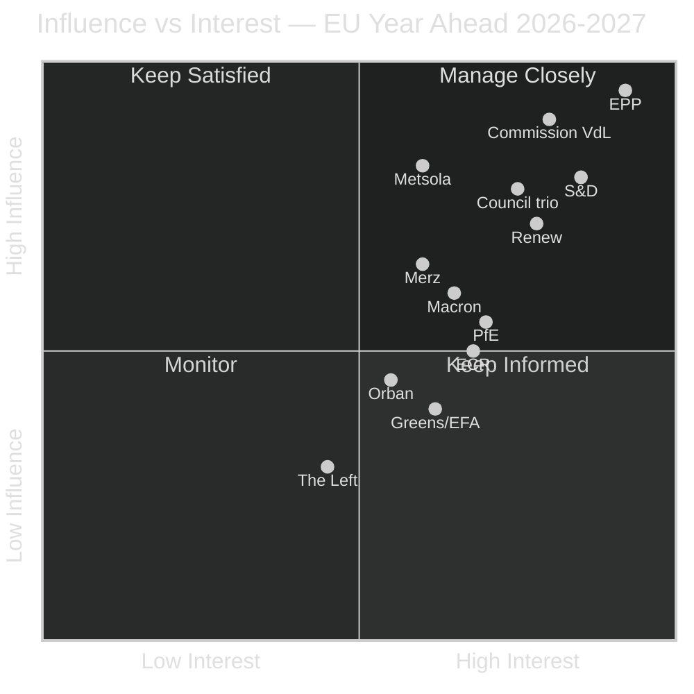
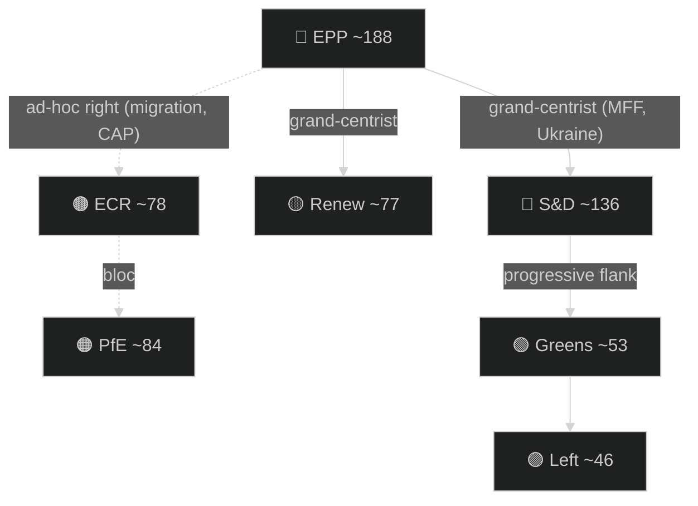

# Actor Mapping — EU Parliament Year Ahead 2026-05-30 → 2027-05-30
**Date:** 2026-05-30 | **Article Type:** year-ahead | **Methodology:** Multi-dimensional Actor Analysis (influence × interest, power-broker ranking)

This artifact maps the actors who will shape the European Union's legislative year from 30 May 2026 to 30 May 2027 — the mid-point of the tenth parliamentary term (EP10, 2024–2029). Seat figures are drawn from the established EP10 public record (Admiralty **B2**); the `compare_political_groups` MCP call this run returned only a partial slice (PfE 85, ECR 81, ESN 27; balance index 0.61) and is graded **C3**. Confidence labels are inline: 🟢 HIGH, 🟡 MEDIUM, 🔴 LOW.

---

## Actor Roster — Who Holds the Cards

The roster is organised by institutional weight, not alphabet. Tier 1 actors can make or break a 361-seat majority; Tier 2 actors swing outcomes at the margin; Tier 3 actors are agenda-shapers and veto-points outside the chamber.

### Tier 1 — Decisive (parliamentary groups)

| Actor | Seats (≈/720) | Anchor parties | Core year-ahead interest | Confidence |
|-------|---------------|----------------|--------------------------|------------|
| **EPP** | ~188 (largest) | CDU/CSU, PP, PO | Competitiveness "omnibus", MFF discipline, managed migration | 🟢 HIGH |
| **S&D** | ~136 | SPD, PSOE, PD | Social Europe, housing, climate ambition, anti-deregulation | 🟢 HIGH |
| **PfE** | ~84 | RN, Fidesz, Lega | Block Mercosur farm exposure, migration maximalism, MFF clawback | 🟡 MEDIUM |
| **ECR** | ~78 | FdI, PiS, ODS | Sovereignty, CAP defence, selective EPP cooperation | 🟡 MEDIUM |
| **Renew** | ~77 | RE, FDP-adjacent, VVD | Single market, Mercosur ratification, enlargement, Ukraine finance | 🟢 HIGH |

### Tier 2 — Significant (parliamentary groups)

| Actor | Seats (≈) | Year-ahead posture | Confidence |
|-------|-----------|--------------------|------------|
| **Greens/EFA** | ~53 | Defend Green Deal against "omnibus" rollback; ally S&D on housing | 🟢 HIGH |
| **The Left** | ~46 | Oppose defence-bond financing, push tenant protection | 🟡 MEDIUM |
| **NI (non-attached)** | ~33 | Heterogeneous; net drift toward ECR/PfE orbit | 🟡 MEDIUM |
| **ESN** | ~25 | AfD-anchored hard fringe; bloc-votes against integration | 🟡 MEDIUM |

### Tier 3 — Institutional & national power-points

- **Roberta Metsola (EPP)** — EP President; agenda gatekeeper, plenary scheduler, inter-institutional face of Parliament.
- **Ursula von der Leyen (EPP)** — Commission President (second term); owns the work-programme to which Parliament reacts, including the MFF post-2027 proposal and the competitiveness omnibus.
- **Council presidency trio** — Cyprus (H1-2026), Ireland (H2-2026), Lithuania (H1-2027), Greece (H2-2027). 🟡 MEDIUM — unverified this run (**C3**). Ireland's H2-2026 chair coincides with peak MFF and Mercosur friction; Dublin's farm sensitivities matter.
- **Key rapporteurs** — BUDG co-rapporteurs on the 2027 budget and MFF guidelines; INTA rapporteur on Mercosur safeguards; ECON rapporteur on the ECB Annual Report 2025; the LIBE hand on "safe third country" asylum reform; the first-ever EP housing own-initiative rapporteur.
- **Member-state principals** — Friedrich Merz (Germany, net-contributor discipline), Emmanuel Macron (France, weakened but pivotal on Mercosur/defence), Giorgia Meloni (Italy, ECR bridge to the mainstream), Viktor Orbán (Hungary, unanimity spoiler on enlargement and Ukraine).

---

## Influence × Interest Grid

The grid below positions each actor by capacity to move outcomes (influence) against intensity of stake in the year-ahead agenda (interest). High-influence/high-interest actors are the ones to watch on every file.

---

## Alliance Topology — Coalitions That Pass Bills

Majority threshold is 361 of 720. EP10's defining feature is **dual-track coalition-building**: a centrist grand bloc for institutional and budget files, and ad-hoc right-leaning majorities the EPP assembles on migration, environment rollback and agriculture.

| Coalition | Members | Seats (≈) | Viable? | Typical files |
|-----------|---------|-----------|---------|---------------|
| Grand-centrist | EPP+S&D+Renew | ~401 | ✅ Strong (+40) | MFF, Ukraine finance, institutional |
| EPP–S&D only | EPP+S&D | ~324 | ❌ Short by 37 | none alone |
| Right-leaning ad-hoc | EPP+ECR+PfE | ~350 | ❌ Short by 11 | migration, CAP, omnibus (needs +NI) |
| Right stretch | EPP+ECR+PfE+ESN+NI | ~408 | ✅ Marginal | migration maximalism |
| Progressive | S&D+Renew+Greens+Left | ~312 | ❌ Short by 49 | none without EPP |

**Reading (🟢 HIGH):** the EPP sits at the only node common to every winning coalition. S&D's leverage is structurally high on grand-centrist files because the right-stretch alternative carries reputational cost. Renew is the swing supplier that keeps any single partner from holding the EPP hostage.

---

## Power Brokers — The Decisive Few

Ranked by year-ahead leverage:

1. **EPP group leadership + Metsola (🟢 HIGH)** — controls plenary scheduling and is the indispensable coalition pivot. Every MFF, Mercosur and migration file routes through EPP whips.
2. **von der Leyen Commission (🟢 HIGH)** — sole initiator; the MFF post-2027 proposal and competitiveness omnibus set the entire reactive agenda. Evidence: the 51 adopted texts of 2026 (`get_adopted_texts`, year=2026) cluster around Commission-originated competitiveness, banking-union and Ukraine-finance files.
3. **BUDG/MFF rapporteurs (🟡 MEDIUM)** — translate Council's net-contributor pressure into amendable text; their compromise drafts decide whether autumn 2026 ends in deal or deadlock.
4. **Macron + French farm lobby via PfE/Renew split (🟡 MEDIUM)** — France is simultaneously the Mercosur swing state and a defence-financing champion; its internal contradiction shapes two top-tier files.
5. **Orbán (🟡 MEDIUM)** — Council-level unanimity spoiler on enlargement chapters and Russian-asset-backed Ukraine instruments; limited inside Parliament but able to stall at European Council.

---

## Information & Provenance

| Source | Admiralty | Note |
|--------|-----------|------|
| EP Open Data `/adopted-texts` 2026 via `get_adopted_texts` (51 texts) | **A1/B2** | Official primary feed; substance source this run |
| IMF SDMX WEO (live, vintage 2025-09-23) | **A1** | Sole authority for economic claims; e.g. French fiscal deficit −4.94% of GDP (2026) frames net-contributor pressure |
| EP10 structural seat counts | **B2** | Established public record |
| `compare_political_groups` (partial: PfE 85, ECR 81, ESN 27; index 0.61) | **C3** | Degraded; supplemented structurally |
| Council presidency trio | **C3** | 🟡 Unverified this run |
| `/procedures-feed`, `/events-feed`, `/documents-feed` | — | HTTP 404 outage; logged in `intelligence/mcp-reliability-audit.md` |

**Economic anchor (🟢 HIGH, IMF):** the broker map is overlaid on a low-growth backdrop — IMF projects German real GDP growth of just 0.79% in 2026 and a German fiscal deficit of −3.78% of GDP, hardening Berlin's MFF-discipline stance and amplifying the net-contributor versus cohesion fault line that every Tier-1 actor must navigate.

---

## Reader Briefing — What to Watch

- 🟢 **The EPP is the fulcrum.** If you track one actor, track EPP whip behaviour: a shift from grand-centrist to right-stretch majorities on a budget file would signal a structural realignment.
- 🟡 **Ireland's H2-2026 Council chair** lands at the MFF/Mercosur crunch; Dublin's farm exposure could slow ratification.
- 🟡 **Watch the France paradox** — Paris pushes defence bonds while resisting Mercosur; that tension fractures both Renew and PfE.
- 🟢 **Coalition arithmetic is unforgiving:** no bloc reaches 361 without the EPP, so the real story of the year is which partner the EPP chooses, file by file.
- 🔴 **Data caveat:** forward sittings, procedures and events feeds were down this run; behavioural forecasts carry wider error bars than the seat arithmetic.

---

*Methodology: multi-dimensional actor mapping per `analysis/methodologies/artifact-catalog.md`. Sources: `get_adopted_texts` (EP Open Data), IMF SDMX WEO, EP10 public record. Confidence: 🟢 HIGH for seat arithmetic; 🟡 MEDIUM for behavioural and presidency-trio claims.*
