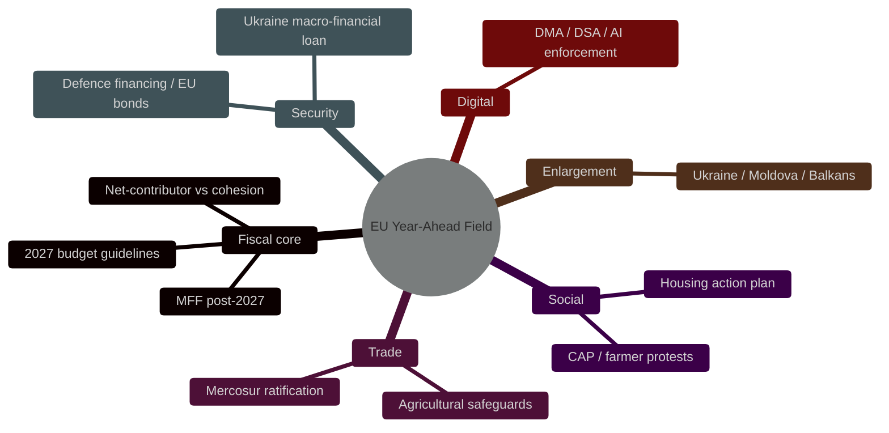
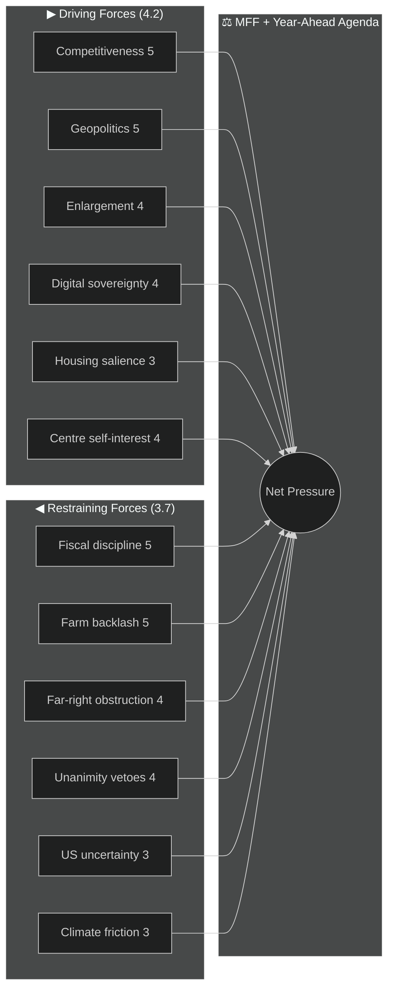
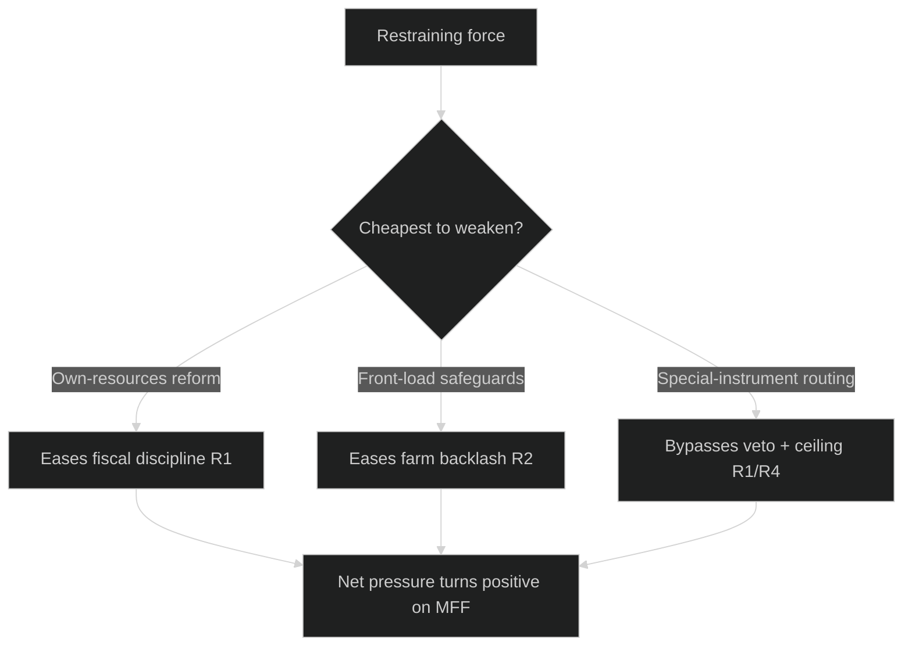

# Forces Analysis — EU Parliament Year Ahead 2026-05-30 → 2027-05-30
**Date:** 2026-05-30 | **Article Type:** year-ahead | **Framework:** Lewin Force-Field Analysis (driving vs restraining vectors, net-pressure scoring)

This artifact applies Kurt Lewin's force-field method to the European Union's legislative agenda for the year ahead. Each force is scored 1–5 for strength; the net of driving minus restraining pressure indicates whether a given vector advances or stalls. Confidence labels are inline (🟢 HIGH, 🟡 MEDIUM, 🔴 LOW). Substance is drawn from the 51 adopted texts of 2026 (`get_adopted_texts`, Admiralty **B2**) and live IMF WEO figures (**A1**).

---

## Issue Frame — The Field Under Study

**Central question:** Will the EP10 mid-term (2026-2027) deliver a coherent, forward legislative programme, or will it fragment into reactive crisis management and budget deadlock?

The "field" is the EU year-ahead agenda, whose centre of gravity is the **MFF post-2027 negotiation** — the dominant fiscal battleground — flanked by CAP reform, Mercosur ratification, enlargement, defence financing and digital enforcement. The agenda sits on a low-growth, fiscally-stressed economic plate: IMF projects euro-area heavyweight growth barely above stagnation — Germany 0.79%, France 0.86%, Italy 0.52% real GDP growth in 2026 — while all three run deficits (France −4.94% of GDP, Germany −3.78%, Italy −2.82% in 2026, IMF WEO). That backdrop tightens every distributive fight.

---

## Driving Forces — Pushing the Agenda Forward

| # | Driving force | Strength | Evidence / confidence |
|---|---------------|----------|------------------------|
| D1 | **Competitiveness imperative** — Draghi-era "omnibus" deregulation drive to close the EU productivity gap | 5 | Adopted Better Law-Making / simplification texts; 🟢 HIGH |
| D2 | **Geopolitical urgency** — Ukraine finance via immobilised Russian assets, "readiness 2030" defence push | 5 | Macro-financial loan for Ukraine adopted; 🟢 HIGH |
| D3 | **Enlargement momentum** — accession-chapter openings for Ukraine, Moldova, Western Balkans | 4 | Foreign-affairs urgency resolutions; 🟡 MEDIUM |
| D4 | **Digital-sovereignty agenda** — DMA/DSA enforcement and an AI strategy for trade | 4 | DMA/DSA enforcement texts; 🟢 HIGH |
| D5 | **Social-salience pressure** — first EP own-initiative on affordable housing answers a real cost-of-living grievance | 3 | Housing own-initiative + Commission action plan; 🟢 HIGH |
| D6 | **Institutional self-interest** — EPP–S&D–Renew need visible MFF delivery to defend the centre before 2029 | 4 | Coalition arithmetic ~401 seats; 🟡 MEDIUM |

**Driving composite: 4.2/5 (🟢 HIGH).** The forward thrust is genuine and multi-sourced; competitiveness and security are the strongest vectors.

---

## Restraining Forces — Holding the Agenda Back

| # | Restraining force | Strength | Evidence / confidence |
|---|-------------------|----------|------------------------|
| R1 | **Net-contributor fiscal discipline** — Germany and frugal states resist a larger MFF amid −3.78% deficits | 5 | IMF WEO fiscal balances; 🟢 HIGH |
| R2 | **Agricultural backlash** — CAP reform + Mercosur farm exposure risk renewed farmer protests | 5 | Mercosur safeguards + CAP post-2027 texts; 🟢 HIGH |
| R3 | **Far-right obstruction** — PfE (84) + ECR (78) + ESN (25) = ~187 seats able to slow but not legislate | 4 | Partial `compare_political_groups` (C3) + structural; 🟡 MEDIUM |
| R4 | **Unanimity chokepoints** — Council vetoes (Orbán) on enlargement chapters and Russian-asset instruments | 4 | Structural Council rule; 🟡 MEDIUM |
| R5 | **Transatlantic uncertainty** — unpredictable US trade/security posture deters EU commitments | 3 | Resolutions on trade tensions; 🟡 MEDIUM |
| R6 | **Climate-vs-competitiveness friction** — "omnibus" rollback alienates Greens/S&D, narrowing majorities | 3 | Environment rollback texts; 🟡 MEDIUM |
| R7 | **Feed/data opacity** — degraded EP feeds this run obscure pipeline velocity | 2 | `/procedures-feed` 404; 🔴 LOW visibility |

**Restraining composite: 3.7/5 (🟡 MEDIUM-HIGH).** Fiscal discipline and the farm backlash are the hardest brakes.

---

## Net Pressure — Where the Field Settles

Aggregating by vector (driving minus restraining, normalised):

| Sub-field | Driving | Restraining | Net | Read (confidence) |
|-----------|---------|-------------|-----|-------------------|
| MFF post-2027 | 4.0 | 4.5 | **−0.5** | Stalled into late 2026; deal slips toward 2027 — 🟡 MEDIUM |
| Mercosur ratification | 4.0 | 4.5 | **−0.5** | Grinds via CJEU opinion + safeguards; no clean win — 🟡 MEDIUM |
| Competitiveness omnibus | 4.5 | 3.0 | **+1.5** | Advances; deregulation passes on ad-hoc right majorities — 🟢 HIGH |
| Ukraine finance | 4.5 | 3.5 | **+1.0** | Advances but Council-gated on asset use — 🟡 MEDIUM |
| Enlargement chapters | 4.0 | 4.0 | **0.0** | Symbolic progress, unanimity-blocked substance — 🟡 MEDIUM |
| Digital enforcement | 4.0 | 2.5 | **+1.5** | Advances; Brussels-effect tailwind — 🟢 HIGH |
| Housing action | 3.0 | 2.0 | **+1.0** | Advances as own-initiative/soft-law — 🟢 HIGH |

**Aggregate net pressure: mildly positive (+0.6, 🟡 MEDIUM).** The agenda moves, but its fiscal core (MFF, Mercosur) is near-gridlocked while competitiveness and digital files carry the year's tangible output.

---

## Intervention Points — Where Small Moves Shift Outcomes

Lewin's insight: it is usually more efficient to weaken a restraining force than to add driving force. The highest-leverage interventions for the year ahead:

1. **Sequence the MFF "own-resources" debate early (🟢 HIGH leverage).** New revenue streams reduce the net-contributor squeeze (R1) more than headline-size fights ever will.
2. **Front-load Mercosur agricultural safeguards (🟡 MEDIUM).** Concrete beef/poultry/ethanol quotas defuse R2 before protests harden into a blocking minority.
3. **Ring-fence Ukraine finance from the MFF ceiling (🟡 MEDIUM).** Special-instrument routing (as with prior loans) bypasses R1/R4 without reopening the budget.
4. **Decouple competitiveness simplification from climate rollback (🟡 MEDIUM).** Keeping the two files separate preserves the Greens/S&D flank and widens majorities (eases R6).
5. **Publish a forward-sitting calendar (🟢 HIGH, procedural).** Restoring feed transparency (R7) is cheap and improves every actor's planning.

---

## Reader Briefing — What to Watch

- 🟡 **The MFF is the year's keystone, and it is the most stalled.** Expect brinkmanship through autumn 2026; a clean deal before 2027 is, on balance, **Unlikely**.
- 🟢 **Competitiveness and digital files are where output actually happens** — the EPP can assemble ad-hoc right majorities, so deregulation and DMA/DSA enforcement advance even as the budget jams.
- 🟢 **Own-resources reform is the single highest-leverage lever.** Watch whether the Commission's MFF proposal includes credible new revenue; without it, the fiscal brake holds.
- 🟡 **The farm vote is the swing.** A poorly-sequenced Mercosur push could ignite protests that spill onto CAP and cohesion votes alike.
- 🔴 **Mind the visibility gap:** with procedures/events feeds down this run, velocity readings are low-confidence; treat timeline calls as directional, not precise.

---

*Methodology: Lewin force-field analysis per `analysis/methodologies/artifact-catalog.md`. Sources: `get_adopted_texts` (EP Open Data, 51 texts, B2); IMF SDMX WEO (live, A1). Confidence: 🟢 HIGH on structural forces; 🟡 MEDIUM on net-pressure timing.*
