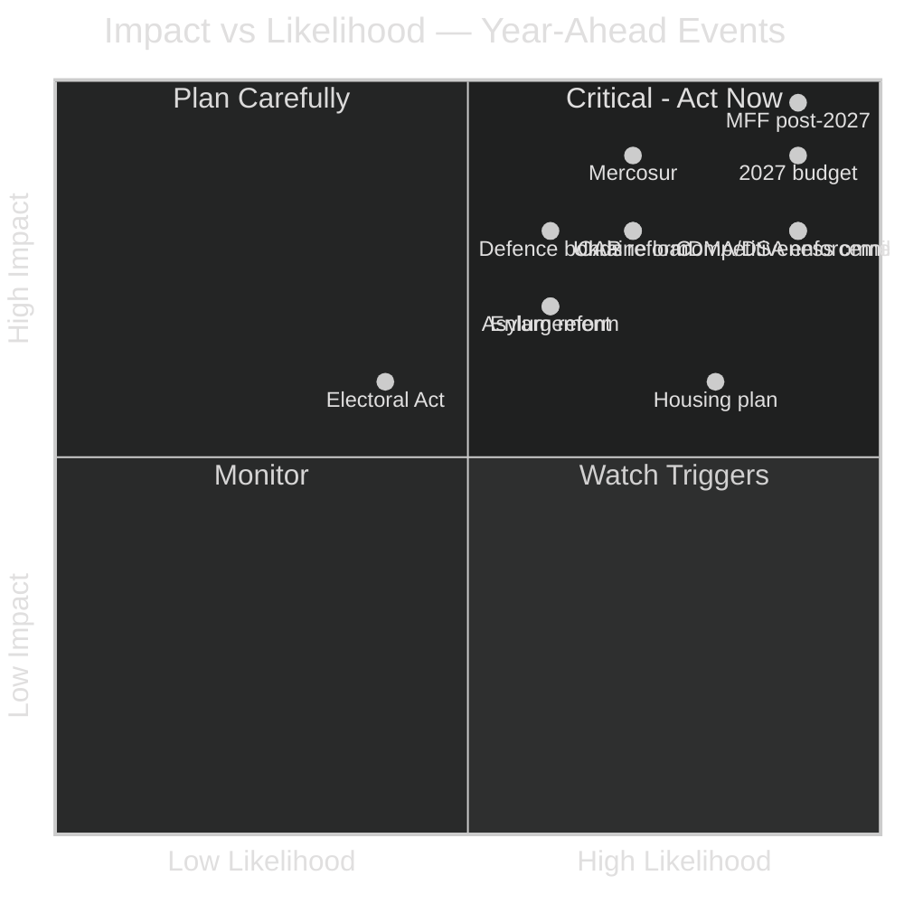
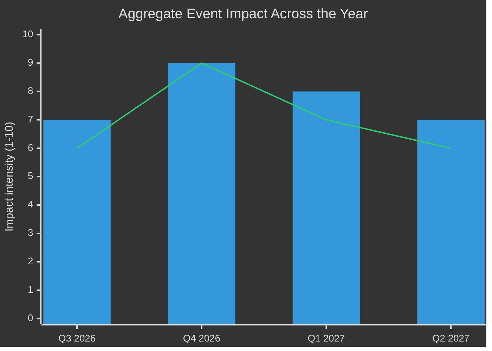
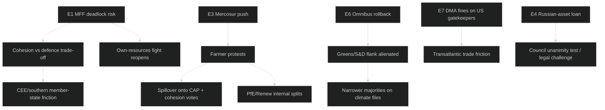

# Impact Matrix — EU Parliament Year Ahead 2026-05-30 → 2027-05-30
**Date:** 2026-05-30 | **Article Type:** year-ahead | **Methodology:** Multi-stakeholder Impact Assessment (impact × likelihood, heat-scoring, cascade tracing)

This artifact scores the principal events of the year ahead by their impact on EU stakeholders and the likelihood they materialise, then traces second- and third-order cascades. Scoring: **Impact (1–10) × Likelihood (1–10) = Priority**. Confidence inline (🟢 HIGH, 🟡 MEDIUM, 🔴 LOW). Substance from the 51 adopted texts of 2026 (`get_adopted_texts`, Admiralty **B2**) and live IMF WEO (**A1**).

---

## Event List — The Year's Pivotal Moments

| ID | Event | Window | Confidence |
|----|-------|--------|------------|
| E1 | **MFF post-2027 negotiation opens** (Commission proposal + EP guidelines) | Q3 2026 → Q2 2027 | 🟢 HIGH |
| E2 | **2027 EU budget first reading** | Q4 2026 | 🟢 HIGH |
| E3 | **EU–Mercosur ratification fight** (CJEU opinion + agricultural safeguards) | Q3 2026 → Q2 2027 | 🟡 MEDIUM |
| E4 | **Macro-financial loan for Ukraine** (immobilised Russian assets framing) | Continuous | 🟡 MEDIUM |
| E5 | **CAP post-2027 reform** + farmer-protest risk | Q4 2026 → Q2 2027 | 🟡 MEDIUM |
| E6 | **Competitiveness "omnibus" deregulation** tranche | Q3 2026 → Q1 2027 | 🟢 HIGH |
| E7 | **DMA/DSA enforcement** ramp-up vs gatekeepers; AI strategy for trade | Continuous | 🟢 HIGH |
| E8 | **Enlargement accession chapters** (Ukraine/Moldova/Balkans) | Continuous | 🟡 MEDIUM |
| E9 | **Asylum Procedure "safe third country" reform** | Q4 2026 → Q2 2027 | 🟡 MEDIUM |
| E10 | **Defence financing / EU bonds** ("readiness 2030") | Continuous | 🟡 MEDIUM |
| E11 | **Affordable-housing action plan** (EP own-initiative + Commission) | Q3 2026 → Q1 2027 | 🟢 HIGH |
| E12 | **EU Electoral Act reform** (transnational lists debate) | Continuous | 🔴 LOW |

---

## Stakeholder Register — Who Is Exposed

| Stakeholder | Primary exposure | Net sensitivity |
|-------------|------------------|-----------------|
| 27 member-state treasuries | MFF size, own-resources, net-contributor split | Very high |
| EU farmers (Copa-Cogeca) | Mercosur quotas, CAP envelope | Very high |
| EU citizens / households | Housing, cost-of-living, budget priorities | High |
| Big-tech gatekeepers (US/global) | DMA/DSA fines, interoperability | High |
| Ukraine | Loan disbursement, accession pace | High |
| Defence industry | EU-bond financing, EDIP instruments | Medium-high |
| Greens/climate constituency | Omnibus rollback scope | Medium |
| Candidate states (Moldova/Balkans) | Chapter openings, pre-accession funds | Medium |
| Migrants / asylum NGOs | "Safe third country" reform | Medium |

---

## Impact Matrix — Scored

| Event | Impact (1–10) | Likelihood (1–10) | Priority | Tier |
|-------|---------------|-------------------|----------|------|
| E1 MFF post-2027 | 10 | 9 | **90** | 🔴 Critical |
| E2 2027 budget first reading | 9 | 9 | **81** | 🔴 Critical |
| E6 Competitiveness omnibus | 8 | 9 | **72** | 🔴 Critical |
| E7 DMA/DSA enforcement | 8 | 9 | **72** | 🔴 Critical |
| E3 Mercosur ratification | 9 | 7 | **63** | 🟠 High |
| E4 Ukraine loan | 8 | 7 | **56** | 🟠 High |
| E5 CAP reform + protests | 8 | 7 | **56** | 🟠 High |
| E10 Defence financing/EU bonds | 8 | 6 | **48** | 🟠 High |
| E11 Housing action plan | 6 | 8 | **48** | 🟠 High |
| E8 Enlargement chapters | 7 | 6 | **42** | 🟡 Medium |
| E9 Asylum "safe third country" | 7 | 6 | **42** | 🟡 Medium |
| E12 Electoral Act reform | 6 | 4 | **24** | 🟡 Medium |

**Economic frame (🟢 HIGH, IMF):** the four critical events all turn on fiscal capacity. IMF projects the bloc's three largest economies barely growing in 2026 (Germany 0.79%, France 0.86%, Italy 0.52% real GDP) while running deficits above the 3% reference value in two of three cases (France −4.94%, Germany −3.78% of GDP). Thin growth and stretched budgets raise the impact of every distributive event in the matrix.

---

## Heat Map — Impact vs Likelihood

**Peak window: Q4 2026** — the 2027 budget first reading collides with MFF brinkmanship, CAP framing and the asylum file. Autumn is the year's hinge.

---

## Cascade Analysis — Second- and Third-Order Effects

| Trigger | First-order | Second-order | Third-order | Confidence |
|---------|-------------|--------------|-------------|------------|
| MFF deadlock (E1) | Provisional twelfths risk | Programme disruption across 27 states | Centre's pre-2029 credibility dented | 🟡 MEDIUM |
| Mercosur push (E3) | Farm protests | Votes spill onto CAP/cohesion | Far-right electoral dividend | 🟡 MEDIUM |
| Omnibus rollback (E6) | Greens/S&D defect | Narrower climate majorities | Green Deal legacy erosion | 🟡 MEDIUM |
| DMA fines (E7) | US retaliation threat | EU–US trade friction | Digital-sovereignty hardening | 🟡 MEDIUM |
| Russian-asset loan (E4) | Legal/unanimity challenge | Disbursement delay | Precedent for asset seizure | 🟡 MEDIUM |

---

## Sources & Provenance

| Source | Admiralty | Note |
|--------|-----------|------|
| EP Open Data `/adopted-texts` 2026 via `get_adopted_texts` (51 texts) | **A1/B2** | Event substance |
| IMF SDMX WEO (live, vintage 2025-09-23) | **A1** | Fiscal/growth framing; sole economic authority |
| EP10 structural seat counts | **B2** | Coalition feasibility |
| `compare_political_groups` (partial) | **C3** | Degraded this run |
| `/procedures-feed`, `/events-feed` (404) | — | Timeline confidence reduced; see `intelligence/mcp-reliability-audit.md` |

---

## Reader Briefing — What to Watch

- 🔴 **Q4 2026 is the danger zone:** the 2027 budget first reading and MFF brinkmanship coincide; a stumble here cascades across cohesion and defence.
- 🟢 **DMA/DSA enforcement and the competitiveness omnibus are the year's reliable output** — high impact, high likelihood, EPP-led majorities available.
- 🟡 **Mercosur is the swing risk:** high impact but contingent on CJEU timing and whether agricultural safeguards land before protests harden.
- 🟡 **Ukraine finance advances but is Council-gated** — the immobilised-asset framing invites legal challenge and a unanimity test.
- 🔴 **Treat all timing as directional:** forward-sitting, procedures and events feeds were down this run, so likelihood scores lean on structural knowledge, not live pipeline data.

---

*Methodology: multi-stakeholder impact matrix per `analysis/methodologies/artifact-catalog.md`. Sources: `get_adopted_texts` (EP Open Data, B2); IMF SDMX WEO (A1). Confidence codes apply to each row as marked.*
