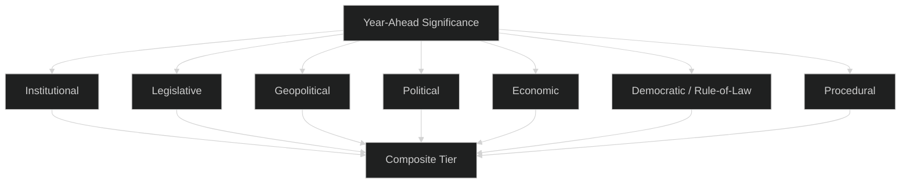
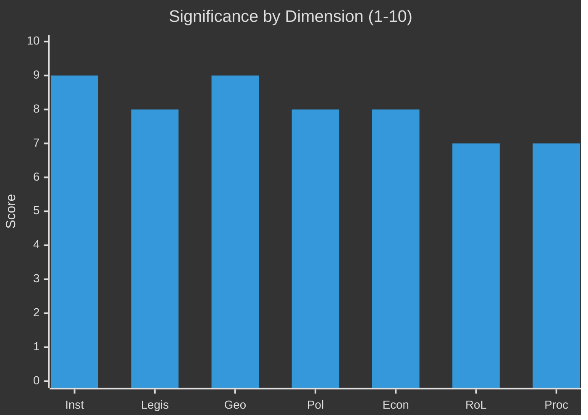

# Significance Classification — EU Parliament Year Ahead 2026-05-30 → 2027-05-30
**Date:** 2026-05-30 | **Article Type:** year-ahead | **Methodology:** 7-Dimension Significance Classification (tiered scoring with rationale + confidence)

This artifact classifies how consequential the year-ahead developments are across seven dimensions, assigning a tiered score (1–10) with explicit rationale and a confidence label to each. Confidence inline: 🟢 HIGH, 🟡 MEDIUM, 🔴 LOW. Substance is drawn from the 51 adopted texts of 2026 (`get_adopted_texts`, Admiralty **B2**) and live IMF WEO figures (**A1**). Tier bands: **Tier 1 (≥8.0) Strategic**, **Tier 2 (6.0–7.9) Significant**, **Tier 3 (<6.0) Routine**.

---

## Classification Framework

Each dimension is scored on consequence magnitude, breadth of affected stakeholders, durability of effect and reversibility. A confidence label captures evidential strength given this run's degraded feeds (procedures/events/documents feeds returned HTTP 404; forward sittings empty; landscape generation timed out).

---

## Dimension 1: Institutional Significance — Score 9/10 (🟢 HIGH)

The window spans the **mid-term of EP10**, the consolidation phase where the von der Leyen II work programme is fully operational and the **MFF post-2027** negotiation opens — the most consequential institutional exercise of the term. The 2027 budget first reading tests the durability of the EPP–S&D–Renew grand-centrist coalition (~401 seats) under fiscal stress. Historical analogue: EP9's 2020–2021 MFF/recovery-fund crunch carried comparable weight.

**Rationale:** an MFF cycle shapes EU spending for seven years and is effectively irreversible once agreed; breadth is total (27 states, all programmes). **Tier 1.**

---

## Dimension 2: Legislative Significance — Score 8/10 (🟢 HIGH)

The pipeline is dense with consequential instruments evidenced in the 2026 adopted texts:

| Track | Status (from adopted texts) | Significance |
|-------|------------------------------|--------------|
| Competitiveness "omnibus" / Better Law-Making | Active deregulation drive | HIGH |
| DMA/DSA enforcement vs gatekeepers | Active resolutions | HIGH |
| EU–Mercosur (CJEU opinion + safeguards) | Pending | VERY HIGH |
| Macro-financial loan for Ukraine | Adopted/continuing | HIGH |
| CAP post-2027 + heavy-duty vehicle CO2 | Active | HIGH |
| Affordable-housing own-initiative | First-ever | MEDIUM-HIGH |
| Banking-union deepening + ECB Annual Report 2025 | Adopted | MEDIUM-HIGH |
| EU Electoral Act reform / transnational lists | Stalled in ratification | HIGH (long-run) |

**Rationale:** the single highest-consequence domestic track is the competitiveness omnibus (it touches the entire regulatory stock); the highest-consequence procedural track remains the MFF. **Tier 1 borderline.**

---

## Dimension 3: Geopolitical Significance — Score 9/10 (🟢 HIGH)

The external environment elevates every vote: the **Ukraine macro-financial loan** built on immobilised Russian assets is a precedent-setting instrument; defence financing and "readiness 2030" reflect a structural security pivot; enlargement (Ukraine, Moldova, Western Balkans) carries strategic weight against unanimity blocks; transatlantic uncertainty under the US administration shadows trade and defence alike. Mercosur is simultaneously a trade and a geopolitical diversification play.

**Rationale:** consequences are durable, externally driven and only partly within EP control. **Tier 1.**

---

## Dimension 4: Political Significance — Score 8/10 (🟢 HIGH)

EP10's **dual-track coalition system** is the year's political story. The grand-centrist bloc (~401) governs institutional and budget files; the EPP assembles ad-hoc right-leaning majorities (EPP+ECR+PfE, ~350, +NI to clear 361) on migration, environment rollback and agriculture. 2027 is the term's mid-point — positioning ahead of the 2029 election begins, and the **far-right consolidation test** (PfE ~84 + ECR ~78 + ESN ~25 ≈ 187 seats) intensifies.

**Rationale:** coalition choices are reversible file-by-file but cumulatively define the centre's pre-2029 credibility. 🟡 MEDIUM on behavioural specifics (partial `compare_political_groups`, C3). **Tier 1 borderline.**

---

## Dimension 5: Economic-Policy Significance — Score 8/10 (🟢 HIGH)

Economic legislation dominates the forward agenda against a stagnation backdrop. **IMF (sole authority, A1)** projects:

| Economy | Real GDP growth 2026 | Avg CPI 2026 | Fiscal balance 2026 (% GDP) |
|---------|----------------------|--------------|------------------------------|
| Germany | 0.79% | 2.65% | −3.78% |
| France | 0.86% | 1.84% | −4.94% |
| Italy | 0.52% | 2.64% | −2.82% |

Thin growth and France's deficit of −4.94% of GDP harden the net-contributor stance on the MFF and constrain fiscal space for defence and cohesion simultaneously. Banking-union deepening, the ECB Annual Report 2025, EGF deindustrialisation cases (Audi Brussels, Tupperware) and Capital Markets Union all sit on this dimension.

**Rationale:** macro constraints are durable and bind every distributive file. **Tier 1 borderline.**

---

## Dimension 6: Democratic / Rule-of-Law Significance — Score 7/10 (🟡 MEDIUM)

Active threads include the **EU Electoral Act reform** (uniform procedure, transnational lists) stalled in member-state ratification; rule-of-law conditionality in candidate and neighbourhood states (Georgia, others flagged in 2026 resolutions); transparency and immunity machinery functioning. The asylum "safe third country" reform raises fundamental-rights questions that NGOs will contest.

**Rationale:** high salience, but progress is incremental and partly reversible. **Tier 2.**

---

## Dimension 7: Procedural / Institutional Significance — Score 7/10 (🟡 MEDIUM)

Procedural weight is elevated by the **CJEU opinion request on Mercosur** (EP using judicial review as strategic instrument), the Better Law-Making / simplification agenda demanding Commission restraint, and the EP's own 2027 budget estimates filed ahead of negotiations. This run's feed outages (404 on procedures/events/documents) are themselves a procedural-transparency concern documented in `intelligence/mcp-reliability-audit.md`.

**Rationale:** precedent-setting on trade consent procedure; otherwise steady-state. **Tier 2.**

---

## Composite Significance

| Dimension | Score | Tier | Trend |
|-----------|-------|------|-------|
| Institutional | 9/10 | 1 | 🔼 Rising |
| Legislative | 8/10 | 1 | → Stable |
| Geopolitical | 9/10 | 1 | 🔼 Rising |
| Political | 8/10 | 1 | → Stable |
| Economic | 8/10 | 1 | 🔼 Rising |
| Democratic/RoL | 7/10 | 2 | → Stable |
| Procedural | 7/10 | 2 | → Stable |
| **Composite** | **8.0/10** | **Tier 1** | **🔼 Rising** |

**Classification: TIER 1 — STRATEGIC SIGNIFICANCE (composite 8.0).** The year qualifies as Tier 1 on the convergence of an MFF cycle, a geopolitical security pivot and a digital-enforcement push inside a single 12-month window, atop a stagnation-grade macro base.

---

## Confidence & Caveats

- 🟢 **HIGH** on seat arithmetic, adopted-text substance and IMF figures (live, vintage 2025-09-23).
- 🟡 **MEDIUM** on coalition behaviour (partial `compare_political_groups`, C3) and the Council presidency trio (unverified, C3).
- 🔴 **LOW** on forward timeline precision: `/procedures-feed`, `/events-feed`, `/documents-feed` returned 404; `get_plenary_sessions` forward window empty; `generate_political_landscape` timed out. Significance scores rest on structural knowledge plus the 51 adopted texts, not live pipeline telemetry.

---

## Reader Briefing — What to Watch

- 🟢 The year is **strategically significant (Tier 1)** primarily because the MFF, a security pivot and digital enforcement land together.
- 🟡 Watch whether the composite tips firmly above 8.0: a credible own-resources proposal would push the economic and institutional dimensions higher.
- 🔴 Discount precise timelines — the data outage this run means dates are directional. Re-score once procedures/events feeds recover.

---

*Methodology: 7-dimension significance classification per `analysis/methodologies/artifact-catalog.md`. Sources: `get_adopted_texts` (EP Open Data, 51 texts, B2); IMF SDMX WEO (live, A1); EP10 public record (B2). Confidence codes as marked.*
