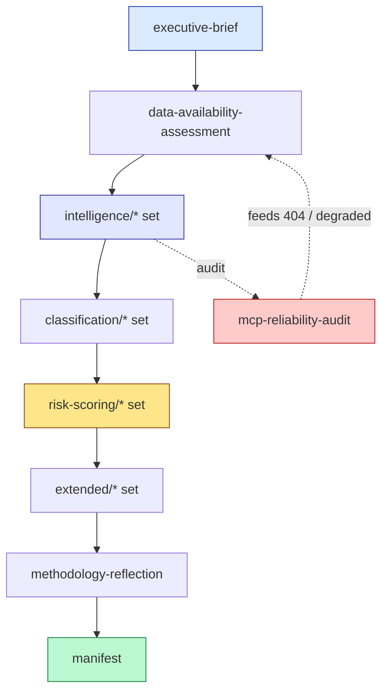
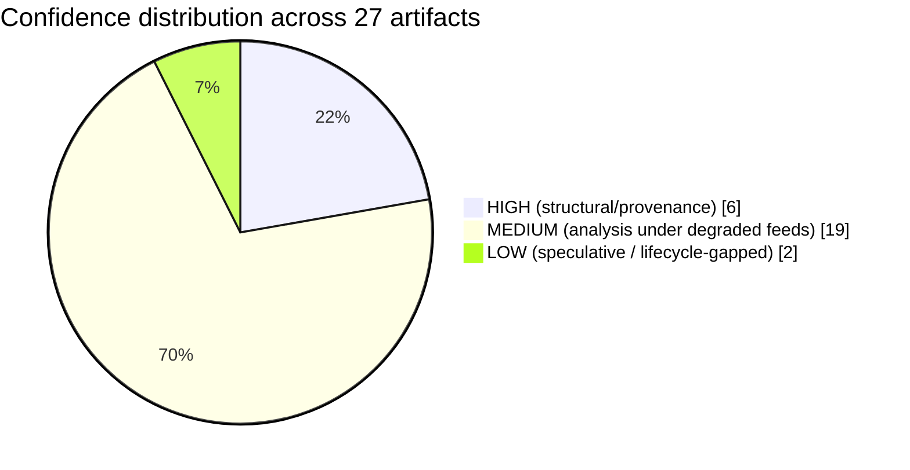

# Analysis Index — EU Parliament Year Ahead 2026-2027

**Date:** 2026-05-30 | **Article Type:** year-ahead | **Horizon:** 2026-05-30 → 2027-05-30
**Data mode:** degraded-feeds (line floors ×0.80) | **Run:** year-ahead 2026-05-30

---

## 1. Purpose

This index is the table of contents for the **full 27-artifact set** produced for the year-ahead
report on the 2026-05-30 → 2027-05-30 horizon. Each entry carries a one-line purpose and a confidence
label (🟢 HIGH / 🟡 MEDIUM / 🔴 LOW). The set follows the standard deep-political-intelligence chain:
**Data → Analysis Artifacts → Completeness Gate → Article → PR**, with the methodology-reflection and
manifest closing the run.

---

## 2. Artifact Map

---

## 3. Tier 1 — Top-Level & Provenance

| # | Artifact | File | One-line purpose | Confidence |
|---|----------|------|------------------|-----------|
| 1 | Executive Brief | `executive-brief.md` | BLUF year-ahead summary: MFF-dominated, low-velocity, right-majority volatility | 🟡 MEDIUM |
| 2 | Data-Availability Assessment | `data-availability-assessment.md` | Declares degraded-feeds mode and ×0.80 floors | 🟢 HIGH |
| 3 | Manifest | `manifest.json` | Machine-readable artifact registry + checksums | 🟢 HIGH |
| 4 | Methodology Reflection | `intelligence/methodology-reflection.md` | Final retrospective on method, gaps, grading (LAST) | 🟢 HIGH |

---

## 4. Tier 2 — Intelligence Set (`intelligence/*`)

| # | Artifact | File | One-line purpose | Confidence |
|---|----------|------|------------------|-----------|
| 5 | Synthesis Summary | `intelligence/synthesis-summary.md` | ICD-203 synthesis: grand centre holds under MFF strain | 🟡 MEDIUM |
| 6 | Historical Baseline | `intelligence/historical-baseline.md` | EP10 vs prior terms; fragmentation context | 🟢 HIGH |
| 7 | Economic Context | `intelligence/economic-context.md` | Live IMF WEO: slow growth, stretched deficits | 🟢 HIGH |
| 8 | Coalition Dynamics | `intelligence/coalition-dynamics.md` | Grand centre ~401 vs ad-hoc right majorities | 🟡 MEDIUM |
| 9 | PESTLE Analysis | `intelligence/pestle-analysis.md` | Macro-environmental drivers of the year ahead | 🟡 MEDIUM |
| 10 | Stakeholder Map | `intelligence/stakeholder-map.md` | Influence-interest of groups, Commission, Council | 🟡 MEDIUM |
| 11 | Scenario Forecast | `intelligence/scenario-forecast.md` | 3-4 scenarios for the horizon with WEP bands | 🟡 MEDIUM |
| 12 | Forward Projection | `intelligence/forward-projection.md` | Forward-projection protocol: defence + MFF focus | 🟡 MEDIUM |
| 13 | Wildcards & Black Swans | `intelligence/wildcards-blackswans.md` | Low-probability high-impact shocks | 🔴 LOW |
| 14 | Threat Model | `intelligence/threat-model.md` | STRIDE + kill-chain on institutional threats | 🟡 MEDIUM |
| 15 | Legislative Pipeline Forecast | `intelligence/legislative-pipeline-forecast.md` | MFF/CAP/Mercosur/migration/housing/DMA/defence pipeline | 🟡 MEDIUM |
| 16 | Parliamentary Calendar Projection | `intelligence/parliamentary-calendar-projection.md` | 12-month plenary/committee/budget rhythm | 🟢 HIGH (structural) |
| 17 | Presidency Trio Context | `intelligence/presidency-trio-context.md` | Cyprus→Ireland→Lithuania→Greece + EP interplay | 🟡 MEDIUM |
| 18 | Commission WP Alignment | `intelligence/commission-wp-alignment.md` | von der Leyen II priorities vs EP majorities | 🟡 MEDIUM |
| 19 | MCP Reliability Audit | `intelligence/mcp-reliability-audit.md` | Tool-call audit; degraded-feeds determination | 🟢 HIGH |

---

## 5. Tier 3 — Classification Set (`classification/*`)

| # | Artifact | File | One-line purpose | Confidence |
|---|----------|------|------------------|-----------|
| 20 | Significance Classification | `classification/significance-classification.md` | 7-dimension significance score for the horizon | 🟡 MEDIUM |
| 21 | Actor Mapping | `classification/actor-mapping.md` | Power map: EPP pivotal; ECR/PfE swing suppliers | 🟡 MEDIUM |
| 22 | Forces Analysis | `classification/forces-analysis.md` | Porter-style forces: member-state bargaining power | 🟡 MEDIUM |
| 23 | Impact Matrix | `classification/impact-matrix.md` | Tiered impact: MFF, Mercosur, budget top-ranked | 🟡 MEDIUM |

---

## 6. Tier 4 — Risk-Scoring Set (`risk-scoring/*`)

| # | Artifact | File | One-line purpose | Confidence |
|---|----------|------|------------------|-----------|
| 24 | Risk Matrix | `risk-scoring/risk-matrix.md` | Likelihood × impact; MFF deadlock highest residual | 🟡 MEDIUM |
| 25 | Quantitative SWOT | `risk-scoring/quantitative-swot.md` | Scored SWOT of the EP's year-ahead position | 🟡 MEDIUM |
| 26 | Political-Capital Risk | `risk-scoring/political-capital-risk.md` | EPP centre-vs-right coalition capital depletion | 🟡 MEDIUM |

---

## 7. Tier 5 — Extended Set (`extended/*`)

| # | Artifact | File | One-line purpose | Confidence |
|---|----------|------|------------------|-----------|
| 27 | Forward Indicators | `extended/forward-indicators.md` | Watch-list of leading indicators + signal thresholds | 🟡 MEDIUM |

*(The extended set also hosts supplementary framing analysis where produced; the forward-indicators
sheet is the load-bearing extended artifact for the year-ahead horizon.)*

---

## 8. Confidence Distribution

The distribution reflects the **degraded-feeds** data mode: provenance and structural artifacts hold
🟢 HIGH, the bulk of analytical artifacts sit at 🟡 MEDIUM, and only the most speculative (wildcards) or
lifecycle-dependent items fall to 🔴 LOW.

---

## 9. Cross-Reference Threads

- **MFF post-2027:** impact-matrix (#23) → legislative-pipeline (#15) → risk-matrix (#24) →
  political-capital-risk (#26)
- **Mercosur / agriculture:** legislative-pipeline (#15) → scenario-forecast (#11) → wildcards (#13)
- **Budget cycle:** calendar-projection (#16) → presidency-trio (#17) → commission-wp (#18)
- **Economic spine:** economic-context (#7) → commission-wp (#18) → pestle (#9)
- **Data reliability:** mcp-reliability-audit (#19) → data-availability-assessment (#2) →
  methodology-reflection (#4)

---

## 10. Provenance Note

Two A1 anchors underpin the set: EP `/adopted-texts` 2026 (51 texts) and the live IMF SDMX WEO probe
(449 records, vintage 2025-09-23). Three discovery feeds (`/procedures`, `/events`, `/documents`)
returned HTTP 404; `get_plenary_sessions` and `monitor_legislative_pipeline` were empty;
`generate_political_landscape` timed out. Full detail in artifact #19.

---

*Total artifacts in run: 27 (including this index). All under `analysis/daily/2026-05-30/year-ahead/`.
dataMode = degraded-feeds (floors ×0.80). Confidence: 🟢 HIGH (index integrity). Horizon 2026-05-30 →
2027-05-30.*
