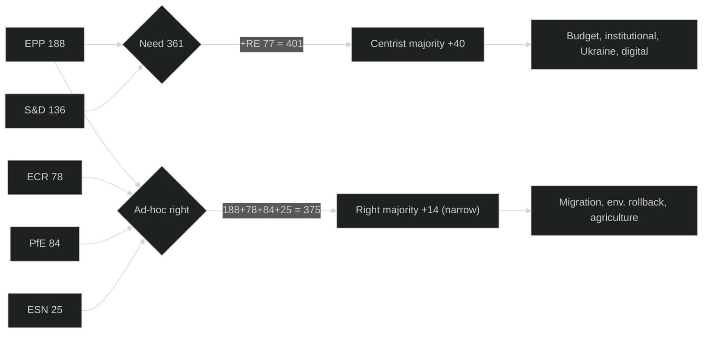
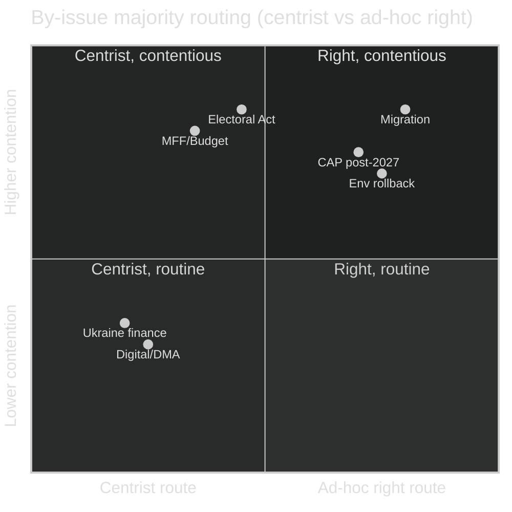

# Coalition Dynamics — EU Parliament Year Ahead 2026-2027
**Date:** 2026-05-30 | **Article Type:** year-ahead | **Horizon:** 2026-05-30 → 2027-05-30
**Methodology:** CIA-style coalition analysis (cohesion, defection, by-issue bloc mapping)

---

## 1. Parliamentary Configuration (EP10, mid-term)

The 720-seat EP10 (2024–2029 term) enters its mid-term phase with the most fragmented
composition in the chamber's history. Seat counts below are the structural public record
(Admiralty B2); a partial `compare_political_groups` probe this run returned only PfE=85,
ECR=81, ESN=27 (C3, degraded) and is treated as corroborating, not authoritative.

| Group | Seats | Share | Bloc |
|-------|------:|------:|------|
| EPP | 188 | 26.1% | Centre-right (largest) |
| S&D | 136 | 18.9% | Centre-left |
| PfE (Patriots for Europe) | 84 | 11.7% | Far-right |
| ECR | 78 | 10.8% | Conservative-nationalist |
| RE / Renew | 77 | 10.7% | Liberal-centrist |
| Greens/EFA | 53 | 7.4% | Green-progressive |
| The Left | 46 | 6.4% | Left |
| NI (non-attached) | 33 | 4.6% | Mixed |
| ESN (Europe of Sovereign Nations) | 25 | 3.5% | Hard far-right |
| **TOTAL** | **720** | **100%** | |

**Absolute-majority threshold:** 361 seats. EP President: Roberta Metsola (EPP). Executive:
von der Leyen II Commission, broadly EPP-anchored.

---

## 2. Coalition Arithmetic — Viable Majorities (≥361)

| Coalition | Members | Seats | Margin | Stability |
|-----------|---------|------:|-------:|-----------|
| Grand centrist coalition | EPP + S&D + RE | 401 | +40 | 🟢 HIGH |
| Centrist + Greens | EPP + S&D + RE + Greens | 454 | +93 | 🟡 MEDIUM (climate strain) |
| Ad-hoc right majority | EPP + ECR + PfE + ESN | 375 | +14 | 🔴 LOW (narrow, costly) |
| Ad-hoc right + NI | EPP + ECR + PfE + ESN + NI | 408 | +47 | 🔴 LOW (NI heterogeneity) |
| Centre-right + ECR | EPP + ECR + RE | 343 | −18 | n/a (short) |
| Broad emergency | EPP + S&D + RE + ECR | 479 | +118 | 🟡 MEDIUM (rare) |

## 2.1 Coalition Arithmetic — Sub-Majority Blocs (<361)

| Coalition | Members | Seats | Gap |
|-----------|---------|------:|----:|
| Bare grand coalition | EPP + S&D | 324 | −37 |
| Right without ESN | EPP + ECR + PfE | 350 | −11 |
| Progressive bloc | S&D + RE + Greens + Left | 312 | −49 |
| Hard-right bloc | PfE + ECR + ESN | 187 | −174 |

**Core structural insight (🟢 HIGH):** The bare EPP–S&D grand coalition (324) is **37 seats short**
of a majority — EP10 has no two-group majority at all. Every decisive vote requires a *third* anchor
(Renew for the centrist route) or an *ad-hoc fourth-and-fifth* recruitment on the right. This is the
defining mechanical fact of the year ahead.

---

## 3. Two Operating Majorities, One Parliament

EP10 runs on a **dual-majority logic**:

1. **The centrist grand coalition (EPP + S&D + RE = 401, +40).** The default for institutional,
   budgetary, rule-of-law, Ukraine-financing and digital-governance files. 🟢 HIGH it remains the
   institutional backbone through the year ahead.
2. **The ad-hoc right majority (EPP + ECR + PfE + ESN = 375, +14).** Assembled selectively by an
   EPP that increasingly reaches rightward on migration, environmental rollback and agriculture.
   Its **+14 margin is wafer-thin** — roughly 8 absences or defections flip it. 🔴 LOW stability,
   high salience.

The pivotal actor is therefore **EPP**, which can choose its partner per dossier. The year ahead is
a sequence of EPP "left or right?" decisions, each with a different downstream majority. 🟢 HIGH.

---

## 4. By-Issue Voting Blocs

### 4.1 MFF post-2027 / Budget 2027 guidelines
- **Likely coalition:** EPP + S&D + RE (centrist, ~401). Net-contributor fiscal stress (see
  economic-context: France IMF deficit −4.94%, Germany −3.78% of GDP 2026) pushes EPP toward
  spending restraint, but institutional budget files need S&D's social red lines accommodated.
- **Defection risk:** ECR/PfE vote against pro-EU budget lines; some EPP eastern members wobble on
  cohesion cuts. WEP: Highly Likely centrist resolution. 🟡 MEDIUM.

### 4.2 Migration — "safe third country" / Asylum Procedure reform
- **Likely coalition:** EPP + ECR + PfE (+ ESN on hardest variants), ~350–375. This is the
  archetypal ad-hoc right majority. S&D + RE-left + Greens + Left oppose.
- **Pivot:** Renew splits internally; the result hinges on whether EPP recruits ESN's 25 to clear
  361. 🟡 MEDIUM, outcome-sensitive.

### 4.3 Environment rollback / heavy-duty vehicle CO2 / CAP post-2027
- **Likely coalition:** EPP + ECR + PfE on rollback amendments; S&D + Greens + RE + Left defend
  ambition. Farmer-protest pressure strengthens the rollback bloc. 🟡 MEDIUM.

### 4.4 Ukraine financing / macro-financial loan
- **Likely coalition:** EPP + S&D + RE + much of ECR; PfE largely opposed, ESN opposed. Comfortable
  majority (often 450+). 🟢 HIGH that Ukraine instruments pass.

### 4.5 Digital enforcement (DMA/DSA/AI)
- **Likely coalition:** EPP + S&D + RE + Greens; broad mainstream consensus. PfE/ESN intermittently
  oppose on "sovereignty" framing. 🟢 HIGH.

### 4.6 EU Electoral Act reform / transnational lists
- **Likely coalition:** Pro-integration centre (S&D + RE + Greens + parts of EPP) vs sovereigntist
  right + eurosceptic EPP wing. Requires special majorities and member-state ratification — passage
  uncertain. WEP: Roughly Even. 🔴 LOW.

---

## 5. Group Cohesion & Defection Risk

| Group | Cohesion (est.) | Principal fault line | Defection risk |
|-------|----------------:|----------------------|----------------|
| EPP | ~85% | North (pro-EU, climate) vs South/East (sovereignty, climate-sceptic) | 12–18 MEPs on climate/migration 🟡 |
| S&D | ~88% | West (social Europe) vs East (social-conservative, cohesion-sensitive) | 6–10 MEPs on migration/climate-cost 🟡 |
| RE | ~82% | Federalist core vs nationally squeezed (French RN pressure) | 5–12 MEPs, issue-dependent 🟡 |
| Greens/EFA | ~90% | Largely cohesive | Low 🟢 |
| The Left | ~84% | Pro-Ukraine-arms vs pacifist wing | Moderate on defence 🟡 |
| ECR | ~80% | Meloni-pragmatic vs harder nationalists | Splits on Ukraine 🟡 |
| PfE | ~78% | Le Pen vs Orbán poles | Coordination friction 🟡 |
| ESN | ~75% | Newest, least disciplined | High but small bloc 🔴 |
| NI | n/a | Definitionally heterogeneous | Unwhippable 🔴 |

**Defection mechanics:** Because the ad-hoc right majority carries only +14, even EPP's *internal*
12–18-member climate/migration swing can be decisive. On the centrist side the +40 margin absorbs
normal defections comfortably. The asymmetry — robust centrist majority, fragile right majority —
shapes EPP's risk calculus all year. 🟢 HIGH.

---

## 6. Fragmentation & Throughput

**Effective number of parties (Laakso–Taagepera):** ≈ 6.6 — the highest of any functioning EP term.
Comparatives: EP9 mid-term ≈ 5.8; EP8 ≈ 5.2; EP7 ≈ 4.8. Each step up in fragmentation lengthens
coalition assembly; expect slower throughput and more conciliation rounds, especially on the
multi-reading budget files. 🟡 MEDIUM.

---

## 7. Coalition Calendar — Forward Forecast

| Period | Expected dominant pattern | Trigger file |
|--------|---------------------------|--------------|
| Q3 2026 | Centrist (EPP+S&D+RE) on budget guidelines; ad-hoc right on migration | Budget 2027 / Asylum reform |
| Q4 2026 | Budget conciliation — all groups engaged | Budget 2027 final |
| Q1 2027 | Competitiveness/"omnibus" sprint; right-leaning on deregulation | Omnibus simplification |
| Q1–Q2 2027 | MFF post-2027 positions harden; net-contributor vs cohesion | MFF opening |
| Q2 2027 | Mercosur/CAP flashpoints; farmer-protest pressure | CAP post-2027 / Mercosur |

**Mid-term positioning (🟡 MEDIUM):** With 2029 elections in view, PfE/ECR/ESN consolidation is the
structural test. Expect more frequent EPP "rightward" votes on migration and agriculture as parties
position for 2029, while the centrist majority is preserved for budget and institutional survival.

---

## 8. Stress Indicators & Early Warnings

1. **Ad-hoc-right margin compression:** any sustained EPP–ECR coordination above ~6 votes/quarter
   signals a structural rightward drift. 🟡 MEDIUM.
2. **EPP internal split rate:** if EPP cohesion on climate falls below ~80%, even the centrist route
   on environment files becomes uncertain. 🟡 MEDIUM.
3. **ECR–PfE convergence:** closer Meloni–Le Pen/Orbán coordination would raise the hard-right's
   effective weight beyond its 187 nominal seats. 🟢 HIGH this is the variable to watch.

---

## 9. Admiralty & Confidence Ledger

- Seat composition: **B2** (established public record), 🟢 HIGH.
- Partial `compare_political_groups`: **C3** (degraded, PfE/ECR/ESN only), corroborating.
- Coalition behaviour projections: **B2/C3**, 🟡 MEDIUM.

---

*Sources: EP10 structural seat counts; partial compare_political_groups probe (degraded); 2026
adopted-texts thematic record. Confidence 🟢 HIGH for arithmetic; 🟡 MEDIUM for predictive
patterns. Majority threshold 361 of 720.*
