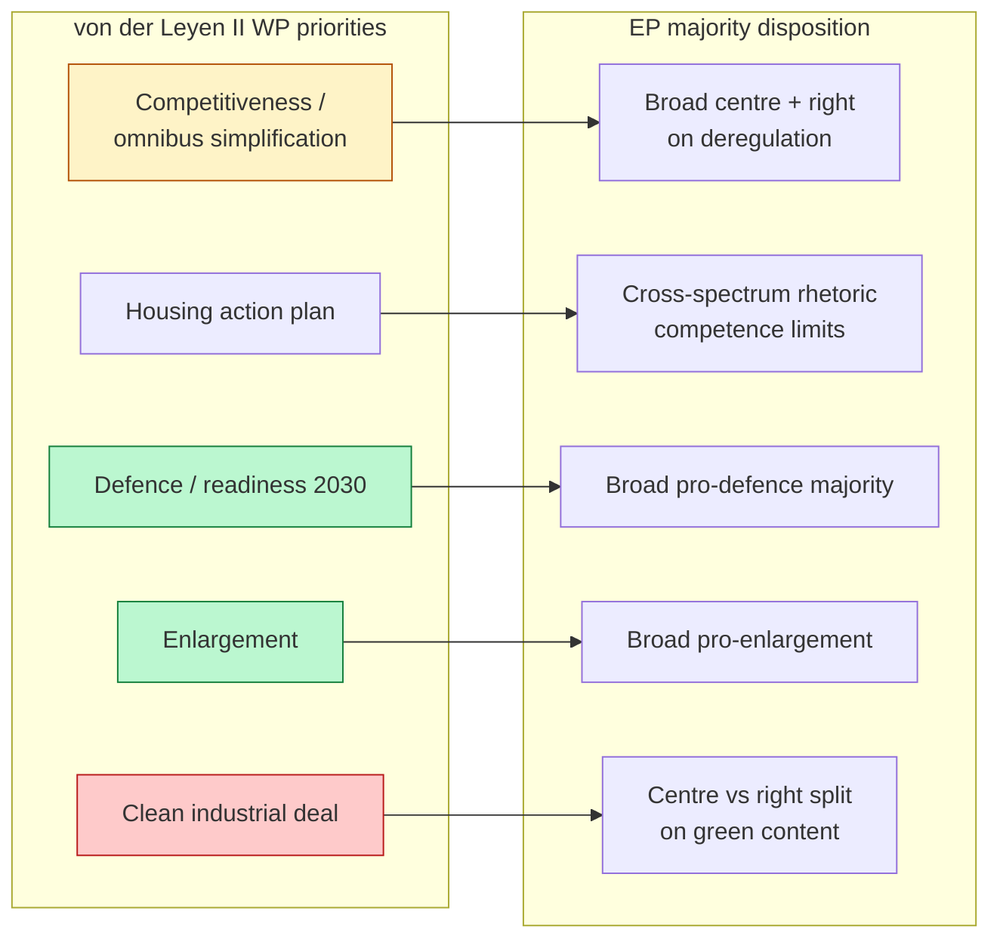
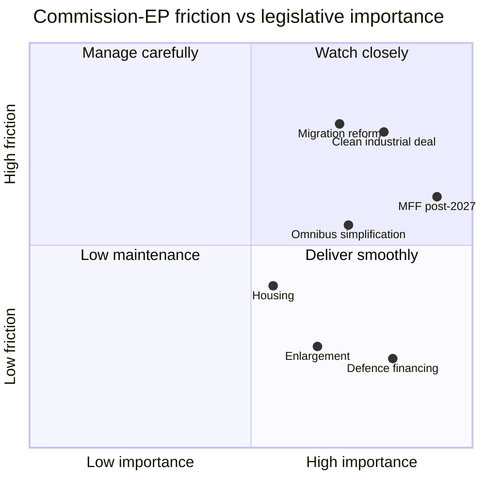

# Commission Work Programme Alignment — EU Parliament Year Ahead 2026-2027

**Date:** 2026-05-30 | **Article Type:** year-ahead | **Horizon:** 2026-05-30 → 2027-05-30
**Methodology:** Commission–Parliament Alignment Analysis + Friction Mapping + WEP Bands
**Data mode:** degraded-feeds (line floors reduced ×0.80)

---

## 1. Bottom Line Up Front

The von der Leyen II Commission has organised the second year of its mandate around a
**competitiveness-and-simplification** spine — the "omnibus" deregulation drive operationalising the
Draghi competitiveness agenda — flanked by **housing**, **defence**, **enlargement** and the **clean
industrial deal**. These priorities map onto EP majorities unevenly. Competitiveness/simplification
and defence command broad assent; the clean industrial deal and any environmental ambition attached to
it expose the central fault line between the grand coalition (EPP–S&D–Renew, ~401 seats) and the
EPP's ad-hoc right-leaning majorities (EPP+ECR+PfE).

**Headline judgement (🟡 MEDIUM):** the Commission and Parliament will **align comfortably** on
defence, enlargement and headline competitiveness, but **friction will concentrate** on (a) the
environmental content of the clean industrial deal, (b) the depth of "omnibus" deregulation, and (c)
migration. Housing is novel and consensual in rhetoric but legally constrained by member-state
competence.

> **Reliability caveat.** The official Commission Work Programme document was **not retrieved** this
> run (feed degradation: `/documents` 404). Priorities below are drawn from the publicly known von der
> Leyen II programme and corroborated against the **51 adopted texts** retrieved for 2026, which show
> the Better Law-Making / competitiveness simplification, housing, Mercosur, defence and digital
> enforcement strands active. Graded accordingly.

---

## 2. Commission Priority → EP Alignment Overview

---

## 3. Priority-by-Priority Alignment

### 3.1 Competitiveness / Omnibus Simplification 🟡 MEDIUM

- **Commission intent:** successive "omnibus" packages cutting reporting burdens (sustainability
  reporting, due diligence, SME relief), operationalising the Draghi report.
- **EP disposition:** the EPP champions deregulation and can build EPP+ECR+PfE+Renew majorities for
  burden-cutting; S&D, Greens and The Left resist rollbacks of corporate-sustainability and
  due-diligence rules.
- **Friction:** *how far* simplification cuts into substantive obligations. Procedural simplification
  passes; **substantive rollback** triggers centre-left resistance and amendment churn.
- **Forecast:** *Likely* (WEP: 70%) that omnibus packages advance, but watered relative to the most
  ambitious deregulatory version.

### 3.2 Housing Action Plan 🟡 MEDIUM

- **Commission intent:** a Commission housing action plan, responding to the EP's first own-initiative
  on affordable housing (in the 2026 adopted texts).
- **EP disposition:** **cross-spectrum rhetorical support** — cost-of-living salience makes housing
  attractive to nearly every group.
- **Friction:** housing is a **member-state competence**; the EU's tools are limited to funding,
  state-aid flexibility, and coordination. Expect ambitious language, modest binding output.
- **Forecast:** *Highly Likely* (WEP: 80%) the action plan and EP own-initiative proceed; *Unlikely*
  (WEP: 25%) they produce major binding instruments in-horizon.

### 3.3 Defence / Readiness 2030 🟢 HIGH alignment

- **Commission intent:** defence-financing instruments, common procurement, EU-level borrowing options
  for defence, Ukraine support via immobilised assets.
- **EP disposition:** the **broadest pro-integration majority** of any file — the centre plus much of
  ECR — opposed mainly by PfE/ESN and parts of The Left.
- **Friction:** mutualised borrowing for defence divides net-contributors; the legal framing of
  immobilised-asset use is delicate.
- **Forecast:** *Highly Likely* (WEP: 80%) defence files advance with comfortable EP majorities; this
  is the **most consensual** Commission-EP track.

### 3.4 Enlargement 🟢 HIGH alignment

- **Commission intent:** accession-chapter momentum for Ukraine, Moldova and the Western Balkans.
- **EP disposition:** broad pro-enlargement majority; the EP is consistently *more* enlargement-eager
  than the Council, where unanimity blocks (e.g. individual member-state vetoes) constrain progress.
- **Friction:** the binding constraint is **Council unanimity**, not EP assent. EP pressure runs ahead
  of what the Council can deliver.
- **Forecast:** *Likely* (WEP: 65%) symbolic and procedural advances; *Unlikely* a major accession
  breakthrough in-horizon given unanimity blocks.

### 3.5 Clean Industrial Deal 🔴 contested

- **Commission intent:** a package combining decarbonisation, industrial competitiveness, and
  state-aid/clean-tech support.
- **EP disposition:** the **central fault line.** EPP+S&D+Renew can back the industrial-competitiveness
  elements; Greens demand stronger climate provisions; ECR/PfE seek to strip environmental conditions.
- **Friction:** the **green content** is the battleground. The EPP's willingness to assemble
  right-leaning majorities on environment files (visible in the 2026 texts on heavy-duty vehicle CO2
  and agriculture) threatens to hollow the climate side.
- **Forecast:** *Roughly Even* (WEP: 50%) that the package advances with meaningful climate content;
  *Likely* it is reshaped towards competitiveness at the expense of ambition.

---

## 4. Alignment-Gap Matrix

| Priority | Commission intent | EP likely position | Gap | Risk |
|----------|-------------------|--------------------|-----|------|
| Omnibus simplification | Procedural + some substantive cuts | Centre-right for; centre-left resists substance | 🟡 MEDIUM | Watered both ways |
| Housing | Action plan + funding | Cross-spectrum rhetoric; competence limits | 🟡 MEDIUM | Symbolic > binding |
| Defence financing | Strong instruments + borrowing | Broad majority; net-contributor caution | 🟢 LOW | Minimal |
| Enlargement | Chapter momentum | EP keener than Council | 🟢 LOW (EP side) | Council unanimity blocks |
| Clean industrial deal | Decarbonisation + competitiveness | Centre split; right strips green | 🔴 HIGH | Climate content gutted |
| Migration ("safe third country") | Pact + reform | EPP right-leaning vs S&D/Greens | 🔴 HIGH | Coalition fracture |

---

## 5. Inter-Institutional Friction Forecast

The **manage-carefully / watch-closely** quadrant — clean industrial deal, migration, MFF, omnibus —
is where the EPP's choice of coalition partner (centre vs right) determines outcomes. The **deliver
smoothly** quadrant — defence, enlargement — is where Commission and Parliament are natural allies.

---

## 6. Economic Backdrop Shaping Alignment

The fiscal environment constrains the ambition the Commission can fund and the EP can endorse. The IMF
projects euro-area anchor economies growing slowly — German real GDP growth of **0.79% in 2026** rising
to **1.18% in 2027**, French growth of **0.86% in 2026**, and Italian growth of just **0.52% in 2026**
— with German inflation at **2.65% in 2026** and a German fiscal deficit of **-3.78% of GDP**. Low
growth and stretched deficits (France at **-4.94% of GDP**, Italy at **-2.82% of GDP** in 2026)
sharpen the competitiveness imperative behind the omnibus drive while limiting fiscal room for the
clean industrial deal and MFF generosity. IMF is the sole authority for these figures.

---

## 7. EP Oversight Leverage Over the Commission

- Parliamentary questions (thousands per year) — the principal scrutiny channel.
- Committee hearings with Commissioners — structured accountability.
- Budget amendments — de facto policy leverage, peaking under the autumn cycle.
- Own-initiative resolutions calling on the Commission to act (housing being the standout example).
- Consent veto on international agreements (Mercosur) and on MFF own-resources.

The Commission retains its **initiative monopoly**: where the EP delays or rejects, the Commission can
slow resubmission, capping the EP's alternative agenda.

---

## 8. Source & Confidence Table (Admiralty-graded)

| Source / evidence | Admiralty grade | Reliability note |
|-------------------|-----------------|------------------|
| EP `/adopted-texts` 2026 (51 texts) | A1 | Corroborates active WP strands |
| von der Leyen II programme (public) | B2 | Known priorities; not feed-verified |
| Commission Work Programme document | F6 | **Not retrieved (feed 404)** |
| EP10 majority structure | B2 | Established public record |
| IMF SDMX WEO (live) | A1 | Economic backdrop |
| `compare_political_groups` partial | C3 | Degraded seat data |

---

## 9. Analytical Confidence Statement

Confidence is **🟡 MEDIUM**. Thematic alignment direction (defence/enlargement easy; clean industrial
deal/migration hard) is well-corroborated by the adopted-texts substance and EP10 structure and is
**🟢 HIGH** at theme level. Specific package timing and amendment outcomes are **🟡 MEDIUM-to-🔴 LOW**
given the absent Work Programme document and degraded procedure feed. Re-grade once the official WP and
`/procedures` feed are restored.

---

*Note: Official Commission Work Programme not retrieved (feed 404); analysis built from public von der
Leyen II priorities, corroborated against 51 adopted texts (2026) and live IMF WEO. Confidence: 🟡
MEDIUM. Run 2026-05-30, horizon 2026-05-30 → 2027-05-30.*
